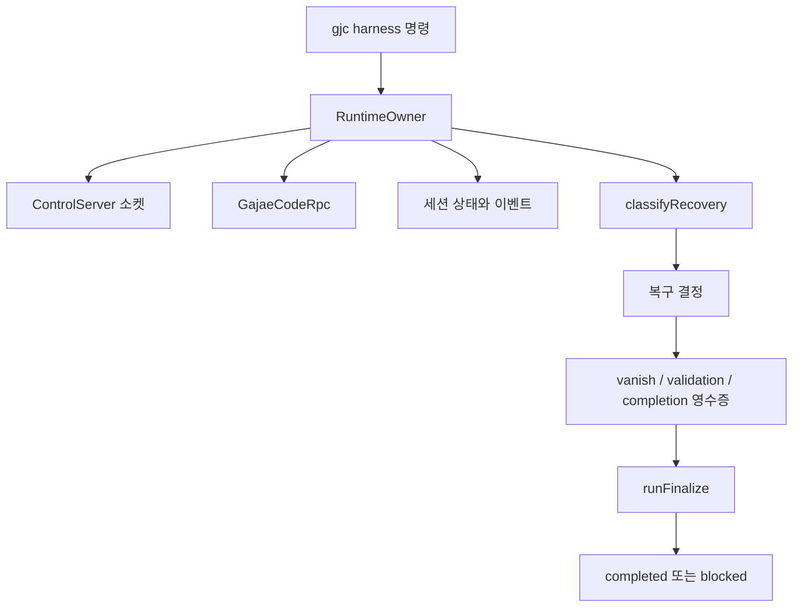
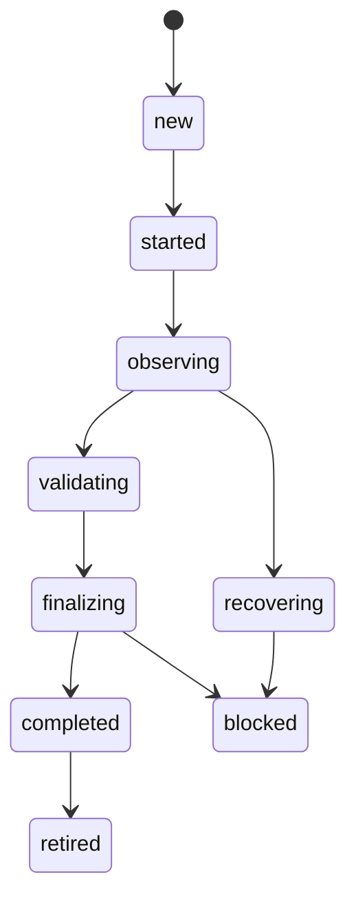

# Platform Integrations

## 개요

`Platform Integrations` 모듈은 `gjc harness`가 외부 실행 환경과 안전하게 연결되도록 하는 제어 계층입니다. 핵심 코드는 `packages/coding-agent/src/harness-control-plane/`에 있으며, 라이브 에이전트 프로세스, Unix 도메인 소켓, `gjc --mode rpc`, Git 상태, `gh`, 검증 명령, 영수증(receipt) 저장소를 하나의 세션 수명주기로 묶습니다.

이 모듈의 중심 목표는 “에이전트가 끝났다고 말했는가”가 아니라 “검증 가능한 증거가 남았는가”입니다. 그래서 세션 완료는 `runFinalize()`가 검증 영수증, 커밋, PR 또는 이슈 아티팩트, 완료 영수증을 모두 확인한 뒤에만 `completed: true`가 됩니다.



## 세션 소유자와 제어 엔드포인트

`RuntimeOwner`는 세션별로 살아 있는 단일 소유자 프로세스입니다. 이 클래스는 다음 책임을 가집니다.

- `SessionLease`를 보유해 단일 writer 권한을 확보합니다.
- `HarnessRpc` 구현체를 통해 실제 `gjc --mode rpc` 하위 프로세스를 제어합니다.
- `ControlServer`를 열어 `submit`, `observe`, `recover`, `validate`, `finalize`, `retire`, `operate` 같은 owner-routed primitive를 처리합니다.
- 이벤트 스트림을 append하는 유일한 writer로 동작합니다.
- heartbeat로 lease를 갱신하고, lease가 빼앗기면 스스로 중지합니다.

`ControlServer`는 `control-endpoint.ts`에 정의되어 있습니다. Unix domain socket 하나를 열고, 클라이언트가 한 줄 JSON 요청을 보내면 한 줄 JSON 응답을 반환합니다.

```ts
export interface EndpointRequest {
	verb: string;
	input: Record<string, unknown>;
}
```

요청은 `RuntimeOwner.#handle()`에서 verb별로 분기됩니다. 예를 들어 `submit`은 `#submit()`, `observe`는 `#observe()`, `recover`는 `#recover()`로 라우팅됩니다. 소켓에 연결할 수 없거나 응답이 오지 않으면 `callEndpoint()`는 `EndpointUnreachableError`를 던지고, CLI 쪽은 owner가 없는 경로로 fallback할 수 있습니다.

`ControlServer.listen()`은 소켓 경로 길이를 `MAX_UNIX_SOCKET_PATH_BYTES`로 제한합니다. 경로가 너무 길면 `socket_path_too_long:<path>` 오류를 냅니다. 현재 FIFO fallback은 코드가 아니라 ADR 후속 작업으로 남아 있습니다.

## Lease: 단일 writer 보장

`session-lease.ts`는 owner 생존성과 writer 권한을 관리합니다. `SessionLease`에는 owner id, pid, endpoint, heartbeat, 만료 시각, `leaseEpoch`가 저장됩니다.

중요한 함수는 다음과 같습니다.

- `acquireLease()`  
  새 lease를 얻거나 죽은 owner의 stale lease를 인수합니다. 다른 owner가 살아 있으면 `LeaseError`의 `lease_held`로 실패합니다.

- `heartbeat()`  
  현재 owner만 lease 만료 시각을 갱신할 수 있습니다.

- `canWriteEvents()`  
  현재 owner가 살아 있고 만료되지 않은 lease holder인지 확인합니다. `RuntimeOwner.#emit()`은 이 검사를 통과해야만 이벤트를 기록합니다.

- `releaseLease()`  
  owner 종료 시 lease를 제거합니다.

- `classifyLeaseStatus()`  
  pid probe와 만료 시각을 조합해 `missing`, `live`, `expiredAlive`, `dead`, `epermAlive` 중 하나로 분류합니다.

- `reapDeadOwnerArtifacts()`  
  죽은 owner의 socket과 lease 파일을 정리합니다. endpoint 경로가 해당 세션 소유 경로인지 `isOwnedUnixEndpointPath()`로 확인한 뒤에만 제거합니다.

이 설계에서 “lease가 만료됨”은 곧바로 파괴적 복구 권한을 의미하지 않습니다. stale owner 인수와 데이터 손실 방지는 분리되어 있으며, 파괴적 복구는 `classifier.ts`, `preserve.ts`, `receipts.ts`의 `vanish` 영수증 검증을 거쳐야 합니다.

## RPC 어댑터와 단일 제출

`rpc-adapter.ts`는 실제 `gjc --mode rpc` 프로세스와 대화하는 계층입니다. 핵심 인터페이스는 `HarnessRpc`입니다.

```ts
export interface HarnessRpc {
	getState(): Promise<RpcStateSnapshot>;
	sendPrompt(prompt: string): Promise<{ commandId: string; ack: boolean }>;
	eventCursor(): number;
	waitForAgentStart(afterCursor: number, timeoutMs: number): Promise<{ cursor: number } | null>;
	close(): Promise<void>;
	onEventFrame?(listener: (frame: Record<string, unknown>) => void): () => void;
	isLive?(): boolean;
	lastFrameAt?(): string | null;
	getLastAssistantText?(): Promise<string | null>;
}
```

`singleFlightAccept()`는 prompt 제출을 “ack를 받았는가”로만 판단하지 않습니다. 다음 조건을 모두 만족해야 `accepted: true`를 반환합니다.

1. 제출 전 `getState()`가 idle 상태여야 합니다.
2. `steeringQueueDepth`와 `followupQueueDepth`가 0이어야 합니다.
3. `sendPrompt()`가 ack를 반환해야 합니다.
4. 제출 전 cursor 이후의 `agent_start` 이벤트가 timeout 안에 도착해야 합니다.

이 때문에 `prompt_accepted` 이벤트는 단순 echo가 아니라 프로토콜 증거입니다. `GajaeCodeRpc`는 JSONL stdout을 읽고, `event` 프레임의 `payload.event_type`이 `agent_start`일 때 내부 cursor와 waiter를 갱신합니다.

## 상태 머신과 응답 계약

`state-machine.ts`는 세션 lifecycle과 primitive 응답 형태를 정의합니다. 모든 primitive는 `{ state, evidence, nextAllowedActions }` 계약을 따릅니다.

주요 lifecycle은 다음 흐름을 가집니다.



`nextAllowedActions()`는 현재 상태에서 가능한 명령과 불가능한 이유를 같이 계산합니다. 예를 들어 `submit`은 다음 조건을 모두 만족해야 available입니다.

- lifecycle이 `started` 또는 `observing`
- terminal 상태가 아님
- blocked 상태가 아님
- live owner가 있음
- RPC가 idle 상태임

`submitUnavailableReason()`은 이 판단을 문자열 이유로 반환합니다. `RuntimeOwner.#submit()`은 lifecycle gate와 RPC gate를 모두 확인한 뒤 `singleFlightAccept()`를 호출합니다.

## 관찰과 복구 분류

`RuntimeOwner.#observeGit()`은 세션 상태, RPC 상태, Git 상태, 최근 이벤트를 합쳐 `Observation`을 만듭니다. 이 관찰값은 `classifyRecovery()`의 입력이 됩니다.

`classifier.ts`의 `classifyRecovery()`는 순수 함수입니다. 입력은 `ClassifyInput`, 출력은 하나의 `RecoveryDecision`입니다. 이 함수의 중요한 불변식은 다음과 같습니다.

- `deleted-worktree`는 항상 `human-check`입니다.
- dirty delta는 절대 `restart-clean`으로 가지 않습니다.
- unknown delta는 파괴적 복구로 가지 않고 `human-check`입니다.
- owner가 살아 있고 validation 실패가 있으면 `validationRepair` 예산에 따라 `continue` 또는 `human-check`가 됩니다.
- owner가 사라진 clean 또는 zero-delta 상태만 `restart-clean` 후보가 됩니다.
- `send-enter`는 이 어댑터에서 지원하지 않으므로 절대 반환하지 않습니다.

복구 결정 중 `restart-clean`, `restart-preserve-delta`, `fallback-codex-exec`는 `requiresVanishBeforeAction()`이 true를 반환합니다. 이 경우 실제 행동 전에 `vanish` 영수증이 먼저 기록되어야 합니다.

## Dirty Worktree 보존

`preserve.ts`의 `preserveDirtyWorktree()`는 dirty 또는 unknown worktree에서 파괴적 복구 전에 실제 보존 증거를 수집합니다.

수집 항목은 다음과 같습니다.

- `git diff HEAD` 결과와 `trackedDiffSha256`
- `git ls-files --others --exclude-standard` 기반 untracked 파일 목록
- 각 untracked 파일의 크기와 sha256
- `git stash create`와 `git stash store`로 만든 복구 가능한 stash commit

이 함수는 working tree를 삭제하거나 reset하지 않습니다. `git stash create`는 working tree를 변경하지 않고 stash commit 객체만 만들며, `git stash store`로 ref를 보존합니다.

`PreserveResult.snapshotComplete`는 추적 변경과 untracked 파일이 모두 캡처되었는지 나타냅니다. unreadable untracked 파일은 버리지 않고 `sha256: "unreadable"`로 manifest에 남깁니다.

## 영수증 모델

`receipts.ts`는 harness 제어 계층의 증거 모델입니다. 모든 receipt는 `ReceiptEnvelope`로 감싸이며, `sha256`은 `sha256` 필드를 제외한 canonical JSON에 대해 계산됩니다.

```ts
export interface ReceiptEnvelope<E = Record<string, unknown>> {
	receiptId: string;
	schemaVersion: number;
	sessionId: string;
	family: ReceiptFamily;
	valid: boolean;
	createdAt: string;
	source: string;
	subject: ReceiptSubject;
	evidence: E;
	artifactHashes: Record<string, string>;
	sha256: string;
}
```

`buildReceipt()`는 envelope을 만들고 hash를 계산합니다. `validateReceipt()`는 다음을 fail-closed로 검증합니다.

- envelope 구조
- schema version
- hash 일치 여부
- family별 evidence 조건

주요 family는 다음과 같습니다.

- `vanish`  
  owner vanish 또는 파괴적 복구 전에 dirty/unknown delta를 보존했음을 증명합니다.

- `prompt-acceptance`  
  idle pre-state, ack, cursor 이후 `agent_start`를 포함한 single-flight acceptance 증거입니다.

- `validation`  
  특정 commit에 대해 실행한 검증 명령과 exit status를 기록합니다.

- `completion`  
  최종 commit, branch, PR/issue artifact, validation receipt id 목록, lifecycle을 기록합니다.

- `review-verdict`  
  review-only 세션의 terminal verdict를 기록합니다.

- `review-failure`  
  review verdict를 얻지 못했을 때 fallback 가능한 실패 증거를 기록합니다.

- `phase-rollup`  
  여러 child task receipt를 하나의 receipt-of-receipts로 압축합니다.

`validateVanish()`는 dirty 또는 unknown delta에서 `restart-clean`, `delete`, `reset`이 `forbiddenActions`에 포함되어야 한다고 강제합니다. 이 검사는 데이터 손실 방지의 핵심입니다.

## Receipt Ingest와 Phase Rollup

`receipt-ingest.ts`의 `ingestReceipts()`는 외부에서 들어온 receipt 목록을 세션 상태에 적용합니다. hash가 맞더라도 다음 경우에는 lifecycle 전이를 허용하지 않습니다.

- `receipt.valid !== true`
- session id가 현재 세션과 다름
- family evidence가 lifecycle target과 모순됨
- `canTransition()`이 허용하지 않는 상태 전이

`completion` receipt는 `completed`로 전이할 수 있습니다. `review-verdict`도 terminal verdict라면 `completed`로 전이할 수 있지만, verdict가 `OWNER_CONFIRMATION_REQUIRED`이면 receipt 자체는 accepted되더라도 세션 완료로 처리하지 않습니다.

`phase-rollup.ts`의 `buildPhaseRollupReceipt()`는 child task receipt들을 `phase-rollup` receipt로 묶습니다. `childPointer()`는 child receipt의 canonical hash, output URI/hash, token 및 ROI 정보를 보존합니다. output URI와 output sha256은 둘 다 있어야 검증 가능한 pointer로 인정됩니다.

## Receipt Spool

`receipt-spool.ts`는 receipt를 JSONL spool 파일에 안전하게 append하는 선택적 경로입니다.

- 환경 변수 이름은 `GJC_RECEIPT_SPOOL_DIR`입니다.
- 파일 이름은 `spool.jsonl`입니다.
- cursor는 `formatReceiptSpoolCursor()`로 12자리 zero-padding 문자열이 됩니다.
- `appendReceiptToSpool()`은 `withFileLock()`과 per-file promise queue를 함께 사용해 append 순서를 안정화합니다.
- crash로 JSONL tail이 찢어진 경우 `readHighestReceiptSpoolCursor()`는 malformed line을 건너뜁니다.

`RuntimeOwner.#withReceiptSpoolFromInput()`은 endpoint input에 spool dir이 들어오면 `withReceiptSpoolDir()` 컨텍스트 안에서 `recover`, `validate`, `finalize`, `operate`를 실행합니다.

## Finalize: 완료 판정

`finalize.ts`의 `runFinalize()`는 구현 세션의 완료 gate입니다. 이 함수는 외부 효과를 `FinalizeChecks`로 주입받기 때문에 단위 테스트와 e2e 테스트에서 fake harness로 검증할 수 있습니다.

```ts
export interface FinalizeChecks {
	runValidation(spec: ValidationCommandSpec): Promise<ValidationRun>;
	resolveCommit(): Promise<string | null>;
	commitOnBranch(commit: string, branch: string): Promise<boolean>;
	prOrIssue(): Promise<{ prUrl: string | null; issueArtifact: string | null }>;
}
```

일반 세션에서 `runFinalize()`는 다음 순서로 동작합니다.

1. `validationCommands`를 실행하고 각 결과를 `validation` receipt로 기록합니다.
2. `requireCommit`이 true이면 현재 commit이 branch에 포함되어 있는지 확인합니다.
3. `requirePr`이 true이면 PR URL 또는 issue artifact가 있는지 확인합니다.
4. 방금 기록한 validation receipt를 다시 읽어 hash와 commit freshness를 재검증합니다.
5. blocker가 없을 때만 `completion` receipt를 기록하고 `completed`를 반환합니다.

`defaultFinalizeChecks()`는 실제 구현체입니다. 검증 명령은 `Bun.spawnSync(["bash", "-lc", spec.command])`로 실행하고, commit과 branch 확인은 `git`, PR 확인은 `gh pr view --json url -q .url`로 수행합니다.

Review-only 세션은 `runReviewFinalize()`로 분기합니다. 이 경로는 구현 검증, commit, PR resolution을 하지 않습니다. 대신 명시적 verdict 또는 `getLastAssistantText()`에서 추출한 closed-vocabulary verdict를 사용해 `review-verdict` receipt를 기록합니다. verdict가 없거나 잘못되면 `review-failure` receipt를 기록하고 `completed: false`를 반환합니다.

## Operate Loop

`operate.ts`의 `operate(goal, opts)`는 owner-driven lifecycle을 한 번에 수행하는 고수준 루프입니다.

흐름은 다음과 같습니다.

1. `singleFlightAccept()`로 goal을 제출합니다.
2. `observe()`로 현재 상태를 관찰합니다.
3. `classifyRecovery()`로 복구 결정을 냅니다.
4. 필요한 경우 `vanish` receipt를 먼저 씁니다.
5. `reinject-prompt`, `restart-clean`, `restart-preserve-delta` 등을 예산 안에서 수행합니다.
6. 명시적인 completion 관찰이 있어야 `runFinalize()`로 넘어갑니다.
7. 완료 증거가 부족하면 `blocked`로 끝납니다.

루프는 `maxIterations`와 `RetryBudget`으로 제한됩니다. 중요한 점은 loop exhaustion이 완료 조건이 아니라는 것입니다. `operate()`는 lifecycle이 `finalizing`으로 관찰되지 않으면 `no-observed-completion` blocker를 반환합니다.

## RuntimeOwner의 이벤트 처리

`RuntimeOwner`는 RPC 프레임을 `observeRpcOutboundFrame()`으로 해석합니다. 의미 있는 semantic frame은 즉시 이벤트로 기록하고, 진행 상황처럼 많은 빈도로 발생하는 frame은 coalescing합니다.

- `#handleFrame()`  
  RPC frame을 semantic signal 또는 coalesced progress로 분류합니다.

- `#flushCoalesced()`  
  누적된 progress frame 수를 `rpc_activity` 이벤트 하나로 기록합니다.

- `#emitMapped()`  
  `rpc_agent_completed`가 들어오면 세션 lifecycle을 `finalizing`으로 바꾸고 이벤트를 기록합니다.

이 구조는 `message_update` 같은 고빈도 frame이 중요한 semantic frame 처리를 굶기지 않도록 설계되어 있습니다.

## CLI와의 연결

call graph 기준으로 `src/commands/harness.ts`는 이 모듈의 주요 진입점입니다.

- `#start`는 `generateSessionId()`, `resolveOwner()`, owner process 시작 경로를 사용합니다.
- `#submit`은 owner가 있으면 endpoint로 라우팅하고, 응답은 `buildResponse()` 계약을 따릅니다.
- `#classify`는 owner-routed verb가 아니므로 `resolveOwnerLive()`를 사용해 live owner 여부를 일관되게 계산합니다.
- `#recoverWithoutOwner`는 `resolveOwner()`, `classifyLeaseStatus()`, `readSessionState()`를 통해 owner vanish 상황을 처리합니다.
- `#events`는 `readEvents()`로 event stream을 조회합니다.
- `#retire`는 `buildResponse()`를 통해 terminal 응답을 구성합니다.

이 모듈은 CLI 명령을 직접 렌더링하는 층이 아니라, CLI가 안전하게 판단할 수 있는 state, evidence, next action 정보를 제공하는 층입니다.

## SSH와 STT 같은 주변 플랫폼 통합

call graph에는 harness control plane 외에도 플랫폼 통합 성격의 코드가 함께 나타납니다.

SSH 쪽에서는 다음 연결이 보입니다.

- `executeSSH()`는 `resolveOutputMaxColumns()`를 사용해 출력 폭 메타데이터를 반영합니다.
- `buildRemoteCommand()`는 `validateKeyPermissions()`를 호출해 SSH key 권한을 확인합니다.
- `sshfs-mount.ts`는 `getControlPathTemplate()`를 사용해 SSH ControlMaster 경로와 연결됩니다.
- `cleanupSshResources()`는 `unmountAll()`과 `closeAllConnections()`로 SDK 종료 시 SSH 리소스를 정리합니다.

STT 쪽에서는 다음 흐름이 보입니다.

- `#startRecording()`은 `startRecording()`과 `showStatus()`를 사용합니다.
- `#stopAndTranscribe()`는 `transcribe()`와 설정 조회 `get()`을 사용합니다.
- `formatDependencyStatus()`는 `check()` 결과를 표시 형태로 바꿉니다.

이 주변 통합들은 harness control plane처럼 receipt 기반 완료 gate를 갖지는 않지만, 같은 `packages/coding-agent` 표면에서 외부 OS 기능, 프로세스, 파일 시스템, 네트워크 도구를 감싸는 역할을 합니다.

## 기여 시 주의할 점

`RuntimeOwner`를 수정할 때는 단일 writer 불변식을 깨뜨리지 않아야 합니다. 이벤트 append는 `#emit()` 경로를 통해 lease 확인 후 수행되어야 하며, 다른 코드가 직접 event stream을 쓰는 구조로 바꾸면 안 됩니다.

`classifyRecovery()`를 수정할 때는 dirty/unknown delta의 파괴적 복구 금지 규칙을 유지해야 합니다. 특히 dirty 상태를 `restart-clean`으로 보내거나 unknown 상태에서 자동 복구를 진행하면 데이터 손실 방지 모델이 깨집니다.

`runFinalize()`를 수정할 때는 완료 판정을 agent text에 의존하게 만들면 안 됩니다. 완료는 validation receipt, commit, PR/issue artifact, completion receipt의 조합으로 증명되어야 합니다.

`validateReceipt()`나 family validator를 완화할 때는 lifecycle 전이까지 영향을 줍니다. hash가 맞는 receipt도 semantic contradiction이 있으면 `ingestReceipts()`에서 거부되어야 합니다.

`GajaeCodeRpc`를 수정할 때는 `singleFlightAccept()`의 프로토콜 의미를 보존해야 합니다. ack만으로 accepted가 되면 submit 중복, 잘못된 owner 상태, 잘못된 recovery 판단으로 이어질 수 있습니다.