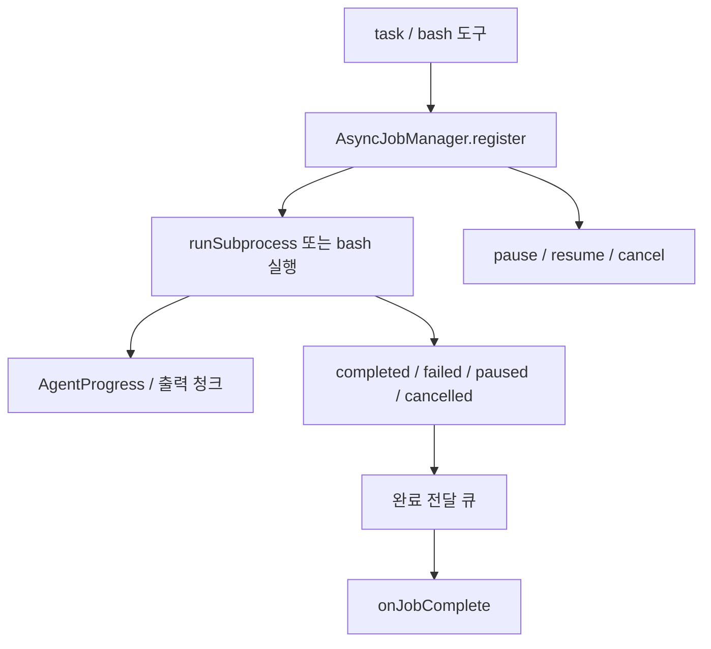

# Subagents and Async Jobs

## 개요

이 모듈은 GJC의 백그라운드 실행과 서브에이전트 실행 제어를 담당합니다. 핵심 축은 두 가지입니다.

- `AsyncJobManager`: 비동기 `bash` 작업과 `task` 작업의 등록, 취소, 출력 보관, 완료 전달, 소유자 범위 정리, 서브에이전트 일시정지/재개를 관리합니다.
- `runSubprocess`: 서브에이전트를 현재 프로세스 안에서 실행하고, `AgentSession` 이벤트를 `AgentProgress`로 변환해 상위 작업과 UI가 진행 상황을 렌더링할 수 있게 합니다.

이 모듈은 단순한 작업 큐가 아니라, 작업 수명 주기와 서브에이전트 제어 평면을 함께 보관합니다. 그래서 `task` 도구, `bash` 도구, 세션 정리, 작업 관찰 UI, 출력 전달 루프가 모두 같은 `AsyncJobManager` 인스턴스를 기준으로 동작합니다.

## 비동기 작업 관리

`packages/coding-agent/src/async/job-manager.ts`의 `AsyncJobManager`는 프로세스 전역 인스턴스를 가질 수 있습니다.

- `AsyncJobManager.setInstance(value)`는 내부 URL 핸들러와 도구들이 공유할 전역 매니저를 설치합니다.
- `AsyncJobManager.instance()`는 현재 전역 매니저를 반환합니다.
- `AsyncJobManager.resetForTests()`는 테스트용으로 전역 인스턴스를 초기화합니다.

작업은 `register(type, label, run, options)`로 등록됩니다. `type`은 `"bash"` 또는 `"task"`이고, `run` 함수는 `{ jobId, signal, reportProgress }`를 받아 `string` 또는 `SubagentRunOutcome`을 반환합니다.

`AsyncJob`의 주요 상태는 다음과 같습니다.

- `running`: 실행 중입니다.
- `completed`: 정상 완료되었습니다.
- `failed`: 예외 또는 오류로 실패했습니다.
- `cancelled`: 취소되었습니다.
- `paused`: 서브에이전트가 안전 지점에서 멈췄으며 재개 가능합니다.

`jobElapsedMs(job, now)`는 `endTime`이 있으면 고정된 경과 시간을 반환합니다. 완료되거나 취소된 작업의 타이머가 계속 증가하지 않게 하는 렌더링용 유틸리티입니다.

## 작업 등록과 수명 주기

`register()`는 동시에 실행 중인 작업 수를 `maxRunningJobs`로 제한합니다. 기본값은 `DEFAULT_MAX_RUNNING_JOBS`, 즉 15개입니다. 제한을 넘으면 예외를 던집니다.

등록 흐름은 다음과 같습니다.

1. 작업 ID를 `#resolveJobId()`로 확정합니다.
2. `AbortController`와 `AsyncJob` 객체를 만듭니다.
3. `run()`을 비동기로 실행합니다.
4. 결과에 따라 상태를 `completed`, `failed`, `cancelled`, `paused` 중 하나로 전환합니다.
5. 완료 또는 실패 결과는 `#enqueueDelivery()`로 전달 큐에 넣습니다.
6. 터미널 상태 작업은 `#scheduleEviction()`으로 일정 시간 뒤 제거됩니다.

`AsyncJobLifecycleCleanup`은 작업의 부가 정리 작업을 단계별로 실행합니다.

- `onCancel`: 취소 요청 시 1회 호출됩니다.
- `onTerminal`: 완료, 실패, 취소 같은 종료 전환에서 1회 호출됩니다.
- `onEvict`: 보존 시간이 지난 뒤 작업이 레지스트리에서 제거될 때 1회 호출됩니다.
- `onTombstonePurge`: 모니터 작업의 tombstone 정리에서 반복 호출 가능하도록 설계된 잔여 정리 훅입니다.

각 단계는 `#runLifecycle()`에서 중복 실행을 막습니다.

## 완료 전달 큐

작업이 완료되면 `AsyncJobManager`는 바로 상위 세션에 결과를 밀어 넣지 않고 `AsyncJobDelivery` 큐에 넣습니다. 실제 전달은 `#runDeliveryLoop()`가 담당하며, 생성자에서 받은 `onJobComplete(jobId, text, job?)` 콜백을 호출합니다.

전달 동작의 핵심 규칙은 다음과 같습니다.

- 전달 텍스트는 `DELIVERY_MAX_TEXT_BYTES`를 넘으면 앞부분과 뒷부분만 남기고 잘립니다.
- 실패한 전달은 `#getRetryDelay()`의 지수 백오프와 지터를 사용해 재시도합니다.
- 재시도 횟수는 `DELIVERY_MAX_ATTEMPTS`로 제한됩니다.
- 큐가 `DEFAULT_MAX_DELIVERY_QUEUE`를 넘으면 오래된 항목은 `#deadLetteredDeliveries`로 이동합니다.
- `watchJobs()` 또는 `acknowledgeDeliveries()`로 억제된 작업은 자동 완료 전달에서 제외됩니다.

`drainDeliveries()`는 전달 큐가 빌 때까지 기다립니다. ACP처럼 특정 소유자 기준으로 전달을 비워야 하는 경로에서는 `filter.ownerId`를 넘겨 소유자 범위만 처리할 수 있습니다.

## 출력 보관과 증분 읽기

`appendOutput(jobId, chunk)`와 `readOutputSince(jobId, offset, filter)`는 백그라운드 프로세스 출력 스트림을 다룹니다.

출력 커서는 UTF-8 바이트 오프셋입니다. 내부적으로는 `AsyncJobOutputChunk`가 `startByte`, `endByte`, `text`를 보관합니다. 이렇게 하면 멀티바이트 문자를 중간에서 잘라 깨뜨리지 않고, `sliceTextFromUtf8ByteOffset()`, `sliceTextAfterUtf8ByteOffset()`, `sliceTextToUtf8ByteLength()`가 코드포인트 경계에 맞춰 문자열을 자릅니다.

보관량은 작업당 `DEFAULT_JOB_OUTPUT_RETENTION_BYTES`입니다. 오래된 청크가 밀려나면 `startOffset`이 전진하고, 너무 오래된 offset으로 읽으면 반환값의 `truncated`가 `true`가 됩니다.

## 소유자 범위와 정리

많은 API는 `AsyncJobFilter`의 `ownerId`를 받습니다. `ownerId`는 `AgentRegistry`의 에이전트 레지스트리 ID입니다. 예를 들어 `"0-Main"`이나 `"3-AuthLoader"` 같은 값입니다.

소유자 범위는 다음 동작을 안전하게 만듭니다.

- `cancel(id, { ownerId })`는 다른 에이전트의 작업을 찾지 못한 것처럼 처리합니다.
- `getRunningJobs(filter)`, `getRecentJobs(filter)`, `getAllJobs(filter)`는 해당 소유자의 작업만 반환합니다.
- `runOwnerCleanups(filter)`는 특정 소유자의 정리 콜백만 실행합니다.
- `cancelAll(filter)`는 특정 소유자가 등록한 실행 중 작업만 취소합니다.

세션 종료 경로에서는 `AgentSession`이 `AsyncJobManager.instance()`를 통해 자기 소유의 비동기 작업을 정리합니다. 이때 `runOwnerCleanups({ ownerId })`가 먼저 실행되어 타이머성 도구가 새 작업을 다시 등록하지 못하게 하고, 이후 `cancelAll({ ownerId })`로 실행 중 작업을 취소합니다.

## 서브에이전트 제어 평면

서브에이전트는 단순한 `AsyncJob`보다 긴 정체성을 가집니다. `AsyncJob`은 보존 시간이 지나면 제거될 수 있지만, `SubagentRecord`는 안정적인 `subagentId`를 기준으로 일시정지와 재개 상태를 보관합니다.

주요 타입은 다음과 같습니다.

- `SubagentRecord`: 서브에이전트의 안정 ID, 현재 작업 ID, 과거 작업 ID, 상태, 세션 파일, 재개 가능 여부, 모델 메타데이터를 담습니다.
- `SubagentLiveHandle`: 실행 중인 서브에이전트에 대한 제어 핸들입니다. `requestPause()`와 `injectMessage()`를 제공합니다.
- `ResumeDescriptor`: 재개에 필요한 불투명 payload입니다. async 계층은 `data`를 해석하지 않습니다.
- `SubagentLifecycle`: `"running"`, `"paused"`, `"queued"`, `"completed"`, `"failed"`, `"cancelled"`입니다.

`pauseSubagent(subagentId, filter)`는 실행 중인 서브에이전트의 live handle을 찾아 `requestPause()`를 호출합니다. 이 요청은 강제 abort가 아니라 안전 지점에서 멈추라는 협력적 요청입니다.

`resumeSubagent(subagentId, filter, message)`는 멈춰 있거나 큐에 있는 서브에이전트를 재개합니다. 동시 실행 제한에 걸리면 상태를 `"queued"`로 바꾸고 `#resumeQueue`에 넣습니다. 슬롯이 비면 `#drainResumeQueue()`가 FIFO 순서로 `#startResume()`을 호출합니다.

`cancelSubagent()`는 서브에이전트의 안정 ID 기준으로 실행 중, 일시정지, 큐 대기 상태를 모두 취소합니다. 일시정지 상태의 세션 파일은 유지되므로, 상태 관리와 실제 세션 파일 삭제는 분리되어 있습니다.

## 서브에이전트 실행

`packages/coding-agent/src/task/executor.ts`의 `runSubprocess(options)`는 이름과 달리 별도 프로세스를 만들지 않습니다. 주석 그대로 “in-process execution”이며, `createAgentSession()`으로 서브에이전트용 `AgentSession`을 만들고 현재 프로세스에서 실행합니다.

`ExecutorOptions`는 실행에 필요한 대부분의 컨텍스트를 담습니다.

- `agent`: 실행할 `AgentDefinition`
- `task`, `assignment`, `description`: 작업 설명과 표시용 정보
- `modelOverride`, `parentActiveModelPattern`: 모델 선택과 인증 fallback 입력
- `sessionFile`, `artifactsDir`, `persistArtifacts`: 세션 지속성 설정
- `eventBus`, `onProgress`: 진행 이벤트 전달 경로
- `skills`, `autoloadSkills`, `promptTemplates`: 서브에이전트 세션에 주입할 확장 컨텍스트
- `forkContextSeed`: 부모 대화 스냅샷을 서브에이전트에 전달할 때 사용합니다.

`createSubagentSettings(baseSettings)`는 부모 설정을 복사하되, 서브에이전트 안에서는 다시 비동기 작업을 자동 생성하지 않도록 `"async.enabled": false`, `"bash.autoBackground.enabled": false`를 설정합니다. `task.serviceTier`가 `"inherit"`이 아니면 서브에이전트 전용 서비스 티어로 `serviceTier`를 덮어씁니다.

## 실행 중 이벤트 처리

`runSubprocess()` 내부의 `processEvent()`는 `AgentSessionEvent` 중 `AgentEvent`를 골라 `AgentProgress`로 변환합니다.

주요 처리 흐름은 다음과 같습니다.

- `tool_execution_start`: 현재 도구 이름, 인자 미리보기, 도구 시작 시간을 기록합니다.
- `tool_execution_update`: 중첩 `task` 도구의 `TaskToolDetails`를 `progress.inflightTaskDetails`에 저장합니다.
- `tool_execution_end`: 최근 도구 목록을 갱신하고, `subprocessToolRegistry.getHandler()`로 도구별 추출 데이터를 수집합니다.
- `message_update`: assistant 텍스트 delta를 최근 출력 미리보기에 반영합니다.
- `message_end`: assistant 출력과 usage를 누적합니다.
- `agent_end`: 최종 assistant 메시지와 pause 여부를 확인합니다.

진행 이벤트는 너무 자주 렌더링되지 않도록 `PROGRESS_COALESCE_MS` 기준으로 병합됩니다. 단, 도구 종료나 agent 종료처럼 상태 변화가 큰 이벤트는 즉시 flush됩니다.

## yield와 출력 확정

서브에이전트는 `yield` 도구로 결과를 제출해야 합니다. `finalizeSubprocessOutput()`은 실행 결과, stderr, `yield` 데이터, `report_finding` 데이터, output schema를 종합해 최종 `SingleResult`에 들어갈 raw output과 exit code를 결정합니다.

중요한 규칙은 다음과 같습니다.

- 마지막 `yield`가 `{ status: "aborted" }`이면 작업은 abort 결과로 정규화됩니다.
- `yield` 데이터가 `null` 또는 `undefined`이면 `SUBAGENT_WARNING_NULL_YIELD`가 출력에 붙습니다.
- output schema가 있으면 `buildOutputValidator()`가 `normalizeSchema()`, `jtdToJsonSchema()`, `validateJsonSchemaValue()`를 사용해 결과를 검증합니다.
- schema 위반은 `schema_violation` payload와 비영 exit code로 변환됩니다.
- `yield`가 없더라도 raw output이 JSON이고 schema를 만족하면 `resolveFallbackCompletion()`이 fallback 완료로 인정할 수 있습니다.
- 정상 종료했지만 `yield`도 유효한 fallback도 없으면 `SUBAGENT_WARNING_MISSING_YIELD`가 붙습니다.

이 설계 때문에 호출자는 “모델이 텍스트를 출력했다”가 아니라 “서브에이전트가 명시적으로 제출한 구조화 결과가 유효하다”를 기준으로 성공을 판단할 수 있습니다.

## 모델 선택과 fallback

`runSubprocess()`는 `normalizeModelPatterns()`로 agent 또는 호출자가 지정한 모델 패턴을 정규화한 뒤, `resolveModelOverrideWithAuthFallback()`을 호출합니다. 요청 모델에 인증이 없으면 부모 세션의 활성 모델로 fallback할 수 있습니다.

fallback 또는 실제 assistant 응답 모델 불일치는 `ModelSubstitutionWarning`으로 기록됩니다. 또한 `AsyncJobManager.instance()?.updateSubagentModel()`을 호출해 `SubagentRecord`에 다음 정보를 패치합니다.

- `requestedModel`
- `effectiveModel`
- `modelFellBack`

이 메타데이터는 서브에이전트 패널이 실제 사용 모델과 fallback 여부를 보여주는 데 사용됩니다.

## 에이전트 정의 로딩

`packages/coding-agent/src/task/agents.ts`는 번들된 agent markdown을 Bun의 `with { type: "text" }` import로 포함합니다. `EMBEDDED_AGENT_DEFS`에는 `executor`, `architect`, `planner`, `critic`, `explore`, `plan`, `reviewer`, 숨김 `task` agent가 들어 있습니다.

주요 함수는 다음과 같습니다.

- `parseAgent(filePath, content, source, level)`: frontmatter와 본문을 파싱해 `AgentDefinition`을 만듭니다.
- `loadBundledAgents()`: 번들 agent를 최초 1회 파싱하고 캐시합니다.
- `getBundledAgent(name)`: 번들 agent를 이름으로 찾습니다.
- `getBundledAgentsMap()`: 이름을 키로 하는 `Map<string, AgentDefinition>`을 만듭니다.
- `clearBundledAgentsCache()`: 테스트용 캐시 초기화입니다.

`buildAgentContent()`는 frontmatter가 별도 객체로 제공된 agent에 대해 `agentFrontmatterTemplate`을 렌더링한 뒤 본문과 결합합니다. 숨김 `task` agent는 여기서 `name`, `description`, `spawns`, `model`, `thinkingLevel`, `hide`를 명시적으로 구성합니다.

## 에이전트 발견과 우선순위

`packages/coding-agent/src/task/discovery.ts`의 `discoverAgents(cwd, home)`는 파일시스템과 플러그인에서 agent 정의를 찾고, 마지막에 번들 agent를 추가합니다.

우선순위는 다음과 같습니다.

1. 프로젝트 설정 디렉터리의 `agents`
2. 사용자 설정 디렉터리의 `agents`
3. GJC가 아닌 Claude plugin roots의 `agents`
4. 번들 agent

같은 이름이 이미 발견되면 뒤쪽 정의는 제외됩니다. 따라서 프로젝트 agent가 사용자 agent와 번들 agent를 덮어쓸 수 있습니다.

`loadAgentsFromDir()`는 `.md` 파일과 심볼릭 링크를 읽고 `parseAgent(..., "warn")`로 파싱합니다. 실패한 파일은 logger warning만 남기고 건너뜁니다.

`filterVisibleAgents()`는 `hide !== true`인 agent만 반환합니다. 숨김 agent는 내부 실행에는 사용할 수 있지만 일반 목록 UI에는 나타나지 않게 할 때 사용됩니다.

## 워크플로 명령 발견

`packages/coding-agent/src/task/commands.ts`는 workflow command를 `WorkflowCommand` 형태로 다룹니다. 현재 제공된 코드에서 번들 명령은 `init.md` 하나이며, `discoverCommands(cwd)`는 capability API의 `slashCommandCapability`를 통해 명령을 로드한 뒤 번들 명령을 보강합니다.

주요 함수는 다음과 같습니다.

- `loadBundledCommands()`: 내장 command markdown을 파싱하고 캐시합니다.
- `discoverCommands(cwd)`: 프로젝트, 사용자, native slash command를 `WorkflowCommand`로 변환합니다.
- `getCommand(commands, name)`: 명령 목록에서 이름으로 찾습니다.
- `expandCommand(command, input)`: 명령 본문의 `$@`를 사용자 입력으로 치환합니다.
- `clearBundledCommandsCache()`: 테스트용 캐시 초기화입니다.

이 파일은 서브에이전트 실행 자체보다 워크플로 진입점 발견에 가깝습니다. 다만 `task` 기반 오케스트레이션에서 사용자가 호출할 수 있는 명령 표면을 구성하므로 같은 모듈 경계에서 이해해야 합니다.

## 백그라운드 지원 플래그

`packages/coding-agent/src/async/support.ts`의 `isBackgroundJobSupportEnabled(settings)`는 현재 항상 `true`를 반환합니다. `settings`는 타입 호환을 위해 받지만 실제로 사용하지 않습니다.

`createAgentSession()`은 이 함수를 통해 백그라운드 작업 지원 여부를 확인합니다. 현재 구현에서는 설정값과 무관하게 백그라운드 작업 기능이 켜져 있다고 보면 됩니다.

## 코드베이스와의 연결

이 모듈은 여러 표면에서 호출됩니다.

- `src/task/index.ts`는 `execute()` 경로에서 `AsyncJobManager.register()`를 호출해 async task를 등록합니다.
- `src/tools/bash.ts`는 백그라운드 bash와 monitor 작업을 등록하고, raw chunk를 `appendOutput()`에 전달하며, `readOutputSince()`로 monitor 출력을 읽습니다.
- `src/session/agent-session.ts`는 세션 종료 시 `runOwnerCleanups()`와 `cancelAll()`로 자기 소유 작업을 정리합니다.
- `src/modes/jobs-observer.ts`와 관련 UI는 `onChange()`, `cancel()`, monitor tombstone API를 통해 작업 상태를 관찰하고 제어합니다.
- `src/task/render.ts`는 `AgentProgress`, `TaskToolDetails`, `SingleResult`를 렌더링해 서브에이전트 진행 상황과 결과를 보여줍니다.
- `src/registry/agent-registry.ts`는 `renderIrcPeerRoster()`에서 live peer 목록을 제공해 서브에이전트 IRC 컨텍스트를 구성합니다.

가장 중요한 연결점은 `AsyncJobManager`가 실행 레지스트리이고, `runSubprocess()`가 실제 서브에이전트 세션 실행기라는 점입니다. `task` 도구는 이 둘을 조합해 “백그라운드에서 실행되지만, 진행 상황과 결과는 상위 세션으로 안전하게 돌아오는” 실행 모델을 만듭니다.

## 기여 시 주의할 점

`AsyncJobManager`를 수정할 때는 작업 상태 전환과 서브에이전트 레코드 상태 전환을 함께 봐야 합니다. 예를 들어 실행 작업이 `paused`가 되면 `AsyncJob`은 보존되어야 하고, `SubagentRecord`는 `paused`로 남아 재개 가능해야 합니다. 반대로 `completed`, `failed`, `cancelled`는 terminal 상태이므로 live handle과 progress를 제거해야 합니다.

전달 큐를 수정할 때는 `watchJobs()`, `acknowledgeDeliveries()`, `isDeliverySuppressed()`의 의미를 유지해야 합니다. 관찰 중인 작업은 자동 완료 메시지를 억제할 수 있고, 이미 acknowledge된 작업도 다시 전달되면 안 됩니다.

`runSubprocess()`를 수정할 때는 `yield` 계약을 깨지 않는 것이 중요합니다. 서브에이전트의 성공 기준은 assistant 텍스트가 아니라 `yield` 또는 schema-valid fallback입니다. 도구 이벤트 처리, progress 병합, abort 처리, session dispose 순서도 상위 UI와 세션 안정성에 직접 영향을 줍니다.

에이전트 정의를 추가하거나 바꿀 때는 `parseAgent()`, `loadBundledAgents()`, `discoverAgents()`의 precedence를 고려해야 합니다. 번들 정의는 최후 fallback이며, 프로젝트나 사용자 정의가 같은 이름으로 존재하면 번들 정의는 사용되지 않습니다.