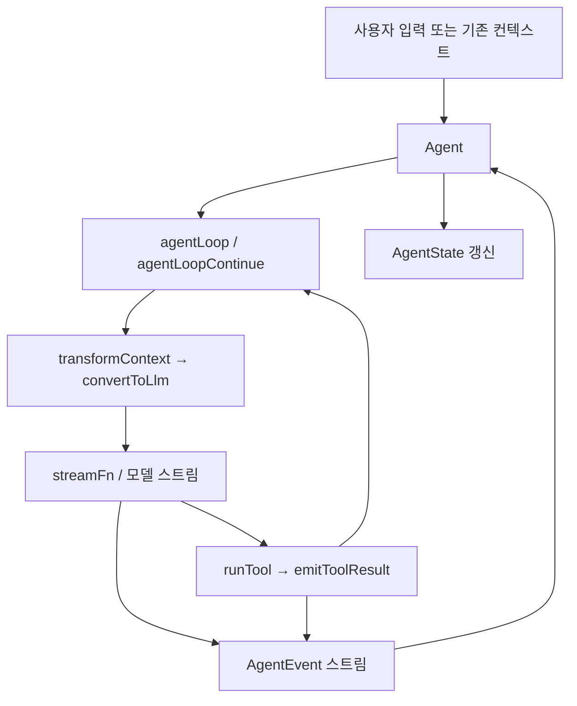

# Support Boundary — Agent Core Runtime

## 역할과 경계

`@gajae-code/agent-core`는 GJC의 에이전트 실행 코어입니다. 모델 호출, 메시지 상태, 도구 실행, 스트리밍 이벤트, 중단/재시도, 컨텍스트 압축, 실행 단위 텔레메트리를 한 패키지에 모읍니다. 상위 CLI인 `packages/coding-agent`는 세션 정책과 UI를 담당하고, 이 패키지는 “한 에이전트 실행이 어떻게 흘러가는가”를 담당합니다.

주요 진입점은 `packages/agent/src/index.ts`에서 다시 내보냅니다.

- `Agent`: 상태ful 래퍼. 세션 코드가 가장 많이 쓰는 API입니다.
- `agentLoop`, `agentLoopContinue`: 저수준 실행 루프.
- `agentLoopDetailed`: 기존 스트림 API에 실행 요약 결과를 붙이는 래퍼.
- `AppendOnlyContextManager`, `StablePrefix`: provider-visible 컨텍스트를 안정적으로 재구성하는 append-only 컨텍스트 계층.
- `streamProxy`: 브라우저/원격 백엔드 프록시 스트림 처리.
- `aggregateAgentRunSummaries`, `aggregateAgentRunCoverage`: 여러 실행 결과 집계.
- `ThinkingLevel`: 에이전트 로컬 reasoning effort 선택자.

## 실행 흐름

가장 중요한 흐름은 `Agent.prompt()` 또는 `Agent.continue()`가 `agentLoop()` / `agentLoopContinue()`를 구동하는 구조입니다.



`Agent`는 실행 전후 상태와 큐를 관리합니다. 실제 모델 호출과 도구 실행 루프는 `agentLoop()`가 맡습니다. 이 분리는 중요합니다. `packages/coding-agent/src/session/agent-session.ts`는 `Agent` 인스턴스를 세션 표면으로 사용하지만, 테스트나 벤치마크는 `agentLoop()`를 직접 호출해 코어 동작을 검증합니다.

## 메시지 모델

코어는 내부 메시지 타입으로 `AgentMessage`를 사용합니다. `AgentMessage`는 표준 LLM 메시지인 `user`, `assistant`, `toolResult`뿐 아니라 앱 전용 메시지도 담을 수 있습니다. LLM에 보낼 때는 `AgentLoopConfig.convertToLlm`이 반드시 provider가 이해하는 `Message[]`로 변환합니다.

일반 패턴은 다음 순서입니다.

```typescript
const config: AgentLoopConfig = {
	model,
	transformContext: async (messages, signal) => {
		return messages.slice(-20);
	},
	convertToLlm: messages => {
		return messages.filter(
			message => message.role === "user" || message.role === "assistant" || message.role === "toolResult",
		) as Message[];
	},
};
```

`transformContext`는 pruning, compaction, 외부 컨텍스트 주입처럼 에이전트 내부 메시지 배열을 다루는 단계입니다. `convertToLlm`은 UI 전용 메시지나 커스텀 메시지를 제거하거나 표준 메시지로 변환하는 최종 경계입니다.

`agentLoopContinue()`는 기존 `context.messages`에서 이어서 실행합니다. 빈 컨텍스트에서는 `"Cannot continue: no messages in context"`를 던지며, 새 사용자 메시지 이벤트를 만들지 않고 assistant 응답부터 방출합니다.

## 이벤트 계약

코어는 UI와 세션 런타임이 반응할 수 있도록 `AgentEvent` 스트림을 방출합니다. 기본 프롬프트 흐름은 다음 이벤트를 포함합니다.

- `agent_start`: 실행 시작
- `turn_start`: 한 번의 모델 호출과 그 결과 도구 실행 묶음 시작
- `message_start`: user, assistant, toolResult 메시지 시작
- `message_update`: assistant 스트리밍 delta
- `message_end`: 메시지 완료
- `tool_execution_start`: 도구 실행 시작
- `tool_execution_update`: 도구 진행 상황 스트림
- `tool_execution_end`: 도구 실행 완료
- `turn_end`: 현재 턴 완료
- `agent_end`: 실행 전체 완료

도구 호출이 있으면 `assistant` 메시지가 `toolCall`을 포함한 상태로 끝나고, `runTool()`이 도구를 실행한 뒤 `emitToolResult()`로 `toolResult` 메시지와 도구 이벤트를 방출합니다. 이후 루프는 tool result를 포함한 컨텍스트로 다음 모델 호출을 이어갑니다.

## `Agent` 클래스

`Agent`는 상태 관리, 큐, 중단, 외부 이벤트 주입을 제공하는 상위 API입니다. 대표적인 상태는 다음과 같습니다.

```typescript
interface AgentState {
	systemPrompt: string[];
	model: Model;
	thinkingLevel: ThinkingLevel;
	tools: AgentTool[];
	messages: AgentMessage[];
	isStreaming: boolean;
	streamMessage: AgentMessage | null;
	pendingToolCalls: Set<string>;
	error?: string;
}
```

주요 메서드는 다음 역할을 가집니다.

- `prompt(...)`: 새 user 메시지를 추가하고 실행을 시작합니다.
- `continue()`: 기존 컨텍스트에서 이어서 실행합니다.
- `abort()`: 현재 실행에 abort signal을 보냅니다.
- `forceAbort(reason)`: provider나 stream 생성이 멈춘 경우에도 busy 상태를 강제로 회복합니다.
- `waitForIdle()`: 현재 실행이 끝날 때까지 기다립니다.
- `subscribe(listener)`: `AgentEvent`를 구독합니다.
- `setSystemPrompt(...)`, `setModel(...)`, `setThinkingLevel(...)`, `setTools(...)`: 실행 설정을 갱신합니다.
- `replaceMessages(...)`, `appendMessage(...)`, `clearMessages()`, `reset()`: 메시지 상태를 조작합니다.
- `steer(...)`, `followUp(...)`: 실행 중 또는 실행 직후 주입할 메시지를 큐에 넣습니다.
- `emitExternalEvent(...)`: SDK나 세션 계층에서 외부 이벤트를 현재 실행에 연결합니다.
- `setMetadataResolver(...)`: provider용 metadata를 늦게 계산하도록 연결합니다.

`packages/coding-agent` 쪽에서는 `createAgentSession()`과 `src/session/agent-session.ts`가 `Agent`를 사용합니다. 예를 들어 세션은 streaming edit 중단 시 `abort()`, retry 복구 시 `emitExternalEvent()`, role별 thinking 조절 시 `Agent` 생성 옵션, context compaction 이후 재개 시 `continue()`를 호출합니다.

## 도구 실행

도구는 `AgentTool`로 정의합니다. `parameters`는 Zod schema이고, `execute(toolCallId, params, signal, onUpdate, context)`가 실제 작업을 수행합니다.

```typescript
const echoTool: AgentTool<typeof schema, { value: string }> = {
	name: "echo",
	label: "Echo",
	description: "입력값을 그대로 반환합니다.",
	parameters: schema,
	async execute(toolCallId, params, signal, onUpdate, context) {
		onUpdate?.({
			content: [{ type: "text", text: "도구 실행 중입니다." }],
			details: {},
		});

		return {
			content: [{ type: "text", text: `echoed: ${params.value}` }],
			details: { value: params.value },
		};
	},
};
```

도구 실패는 content로 성공처럼 반환하지 말고 예외를 던지는 방식이 기본입니다. `agentLoop()`는 예외를 잡아 `isError: true`인 `toolResult`로 변환하고 LLM에 전달합니다.

도구 실행 전후 정책 훅도 있습니다.

- `beforeToolCall`: 도구 실행 전 검사합니다. `{ block: true, reason }`을 반환하면 실행하지 않고 blocked tool result를 만듭니다.
- `afterToolCall`: 실행 결과를 후처리합니다. 반환값으로 `content`, `details`, `isError`를 덮어쓸 수 있습니다.
- `getToolContext`: 같은 assistant 메시지 안의 도구 호출 배치 정보를 `ToolCallContext`로 넘길 수 있습니다.

테스트는 `beforeToolCall`이 args를 변경하면 재검증 없이 `tool.execute`에 전달되는 동작도 고정하고 있습니다. 따라서 이 훅은 정책뿐 아니라 실행 인자 변환 경계로도 쓰입니다.

## steering, follow-up, pause

에이전트는 실행 중 사용자 개입을 별도 큐로 처리합니다.

- `steer(...)`: 실행 중 도구 호출 사이에 끼어드는 메시지입니다.
- `followUp(...)`: 에이전트가 멈추려는 시점에 이어서 실행할 메시지입니다.
- `setSteeringMode(...)`, `setInterruptMode(...)`: steering 처리 방식을 조정합니다.
- `getSteeringMessages`, `getFollowUpMessages`: 저수준 루프에서 큐를 가져오는 설정입니다.
- `shouldPause`: 안전한 경계에서 실행을 멈출지 판단합니다.
- `onBeforeYield`: follow-up을 확인하기 직전에 호출됩니다.

`interruptMode: "immediate"`에서는 도구 하나가 끝난 뒤 steering 메시지가 있으면 남은 도구 호출을 skip 처리할 수 있습니다. 이때 실행되지 않은 도구도 `tool_execution_end`를 방출하지만 결과는 `"Skipped due to queued user message"` 계열의 error result가 됩니다.

`shouldPause`는 도구 실행 자체를 중단하지 않습니다. 현재 도구가 끝난 뒤 safe boundary에서 `agent_end.stopReason`을 `"paused"`로 끝냅니다.

## 중단과 busy 복구

일반적인 중단은 `AbortController`를 통해 provider stream과 도구 실행에 전달됩니다. provider가 abort를 잘 따르지 않거나 stream 생성 자체가 끝나지 않는 경우를 위해 `Agent.forceAbort(reason)`이 있습니다.

`forceAbort`의 보장 사항은 테스트로 고정되어 있습니다.

- stream 생성이 resolve되지 않아도 `isStreaming`을 false로 회복합니다.
- 이후 `prompt()`를 다시 받을 수 있습니다.
- force-aborted run에서 늦게 들어온 provider 이벤트나 external event는 현재 run에 섞이지 않습니다.
- force-aborted run의 `cursorExecHandlers`는 늦게 호출되면 `"inactive agent run"` 오류를 냅니다.
- abort된 streaming turn의 partial thinking/tool-use는 replay history에 남기지 않습니다.

이 동작은 세션 retry, streaming edit 취소, 자동 생성 파일 중단 같은 `packages/coding-agent` 상위 기능의 안정성에 직접 연결됩니다.

## append-only 컨텍스트

`AppendOnlyContextManager`와 `StablePrefix`는 긴 대화에서 provider-visible 컨텍스트를 효율적이고 안정적으로 재구성하기 위한 계층입니다.

`AppendOnlyContextManager`는 메시지 배열을 append-only log처럼 동기화합니다. 메시지가 단순히 뒤에 추가되는 경우 기존 prefix를 유지하고, 중간 내용이 바뀌거나 배열이 짧아지는 compaction/rebase 상황에서는 log를 clear하거나 seeded fork를 rebase합니다. `StablePrefix`는 system prompt와 tools처럼 자주 바뀌지 않는 provider-visible prefix를 fingerprint로 관리하고 snapshot export/import를 지원합니다.

벤치마크는 다음 경로를 측정합니다.

- `packages/agent/bench/append-only-context.ts`: full construction, stable-prefix 재사용, fingerprint export/import
- `packages/agent/bench/append-only-clone.ts`: snapshot export/import와 seeded fork 사이클
- `packages/agent/test/agent-memory-redteam.test.ts`: nested object, array, number, boolean, null rewrite 감지와 compaction shrink 처리

이 계층은 `packages/coding-agent/src/sdk.ts`의 `createAgentSession()`에서 세션 컨텍스트 구성에 사용됩니다.

## compaction 지원

`packages/agent/src/compaction/index.ts`는 압축과 요약 관련 유틸리티를 내보냅니다.

- `compaction.ts`: token estimate, cut point 탐색, compact/generate summary 흐름
- `entries.ts`: session entry와 branch entry 수집
- `messages.ts`: compaction용 메시지 변환과 core message 판별
- `openai.ts`: OpenAI remote compaction 요청과 native history 구성
- `pruning.ts`: pruning notice와 digest 생성
- `branch-summarization.ts`: branch summary용 entry 수집
- `utils.ts`: conversation serialization, file operation list 계산

실행 흐름상 `packages/coding-agent`의 `/context` 계열 명령은 `computeContextBreakdown()`을 거쳐 `estimateMessageTokensHeuristic()`, `estimateTextTokensHeuristic()`, `resolveThresholdTokens()` 같은 compaction 유틸리티를 호출합니다. 자동 압축 흐름은 `#runAutoCompaction`에서 `handoff()`를 거쳐 `metadataForProvider()`와 연결됩니다.

프롬프트 파일은 `packages/agent/src/compaction/prompts/*.md`에 정적 파일로 보관됩니다. 예를 들어 `compaction-summary.md`, `handoff-document.md`, `branch-summary.md`는 압축 결과 형식을 강하게 고정합니다.

## 프록시 스트리밍

`streamProxy`는 브라우저 앱이나 원격 backend를 통해 provider stream을 받을 때 사용하는 유틸리티입니다. 내부적으로 proxy event를 읽어 `AssistantMessageEventStream`에 `push()`하고, JSON streaming 조각은 `parseStreamingJson` 경로로 처리합니다. 비용 계산이 필요한 proxy event는 `calculateCost`와도 연결됩니다.

일반 사용 형태는 `Agent`의 `streamFn`을 바꾸는 방식입니다.

```typescript
const agent = new Agent({
	streamFn: (model, context, options) =>
		streamProxy(model, context, {
			...options,
			authToken,
			proxyUrl,
		}),
});
```

## 실행 텔레메트리와 coverage

실행 단위 집계는 `AgentRunSummary`와 `AgentRunCoverage`로 나뉩니다.

`AgentRunSummary`는 chat, tool, usage, cost, error count를 status와 tool name 기준으로 모읍니다. `AgentRunCoverage`는 다음 목록을 정렬 및 중복 제거한 형태로 제공합니다.

- `toolsAvailable`
- `toolsInvoked`
- `toolsUnused`
- `modelsUsed`
- `providersUsed`

전달 경로는 세 가지입니다.

- `agent_end` 이벤트의 `telemetry` / `coverage`
- `telemetry.onRunEnd(summary, coverage)` 훅
- `agentLoopDetailed(...).detailed()`

여러 실행을 합칠 때는 `aggregateAgentRunSummaries()`와 `aggregateAgentRunCoverage()`를 사용합니다. `onRunEnd` 예외는 성공한 agent run을 실패로 바꾸지 않도록 non-fatal로 처리됩니다.

도구 span에는 `pi.gen_ai.tool.status`가 기록됩니다. 상태 값은 `"ok"`, `"error"`, `"skipped"`, `"blocked"`, `"timeout"`, `"aborted"`이며, `ToolCallBlockedError`는 generic error가 아니라 `"blocked"`로 구분됩니다.

## thinking 선택

`packages/agent/src/thinking.ts`의 `ThinkingLevel`은 agent-local reasoning effort 선택자입니다.

- `"inherit"`: 상위 선택자에 위임합니다.
- `"off"`: reasoning을 끕니다.
- `Effort.Minimal`, `Effort.Low`, `Effort.Medium`, `Effort.High`, `Effort.XHigh`, `Effort.Max`: `@gajae-code/ai/model-thinking`의 effort 값을 그대로 사용합니다.

상위 `packages/coding-agent`에서는 role별 thinking 테스트와 세션 생성 흐름을 통해 이 값을 `Agent` 설정으로 연결합니다.

## 벤치마크와 테스트 표면

이 모듈은 실행 루프, 컨텍스트 구성, 압축 추정의 비용이 중요하므로 벤치마크가 별도로 있습니다.

- `bench/agent-loop-events.ts`: provider stream event가 agent event와 tool execution으로 변환되는 비용 측정
- `bench/append-only-context.ts`: append-only context와 stable prefix 경로 측정
- `bench/append-only-clone.ts`: snapshot export/import와 clone-heavy 경로 측정
- `bench/compaction-estimate.ts`: session entry와 OpenAI item sizing, trim 시나리오 측정

핵심 테스트는 외부 관찰 가능한 계약을 고정합니다.

- `agent-loop.test.ts`: 이벤트 순서, 도구 실행, steering, pause, hook, follow-up
- `agent-force-abort.test.ts`: 강제 중단과 stale event 차단
- `agent-loop-tool-choice-incapability.test.ts`: `toolChoiceIncapability` 비렌더링 처리
- `agent-memory-redteam.test.ts`: append-only context rewrite/rebase 방어
- `run-summary.test.ts`, `compaction-telemetry.test.ts`, `otel.test.ts`: 실행 요약과 telemetry/span 계약

## 기여 시 주의할 점

이 패키지는 상위 CLI의 세션 안정성에 직접 영향을 줍니다. 변경 시에는 API 표면보다 실행 중 상태 전이가 더 중요합니다.

- `Agent`의 busy 상태, abort 상태, stale event 필터링을 바꿀 때는 `agent-force-abort.test.ts` 계약을 먼저 확인합니다.
- `agentLoop()`의 이벤트 순서를 바꿀 때는 UI와 session replay가 영향을 받습니다.
- 도구 실행 정책을 바꿀 때는 `beforeToolCall`, `afterToolCall`, skip, blocked, aborted 상태가 telemetry와 tool result 양쪽에 일관되게 반영되어야 합니다.
- `AgentMessage` 변환 경계는 `transformContext`와 `convertToLlm` 순서를 유지해야 합니다.
- append-only context는 참조 동일성만 믿으면 안 됩니다. nested content rewrite를 값 기반으로 감지해야 합니다.
- compaction prompt는 정적 `.md` 파일로 유지해야 하며, 코드 안에 inline prompt를 새로 만들지 않는 것이 이 저장소의 패턴입니다.