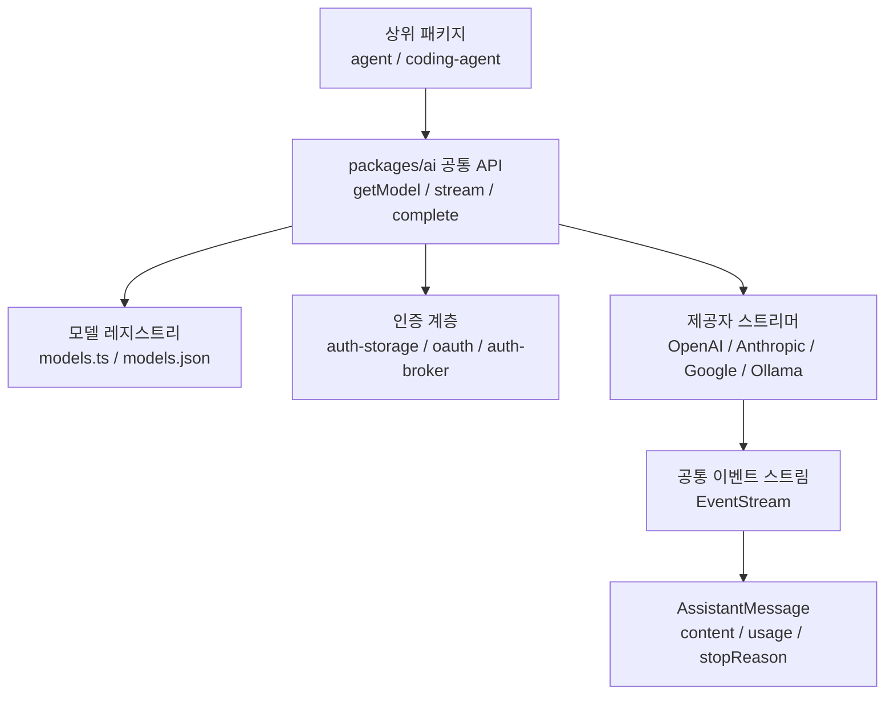

# Support Boundary — AI Provider Layer

## AI 제공자 계층 지원 경계

`packages/ai`는 Gajae-Code가 외부 LLM 제공자와 직접 결합되지 않도록 막아 주는 지원 계층입니다. 상위 패키지는 `getModel()`, `stream()`, `complete()`, `Context`, `Tool`, `AssistantMessage` 같은 공통 인터페이스만 다루고, OpenAI, Anthropic, Google, OpenAI 호환 API, OAuth 기반 제공자, 로컬 추론 서버의 차이는 이 패키지 내부에서 흡수합니다.

이 계층의 핵심 책임은 다음과 같습니다.

- 제공자별 모델 카탈로그를 하나의 `Model` 구조로 노출합니다.
- `Context`와 메시지 블록을 제공자별 요청 형식으로 변환합니다.
- 스트리밍 응답을 `start`, `text_delta`, `toolcall_end`, `done`, `error` 같은 공통 이벤트로 정규화합니다.
- 도구 호출 인자를 Zod 스키마와 `validateToolCall()`로 검증할 수 있게 합니다.
- API 키, OAuth, 토큰 갱신, 원격 인증 브로커를 통합합니다.
- 토큰 사용량과 비용 계산을 `AssistantMessage.usage`와 `calculateCost()` 흐름으로 연결합니다.
- 상위 `packages/agent`와 `packages/coding-agent`가 제공자 구현 세부사항을 몰라도 모델 선택, 로그인, 스트리밍, 도구 호출을 사용할 수 있게 합니다.



## 공개 사용면

패키지의 기본 진입점은 `packages/ai/src/index.ts`이며, `package.json`의 `exports`는 내부 하위 모듈도 필요한 범위에서 노출합니다.

주요 공개 API는 README 기준으로 다음 패턴을 중심으로 사용됩니다.

```ts
import { Context, Tool, complete, getModel, stream, z } from "@gajae-code/ai";

const model = getModel("openai", "gpt-4o-mini");

const tools: Tool[] = [
	{
		name: "get_time",
		description: "현재 시간을 반환합니다.",
		parameters: z.object({
			timezone: z.string().optional(),
		}),
	},
];

const context: Context = {
	systemPrompt: ["개발자를 돕는 어시스턴트입니다."],
	messages: [{ role: "user", content: "지금 몇 시야?" }],
	tools,
};

const response = await complete(model, context);
```

`getModel(provider, modelId)`는 번들 모델 레지스트리에서 특정 모델을 찾습니다. 여러 모델을 열거할 때는 `getProviders()`와 `getModels(provider)`를 사용합니다. 모델 객체에는 `api`, `provider`, `baseUrl`, `input`, `reasoning`, `contextWindow`, `maxTokens`, `cost`, `compat` 같은 실행에 필요한 메타데이터가 들어갑니다.

`stream(model, context, options)`는 제공자별 스트림을 공통 이벤트로 변환합니다. `complete(model, context, options)`는 같은 흐름을 끝까지 소비해 최종 `AssistantMessage`를 반환합니다. 단순 인터페이스인 `streamSimple()`과 `completeSimple()`은 reasoning 옵션을 `reasoning: "minimal" | "low" | "medium" | "high" | "xhigh"` 형태로 통합해 다룹니다.

## 모델 레지스트리와 생성 흐름

모델 데이터는 `packages/ai/src/models.json`에 번들되지만, 이 파일은 직접 수정하지 않습니다. 변경은 descriptor, resolver, generator 쪽에서 수행한 뒤 `bun --cwd=packages/ai run generate-models`로 재생성합니다.

`packages/ai/scripts/generate-models.ts`가 모델 카탈로그를 만드는 중심 흐름입니다.

- `loadModelsDevData()`는 `models.dev` 데이터를 읽어 `mapModelsDevToModels()`로 내부 `Model` 형식에 맞춥니다.
- `PROVIDER_DESCRIPTORS` 중 카탈로그 검색을 지원하는 항목은 `fetchProviderModelsFromCatalog()`가 `createModelManager()`를 통해 온라인 모델 목록을 가져옵니다.
- `fetchAntigravityModels()`와 `fetchCodexDiscoveryModels()`는 OAuth 저장소에서 토큰을 읽어 특수 제공자 모델을 검색합니다.
- 기존 `models.json`은 동적 검색 실패 또는 인증 부재 시 fallback seed로 사용됩니다.
- `applyGeneratedModelPolicies()`, `linkOpenAIPromotionTargets()`, `applyPremiumMultiplierOverrides()`, `applyCodexPricingFallback()` 등이 생성 후 정책을 적용합니다.

이 설계 때문에 모델 추가는 보통 다음 위치 중 하나를 고치는 작업입니다.

- 제공자 descriptor: `src/provider-models/descriptors`
- OpenAI 호환 매핑: `src/provider-models/openai-compat`
- 모델 정책: `src/model-thinking.ts`
- 특수 검색 구현: `src/utils/discovery/*`, `src/providers/*`
- 생성 스크립트: `scripts/generate-models.ts`

`getBundledProviders()`, `getBundledModels()`, `getBundledModel()`은 번들된 레지스트리 조회 경로입니다. `packages/coding-agent`의 모델 선택 테스트와 세션 런타임은 이 조회 함수를 통해 `packages/ai`에 의존합니다.

## 제공자 API 경계

README에 정의된 주요 API 계열은 다음과 같습니다.

- `anthropic-messages`: Anthropic Messages API
- `google-generative-ai`: Google Generative AI API
- `openai-completions`: OpenAI Chat Completions 호환 API
- `openai-responses`: OpenAI Responses API

현재 코드와 README 예시는 이 외에도 `ollama-chat`, `openai-codex-responses`, `azure-openai-responses`, `google-gemini-cli` 같은 모델 API 값을 사용합니다. 즉, 상위 코드는 문자열 API 종류를 직접 분기하기보다 `Model["api"]`로 타입이 좁혀진 제공자별 스트리머와 옵션 타입에 의존해야 합니다.

OpenAI 호환 제공자는 실제 호환성이 조금씩 다릅니다. 이를 위해 `Model`에는 `compat` 필드가 있습니다.

```ts
const model = {
	api: "openai-completions",
	provider: "litellm",
	baseUrl: "http://localhost:4000/v1",
	compat: {
		supportsStore: false,
		maxTokensField: "max_tokens",
	},
};
```

`compat`는 `store` 필드 지원 여부, `developer` role 지원 여부, `reasoning_effort` 지원 여부, 토큰 제한 필드명, 추가 body 필드를 조정합니다. 값이 일부만 지정되면 나머지는 URL 기반 감지 기본값과 병합됩니다.

## 컨텍스트와 메시지 모델

`Context`는 모델 호출의 입력 단위입니다.

- `systemPrompt`: 시스템 프롬프트 문자열 배열
- `messages`: 사용자, assistant, tool result 메시지 목록
- `tools`: 호출 가능한 도구 목록

응답은 `AssistantMessage`로 정규화됩니다. 중요한 필드는 다음과 같습니다.

- `content`: `text`, `thinking`, `toolCall`, `image` 등 블록 기반 콘텐츠
- `usage`: 입력/출력 토큰과 비용 정보
- `stopReason`: `"stop"`, `"length"`, `"toolUse"`, `"error"`, `"aborted"`
- `errorMessage`: 오류 또는 중단 시 메시지

교차 제공자 handoff도 이 메시지 모델을 기준으로 동작합니다. 같은 제공자/API의 assistant 메시지는 가능한 한 보존하고, 다른 제공자로 넘길 때는 thinking 블록을 `<thinking>` 태그가 붙은 텍스트로 변환합니다. 텍스트, 도구 호출, 도구 결과는 공통 블록 구조 덕분에 그대로 이어갈 수 있습니다.

## 스트리밍과 `EventStream`

스트리밍 호출은 제공자별 SSE, JSON, chunk 응답을 공통 이벤트로 바꿉니다. 이벤트 소비자는 제공자 차이를 알 필요 없이 다음 패턴만 처리하면 됩니다.

```ts
const s = stream(model, context);

for await (const event of s) {
	if (event.type === "text_delta") {
		process.stdout.write(event.delta);
	}

	if (event.type === "toolcall_end") {
		const toolCall = event.toolCall;
		// 여기에서 도구를 실행하고 toolResult 메시지를 추가합니다.
	}

	if (event.type === "error") {
		// event.reason은 "error" 또는 "aborted"입니다.
	}
}

const finalMessage = await s.result();
```

내부 유틸리티인 `EventStream`은 `push()`, `end()`, `fail()`, `result()` 흐름을 제공합니다. `packages/agent`의 `createAgentStream()`, `emitToolResult()`, `runLoopBody()`가 이 스트림에 의존해 에이전트 루프 이벤트를 구성합니다. 즉, `EventStream`은 `packages/ai` 내부 구현을 넘어 상위 에이전트 런타임의 스트리밍 계약에도 영향을 줍니다.

`bench/event-stream.ts`는 세 가지 시나리오를 측정합니다.

- 생산자가 먼저 많은 이벤트를 밀어 넣고 소비자가 기다리는 경우
- 소비 전에 실패하는 경우
- 소비 전에 완료되는 경우

`bench/sse.ts`는 `readSseEvents()`와 `readSseJson()`을 다양한 chunk 크기와 대량 이벤트에서 검증합니다. provider 스트리밍 파서나 SSE 처리 경로를 수정할 때는 이 벤치가 회귀 단서를 줍니다.

## 도구 호출과 스키마 검증

도구 정의는 `Tool`과 Zod 스키마를 사용합니다.

```ts
import { Tool, validateToolCall, z } from "@gajae-code/ai";

const weatherTool: Tool = {
	name: "get_weather",
	description: "지정한 위치의 날씨를 조회합니다.",
	parameters: z.object({
		location: z.string(),
		units: z.enum(["celsius", "fahrenheit"]).default("celsius"),
	}),
};
```

스트리밍 중 도구 인자는 `toolcall_delta` 이벤트에서 부분 JSON으로 들어올 수 있습니다. 이때 `event.partial.content[event.contentIndex].arguments`는 best-effort 파싱 결과이므로 필드가 없거나 문자열이 중간에서 잘릴 수 있습니다. 실제 실행은 `toolcall_end` 이후 `validateToolCall(tools, toolCall)`로 검증한 뒤 수행하는 것이 안전합니다.

`packages/coding-agent` 쪽에서는 MCP 도구 스키마 정규화 경로가 `normalizeSchemaForMCP()`와 연결됩니다. 따라서 `packages/ai`의 schema normalization은 단순한 provider payload 문제가 아니라 실제 도구 활성화와 MCP bridge 계약에도 영향을 줍니다.

## 인증과 OAuth 경계

인증은 세 층으로 나뉩니다.

첫째, 호출 옵션의 `apiKey`는 가장 직접적인 override입니다.

```ts
await complete(model, context, {
	apiKey: "sk-live",
	headers: { "X-Debug-Trace": "true" },
});
```

둘째, Node.js 환경에서는 `getEnvApiKey(provider)`가 제공자별 환경 변수를 확인합니다. 예를 들어 OpenAI는 `OPENAI_API_KEY`, Anthropic은 `ANTHROPIC_API_KEY` 또는 OAuth 토큰 계열, GitHub Copilot은 `COPILOT_GITHUB_TOKEN`, `GH_TOKEN`, `GITHUB_TOKEN`을 확인합니다.

셋째, OAuth 제공자는 `loginAnthropic()`, `loginGitHubCopilot()`, `loginGeminiCli()`, `loginAntigravity()`, `loginXai()` 같은 로그인 함수와 `getOAuthApiKey()`를 통해 토큰을 얻습니다. `getOAuthApiKey(provider, credentialsMap)`는 만료된 토큰을 갱신하고 새 credential을 반환할 수 있으므로, 호출자는 갱신된 credential을 다시 저장해야 합니다.

`auth-broker` 하위 모듈은 원격 인증 저장소와 snapshot stream을 위한 경계를 제공합니다. `wire-schemas.ts`는 Zod `.strict()` 객체 스키마로 broker 요청과 응답을 검증합니다. OAuth snapshot에서는 refresh token이 `REMOTE_REFRESH_SENTINEL`로 치환되며, writable credential에는 이 sentinel 값이 들어오지 못하도록 막습니다. 이 제약은 원격 snapshot을 다시 write payload로 잘못 보내 OAuth credential을 깨뜨리는 상황을 방지합니다.

## 상위 패키지와의 연결

`packages/ai`는 독립 LLM SDK처럼 보이지만, 실제로는 Gajae-Code 런타임의 지원 경계입니다.

`packages/agent`는 다음 흐름에서 이 패키지를 사용합니다.

- `createAgentStream()`이 `EventStream` 기반으로 에이전트 루프 스트림을 만듭니다.
- `emitToolResult()`가 도구 결과를 스트림에 push합니다.
- `runLoopBody()`와 관련 루프가 `result()`와 `end()` 계약에 의존합니다.
- proxy 경로는 `calculateCost()`와 provider stream을 통해 사용량을 계산합니다.

`packages/coding-agent`는 다음 흐름에서 이 패키지를 사용합니다.

- 모델 선택과 session manager가 `getBundledModel()`을 호출합니다.
- provider onboarding UI가 `getOAuthProviders()`를 호출합니다.
- session storage가 `SqliteAuthCredentialStore`, `AuthStorage`, `listAuthCredentials()`를 통해 credential 상태를 관리합니다.
- MCP tool bridge가 schema normalization 유틸리티에 의존합니다.
- Cursor/OpenAI native history 경로가 provider별 signature parsing과 메시지 변환을 사용합니다.

따라서 `packages/ai` 변경은 단순히 LLM 호출 코드만 바꾸는 일이 아닙니다. 모델 레지스트리, 인증 저장소, 도구 스키마, 스트리밍 이벤트의 작은 변경도 CLI 모델 선택, 로그인 UI, agent loop, MCP 도구 활성화, 비용 표시까지 전파될 수 있습니다.

## 벤치와 보조 스크립트

`bench/_meta.ts`의 `benchRunMetadata()`는 벤치 결과에 git sha, 날짜, OS, CPU, Bun/Node 버전, native package 버전을 붙입니다.

`bench/model-registry.ts`는 모델 레지스트리 성능을 두 방식으로 측정합니다.

- fresh child process에서 cold import 비용 측정
- in-process에서 provider 열거, 단일 모델 조회, 반복 조회 비용 측정

`bench/sse.ts`와 `bench/event-stream.ts`는 스트림 처리량과 오류/중단 동작을 측정합니다.

`scripts/cursor-log.py`는 Cursor debug JSONL 로그를 사람이 읽기 쉬운 형태로 필터링합니다. `textDelta`는 coalesce하고, heartbeat, partial tool call, KV blob, checkpoint 같은 노이즈는 숨깁니다.

`scripts/proto-extractor.py`는 번들된 JavaScript protobuf 산출물에서 message, enum, service 정의를 복원해 `.proto` 형태로 출력합니다. provider나 Cursor 통합처럼 생성 코드 구조를 추적해야 할 때 보조 도구로 쓰입니다.

## 변경 시 주의할 점

모델 데이터는 `src/models.json`을 직접 편집하지 말고 generator 입력과 정책을 수정한 뒤 재생성해야 합니다.

제공자 스트리머를 수정할 때는 공통 이벤트 계약을 유지해야 합니다. 특히 `toolcall_delta`의 부분 인자, `toolcall_end`의 완성 인자, `error` 이벤트의 partial message, `result()`의 최종 메시지 동작은 상위 agent loop가 의존합니다.

OAuth credential 구조를 바꿀 때는 `auth-storage`, `auth-broker/wire-schemas.ts`, `utils/oauth/*`, `getOAuthApiKey()` 호출자를 함께 확인해야 합니다. refresh token sentinel과 snapshot write 검증은 보안 및 계정 복구성에 직접 연결됩니다.

도구 스키마 변환을 바꿀 때는 provider payload뿐 아니라 `packages/coding-agent`의 MCP schema normalization 경로도 확인해야 합니다.

OpenAI 호환 제공자를 추가할 때는 `compat` 기본값, `baseUrl`, API 키 환경 변수, 모델 discovery 가능 여부, `supportsStore`, `supportsDeveloperRole`, `maxTokensField`를 명시적으로 검토해야 합니다.

## 권장 검증

`packages/ai` 안에서 집중 변경을 했다면 먼저 패키지 단위 검증을 실행합니다.

```bash
bun --cwd=packages/ai test
bun --cwd=packages/ai run check
```

모델 정의나 default surface를 바꿨다면 생성과 게이트를 함께 확인합니다.

```bash
bun --cwd=packages/ai run generate-models
bun scripts/check-visible-definitions.ts
bun scripts/verify-g002-gates.ts
bun scripts/rebrand-inventory.ts --strict
bun test packages/coding-agent/test/default-gjc-definitions.test.ts
```

스트리밍이나 SSE 파서 성능에 영향을 주는 변경은 벤치로 회귀를 확인합니다.

```bash
bun packages/ai/bench/event-stream.ts
bun packages/ai/bench/sse.ts
bun packages/ai/bench/model-registry.ts
```

`packages/ai`는 외부 제공자와 내부 에이전트 런타임 사이의 완충 계층이므로, 변경의 성공 기준은 “한 provider에서 동작한다”가 아니라 “공통 `Model` / `Context` / `AssistantMessage` / `EventStream` 계약을 깨지 않고 상위 agent와 coding-agent가 동일한 방식으로 계속 사용할 수 있다”입니다.