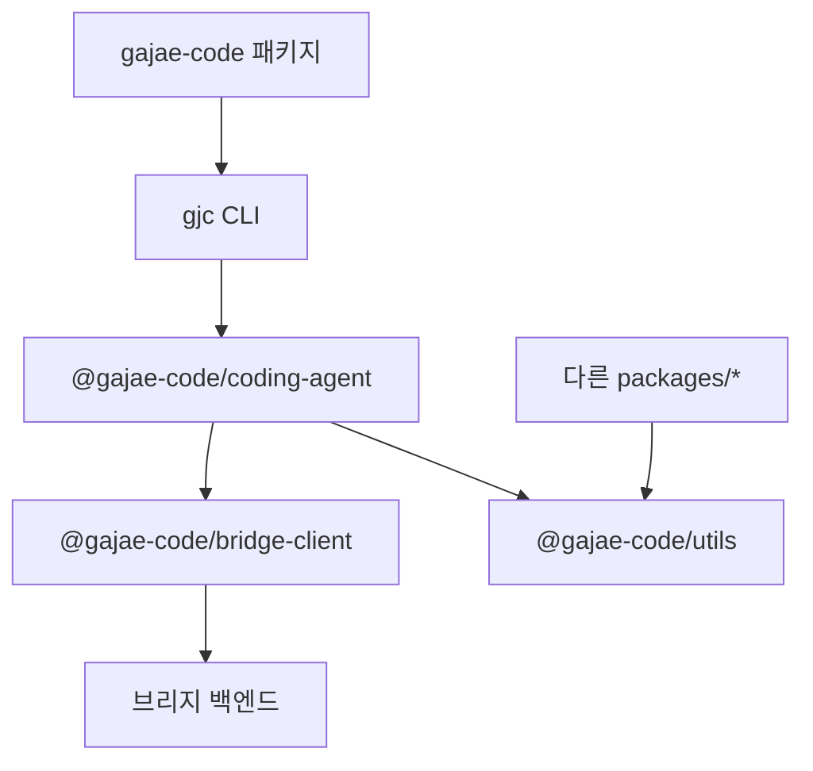

# Support Boundary — Bridge and Shared Utilities

## 지원 경계: 브리지와 공유 유틸리티

이 모듈 경계는 GJC의 핵심 `packages/coding-agent/`가 외부 인터페이스와 공통 런타임 기능을 재사용할 수 있도록 분리한 지원 계층입니다. 크게 세 부분으로 나뉩니다.

- `@gajae-code/bridge-client`: GJC 백엔드 브리지 프로토콜을 호출하는 TypeScript 클라이언트 SDK입니다.
- `@gajae-code/utils`: 환경 변수, 스트림, 재시도, 경로, 로깅, 프로세스 정리, 텍스트 정리 같은 공유 유틸리티입니다.
- `gajae-code`: 사용자가 `gjc` CLI를 짧은 패키지 이름으로 설치할 수 있게 하는 얇은 npm 래퍼입니다.

이 경계의 역할은 제품 동작을 직접 소유하는 것이 아니라, CLI와 런타임이 의존하는 안정적인 공통 표면을 제공하는 것입니다. 브리지 클라이언트는 외부 제어면과 통신하고, 유틸리티 패키지는 여러 패키지에서 반복되는 저수준 처리를 한곳에 모읍니다.



## 브리지 클라이언트 패키지

`packages/bridge-client`는 `@gajae-code/bridge-client`로 배포됩니다. `BridgeClient` 클래스가 핵심 진입점이며, `src/index.ts`에서 명령 전송, 이벤트 스트림 연결, 컨트롤러 소유권 요청, UI 응답, 호스트 도구 결과, 워크플로 게이트 응답을 담당합니다.

패키지는 `src/index.ts`를 `main`, `types`, `exports["."]`로 노출하고, 세부 모듈도 `./*` 경로로 공개합니다. 공개 표면은 다음 파일에서 구성됩니다.

- `commands.ts`: 브리지 명령 타입과 헬퍼 인터페이스
- `index.ts`: `BridgeClient`, 핸드셰이크 타입, 브리지 권한/스코프 타입
- `reference-consumer.ts`: 브리지 프레임 렌더링용 참조 소비자
- `workflow-gate.ts`: `workflow_gate` 타입, 타입 가드, 응답 resolver 타입

### 연결 보안과 초기화

`BridgeClient` 생성자는 `BridgeClientOptions`를 받습니다.

```ts
const client = new BridgeClient({
	baseUrl: "https://bridge.example",
	token: "secret",
});
```

생성자는 bearer token이 평문 HTTP로 전송되는 것을 막습니다. `https:`가 아닌 URL은 기본적으로 거부되며, `http://localhost`, `http://127.0.0.1`, `http://[::1]`도 `allowInsecureLocalhost: true`가 없으면 거부됩니다. 이 동작은 `bridge-client.test.ts`의 “refuses bearer tokens over non-HTTPS except explicit localhost opt-in” 테스트가 고정합니다.

요청은 모두 `#request()`를 거칩니다. 이 메서드는 상대 경로를 `#baseUrl`에 붙이고 `Authorization: Bearer <token>` 헤더를 추가한 뒤 주입된 `fetch` 또는 전역 `fetch`를 호출합니다. JSON 응답이 필요한 호출은 `#json()`이 감싸며, `response.ok`가 아니면 `Bridge request failed: <status>` 오류를 던집니다.

### 핸드셰이크

`handshake()`는 `/v1/handshake`로 `POST`를 보냅니다. 요청 타입은 `BridgeHandshakeRequest`입니다.

주요 필드는 다음과 같습니다.

- `protocol_version_range`: 클라이언트가 지원하는 프로토콜 버전 범위
- `capabilities`: `"events"`, `"prompt"`, `"workflow_gate"` 같은 기능 목록
- `requested_scopes`: `"prompt"`, `"control"`, `"bash"` 같은 요청 권한
- `last_seq`: 이벤트 재개 시 사용할 마지막 sequence
- `unattended`: 무인 실행 선언을 담는 `UnattendedDeclaration`

응답은 `BridgeHandshakeAccepted` 또는 `BridgeHandshakeRejected`입니다. accepted 응답에는 협상된 기능, 권한, 엔드포인트, 프레임 타입, 선택적인 `accepted_unattended`가 포함됩니다.

### 명령 전송

낮은 수준 명령 전송은 `command(command, sessionId, idempotencyKey)`가 담당합니다. URL은 `/v1/sessions/{sessionId}/commands`이며, `sessionId`는 `encodeURIComponent()`로 인코딩됩니다. 헤더에는 `Content-Type: application/json`과 `Idempotency-Key`가 들어갑니다.

`BridgeClientCommand`는 `commands.ts`의 `BRIDGE_CLIENT_COMMAND_TYPES`에 정의된 타입 문자열을 사용합니다. 현재 포함된 명령에는 `prompt`, `steer`, `follow_up`, `abort`, `bash`, `set_model`, `compact`, `handoff`, `login`, `negotiate_unattended` 등이 있습니다.

대부분의 공개 헬퍼는 내부 `#command()`를 통해 같은 형태로 요청을 보냅니다.

```ts
await client.prompt("sess-1", "안녕하세요", {
	idempotencyKey: client.createIdempotencyKey("prompt"),
});

await client.setModel("sess-1", "openai", "gpt-5.5");

await client.bash("sess-1", "pwd");
```

`prompt()`, `steer()`, `followUp()`, `bash()`, `getState()`, `getMessages()`처럼 직접 `command()`를 호출하는 메서드도 있고, `abort()`, `setTodos()`, `setAutoRetry()`, `switchSession()`처럼 `#command()`를 공유하는 메서드도 있습니다. `options.idempotencyKey`가 없으면 `createIdempotencyKey(prefix)`가 `prefix-<crypto.randomUUID()>` 형식으로 키를 생성합니다.

### 이벤트 스트림

`events(sessionId, lastSeq?)`는 `/v1/sessions/{sessionId}/events`에 연결하고 `AsyncGenerator<BridgeFrame>`을 반환합니다. `lastSeq`가 있으면 `?last_seq=<number>`가 붙습니다.

구현 흐름은 다음과 같습니다.

1. `connectEvents()`가 GET 요청을 보냅니다.
2. 응답이 실패하면 `Bridge event stream failed: <status>` 오류를 던집니다.
3. 응답 body에서 reader를 얻습니다.
4. `TextDecoder`로 chunk를 누적합니다.
5. `parseSseData()`가 `data: ...` 줄을 JSON으로 파싱해 `BridgeFrame`으로 반환합니다.
6. 종료 시 reader를 `cancel()`하고 lock을 해제합니다.

`parseSseData()`는 `\r\n`을 `\n`으로 정규화하고 빈 줄 경계(`\n\n`) 단위로 SSE block을 처리합니다. 이 구현은 브리지 프레임이 `data: <json>` 형태로 전달된다는 전제에 맞춰져 있습니다.

### 컨트롤, UI 응답, 호스트 결과

컨트롤러 소유권과 UI 응답은 owner token 헤더를 사용합니다.

- `claimControl(sessionId, ownerToken?)`: `/control:claim`
- `disconnectControl(sessionId, ownerToken)`: `/control:disconnect`
- `respondToUiRequest(sessionId, correlationId, ownerToken, response, idempotencyKey?)`: `/ui-responses/{correlationId}`

`respondToHostTool()`과 `respondToHostUri()`는 각각 호스트 도구 결과와 URI 결과를 보냅니다.

- `/host-tool-results/{correlationId}`
- `/host-uri-results/{correlationId}`

두 메서드 모두 JSON body와 `Content-Type: application/json`을 사용합니다.

### 워크플로 게이트

`workflow-gate.ts`는 브리지에서 들어오는 `workflow_gate` 프레임을 타입으로 표현합니다.

핵심 타입은 다음과 같습니다.

- `WorkflowGateStage`: `"deep-interview" | "ralplan" | "ultragoal"`
- `WorkflowGateKind`: `"question" | "approval" | "execution"`
- `WorkflowGate`: 게이트 ID, 단계, 종류, schema, schema hash, 선택지, context, 생성 시각, required flag
- `WorkflowGateResponse`: `gate_id`, `answer`, 선택적 `idempotency_key`
- `WorkflowGateResolver`: 게이트를 받아 답변을 반환하는 콜백

`isWorkflowGateFrame(frame)`은 다음 조건을 검사합니다.

- `frame.type === "workflow_gate"`
- payload가 객체
- `payload.type === "workflow_gate"`
- `gate_id`, `stage`, `kind`, `schema_hash`, `created_at`이 올바른 형태
- `required === true`
- `schema` 필드 존재
- `context`가 null이 아닌 객체
- `options`가 없거나 배열

`BridgeClient.respondGate()`는 게이트 답변을 기존 UI 응답 엔드포인트로 보냅니다. 요청 경로는 `/v1/sessions/{sessionId}/ui-responses/{gateId}`이고, body는 `{ gate_id, answer, idempotency_key }` 형태입니다. `ownerToken`은 `X-GJC-Bridge-Owner-Token` 헤더로 전달됩니다.

`consumeWorkflowGates()`는 headless 정책 구현입니다. 이벤트 스트림을 순회하면서 `isWorkflowGateFrame()`으로 게이트만 골라내고, `WorkflowGateResolver`에 전달한 뒤 `respondGate()`로 답변을 게시합니다. 처리한 항목은 `{ gate, answer }`로 yield합니다.

```ts
for await (const handled of client.consumeWorkflowGates("sess-1", "owner-token", gate => ({
	decision: gate.kind === "approval" ? "approve" : "continue",
}))) {
	// 처리된 게이트와 응답을 기록할 수 있습니다.
	console.log(handled.gate.gate_id, handled.answer);
}
```

### 참조 브리지 소비자

`reference-consumer.ts`는 브리지 프레임을 간단한 semantic HTML로 렌더링하는 참조 구현입니다. 운영 UI 구현이라기보다, 브리지 소비자가 프레임을 어떻게 해석할 수 있는지 보여주는 최소 소비자입니다.

`BridgeFrame<TPayload>`는 모든 브리지 프레임의 공통 형태입니다.

- `protocol_version`
- `session_id`
- `seq`
- `frame_id`
- 선택적 `correlation_id`
- `type`
- `payload`

`renderBridgeFrame(frame)`은 payload 요약을 만들고 HTML을 반환합니다. 요약은 `payloadSummary()` 규칙을 따릅니다.

- `payload.event_type`이 문자열이면 그것을 사용
- `payload.kind`가 문자열이면 그것을 사용
- `payload.command`가 문자열이면 그것을 사용
- 그 외 객체는 `JSON.stringify(payload)`
- 원시값은 문자열화

출력 HTML은 `escapeHtml()`을 거치므로 frame type, correlation id, payload 요약의 `<`, `>`, `"`, `'`, `&`가 escape됩니다. `ReferenceBridgeConsumer`는 `consume(frame)`으로 렌더링 결과를 누적하고 `renderDocument()`로 전체 HTML 문서를 반환합니다.

## 공유 유틸리티 패키지

`packages/utils`는 `@gajae-code/utils`로 배포됩니다. `src/index.ts`가 대부분의 유틸리티를 barrel export합니다. 이 패키지는 `@gajae-code/natives`, `beautiful-mermaid`, `handlebars`, `winston`, `winston-daily-rotate-file`에 의존하며, CLI와 여러 내부 패키지에서 재사용되는 공통 기반입니다.

주요 공개 모듈은 다음 범주로 나뉩니다.

- 취소와 비동기 제어: `abortable.ts`, `async.ts`
- 환경 변수와 실행 환경: `env.ts`, `spawn-env.ts`, `dirs.ts`
- 네트워크 재시도: `fetch-retry.ts`
- 스트림과 텍스트 처리: `stream.ts`, `sanitize-text.ts`, `peek-file.ts`
- 로깅과 종료 처리: `logger`, `postmortem.ts`, `safe-stderr.ts`
- 파일/경로/임시 리소스: `temp`, `glob`, `fs-error`, `which`
- CLI와 포맷: `format`, `frontmatter`, `json`, `prompt`, `mermaid-ascii`
- 자료구조와 식별자: `RingBuffer`, `Snowflake`
- 프로세스 실행: `ptree`, `procmgr`

### 취소와 타임아웃

`AbortError`는 이미 abort된 `AbortSignal`을 받아 `Aborted: <reason>` 메시지를 가진 표준 오류로 감쌉니다. 생성자는 `assert(signal.aborted)`로 잘못된 사용을 방지합니다.

`createAbortableStream(stream, signal?)`은 signal이 없으면 원본 stream을 그대로 반환하고, signal이 있으면 빈 `TransformStream`을 통해 `pipeThrough(..., { signal })`로 abort 가능한 stream을 만듭니다.

`untilAborted(signal, pr)`은 promise 또는 promise-returning function을 실행하면서 abort 이벤트를 감시합니다. signal이 이미 abort되어 있으면 즉시 `AbortError`로 reject합니다. 실행 중 abort되면 listener가 reject하고, 작업이 끝나면 listener를 제거합니다.

`once(fn)`은 인자 없는 함수를 한 번만 실행하고 결과를 캐싱합니다.

`withTimeout(promise, ms, message, signal?)`은 promise에 타임아웃과 선택적 abort를 붙입니다. 성공, 실패, 타임아웃, abort 중 먼저 발생한 결과만 반영되며, 타이머와 abort listener는 정리됩니다.

### 환경 변수 로딩과 credential 격리

`env.ts`는 GJC의 환경 변수 로딩 규칙을 중앙화합니다. 공개 표면은 다음 함수와 값입니다.

- `isValidEnvName(name)`
- `parseShellEnvFile(filePath)`
- `parseEnvFile(filePath)`
- `$env`
- `$inheritedEnv(name)`
- `$pickenv(...keys)`
- `$credentialEnv(name)`
- `$pickCredentialEnv(...keys)`
- `$envpos(name, defaultValue)`
- `$flag(name, def?)`
- `isBunTestRuntime()`
- `isCompiledBinary()`
- `filterProcessEnv`, `isSafeEnvName`, `isSafeEnvValue` 재수출

`parseEnvFile()`은 `.env` 파일에서 `KEY=value` 형태를 읽습니다. 빈 줄, 주석, `=` 없는 줄, 유효하지 않은 변수명, 안전하지 않은 값은 무시합니다. 값이 단일 또는 이중 따옴표로 감싸져 있으면 바깥 따옴표를 제거합니다.

`parseShellEnvFile()`은 `.zshrc`, `.bashrc` 같은 셸 시작 파일에서 단순한 `export KEY=value` 또는 `KEY=value`만 읽습니다. 셸 코드를 실행하지 않으며, 명령 치환 형태의 동적 값은 의도적으로 받아들이지 않습니다. 이 함수는 CLI 시작 시 사용자 셸 파일을 안전하게 참고하기 위한 것입니다.

모듈 로드 시점에는 다음 순서의 파일을 읽습니다.

- 홈 셸 파일: `.zshenv`, `.zprofile`, `.zshrc`, `.bash_profile`, `.bashrc`
- `$HOME/.env`
- GJC config root의 `.env`
- agent dir의 `.env`
- 현재 프로젝트의 `.env`

그 뒤 `[projectEnv, agentEnv, piEnv, homeEnv, homeShellEnv]` 순서로 `Bun.env`에 없는 키만 채웁니다. 즉 `$env`는 프로젝트 `.env`까지 포함한 병합 뷰입니다.

credential 처리에는 별도 규칙이 있습니다. `$credentialEnv()`와 `$pickCredentialEnv()`는 provider 인증에 프로젝트 `.env`가 섞이지 않도록 설계되어 있습니다. 현재 작업 디렉터리의 `.env`에 있는 값과 구분되지 않는 값은 credential 전용 inherited snapshot에서 제외됩니다. 테스트는 `ANTHROPIC_API_KEY` 같은 provider credential이 프로젝트 `.env`만으로는 인증에 사용되지 않는다는 계약을 고정합니다.

### 네트워크 재시도

`fetch-retry.ts`는 fetch 호출 재시도와 오류 분류를 담당합니다.

`fetchWithRetry(url, options)`는 다음 상황에서 재시도합니다.

- HTTP 5xx
- HTTP 408
- HTTP 429
- transient network error

`FetchWithRetryOptions`는 `RequestInit`을 확장하며 다음 옵션을 추가합니다.

- `maxAttempts`: 전체 시도 횟수, 기본값 5
- `maxDelayMs`: 지연 상한, 기본값 60초
- `defaultDelayMs`: 숫자, 배열, 함수 형태의 fallback 지연
- `prepareInit(attempt)`: 시도마다 `RequestInit`을 덧씌우는 hook
- `fetch`: 테스트나 프록시용 fetch override

서버가 지연 힌트를 주면 `extractRetryHint()`가 먼저 해석합니다. 지원하는 입력은 `Retry-After`, `x-ratelimit-reset`, `x-ratelimit-reset-after` 헤더와 본문 내 `"reset after ..."`, `"Please retry in ..."`, `"retryDelay": "..."`, `"try again in ..."` 패턴입니다. 힌트가 `maxDelayMs`를 초과하면 즉시 현재 응답을 반환해서 호출자가 실패를 처리하게 합니다.

오류 분류 유틸리티는 다음과 같습니다.

- `extractHttpStatusFromError(error)`: `status`, `statusCode`, `response.status`, 메시지 패턴, `cause` 체인에서 HTTP 상태 추출
- `isRetryableStatus(status)`: 5xx, 408, 429 판정
- `isUnexpectedSocketCloseMessage(message)`: 소켓 비정상 종료 메시지 판정
- `isRetryableError(error)`: abort/timeout, retryable HTTP status, transient 문구, validation 문구를 종합 판정

### 스트림과 텍스트 정리

`stream.ts`는 byte stream을 줄, JSONL, SSE 이벤트, SSE JSON으로 해석하는 유틸리티를 제공합니다. 테스트 기준으로 확인되는 주요 공개 함수는 다음과 같습니다.

- `readLines(readable)`
- `readJsonl(readable)`
- `parseJsonlLenient(content)`
- `readSseEvents(readable)`
- `readSseJson(readable, ..., observer?)`

`readLines()`는 chunk 경계와 newline이 어긋나도 논리 줄 단위로 반환합니다. `readJsonl()`은 JSONL이 chunk 사이에서 잘려도 정상적으로 파싱하고, 마지막 줄에 newline이 없어도 처리합니다. `parseJsonlLenient()`는 잘못된 JSON 줄을 건너뛰고 유효한 줄만 반환합니다.

`readSseEvents()`는 SSE 규칙에 맞춰 빈 줄 경계에서 이벤트를 dispatch합니다. 여러 `data:` 줄은 newline으로 합치고, 주석 line은 raw에는 보존하되 순수 keepalive 이벤트를 다음 이벤트 raw에 섞지 않습니다. CRLF, 필드명 split, UTF-8 multi-byte split, trailing event도 처리합니다. 테스트는 1바이트 단위 drip feed에서 2,000개 이벤트를 2초 미만으로 처리해야 한다는 성능 회귀 조건도 포함합니다.

`sanitizeText()`는 ANSI CSI, OSC, DCS, 단일 ESC final, C0/C1 control char, DEL, lone surrogate, malformed replacement character를 제거합니다. tab과 LF는 유지하고, lone CR은 제거 또는 정규화합니다. 깨끗한 문자열은 원본 string instance를 그대로 반환하도록 테스트되어 있습니다.

### 파일 header 읽기

`peekFile(filePath, length, map)`와 `peekFileSync(filePath, length, map)`은 파일 앞부분의 지정된 byte 수만 읽고 callback으로 넘깁니다. 테스트는 다음 계약을 확인합니다.

- 비동기/동기 모두 정확한 header slice를 읽음
- 여러 `peekFile()` 호출이 동시에 실행되어도 buffer가 섞이지 않음
- binary 데이터에서도 byte 단위 결과가 보존됨

이 유틸리티는 MIME 판정이나 magic number 검사처럼 파일 전체를 읽을 필요가 없는 경로에 적합합니다.

### 종료 처리와 stderr 안전성

`postmortem.ts`는 process exit, signal, fatal exception 시 cleanup callback을 실행하는 기반입니다. `Reason` enum은 `EXIT`, `SIGINT`, `SIGTERM`, `SIGHUP`, `UNCAUGHT_EXCEPTION`, `UNHANDLED_REJECTION`, `MANUAL` 같은 종료 이유를 정의합니다.

내부 `runCleanup(reason)`은 등록된 cleanup callback을 역순으로 실행하고, 재진입을 막기 위해 `cleanupStage`를 `idle`, `running`, `complete`로 관리합니다. cleanup 중 오류는 logger로 기록됩니다.

main thread에서는 다음 이벤트를 다룹니다.

- `SIGINT`: cleanup 후 exit code 130
- `SIGTERM`: cleanup 후 exit code 143
- `SIGUSR1`: inspector를 한 번만 열고 stderr에 URL 출력
- `uncaughtException`: stderr와 logger에 fatal error 출력, cleanup 후 exit 1
- `unhandledRejection`: Error로 감싼 뒤 동일 처리
- `exit`: cleanup fire-and-forget

`safeStderrWrite(message)`는 종료 진단 중 stderr가 닫혀 있을 때 발생하는 `EIO` 같은 오류를 삼키고, 예상하지 못한 오류는 다시 던집니다. fatal path에서 stderr 출력 실패가 또 다른 fatal failure로 번지는 것을 줄이기 위한 유틸리티입니다.

### fetch hook

`hookFetch(handler)`는 `globalThis.fetch`를 middleware 형태로 교체합니다. 반환값은 `Disposable`이므로 `using` 문으로 자동 복구할 수 있습니다.

```ts
using _hook = hookFetch((input, init, next) => {
	if (String(input).includes("/fixture")) {
		return new Response("테스트 응답");
	}
	return next(input, init);
});
```

handler는 `input`, `init`, 원래 fetch인 `next`를 받습니다. 테스트, 로컬 프록시, 계측용 transport에 쓰기 좋지만 전역 상태를 바꾸므로 범위를 짧게 유지해야 합니다.

### JSON과 구조 복제

`tryParseJson<T>(content)`는 `JSON.parse()`에 실패하면 `null`을 반환합니다. 예외를 제어 흐름으로 노출하지 않아도 되는 입력 처리 경로에서 사용합니다.

`structuredCloneJSON<T>(value)`는 primitive, `null`, `undefined`는 그대로 반환합니다. plain object 또는 array는 먼저 `structuredClone()`을 시도하고, 실패하면 `JSON.parse(JSON.stringify(value))`로 fallback합니다. JSON 직렬화 가능한 데이터 구조를 방어적으로 복제할 때 사용하는 helper입니다.

### RingBuffer

`RingBuffer<T>`는 고정 용량 순환 버퍼입니다. 테스트에서 확인되는 공개 동작은 다음과 같습니다.

- `length`, `capacity`, `isEmpty`, `isFull`
- `push(value)`: 뒤에 추가, full이면 가장 오래된 항목을 덮고 반환
- `shift()`: 앞에서 제거
- `pop()`: 뒤에서 제거
- `unshift(value)`: 앞에 추가, full이면 가장 최신 항목을 덮고 반환
- `at(index)`: 논리 index 접근, 음수 index 지원
- `peek()`, `peekBack()`: 제거 없이 앞/뒤 확인
- `clear()`: 비우기
- `toArray()`: 논리 순서 배열 반환
- iterator: `for...of` 지원

버퍼는 wraparound 후에도 논리 순서를 유지합니다. `capacity`가 1인 edge case도 지원합니다.

### 경로와 런타임 디렉터리

`dirs.ts`의 전체 구현은 이 문서 범위에 모두 포함되어 있지 않지만, 테스트와 call graph 기준으로 다음 함수들이 이 경계의 중요한 계약입니다.

- `getAgentDir()`, `setAgentDir()`
- `getConfigDirName()`, `getConfigRootDir()`
- `getProjectDir()`, `setProjectDir()`
- `getPythonGatewayDir()`
- `resolveEquivalentPath()`

`getPythonGatewayDir()`는 기본 agent profile에서는 XDG state 아래의 `gjc/python-gateway`를 사용할 수 있고, custom agent profile은 해당 agent dir 내부의 `python-gateway`로 격리합니다. `resolveEquivalentPath()`는 `realpathSync()`가 실패하면 lexical project path를 fallback으로 반환합니다. 이 동작은 symlink나 세션 경로가 아직 존재하지 않는 상황에서 경로 비교가 무너지지 않게 합니다.

`formatBunRuntimeError()`는 요구 Bun 버전과 현재 버전, 선택적 runtime path를 포함한 메시지를 만듭니다. Windows에서는 PowerShell 설치 명령과 `%USERPROFILE%\.bun\bin` PATH 안내를 사용하고, 비-Windows에서는 `bun upgrade`를 안내합니다.

### spawn 환경 정리

`filterProcessEnv()`는 child process에 넘길 수 없는 환경 변수를 제거합니다. 테스트 기준으로 다음을 제거합니다.

- 이름에 `=`가 있는 항목
- 값이 `undefined`인 항목
- NUL 문자를 포함한 값
- macOS malloc stack logging 비활성 값인 `MallocStackLogging=0`, `MallocStackLoggingNoCompact=0`

반대로 빈 문자열 값은 유지하고, Windows 표준 변수명인 `ProgramFiles(x86)`, `CommonProgramFiles(x86)`처럼 괄호가 포함된 이름은 보존합니다. Git Bash 탐색 같은 Windows 경로 발견 로직이 이 변수에 의존할 수 있기 때문입니다.

## npm CLI 래퍼 패키지

`packages/gajae-code`는 `gajae-code` 이름으로 배포되는 얇은 public wrapper입니다. 실제 구현은 `@gajae-code/coding-agent`에 있고, 이 패키지는 사용자가 다음처럼 scope 없는 이름으로 설치할 수 있게 합니다.

```sh
bun install -g gajae-code
```

`package.json`의 `bin`은 `gjc`를 `bin/gjc.js`에 매핑합니다. 의존성은 `@gajae-code/coding-agent` 하나이며, 배포 파일은 `bin`, `README.md`, `CHANGELOG.md`로 제한됩니다. 이 패키지 안에 CLI 로직을 추가하지 않는 것이 경계 유지에 중요합니다.

## 코드베이스와의 연결 방식

`@gajae-code/utils`는 여러 패키지에서 직접 소비되는 기반 패키지입니다. call graph 기준으로 `utils/src/temp.ts`, `utils/src/cli.ts`, `utils/src/fetch-retry.ts` 같은 유틸리티는 `packages/coding-agent`, `packages/stats`, `packages/typescript-edit-benchmark` 등에서 호출됩니다. 예를 들어 `extractHttpStatusFromError()`는 coding-agent의 provider/tool-choice capability 판정 경로에서 사용되고, `temp` 유틸리티는 세션 테스트와 도구 다운로드 경로에서 사용됩니다.

`@gajae-code/bridge-client`는 외부 브리지 프로토콜을 안정적인 TypeScript SDK로 감쌉니다. 테스트는 URL 인코딩, bearer auth, idempotency header, event cursor, owner-token UI response, host tool/URI result, workflow gate 처리 같은 wire contract를 직접 검증합니다. 따라서 이 패키지를 수정할 때는 함수 내부 로직만 보는 것이 아니라 HTTP method, path, header, body shape가 그대로 유지되는지 확인해야 합니다.

`gajae-code` wrapper는 설치 표면입니다. 제품 동작은 `@gajae-code/coding-agent`에 두고, wrapper는 npm 사용자 경험만 담당합니다.

## 기여 시 주의할 점

이 경계는 “공유” 계층이므로 작은 변경도 여러 패키지에 퍼질 수 있습니다. 특히 다음 변경은 회귀 위험이 큽니다.

- `BridgeClient`의 URL path, header 이름, idempotency body shape 변경
- `isWorkflowGateFrame()`의 타입 가드 조건 완화 또는 강화
- `$env`, `$credentialEnv`, `$pickCredentialEnv`의 로딩 순서 변경
- `filterProcessEnv()`의 안전성 규칙 변경
- `readSseEvents()`와 `readSseJson()`의 chunk 경계 처리 변경
- `sanitizeText()`의 control character 보존/제거 정책 변경
- `fetchWithRetry()`의 retryable status, delay cap, abort 처리 변경

브리지 클라이언트 변경은 `packages/bridge-client/test/*.test.ts`가 가장 직접적인 검증 표면입니다. 유틸리티 변경은 해당 유틸리티별 테스트가 세분화되어 있으므로, 변경한 파일과 연결된 focused test를 먼저 실행한 뒤 패키지 단위 `bun test`와 `bun run check:types`로 확장하는 흐름이 적합합니다.