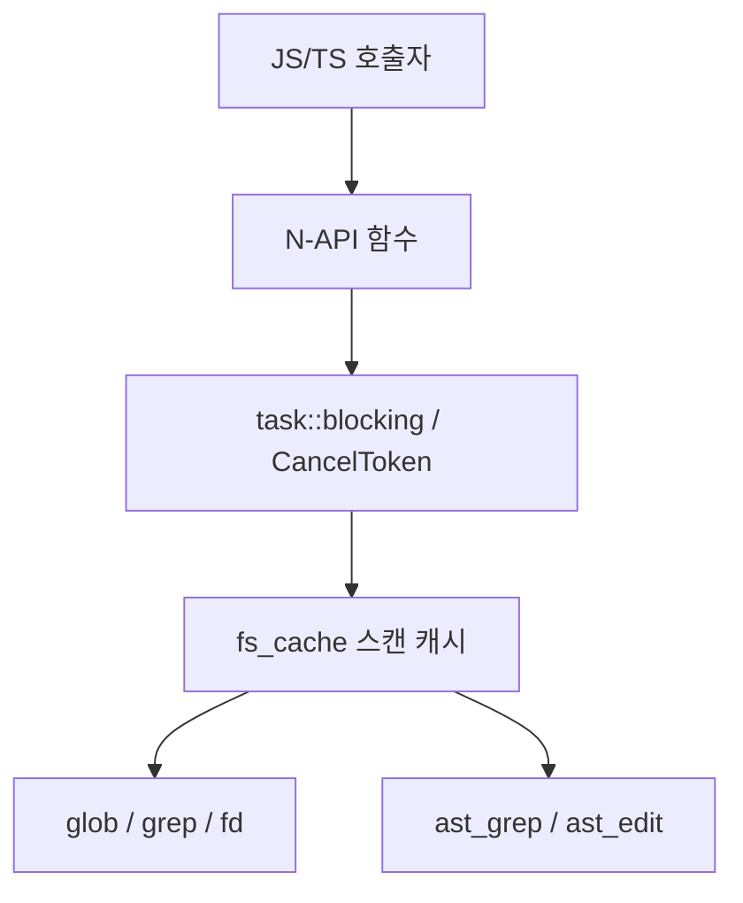

# Support Boundary — Native Bindings and Rust Helpers

## 개요

이 모듈은 GJC의 TypeScript 런타임에서 비용이 크거나 플랫폼 의존적인 작업을 Rust/N-API 경계로 내려 보내는 지원 계층입니다. 주요 역할은 파일 탐색, 정규식 검색, AST 구조 검색/치환, 퍼지 편집 위치 탐색, 공유 파일시스템 스캔 캐시를 제공하는 것입니다.

공개 표면은 `#[napi]` 함수로 노출됩니다. 대표 함수는 `ast_grep`, `ast_edit`, `glob`, `fuzzy_find`, `invalidate_fs_scan_cache`, `h01_find_best_fuzzy_match`, `h02_score_sequence_fuzzy`입니다. 오래 걸릴 수 있는 작업은 `task::blocking(...)`으로 워커 스레드에서 실행되고, `task::CancelToken`으로 `timeoutMs`와 abort signal을 공통 처리합니다.

## 책임 경계

이 크레이트는 제품 기능의 정책을 직접 소유하기보다, 상위 TypeScript 도구가 필요로 하는 저수준 연산을 빠르고 일관되게 수행합니다.

- `ast.rs`는 `ast-grep` 기반 구조 검색과 구조 치환을 담당합니다.
- `grep.rs`는 `grep-searcher`와 `grep-regex` 기반 텍스트 검색을 담당합니다.
- `glob.rs`, `glob_util.rs`, `fd.rs`는 파일 탐색과 자동완성용 후보 검색을 담당합니다.
- `fs_cache.rs`는 탐색 계층이 공유하는 TTL 기반 디렉터리 스캔 캐시를 담당합니다.
- `edit_fuzzy.rs`는 편집 적용 전후의 근사 위치 탐색과 시퀀스 점수를 담당합니다.

상위 코드가 “어떤 도구를 언제 호출할지”를 결정하고, 이 모듈은 “주어진 옵션을 안전하게 실행해 결과 구조체로 돌려주는 일”에 집중합니다.

## 비동기 실행 모델

대부분의 공개 함수는 즉시 계산하지 않고 `task::Promise<T>`를 반환합니다.

예를 들어 `ast_edit`의 실행 흐름은 다음 형태입니다.

1. `AstReplaceOptions`에서 옵션을 구조 분해합니다.
2. `task::CancelToken::new(timeout_ms, signal)`로 취소 토큰을 만듭니다.
3. `task::blocking("ast_edit", ct, move |ct| { ... })`로 실제 작업을 워커 스레드에 넘깁니다.
4. 워커 내부에서 파일 후보 수집, 언어 해석, 패턴 컴파일, AST 매칭, 치환 적용을 수행합니다.
5. 결과를 `AstReplaceResult`로 반환합니다.

Call graph의 `Ast_edit → Blocking` 흐름도 이 구조를 보여줍니다. `ast_edit`는 직접 디스크 작업을 오래 붙잡지 않고, `task::blocking`과 `Blocking` 작업으로 넘깁니다. 같은 흐름에서 `task::new`와 abort token 연결도 나타나므로, 네이티브 작업은 JS 쪽 취소/타임아웃 신호와 함께 동작하도록 설계되어 있습니다.

## 공유 파일시스템 스캔 캐시

`fs_cache.rs`는 `glob`, `fd`, `ast` 검색 경로가 공유하는 디렉터리 스캔 계층입니다. 핵심 타입은 `ScanOptions`, `ScanDetail`, `GlobMatch`, `FileType`, `ScanResult`입니다.

`get_or_scan(root, options, ct)`는 TTL 캐시를 확인한 뒤, 유효한 항목이 있으면 `ScanResult { entries, cache_age_ms }`를 반환합니다. 캐시가 없거나 만료되었으면 `collect_entries`로 새 스캔을 수행하고 저장합니다. `force_rescan(root, options, store, ct)`는 기존 캐시를 제거하고 강제로 다시 스캔합니다.

캐시 정책은 환경 변수로 조정됩니다.

- `FS_SCAN_CACHE_TTL_MS`: 기본 TTL
- `FS_SCAN_EMPTY_RECHECK_MS`: 빈 결과 재확인 기준
- `FS_SCAN_CACHE_MAX_ENTRIES`: 캐시 엔트리 상한
- `PI_GREP_WORKERS`: 병렬 파일 워커 수

빈 결과 재확인 정책이 중요합니다. `glob`, `fuzzy_find`, `ast_grep` 계열은 캐시 결과가 0건이고 캐시가 충분히 오래되었으면 `force_rescan`을 한 번 더 호출해 stale negative를 줄입니다.

파일 변경 후에는 `invalidate_fs_scan_cache(path)`를 호출해 캐시를 무효화합니다. `path`가 있으면 해당 경로를 포함하는 루트 캐시만 제거하고, 없으면 `invalidate_all()`로 전체 캐시를 비웁니다.

## Glob 탐색

`glob.rs`의 공개 함수는 `glob(options, on_match)`입니다. `GlobOptions`는 패턴, 루트 경로, 파일 타입 필터, hidden/gitignore/cache 정책, `sortByMtime`, `includeNodeModules`, 취소 옵션을 받습니다.

실행은 `run_glob`에서 이루어집니다.

- `glob_util::compile_glob`로 패턴을 `GlobSet`으로 컴파일합니다.
- `fs_cache::get_or_scan` 또는 `force_rescan`으로 파일 목록을 얻습니다.
- `filter_entries`에서 glob 매칭, `.git`/`node_modules` 정책, 파일 타입 필터를 적용합니다.
- `on_match` 콜백이 있으면 `ThreadsafeFunction`으로 각 매치를 비동기 전달합니다.
- `sortByMtime`이 켜져 있으면 전체 후보를 모은 뒤 mtime 내림차순으로 정렬하고 `maxResults`를 적용합니다.

`glob_util::build_glob_pattern`은 단순 패턴을 다루기 쉽게 보정합니다. 예를 들어 `recursive`가 true이고 패턴이 `*.ts`라면 `**/*.ts`로 바꿉니다. Windows 경로 구분자는 `/`로 정규화하고, 닫히지 않은 brace 패턴은 가능한 범위에서 보정합니다.

## Fuzzy 파일 탐색

`fd.rs`는 자동완성 및 `@` mention 해석을 위한 `fuzzy_find`를 제공합니다.

`fuzzy_find(options)`는 내부적으로 `fuzzy_find_sync`를 호출합니다. 검색 루트는 `fs_cache::resolve_search_path`로 검증하고, 파일 목록은 캐시 사용 여부에 따라 `get_or_scan` 또는 `force_rescan`으로 가져옵니다.

점수 계산은 `score_fuzzy_path`가 담당합니다.

- 쿼리가 비어 있으면 디렉터리에 더 높은 기본 점수를 줍니다.
- 파일명 완전 일치, prefix, substring 순서로 높은 점수를 줍니다.
- 일반 쿼리는 basename 중심으로 매칭합니다.
- `/`가 포함된 path-style 쿼리는 전체 상대 경로도 매칭합니다.
- 디렉터리는 유효 점수에 `+10` 가산됩니다.

`normalize_fuzzy_text`는 공백, `/`, `\`, `.`, `_`, `-`를 제거하고 소문자화합니다. `fuzzy_subsequence_score`는 정규화된 문자열에서 subsequence 일치를 찾고, 매치 간 gap이 많을수록 점수를 낮춥니다.

## Grep 검색

`grep.rs`는 두 계층을 제공합니다.

- `search()` 계열: 메모리 상의 content 바이트 검색
- `grep()` 계열: 파일시스템 경로를 스캔한 뒤 파일별 검색

출력 모드는 `GrepOutputMode`로 제어합니다.

- `content`: 매칭 라인과 선택적 context 라인 반환
- `count`: 파일별 또는 전체 count 중심 반환
- `filesWithMatches`: 내용 없이 매칭 파일 단위 반환

검색 엔진은 `grep_regex::RegexMatcherBuilder`와 `grep_searcher::Searcher`를 사용합니다. `MatchCollector`가 `Sink`를 구현해 match, before context, after context를 수집합니다. `max_count`와 `offset`은 전역 match 순서에 적용되며, content 모드가 아닐 때는 라인 내용 수집을 생략해 비용을 줄입니다.

파일 읽기는 `read_file_bytes`가 담당합니다.

- 4 MiB보다 큰 파일은 검색하지 않습니다.
- 작은 파일은 `Vec<u8>`로 읽습니다.
- 큰 파일은 가능하면 `memmap2::Mmap`으로 매핑하고, 실패하면 일반 read로 fallback합니다.
- NUL 바이트가 있는 바이너리 입력은 `BinaryDetection::quit(b'\x00')`로 중단됩니다.

`sanitize_braces`와 `escape_unescaped_parentheses`는 사용자가 literal snippet에 가까운 검색어를 넣었을 때 regex parser 에러를 줄이기 위한 보정 계층입니다. 예를 들어 `${platform}` 같은 패턴의 brace는 반복 quantifier가 아니므로 escape합니다. 반면 `a{2,4}`나 `\p{Greek}` 같은 유효 regex 문법은 보존합니다.

## AST 구조 검색

`ast.rs`의 `ast_grep(options)`는 ast-grep 패턴 기반 검색을 수행합니다. 입력 타입은 `AstFindOptions`, 결과 타입은 `AstFindResult`입니다.

주요 처리 흐름은 다음과 같습니다.

1. `normalize_pattern_list`로 빈 패턴과 중복 패턴을 제거합니다.
2. `resolve_strictness`로 `AstMatchStrictness`를 `ast_grep_core::MatchStrictness`로 변환합니다.
3. `collect_candidates`로 파일 후보를 수집합니다.
4. `is_supported_file`과 `resolve_language`로 언어를 결정합니다.
5. `compile_find_patterns`로 언어별 `Pattern`을 미리 컴파일합니다.
6. 각 파일을 읽고 `language.ast_grep(source)`로 AST를 생성합니다.
7. `find_all` 결과를 `AstFindMatch`로 변환합니다.
8. 경로, 위치, byte range 기준으로 정렬한 뒤 `offset`과 `limit`을 적용합니다.

언어 처리는 `pi_ast::ops`에 위임됩니다. `resolve_supported_lang`, `resolve_language`, `compile_pattern`, `apply_edits`는 모두 공유 AST 유틸리티를 호출하고, 에러는 N-API `Error::from_reason`으로 변환합니다.

`includeMeta`가 true이면 `matched.get_env()`에서 meta-variable 캡처를 가져와 `meta_variables`에 담습니다. 이 값은 `$NAME`, `$$$ARGS` 같은 ast-grep 패턴 바인딩을 상위 JS 호출자가 사용할 수 있게 합니다.

## AST 구조 치환

`ast_edit(options)`는 ast-grep rewrite를 수행합니다. 입력 타입은 `AstReplaceOptions`, 결과 타입은 `AstReplaceResult`입니다.

`rewrites`는 `HashMap<String, String>` 형태의 pattern → replacement template입니다. `normalize_rewrite_map`은 빈 key를 거부하고, 결정적인 순서를 위해 pattern 기준으로 정렬합니다.

언어 결정에는 검색과 다른 제약이 있습니다. `ast_grep`은 파일별 언어를 다르게 처리할 수 있지만, `ast_edit`는 하나의 rewrite pass에서 단일 언어를 요구합니다.

- `lang`이 있으면 모든 후보를 그 언어로 처리합니다.
- `lang`이 없으면 `infer_single_replace_lang`이 후보 파일들의 언어를 추론합니다.
- 후보 언어가 섞여 있거나 추론할 수 없는 파일이 있으면 에러를 반환합니다.

치환은 파일 단위로 진행됩니다. 각 match에서 `matched.replace_by(rewrite.as_str())`로 `Edit<String>`을 만들고, `PendingFileChange`에 공개 결과와 내부 edit를 함께 보관합니다. `dryRun`이 false일 때만 `apply_edits`로 실제 내용을 만들고 `std::fs::write`로 저장합니다.

안전 장치는 다음과 같습니다.

- `dryRun` 기본값은 true입니다.
- `max_replacements`와 `max_files`로 전체 치환 수와 파일 수를 제한합니다.
- `fail_on_parse_error`가 false이면 parse/compile 오류를 `parse_errors`에 모으고 가능한 파일을 계속 처리합니다.
- `fail_on_parse_error`가 true이면 첫 오류에서 실패합니다.
- 겹치는 edit는 `apply_edits`에서 거부됩니다.

## 퍼지 편집 위치 탐색

`edit_fuzzy.rs`는 텍스트 치환 도구가 “원래 기대한 블록과 약간 다른 현재 파일”에서도 위치를 찾을 수 있도록 돕습니다.

`h01_find_best_fuzzy_match(content, target, threshold)`는 전체 content에서 target 블록과 가장 비슷한 위치를 찾습니다. 반환 타입은 `H01BestFuzzyMatchResult`이고, `best`, `above_threshold_count`, `second_best_score`를 포함합니다.

핵심 특징은 다음과 같습니다.

- JS 문자열과 같은 UTF-16 단위로 처리합니다.
- `split_lines`로 줄 단위 비교를 수행합니다.
- `normalize_line`은 trim, 공백 압축, 일부 따옴표/대시 문자 정규화를 적용합니다.
- 기본 비교는 들여쓰기 깊이를 prefix로 포함합니다.
- confidence가 threshold보다 낮지만 `FALLBACK_THRESHOLD` 이상이면 들여쓰기 깊이를 제외한 fallback 비교를 시도합니다.
- `PI_NATIVE_MAX_FUZZY_UNITS`를 넘는 입력은 O(content*target) 탐색을 건너뛰고 no match를 반환합니다.

유사도 계산은 `FuzzyPattern`이 담당합니다. 패턴 길이가 128 UTF-16 unit 이하이면 `MyersPattern`의 bit-parallel Levenshtein 구현을 사용하고, 그 외에는 동적 계획법(`levenshtein_dp`)으로 fallback합니다.

`h02_score_sequence_fuzzy(lines, pattern, start, eof)`는 줄 배열에서 pattern 시퀀스의 최적 시작 위치와 confidence를 계산합니다. `SEQUENCE_FUZZY_THRESHOLD` 이상의 후보 수와 최대 5개의 match index를 같이 반환합니다. `eof`가 true이면 파일 끝 근처를 우선 검사한 뒤 필요한 경우 `start` 이후 범위를 추가로 검사합니다.

## `.git`과 `node_modules` 정책

탐색 계층은 사용자-facing 검색 결과에서 불필요한 노이즈를 줄이기 위해 공통 제외 정책을 둡니다.

`fs_cache::should_skip_path`는 `.git`을 항상 제외합니다. `node_modules`는 기본적으로 제외하지만, 호출자가 명시적으로 `node_modules`를 요청한 경우에는 포함할 수 있습니다.

`glob`에서는 `includeNodeModules`가 true이거나 패턴 문자열에 `node_modules`가 들어 있으면 포함합니다. `ast` 후보 수집에서는 glob이 `node_modules`를 언급하면 포함하고, 그렇지 않으면 제외합니다. `fuzzy_find`는 `ScanOptions`에서 `skip_node_modules: true`를 사용합니다.

이 정책은 `build_walker` 단계에서 하위 트리를 아예 내려가지 않도록 적용되며, 일부 호출 경로에서는 post-scan 필터로도 한 번 더 적용됩니다.

## 결과 타입과 좌표 체계

검색/치환 결과는 상위 JS 코드가 바로 렌더링하거나 후속 작업에 사용할 수 있도록 위치 정보를 명확히 포함합니다.

- byte offset은 UTF-8 byte index입니다.
- line/column은 1-based입니다.
- `AstFindMatch`와 `AstReplaceChange`는 `byte_start`, `byte_end`, `start_line`, `start_column`, `end_line`, `end_column`을 제공합니다.
- `GrepMatch`와 `Match`는 1-indexed `line_number`를 사용합니다.
- `GlobMatch.path`와 `FuzzyFindMatch.path`는 검색 루트 기준 상대 경로이며 `/` 구분자를 사용합니다.

Rust 내부의 큰 수는 공개 N-API 타입에 맞추기 위해 `to_u32`나 `crate::utils::clamp_u32`로 포화 변환됩니다.

## 기여 시 주의점

새로운 파일 탐색 기능을 추가할 때는 먼저 `fs_cache::ScanOptions`를 재사용할 수 있는지 확인해야 합니다. 직접 walker를 새로 만들면 `.git`, `node_modules`, hidden, gitignore, cache invalidation 정책이 어긋날 수 있습니다.

AST 관련 기능은 `pi_ast::ops`를 통해 언어 해석과 패턴 컴파일을 공유해야 합니다. `resolve_supported_lang`, `resolve_language`, `compile_pattern`, `apply_edits`를 우회하면 `ast_grep`과 `ast_edit`의 언어 alias, strictness, edit 적용 규칙이 달라질 수 있습니다.

긴 작업에는 반드시 `CancelToken::heartbeat()`를 넣어야 합니다. 이 모듈의 반복문들은 파일 후보 순회, 패턴 컴파일, AST match 순회, filesystem walk 중 주기적으로 heartbeat를 호출합니다. 새 루프를 추가할 때도 같은 패턴을 유지해야 timeout과 abort signal이 실제로 반영됩니다.

디스크를 변경하는 기능은 `dryRun`, 상한값, parse error 정책을 명확히 가져야 합니다. `ast_edit`는 `dry_run` 기본값을 true로 두고, `max_replacements`, `max_files`, `fail_on_parse_error`를 통해 호출자가 위험도를 조절하게 합니다. 같은 종류의 변경 기능을 추가한다면 이 계약을 따라야 합니다.