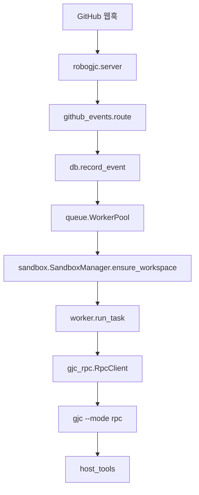
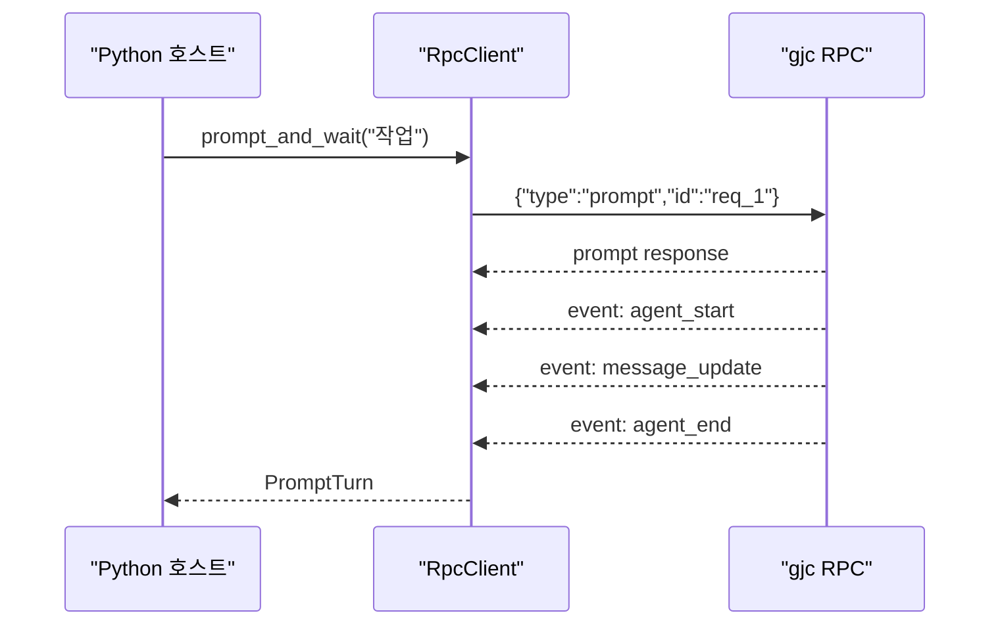
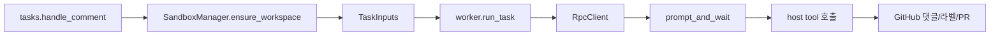

# Support Boundary — Python RPC and RoboGJC

## 지원 경계: Python RPC와 RoboGJC

이 모듈은 TypeScript 기반 `gjc` 코딩 에이전트와 Python 기반 자동화 호스트 사이의 경계를 담당합니다. 핵심은 두 층입니다.

- `python/gjc-rpc`: `gjc --mode rpc`의 JSONL stdio 프로토콜을 Python에서 타입 안전하게 다루는 클라이언트 라이브러리입니다.
- `python/robogjc`: GitHub 웹훅을 받아 이슈를 분류하고, 저장소별 작업공간에서 `gjc` RPC 세션을 실행해 댓글, 라벨, PR 생성 같은 GitHub 작업을 수행하는 오케스트레이터입니다.

`gjc-rpc`는 에이전트 프로세스를 직접 제어하지만 GitHub 도메인을 알지 못합니다. `robogjc`는 GitHub 이벤트, 내구성 큐, 샌드박스 워크트리, 호스트 도구 정책을 소유하고, 실제 추론과 코드 변경은 `RpcClient`를 통해 `gjc`에 위임합니다.



## `gjc-rpc`의 역할

`gjc-rpc`는 CLI RPC 프로토콜을 Python 코드에서 직접 다루지 않도록 감싸는 바인딩입니다. 기본 실행 표면은 다음과 같습니다.

```python
from gjc_rpc import RpcClient

with RpcClient(provider="anthropic", model="claude-sonnet-4-5") as client:
    state = client.get_state()
    turn = client.prompt_and_wait("Reply with just the word hello")
    text = turn.require_assistant_text()
```

기본적으로 `RpcClient`는 다음 명령을 실행합니다.

```bash
gjc --mode rpc
```

개발 중에는 `command=[...]`로 Bun 엔트리포인트를 직접 지정할 수 있습니다. 테스트에서는 이 방식을 사용해 가짜 JSONL 서버를 띄우고 클라이언트 동작만 검증합니다.

`RpcClient`가 맡는 책임은 네 가지입니다.

1. `gjc --mode rpc` 프로세스 시작과 종료
2. 요청 `id` 기반 응답 상관관계 관리
3. `event` 프레임 파싱과 타입별 리스너 호출
4. 호스트 소유 도구, URI, UI 요청, 워크플로 게이트의 왕복 처리

## RPC 명령과 타입 파싱

`RpcClient`의 공개 메서드는 대부분 `_request(...)` 계열 호출로 wire command를 보내고, 응답의 `data`를 `protocol.py`의 파서로 변환합니다.

대표적인 흐름은 다음과 같습니다.

- `get_state()` → `parse_session_state()`
- `get_available_models()` → `parse_model_info()`
- `get_session_stats()` → `parse_session_stats()`
- `wait_for_idle()` → `_wait_for_agent_end()`
- `prompt_and_wait()` → `prompt()` 전송 후 `agent_end` 이벤트 수집

`parse_session_state()`는 `SessionState`를 만들며 `model`, `thinkingLevel`, `steeringMode`, `followUpMode`, `interruptMode`, `todoPhases`, `dumpTools`, `contextUsage` 같은 RPC 상태 필드를 Python 타입으로 정규화합니다. 테스트는 문자열 `systemPrompt`, 배열 `systemPrompt`, 누락된 `contextUsage`, compaction 후 `None` 값이 섞인 `contextUsage`를 모두 검증합니다.

프로토콜 파서는 엄격합니다. 예를 들어 `parse_session_state()`는 알 수 없는 `thinkingLevel`을 `ValueError`로 거부하고, `parse_notification()`은 유효하지 않은 `extension_ui_request.method`나 잘못된 assistant done reason도 거부합니다.

## 이벤트 프레임과 리스너

AgentSession 이벤트는 stdout에 canonical `event` 프레임으로 전달됩니다.

```json
{
  "type": "event",
  "protocol_version": 2,
  "session_id": "fake-session",
  "seq": 1,
  "frame_id": "frame-1",
  "payload": {
    "event_type": "tool_execution_start",
    "event": {
      "type": "tool_execution_start"
    }
  }
}
```

`parse_notification()`은 이 wrapper를 풀고 내부 이벤트를 타입 객체로 변환합니다. 따라서 `on_tool_execution_start()`, `on_message_update()`, `on_agent_end()` 같은 리스너는 envelope가 아니라 내부 이벤트를 받습니다. 반대로 `ready`, `response`, `workflow_gate`, `extension_ui_request`, `extension_error`, `host_tool_call`, `host_uri_request` 같은 프레임은 flat frame으로 유지됩니다.

리스너 등록은 내부적으로 `_add_typed_event_listener()`를 사용합니다. 호출 그래프에서 `on_tool_execution_start()`와 `on_auto_retry_end()`가 이 경로로 연결됩니다. 타입별 리스너 외에도 `on_event()`와 `on_notification()`을 통해 범용 수신이 가능합니다.

리스너 예외는 stdout reader thread를 죽이지 않습니다. 예외는 `client.listener_errors`에 보관되고 `on_listener_error(...)`로 전달됩니다. 이 설계 덕분에 호스트의 관찰 코드가 실패해도 RPC 세션 자체는 계속 진행됩니다.

## 프롬프트 생명주기 수집

`prompt_and_wait()`, `wait_for_idle()`, `collect_events()`는 단일 클라이언트 인스턴스에서 single-flight로 동작합니다. 동시에 두 개 이상의 lifecycle collector를 실행하면 `RpcConcurrencyError`가 발생합니다.

이 제약은 이벤트 보존 순서와 완료 조건을 명확히 하기 위한 것입니다. 장기 실행 호스트가 병렬 오케스트레이션이 필요하면 하나의 `RpcClient`를 공유하지 않고 별도 인스턴스를 만들어야 합니다.

`prompt_and_wait()`는 보통 다음 순서를 따릅니다.



`max_event_history`를 초과하면 조용히 이전 이벤트를 버리지 않고 명확한 `RpcError`를 발생시킵니다. 이는 긴 프롬프트 실행에서 일부 이벤트가 손실된 상태로 잘못된 결과를 신뢰하는 것을 막습니다.

## 호스트 소유 도구

`host_tool(...)`은 Python 호스트가 에이전트에게 커스텀 도구를 노출하는 표면입니다. 도구 정의는 JSON Schema metadata와 Python handler로 구성됩니다.

```python
from typing import TypedDict

from gjc_rpc import RpcClient, host_tool


class EchoArgs(TypedDict):
    message: str


def echo_host(args: EchoArgs, context) -> str:
    context.send_update(f"진행 중:{args['message']}")
    return f"호스트:{args['message']}"


with RpcClient(
    no_session=True,
    custom_tools=(
        host_tool(
            name="echo_host",
            description="Python 호스트에서 값을 되돌려줍니다.",
            parameters={
                "type": "object",
                "properties": {"message": {"type": "string"}},
                "required": ["message"],
                "additionalProperties": False,
            },
            execute=echo_host,
        ),
    ),
) as client:
    client.prompt_and_wait("echo_host 도구를 hello 값으로 사용하세요.")
```

프로세스가 `host_tool_call` 프레임을 보내면 `_read_stdout_loop()`가 `_handle_host_tool_call()`로 넘깁니다. handler는 `context.send_update(...)`로 중간 `host_tool_update`를 보낼 수 있고, 최종 결과는 `host_tool_result`로 반환됩니다. 테스트는 `tool_execution_update`와 `tool_execution_end` 이벤트가 각각 한 번 발생하는지 검증합니다.

`decode=`를 전달하면 wire argument 객체를 dataclass나 모델 같은 더 풍부한 Python 타입으로 변환한 뒤 handler에 넘길 수 있습니다.

## 호스트 소유 URI

`host_uri(...)`는 Python 호스트가 가상 파일 시스템처럼 동작하는 URI scheme을 등록하는 표면입니다. 에이전트의 `read`와 `write` 도구가 같은 RPC transport를 통해 호스트에게 I/O를 요청합니다.

```python
from gjc_rpc import RpcClient, host_uri

rows: dict[str, str] = {"42": "id=42\nname=Alice\n"}


def read_row(url: str, _ctx) -> str:
    row_id = url.removeprefix("db://users/")
    return rows[row_id]


def write_row(url: str, content: str, _ctx) -> None:
    row_id = url.removeprefix("db://users/")
    rows[row_id] = content


with RpcClient(
    no_session=True,
    host_uris=(
        host_uri(
            scheme="db",
            description="가상 DB row 파일",
            read=read_row,
            write=write_row,
        ),
    ),
) as client:
    client.prompt_and_wait("db://users/42를 읽고 name=Bob으로 다시 쓰세요.")
```

`normalize_read_result()`는 read handler 결과를 wire payload로 정규화합니다. 문자열은 `{"content": "..."}`로 바뀌고, mapping은 `content`, `content_type`, `notes`, `immutable`을 받아 `contentType` 같은 wire field로 변환됩니다. `content`가 없거나 허용되지 않는 `content_type`이면 `ValueError`가 발생합니다.

쓰기 handler가 없는 read-only scheme으로 `write` 요청이 들어오면 명확한 error result를 반환합니다. 등록되지 않은 scheme이나 handler 예외도 `host_uri_result`의 `isError`와 `error`로 표면화됩니다.

## Extension UI와 Workflow Gate

RPC 모드의 extension은 호스트에게 입력을 요청할 수 있습니다. 이 요청은 `ExtensionUiRequest`로 파싱되며 `next_ui_request(...)`, `send_ui_value(...)`, `send_ui_confirmation(...)`, `cancel_ui_request(...)`로 처리합니다.

워크플로 승인이나 선택지는 `WorkflowGate`로 들어옵니다. 관련 API는 다음과 같습니다.

- `on_workflow_gate(...)`
- `next_workflow_gate(...)`
- `send_workflow_gate_response(...)`
- `respond_gate(...)`
- `run_workflow_gate_policy(...)`

`respond_gate(...)`는 `workflow_gate_response`를 보내고 resolution envelope를 기다립니다. `idempotency_key`가 있으면 같은 frame에 포함됩니다. 테스트는 key가 없는 경우와 있는 경우의 정확한 frame shape을 검증합니다.

`run_workflow_gate_policy(...)`는 gate가 들어올 때마다 policy 함수를 실행해 자동 응답합니다. 여러 gate가 연속으로 들어와도 각각 응답하며, `on_workflow_gate(...)`가 반환하는 unsubscribe 함수로 이후 전달을 끊을 수 있습니다.

비대화형 스크립트에서는 `install_headless_ui()`를 사용할 수 있습니다. 기본 정책은 passive notification은 무시하고, `confirm`은 `False`, `select`/`input`/`editor`는 명시값이 없으면 취소합니다.

## 세션 레지스트리

`list_sessions()`는 실행 중인 RPC 세션 handle을 찾습니다. 기본 위치는 `GJC_CODING_AGENT_DIR/rpc-sessions`이며, 테스트는 다음 동작을 보장합니다.

- 살아 있는 PID의 session record만 반환합니다.
- 죽은 PID record는 삭제합니다.
- 파싱할 수 없는 JSON record도 삭제합니다.
- `startedAt` 기준으로 정렬합니다.
- 디렉터리가 없으면 빈 tuple을 반환합니다.

반환 타입은 `SessionHandle`이며 `session_id`, `pid`, `cwd`, `model` 같은 registry metadata를 담습니다.

## RoboGJC의 역할

`robogjc`는 GitHub 이벤트를 durable queue에 저장한 뒤, 이슈 단위로 직렬화된 작업을 수행하는 FastAPI 서비스입니다. 실제 코딩 작업은 직접 구현하지 않고 `gjc --mode rpc` subprocess에 맡깁니다.

주요 실행 흐름은 다음과 같습니다.

1. `POST /webhook/github`가 GitHub delivery를 받습니다.
2. `github_events.verify_signature()`가 `GITHUB_WEBHOOK_SECRET`으로 HMAC-SHA256 서명을 검증합니다.
3. `github_events.route()`가 이벤트를 `triage_issue`, `handle_comment`, `handle_pr_conversation`, `handle_review`, `cleanup_workspace`, `skip` 중 하나로 분류합니다.
4. `db.record_event()`가 `X-GitHub-Delivery`를 기준으로 `INSERT OR IGNORE` 처리해 중복 delivery를 제거합니다.
5. `queue.WorkerPool._dispatch_loop`가 `state='queued'` 이벤트를 `BEGIN IMMEDIATE`로 원자적으로 claim합니다.
6. `_inflight` set이 `(owner, repo, number)` 단위 동시 처리를 막습니다.
7. `tasks.*` dispatcher가 `TaskInputs`를 만들고 `worker.run_task()`를 호출합니다.
8. `worker.run_task()`가 worktree cwd에서 `gjc --mode rpc`를 실행합니다.
9. 성공 시 이벤트는 `done`, 예외 시 `failed`로 표시되고 `last_error`에 credential-redacted traceback이 저장됩니다.

## 작업공간과 샌드박스

`SandboxManager.ensure_workspace()`는 GitHub 이슈별 worktree를 만듭니다. 경로는 `/data/workspaces/<owner>__<repo>__<n>/repo` 형태이며, branch는 `farm/<8hex>/<slug>` 형식입니다.

관련 호출 흐름은 다음과 같이 나뉩니다.

- `handle_comment()` → `ensure_workspace()` → `ensure_clone()` → `_reset_origin_url()` → `_safe_run()`
- `handle_comment()` → `ensure_workspace()` → `ensure_clone()` → `pool_path()`
- `handle_comment()` → `ensure_workspace()` → `_populate_natives_cache()` → `_slot_permissions_active()`
- `handle_comment()` → `ensure_workspace()` → `make_branch()` → `_slug()`
- `handle_pr_conversation()` → `remove_workspace()` → `workspace_root()` → `workspace_key()`

이 구조는 GitHub 이벤트 처리를 저장소 checkout과 분리합니다. `tasks.py`는 어떤 작업을 해야 하는지 결정하고, `sandbox.py`는 그 작업이 실행될 안전한 파일시스템 경계를 제공합니다.

공유 clone pool은 `--filter=blob:none`을 사용하며, credentialed remote URL과 git identity는 매번 재설정됩니다. 이는 오래 살아 있는 컨테이너에서 인증 정보나 이전 작업 상태가 worktree에 남는 위험을 줄입니다.

## `worker.run_task()`와 RPC 세션 재개

`worker.run_task()`는 blocking 함수입니다. `gjc-rpc` 자체가 동기 subprocess 클라이언트이므로, `queue.WorkerPool`에서는 이를 worker thread에서 실행해야 합니다. async 함수로 바꾸면 FastAPI/큐 루프와 blocking RPC 사이의 책임 경계가 흐려집니다.

각 이슈는 고유한 `session_dir`를 갖습니다. 이미 `<session_dir>/*.jsonl`이 있으면 worker는 `gjc --continue`를 전달합니다. 이 덕분에 다음 경우에도 같은 reasoning context를 이어갑니다.

- 이슈 follow-up comment 처리
- PR review comment 처리
- 오케스트레이터 재시작 후 미완료 이벤트 재처리

즉, durable state는 SQLite 이벤트 큐와 세션 디렉터리 양쪽에 나뉘어 있습니다. SQLite는 “무엇을 처리해야 하는가”를 보존하고, `gjc` session file은 “에이전트가 어디까지 생각했는가”를 보존합니다.

## 호스트 도구 경계

RoboGJC에서 GitHub mutation은 `host_tools.py`가 소유합니다. 에이전트는 worktree 안의 built-in `gjc` 도구로 파일을 읽고 쓰고 명령을 실행하지만, GitHub 라벨 적용, 댓글 작성, PR 생성, 감사 기록 같은 외부 side effect는 host tool을 통해서만 수행해야 합니다.

이 경계가 중요한 이유는 다음과 같습니다.

- GitHub credential 사용 위치를 Python 호스트로 제한합니다.
- 감사 가능한 mutation 지점을 한 곳에 모읍니다.
- 에이전트가 생성한 계획과 실제 GitHub side effect 사이에 정책 레이어를 둘 수 있습니다.
- 실패 시 `events.last_error`와 host tool 로그를 기준으로 재시도 또는 조사할 수 있습니다.

`gjc-rpc`의 `host_tool(...)`이 일반적인 Python host tool transport를 제공하고, `robogjc.host_tools`는 그 transport 위에 GitHub 도메인 작업을 얹는 구조입니다.

## 내구성 큐와 동시성

`queue.WorkerPool._dispatch_loop`는 SQLite row claim과 in-process `_inflight` set을 함께 사용합니다.

- SQLite `BEGIN IMMEDIATE`: 여러 dispatcher가 같은 queued event를 동시에 claim하지 않게 합니다.
- `INSERT OR IGNORE`: 같은 `X-GitHub-Delivery`가 재전송되어도 이벤트를 중복 생성하지 않습니다.
- `_inflight[(owner, repo, number)]`: 같은 이슈에 대한 이벤트를 한 번에 하나만 처리합니다.
- `ROBGJC_MAX_CONCURRENCY`: 전체 병렬 처리량을 제한합니다.

이 모델은 GitHub 이슈 단위 reasoning context와 git worktree를 보호합니다. 서로 다른 이슈는 병렬 처리할 수 있지만, 같은 이슈의 follow-up과 review comment는 순서가 섞이지 않아야 합니다.

## RoboGJC와 `gjc-rpc`의 연결점

`robogjc`는 `RpcClient`를 직접 사용해 `gjc --mode rpc` subprocess를 제어합니다. 일반적인 task 실행은 다음 흐름을 따릅니다.



`RpcClient`가 제공하는 기능 중 RoboGJC에서 특히 중요한 것은 다음입니다.

- `cwd`: 이슈별 worktree에서 `gjc`를 실행합니다.
- `env`: GitHub/모델/세션 관련 환경을 격리합니다.
- `custom_tools`: GitHub mutation을 host tool로 노출합니다.
- `prompt_and_wait()` / `wait_for_idle()`: agent run 완료를 기다립니다.
- protocol error/listener error 수집: subprocess나 transport 실패를 Python 쪽 failure로 승격합니다.
- session registry: real binary integration test에서 live session이 registry에 나타나는지 검증합니다.

## 테스트 표면

`python/gjc-rpc/tests`는 대부분 손으로 작성한 fake server를 사용합니다. 이 방식은 실제 모델 호출 없이 다음 계약을 빠르게 검증합니다.

- command builder가 `--mode rpc`, `--model`, `--thinking`, `--tools`, `--no-session` 등을 올바르게 구성하는지
- `get_state()`, `bash()`, `set_model()`, `cycle_model()`, `compact()` 같은 RPC method가 타입 결과를 반환하는지
- typed event listener가 expected event를 받는지
- listener 예외가 client를 중단시키지 않는지
- id 없는 error response를 대기 중인 request에 상관시킬 수 있는지
- late prompt failure가 timeout이 아니라 `RpcCommandError`로 올라오는지
- `stop()`이 진행 중인 `prompt_and_wait()`를 즉시 깨우는지
- `WorkflowGate` 응답 frame과 resolution envelope가 정확한지
- host URI read/write/error path가 wire result로 표면화되는지

`test_real_binary.py`는 opt-in integration lane입니다. `GJC_RPC_REAL_BINARY=1`이고 `bun`이 PATH에 있을 때 실제 `packages/coding-agent/src/cli.ts --mode rpc`를 실행합니다. 이 테스트는 fake server가 잡지 못하는 client/server drift를 확인합니다. 예를 들어 `contextUsage` round trip, invalid thinking level의 command 상관관계, unattended negotiation, live session registry를 실제 CLI로 검증합니다.

## 기여 시 주의할 점

`gjc-rpc`를 수정할 때는 wire protocol과 Python 타입 모델을 함께 봐야 합니다. 새 RPC command를 추가한다면 보통 다음이 함께 필요합니다.

- `RpcClient` public method
- request/response shape 처리
- `protocol.py` parser 또는 dataclass
- fake server test
- 필요하면 real binary integration test

새 notification이나 event를 추가한다면 `parse_notification()`이 wrapped `event` frame과 flat frame 중 어느 쪽을 받아야 하는지 먼저 정해야 합니다. 알 수 없는 future event는 `UnknownNotification`으로 보존되어야 하며, 기존 listener를 깨뜨리면 안 됩니다.

`robogjc`를 수정할 때는 GitHub side effect 경계를 유지해야 합니다. 에이전트 prompt나 built-in tool이 직접 GitHub mutation을 우회하도록 만들지 말고, 필요한 mutation은 `host_tools.py`에 명시적인 host tool로 추가해야 합니다. 큐 처리나 sandbox 변경은 같은 이슈 직렬화, session resume, credential redaction, worktree 격리라는 네 가지 계약을 깨뜨리지 않아야 합니다.