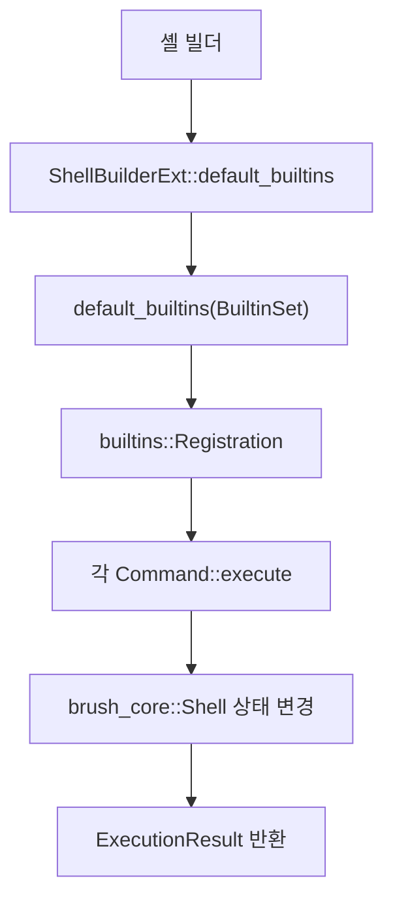

# Support Boundary — Rust Shell and Isolation Crates

## 개요

이 모듈은 Gajae-Code가 사용하는 Rust 기반 셸 지원 계층입니다. 핵심 범위는 두 갈래입니다.

1. `crates/brush-builtins-vendored`: `brush_core` 위에 Bash/POSIX 호환 내장 명령을 등록하고 실행합니다.
2. `crates/pi-natives`, `crates/pi-iso`: 네이티브 기능과 격리 실행 백엔드를 제공하며, 셸 런타임과는 지원 경계에서 연결됩니다.

이 계층은 제품의 주 로직이라기보다 “터미널 명령 실행을 안전하고 예측 가능하게 만들기 위한 하부 런타임”입니다. `packages/coding-agent`가 명령을 실행할 때, 실제 셸 동작 일부는 이 vendored Brush 계층과 네이티브 격리 크레이트에 위임됩니다.

## 큰 구조



`ShellBuilderExt::default_builtins`는 셸 빌더에 기본 내장 명령 묶음을 추가하는 확장 지점입니다. 내부적으로 `crate::default_builtins(set)`을 호출하고, 이 함수가 `HashMap<String, builtins::Registration<SE>>` 형태의 명령 등록표를 구성합니다.

`BuiltinSet`은 등록 범위를 나눕니다.

- `BuiltinSet::ShMode`: POSIX `sh` 호환에 가까운 기본 명령
- `BuiltinSet::BashMode`: Bash 호환 기능까지 포함한 확장 명령

## 내장 명령 등록 방식

`crates/brush-builtins-vendored/src/factory.rs`의 `default_builtins`가 등록의 중심입니다. 이 함수는 컴파일 feature 플래그에 따라 명령을 조건부로 등록합니다.

예를 들어 POSIX special builtin은 다음 패턴으로 등록됩니다.

```rust
m.insert("break".into(), builtin::<break_::BreakCommand, SE>().special());
m.insert(":".into(), simple_builtin::<colon::ColonCommand, SE>().special());
m.insert("eval".into(), builtin::<eval::EvalCommand, SE>().special());
m.insert("export".into(), decl_builtin::<export::ExportCommand, SE>().special());
```

Bash 모드에서는 추가 명령이 붙습니다.

```rust
m.insert("builtin".into(), raw_arg_builtin::<builtin_::BuiltinCommand, SE>());
m.insert("declare".into(), decl_builtin::<declare::DeclareCommand, SE>());
m.insert("complete".into(), builtin::<complete::CompleteCommand, SE>());
m.insert("bind".into(), builtin::<bind::BindCommand, SE>());
```

등록 매크로의 의미는 명령의 인자 처리 방식에 따라 달라집니다.

- `builtin::<T, SE>()`: 일반 clap 기반 명령
- `decl_builtin::<T, SE>()`: `declare`, `export`처럼 assignment 토큰을 별도로 받는 선언형 명령
- `raw_arg_builtin::<T, SE>()`: `builtin`처럼 원본 인자 벡터를 직접 다루는 명령
- `simple_builtin::<T, SE>()`: `true`, `false`, `:`처럼 단순 실행형 명령

## 실행 모델

대부분의 명령은 다음 구조를 가집니다.

```rust
#[derive(Parser)]
pub(crate) struct EchoCommand {
    args: Vec<String>,
}

impl builtins::Command for EchoCommand {
    type Error = brush_core::Error;

    async fn execute<SE: brush_core::ShellExtensions>(
        &self,
        context: brush_core::ExecutionContext<'_, SE>,
    ) -> Result<brush_core::ExecutionResult, Self::Error> {
        // 셸 상태, 표준 출력, 표준 오류, 실행 파라미터를 사용한다.
        Ok(ExecutionResult::success())
    }
}
```

`ExecutionContext`는 내장 명령이 필요한 런타임 핸들을 제공합니다.

- `context.shell`: 변수, alias, job, history, completion 설정 등 셸 상태
- `context.stdout()`, `context.stderr()`: 명령 출력 스트림
- `context.params`: 현재 실행 파라미터
- `context.command_name`: 실제 호출된 명령 이름
- `context.iter_fds()`: redirection 적용에 필요한 파일 디스크립터 목록

명령은 `ExecutionResult`를 반환합니다. 단순 성공/실패뿐 아니라 `break`, `continue`, `exit`, `return` 같은 제어 흐름도 이 값에 실립니다.

예를 들어 `BreakCommand`는 성공 exit code와 함께 루프 탈출 요청을 설정합니다.

```rust
result.next_control_flow = ExecutionControlFlow::BreakLoop {
    levels: (self.which_loop - 1) as usize,
};
```

## 주요 명령 그룹

### 명령 탐색과 직접 실행

`CommandCommand`, `BuiltinCommand`, `ExecCommand`, `EnableCommand`는 명령 탐색 순서와 실행 방식을 제어합니다.

`CommandCommand`는 함수 탐색을 우회하고 builtin 또는 외부 실행 파일을 찾습니다. `try_find_command`는 경로 구분자가 있는 이름이면 절대 경로로 확인하고, 그렇지 않으면 builtin 등록표와 PATH 캐시를 순서대로 봅니다. `-p`가 지정되면 `sys::fs::get_default_standard_utils_paths()`를 사용해 기본 유틸리티 경로에서 찾습니다.

`BuiltinCommand`는 일반 탐색 순서를 거치지 않고 `context.shell.builtins()`에서 직접 builtin을 찾아 실행합니다. 비활성화된 builtin은 실행하지 않고 `BuiltinNotFound` 오류를 반환합니다.

`ExecCommand`는 현재 프로세스를 외부 명령으로 교체합니다. 단, `context.shell.is_subshell()`이 참이면 부모 셸까지 교체될 수 있으므로 실제 `exec` 대신 `CommandCommand`로 위임해 반환 가능한 실행으로 처리합니다. 인자가 없으면 redirection만 현재 셸에 반영하기 위해 `replace_open_files`를 호출합니다.

`EnableCommand`는 builtin 등록의 `disabled` 플래그를 바꿉니다. `enable -f`, `enable -d`는 아직 구현되지 않았고 `error::unimp`로 처리됩니다.

### 셸 상태 변경

`AliasCommand`, `CdCommand`, `DirsCommand`는 셸 내부 상태를 직접 다룹니다.

`AliasCommand`는 `context.shell.aliases()`와 `aliases_mut()`를 사용합니다. 인자가 없거나 `-p`이면 현재 alias를 재사용 가능한 `alias name='value'` 형식으로 출력하고, `name=value` 형식이면 alias를 추가 또는 갱신합니다.

`CdCommand`는 `HOME`, `OLDPWD`, 물리 경로 해석 옵션을 처리한 뒤 `context.shell.set_working_dir(&target_dir)`를 호출합니다. `cd -`는 `OLDPWD`로 이동하고 성공 시 이동 대상 경로를 출력합니다.

`DirsCommand`는 현재 작업 디렉터리와 `context.shell.directory_stack()`을 합쳐 출력합니다. `-c`는 directory stack을 비우고, `-p`, `-v`, `-l`은 출력 형식만 바꿉니다.

### 변수와 선언

`DeclareCommand`와 `ExportCommand`는 `brush_core::env`와 `brush_core::variables`에 강하게 연결됩니다.

`DeclareCommand`는 `declare`, `local`, `readonly`, `typeset` 호출을 모두 처리합니다. 실제 동작은 `context.command_name`으로 구분됩니다.

- `declare`: 함수 내부에서는 기본적으로 local 변수 생성
- `local`: 함수 내부에서만 허용
- `readonly`: 변수에 readonly 속성 적용
- `typeset`: Bash 모드에서 `declare`와 같은 구현 사용

선언 처리는 크게 세 단계입니다.

1. `declaration_to_name_and_value`로 `CommandArg`를 변수명, 배열 인덱스, 초기값으로 분해
2. `apply_attributes_before_update`로 integer, nameref, export, 대소문자 변환 속성 적용
3. 값 할당 후 `apply_attributes_after_update`로 readonly 속성 적용

`ExportCommand`는 변수나 함수의 export 상태를 바꿉니다. assignment 형태가 들어오면 `env_mut().update_or_add`로 값을 갱신한 뒤 export 플래그를 설정합니다. 인자가 없으면 `display_all_exported_vars`가 export된 변수만 `declare -x` 형식으로 출력합니다.

### 입력 바인딩과 completion

`BindCommand`, `CompleteCommand`, `CompGenCommand`, `CompOptCommand`는 interactive shell 기능을 담당합니다.

`BindCommand`는 `context.shell.key_bindings()`가 없으면 조용히 성공합니다. 이는 non-interactive 모드나 입력 백엔드가 key binding을 지원하지 않는 구성을 위한 호환 처리입니다.

주요 흐름은 다음과 같습니다.

- `parse_key_sequence`: readline key sequence 문자열을 `interfaces::KeySequence`로 변환
- `parse_key_sequence_and_shell_command`: `"KEY": shell-command` 형태를 파싱
- `parse_key_sequence_and_readline_target`: `"KEY":function-name` 또는 macro 형태를 파싱
- `key_sequence_to_abstract_strokes`: 물리 key code를 `KeyStroke` 또는 raw byte sequence로 추상화
- `bind_key_sequence_to_shell_cmd`: `KeyAction::ShellCommand` 등록
- `bind_key_sequence_to_readline_target`: `KeyAction::DoInputFunction` 또는 macro 등록

Vi keymap은 현재 완전 지원하지 않습니다. `BindKeyMap::is_vi()`가 참인 경우 관련 bind 요청은 조용히 무시됩니다.

`CompleteCommand`는 programmable completion 설정을 등록, 출력, 삭제합니다. 공통 옵션은 `CommonCompleteCommandArgs::create_spec`가 `completion::Spec`으로 변환합니다. `complete -D`, `complete -E`, `complete -I`는 각각 default, empty line, initial word completion spec을 갱신합니다.

`CompGenCommand`는 임시 `completion::Spec`을 만든 뒤 `spec.get_completions`를 호출해 후보를 출력합니다. 후보가 없으면 Bash 호환을 위해 general error를 반환합니다.

`CompOptCommand`는 기존 completion spec 또는 현재 진행 중인 completion 옵션을 갱신합니다. 옵션 적용은 `set_options_for_spec`와 `set_options`에 모여 있습니다.

### 제어 흐름과 스크립트 평가

`BreakCommand`, `ContinueCommand`, `ExitCommand`, `EvalCommand`, `DotCommand`, `ColonCommand`, `FalseCommand`는 스크립트 실행 흐름에 직접 관여합니다.

`BreakCommand`와 `ContinueCommand`는 중첩 level을 받아 `ExecutionControlFlow::BreakLoop` 또는 `ExecutionControlFlow::ContinueLoop`를 설정합니다. 인자가 0 이하이면 `ExecutionExitCode::InvalidUsage`를 반환합니다.

`ExitCommand`는 명시된 code를 8비트로 자르거나, 인자가 없으면 `context.shell.last_exit_status()`를 사용합니다. 이후 `ExecutionControlFlow::ExitShell`을 설정합니다.

`EvalCommand`는 인자를 공백으로 합쳐 현재 source 위치 기반 `SourceInfo`와 함께 `context.shell.run_string`을 호출합니다. `eval`은 현재 환경에서 실행되므로 내부 스크립트가 요청한 `return`, `exit`, `break`, `continue` 제어 흐름을 그대로 통과시킵니다.

`DotCommand`는 `context.shell.source_script`를 호출해 외부 스크립트를 현재 셸 환경에서 평가합니다.

### 작업 제어와 history

`BgCommand`, `FgCommand`, `FcCommand`, `CallerCommand`는 job, history, call stack에 연결됩니다.

`BgCommand`는 명시된 job spec을 `jobs_mut().resolve_job_spec`으로 찾고 `move_to_background()`를 호출합니다. 인자가 없으면 `current_job_mut()`를 사용합니다.

`FgCommand`는 job을 foreground로 옮긴 뒤 `job.wait().await`로 종료 또는 중지를 기다립니다. interactive 모드에서는 완료 후 `sys::terminal::move_self_to_foreground()`로 터미널 foreground 제어권을 복구합니다.

`FcCommand`는 history listing과 재실행을 지원합니다. `fc -l`은 `resolve_range`로 history 범위를 계산해 출력하고, `fc -s`는 이전 명령을 찾아 치환 후 `context.shell.run_string`으로 실행합니다. editor 모드는 아직 `error::unimp("fc editor mode is not yet implemented")`입니다.

`CallerCommand`는 `context.shell.call_stack()`에서 function/script frame만 골라 호출 위치를 출력합니다. 인자가 있으면 `LINE FUNCTION_NAME FILENAME`, 없으면 `LINE FILENAME` 형식을 사용합니다.

### 옵션 파싱

`GetOptsCommand`는 Bash의 `getopts` 동작을 셸 변수 기반 상태로 구현합니다.

핵심 내부 변수는 다음과 같습니다.

- `OPTIND`: 다음에 처리할 1-based 인자 위치
- `OPTARG`: 현재 옵션의 인자 또는 오류 문자
- `__GETOPTS_NEXT_CHAR`: 결합 옵션 내부에서 다음에 처리할 문자 위치
- `__GETOPTS_LAST_OPTIND`: 외부에서 `OPTIND`가 변경됐는지 감지하기 위한 숨김 변수

`parse_option_spec`는 optstring을 `OptionSpec`으로 변환합니다. 선행 `:`는 silent error 모드를 뜻하고, option 문자 뒤의 `:`는 해당 option이 인자를 요구한다는 의미입니다.

`parse_next_option`은 결합 옵션, `--`, 일반 인자, unknown option, missing argument를 처리합니다. 결과는 `update_variables`가 셸 변수로 반영합니다. 숨김 상태 변수는 `hide_from_enumeration()`을 적용해 `set`이나 `declare` 출력에 노출되지 않게 합니다.

## `brush_core`와의 연결

이 모듈은 대부분의 실제 셸 상태와 알고리즘을 `brush_core`에 의존합니다.

대표 연결 지점은 다음과 같습니다.

- `brush_core::builtins`: builtin trait, registration, parser adapter
- `brush_core::ExecutionContext`: 실행 중인 셸, 입출력, 파라미터 전달
- `brush_core::ExecutionResult`: exit code와 제어 흐름 전달
- `brush_core::env`: 변수 lookup, scope, 이름 검증
- `brush_core::variables`: scalar, indexed array, associative array, 속성 처리
- `brush_core::completion`: completion spec과 후보 생성
- `brush_core::commands`: 외부 명령 구성과 실행
- `brush_core::jobs`: foreground/background job 관리
- `brush_core::history`: history 조회와 재실행
- `brush_core::escape`: `echo`, `complete` 출력 escaping
- `brush_core::error`: 미구현 기능과 공통 오류 매핑

call graph에서도 `echo::execute → escape::expand_backslash_escapes`, `complete::execute → process_global`, `getopts::execute → env::valid_variable_name`, `CommandCommand::execute_command → commands::SimpleCommand`처럼 builtin 구현이 core 기능을 얇게 조합하는 흐름이 반복됩니다.

## 격리와 네이티브 지원 경계

`pi-natives`와 `pi-iso`는 이 모듈의 “지원 경계”에 해당합니다. `brush-builtins-vendored`가 셸 문법과 builtin 의미론을 담당한다면, 네이티브 크레이트는 플랫폼별 기능과 격리 실행 백엔드를 담당합니다.

제공된 실행 흐름에서는 `pi-iso/src/btrfs.rs`의 `start → prepare_destination → delete_subvolume_or_tree → path_exists` 흐름이 보입니다. 이는 격리 대상 경로를 준비하고 기존 destination을 정리한 뒤 backend 작업을 시작하는 쪽입니다.

`pi-natives/src/iso.rs`는 `iso_backend`, `iso_start`, `iso_stop`, `iso_probe`, `iso_resolve`, `iso_diff` 같은 함수로 `pi-iso` backend에 접근합니다. 즉, 상위 TypeScript/CLI 계층이 직접 파일시스템 격리 구현을 알 필요 없이 네이티브 함수 경계를 통해 격리 기능을 사용하게 됩니다.

반대로 `brush-builtins-vendored` 쪽 call graph에는 외부로 나가는 호출이 거의 없고, 대부분 `brush_core` 내부 상태를 조작합니다. 이 점이 중요합니다. 셸 builtin 계층은 명령 의미론을 담당하고, 격리/플랫폼 기능은 `pi-natives`와 `pi-iso`가 담당합니다.

## 호환성과 미구현 처리

이 모듈은 Bash/POSIX 호환을 목표로 하지만 모든 기능을 구현하지는 않습니다. 미구현 기능은 대부분 명시적으로 `error::unimp(...)`를 반환합니다.

예시는 다음과 같습니다.

- `cd -@`
- `cd -e`
- `bind -f`
- `complete`의 일부 special spec 경로
- `compgen`의 restart completion
- `enable -f`
- `enable -d`
- `fc` editor mode
- `exec` 옵션이 있는 subshell 실행
- `unset` 일부 케이스

기여할 때는 미구현 기능을 조용히 성공시키기보다, 기존 패턴처럼 명확한 `unimp` 경로를 유지하는 편이 좋습니다. 다만 `bind`의 Vi mode처럼 Bash 호환을 위해 조용히 무시하는 동작도 있으므로, 기존 명령의 호환 의도를 먼저 확인해야 합니다.

## 기여 시 주의할 점

새 builtin을 추가하거나 기존 builtin을 바꿀 때는 네 단계가 맞아야 합니다.

1. 명령 구조체를 만들고 `clap::Parser` 또는 `builtins::SimpleCommand`를 구현합니다.
2. 필요한 경우 `builtins::DeclarationCommand`나 custom `new`를 구현해 특수 인자 처리를 맞춥니다.
3. `factory.rs`의 `default_builtins`에 feature gate와 함께 등록합니다.
4. `ExecutionResult`, stderr 메시지, shell state 변경 방식이 Bash/POSIX 기대와 맞는지 확인합니다.

특히 `ExecutionControlFlow`를 설정하는 명령은 단순 exit code와 다릅니다. `break`, `continue`, `return`, `exit`, `eval`, `source` 계열은 호출자가 제어 흐름을 계속 전파해야 하므로, 결과를 임의로 성공/실패로 덮어쓰면 안 됩니다.

변수 관련 명령은 `EnvironmentLookup`과 `EnvironmentScope` 선택이 중요합니다. `declare`는 함수 내부에서 local을 만들 수 있고, `local`은 현재 local scope만 봐야 하며, `export`는 assignment를 global scope에 추가합니다. 이 차이를 흐리면 스크립트 호환성이 깨집니다.

completion과 key binding은 interactive 여부와 백엔드 지원 여부에 민감합니다. `BindCommand::execute`처럼 지원되지 않는 구성을 조용히 성공시키는 경로가 있는지 먼저 확인하고, non-interactive 실행을 깨지 않도록 해야 합니다.