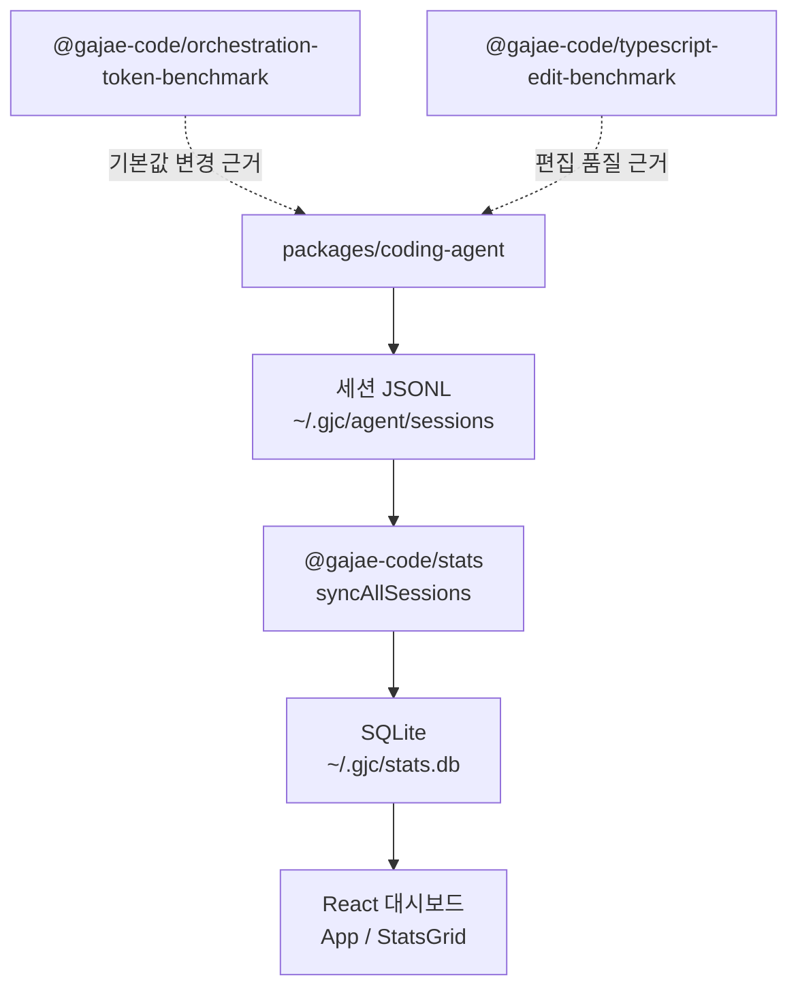

# Support Boundary — Stats and Benchmarks

## 지원 경계: 통계와 벤치마크

이 모듈은 `packages/coding-agent/`의 핵심 실행 경로를 직접 소유하지 않고, 사용량 관측, 비용/행동 집계, 오케스트레이션 토큰 효율 검증, 편집 벤치마크를 담당하는 지원 패키지 묶음입니다.

주요 패키지는 다음 세 가지입니다.

| 패키지 | 역할 |
| --- | --- |
| `@gajae-code/stats` | 로컬 세션 JSONL을 SQLite로 동기화하고 대시보드/API 통계를 제공 |
| `@gajae-code/orchestration-token-benchmark` | 고정 fixture 기반으로 토큰 효율, prefix 안정성, subagent fanout 게이트를 검증 |
| `@gajae-code/typescript-edit-benchmark` | TypeScript 편집 작업을 실행하고 결과, diff, 실패 유형, 대화 덤프를 평가 |

이 경계의 공통 원칙은 “실제 agent 런타임을 보조하되, 핵심 제품 동작을 직접 바꾸지 않는다”입니다. `stats`는 런타임이 남긴 세션 로그를 읽고, benchmark 패키지들은 기본값 변경이나 편집 성능 판단에 필요한 재현 가능한 근거를 만듭니다.



## `@gajae-code/stats`

`packages/stats`는 로컬 관측성 대시보드입니다. `~/.gjc/agent/sessions/` 아래의 JSONL 세션 로그를 읽고, `~/.gjc/stats.db` SQLite 데이터베이스에 메시지 단위 통계를 적재한 뒤, CLI/API/React 대시보드에서 집계 결과를 보여줍니다.

공개 사용 표면은 `README.md` 기준으로 다음과 같습니다.

```bash
gjc stats
gjc stats --port 8080
gjc stats --summary
gjc stats --json
```

프로그래밍 방식으로는 `syncAllSessions()`로 세션 로그를 동기화하고, `getDashboardStats()`로 집계 결과를 읽습니다.

```ts
import { getDashboardStats, syncAllSessions } from "@gajae-code/stats";

// 세션 로그를 SQLite 통계 DB로 동기화합니다.
const { processed, files } = await syncAllSessions();

// 전체/모델/폴더/시계열 통계를 조회합니다.
const stats = await getDashboardStats();
console.log(stats.overall.totalCost);
console.log(stats.byModel[0].avgTokensPerSecond);
```

### 데이터 흐름

`syncAllSessions()`는 세션 파일을 파싱하고 `insertMessageStats()`를 통해 메시지 통계를 저장합니다. 이후 `getDashboardStats()`와 DB 조회 함수들이 대시보드용 aggregate를 구성합니다.

테스트에서 확인되는 핵심 DB/API 함수는 다음과 같습니다.

| 함수 | 역할 |
| --- | --- |
| `syncAllSessions()` | 세션 JSONL 파일을 증분 동기화 |
| `parseSessionFile()` | 단일 세션 파일에서 assistant 메시지 통계 추출 |
| `initDb()` | SQLite 스키마 초기화 및 필요한 backfill 수행 |
| `closeDb()` | 테스트/프로세스 경계에서 DB 연결 종료 |
| `insertMessageStats()` | 파싱된 `MessageStats` 배열 저장 |
| `getDashboardStats(range?)` | 대시보드 전체 통계 구성 |
| `getOverallStats()` | 전체 요청/비용/프리미엄 요청 등 요약 조회 |
| `getRecentRequests(limit)` | 최근 요청 목록 조회 |
| `getBehaviorOverall(range)` | 사용자 메시지 행동 신호 aggregate 조회 |
| `getFileOffset(sessionFile)` | 증분 파싱 offset 조회 |

### 집계 지표

`README.md`에 명시된 주요 계산은 다음과 같습니다.

| 지표 | 계산 방식 |
| --- | --- |
| Tokens/s | `output_tokens / (duration / 1000)` |
| Cache Rate | `cache_read / (input + cache_read) * 100` |
| Error Rate | `count(stopReason=error) / total_calls * 100` |
| Total Cost | `usage.cost.total` 합계 |
| Avg Latency | `duration` 평균 |
| TTFT | `ttft` 평균 |

`getDashboardStats("24h" | "7d" | "all")`는 시간 범위를 적용합니다. 알 수 없는 range는 테스트상 24시간 범위로 fallback됩니다.

### 비용 보정

`db-cost.test.ts`는 OpenAI Codex GPT 계열 요청의 비용 보정 계약을 고정합니다. 세션 usage의 cost가 모두 0이어도 `insertMessageStats()` 또는 `initDb()` backfill 경로에서 `getBundledModel("openai-codex", "gpt-5.4").cost`를 사용해 비용을 재계산합니다.

이 로직은 두 경로를 모두 보장합니다.

- 새로 저장되는 OpenAI Codex GPT row의 zero-cost usage 보정
- 이미 저장된 zero-cost row를 `initDb()` 시점에 backfill

### 프리미엄 요청 backfill

`priority-premium-requests.test.ts`는 `service_tier_change` 이벤트 기반 프리미엄 요청 계산을 검증합니다.

중요한 계약은 다음과 같습니다.

- `serviceTier: "priority"` 상태에서 OpenAI, OpenAI Codex, Anthropic assistant 요청은 premium request로 계산됩니다.
- GitHub Copilot처럼 usage에 이미 `premiumRequests`가 있는 경우 기존 non-zero 값을 보존합니다.
- 과거 버전에서 `premium_requests = 0`으로 적재된 row는 backfill sentinel 부재 시 재파싱되어 UPSERT로 갱신됩니다.
- `parseSessionFile(sessionFile, fromOffset)`가 중간 offset부터 읽더라도, 앞부분의 `service_tier_change` 상태를 replay해서 현재 tier를 복원합니다.

이 때문에 세션 파서는 단순히 offset 이후 줄만 독립적으로 해석하면 안 됩니다. 증분 파싱에서도 상태성 이벤트는 prefix replay로 복구해야 합니다.

### 사용자 행동 지표

`computeUserMessageMetrics()`는 사용자 메시지의 frustration/behavior 신호를 계산합니다. 반환값의 기본값은 `EMPTY_USER_METRICS`입니다.

테스트가 고정하는 신호는 다음과 같습니다.

| 신호 | 예시 계약 |
| --- | --- |
| `yelling` | 대문자 비율이 높은 충분히 긴 문장을 감지 |
| `profanity` | 욕설과 품질 비난 표현을 단어 경계 기준으로 감지 |
| `anguish` | `!!!`, `???`, `!?!?!?`, `!!!111` 같은 드라마 run 감지 |
| `negation` | 메시지 시작의 `no`, `nope`, `wrong file`, 명시적 거절 문구 감지 |
| `repetition` | `i told you`, `i asked you`, 부정/동일성 맥락의 `still` 감지 |
| `blame` | `you broke`, `you missed`, 문장 시작의 `stop ...ing` 감지 |

긴 구조화 프롬프트는 행동 신호를 0으로 접습니다. 테스트 기준으로 비어 있지 않은 prose line이 3개 이상이면 deliberate prompt로 보고 frustration 신호를 억제하지만, 문자 수와 단어 수는 유지합니다.

### 클라이언트 대시보드

React 클라이언트는 `src/client/App.tsx`를 중심으로 동작합니다. call flow 기준으로 `App`은 API 호출과 탭별 데이터 로딩을 담당하고, 표시 컴포넌트가 숫자 포맷과 세부 지표를 렌더링합니다.

대표 흐름은 다음과 같습니다.

- `App` → `loadActiveTabStats()` → `getCostDashboardStats()`
- `App` → `loadRecentLists()` → `getRecentRequests()`
- `App` → `StatsGrid` → `getValue()` → `formatExactNumber()`
- `App` → `StatsGrid` → `getDetail()` → `totalPromptCompletionTokens()`
- `App` → `BehaviorChart`

Tailwind 설정은 CSS 변수 기반 색상 토큰을 사용합니다. `tailwind.config.js`의 `content`는 `src/client/**/*.{js,jsx,ts,tsx}`만 대상으로 하므로, 클라이언트 UI 파일을 추가할 때 이 경계 안에 있어야 스타일이 수집됩니다.

## `@gajae-code/orchestration-token-benchmark`

`packages/orchestration-token-benchmark`는 오케스트레이션 기본값 변경을 검증하기 위한 결정적 벤치마크입니다. 패키지 설명처럼 live model, provider, network 호출 없이 token metrics, prompt-prefix stability, spawn-gate decision을 검증합니다.

공개 export는 `src/index.ts`에서 모입니다.

| 영역 | 주요 API |
| --- | --- |
| 토큰 지표 | `cacheHitRate()`, `computeTokenMetrics()`, `receiptArtifactRatio()`, `forkClonedTokens()`, `assertTokenLogShape()` |
| Prefix 안정성 | `hashPrefix()`, `checkPrefixStability()` |
| Spawn gate | `DEFAULT_SPAWN_THRESHOLD`, `evaluateSpawnGate()`, `evaluateSpawnGateAtThreshold()` |
| 기본값 축소 승인 | `evaluateDefaultReduction()`, `APPLIED_DEFAULT_REDUCTIONS`, `HELD_DEFAULT_REDUCTIONS` |
| Live 비교 runner | `runOneBinary()`, `runLiveComparison()`, `renderMarkdownReport()`, `LiveRunnerError` |
| 전체 fixture 실행 | `runOrchestrationTokenBenchmark()` |

### 결정적 fixture 기반 실행

`runOrchestrationTokenBenchmark()`는 `fixtures.ts`의 고정 fixture를 실행해 구조화된 `BenchmarkReport`를 반환합니다.

- `TOKEN_LOG_HIGH_CACHE`, `TOKEN_LOG_LOW_CACHE` → `computeTokenMetrics()`
- `PREFIX_STABLE`, `PREFIX_MUTATION_FAIL`, `MODEL_SWITCH_RESET` → `checkPrefixStability()`
- `FANOUT_4_OK`, `FANOUT_5_REJECT`, `FANOUT_5_PLAN_OK` → `evaluateSpawnGate()`

`import.meta.main`일 때는 결과를 JSON으로 stdout에 출력합니다.

### 토큰 지표

`TokenLogEntry`는 coding-agent의 `TaskTokenLog` 구조를 의존성 없이 복제한 형태입니다. `assertTokenLogShape()`가 필수 필드와 숫자 안정성을 검사해 fixture drift를 조기에 실패시킵니다.

`computeTokenMetrics()`는 로그 배열을 순수하게 합산합니다.

```ts
const metrics = computeTokenMetrics(TOKEN_LOG_HIGH_CACHE);

metrics.turns;
metrics.inputTokens;
metrics.outputTokens;
metrics.cacheReadTokens;
metrics.cacheWriteTokens;
metrics.totalTokens;
metrics.cacheHitRate;
```

`cacheHitRate(input, cacheRead)`는 `cacheRead / (input + cacheRead)`를 반환하며, 분모가 0이면 `0`을 반환합니다. 이 선택은 `NaN`을 만들지 않기 위한 의도적 계약입니다.

`receiptArtifactRatio(receiptBytes, artifactBytes)`는 전체 artifact 대비 모델에 넣는 receipt 크기를 계산합니다. artifact가 비어 있으면 `0`입니다.

`forkClonedTokens(inheritedTokens, retainedTokens)`는 fork된 child context에 복제되는 토큰 추정치이며, 음수가 되지 않도록 `Math.max(0, ...)`로 제한됩니다.

### Prefix 안정성

`checkPrefixStability()`는 provider-facing prefix, model id, cache key가 한 cache epoch 안에서 안정적인지 검사합니다. reset marker가 없는 중간 변경은 violation입니다.

검사 대상 타입은 `PrefixTurn`입니다.

- `prefix`: system prompt, tools, leading context를 포함한 provider-facing prefix
- `model`: 사용 모델
- `cacheKey`: cache epoch key
- `resetMarker`: compaction, deliberate reset, session reset 같은 승인된 epoch 전환 표시

대표 violation 종류는 테스트 기준으로 다음과 같습니다.

- `prefix-mutation`
- `model-switch`
- `cache-key-change`

reset marker가 있으면 새 epoch를 열 수 있습니다. 예를 들어 compaction 후 prefix와 cache key가 바뀌는 것은 `resetMarker`가 있을 때 허용됩니다.

### Spawn gate

`DEFAULT_SPAWN_THRESHOLD`는 4로 고정되어 있습니다. `evaluateSpawnGate()`는 `childCount <= 4`이면 plan 없이 허용하고, 5개 이상이면 완전한 `SpawnPlanReceipt`가 있어야 허용합니다.

`SpawnPlanReceipt`의 필수 필드는 다음과 같습니다.

- `whyParallel`
- `whyNotLocal`
- `independence`
- `expectedReceiptShape`
- `maxInlineTokens`

문자열 필드는 trim 후 비어 있으면 누락으로 처리됩니다. `maxInlineTokens`는 0이면 불완전한 plan입니다. `childCount`나 threshold가 음수 또는 정수가 아니면 `RangeError` 계열 오류를 던집니다.

`evaluateSpawnGateAtThreshold()`는 threshold sweep을 위한 benchmark-only API입니다. 실제 hard runtime gate를 우회하기 위한 설정 표면이 아니라 테스트/분석용입니다.

### 기본값 축소 승인 게이트

`evaluateDefaultReduction()`은 기본값을 낮추는 변경이 허용 가능한지 판단합니다. 반환 타입은 `{ outcome: "allowed" | "blocked"; reasons: string[] }`입니다.

허용 조건은 모두 충족되어야 합니다.

- `name`이 비어 있지 않아야 합니다.
- `after < before`여야 합니다.
- `tokenMetricAfter < tokenMetricBefore`여야 합니다.
- fixture success rate는 `[0, 1]` 범위의 유한 숫자여야 합니다.
- `fixtureSuccessRateAfter >= fixtureSuccessRateBefore`여야 합니다.
- `latencyRegressionWithinBudget`가 true여야 합니다.
- `humanApproved`가 true여야 합니다.
- `benchmarkEvidence`가 `orchestration-token-benchmark`의 passing evidence여야 합니다.
- `humanApprovalEvidence`가 GitHub PR #272 승인 근거에 묶여 있어야 합니다.

`APPLIED_DEFAULT_REDUCTIONS`에는 PR #272에서 적용된 세 가지 축소가 들어 있습니다.

| 이름 | before | after |
| --- | ---: | ---: |
| `task.maxConcurrency.default.32-to-8` | 32 | 8 |
| `task.forkContext.fullFallback.maxTokens.25000-to-15000` | 25,000 | 15,000 |
| `task.forkContext.fullFraction.0.25-to-0.15` | 0.25 | 0.15 |

`HELD_DEFAULT_REDUCTIONS`는 아직 적용하면 안 되는 후보입니다. 예를 들어 recursion depth 2→1, output cap 500000→250000은 fixture success/latency/human approval 조건이 충족되지 않으므로 blocked 상태이며, `requiresLiveEvidenceVia: "pr9-live-runner"`를 요구합니다.

### Live runner

`live-runner.ts`는 두 개의 명시적 binary를 실행해 before/after 보고서를 비교합니다. 이 경로는 advisory이며 CI의 live assertion으로 쓰지 않습니다. `renderMarkdownReport()`가 생성하는 문서에도 `ADVISORY`, `NON-CI`, `NO LIVE ASSERTIONS` 문구가 포함됩니다.

주요 함수는 다음과 같습니다.

| 함수/클래스 | 역할 |
| --- | --- |
| `runOneBinary(binaryPath, fixtureId, opts?)` | 단일 binary를 `--fixture <id>`로 실행하고 JSON report 파싱 |
| `runLiveComparison(options)` | before/after binary 실행, delta 계산, JSON/Markdown 산출물 저장 |
| `renderMarkdownReport(delta)` | 사람이 읽는 advisory Markdown report 생성 |
| `LiveRunnerError` | `missing_binary`, `malformed_report`, `schema_version_mismatch` 같은 bounded error 표현 |

`runOneBinary()`는 먼저 `assertExecutable()`로 binary 존재와 실행 가능성을 확인합니다. 이후 stdout JSON을 `parseReport()`가 검증합니다. report의 `schemaVersion`은 `LIVE_RUNNER_SCHEMA_VERSION`과 일치해야 하며, `fixtureId`도 요청한 fixture와 같아야 합니다.

`runLiveComparison()`은 다음 산출물을 `outputDir`에 씁니다.

- `before.json`
- `after.json`
- `delta.json`
- `report.md`

## `@gajae-code/typescript-edit-benchmark`

`packages/typescript-edit-benchmark`는 TypeScript 코드 편집 작업을 대상으로 agent 편집 성능을 측정하는 내부 벤치마크입니다. `package.json`의 CLI 표면은 `typescript-edit-benchmark`이며, 주요 스크립트는 다음과 같습니다.

```bash
bun --cwd=packages/typescript-edit-benchmark run generate
bun --cwd=packages/typescript-edit-benchmark run start
bun --cwd=packages/typescript-edit-benchmark test
```

이 패키지는 실제 coding-agent 및 agent-core와 연결됩니다.

- `@gajae-code/coding-agent`
- `@gajae-code/agent-core`
- `@gajae-code/ai`
- `@gajae-code/tui`
- `@babel/parser`, `@babel/traverse`, `@babel/generator`
- `diff`, `prettier`, `regexp-tree`

### 프롬프트 계약

프롬프트는 `src/prompts/*.md` 정적 파일로 관리됩니다.

| 파일 | 역할 |
| --- | --- |
| `benchmark-system.md` | benchmark 참가 agent의 시스템 지침 |
| `benchmark-task.md` | 최초 task prompt 전달 |
| `benchmark-retry.md` | retry 시 guided context와 retry context 전달 |

`benchmark-system.md`의 핵심 계약은 “최소 변경”입니다. expected fixture와 exact diff로 채점되므로, 동등한 코드라도 import 순서 변경, object key 재정렬, 포맷 변경은 실패할 수 있습니다.

### 실행 결과 구성

`buildBenchmarkResult()`는 완료된 run만으로도 report를 만들 수 있습니다. `runner.test.ts`는 scheduled run 전체가 끝나지 않아도 `summary.totalRuns`가 실제 완료 run 수를 반영하고, pending task는 빈 `runs` 배열로 남는 계약을 확인합니다.

`TaskRunResult`에는 다음 계열의 정보가 들어갑니다.

- 성공 여부: `success`, `patchApplied`, `verificationPassed`
- 토큰: `tokens.input`, `tokens.output`, `tokens.total`
- 시간: `duration`
- 도구 호출: read/edit/write 횟수, edit 성공/실패/경고/autocorrect 수
- 실패 분석: `editFailures`, `editWarnings`, `editAutocorrectCount`

`generateReport()`는 `BenchmarkResult`를 Markdown summary로 렌더링합니다. edit 실패가 있으면 실패 category summary를 포함합니다. 예를 들어 `range-continuation` category는 표와 상세 목록에 모두 나타납니다.

### 대화 덤프와 artifact 보존

`writeConversationDump()`는 benchmark run 중의 대화를 coding-agent 세션 덤프 형식으로 저장하고, 관련 artifact 파일도 함께 복사합니다.

테스트는 다음 흐름을 고정합니다.

1. `SessionManager.create(workDir, sessionDir)`로 source session 생성
2. `appendMessage()`로 사용자 메시지 추가
3. `saveArtifact()`로 artifact 저장
4. `ensureOnDisk()`, `flush()`, `close()` 수행
5. `writeConversationDump()` 호출
6. `formatSessionDumpText()` 결과와 dump 본문이 일치하는지 확인
7. source artifact가 dump 옆 디렉터리에 복사되었는지 확인

task id에 `/` 같은 문자가 있어도 dump path는 안전한 이름으로 정규화됩니다. 예를 들어 `task/weird`, run index 0은 `task_weird/run-1.md`로 저장됩니다.

### expected 파일 검증

`verifyExpectedFiles(expectedDir, actualDir)`는 benchmark output을 expected fixture와 비교합니다.

테스트가 고정하는 동작은 다음과 같습니다.

- expected에는 있지만 actual에 없는 파일은 `Missing files: ...`로 실패합니다.
- actual에만 있는 파일은 `Unexpected files: ...`로 실패합니다.
- TypeScript 파일의 내용 차이는 diff와 `diffStats`를 반환합니다.
- 포맷만 다른 TypeScript 코드는 `formattedEquivalent: true`로 성공할 수 있으며, actual 파일 자체를 rewrite하지 않습니다.
- CRLF/LF 차이는 정규화해 비교합니다.
- 비포맷 파일의 whitespace-only 차이는 expected whitespace 보존 기준으로 성공 처리됩니다.

이 검증기는 “에이전트가 파일을 실제로 기대 상태로 만들었는가”를 판단하는 마지막 표면입니다. benchmark runner 쪽 성공 플래그는 이 결과와 함께 해석해야 합니다.

### mutation 생성과 분석 경로

call graph 기준으로 `typescript-edit-benchmark`의 생성/변형 계층은 다음 패턴을 가집니다.

- `generate.ts`의 `main()`이 benchmark case 생성을 시작합니다.
- `analyzeFile()`은 `computeDensity()`를 호출해 파일 내 변형 후보 밀도를 계산합니다.
- `generateCase()`는 `formatContent()`와 `countChangedHunks()`를 사용해 expected case를 구성합니다.
- `mutations.ts`의 `mutate()`는 `applyCandidate()`를 호출합니다.
- mutation 종류에는 `SwapLogicalMutation`, `SwapComparisonMutation` 등이 포함됩니다.

보고 계층은 다음과 같이 분리됩니다.

- `buildBenchmarkResult()`가 raw run 결과를 구조화합니다.
- `generateReport()`가 Markdown report를 만듭니다.
- `appendCategorySummary()`는 `formatRate()`를 사용해 실패 category 비율을 렌더링합니다.
- `writeConversationDump()`는 `copyConversationArtifacts()`를 통해 대화 artifact를 보존합니다.

## 다른 패키지와의 연결

이 지원 경계는 핵심 coding-agent 실행 코드와 느슨하게 연결됩니다.

`stats`는 런타임이 남긴 세션 파일을 읽습니다. 직접 agent 실행을 제어하지 않고, `@gajae-code/utils`의 `getAgentDir()`, `getSessionsDir()`, `getStatsDbPath()`, `setAgentDir()`, `TempDir` 같은 유틸리티를 통해 테스트 격리와 경로 해석을 수행합니다.

`orchestration-token-benchmark`는 coding-agent 기본값의 외부 근거 역할을 합니다. `default-reductions.ledger.test.ts`는 실제 기본값과 ledger를 연결하기 위해 다음 파일을 직접 읽습니다.

- `packages/coding-agent/src/config/settings-schema.ts`
- `packages/coding-agent/src/task/index.ts`

따라서 `task.maxConcurrency`, fork context fallback, full fraction 기본값을 바꾸면 ledger와 benchmark evidence도 함께 검토해야 합니다.

`typescript-edit-benchmark`는 실제 coding-agent 세션과 artifact 저장 방식을 재사용합니다. `SessionManager`, `formatSessionDumpText()`, `RpcClient` 경로를 통해 benchmark 실행 결과가 실제 agent 표면과 최대한 같은 형태로 기록됩니다.

## 변경 시 주의점

`@gajae-code/stats`를 수정할 때는 세 가지 backfill 경로를 같이 고려해야 합니다.

- 새 세션 ingestion
- 기존 DB row migration/backfill
- `file_offsets`가 이미 진행된 증분 동기화 상태

특히 `service_tier_change`처럼 상태를 바꾸는 이벤트는 offset 이후 메시지만 보면 잘못 계산됩니다. `parseSessionFile()` 변경은 incremental parse 테스트를 반드시 확인해야 합니다.

`@gajae-code/orchestration-token-benchmark`를 수정할 때는 결정성을 깨지 않아야 합니다. 기본 `runOrchestrationTokenBenchmark()` 경로는 provider, network, clock, filesystem에 의존하지 않는 순수 fixture 실행이어야 합니다. live runner는 별도 advisory 표면이며, CI의 deterministic assertion과 섞지 않습니다.

`@gajae-code/typescript-edit-benchmark`를 수정할 때는 exact diff scoring을 전제로 해야 합니다. benchmark prompt, mutation, verify 로직은 “좋아 보이는 코드”보다 “기대 fixture와 정확히 맞는 최소 변경”을 우선합니다. Report나 dump 경로를 바꿀 때는 `writeConversationDump()`가 세션 텍스트와 artifact를 보존하는 계약도 함께 유지해야 합니다.