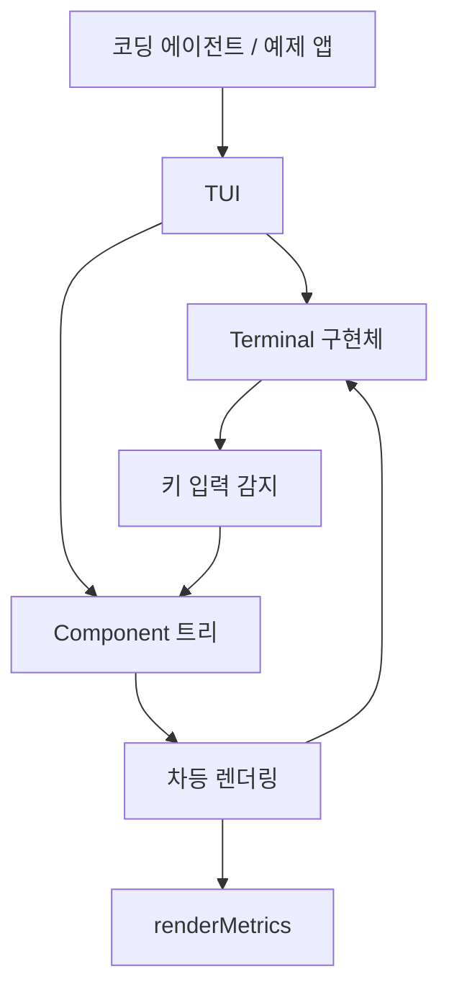

# Support Boundary — Terminal UI

## 터미널 UI 지원 경계

`packages/tui`는 `@gajae-code/tui` 패키지로 배포되는 터미널 UI 라이브러리입니다. 코딩 에이전트 본체가 직접 터미널 제어, 입력 파싱, 화면 diff, 마크다운 렌더링, 자동완성, 로더 애니메이션을 모두 구현하지 않도록 분리된 지원 경계입니다.

이 패키지의 핵심 계약은 단순합니다. UI는 `Component`가 `render(width)`로 반환한 문자열 라인 배열을 `TUI`가 모아 터미널에 그립니다. 각 라인은 주어진 `width`를 넘으면 안 되며, 폭 처리는 `visibleWidth()`, `truncateToWidth()`, `wrapTextWithAnsi()` 같은 유틸리티가 담당합니다.

```typescript
interface Component {
	render(width: number): string[];
	handleInput?(data: string): void;
	invalidate?(): void;
	dispose?(): void;
}
```

## 전체 구조



`TUI`는 루트 컨테이너 역할을 하며 `addChild()`, `removeChild()`, `setFocus()`, `requestRender()`, `start()`, `stop()`으로 화면 수명주기를 관리합니다. 실제 입출력은 `Terminal` 인터페이스 뒤에 숨겨져 있고, 운영 환경에서는 `ProcessTerminal`, 테스트에서는 `VirtualTerminal`을 사용합니다.

## 렌더링 모델

`TUI`의 렌더링은 전체 화면을 매번 다시 쓰지 않는 것이 목표입니다. 컴포넌트 트리를 렌더링한 뒤 이전 프레임과 비교하고, 상황에 따라 세 가지 전략 중 하나를 선택합니다.

1. 최초 렌더링은 모든 라인을 출력합니다.
2. 터미널 폭이 바뀌었거나 변경된 라인이 현재 viewport 위쪽에 있으면 화면을 지우고 전체를 다시 그립니다.
3. 일반적인 갱신은 처음 달라진 라인으로 커서를 이동한 뒤, 그 지점부터 필요한 라인만 다시 씁니다.

모든 출력은 CSI 2026 synchronized output 시퀀스(`\x1b[?2026h`, `\x1b[?2026l`)로 감싸 flicker를 줄입니다. `await-panel-redraw-metrics.test.ts`는 viewport 위쪽 라인이 계속 바뀔 때 `firstChanged < viewportTop` 원인으로 전체 redraw가 반복되는 비용 모델을 고정합니다. 반대로 viewport 안쪽 변경은 차등 패치로 처리됩니다.

`renderMetrics`는 렌더링 비용을 계측하는 내부 지원 도구입니다. 테스트에서는 `lineCounts.rendered`, `measured`, `normalized`, `diffed`, `fullRedrawCauses`, `repaintStorms`를 확인해 렌더링 회귀를 잡습니다.

## 컴포넌트 합성과 수명주기

`Container`는 자식 컴포넌트의 `render(width)` 결과를 순서대로 이어 붙입니다. 대량 라인 출력에서도 `lines.push(...childLines)`처럼 spread를 쓰지 않는 합성 방식이 중요합니다. `container-spread-safe.test.ts`와 red-team 테스트는 수십만 줄에서 백만 줄 규모의 출력이 `RangeError` 없이 유지되는지 검증합니다.

수명주기는 의도적으로 `detach`와 `dispose`를 구분합니다.

- `addChild(component)`는 자식을 추가하고 렌더링을 요청합니다.
- `removeChild(component)`는 자식을 제거하고, 자식이 `dispose()`를 제공하면 호출합니다.
- `clear()`는 현재 자식들을 모두 제거하며 dispose합니다.
- `detachChild(component)`와 `detachAll()`은 소유권을 버리지 않고 트리에서만 분리합니다.
- `dispose()`는 중첩 컨테이너까지 재귀적으로 dispose하지만, 테스트 기준으로 idempotent해야 합니다.

이 차이는 코딩 에이전트의 위젯 재구성 패턴에서 중요합니다. 예를 들어 상태 맵에 보관된 컴포넌트 인스턴스를 매번 `detachAll()` 후 다시 붙이는 구조에서는 인스턴스가 dispose되면 안 됩니다. 반대로 `Loader`처럼 interval을 가진 컴포넌트는 `clear()`나 `removeChild()`에서 반드시 `stop()`되어야 합니다.

## 주요 컴포넌트

### `Text`와 `TruncatedText`

`Text`는 여러 줄 텍스트를 wrapping하고 padding과 배경 함수를 적용합니다. `setText()`와 `setCustomBgFn()`으로 표시 내용을 바꿀 수 있습니다.

`TruncatedText`는 상태줄, 헤더, 짧은 라벨처럼 한 줄 안에 반드시 들어가야 하는 텍스트에 사용합니다. 긴 문자열은 `truncateToWidth()` 기반으로 잘립니다.

### `Box`와 `Container`

`Box`는 `Container`에 padding과 배경 함수를 더한 컴포넌트입니다. `setBgFn()`으로 배경 함수를 동적으로 바꿀 수 있고, `clear()`, `removeChild()`, `dispose()`는 중첩 자식의 수명주기를 정리합니다.

코딩 에이전트 쪽에서는 footer, status line, welcome view, tool renderer 같은 컴포넌트가 `Box`/`Container`의 `render()`, `invalidate()`, `clear()` 경로에 의존합니다. call graph상 `modes/components/footer.ts`, `modes/components/status-line.ts`, `src/tools/bash-interactive.ts`, `modes/components/agent-dashboard.ts` 같은 화면 조각들이 이 경계를 통해 갱신됩니다.

### `Input`

`Input`은 단일 줄 입력 컴포넌트입니다. `setValue()`, `getValue()`, `onSubmit`을 제공하고, 커서 이동과 단어 삭제를 처리합니다. 키 판별은 `isEnter()`, `isCtrlA()`, `isCtrlE()`, `isCtrlW()`, `isCtrlLeft()`, `isCtrlRight()` 같은 유틸리티를 통해 수행됩니다.

### `Editor`

`Editor`는 이 패키지에서 가장 복잡한 상호작용 컴포넌트입니다. 다중 줄 편집, history 탐색, word navigation, bracketed paste, 자동완성, fake cursor, borderless prompt gutter, wide grapheme wrapping을 처리합니다.

주요 공개 패턴은 다음과 같습니다.

```typescript
const editor = new Editor(theme);

editor.onSubmit = text => {
	// 제출된 프롬프트 처리
};

editor.onChange = text => {
	// 입력 변경 반영
};

editor.setAutocompleteProvider(provider);
editor.setText("초기 내용");
editor.getText();
editor.getCursor();
editor.moveToMessageStart();
editor.moveToMessageEnd();
```

`Editor`는 내부적으로 `KillRing`을 사용합니다. call graph 기준으로 `Editor`에서 `tui/src/kill-ring.ts`로 이어지는 경로가 있으며, `Ctrl+K`, `Ctrl+W`, `Alt+D` 같은 편집 명령은 삭제된 텍스트를 재사용 가능한 편집 단위로 다루는 데 연결됩니다.

테스트가 고정하는 중요한 동작은 다음과 같습니다.

- 빈 editor에서 위쪽 화살표는 prompt history를 탐색합니다.
- 내용이 있는 editor에서 위쪽 화살표는 history가 아니라 커서 이동으로 동작합니다.
- `setText()`와 submit 이후에는 wrapped layout cache가 오래된 큰 버퍼를 유지하지 않습니다.
- NFC/NFD 한글 입력은 보이는 음절 기준으로 커서와 backspace가 동작합니다.
- emoji, CJK, 일본어, 중국어, 러시아어, 스페인어, NBSP, joiner 문자가 word navigation과 wrapping에서 안정적으로 처리됩니다.
- borderless prompt gutter가 터미널 폭을 거의 모두 차지해도 cursor marker가 폭 밖으로 넘치지 않습니다.
- slash command는 첫 프롬프트 위치에서만 동기 자동완성 제출을 수행하고, 이전 프롬프트 텍스트 뒤에서는 일반 텍스트로 제출됩니다.

### `Markdown`

`Markdown`은 `marked` 기반 마크다운 렌더러입니다. heading, link, inline code, code block, quote, list, bold, italic, strikethrough, underline 스타일을 `MarkdownTheme`으로 받습니다. `highlightCode(code, lang)`를 제공하면 코드 블록 하이라이트 결과를 직접 주입할 수 있습니다.

HTML 태그는 터미널 출력에서 실행 가능한 HTML이 아니라 일반 텍스트로 취급됩니다. 렌더링 결과는 width와 입력 텍스트 기준으로 캐시되어 반복 repaint 비용을 줄입니다.

### `Loader`와 `CancellableLoader`

`Loader`는 interval 기반 spinner입니다. 생성 시 `TUI` 인스턴스를 받아 tick마다 `requestRender()`를 호출합니다.

```typescript
const loader = new Loader(
	tui,
	frame => frame,
	message => message,
	"처리 중...",
);
```

`CancellableLoader`는 `Loader`에 Escape 처리와 `AbortSignal`을 추가합니다. 사용자가 Escape를 누르면 `signal`이 abort되고 `onAbort`가 호출됩니다. dispose 테스트는 `Container.clear()`나 `Box.clear()`가 loader interval을 멈춰야 함을 검증합니다. 이 규칙이 깨지면 제거된 spinner가 계속 render를 요청하면서 전체 transcript repaint 비용을 만들 수 있습니다.

### `SelectList`와 `SettingsList`

`SelectList`는 선택 가능한 항목 목록입니다. `setFilter()`로 표시 항목을 좁히고, `onSelect`, `onCancel`, `onSelectionChange`로 상호작용을 외부에 전달합니다.

`SettingsList`는 설정 화면용 목록입니다. 항목은 `values`를 가지면 Enter/Space로 값을 순환하고, `submenu`를 가지면 하위 컴포넌트를 열 수 있습니다. 코딩 에이전트의 모델 선택, 세션 선택, 확장 대시보드류 화면이 이런 목록형 컴포넌트 패턴에 맞춰 붙습니다.

### `Image`

`Image`는 base64 이미지 데이터를 Kitty graphics protocol 또는 iTerm2 inline image protocol로 렌더링합니다. 터미널이 지원하지 않으면 `fallbackColor`가 적용된 텍스트 placeholder로 떨어집니다. PNG, JPEG, GIF, WebP 헤더에서 크기를 파싱하고 `maxWidthCells`, `maxHeightCells`, `filename` 옵션으로 표시 범위를 제한합니다.

## 자동완성 경계

`CombinedAutocompleteProvider`는 slash command와 파일 경로 자동완성을 함께 제공합니다.

```typescript
const provider = new CombinedAutocompleteProvider(
	[
		{ name: "help", description: "도움말 표시" },
		{ name: "clear", description: "화면 정리" },
	],
	getProjectDir(),
);

editor.setAutocompleteProvider(provider);
```

자동완성은 크게 세 흐름으로 나뉩니다.

- `/`로 시작하면 slash command 후보를 제공합니다.
- `Tab` 또는 강제 파일 완성 경로에서는 `./`, `../`, `/`, `~/`, `@` prefix를 보존합니다.
- `@` prefix fuzzy search는 attach 가능한 파일 경로를 찾되 `.git` 내부는 제외합니다.

`trySyncSlashCompletion(textBeforeCursor)`는 Enter 처리 중 비동기 제안을 기다리지 않고 slash command를 즉시 완성하기 위한 빠른 경로입니다. 테스트는 `/mo`가 `/model`로 완성되어 제출되는 경우와, 이미 앞선 프롬프트 텍스트가 있을 때 자동완성이 개입하지 않는 경우를 구분합니다.

## 키 입력 처리

`keys.ts`와 keybinding 유틸리티는 raw terminal input을 의미 있는 키 이벤트로 판별합니다. README에 노출된 함수들은 `isEnter`, `isEscape`, `isTab`, `isShiftTab`, `isArrowUp`, `isArrowDown`, `isCtrlA`, `isCtrlK`, `isAltEnter`, `isShiftCtrlD`처럼 직접적인 predicate 형태입니다.

Kitty keyboard protocol도 고려합니다. 예를 들어 NumLock keypad digit, keypad Enter, Ctrl+Enter 변형 입력은 `Editor` 테스트에서 실제 escape sequence로 고정되어 있습니다. 따라서 새 키 처리를 추가할 때는 단일 escape 문자열만 보지 말고 기존 `isX()` 함수 계층에 맞추는 것이 안전합니다.

## 터미널 추상화

`Terminal` 인터페이스는 TUI가 실제 표준 입출력에 직접 묶이지 않도록 합니다.

```typescript
interface Terminal {
	start(onInput: (data: string) => void, onResize: () => void): void;
	stop(): void;
	write(data: string): void;
	get columns(): number;
	get rows(): number;
	moveBy(lines: number): void;
	hideCursor(): void;
	showCursor(): void;
	clearLine(): void;
	clearFromCursor(): void;
	clearScreen(): void;
}
```

`ProcessTerminal`은 `process.stdin/stdout` 기반 구현입니다. `VirtualTerminal`은 `@xterm/headless`를 사용한 테스트 구현으로, viewport, flush, terminal detach, render golden 테스트에 사용됩니다.

`terminal-detach.test.ts`는 `stop()` 이후 터미널 리소스가 분리되는 경로를 검증합니다. 실제 앱에서는 `TUI.stop()`이 cursor 복구, terminal mode 해제, 입력 리스너 정리를 끝내야 합니다.

## 폭, ANSI, 유니코드 처리

터미널 UI에서 가장 자주 깨지는 경계는 문자열 길이와 화면 cell 폭의 차이입니다. 이 패키지는 다음 유틸리티를 중심으로 폭 계산을 통일합니다.

- `visibleWidth(text)`는 ANSI control sequence를 제외하고 보이는 폭을 계산합니다.
- `truncateToWidth(text, width, ellipsis?)`는 ANSI 스타일을 보존하며 지정 폭 안으로 자릅니다.
- `wrapTextWithAnsi(text, width)`는 ANSI 스타일을 보존하며 줄바꿈합니다.
- `Ellipsis.Unicode`, `Ellipsis.Omit`으로 말줄임 방식을 선택합니다.

컴포넌트를 새로 작성할 때 `render(width)`에서 문자열의 `.length`를 기준으로 자르면 emoji, CJK, ANSI 색상, 조합형 한글에서 쉽게 overflow가 납니다. 반드시 `visibleWidth()`와 `truncateToWidth()` 기준으로 처리해야 합니다.

```typescript
class 상태줄 implements Component {
	#text: string;

	constructor(text: string) {
		this.#text = text;
	}

	render(width: number): string[] {
		return [truncateToWidth(this.#text, width)];
	}
}
```

## 코딩 에이전트와의 연결

`packages/tui`는 `packages/coding-agent`의 대화형 실행 표면을 지탱합니다. call graph에는 다음과 같은 사용 지점이 나타납니다.

- `modes/components/assistant-message.ts`, `modes/components/user-message.ts`는 `Text`, `Markdown`, `render()` 경로를 통해 transcript를 표시합니다.
- `modes/components/model-selector.ts`, `oauth-selector.ts`, `session-selector.ts`는 목록형 UI를 갱신하면서 `clear()`와 dispose 경로를 탑니다.
- `modes/components/agent-dashboard.ts`, `read-tool-group.ts`, `compaction-summary-message.ts`는 동적 layout을 다시 만들 때 컨테이너를 비우고 재구성합니다.
- `src/tools/bash-interactive.ts`, `src/tools/ask.ts`는 `Box.render()`, `invalidate()`, `dispose()`와 연결되어 tool 실행 화면을 갱신합니다.
- `src/debug/index.ts`는 `Text`, `SelectList`, `Spacer`, `Loader`를 사용해 디버그/성능/메모리 리포트를 표시합니다.
- `examples/extensions/tools.ts`는 외부 확장 예제에서 `Container`, `SettingsList`, `render()` 패턴을 보여줍니다.

즉 이 패키지는 “UI를 그리는 라이브러리”에 그치지 않고, 코딩 에이전트 런타임에서 long-running tool, subagent await panel, selector, loader, markdown transcript가 서로 간섭하지 않도록 하는 안정성 경계입니다.

## 기여 시 주의할 점

새 컴포넌트나 렌더링 변경을 만들 때는 다음 계약을 지켜야 합니다.

- `render(width)`가 반환하는 모든 라인은 `visibleWidth(line) <= width`를 만족해야 합니다.
- 대량 라인 합성에서 spread를 사용하지 않습니다.
- interval, listener, abort controller 같은 외부 리소스를 가진 컴포넌트는 `dispose()`를 구현합니다.
- 재사용 가능한 자식 인스턴스는 `detachChild()`/`detachAll()` 경로에서 dispose되면 안 됩니다.
- `clear()`와 `removeChild()`는 소유권을 종료하는 경로이므로 dispose가 호출되어야 합니다.
- ANSI 스타일이 들어간 텍스트는 `truncateToWidth()`와 `wrapTextWithAnsi()`로 처리합니다.
- 키 입력 추가는 개별 컴포넌트에 raw escape sequence를 흩뿌리지 말고 key detection 유틸리티를 확장하는 방식이 안전합니다.
- `Editor` 변경은 일반 ASCII 입력뿐 아니라 CJK, emoji, 조합형 한글, prompt gutter, borderless mode, autocomplete, history navigation을 함께 고려해야 합니다.

이 모듈의 테스트는 단순 단위 테스트보다 회귀 방지 성격이 강합니다. `editor.test.ts`, `autocomplete.test.ts`, `component-dispose.test.ts`, `container-spread-safe.test.ts`, `await-panel-redraw-metrics.test.ts`, `render-goldens` 계열 테스트는 실제 터미널 UX에서 발생했던 overflow, flicker, stale cache, leaked interval, 대량 transcript 문제를 고정합니다. 새 변경은 가능하면 해당 행동 계약을 직접 검증하는 테스트와 함께 들어가야 합니다.