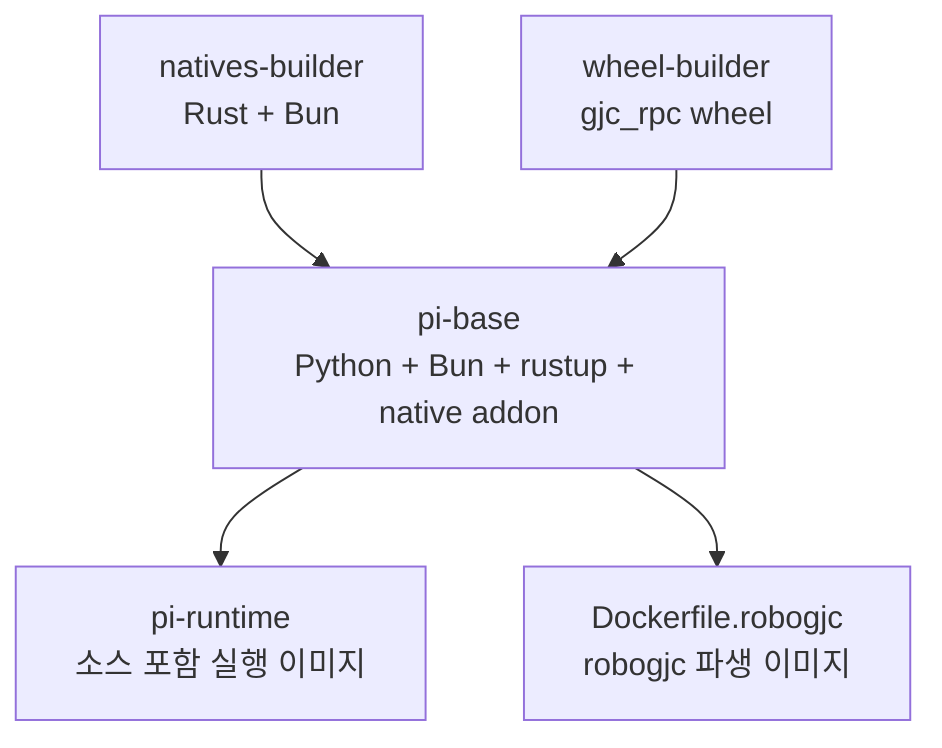

# Support Boundary — Workspace Images and Tooling Config

## 지원 경계: 워크스페이스 이미지와 도구 설정

이 모듈은 실행 코드가 아니라 저장소 전체를 둘러싼 빌드, 컨테이너, 포맷팅, 린트, Rust 툴체인 경계를 정의합니다. `packages/coding-agent/`가 실제 GJC CLI 제품 표면이라면, 이 영역은 그 제품을 로컬 개발, CI, Docker 이미지, 파생 서비스 이미지에서 같은 방식으로 빌드하고 실행하게 만드는 기반 설정입니다.

호출 그래프나 실행 흐름은 없습니다. 대신 Docker 빌드 단계, Cargo 워크스페이스 설정, Bun/biome/rustfmt/rust-analyzer 설정이 서로 맞물려 저장소의 개발 규칙과 배포 산출물을 고정합니다.

## 주요 구성 파일

| 파일 | 역할 |
| --- | --- |
| `Cargo.toml` | Rust 워크스페이스, 공통 의존성, 프로파일, lint 정책 정의 |
| `Dockerfile` | 기본 `gajae-code/pi:dev` 이미지와 공유 가능한 `pi-base` 이미지 빌드 |
| `Dockerfile.robogjc` | `pi-base` 위에 robogjc 서버와 웹 대시보드를 올리는 파생 이미지 |
| `Dockerfile.dockerignore` | 기본 pi 이미지 빌드 컨텍스트에서 제외할 파일 정의 |
| `Dockerfile.robogjc.dockerignore` | robogjc 이미지 전용 빌드 컨텍스트 축소 |
| `bunfig.toml` | Bun 설치, 로더, 테스트 탐색 정책 |
| `biome.json` | TypeScript/TSX lint와 formatter 정책 |
| `rust-toolchain.toml` | 고정 Rust nightly 툴체인과 타깃 |
| `rustfmt.toml` | Rust 포맷 규칙 |
| `rust-analyzer.toml` | rust-analyzer import 정리 방식 |
| `NOTICE.md` | upstream 계보와 attribution |

## Docker 이미지 구조

`Dockerfile`은 네 개의 stage로 구성됩니다.



### `natives-builder`

`natives-builder`는 `rust:1.86-slim-bookworm` 기반에서 Bun과 Rust를 사용해 Linux용 N-API addon을 만듭니다.

핵심 산출물은 다음 경로 패턴입니다.

```text
packages/natives/native/pi_natives.linux-*.node
```

빌드 결과는 `/out/`으로 복사되고, 이후 `pi-base` stage가 이 파일을 `/opt/bun/bin/`으로 가져갑니다. `Dockerfile` 주석에 명시된 것처럼 pi loader는 `/opt/bun/bin`을 fallback 경로로 탐색합니다.

이 stage는 Docker layer cache를 위해 두 단계 복사 패턴을 사용합니다.

1. `COPY --parents`로 manifest와 lockfile만 먼저 복사
2. `bun install --frozen-lockfile --ignore-scripts`
3. 전체 소스 복사
4. `bun --cwd=packages/natives run build`

이 구조 덕분에 `packages/*/src`나 `crates/*/src`만 바뀐 경우 의존성 설치 layer가 다시 깨지지 않습니다.

### `wheel-builder`

`wheel-builder`는 `python:3.12-slim-bookworm`에서 `python/gjc-rpc` 패키지를 wheel로 빌드합니다.

```dockerfile
COPY python/gjc-rpc /src
RUN python -m build --wheel --outdir /out
```

이 wheel은 `pi-base`에서 설치되어 GJC 런타임의 Python RPC 경계를 제공합니다.

### `pi-base`

`pi-base`는 공유 가능한 실행 기반 이미지입니다. Python, Bun, rustup launcher, native addon, `gjc_rpc` wheel, `/usr/local/bin/gjc` shim을 포함합니다.

중요한 환경 변수는 다음과 같습니다.

```text
PI_ROOT=/work/pi
CARGO_HOME=/data/cache/cargo
CARGO_TARGET_DIR=/data/cache/cargo-target
RUSTUP_HOME=/data/cache/rustup
BUN_INSTALL=/opt/bun
```

`PI_ROOT`는 GJC 소스 체크아웃 위치를 가리킵니다. 기본값은 `/work/pi`이므로 파생 이미지나 컨테이너 실행 시 host checkout을 mount하는 방식에 맞춰져 있습니다.

`/usr/local/bin/gjc` shim은 실제 CLI를 다음처럼 실행합니다.

```bash
exec bun "$PI_ROOT/packages/coding-agent/src/cli.ts" "$@"
```

따라서 `pi-base` 자체는 소스를 baked-in으로 갖지 않아도 됩니다. `PI_ROOT/packages/coding-agent`가 존재하지 않으면 shim은 127로 종료합니다.

### `pi-runtime`

`pi-runtime`은 기본 target입니다. `pi-base`에 전체 pi 소스를 넣고 `PI_ROOT=/pi`로 고정해, host checkout 없이도 바로 실행 가능한 이미지가 됩니다.

기본 실행 표면은 다음과 같습니다.

```dockerfile
ENTRYPOINT ["/usr/bin/tini", "--", "/usr/local/bin/gjc"]
CMD ["--help"]
```

이미지 빌드 중 root package의 `prepare` script를 `--ignore-scripts`로 건너뛰기 때문에, 마지막에 문서 인덱스를 명시적으로 재생성합니다.

```dockerfile
RUN bun --cwd=packages/coding-agent run generate-docs-index
```

## robogjc 파생 이미지

`Dockerfile.robogjc`는 기본 pi 이미지를 직접 다시 만들지 않고 `PI_BASE`를 상속합니다.

```dockerfile
ARG PI_BASE=gajae-code/pi:dev
FROM ${PI_BASE} AS runtime
```

이 파일은 두 가지 책임만 추가합니다.

1. `python/robogjc/web`의 SolidJS/Vite 대시보드 번들 생성
2. `python/robogjc` Python 패키지와 정적 번들을 runtime 이미지에 설치

`web-builder` stage는 root manifest와 `python/robogjc/web/package.json`만 먼저 복사한 뒤 `bun install --filter robogjc-web`를 실행합니다. 이후 웹 소스를 복사하고 `bun --cwd=python/robogjc/web run build`로 정적 번들을 만듭니다.

runtime stage는 `/work/pi`에 read-only로 mount된 host pi checkout을 사용하도록 `PI_ROOT=/work/pi`를 유지합니다. agent home은 `/srv/agent-home-stage`에서 `/srv/agent-home`으로 복사되는 구조를 전제로 하며, 최종 entrypoint는 다음 파일입니다.

```text
/usr/local/bin/robogjc-entrypoint
```

## Docker ignore 경계

`Dockerfile.dockerignore`와 `Dockerfile.robogjc.dockerignore`는 각 Dockerfile 전용 shadow ignore 파일입니다. 둘 다 다음 범주를 빌드 컨텍스트에서 제외합니다.

- 대형 빌드 산출물: `target/`, `**/node_modules`, `dist/`, `runs/`
- agent/worktree scratch: `.fallow/`, `.worktrees/`, `.wt/`, `.opencode/`, `.pi_config/`, `.gjc/plugins/`
- VCS와 editor 상태: `.git/`, `.vscode/`, `.zed/`, `.idea/`
- 로그, 프로파일, coverage, cache
- generated 파일
- `.env`

robogjc 전용 ignore는 추가로 `crates/`, `docs/`, `assets/`, `scripts/`, `LICENSE`, `AGENTS.md`, `README.md`를 제외합니다. robogjc Dockerfile이 root 전체를 복사하지 않고 `python/robogjc`와 web workspace만 선택적으로 복사하기 때문에 가능한 축소입니다.

## Rust 워크스페이스 설정

`Cargo.toml`은 Rust workspace root입니다.

```toml
[workspace]
members = ["crates/*"]
exclude = ["crates/brush-core-vendored", "crates/brush-builtins-vendored"]
resolver = "3"
```

vendored brush crate는 workspace member에서는 제외되지만, `[patch.crates-io]`로 crates.io dependency를 로컬 경로로 대체합니다.

```toml
[patch.crates-io]
brush-core = { path = "crates/brush-core-vendored" }
brush-builtins = { path = "crates/brush-builtins-vendored" }
```

공통 Rust 의존성은 `[workspace.dependencies]`에 모입니다. 내부 crate(`pi-ast`, `pi-iso`, `pi-shell`)와 N-API, tree-sitter, terminal, image, search, shell parsing 관련 의존성이 여기에서 버전 고정됩니다.

### 빌드 프로파일

`release`는 크기와 최적화 중심입니다.

```toml
[profile.release]
opt-level = 3
lto = "fat"
codegen-units = 1
strip = true
panic = "abort"
```

`ci`와 `local`은 `release`를 상속하지만 `panic = "unwind"`로 바꿉니다. 주석에 따르면 `crates/pi-natives/src/task.rs`의 blocking-task `catch_unwind` guard가 panic을 `napi::Error`로 바꾸려면 unwind가 필요합니다. 이 설정은 profile-root-only라 특정 package에만 줄 수 없어서 profile 전체에 적용됩니다.

`dev`는 빠른 증분 빌드에 맞춰져 있고, dependency package만 `opt-level = 2`로 컴파일해 캐시 효율을 높입니다.

## Rust lint와 포맷 정책

`Cargo.toml`의 `[workspace.lints.clippy]`는 `correctness`와 `suspicious`를 `deny`로 두고, `all`, `nursery`, `pedantic`, `perf`, `style`은 `warn`으로 둡니다.

많은 Clippy rule은 의도적으로 `allow`되어 있습니다. 예를 들어 숫자 cast, floating point 비교, builder-style 반환, wildcard import, `too_many_lines`는 이 코드베이스의 성격상 기계적 제한보다 명시적 판단을 우선합니다.

`rustfmt.toml`은 Rust 2024 edition 기준이며, import는 crate 단위로 묶습니다.

```toml
edition = "2024"
style_edition = "2024"
group_imports = "StdExternalCrate"
imports_granularity = "Crate"
hard_tabs = true
tab_spaces = 3
```

vendored brush crate는 rustfmt 대상에서 제외됩니다.

```toml
ignore = ["crates/brush-core-vendored/**", "crates/brush-builtins-vendored/**"]
```

`rust-toolchain.toml`은 `nightly-2026-04-29`를 고정하고, `rustfmt`, `clippy`, `rust-analyzer` 컴포넌트와 Linux/Windows 타깃을 설치 대상으로 둡니다.

## Bun 설정

`bunfig.toml`은 dependency 설치와 파일 loader 정책을 정의합니다.

```toml
telemetry = false

[install]
minimumReleaseAge = 259200
linker = "hoisted"
exact = true
saveTextLockfile = true
```

`minimumReleaseAge`는 새로 배포된 패키지를 즉시 받지 않도록 3일 지연을 둡니다. `@types/bun`, `bun-types`는 예외입니다. `linker = "hoisted"`는 Dockerfile 주석에서도 중요한 전제입니다. 빌드 컨텍스트에서 `**/node_modules`를 제외해 host의 stale isolated-linker symlink가 이미지 내부 hoisted `node_modules`를 가리지 않게 합니다.

loader 설정은 Markdown, Python, Lark 파일을 text import로 다루게 합니다.

```toml
[loader]
".md" = "text"
".py" = "text"
".lark" = "text"
```

테스트 탐색에서는 robogjc clone/scratch 경로와 worktree 경로를 제외합니다.

```toml
[test]
pathIgnorePatterns = [
  "**/node_modules/**",
  "python/robogjc/data/**",
  ".wt/**",
  ".worktrees/**",
]
```

## TypeScript lint와 formatter 경계

`biome.json`은 TypeScript/TSX 파일에 대한 formatter와 linter 표준입니다.

대상 파일은 주로 다음 범위입니다.

```json
"packages/*/src/**/*.ts",
"packages/*/src/**/*.tsx",
"packages/*/test/**/*.ts",
"packages/*/examples/**/*.ts",
"packages/*/scripts/**/*.ts",
"packages/*/*.ts"
```

generated 파일, vendor, node_modules, worktree, `.gjc`는 제외됩니다.

formatter는 tab indentation, LF line ending, double quote, semicolon, trailing comma를 사용합니다.

```json
"indentStyle": "tab",
"indentWidth": 3,
"lineWidth": 120
```

lint에서는 `noUnusedImports`와 `useConst`를 error로 두고, `noUnusedVariables`는 warn으로 둡니다. `noExplicitAny`는 Biome 레벨에서는 꺼져 있지만, 저장소의 AGENTS 규칙상 product code에서는 `any` 사용을 별도로 제한합니다.

## rust-analyzer 설정

`rust-analyzer.toml`은 editor와 LSP가 import를 정리하는 방식을 rustfmt 정책과 맞춥니다.

```toml
[imports]
granularity = { enforce = true, group = "crate" }
preferNoStd = false
preferPrelude = true
prefix = "crate"
```

이 설정은 Rust source 수정 시 import가 crate 단위로 정리되도록 유도합니다.

## 코드베이스와의 연결 방식

이 모듈은 런타임 함수나 클래스에 직접 호출되지 않습니다. 대신 다음 표면에서 전체 저장소와 연결됩니다.

- `packages/natives`는 Docker `natives-builder`에서 `bun --cwd=packages/natives run build`로 Linux native addon을 생성합니다.
- `python/gjc-rpc`는 `wheel-builder`에서 wheel로 패키징되어 `pi-base`에 설치됩니다.
- `packages/coding-agent/src/cli.ts`는 `/usr/local/bin/gjc` shim이 실행하는 실제 CLI entrypoint입니다.
- `packages/coding-agent`의 docs index는 `pi-runtime` 빌드에서 `generate-docs-index`로 재생성됩니다.
- `python/robogjc/web`은 `Dockerfile.robogjc`의 `web-builder`에서 Vite bundle로 빌드됩니다.
- `python/robogjc`는 `Dockerfile.robogjc` runtime stage에서 Python package로 설치됩니다.
- `crates/*`는 `Cargo.toml` workspace와 `rust-toolchain.toml`의 Rust 빌드 경계를 따릅니다.

## 수정 시 주의점

Dockerfile을 바꿀 때는 manifest-only copy layer와 source copy layer의 분리를 유지해야 합니다. 이 패턴은 `bun install` cache와 native build cache에 직접 영향을 줍니다.

`PI_ROOT`의 의미도 보존해야 합니다. `pi-base`는 mounted checkout을 전제로 `/work/pi`를 기본값으로 사용하고, `pi-runtime`은 baked-in source를 전제로 `/pi`를 사용합니다. robogjc도 host checkout mount를 사용하므로 `PI_ROOT=/work/pi`를 유지합니다.

Rust profile의 `panic = "unwind"` override는 단순 성능 설정이 아닙니다. `ci`와 `local` profile에서 pi-natives panic을 `napi::Error`로 변환하는 동작과 연결되어 있으므로, `release` 최적화만 보고 제거하면 native boundary의 에러 매핑이 달라질 수 있습니다.

Docker ignore 파일은 중복처럼 보이지만 의도적으로 Dockerfile별 shadow ignore입니다. 공통 ignore를 하나로 합칠 수 없으므로, 새 generated 파일이나 대형 산출물을 추가할 때 두 ignore 파일을 함께 검토해야 합니다.