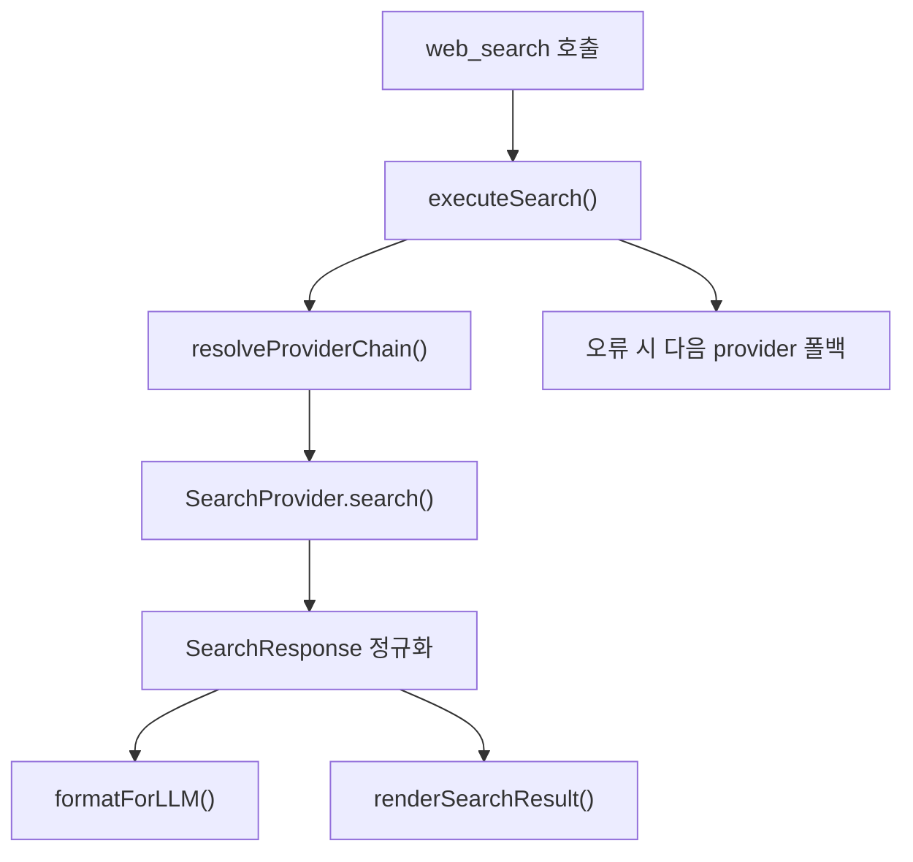

# Web Search and Research

## 역할과 범위

Web Search and Research 모듈은 `web_search` 도구를 통해 최신 웹 정보를 검색하고, 공급자별 응답을 공통 `SearchResponse` 형태로 정규화한 뒤 LLM 출력과 TUI 렌더링에 맞게 전달합니다. 기본 검색 경로는 `packages/coding-agent/src/web/search/index.ts`이며, Exa MCP/Websets 계열 도구는 `packages/coding-agent/src/exa/*`에서 별도 래퍼로 관리됩니다.

이 모듈은 세 가지 책임을 가집니다.

- 검색 실행: `WebSearchTool`, `webSearchCustomTool`, `runSearchQuery()`가 검색 요청을 받습니다.
- 공급자 선택과 폴백: `resolveProviderChain()`이 설정, 활성 모델, 인증 상태를 바탕으로 사용할 `SearchProvider` 체인을 만듭니다.
- 응답 정규화와 표시: 각 provider가 `SearchResponse`를 반환하고, `formatForLLM()`, `renderSearchResult()`, `renderExaResult()`가 소비자별 출력으로 바꿉니다.



## 주요 진입점

`WebSearchTool`은 agent-core의 `AgentTool` 구현체입니다. 세션의 `authStorage`, `sessionId`, 활성 모델 정보를 모아 `executeSearch()`로 넘깁니다. 일반 에이전트 실행 경로에서 사용하는 정식 도구입니다.

`webSearchCustomTool`은 같은 기능을 CustomTool 표면으로 노출합니다. `renderCall()`은 `renderSearchCall()`을, `renderResult()`는 `renderSearchResult()`를 호출하므로 TUI에서 호출 인자와 결과를 접고 펼쳐 볼 수 있습니다.

`runSearchQuery()`는 CLI와 테스트용 실행 함수입니다. `authStorage`가 주어지지 않으면 `discoverAuthStorage()`로 표준 인증 저장소를 찾습니다. `src/cli/web-search-cli.ts`의 `runSearchCommand()`가 이 함수를 사용합니다.

`getSearchTools()`는 현재 검색 도구 목록으로 `[webSearchCustomTool]`만 반환합니다. SDK 세션 생성 흐름인 `createAgentSession()`에서 검색 도구를 등록할 때 사용됩니다.

## 검색 실행 흐름

`executeSearch()`는 모듈의 중심 함수입니다.

1. `resolveProviderChain()`으로 사용할 provider 목록을 결정합니다.
2. 각 provider의 `search()`를 순서대로 호출합니다.
3. 성공한 첫 응답을 `formatForLLM()`로 텍스트화하고 `details.response`에 원본 `SearchResponse`를 담습니다.
4. 실패하면 `SearchProviderError`를 provider별 메시지로 바꾸고 다음 provider를 시도합니다.
5. `AbortSignal`이 취소된 경우에는 `throwIfAborted()`로 즉시 중단합니다. 취소를 일반 provider 실패로 처리하지 않습니다.
6. 모든 provider가 실패하면 마지막 실패 또는 전체 실패 요약을 `Error: ...` 텍스트로 반환합니다.

주의할 점은 query에 있는 `202\d` 패턴을 현재 연도로 치환하는 코드가 있다는 점입니다.

```ts
query: params.query.replace(/202\d/g, String(new Date().getFullYear()))
```

기존 동작을 바꿀 때는 이 보정이 검색 정확도와 테스트 기대값에 영향을 줄 수 있습니다.

## Provider 추상화

모든 검색 provider는 `SearchProvider` 추상 클래스를 상속합니다.

```ts
abstract class SearchProvider {
	abstract readonly id: SearchProviderId;
	abstract readonly label: string;
	abstract isAvailable(authStorage: AuthStorage): Promise<boolean> | boolean;
	abstract search(params: SearchParams): Promise<SearchResponse>;
}
```

`SearchParams`는 provider가 공통으로 받는 입력 계약입니다. 특히 인증은 반드시 `authStorage`를 통해 해결해야 합니다. 주석에도 명시되어 있듯이 provider가 별도 SQLite 핸들이나 직접 refresh helper를 열면 broker 기반 refresh 흐름과 충돌할 수 있습니다.

`recency`는 순수 시간 필터입니다. provider는 이를 주제 변경, 뉴스 검색 강제, 랭킹 전략 변경 같은 의미로 해석하면 안 됩니다. 지원하지 않는 provider는 조용히 무시해야 합니다.

## Provider 등록과 lazy loading

`provider.ts`의 `PROVIDER_META`는 provider id, 표시 label, lazy loader를 보관합니다. `getSearchProvider()`는 첫 호출 때만 실제 provider 모듈을 `import()`하고 `instanceCache`에 저장합니다. 이 구조 덕분에 CLI 시작 시 모든 provider 구현과 파서가 한꺼번에 로드되지 않습니다.

등록된 provider에는 `duckduckgo`, `tavily`, `perplexity`, `brave`, `jina`, `kimi`, `anthropic`, `gemini`, `codex`, `zai`, `exa`, `parallel`, `kagi`, `synthetic`, `searxng`, `openai-compatible`가 포함됩니다. 단, `openai-compatible`은 내부 adapter 성격이므로 사용자가 forced primary나 fallback으로 직접 선택할 수 없습니다.

## Provider 체인 결정

`resolveProviderChain()`은 다음 순서로 provider 체인을 구성합니다.

- `preferredProvider`가 `"auto"`가 아니고 설정 가능한 provider면, 해당 provider가 사용 가능한지 확인해 추가합니다.
- 활성 모델 컨텍스트가 있으면 `MODEL_PROVIDER_TO_SEARCH`로 모델 provider를 검색 provider에 매핑합니다.
- `inferNativeProviderFromModel()`로 Anthropic, Gemini, OpenAI 계열 모델의 native web search 가능성을 추론합니다.
- OpenAI-compatible wire API이고 조건을 만족하면 내부 `"openai-compatible"` adapter를 추가합니다.
- 설정된 fallback provider들을 순서대로 추가합니다.
- 마지막으로 keyless fallback인 `"duckduckgo"`를 항상 추가합니다.

`appendAvailable()`은 `provider.isAvailable(authStorage)`가 true일 때만 체인에 넣습니다. 반면 `appendDeduped()`는 내부 adapter나 마지막 DuckDuckGo처럼 별도 가용성 확인 없이 중복만 제거하고 추가할 때 사용됩니다.

## 주요 Provider 구현

`DuckDuckGoProvider`는 무인증 기본 fallback입니다. `searchDuckDuckGo()`는 `html.duckduckgo.com/html/`과 `lite.duckduckgo.com/lite/`를 순차 시도하고, user-agent를 회전하며, 202 rate limit이나 빈 파싱 결과를 실패로 처리합니다. `parseHtmlResults()`, `parseLiteResults()`, `decodeResultUrl()`은 HTML fixture 기반 테스트로 보호되는 작은 파서입니다.

`ExaProvider`는 `https://api.exa.ai/search`를 직접 호출합니다. `buildExaRequestBody()`는 `contents.summary`를 포함해 per-result summary를 요청하고, `synthesizeAnswer()`는 최대 3개 summary를 `SearchResponse.answer`로 합성합니다. `settings.get("exa.enabled")` 또는 `settings.get("exa.enableSearch")`가 false면 사용할 수 없습니다.

`BraveProvider`는 Brave REST API를 호출합니다. `callBraveSearch()`는 `freshness`에 `day/week/month/year`를 매핑하고, `buildSnippet()`으로 description과 `extra_snippets`를 중복 제거해 합칩니다.

`AnthropicProvider`는 Anthropic Messages API의 `web_search_20250305` 도구를 사용합니다. `parseResponse()`는 `server_tool_use`, `web_search_tool_result`, `text` block을 읽어 `answer`, `sources`, `citations`, `searchQueries`, `usage`를 구성합니다.

`CodexProvider`는 ChatGPT backend의 `/codex/responses` SSE API를 사용합니다. `findCodexAuth()`는 `authStorage.getOAuthAccess("openai-codex")`만 사용하고, `callCodexSearch()`는 `web_search` tool을 강제합니다. 응답 annotation이 없는 경우 `extractTextSources()`가 markdown link와 bare URL에서 source를 복구합니다.

`GeminiProvider`는 Cloud Code Assist API의 Google Search grounding을 사용합니다. `findGeminiAuth()`는 `google-gemini-cli`, `google-antigravity` OAuth를 순서대로 확인합니다. `buildGeminiRequestTools()`는 `googleSearch`, 선택적 `codeExecution`, `urlContext` 도구 구성을 만듭니다.

`Kagi`와 `Parallel`은 `src/web/kagi.ts`, `src/web/parallel.ts`에 직접 클라이언트로 구현되어 있습니다. `searchWithKagi()`는 Kagi API 응답의 `t: 0` 검색 결과와 `t: 1` related searches를 분리합니다. `searchWithParallel()`과 `extractWithParallel()`은 Parallel Search/Extract API 응답을 `ParallelSearchResult`, `ParallelExtractResult`로 파싱합니다.

## Exa MCP와 Websets 도구

`packages/coding-agent/src/exa/*`는 통합 `web_search` provider와 별개로 Exa MCP 도구를 CustomTool 형태로 감싸는 계층입니다.

`createExaTool()`은 정적 MCP 도구 래퍼를 만듭니다. 실행 시 `findApiKey()`로 `EXA_API_KEY`를 찾고, `callExaTool()`을 호출한 뒤 검색 응답이면 `formatSearchResults()`로, 그 외 응답이면 `formatGenericResponse()`로 변환합니다. 예외는 throw하지 않고 `content: "Error: ..."`와 `details.error`로 반환합니다.

`MCPWrappedTool`은 서버에서 가져온 MCP schema 기반 동적 래퍼입니다. Websets 도구는 API key가 필수이므로 `config.isWebsetsTool`이 true일 때 key가 없으면 즉시 오류 결과를 반환합니다.

`createMCPToolFromServer()`는 `fetchMCPToolSchema()`로 MCP 서버 schema를 조회하고 실패하면 fallback schema와 description을 사용합니다. schema는 `mcpSchemaCache`에 `exa:<toolName>` 또는 `websets:<toolName>` 키로 캐시됩니다.

`normalizeMcpToolPayload()`는 Exa MCP 응답의 여러 shape를 흡수합니다. `structuredContent`, `data`, `result`, root payload, 그리고 `content[].text` 안에 들어 있는 JSON 문자열까지 후보로 검사해 `isSearchResponse()`에 맞는 값을 우선 반환합니다.

## 응답 형식과 렌더링

검색 provider의 공통 출력은 `SearchResponse`입니다. 주요 필드는 `provider`, `answer`, `sources`, `citations`, `relatedQuestions`, `searchQueries`, `usage`, `model`, `requestId`입니다.

`formatForLLM()`은 LLM이 읽기 쉬운 텍스트를 만듭니다.

- `answer`가 있으면 먼저 출력합니다.
- source는 `[1] title`과 URL, 짧은 snippet으로 표시합니다.
- citation은 별도 `## Citations` 섹션에 둡니다.
- related questions와 실제 search query도 있으면 뒤에 추가합니다.
- 긴 snippet과 cited text는 `truncateText()`로 240자까지 줄입니다.

TUI 렌더링은 두 계층입니다.

- 통합 검색 결과: `renderSearchCall()`, `renderSearchResult()`
- Exa MCP 결과: `renderExaCall()`, `renderExaResult()`

`renderExaResult()`는 `details.error`, `details.raw`, `details.response`를 구분합니다. 접힌 상태에서는 첫 결과의 preview와 남은 line/result 수만 보여주고, 펼친 상태에서는 title, domain, URL, author, published date, 본문 일부, highlight 일부를 tree 형태로 출력합니다. 출력 폭은 `truncateToWidth()`, `PREVIEW_LIMITS`, `TRUNCATE_LENGTHS`로 제한됩니다.

렌더링 결과는 TUI의 `Text` component로 반환되고, 이후 `output-block` 렌더링 흐름에서 theme 색상과 border 처리가 적용됩니다.

## 오류 처리 원칙

Provider HTTP 오류는 가능한 경우 `classifyProviderHttpError()`로 표준 `SearchProviderError`로 바꿉니다. `executeSearch()`는 provider별 오류를 누적하고, fallback이 모두 실패했을 때 한 번에 요약합니다.

인증 오류는 사용자 행동으로 이어질 수 있게 구체적으로 작성되어 있습니다.

- Kagi: `Kagi credentials not found. Set KAGI_API_KEY or login with 'gjc /login kagi'.`
- Parallel: `Parallel credentials not found. Set PARALLEL_API_KEY or login with 'gjc /login parallel'.`
- Codex: `Login with 'gjc /login openai-codex'`
- Exa provider: `EXA_API_KEY is required; Exa MCP fallback is disabled in gajae-code.`

취소는 오류 폴백과 분리됩니다. `executeSearch()`는 provider 실패 catch 안에서 `throwIfAborted(signal)`을 호출하고, DuckDuckGo도 retry 루프 중 `params.signal?.aborted`를 확인합니다.

## 인증과 설정 연결

이 모듈에는 두 종류의 인증 경로가 있습니다.

첫째, 통합 `web_search` provider는 원칙적으로 `AuthStorage`를 사용합니다. OAuth provider인 Codex, Gemini, Perplexity 계열은 `getOAuthAccess()` 또는 `hasOAuth()`를 사용하고, API key provider는 `getApiKey()` 또는 `hasAuth()`를 사용합니다.

둘째, 일부 직접 API 클라이언트는 환경 변수 기반 helper를 사용합니다. 예를 들어 Brave는 `getEnvApiKey("brave")`, Exa direct provider는 `getEnvApiKey("exa")`, Parallel은 `findCredential(storage, getEnvApiKey("parallel"), "parallel")`을 사용합니다.

설정 변경 흐름에서는 `handleSettingChange()`가 `setPreferredSearchProvider()`, `setSearchFallbackProviders()`, `isSearchProviderPreference()`, `isConfigurableSearchProviderId()`와 연결됩니다. 세션 생성 흐름에서는 `createAgentSession()`이 fallback provider 설정과 검색 도구 등록을 수행합니다.

## 확장할 때 지켜야 할 계약

새 provider를 추가할 때는 `SearchProvider`를 상속하고 `SearchResponse`만 반환해야 합니다. provider 고유 응답 shape를 상위 계층으로 새어 나오게 하면 `formatForLLM()`과 TUI 렌더러가 깨집니다.

`PROVIDER_META`에는 label과 lazy `load()`를 추가하고, 사용자 설정 가능 provider라면 `SearchProviderId` 및 configurable id 검증에도 반영해야 합니다. 내부 전용 adapter라면 `openai-compatible`처럼 forced primary와 fallback에서 제외되도록 해야 합니다.

인증은 `SearchParams.authStorage`를 우선해야 합니다. provider 내부에서 별도 credential store를 열거나 refresh token을 직접 다루면 broker refresh와 충돌할 수 있습니다.

`recency`는 시간 필터로만 전달해야 합니다. provider API가 시간 필터와 topic/ranking을 묶어 제공한다면 구현체에서 분리해야 하며, query를 다시 쓰는 방식으로 흉내 내면 안 됩니다.

렌더링에 새 필드를 노출할 때는 terminal 폭과 접힘 상태를 고려해야 합니다. 긴 본문, URL, highlight는 `truncateToWidth()`, `getPreviewLines()`, `formatMoreItems()` 같은 기존 유틸을 사용해 제한합니다.