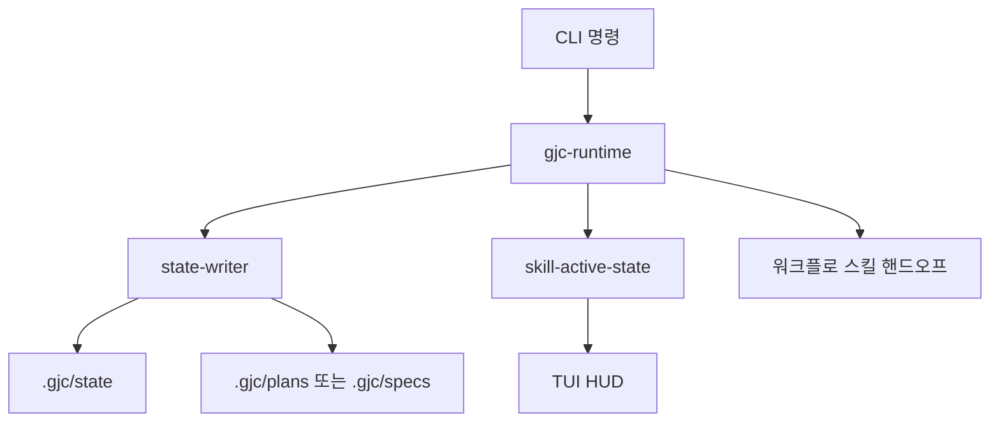

# Workflow Runtime

## 워크플로 런타임 모듈

`packages/coding-agent/src/gjc-runtime/`는 GJC 워크플로의 네이티브 런타임 계층입니다. 이 계층은 `gjc deep-interview`, `gjc ralplan`, `gjc state`, `gjc team`, `gjc ultragoal` 같은 CLI 표면을 받아 `.gjc/` 아래의 상태, 산출물, 원장, HUD 캐시를 일관된 방식으로 갱신합니다.

핵심 역할은 두 가지입니다.

1. 에이전트가 실행하는 워크플로 스킬과 CLI 사이의 얇은 네이티브 중재자가 됩니다.
2. `.gjc/state`를 직접 수정하지 않고 `state-writer` 기반의 원자적 쓰기, 감사 로그, 무결성 검사를 통과하게 만듭니다.

워크플로의 실제 사고 루프는 대체로 스킬 쪽에 있습니다. 예를 들어 `gjc deep-interview "<idea>"`는 질문을 직접 진행하지 않고 `deep-interview-state.json`을 시드한 뒤 `handoff=/skill:deep-interview`를 반환합니다. 런타임은 “실행 준비 상태”와 “기록 가능한 상태 표면”을 책임집니다.



## 상태 쓰기 원칙

이 모듈의 대부분 함수는 파일 경로를 직접 열어 쓰는 대신 다음 유틸리티를 통해 상태를 변경합니다.

- `writeWorkflowEnvelopeAtomic()`
- `readExistingStateForMutation()`
- `writeArtifact()`
- `appendJsonl()`
- `appendJsonlIdempotent()`
- `appendAuditEntry()`
- `removeFileAudited()`

이 패턴은 다음 문제를 막습니다.

- 손상되었거나 외부에서 변조된 상태 파일을 조용히 덮어쓰기
- 같은 산출물을 반복 기록하면서 JSONL 원장을 중복 오염시키기
- 워크플로 phase를 과거 단계로 되돌리기
- HUD 캐시 실패가 실제 durable state 기록을 깨뜨리기

`state-runtime.ts`는 이 규칙을 CLI 표면으로 노출하는 중심 모듈입니다. `gjc state read|write|clear|contract|handoff|graph|prune|gc|migrate|status|doctor` 형태를 파싱하고, 대상 워크플로와 세션 범위를 해석한 뒤 sanctioned writer로 상태를 변경합니다.

## Deep Interview 런타임

Deep Interview는 세 파일로 나뉩니다.

- `deep-interview-runtime.ts`: CLI 명령 파싱, 초기 상태 시드, 최종 spec 저장, ralplan 핸드오프
- `deep-interview-recorder.ts`: 라운드 답변과 점수 기록의 durable merge
- `deep-interview-state.ts`: 순수 상태 모델, 해시, normalize, merge 로직

### 명령 시드 흐름

`runNativeDeepInterviewCommand(args, cwd)`는 두 가지 호출 모드를 처리합니다.

일반 시작:

```bash
gjc deep-interview --standard "새 기능 아이디어"
```

이 흐름은 `resolveDeepInterviewArgs()`로 인자를 해석한 뒤 `seedDeepInterviewState()`로 다음 파일을 만듭니다.

```text
.gjc/state/deep-interview-state.json
.gjc/state/sessions/<session-id>/deep-interview-state.json
```

세션 ID가 있으면 세션 전용 상태 디렉터리를 사용합니다. 상태 파일에는 `active`, `current_phase`, `skill`, `version`, `resolution`, `threshold`, `threshold_source`, `state.initial_idea`, `state.rounds` 등이 들어갑니다.

최종 spec 저장:

```bash
gjc deep-interview --write --stage final --slug my-spec --spec ./spec.md
```

이 흐름은 `resolveSpecWriteArgs()`와 `persistDeepInterviewSpec()`를 거쳐 `.gjc/specs/deep-interview-<slug>.md`를 기록하고, `.gjc/specs/deep-interview-index.jsonl`에 인덱스 행을 추가합니다.

`--deliberate` 또는 `--handoff ralplan`이 있으면 `handleSpecWrite()`가 `runNativeRalplanCommand()`를 호출해 ralplan 상태를 시드하고, 이어서 `runNativeStateCommand(["handoff", "--mode", "deep-interview", "--to", "ralplan", ...])`로 active state 핸드오프를 반영합니다.

### 라운드 기록 모델

`DeepInterviewRoundRecord`는 한 질문 라운드의 durable record입니다. 중요한 필드는 다음과 같습니다.

- `round_key`: durable merge 키
- `round_id`, `round`, `question_id`
- `question_hash`, `answer_hash`
- `selected_options`, `custom_input`
- `lifecycle`: `"answered" | "pending_scoring" | "scored"`
- `scores`, `ambiguity`, `triggers`

`deriveRoundKey()`는 `interview_id + round_id`를 우선 사용하고, 없으면 `interview_id + round + question_id`로 키를 만듭니다. 이 키 덕분에 같은 라운드가 여러 번 기록되어도 하나의 record로 병합됩니다.

`buildAnswerShell()`은 사용자 답변을 `"answered"` 상태의 shell record로 만듭니다. `appendOrMergeRound()`는 `round_key` 기준으로 다음 중 하나를 반환합니다.

- `"created"`: 새 라운드 추가
- `"noop"`: 같은 질문 해시와 답변 해시라서 변경 없음
- `"replaced"`: 같은 키지만 질문 또는 답변이 달라 기존 shell 교체

점수 기록은 `enrichRoundWithScoring()`이 담당합니다. 기존 shell이 있으면 같은 record를 `"scored"`로 전환하고, shell 없이 점수만 먼저 들어오면 데이터 손실을 막기 위해 scored record를 새로 만듭니다.

### 점수 전이 검증

`validateDeepInterviewScoredTransition(prior, next)`는 active trigger가 있는 점수 전이를 검증합니다.

`trigger.status === "active"`인 경우, 이전 scored round가 있으면 다음 조건을 만족해야 합니다.

- 전체 `ambiguity`가 이전보다 증가해야 합니다.
- trigger가 가리키는 `dimension`의 명확도 점수가 개선되면 안 됩니다.

`"disputed"` 또는 `"unresolved"` trigger는 이 불변식에서 제외되지만, 반드시 `rationale`이 있어야 합니다.

이 검증은 `enrichDeepInterviewRoundScoring()`에서 durable state를 쓰기 전에 수행됩니다. 실패하면 예외를 던지고 상태 파일은 변경하지 않습니다.

### 상태 정규화와 compact projection

`normalizeDeepInterviewEnvelope()`는 legacy flattened 상태를 canonical nested shape로 바꿉니다. canonical 구조에서는 transcript 관련 데이터가 `state` 아래에 위치합니다.

예를 들어 top-level `rounds`, `established_facts`, `current_ambiguity`는 `state.rounds`, `state.established_facts`, `state.current_ambiguity`로 이동하고 top-level 중복은 제거됩니다.

`projectCompactState()`와 `readDeepInterviewStateCompact()`는 전체 transcript 대신 필요한 부분만 읽는 projection을 제공합니다.

- 최근 scored round: `recent_scored_rounds`
- 아직 scoring되지 않은 shell: `pending_shells`
- unresolved/disputed trigger: `unresolved_triggers`
- 확정 사실: `established_facts`
- topology 요약: `topology_summary`

이 projection은 도구나 HUD가 전체 상태를 읽지 않고도 현재 인터뷰 상황을 표시할 때 사용하기 좋습니다.

## Ralplan 런타임

`ralplan-runtime.ts`는 `gjc ralplan`의 두 표면을 처리합니다.

### 합의 계획 핸드오프

```bash
gjc ralplan --deliberate "작업 설명"
```

`runNativeRalplanCommand()`는 `--write`가 없으면 `handleConsensusHandoff()`로 들어갑니다. 이 함수는 `resolveConsensusArgs()`로 플래그를 검증하고, `seedRalplanState()`로 `.gjc/state/ralplan-state.json` 또는 세션 전용 상태 파일을 만듭니다.

상태에는 다음 값이 포함됩니다.

- `active: true`
- `current_phase: "planner"`
- `skill: "ralplan"`
- `version`
- `mode: "deliberate" | "short"`
- `interactive`
- `task`
- `run_id`

그 뒤 `syncRalplanHud()`가 `buildRalplanHud()`와 `buildRalplanHudSummary()`를 통해 HUD rail을 갱신합니다.

### 산출물 기록

```bash
gjc ralplan --write --stage planner --stage_n 1 --artifact ./planner.md
```

`handleArtifactWrite()`는 다음 순서로 동작합니다.

1. `parsePlannerStateArgs()`로 planner subagent 메타데이터를 해석합니다.
2. `resolveArtifactArgs()`로 stage, stage 번호, run ID, artifact 본문을 확정합니다.
3. artifact 본문의 `sha256`을 계산합니다.
4. `findExistingStageArtifact()`로 같은 `(stage, stage_n)` 기록이 있는지 검사합니다.
5. 같은 내용이면 `buildDeduplicatedResult()`로 no-op receipt를 반환합니다.
6. 다른 내용이면 overwrite를 거부하고 새 `--stage_n` 사용을 요구합니다.
7. 신규 기록이면 `persistActiveRunId()`, `persistArtifact()`, `applyPlannerStateUpdate()`, `syncRalplanHud()`를 순서대로 실행합니다.

`persistArtifact()`는 산출물을 다음 위치에 씁니다.

```text
.gjc/plans/ralplan/<run-id>/stage-<NN>-<stage>.md
.gjc/plans/ralplan/<run-id>/index.jsonl
```

stage가 `final`이면 같은 내용을 `pending-approval.md`에도 씁니다. 이 파일은 ralplan이 승인 대기 상태에 도달했음을 나타내는 주요 표면입니다.

### phase lock

`advanceCurrentPhase()`와 `PHASE_LOCK`은 terminal 또는 handoff 상태를 되돌리지 않기 위한 장치입니다. 예를 들어 이미 `final`, `handoff`, `complete`, `failed`, `cancelled`에 도달한 같은 run에 stray `--write`가 들어와도 `current_phase`를 과거 stage로 되돌리지 않습니다.

단, `persistActiveRunId()`는 `run_id`가 바뀌면 새 run으로 보고 이전 run의 locked phase를 상속하지 않습니다.

## State 런타임

`state-runtime.ts`는 `.gjc/state`에 대한 공식 CLI 중재자입니다. 다른 모듈이 워크플로별 helper를 갖고 있더라도, 일반적인 상태 읽기, 쓰기, 정리, 진단, 핸드오프는 이 파일의 명령 표면을 통해 이뤄집니다.

### selector 해석

`resolveSelectors()`는 다음 순서로 mode를 찾습니다.

1. `--mode`
2. positional skill
3. `--input` JSON의 `mode`
4. `--input` JSON의 `skill`

세션 ID는 다음 순서로 찾습니다.

1. 명시적 `--session-id`
2. payload의 `session_id`
3. 환경 변수 `GJC_SESSION_ID`

이 규칙 덕분에 스킬 문서의 shell snippet은 매번 세션 ID를 직접 넘기지 않아도 현재 세션 전용 상태 파일에 기록될 수 있습니다.

### 상태 파일 위치

`modeStateFile(cwd, mode, sessionId)`는 워크플로 상태 파일 경로를 만듭니다.

```text
.gjc/state/<mode>-state.json
.gjc/state/sessions/<session-id>/<mode>-state.json
```

`activeStateFile(cwd, sessionId)`는 HUD와 active skill snapshot의 파일 경로를 만듭니다.

```text
.gjc/state/skill-active-state.json
.gjc/state/sessions/<session-id>/skill-active-state.json
```

### doctor

`collectDoctorSummary()`는 상태 저장소의 문제를 수집합니다.

검사 대상은 다음과 같습니다.

- 워크플로 mode-state JSON schema
- envelope checksum mismatch
- transaction journal orphan
- active state와 실제 mode-state 사이의 불일치
- 세션별 active state

문제 유형은 `DoctorProblemType`으로 표현됩니다.

- `orphan_journal`
- `checksum_mismatch`
- `schema_violation`
- `stale_active_state`

`handleDoctor()`는 이를 텍스트 또는 JSON으로 렌더링합니다. 텍스트 출력은 `renderDoctorText()`가 담당합니다.

### out-of-band edit 감지

`warnAndAuditOutOfBandIfNeeded()`는 `detectWorkflowEnvelopeIntegrityMismatch()`로 mode-state 파일의 체크섬 불일치를 검사합니다. `--force` 없이 mismatch가 발견되면 `writeJsonAtomic()`은 `StateCommandError`를 던지고 쓰기를 거부합니다.

이 규칙은 `.gjc/state`를 외부 편집이나 임의 스크립트가 직접 바꿨을 때, 런타임이 그 변경을 조용히 덮어쓰지 않도록 합니다.

## Goal Mode 요청 브리지

`goal-mode-request.ts`는 ultragoal과 interactive goal mode 사이의 요청 파일 브리지입니다.

`writePendingGoalModeRequest()`는 `.gjc/state/goal-mode-request.json`에 다음 형태의 요청을 씁니다.

```ts
{
	version: 1,
	kind: "goal_mode_request",
	source: "ultragoal",
	objective,
	createdAt,
	goalsPath,
	sessionId,
}
```

`consumePendingGoalModeRequest()`는 이 파일을 읽고 유효한 요청이면 삭제한 뒤 반환합니다. 요청에 `sessionId`가 있으면 같은 세션만 소비할 수 있습니다. 이 격리는 같은 프로젝트 디렉터리에서 여러 GJC 세션이 동시에 실행될 때, 다른 세션의 ultragoal 요청을 잘못 소비하지 않게 합니다.

`writeCurrentSessionGoalModeState()`는 `GJC_SESSION_FILE`이 가리키는 세션 transcript에 `mode_change` entry를 append합니다. 기존에 non-terminal goal이 있으면 새 goal을 만들지 않고 `{ status: "existing_goal" }`을 반환합니다.

`buildGjcRuntimeSessionEnv()`는 에이전트가 하위 CLI 호출을 만들 때 필요한 환경 변수를 구성합니다.

- `GJC_SESSION_FILE`
- `GJC_SESSION_ID`
- `GJC_SESSION_CWD`

## Team 런타임 연결

`team-runtime.ts`의 전체 구현은 크지만, call graph 기준으로 이 모듈은 team 명령의 durable state, worker lifecycle, mailbox, notification, git integration을 담당합니다.

주요 진입점은 다음과 같습니다.

- `startGjcTeam()`
- `readGjcTeamSnapshot()`
- `listGjcTeamTasks()`
- `transitionGjcTeamTaskStatus()`
- `sendGjcTeamMessage()`
- `markGjcTeamMailboxMessage()`
- `reconcileTeamNotifications()`
- `shutdownGjcTeam()`
- `integrateGjcWorkerCommits()`

CLI의 `run()`은 `src/commands/team.ts`에서 `executeGjcTeamApiOperation()`, `listGjcTeams()`, `startGjcTeam()` 등으로 들어옵니다. snapshot 조회 흐름은 `readGjcTeamSnapshot()`에서 phase, notification record, config, tmux profile, worktree 정보를 모아 렌더링 가능한 상태로 만듭니다.

mailbox 관련 함수는 worker 간 메시지를 `.gjc/state/team/...` 아래 durable file로 기록합니다.

- `writeMailboxMessage()`
- `readMailbox()`
- `markGjcTeamMailboxMessage()`
- `createMessageNotification()`

작업 완료 전이는 `transitionGjcTeamTaskStatus()`가 처리하며, 완료 evidence는 `normalizeGjcTeamTaskCompletionEvidence()`와 `getGjcTeamTaskCompletionEvidenceFailure()`로 검증됩니다.

## HUD와 active state

워크플로 런타임은 durable state뿐 아니라 TUI가 보여줄 active state도 갱신합니다.

Deep Interview:

- `syncDeepInterviewHud()`
- `syncRecorderHud()`
- `repairRecorderHudFromPersisted()`
- `deriveDeepInterviewHud()`

Ralplan:

- `syncRalplanHud()`
- `buildRalplanHud()`
- `buildRalplanHudSummary()`

State runtime의 generic HUD:

- `buildHudForMode()`
- `syncSkillActiveState()`
- `applyHandoffToActiveState()`

중요한 설계 원칙은 HUD 갱신 실패가 durable state 기록을 실패시키면 안 된다는 점입니다. 그래서 deep-interview와 ralplan의 HUD sync 함수는 내부에서 예외를 삼킵니다. durable write가 성공했다면 workflow record semantics가 우선이고, HUD는 best-effort cache입니다.

## Deep Interview 상태 병합 규칙

Deep Interview는 일반적인 shallow merge로 처리하면 transcript가 손실될 수 있으므로 별도 병합 함수를 둡니다.

`mergeDeepInterviewEnvelope(existing, incoming, options)`는 다음을 보장합니다.

- `state`를 canonical 위치로 유지합니다.
- `rounds`는 `mergeDeepInterviewRounds()`로 durable key 기준 병합합니다.
- `established_facts`는 incoming에 실제로 있을 때만 갱신합니다.
- `null` 값은 일반 envelope key 또는 state key 삭제로 처리합니다.
- `replace: true`이면 기존 상태를 병합하지 않고 normalized incoming을 반환합니다.

`mergeDeepInterviewRounds()`는 주소 지정 가능한 round는 durable key로 병합하고, durable identity가 없는 legacy opaque record는 그대로 보존합니다. 완전히 동일한 opaque record만 중복 제거합니다.

이 동작은 recorder가 쓴 답변 shell과 scoring update가 서로를 덮어써 transcript를 잃는 문제를 방지합니다.

## 명령 처리 패턴

워크플로 런타임 명령은 대체로 같은 구조를 따릅니다.

```ts
export async function runNativeXCommand(args: string[], cwd = process.cwd()): Promise<XCommandResult> {
	try {
		// 1. 호출 형태 분기
		// 2. 인자 검증과 경로 컴포넌트 검증
		// 3. 상태 또는 산출물 쓰기
		// 4. HUD 갱신
		// 5. 텍스트 또는 JSON receipt 반환
	} catch (error) {
		// 명령 전용 Error면 해당 exit status 반환
		// 알 수 없는 오류는 status 1로 매핑
	}
}
```

각 runtime은 전용 Error 클래스를 사용합니다.

- `DeepInterviewCommandError`
- `RalplanCommandError`
- `StateCommandError`

잘못된 사용자 입력은 보통 status `2`로 반환됩니다. 알 수 없는 내부 오류는 status `1`로 매핑됩니다.

## 경로와 ID 안전성

여러 파일에서 같은 형태의 경로 컴포넌트 검증을 사용합니다.

```ts
const PATH_COMPONENT_RE = /^[A-Za-z0-9_-][A-Za-z0-9._-]{0,63}$/;
```

`assertSafePathComponent()`는 `--session-id`, `--slug`, `--run-id` 같은 값에 `..` 또는 위험한 문자가 들어가는 것을 막습니다.

세션 ID는 파일 경로에 들어가기 전에 `encodeSessionSegment()`로 인코딩됩니다.

```ts
function encodeSessionSegment(value: string): string {
	return encodeURIComponent(value).replaceAll(".", "%2E");
}
```

이 처리는 session-scoped state가 `.gjc/state/sessions/<id>/` 밖으로 탈출하지 못하게 하는 방어선입니다.

## 다른 코드와의 연결

이 모듈은 다음 주변 영역과 강하게 연결됩니다.

- `src/commands/team.ts`: team CLI 명령에서 `startGjcTeam()`, `executeGjcTeamApiOperation()`, `listGjcTeams()` 호출
- `src/commands/ultragoal.ts`: ultragoal 명령에서 `writePendingGoalModeRequest()`, `readUltragoalGjcObjective()`, `isUltragoalCreateGoalsInvocation()` 호출
- `src/modes/interactive-mode.ts`: turn 시작 또는 mode 복원 시 `consumePendingGoalModeRequest()`로 goal mode 요청 소비
- `src/session/agent-session.ts`: 세션 환경과 mutation guard, worker integration 이벤트 연결
- `src/skill-state/active-state.ts`: active skill snapshot과 HUD rail 갱신
- `src/skill-state/workflow-hud.ts`: deep-interview, ralplan, team, ultragoal HUD 요약 생성
- `src/skill-state/workflow-state-contract.ts`: workflow envelope version, receipt, audit schema
- `src/gjc-runtime/state-writer.ts`: 원자적 쓰기, 감사 로그, integrity stamp, transaction journal
- `src/gjc-runtime/state-migrations.ts`: legacy state migration
- `src/gjc-runtime/ledger-event-renderer.ts`: ralplan/ultragoal ledger와 HUD 요약 파싱

## 기여 시 주의할 점

새 워크플로 상태 쓰기를 추가할 때는 `.gjc/state`를 직접 쓰지 말고 `state-writer` 경로를 사용해야 합니다. 특히 mode-state는 `writeWorkflowEnvelopeAtomic()`을 거쳐야 checksum, audit, transaction journal 규칙이 유지됩니다.

Deep Interview transcript를 다룰 때는 일반 shallow merge를 쓰지 말고 `mergeDeepInterviewEnvelope()` 또는 recorder helper를 사용해야 합니다. `rounds`를 배열 통째로 대체하면 답변 shell이나 scoring history가 사라질 수 있습니다.

Ralplan artifact를 추가 기록할 때는 `(stage, stage_n)`의 의미를 유지해야 합니다. 같은 stage 번호에 다른 내용을 덮어쓰는 대신 새 `--stage_n`을 사용해야 하며, 중복 내용은 `buildDeduplicatedResult()`처럼 no-op으로 처리해야 합니다.

HUD는 cache입니다. durable state 기록과 HUD 갱신을 함께 구현하되, HUD 실패가 core write semantics를 바꾸지 않게 해야 합니다.

세션 범위가 있는 명령은 `--session-id`, payload `session_id`, `GJC_SESSION_ID`의 해석 순서를 유지해야 합니다. 이 순서가 깨지면 여러 세션이 같은 `.gjc/state`를 공유할 때 잘못된 state를 읽거나 쓸 수 있습니다.