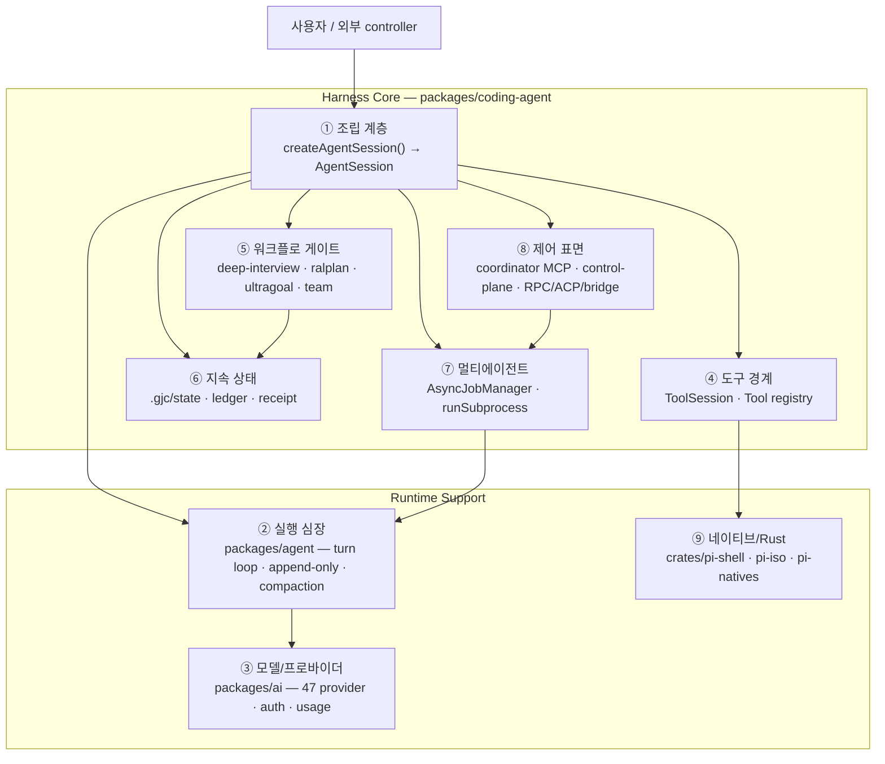
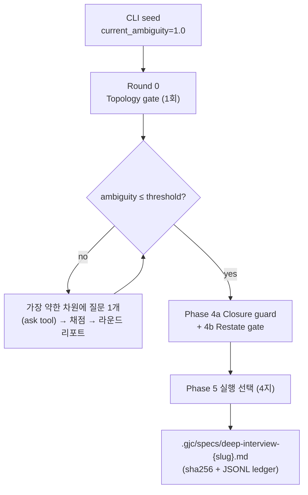
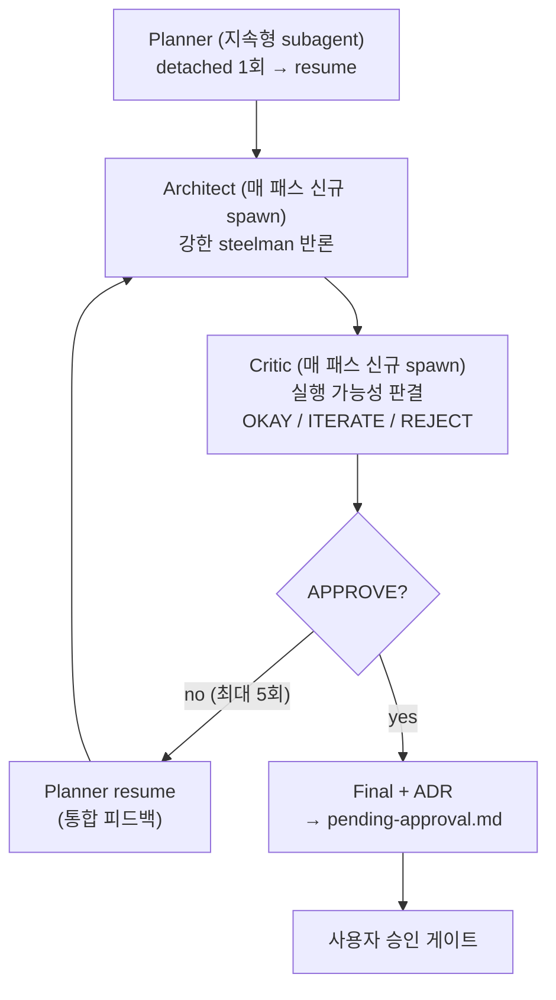
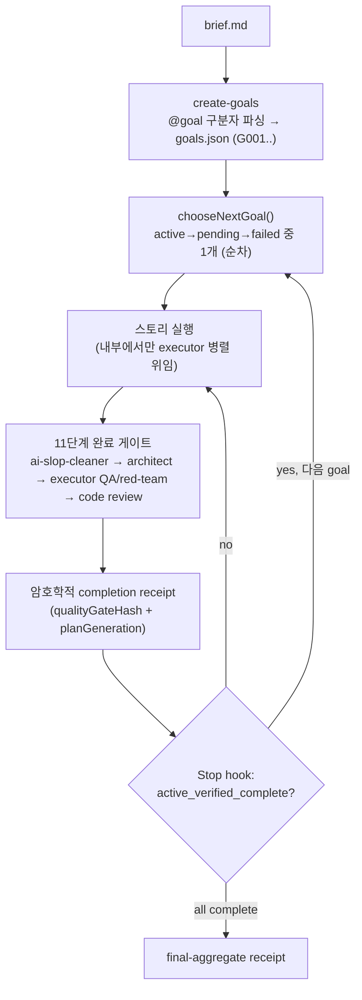
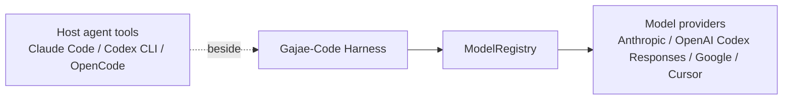
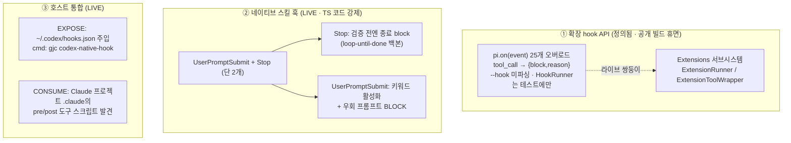

# Gajae-Code를 AI Agent Harness로 설명하기

이 문서는 Gajae-Code를 "AI Agent Harness" 관점에서 설명합니다. 여기서 harness는 LLM을 호출하는 wrapper가 아니라, agent가 실제 개발 작업을 수행하도록 model · tool · state · workflow · UI · 검증 · multi-agent coordination을 묶어 주는 실행 환경을 뜻합니다.

전반부(§1~3)는 "왜 harness인가"를 직관적으로 설명하고, 후반부(§4~§22)는 **harness가 gajae-code 의 소스 코드 레벨에서 어떤 구조로 조립되어 있는가**를 `file:line` 인용과 함께 깊이 분석합니다.

---

## 1. 핵심 관점

Gajae-Code는 AI coding agent 자체라기보다, AI coding agent가 안정적으로 일하도록 감싸는 harness입니다.

일반적인 LLM coding tool은 "사용자 입력 → model 응답 → tool call" 흐름에 집중합니다. 반면 Gajae-Code는 그 주변의 운영 조건을 제품 구조로 만듭니다.

| Harness 요소 | Gajae-Code에서의 구현 |
| --- | --- |
| 실행 진입점 | `gjc` CLI와 launch/session mode |
| agent session | `AgentSession`과 `SessionManager` |
| model 선택 | `ModelRegistry`와 `packages/ai` provider layer |
| tool boundary | `ToolSession`, `createTools()`, built-in/custom/MCP tools |
| workflow gate | `deep-interview`, `ralplan`, `ultragoal`, `team` |
| 지속 상태 | `.gjc/` workflow state, plan, goal, ledger |
| multi-agent 실행 | role agent, `AsyncJobManager`, `runSubprocess()` |
| 사용자/외부 제어 | TUI, RPC, ACP, bridge, coordinator MCP |
| 검증 가능성 | tool result, artifact, completion delivery, evidence ledger |

즉, Gajae-Code의 본질은 "LLM에게 코드를 쓰게 하는 것"이 아니라 **"LLM 기반 agent 작업을 관리 가능한 개발 runtime으로 만드는 것"**입니다.

---

## 2. 왜 Harness인가

AI Agent Harness라고 부를 수 있는 이유는 네 가지입니다.

**첫째, model 호출을 직접 제품 정책으로 만들지 않습니다.** `packages/ai`가 provider 차이를 정규화하고, `ModelRegistry`가 credential · model discovery · fallback을 다룹니다. 그래서 GJC의 session runtime은 특정 provider에 묶이지 않고 Anthropic, OpenAI/Codex Responses, Google/Gemini, Cursor 등을 바꿔 사용할 수 있습니다.

**둘째, tool 실행을 prompt 수준에 두지 않습니다.** `ToolSession`, `BUILTIN_TOOLS`, `BashTool`, `executeBash()`, edit/MCP/web 계층을 통해 tool은 schema · cwd · timeout · artifact · cancellation · renderer를 가진 runtime boundary가 됩니다.

**셋째, workflow 상태를 대화 밖에 둡니다.** `deep-interview`, `ralplan`, `ultragoal`, `team`은 단순 프롬프트가 아니라 `.gjc/` state와 연결되는 workflow입니다. 작업은 transcript 안에서 사라지지 않고 사람이 확인할 수 있는 상태와 산출물로 남습니다.

**넷째, multi-agent 실행을 lifecycle로 관리합니다.** subagent는 별도 model call이 아니라 owner · session file · progress · output stream · pause/resume/cancel · completion delivery를 가진 managed task입니다.

핵심 제품 가설은 한 문장입니다.

> planning · state · evidence · execution boundary가 harness의 일급 개념이 될수록 agent 작업은 **검토 가능(auditable) · 재개 가능(resumable) · 운영 가능(operable)** 해진다.

---

## 3. 분석 방법론과 신뢰도

이 문서의 심층 내용(§5~)은 11개 harness 서브시스템을 각각 "심층 독해(read) → 적대적 검증(verify)" 2단계 파이프라인으로 분석한 결과입니다. 검증 단계는 독해 에이전트의 주장 하나하나를 회의적으로 재독해해 `confirmed / refuted / unclear`로 판정했습니다.

- 총 ~152개 검증 주장 중 **약 146개 confirmed**. 나머지는 모두 **숫자 정밀 정정**(열거형 원소 개수, 도구 개수 등)이었고 메커니즘 차원의 오류는 없었습니다.
- 영상이 강조한 3대 수치(모호함 임계치 0.05 / ralplan 최대 5회 / ultragoal 11단계 게이트)는 **모두 소스에서 실재 확인**되었으나, 각각 "어디에 어떻게 강제되는가"가 영상의 인상과 다릅니다(§9, §16).

이 검증 과정 자체가 GJC가 표방하는 harness 철학 — **주장을 증거로 게이팅한다** — 을 그대로 적용한 것입니다.

---

## 4. Harness 해부도 — 9개 계층

`packages/coding-agent/`가 harness core이고, 나머지(`packages/agent`, `packages/ai`, `packages/tui`, `crates/*`)는 이를 받치는 support boundary입니다.



| # | 계층 | 핵심 파일 | harness 기여 |
|---|------|-----------|--------------|
| ① | 조립 | [sdk.ts](packages/coding-agent/src/sdk.ts) | 모든 부품을 한 지점에서 소유·연결·정리 |
| ② | 실행 심장 | [agent-loop.ts](packages/agent/src/agent-loop.ts) | turn loop + prefix-cache 안정화 + compaction → 토큰 효율 |
| ③ | 모델/프로바이더 | [packages/ai](packages/ai/src/), [model-registry.ts](packages/coding-agent/src/config/model-registry.ts) | 47개 provider를 1개 계약으로 정규화 |
| ④ | 도구 경계 | [tools/index.ts](packages/coding-agent/src/tools/index.ts) | 모든 능력을 typed·schema·permission 경계로 통합 |
| ⑤ | 워크플로 게이트 | [gjc-runtime/](packages/coding-agent/src/gjc-runtime/) | 실행 전 요구사항·계획·완료를 게이팅 |
| ⑥ | 지속 상태 | [gjc-runtime/state-*.ts](packages/coding-agent/src/gjc-runtime/) | 대화 밖 `.gjc/`에 검증·마이그레이션되는 상태 |
| ⑦ | 멀티에이전트 | [async/job-manager.ts](packages/coding-agent/src/async/job-manager.ts), [task/executor.ts](packages/coding-agent/src/task/executor.ts) | subagent를 lifecycle 가진 소유 작업으로 관리 |
| ⑧ | 제어 표면 | [coordinator-mcp/](packages/coding-agent/src/coordinator-mcp/), [harness-control-plane/](packages/coding-agent/src/harness-control-plane/) | 외부 제어를 scrollback 없이 상태 계약으로 |
| ⑨ | 네이티브/Rust | [crates/pi-shell](crates/pi-shell/), [crates/pi-iso](crates/pi-iso/), [crates/pi-natives](crates/pi-natives/) | in-process 셸·격리·검색을 빠르고 측정 가능하게 |

---

## 5. ① 조립 계층 — `createAgentSession()`이 harness를 부팅하는 방식

harness의 모든 부품이 만나는 단일 지점은 [`sdk.ts`](packages/coding-agent/src/sdk.ts)의 `createAgentSession()`(`sdk.ts:827`)입니다. 약 1,400줄짜리 단일 비동기 함수이며, **전체를 하나의 try/catch로 감싸** 부분 조립 실패 시 결정론적으로 되감습니다.

조립 순서가 곧 의존 관계입니다 — 뒤 단계가 앞 단계를 참조하므로 순서가 load-bearing합니다.

```mermaid
flowchart LR
  A["roots + EventBus"] --> B["auth + ModelRegistry<br/>pinning(불변식)"]
  B --> C["Settings 초기화"]
  C --> D["병렬 discovery 착수<br/>(5s deadline race)"]
  D --> E["SessionManager<br/>(logical vs provider id 분리)"]
  E --> F["session restore<br/>+ 모델 선택 cascade"]
  F --> G["ToolSession<br/>(lazy-binding getter)"]
  G --> H["createTools() →<br/>toolRegistry"]
  H --> I["Extension runtime"]
  I --> J["rebuildSystemPrompt()"]
  J --> K["new Agent()"]
  K --> L["new AgentSession()"]
```



핵심 설계 포인트:

- **lazy-binding context (`ToolSession`)**: 도구는 `session`이 존재하기 전에 만들어지지만, `get cwd` · `get model` · `getActiveSkillState` 같은 **getter/closure**로 부모의 live 상태를 읽습니다(`sdk.ts:1187-1282`). 도구↔세션의 닭-달걀 의존을 깨는 결정적 트릭입니다. getter가 `agent?`/`session?`로 optional chaining하는 건 "아직 undefined인 창"에 호출될 수 있기 때문 — `?`를 떼면 초기 도구 호출이 크래시합니다.
- **단일 소유 불변식**: `authStorage`는 반드시 `modelRegistry.authStorage`와 동일해야 하며, 다르면 즉시 throw(`sdk.ts:843-847`). credential 비활성화 이벤트 라우팅이 이 불변식에 의존합니다.
- **logical vs provider 세션 id 분리**: 디스크 세션 파일은 격리하되(`sessionManager.getSessionId()`), provider 측 prompt-cache/sticky-credential 정체성은 공유(`providerSessionId`, `sdk.ts:920-921`). fork/branch 간 provider 캐시 재사용 → 토큰 절감.
- **deadline-raced 시동**: 느린 스캔(workspace tree, AGENTS.md, prompt template)을 병렬 착수하고 `STARTUP_SCAN_DEADLINE_MS = 5000`(`sdk.ts:872`)으로 `Promise.race`. 데드라인 초과 시 동일 promise를 다시 race하는 fallback이라 **이중 스캔이 없습니다**.
- **제품 불변 기본값**: `withEmbeddedDefaultGjcSkills()`가 4개 번들 워크플로 스킬(`DEFAULT_GJC_DEFINITION_NAMES = ["deep-interview","ralplan","team","ultragoal"]`, `defaults/gjc-defaults.ts:14`)을 — 호출자가 명시적으로 스킬 목록을 줘도/discovery를 꺼도 — 재주입합니다.
- **프로세스 전역 싱글톤의 소유권 게이트**: `AsyncJobManager`·`MCPManager`는 **top-level 세션(`!parentTaskPrefix`)만** 생성·소유하며, subagent는 상속만 하고 절대 dispose하지 않습니다. 이걸 어기면 부모가 손상됩니다.

> ⚠️ 베끼면 안 되는 것: 이 함수를 "monolith로 복사"하면 안 됩니다. 어려운 부분은 "무엇을 만드는가"가 아니라 **"누가 소유하고 언제 정리하는가"**입니다.

---

## 6. ② 실행 심장 — turn loop · append-only context · compaction (토큰 효율의 실체)

영상이 말한 "토큰(비용) 소모가 적다"는 인상의 **구체적 근거가 이 계층**입니다. [`packages/agent`](packages/agent/src/)의 agent core가 담당하며, 세 가지 독립 메커니즘으로 작동합니다.

### 6.1 turn loop 구조

`agentLoop()`(`agent-loop.ts:115`)는 즉시 `EventStream`을 만들어 **동기 반환**하고, 내부에서 nested while loop를 돕니다.

- **외부 루프**: agent가 멈추려 할 때 follow-up 메시지가 오면 계속. 매 바퀴 `shouldPause`(협조적 일시정지 → `stopReason:"paused"`)와 follow-up을 폴링.
- **내부 루프**: 1 바퀴 = 1 **turn**("assistant 응답 1개 + 그 도구 호출들", `types.ts:479`). 도구는 `concurrency: "shared"|"exclusive"`로 동시성 제어, exclusive 도구는 단독 실행.
- 중단/에러 assistant 메시지에도 **placeholder tool_result를 채워** `tool_use`/`tool_result` 짝을 보존(`agent-loop.ts:535-561`) — API 계약 위반과 telemetry 카운터 불일치를 동시에 방지.

### 6.2 append-only context + stable prefix — prefix 캐시 최대 적중

토큰 효율의 1번 메커니즘. [`append-only-context.ts`](packages/agent/src/append-only-context.ts)의 목표는 "**턴 간 LLM에 보내는 바이트 prefix를 안정화**해 provider prefix cache(DeepSeek/Anthropic 등) 적중률을 극대화"입니다.

- `StablePrefix`: `{systemPrompt, tools, fingerprint}`를 한 번 스냅샷. 실제로 바뀔 때만 rebuild(레퍼런스 비교 → 32비트 fingerprint 비교, `:442-460`).
- `AppendOnlyLog`: 메시지 배열은 **append만** 되고, 유일한 변형은 compaction용 `replaceTail()`뿐(`:156-160`).
- **byte-parity 규율**: 손수 만든 `cloneJson`이 `JSON.stringify`의 `toJSON` dispatch를 정확히 흉내 내고, import 시 fingerprint를 단언(`:404-440`). prefix가 바이트 단위로 동일해야 캐시가 적중하기 때문입니다. 키 순서·타임스탬프 같은 비결정성이 끼면 **에러 없이 조용히** 캐시가 깨지므로, 베낄 때 이 규율을 통째로 가져와야 합니다.
- **활성화 조건**: `appendOnlyContext` 기본 `"auto"`이고, auto에서는 `provider === "deepseek"`일 때만 켜짐(`sdk.ts:605-613`). Anthropic/OpenAI는 provider 측에서 캐싱을 처리하므로 명시적으로 켜야 합니다.

### 6.3 compaction & pruning — 컨텍스트 상한

- **토큰 측정 2-tier**: 컨텍스트 변경 결정엔 lazy-load되는 **네이티브 o200k BPE 토크나이저(~39MB)**로 정확히, HUD/상태줄 같은 표시용엔 `4 bytes/token` 휴리스틱으로 싸게(`compaction.ts:397,405`). 2MiB 초과 입력은 휴리스틱으로 강등(이벤트 루프 블로킹 회피).
- **트리거**: `shouldCompact`가 컨텍스트 윈도 − reserve와 비교. 기본값 `reserveTokens 16384` / `keepRecentTokens 20000`. 추가로 **끌 수 없는 비상 floor** — heap 1.5GiB / providerBytes 24MiB / imageBytes 64MiB / messageCount 4000(`compaction.ts:266-271`) — 이 OOM 직전 강제 compaction. 즉 **OOM 안전이 사용자 설정과 분리**됩니다.
- **pair-safe cut point**: 뒤에서부터 토큰을 누적하다 유효 절단점에 snap하되 **`toolResult`에서는 절대 자르지 않아**(`compaction.ts:561-562`) 도구 짝을 보존.
- **pruning은 일부러 게으르게**: stale한 도구 출력(나중에 같은 파일을 다시 읽거나 edit한 경우)을 `[Output truncated - N tokens]`로 접되, 매 턴이 아니라 **shouldCompact가 이미 임계 초과인 "허가된 유지보수 경계"에서만** 실행(`agent-session.ts:6611`). 이유가 명시돼 있습니다 — pruning은 도구 출력을 재작성해 **provider prompt-cache prefix를 epoch 중간에 깨므로**, 캐시 적중을 보호하려고 의도적으로 미룹니다.

> 토큰 효율은 "마법"이 아니라 ①prefix 안정화 ②stale 출력 pruning ③compaction이라는 **세 개의 구체적 코드 경로**의 합이며, 그 위에 §13 네이티브 출력 minimizer가 더해집니다.

---

## 7. ③ 모델/프로바이더 계층 — 47개 provider를 1개 계약으로

영상의 "멀티 프로바이더(`gjc login`)"의 실체입니다. [`packages/ai`](packages/ai/src/)가 provider-neutral 계약을, [`model-registry.ts`](packages/coding-agent/src/config/model-registry.ts)가 런타임 선택을 담당합니다.

- **provider-neutral 계약**: `Model` / `Context` / `Tool` / `stream()` / `complete()`. `Api = KnownApi | (string & {})` 형태로 빌트인은 자동완성되면서 임의 custom API id도 허용. `true satisfies _CheckExhaustive`로 transport 추가 시 옵션 누락을 **컴파일 타임 에러**로 강제(`types.ts:60-67`).
- **카탈로그 규모**: 영상의 7개(Anthropic, ChatGPT, OpenRouter, DeepSeek, Kimi, GLM=zai, XAI)는 일부일 뿐입니다. 실제로는 **세 개의 다른 목록**이 존재 — 타입 지원 `KnownProvider` 47개, 번들된 `models.json` 46개, OAuth 로그인 가능 43개. `models.json`은 1.6MB **생성 산출물**(직접 편집 금지, `generate-models`로 재생성).
- **6-tier credential 해석**(`auth-storage.ts:3040-3087`): runtime override → config → API key → **OAuth(자동 refresh)** → env → fallback. override가 OAuth를 이깁니다(proxy bearer가 upstream token 우선).
- **prompt-cache 경제학이 credential 랭킹을 지배**: OAuth selector가 세션당 sticky credential을 유지 — 계정 전환이 서버측 prompt cache를 cold-start시키므로, 완벽한 headroom 분산을 포기하고 **캐시 적중 절감**을 택합니다(`auth-storage.ts:2611-2619`). credential 랭킹은 **model-aware**(`modelId`를 넘겨 Codex Pro-plan 게이트 적용).
- **subagent auth-fallback**: subagent의 요청 모델에 credential이 없으면 부모 모델로 fallback하되 **가시적 경고**를 냅니다. 단, 부모와 **다르면서 + 인증된** 경우에만 발동. 흥미로운 안전장치: 키 없는 로컬 모델(ollama/lm-studio/vllm)은 `kNoAuth='N/A'`를 "인증됨"으로 취급해 **절대 부모의 원격 provider로 몰래 재라우팅되지 않습니다**(issue #1008, `model-resolver.ts:789`).
- **sidecar credential 격리**: `transport:'pi-native'`는 스트리밍만 gateway로 우회시켜 Authorization을 주입 — **클라이언트는 secret을 보유하지 않습니다**. 컨테이너에 띄운 다수의 싼 에이전트가 1개 유료 계정을 공유하는 패턴.

> ⚠️ auth-broker(기본 포트 8765)·gateway(4000)는 **loopback(127.0.0.1) 전용**이며 직접 인터넷 노출용으로 hardening되지 않았습니다. 원격 사용 시 reverse proxy 필수.

---

## 8. ④ 도구 경계 — 모든 능력을 하나의 typed registry로

GJC의 tool은 함수 목록이 아니라 **schema · execution · result metadata · UI renderer · permission**을 가진 등록된 capability입니다. built-in/custom/extension/MCP/skill tool이 한 실행 표면으로 수렴합니다.

- **factory-map registry**: `BUILTIN_TOOLS`는 `Record<name, (session)=>Tool|null>` — 조건부 도구는 `null`을 반환해 스스로 제외됩니다. `createTools()`(`sdk.ts:1306`)는 빌트인을 seed할 뿐이고, **실제 노출 도구는 매 model call마다 `#applyActiveToolsByName`로 재선택·재래핑**됩니다. MCP/skill 도구는 seeding 이후 `refreshMCPTools`/`refreshGjcSubskillTools`로 주입됩니다.
- **단일 타입 경계(Tool → AgentTool)**: wire 계약(schema)과 runtime 계약(execute + UI + scheduling flag)을 인터페이스 상속으로 layering해 provider와 loop가 한 형태를 공유. schema는 **Zod**(`zod/v4`)이며 JSON schema도 허용(TypeBox 아님).
- **adapter + decorator 체인**: 이질적 소스를 한 형태로 병합 — `CustomToolAdapter.wrap`(MCP/extension) → `ExtensionToolWrapper` → `wrapToolWithMetaNotice` → ACP-permission Proxy. `extensionRunner`가 있으면 **registry의 모든 도구**가 `ExtensionToolWrapper`로 재래핑됩니다(MCP만 아님, `sdk.ts:1561-1565`).
- **mode-as-getter 다형성**: `EditTool`은 `description`/`parameters`/`customFormat`/`customWireName`를 getter로 노출해 활성 edit mode에 따라 **하나의 등록 도구가 4개 schema**(patch/apply_patch/hashline/replace)를 제시. `customWireName`은 harness 내부 이름(`edit`)과 모델이 학습한 wire 이름(`apply_patch`)을 분리.
- **bash 실행 lifecycle**: `#prepareBashExecution`이 allowlist(`bashAllowedPrefixes`)·interceptor·`cd`-lift·`clampTimeout`을 적용하고, `execute()`는 **explicit async**(AsyncJobManager)와 **auto-background**(별도 경로)의 dual-path. 취소는 `Promise.race`(run vs timeout vs abort)로 처리하고, 망가진 persistent shell은 재사용 대신 격리(quarantine). `async` 필드는 `async.enabled`일 때만 schema에 동적으로 존재.
- **3층 mutation 가드**(`#prepareToolForExecution`): `guardToolForUltragoalAsk`(최내층) → `wrapToolForAcpPermission` → `wrapToolForDeepInterviewMutationGuard`(최외층). deep-interview 가드는 `{edit,write,ast_edit,bash}`에 발동.
- **discovery 정규화**: 어떤 도구든 `DiscoverableTool{name,summary,source}` + BM25 index로 접고, `search_tool_bm25`로 lazy 활성화 → **모델이 보는 도구 목록을 작게 유지**.

> ⚠️ ACP permission Proxy는 **샌드박스가 아닙니다** — 클라이언트 bridge가 `requestPermission`을 광고할 때만 묻는 advisory 게이트이며(CLI는 보통 광고하지 않음), 실제 OS 격리는 `crates/*`/네이티브 Shell에 있습니다(§13). `bashAllowedPrefixes`/interceptor도 allow/deny 목록일 뿐 containment가 아닙니다.

---

## 9. ⑤ 워크플로 게이트 — 영상의 Phase 2/3/4의 실체

GJC 워크플로의 공통 아키텍처는 **"split-brain"**입니다.

> 수학·루프·역할 오케스트레이션은 **번들 스킬 프롬프트(`SKILL.md`)**가 수행하고, 지속 상태·정체성·검증 receipt·산출물 write는 **네이티브 TypeScript 런타임**이 담당합니다. CLI는 루프를 돌리지 않고 상태를 seed하고 `/skill:*`로 handoff할 뿐입니다.

이 구분이 영상 주장을 정확히 읽는 열쇠입니다 — "0.05 / 최대 5회 / 11단계"는 **대부분 프롬프트 수준 규율**이고, **코드가 강제하는 것은 상태 무결성·완료 receipt**입니다.

### 9.1 deep-interview (Phase 2 — 모호함 해소)



- **임계치 0.05 = 확인**(`DEFAULT_AMBIGUITY_THRESHOLD = 0.05`, `deep-interview-runtime.ts:33`). 단 정교한 **우선순위 체인**으로 덮입니다: `--threshold` 플래그 > settings.json(modern config → project → user) > resolution 프리셋 > 0.05. resolution 프리셋 `RESOLUTION_THRESHOLDS = {quick:0.6, standard:0.5, deep:0.35}`(`:35`)도 존재. 실제 게이트는 `threshold_source`가 기록한 값이지 항상 0.05가 아닙니다.
- **모호함은 단일 LLM 숫자가 아니라 결정론적 가중 공식**: greenfield `ambiguity = 1 - (goal·0.40 + constraints·0.30 + criteria·0.30)`, brownfield는 context·0.15 추가(`SKILL.md:389-392`). 여러 topology 컴포넌트가 있으면 "가장 약한 컴포넌트"로 집계해 한 부분이 다른 부분의 모호함을 가리지 못하게 합니다.
- **양방향·비단조(non-monotonic)**: 나중 답변이 모호함을 **올릴 수 있습니다**(`SKILL.md:320`). 영상의 "100%→점점 감소"는 기대 경로일 뿐. 그리고 이 비단조성은 **코드로 강제**됩니다 — `enrichDeepInterviewRoundScoring`(`deep-interview-recorder.ts:420-447`)이 직전 채점 라운드 대비 불변식을 위반하는 채점을 **throw해 저장 거부(fail closed)**.
- **게이트 3종**: Round 0 Topology(1회, 컴포넌트 1~6개 확정) → Phase 4a Closure + 4b Restate(목표를 한 문장으로 압축해 Yes/Adjust/Missing 확인) → Phase 5 실행 선택. **실행 선택은 3지가 아니라 4지**입니다: (1) ralplan[기본] (2) ultragoal (3) team (4) 다시 인터뷰로(`SKILL.md:613-630`). 선택 전까지 mutate/commit/delegate 금지.
- **산출물**: `.gjc/specs/deep-interview-{slug}.md`로 고정 경로, sha256 스탬프, 네이티브 `--write` 명령으로만 기록. 추가로 `.gjc/specs/deep-interview-index.jsonl`에 감사 ledger를 append.
- **on-demand 보조 스킬**: deep-interview는 3개 skill-fragment(`auto-research-greenfield`, `auto-answer-uncertain`, `lateral-review-panel`)를 필요 시 로드(`defaults/gjc-defaults.ts:86-100`).
- **한국어 지원**: `resolveDeepInterviewLanguagePreference`가 아이디어에서 한글 스크립트를 자동 감지해 질문을 한국어로 유지(`runtime:242-259`).

### 9.2 ralplan (Phase 3 — 합의 및 계획)



- **Planner → Architect → Critic = 확인**. 정교한 부분: **Planner는 한 번만 detached로 띄워 매 패스 피드백으로 resume하는 "지속형 subagent"**인 반면, **Architect·Critic은 매 패스마다 신선하게 새로 spawn** — "판정이 그 패스 산출물만으로 재현 가능하도록"(`SKILL.md:95`). 역할 응답은 **receipt-only**(`{run_id, path, sha256, verdict}`)이고 전체 마크다운 본문을 부모 컨텍스트에 붙여넣지 않습니다 → 최대 5패스에도 컨텍스트가 receipt 단위로만 증가.
- **최대 5회 = 확인**(`SKILL.md:69,75,76`). **단 프롬프트 수준 규율이며 코드가 강제하지 않습니다** — 네이티브 `parseStageN`은 1..999를 허용(`ralplan-runtime.ts:121-128`)하고 `<=5` 가드가 없습니다. iteration 수는 ledger의 planner/revision 행에서 **파생 계산**.
- **네이티브 런타임은 루프를 돌리지 않습니다**(`ralplan-runtime.ts:31-33`): `gjc ralplan "task"`는 상태만 seed하고 `handoff=/skill:ralplan`을 출력. 대신 **content-addressed 멱등 ledger**를 보장 — dedup 키 `stage\0stage_n\0sha256`, 동일 재작성은 결정론적 no-op, 같은 `(stage,stage_n)`에 다른 내용은 hard 거부.
- **승인 게이트 2종**: ① 사전 게이트 — 과소명세된 team/ultragoal 요청(≤15 단어, 구체 anchor 없음)을 실행 전 ralplan으로 우회. ② 최종 게이트 — Critic 승인 시 `pending-approval.md`로 복사 후 phase machine을 통해서만 handoff. `--interactive` 없으면 `pending approval`로 표시·출력하고 **실행 없이 정지**.
- **산출물**: Final stage는 **ADR**(Decision/Drivers/Alternatives/Why/Consequences/Follow-ups) 필수.
- ⚠️ 미묘한 결함: Critic 어휘는 `OKAY/ITERATE/REJECT`인데 성공 종료 조건은 `APPROVE`로 적혀 있어 혼용됩니다. HUD는 `APPROVE/CLEAR`만 success로 분류(`workflow-hud.ts:201-202`)하므로 문자 그대로의 `OKAY`는 success 칩으로 렌더되지 않습니다.

### 9.3 ultragoal (Phase 4 — 목표 실행)



- **3개 지속 산출물**: `.gjc/ultragoal/`의 `brief.md` + `goals.json`(계획) + `ledger.jsonl`(append-only 감사 로그). 계획은 atomic temp+rename, 모든 전이는 UUID·ISO 타임스탬프 ledger 이벤트.
- **create-goals → goals.json**: brief를 column-0 구분자 정규식 `/^@goal(?::|[ \t]+|$)[ \t]*(.*)$/`로 분할, 각 블록이 스토리(`G001`, `G002`…). 기본 모드 `aggregate`(전체 계획용 안정 포인터 goal 1개).
- **⚠️ "병렬 실행"은 정정 필요**: goals는 **엄격히 순차·단일 활성** 스케줄(`chooseNextGoal`, `runtime.ts:609-640`)입니다. 병렬은 **스토리 내부**에서 leader가 분리 가능한 슬라이스에 executor subagent를 위임하는 권고일 뿐(`SKILL.md:157`). "여러 골을 병렬로 돌린다"는 사실이 아닙니다.
- **"11단계 게이트" = 확인(단 프롬프트 산문)**: `SKILL.md:181-205`가 1~11번 번호 목록입니다 — (1)표적 검증 (2)`ai-slop-cleaner` 청소 sweep (3)재검증 (4)architect 리뷰(아키텍처/제품/코드) (5)executor QA/red-team(깨뜨리기 시도) (6)surface-evidence 증명 (7)coverage matrix (8)최종 코드리뷰 (9)blocker 기록 (10)clean까지 루프 (11)그제서야 complete 체크포인트.
- **코드가 강제하는 것은 "11단계"가 아니라 구조화된 게이트**: `validateCompletionQualityGate`(`runtime.ts:1920-1974`)는 **정확히 `{architectReview, executorQa, iteration}` 키만 허용**하고 legacy 키를 거부. architect 3개 status가 모두 `CLEAR` + recommendation `APPROVE`, executor QA가 `passed`, iteration이 `fullRerun:true`로 `passed`여야 통과.
- **암호학적 완료 receipt(harness의 백본)**: `complete` 체크포인트는 `--quality-gate-json`을 강제하고, **gate 증거 해시 + "plan generation" fingerprint**(plan 스냅샷의 sha256)를 담은 receipt를 만듭니다. 이후 관련 goal 집합/상태가 바뀌면 재유도된 generation이 달라져 **receipt가 staleness-무효화**됩니다. 즉 `goals.json`의 status를 손으로 고치는 것만으로는 완료가 인정되지 않습니다("goals.json.status alone is not proof").
- **3층 방어로 단일 우회 경로 차단**: ① CLI 체크포인트(신선한 ≤10분 GJC goal 스냅샷 요구) ② `goal({"op":"complete"})` 툴 가드(`assertCanCompleteCurrentGoal`가 receipt 재검증) ③ **Stop hook(loop-until-done의 실체)** — verification이 `active_verified_complete`가 아니면 세션 종료를 `decision:"block"`으로 막음. UserPromptSubmit hook은 "goal complete"/"skip verification" 같은 우회 프롬프트까지 정규식으로 탐지해 차단.
- **`ai-slop-cleaner`**: 완료 게이트 2단계의 read-only 청소 탐지기 — 아래 §9.4에서 단독 심층 분석.

### 9.4 ai-slop-cleaner — 완료 게이트의 read-only 청소 탐지기

ultragoal 완료 게이트(§9.3의 11단계) **2단계**에 위치한, harness의 자기검열 장치입니다. [ai-slop-cleaner.md](packages/coding-agent/src/defaults/gjc/skills/ultragoal/ai-slop-cleaner.md) 한 파일이 전부이지만 권한 분리·감사·억제 설계가 응축돼 있습니다.

- **정체와 비노출(구조적 강제)**: `kind:"skill-fragment"` + `parentSkillName:"ultragoal"`로 등록(`gjc-defaults.ts:103-108`). "사용자 비노출(슬래시 명령 불가·skill listing 없음·`skill://` 해석 불가)"은 문서 약속이 아니라 **코드 구조로 강제**됩니다 — 스킬 등록을 먹이는 `getEmbeddedDefaultGjcSkills()`가 `kind==="skill"`만 필터(`gjc-defaults.ts:128-130`)하므로 fragment는 등록·CLI(`gjc skills`)에서 누락되고, 오직 parent-scoped 접근자 `getEmbeddedDefaultGjcSkillFragments("ultragoal")`로만 코드 접근됩니다(`:119-126`, 테스트로 회귀 잠금). 등록된 skill-fragment는 총 **4개**(deep-interview ×3 + ultragoal ×1).
- **권한 분리(read-only 계약)**: 코드 편집/파일 쓰기/포매터 실행/`.gjc` 상태 변형/체크포인트/goal 도구 호출/워크플로 spawn을 **일절 하지 않는** 탐지·보고기(`:5`). 활성 ultragoal 스토리의 **변경 파일만** 검사하고(`:9-10`), 더 넓은 맥락이 필요하면 직접 확장하지 않고 leader에게 보고. → 게이트가 스스로를 통과시킬 수 없고, 실제 수정은 leader가 띄운 `executor`만 수행합니다.
- **recursion guard**: 이미 ultragoal 안이므로 ralplan/team/deep-interview/ultragoal **중첩 spawn 금지**(`:12`) — 완료 게이트가 새 워크플로로 팬아웃하지 않도록 경계를 묶습니다.
- **7-카테고리 taxonomy**(`:18-26`): ① fallback성 코드(**masking=blocking** | **grounded=advisory**로 이분: 삼켜진 에러·조용한 기본값·우회된 검증은 masking, 외부/버전/fail-safe 경계에 한정+근거+양방향 회귀테스트는 grounded) ② 중복 ③ 죽은 코드 ④ 불필요한 추상화 ⑤ 경계 위반 ⑥ UI/디자인 slop(**절대 금지가 아닌 맥락 신호** — 한국어 본문 11~12px 도전·14px+ 권장, 무분별한 그림자, eyebrow+title+description 채움, 근거 없는 `#3B82F6` 블루/퍼플, 과하게 균일한 3/4열 그리드, 극단적 "AI 데모" 그라데이션) ⑦ 누락 테스트.
- **blocking vs advisory, 그리고 ledger 경계**: blocking = 실패 은폐·계약 위반·경계 약화·미테스트·유지보수 함정·검증 불안전화 가능. **advisory는 ultragoal ledger에 쓰지 않습니다**(`:32`) — 스타일 노이즈로 durable 감사 추적을 오염시키지 않으려는 의도. "모든 발견을 로깅"으로 오해하기 쉬운 지점.
- **리포트와 게이트 통합**: 고정 텍스트 블록 `AI SLOP CLEANUP REPORT` + 이진 `Gate Result: PASS | BLOCKED`(`:53`). 변경이 없어도 PASS/no-op 리포트는 **반드시** 생성. verify·red-team **이전**에 돌아 "깨끗한 코드만 리뷰"되게 하고(SKILL.md:186), BLOCKING은 leader→executor가 고쳐 **blocking 0이 될 때까지 cleaner 재실행**. 리포트는 새 top-level 키가 아니라 기존 `qualityGate.iteration.evidence`에 실어 나릅니다.
- **⚠️ 코드 강제 경계(핵심)**: 위 계약은 거의 전부 **Markdown 프롬프트** 강제입니다. 코드가 보장하는 것은 ① fragment의 등록/타입/비노출(구조적)과 ② 완료 체크포인트가 구조적으로 유효한 quality gate + **비어있지 않은 `iteration.evidence`**를 요구한다는 점뿐(`ultragoal-runtime.ts:1966-1973`). 런타임은 리포트 텍스트를 파싱하지 않고, cleaner가 실제로 돌았는지·Gate Result도 검증하지 않습니다 — 즉 cleaner 계약은 **코드 검증 게이트 안에 실린 "프롬프트-신뢰"**입니다(단 그 게이트 자체는 executorQa status·명령 배열·blockers·`iteration.fullRerun` 등을 코드로 강하게 검증).
- **"hook"의 의미**: "완료 게이트 hook에서 on-demand 로드"의 hook은 **워크플로 단계 언어**이지 코드 훅 로더가 아닙니다 — `src/gjc-runtime`에 fragment 로더가 없고, 에이전트가 SKILL.md 지시를 따라 `.md`를 읽습니다. (설치 시점에만 `installDefaultGjcDefinitions`가 파일을 디스크에 materialize)
- **출처**: oh-my-codex의 taxonomy·리포트 모양을 **포팅하되 편집 워크플로는 제외**(`:61`).
- **⚠️ 이름 충돌**: 사용자 환경의 `oh-my-claudecode:ai-slop-cleaner`는 **삭제 우선 편집 워크플로** 스킬로 완전히 다른 물건입니다(이번 분석 중 harness가 그 스킬 실행을 자동 제안한 것도 동일 키워드 오탐). GJC fragment는 **보고 전용**입니다.

---

## 10. ⑥ 지속 상태 계층 — 대화 밖에서 살아남는 `.gjc/state`

영상엔 거의 안 나오지만 harness의 등뼈입니다. [`gjc-runtime/state-*.ts`](packages/coding-agent/src/gjc-runtime/)가 담당.

- **lenient-read / fail-closed-write 비대칭**: 읽기는 `.passthrough()` optional zod로 **열려서**(오래된 상태를 절대 거부 안 함), 쓰기는 strict `RequiredOnWriteEnvelopeSchema`로 **닫힙니다(fail closed)**.
- **content-addressed tamper evidence**: JSON을 canonicalize(키 정렬, undefined 제거)하고 checksum 필드 자신을 뺀 뒤 sha256 → 다음 쓰기 때 재검증해 out-of-band 편집 탐지. **바이트 동일성이 아니라 정규화 형태**를 해싱하므로 공백 재포맷은 안 걸리지만 값 변경은 걸립니다.
- **단일 인가 writer(gate G1) + 경로 감금**: 모든 `.gjc/**` 변형은 한 모듈을 통과하며 `<cwd>/.gjc/**` 밖 타깃을 hard 거부. 에이전트는 직접 파일을 못 고치고 CLI mediator만 사용.
- **atomicity**: temp-file + rename(쓰기엔 lockfile 없음). 별도 advisory directory-lock이 read-modify-write만 감싸 cross-process TOCTOU를 닫음.
- **상태 머신을 TS 단일 정본으로 선언**해 JSON/mermaid/dot/ascii로 투영하고, **모든 write 지점에서** 전이를 재단언.
- **stepwise 마이그레이션 ladder**: 읽기는 메모리에서 normalize만, 명시적 `migrate` 명령만 업그레이드를 디스크에 씀.
- **토큰 효율**: 재개 시 transcript 재생/재요약 대신 `.gjc/state/**`에서 phase·active-skill·artifact 포인터를 복원. `gjc state read --compact`(큰 배열 elide) + `--fields`(allowlist 제한)로 모델에 들어가는 바이트를 축소. HUD 칩은 `HUD_TEXT_LIMIT 80`, `HUD_CHIP_LIMIT 6`으로 캡.

---

## 11. ⑦ 멀티에이전트 계층 — subagent를 "소유된 작업"으로

subagent는 자유로운 model call이 아니라 **owner · lifecycle · 재개를 가진 관리 작업**입니다.

- **단일 레지스트리 `AsyncJobManager`**: async `bash` 잡과 `task`(subagent) 잡을 한 레지스트리에서 관리. 프로세스 전역 싱글톤이며 top-level 세션만 설치. `register()`가 `maxRunningJobs`(기본 **15**) 초과를 거부하고 `ownerId`(예 "0-Main")를 스탬프. `cancel(id,{ownerId})`는 owner 불일치를 not-found로 취급 — subagent teardown이 부모 잡을 취소할 수 없습니다.
- **제어 평면은 잡보다 오래 산다**: `SubagentRecord`(stable `subagentId` 키)는 disposable한 `AsyncJob`(5분 후 eviction)을 outlive → pause/resume가 잡 eviction을 견딤. `pauseSubagent`는 **협조적 요청**(in-flight 도구 abort 안 함).
- **완료 전달 = 재시도·바이트 한정·dead-letter 큐**: 텍스트는 `DELIVERY_MAX_TEXT_BYTES=64KB`(head/tail 각 32KB + 절단 마커)로 캡, 실패 시 지수 backoff(base 500ms, cap 30s) **최대 3회** 후 dead-letter. 실제 부모 전달은 `session.yieldQueue`로 **다음 턴 경계**에서 surface.
- **구조화된 완료 계약(`yield`)**: subagent는 `requireYieldTool:true`로 생성. 숨은 `yield` 도구의 성공 호출이 런을 종료시키고, output schema가 있으면 validator로 검증. **성공 판정 기준은 "모델이 텍스트를 냈다"가 아니라 "명시적으로 제출된 schema-valid 결과"**입니다.
- **runSubprocess는 명칭 오해 소지**: OS 서브프로세스가 아니라 **같은 프로세스 내 자식 `AgentSession`**(`executor.ts:506`). OS 격리는 worktree/FUSE/ProjFS 백엔드가 별도 담당. 재귀 깊이 `task.maxRecursionDepth` 기본 **2**.
- **하드 spawn 게이트**: `childCount > 4`이면 완전한 `SpawnPlanReceipt`(whyParallel/whyNotLocal/independence/expectedReceiptShape/maxInlineTokens)를 **요구**하고 불완전하면 거부. 즉 큰 fan-out 전에 비용 정당화를 코드로 강제(정확히 4개는 허용, 5개부터 요구).
- **역할 에이전트 정본은 [`task/agents.ts`](packages/coding-agent/src/task/agents.ts)**: `EMBEDDED_AGENT_DEFS`에 executor/architect/planner/critic/explore/plan/reviewer + 숨은 task. 생성된 wiki의 일부 agent 언급은 stale입니다.

---

## 12. ⑧ 제어 표면 — scrollback 없이 상태 계약으로 제어

외부 프로세스/병렬 worker가 터미널 scrollback을 긁지 않고 에이전트를 구동·관찰·검증하게 하는 계층입니다.

- **State-as-contract over scrollback**: 읽기는 항상 구조화된 지속 상태(`TurnRecord`, `EventEnvelope`, `Observation`)를 반환하고, raw tmux 출력은 "bounded advisory"로 강등돼 권위가 없습니다.
- **Acceptance-as-protocol-fact**(베낄 만한 패턴): 프롬프트는 "idle 사전상태 + 명령 ack + pre-submit 커서 이후의 fresh `agent_start` 이벤트"가 모두 맞을 때만 accepted로 간주 — "ack만으로는 절대 accepted 아님"(`rpc-adapter.ts:56-103`).
- **coordinator MCP 서버**: **15개** `gjc_coordinator_*` 도구(JSON-RPC 2.0, 미지 메서드 `-32601`). 결과는 캡됨 — tail 기본 80/최대 400줄, 이벤트 배치 기본·최대 100, artifact 64KiB.
- **단일 writer lease(데몬 없음)**: 세션당 lease 파일(pid+epoch+ttl)로 exactly-one-writer. **O_EXCL 배타 생성**(`fs.open(path,'wx')`)으로 race-free task claiming.
- **team(tmux) 런타임**: 기본 worker **3개**, 최대 **20개**(`team-runtime.ts:42-43`). worker 상호작용은 **37개 verb**의 `GJC_TEAM_API_OPERATIONS`. claim lease는 하드코딩 **30분**. 상태는 공유 파일시스템에 살므로 **로컬 tmux 전제**.
- **전송 3종**: RPC(stdio)·Bridge(TCP+token+TLS+scope)는 공유 `dispatchRpcCommand`로 수렴하지만, **ACP는 `@agentclientprotocol` SDK 어댑터(`AcpAgent`)를 쓰며 dispatch를 공유하지 않습니다**(AgentSession은 공유, command-dispatch는 비공유).

> ⚠️ coordinator의 프롬프트 전달은 여전히 `tmux send-keys`라 조용히 실패할 수 있습니다(durability는 read/state 계약에 있지 전달에 있지 않음). 보안은 전적으로 env scope 설정 의존.

---

## 13. ⑨ 네이티브/Rust 계층 — "Rust 바이너리, 빠름, 토큰 효율"의 실체

영상의 "Rust 바이너리 기반" 강점의 근거입니다. [`crates/`](crates/)가 담당.

- **core-lib / FFI-shim 분리**: 무거운 로직은 순수 Rust lib(`pi-shell`/`pi-iso`/`pi-ast`, napi 없음)에 두고, `pi-natives`가 얇은 `#[napi]` 마샬링 cdylib. → FFI 없이 단위 테스트 가능.
- **version-sentinel handshake**: 네이티브 addon이 패키지 버전을 이름에 인코딩한 const를 export하고, JS 로더가 기대 이름을 계산해 불일치 바이너리를 **load-time 에러**로 거부. → 조용한 ABI drift 방지.
- **in-process bash 인터프리터**: 벤더링된 third-party `brush`(reubeno/brush, MIT v0.5.0)를 `pi-shell`이 session/cancel/minimizer로 감쌈. 원본성은 wrapping에 있음.
- **PAL(Platform Abstraction Layer)**: 단일 async trait 뒤에서 `probe()`/`resolve()` 능력 협상 + 정렬된 fallback 체인(끝은 보편 백엔드 Rcopy/git-worktree). macOS는 `clonefile`(단일 syscall, copy-on-write) 사용.
- **토큰 효율의 1차 현장**: opt-in **출력 minimizer**(git/cargo/docker/go/python/gh 등 도구별 필터)가 장황한 명령 출력을 모델 도달 전에 압축하되 `original_text`를 보존해 `artifact://<id>`로 전체 버퍼를 저장하고 참조만 전송. **8 MiB OutputBudget**(`shell.rs:1315`)과 `|head`/`|tail`을 떼는 AST bash-fixup으로 출력 토큰을 캡. 네이티브 tiktoken o200k 카운팅으로 컨텍스트 예산을 Rust에서 싸게 책정.
- **취소 안전성**: cancel/timeout 시 persistent 세션을 `None`으로 강제 초기화(`shell.rs:321-323`)해 취소된 명령이 세션 상태를 오염시키지 않음.
- ⚠️ 토큰 카운팅은 Claude엔 **근사**(cl100k는 o200k로의 no-op alias). `pi-ast` 지원 언어는 **54개**(`SupportLang` enum) — "51개"는 grep artifact.

---

## 14. CLI 진입과 실행 모드

```text
gjc "summarize this repo"
  → runCli() (cli.ts) — Bun 버전 게이트 → 17개 subcommand 등록
  → 알려진 subcommand 아니면 launch로 라우팅
  → main.ts → createSession() → createAgentSession() (sdk.ts)
  → AgentSession
  → Agent (@gajae-code/agent-core)
```

- `cli.ts`는 정확히 **17개** subcommand 등록(codex-native-hook, state, setup, skills, session, harness, coordinator, team, ultragoal, gc, ralplan, config, mcp-serve, contribute-pr, deep-interview, update, launch).
- 결과 `AgentSession`은 interactive/print/RPC/ACP/bridge 모드가 공유. 단 **ACP는 connection별로 세션을 새로 만듭니다**(다른 네 모드가 한 세션 객체를 공유하는 것과 다름).

---

## 15. Claude Code / Codex CLI와의 관계

Gajae-Code를 설명할 때 중요한 구분이 있습니다.

Claude Code, Codex CLI, OpenCode, Claw Code는 GJC가 내부로 들어가는 provider가 **아닙니다**. 이들은 사용자가 GJC 옆에서 함께 실행할 수 있는 host agent tool 또는 외부 coding tool입니다.

반면 Anthropic, OpenAI/Codex Responses, Google/Gemini, Cursor 등은 GJC 내부 model layer가 통신하는 provider/runtime adapter입니다.



이 구분을 지키면 GJC의 위치가 명확해집니다. GJC는 다른 agent runtime 안에 숨어 들어가는 plugin이 아니라, 개발자가 선택한 repo/worktree 옆에서 별도로 실행되는 harness입니다.

---

## 16. 영상/요약 주장 ↔ 소스 검증 대조표

강의에서 "영상은 이렇게 말하지만 코드는 이렇다"로 쓰기 좋은 표입니다.

| 주장 (영상/요약) | 소스 검증 결과 | 근거 |
|---|---|---|
| 모호함 임계치 기본 0.05 | ✅ 사실. 단 `--threshold` > settings > resolution preset(0.35~0.6) > 0.05 우선순위 체인 | `deep-interview-runtime.ts:33,335` |
| 모호함 100%→점점 감소 | ⚠️ 기대 경로일 뿐. 양방향·**비단조**(올라갈 수 있고 코드로 강제됨) | `SKILL.md:320`, `recorder:420-447` |
| deep-interview 실행 선택 | ⚠️ 3지가 아니라 **4지**(ralplan/ultragoal/team/다시 인터뷰) | `SKILL.md:613-630` |
| ralplan Planner→Architect→Critic | ✅ 사실. Planner는 지속형 resume, Architect·Critic은 매 패스 신규 spawn | `SKILL.md:95` |
| ralplan 최대 5회 반복 | ✅ 사실. **단 프롬프트 규율**이며 네이티브는 1..999 허용(코드 cap 없음) | `SKILL.md:69,75`, `runtime:121-128` |
| ultragoal goals 병렬 실행 | ❌ **순차·단일 활성** 스케줄. 병렬은 스토리 내부 위임만 | `runtime:609-640`, `SKILL.md:157` |
| ultragoal 11단계 완료 게이트 | ✅ 사실(SKILL 산문 1~11). 코드가 강제하는 건 `{architectReview,executorQa,iteration}` 구조 + receipt 해시 | `SKILL.md:181-205`, `runtime:1920-1974` |
| 멀티 프로바이더(거의 모든 API) | ✅ 사실. 7개가 아니라 KnownProvider 47 / models.json 46 / OAuth 43 | `packages/ai` |
| Rust 바이너리·빠름·토큰 효율 | ✅ 아키텍처상 타당(in-process brush, clonefile, ripgrep, 출력 minimizer). 단 벤치 미실측 | `crates/pi-shell`, `pi-natives` |
| coordinator MCP 도구 수 | (요약 14) → **15개** | `coordinator/contract.ts:4-20` |
| team API verb 수 / worker | (요약 38) → **37개**. worker 기본 3 / 최대 20은 확인 | `team-runtime.ts:42-43,506-544` |
| RPC/Bridge/ACP 단일 dispatch | ⚠️ RPC·Bridge만 공유. ACP는 별도 SDK 어댑터(세션만 공유) | `acp-mode.ts`, `rpc-adapter` |
| Effort 단계 minimal..xhigh | ⚠️ **6단계**(Max 포함) | `model-thinking.ts:6-13` |

---

## 17. 일반 coding assistant와 비교할 때 강조할 점

| 일반 coding assistant | Gajae-Code harness 관점 |
| --- | --- |
| 대화와 tool call 중심 | workflow, state, evidence까지 포함 |
| model provider가 제품 구조에 강하게 묶임 | provider를 `packages/ai`와 `ModelRegistry` 뒤에 둠 |
| tool 실행이 개별 기능으로 흩어짐 | `ToolSession`과 registry로 실행 경계 통합 |
| subagent가 보조 model call처럼 취급됨 | lifecycle을 가진 managed task로 관리 |
| 작업 상태가 transcript에 의존 | `.gjc/` state와 artifact로 지속 |
| 완료 주장을 모델 산문으로 신뢰 | receipt 해시 + 3층 가드로 검증 |
| UI가 단순 입출력 표면 | TUI/RPC/ACP/bridge/MCP 등 control surface 분리 |

---

## 18. 재사용 가능한 설계 패턴

다른 harness를 설계할 때 가져갈 만한, 소스 전반에서 반복되는 패턴입니다.

1. **lazy-binding context object**: 아직 만들어지지 않은 부모를 참조해야 하는 부품은 값이 아니라 getter/closure로 부모 상태를 노출(`ToolSession`).
2. **prompt-as-orchestrator / runtime-as-ledger split**: 역할·루프·수학은 버전 관리되는 프롬프트가, 지속성·검증은 얇고 방어적인 네이티브가 담당.
3. **content-addressed 멱등 ledger**: dedup 키 = 식별자 + sha256. 동일 재작성은 결정론적 no-op, 다른 내용은 hard 거부.
4. **암호학적 완료 receipt**: 상태 필드를 단독 신뢰하지 않고, gate 증거 + "plan generation" fingerprint를 해싱해 이후 변형이 receipt를 staleness-무효화.
5. **defense-in-depth, single-invariant-three-layers**: 하나의 불변식을 CLI + 도구가드 + lifecycle hook 3층에서 강제.
6. **Stop-hook-as-loop**: "loop until done"을 프롬프트 지시가 아니라 세션 종료를 지속 검증 상태에 묶는 런타임 차단으로 구현.
7. **receipt-only subagent 응답**: 전체 산출물 대신 `{run_id, path, sha256, verdict}`만 반환 → 컨텍스트 보호 + 감사 추적.
8. **structured-yield 완료 계약**: subagent 성공을 schema-valid 제출 payload로 게이팅.
9. **하드 spawn 게이트**: fan-out 임계(4) 초과 시 비용 정당화 receipt를 코드로 요구.
10. **State-as-contract over scrollback**: 외부 제어/관찰을 bounded·구조화 상태 계약으로.
11. **byte-parity prefix 안정화**: append-only + 결정론적 clone으로 provider prefix cache 적중 보호.
12. **observable truncation**: 출력을 조용히 잃지 않고 `[N bytes dropped]` 마커 + 원본 artifact 보존.

---

## 19. 그대로 베끼면 안 되는 것

- **`createAgentSession`의 monolith 형태**가 아니라 **소유권 규율**(누가 싱글톤을 소유/정리하는가)을 가져가야 합니다.
- **공개 OSS 표면 한정 동작**: 이 저장소는 extension/MCP/skill discovery를 quarantine했습니다. 내부 제품은 켤 가능성이 높으니 "MCP 런타임 discovery는 죽은 코드"로 단정 금지.
- **append-only/stable-prefix는 DeepSeek 타깃 기본값**입니다. 모든 provider에 켜져 있다고 가정 금지. 비결정 직렬화가 끼면 **조용히** 캐시가 깨집니다.
- **토큰 카운트는 추정**입니다(Claude엔 ~5~10% 오차). 임계 수학은 근사.
- **ralplan "5회"·deep-interview 공식/캡·ultragoal "11단계"는 프롬프트 수준 LLM 지시**입니다. 코드 불변식이 아니므로 비협조 모델은 초과할 수 있습니다. 코드가 강제하는 것은 상태 무결성과 완료 receipt뿐.
- **runSubprocess는 OS 격리가 아닙니다**(in-process). 격리는 worktree/FUSE/ProjFS + 네이티브 셸이 별도 제공.
- **coordinator/control-plane은 단일 호스트·단일 세션·데몬 없음**. `process.kill(pid,0)` liveness는 컨테이너/머신을 넘으면 무의미.
- **team은 로컬 tmux + 공유 FS 전제**, claim lease 30분 하드코딩.
- **provider 카탈로그 규모는 3개 다른 목록**(타입 47 / 번들 46 / OAuth 43)이니 "N개"라 인용할 땐 어느 목록인지 명시.

---

## 20. Hook 시스템 — 정의된 1개 + 살아있는 2개

GJC는 "hook"이라는 단어를 세 군데서 다르게 씁니다. 사용자가 "hook으로 지원되는 것"을 물을 때 가장 중요한 사실은 다음입니다.

> 사용자가 코드로 동작을 프로그래밍하는 **24+이벤트 hook API는 이 공개 OSS 빌드에서 "휴면"**이고, 실제로 살아 동작하는 hook은 ① **워크플로 게이트를 강제하는 네이티브 스킬 훅**(이벤트 2개)과 ② **호스트(Codex/Claude) 통합 훅**입니다.



### 20.1 확장 hook API — 정의됐으나 공개 빌드에서 휴면

[`extensibility/hooks/`](packages/coding-agent/src/extensibility/hooks/)의 in-process TypeScript SDK입니다. `pi.on(event, handler)`로 구독하고 `pi.sendMessage`/`pi.registerCommand`로 개입합니다.

- **25개 typed 이벤트**([types.ts:472-501](packages/coding-agent/src/extensibility/hooks/types.ts#L472)): 세션 생명주기 11개(`session_start`, `session_before_switch/switch`, `session_before_branch/branch`, `session_before_compact`, `session.compacting`(유일한 점-표기), `session_compact`, `session_shutdown`, `session_before_tree/tree`) + `context` + 에이전트/턴 6개(`before_agent_start`, `agent_start/end`, `turn_start/end`) + `auto_compaction_start/end` + `auto_retry_start/end` + `ttsr_triggered` + `todo_reminder` + `tool_call` + `tool_result`. (타입 union엔 `goal_updated`까지 포함되나 전용 오버로드는 없어 untyped로만 구독 가능 — "26개"라 단정 금지)
- **결정 의미(decision semantics)**: `tool_call`은 `{block?, reason?}` 반환으로 **도구 실행 전 차단**(fail-safe — 핸들러가 throw하면 도구가 막힘), `context`는 LLM에 보낼 **메시지 배열을 재작성**, `session.compacting`은 **커스텀 압축**, `session_before_*`는 `{cancel?}`로 전이 취소. 나머지는 observe-only.
- **HookContext**: `ctx.ui`(select/confirm/input/notify/setStatus/custom/setEditorText/editor) + read-only `sessionManager`/`modelRegistry`/`model` + `newSession`/`branch`/`navigateTree`/`abort`/`isIdle`. 즉 hook이 **세션 자체를 조종**할 수 있습니다.
- **예제 11개**([examples/hooks/](packages/coding-agent/examples/hooks/)): permission-gate, protected-paths, git-checkpoint, custom-compaction, handoff, status-line, auto-commit-on-exit, dirty-repo-guard, file-trigger, confirm-destructive, qna.
- **⚠️ 그러나 이 공개 빌드에서 휴면**: `--hook` 플래그가 **파싱되지 않고**(`cli/args.ts`의 `hooks?:string[]`은 "extension loading flags are no longer parsed" 주석 아래 legacy 필드), `new HookRunner(...)`는 **테스트에서만** 등장(`test/compaction-hooks.test.ts:110`), `loadHooks`/`discoverAndLoadHooks`는 프로덕션 호출처가 없습니다. README의 `gjc --hook …`은 바이너리에 미구현. **살아있는 쌍둥이는 별개의 Extensions 서브시스템**(`ExtensionRunner` 생성 `sdk.ts:1477`, 도구 래핑 `ExtensionToolWrapper` `sdk.ts:1563`)이며 같은 emit API + `resources_discover`를 추가로 가집니다. → 강의에서는 이 패키지를 **"레퍼런스 SDK 계약(설계 의도)"**으로, 라이브 구현은 extensions로 설명하는 게 정확합니다. (§19의 "공개 표면은 extension/MCP discovery를 quarantine한다"와 일관)

### 20.2 네이티브 스킬 훅 — 살아있는 워크플로 게이트 강제 (TS 코드 enforced)

[`src/hooks/`](packages/coding-agent/src/hooks/)의 엔진으로, §5 워크플로 게이트의 "런타임이 검증·차단한다"는 부분의 실제 구현입니다. 호스트 훅 프로토콜 스타일(stdin payload → decision JSON)이며 이벤트는 단 **2개** — `UserPromptSubmit`, `Stop`([native-skill-hook.ts:15](packages/coding-agent/src/hooks/native-skill-hook.ts#L15)).

- **Stop 훅 = loop-until-done의 실체**: "에이전트가 끝났다고 판단"을 **검증 가능한 술어**로 바꿉니다. durable 상태(mode-state phase, ultragoal plan/ledger, 실제 crystallized spec 파일)가 완료를 증명할 때만 stop 허용, 아니면 `decision:"block"`으로 막고 오케스트레이터가 에이전트를 재개. block은 5개 지점에서 발화하며 각기 머신 판독 가능한 `stopReason`(`gjc_skill_<skill>_stale_mode_state`, `gjc_skill_deep_interview_uncrystallized`, `gjc_ultragoal_verification_<state>`, 그리고 일반 per-skill-per-phase)을 답니다.
- **UserPromptSubmit 훅 = 활성화 + 우회 차단**: 10개 키워드 정의([skill-keywords.ts:14-75](packages/coding-agent/src/hooks/skill-keywords.ts#L14))로 프롬프트→스킬 활성화(이건 **soft** additionalContext, block 아님). 그리고 `isUltragoalBypassPrompt`가 "goal complete"·"skip verification"·"mark…complete"·`/goal…complete/` 등을 정규식 탐지해 `BLOCK_ULTRAGOAL_COMPLETION`으로 차단.
- **fail-closed 편향**: malformed JSON 입력은 **항상 block**(`native-skill-hook.ts:266-278`), Stop dispatch 에러도 fail-closed(block); UserPromptSubmit dispatch 에러만 fail-open. → 손상·조작된 상태 파일이 세션을 몰래 풀 수 없습니다.
- **열거(검증된 정확값)**: `UltragoalGuardState` 10개, `STOP_RELEASING_PHASES` 6개, handoff-required 스킬 2개(deep-interview/ralplan), `isTerminalModeState` = 7 phase + `active!==true` 술어. 미묘점: `"handoff"`는 UserPromptSubmit 게이트엔 terminal이지만 `STOP_RELEASING_PHASES`엔 없어 **Stop은 계속 막습니다**(의도적 분기).
- 이건 Markdown 프롬프트가 아니라 **TypeScript 코드**입니다 — block은 실제 harness 동작입니다.

### 20.3 호스트 통합 — Codex 주입(expose) + Claude 발견(consume)

GJC는 외부 runner이므로 자기 게이트 훅을 호스트에 **노출**하고, 호스트가 정의한 훅을 **소비**합니다.

- **EXPOSE(Codex)**: `~/.codex/hooks.json`에 2개 managed 엔트리(`UserPromptSubmit`/`Stop`) 주입([codex-native-hooks-config.ts:4](packages/coding-agent/src/hooks/codex-native-hooks-config.ts#L4)). 두 엔트리의 command는 동일하게 `"gjc codex-native-hook"`, `Stop`만 `timeout:30`. 멱등 reconciliation(`missingEvents` 탐지, command를 managed로 인식하려면 `\bgjc\b`와 `\bcodex-native-hook\b` 두 정규식 모두 매치). `gjc setup hooks --check`로 CI 검증.
- **HANDLER**: `gjc codex-native-hook` CLI = 호스트가 실제로 부르는 프로세스. stdin payload에서 이벤트명(4가지 키 철자), 프롬프트(3키), 세션 파일(4키+`GJC_SESSION_FILE`)을 읽어 decision JSON을 방출하고, 에러는 `.gjc/logs/native-hook-<date>.jsonl`에 남겨 post-mortem 재개를 돕습니다.
- **CONSUME(Claude)**: Claude Code 훅을 **파일 기반 pre/post 도구 스크립트**로 발견([capability/hook.ts](packages/coding-agent/src/capability/hook.ts), type `"pre"|"post"`). `discovery/claude.ts`는 **프로젝트 `.claude`만** 읽고 `~/.claude`는 의도적으로 무시합니다. (참고: `claude-plugins` provider는 실제로는 GJC 자체 Marketplace(`installed_plugins.json`)이지 Anthropic 플러그인 스토어가 아닙니다.)
- **⚠️ 비대칭**: EXPOSE는 Codex의 **이벤트** 훅 계약을, CONSUME은 Claude의 **파일 기반 pre/post** 훅을 다룹니다 — 이름만 같은 다른 개념이며, Claude `settings.json`의 이벤트 훅은 ingest되지 않습니다.

### 20.4 정리 — 어느 것이 "진짜" 살아있는 hook인가

| 표면 | 이벤트 | 상태 | 강제 수준 |
|---|---|---|---|
| 확장 hook API (`pi.on`) | 25개(+`goal_updated`) | **공개 빌드 휴면** (라이브 쌍둥이 = Extensions) | (설계상) 코드 — `tool_call` block |
| 네이티브 스킬 훅 | 2개 (`UserPromptSubmit`/`Stop`) | **LIVE** | **TS 코드 강제** (워크플로 게이트) |
| 호스트 통합 | Codex 2 expose / Claude pre·post consume | **LIVE** | 호스트 hook 프로토콜 |

핵심 교훈: GJC가 워크플로를 "운영 가능"하게 만드는 실제 메커니즘은 화려한 24-이벤트 API가 아니라, **단 2개 이벤트(UserPromptSubmit/Stop)에 durable 상태 검증을 묶은 fail-closed 게이트 훅**입니다. 이것이 §5의 워크플로 게이트와 §6의 지속 상태를 실행 시점에 연결합니다.

---

## 21. 이 관점에서 읽어야 할 파일

AI Agent Harness 관점으로 소스를 직접 읽을 때 권장 순서입니다.

1. [cli.ts](packages/coding-agent/src/cli.ts) → [main.ts](packages/coding-agent/src/main.ts) → [sdk.ts](packages/coding-agent/src/sdk.ts) (①조립)
2. [session/agent-session.ts](packages/coding-agent/src/session/agent-session.ts) (세션 lifecycle)
3. [agent-loop.ts](packages/agent/src/agent-loop.ts), [append-only-context.ts](packages/agent/src/append-only-context.ts), [compaction.ts](packages/agent/src/compaction.ts) (②실행 심장)
4. [packages/ai/src/types.ts](packages/ai/src/types.ts), [config/model-registry.ts](packages/coding-agent/src/config/model-registry.ts) (③모델/프로바이더)
5. [tools/index.ts](packages/coding-agent/src/tools/index.ts), [tools/bash.ts](packages/coding-agent/src/tools/bash.ts) (④도구 경계)
6. [gjc-runtime/](packages/coding-agent/src/gjc-runtime/)의 `deep-interview-runtime.ts` · `ralplan-runtime.ts` · `ultragoal-runtime.ts` · `ultragoal-guard.ts` (⑤워크플로 게이트)
7. [gjc-runtime/state-runtime.ts](packages/coding-agent/src/gjc-runtime/state-runtime.ts), `state-schema.ts`, `state-writer.ts` (⑥지속 상태)
8. [async/job-manager.ts](packages/coding-agent/src/async/job-manager.ts), [task/executor.ts](packages/coding-agent/src/task/executor.ts), [task/agents.ts](packages/coding-agent/src/task/agents.ts) (⑦멀티에이전트)
9. [coordinator-mcp/server.ts](packages/coding-agent/src/coordinator-mcp/server.ts), [harness-control-plane/](packages/coding-agent/src/harness-control-plane/) (⑧제어 표면)
10. [crates/pi-shell/src/](crates/pi-shell/src/), [crates/pi-natives/src/](crates/pi-natives/src/) (⑨네이티브/Rust)
11. [hooks/skill-state.ts](packages/coding-agent/src/hooks/skill-state.ts), [hooks/native-skill-hook.ts](packages/coding-agent/src/hooks/native-skill-hook.ts) (네이티브 게이트 훅) · [extensibility/hooks/types.ts](packages/coding-agent/src/extensibility/hooks/types.ts) (확장 hook API SDK 계약) · [hooks/codex-native-hooks-config.ts](packages/coding-agent/src/hooks/codex-native-hooks-config.ts) (호스트 통합) (Hook 시스템 §20)
12. [defaults/gjc/skills/ultragoal/ai-slop-cleaner.md](packages/coding-agent/src/defaults/gjc/skills/ultragoal/ai-slop-cleaner.md) (완료 게이트 청소 탐지기 §9.4)

GitNexus wiki 보조 자료: `.gitnexus/wiki/overview.md`, `coding-agent-session-runtime.md`, `execution-and-tools.md`, `coding-agent-workflow-skills-and-state-runtime.md`, `subagents-and-async-jobs.md`, `support-boundary-ai-provider-layer.md`. (wiki는 방향용 보조이며, 결론은 반드시 소스와 대조)

---

## 22. 핵심 요약

> Gajae-Code는 LLM 호출을 prefix-cache 친화적 append-only 루프로 감싸고(②), 47개 provider를 1개 계약 뒤에 두며(③), 모든 능력을 typed·permission 경계로 통합하고(④), 요구사항·계획·완료를 **프롬프트가 돌리되 네이티브가 검증·receipt로 봉인하는** 워크플로 게이트로 막고(⑤), 그 상태를 대화 밖 `.gjc/`에 tamper-evident하게 지속하며(⑥), subagent를 owner·lifecycle·structured-yield를 가진 소유 작업으로 다루고(⑦), 외부 제어를 scrollback이 아닌 상태 계약으로 노출하며(⑧), 셸·격리·검색·토큰 측정을 in-process Rust로 빠르고 측정 가능하게 만든(⑨) — **agent 작업을 검토·재개·운영 가능한 개발 runtime으로 만드는 harness**입니다.
