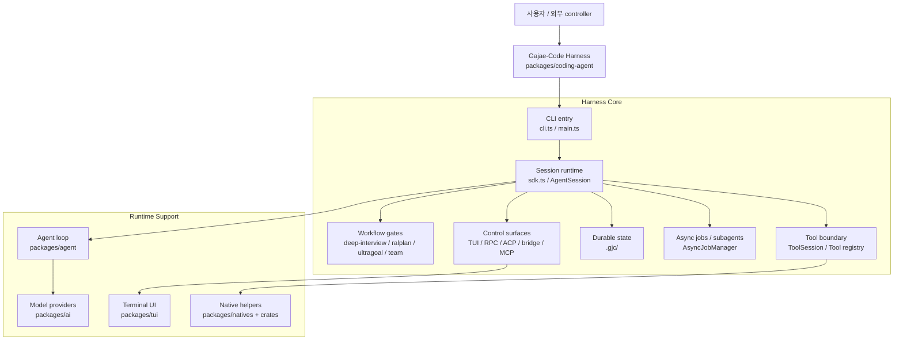
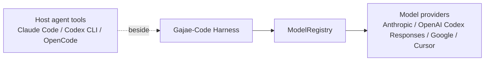

# Gajae-Code를 AI Agent Harness로 설명하기

이 문서는 Gajae-Code를 “AI Agent Harness” 관점에서 설명하기 위한 문서입니다. 여기서 harness는 단순히 LLM을 호출하는 wrapper가 아니라, agent가 실제 개발 작업을 수행할 수 있도록 model, tool, state, workflow, UI, 검증, multi-agent coordination을 묶어 주는 실행 환경을 뜻합니다.

## 핵심 관점

Gajae-Code는 AI coding agent 자체라기보다, AI coding agent가 안정적으로 일하도록 감싸는 harness입니다.

일반적인 LLM coding tool은 “사용자 입력 -> model 응답 -> tool call” 흐름에 집중합니다. 반면 Gajae-Code는 그 주변의 운영 조건을 제품 구조로 만듭니다.

| Harness 요소 | Gajae-Code에서의 구현 |
| --- | --- |
| 실행 진입점 | `gjc` CLI와 launch/session mode |
| agent session | `AgentSession`과 `SessionManager` |
| model 선택 | `ModelRegistry`와 `packages/ai` provider layer |
| tool boundary | `ToolSession`, `createTools()`, built-in/custom/MCP tools |
| workflow gate | `deep-interview`, `ralplan`, `ultragoal`, `team` |
| 지속 상태 | `.gjc/` workflow state, plan, goal, ledger |
| multi-agent 실행 | role agent, `AsyncJobManager`, `runSubprocess()` |
| 사용자/외부 제어 | TUI, RPC, ACP, bridge, coordinator MCP |
| 검증 가능성 | tool result, artifact, completion delivery, evidence ledger |

즉, Gajae-Code의 본질은 “LLM에게 코드를 쓰게 하는 것”이 아니라 “LLM 기반 agent 작업을 관리 가능한 개발 runtime으로 만드는 것”입니다.

## 왜 Harness인가

AI Agent Harness라고 부를 수 있는 이유는 네 가지입니다.

첫째, model 호출을 직접 제품 정책으로 만들지 않습니다. `packages/ai`가 provider 차이를 정규화하고, `ModelRegistry`가 credential, model discovery, fallback을 다룹니다. 그래서 GJC의 session runtime은 특정 provider에 묶이지 않고 Anthropic, OpenAI/Codex Responses, Google/Gemini, Cursor 같은 provider를 바꿔 사용할 수 있습니다.

둘째, tool 실행을 prompt 수준에 두지 않습니다. `ToolSession`, `BUILTIN_TOOLS`, `BashTool`, `executeBash()`, edit/MCP/web 계층을 통해 tool은 schema, cwd, timeout, artifact, cancellation, renderer를 가진 runtime boundary가 됩니다.

셋째, workflow 상태를 대화 밖에 둡니다. `deep-interview`, `ralplan`, `ultragoal`, `team`은 단순 프롬프트가 아니라 `.gjc/` state와 연결되는 workflow입니다. 이 구조 덕분에 작업은 transcript 안에서 사라지지 않고 사람이 확인할 수 있는 상태와 산출물로 남습니다.

넷째, multi-agent 실행을 lifecycle로 관리합니다. subagent는 별도 model call이 아니라 owner, session file, progress, output stream, pause/resume/cancel, completion delivery를 가진 managed task입니다.

## Harness 관점의 전체 구조

이 그림에서 `packages/coding-agent/`는 harness core입니다. `packages/agent`, `packages/ai`, `packages/tui`, native/Rust package는 harness가 사용하는 runtime support입니다.

## Harness가 감싸는 것

Gajae-Code는 agent에게 필요한 주변 환경을 다음처럼 감쌉니다.

### 1. Model Harness

GJC는 특정 model provider 하나에 고정되지 않습니다.

- `packages/ai`는 provider별 request/response 차이를 공통 event와 message model로 정규화합니다.
- `ModelRegistry`는 설정, credential, OAuth/API key, provider discovery, fallback을 다룹니다.
- `AgentSession`은 model 전환과 thinking level 변경을 session lifecycle 안에서 처리합니다.

이 관점에서 model은 “하드코딩된 backend”가 아니라 runtime에서 선택되는 policy입니다.

### 2. Tool Harness

GJC의 tool은 단순한 함수 목록이 아닙니다.

- `ToolSession`은 tool이 cwd, session state, artifact path, active skill state에 접근하게 합니다.
- `createTools()`는 built-in, custom, extension, MCP, skill-specific tool을 하나의 registry로 합칩니다.
- `BashTool`과 `executeBash()`는 shell 실행을 timeout, cancellation, output sink, artifact, async job과 연결합니다.
- edit, AST, MCP, web, debug 도구도 같은 runtime boundary 안에서 실행됩니다.

이 구조는 agent가 tool을 사용할 때 “무엇을 실행했는가”뿐 아니라 “어떤 환경에서, 어떤 제한과 결과로 실행했는가”를 남기게 합니다.

### 3. Workflow Harness

GJC의 workflow는 agent가 무작정 실행으로 뛰어들지 않도록 하는 gate입니다.

| Workflow | Harness 역할 |
| --- | --- |
| `deep-interview` | 모호한 요구사항을 질문과 spec으로 좁힙니다. |
| `ralplan` | 구현 전 계획과 검토 단계를 둡니다. |
| `ultragoal` | 긴 실행을 목표와 증거 단위로 추적합니다. |
| `team` | 병렬 worker 실행을 tmux와 state로 coordination합니다. |

중요한 점은 이 workflow들이 단순 instruction이 아니라 `.gjc/` state와 연결된다는 것입니다. 따라서 현재 어떤 workflow가 활성인지, 무엇이 승인됐는지, 다음 단계가 무엇인지 사람이 확인할 수 있습니다.

### 4. State Harness

Agent 작업은 대화에만 남으면 쉽게 사라집니다. GJC는 중요한 상태를 `.gjc/` 아래로 빼냅니다.

- workflow activation state
- plan/spec/goal
- ultragoal ledger
- team state
- coordinator MCP state
- artifact와 completion delivery

이 구조는 세션 재개, 외부 제어, 검증 기록, 사람의 리뷰를 가능하게 합니다.

### 5. Multi-Agent Harness

GJC의 multi-agent 구조는 “여러 agent를 동시에 부른다”보다 더 엄격합니다.

- role agent는 `executor`, `architect`, `planner`, `critic` 같은 역할로 나뉩니다.
- `AsyncJobManager`는 task와 background bash를 같은 lifecycle registry에서 관리합니다.
- `runSubprocess()`는 subagent용 `AgentSession`을 만들고 progress event를 상위 session에 전달합니다.
- subagent 완료는 `yield` 또는 schema-valid fallback 같은 구조화된 결과를 기준으로 판단합니다.

따라서 subagent는 단순 텍스트 생성자가 아니라 관찰, 일시정지, 재개, 취소, 완료 전달이 가능한 실행 단위입니다.

## Claude Code / Codex CLI와의 관계

Gajae-Code를 설명할 때 중요한 구분이 있습니다.

Claude Code, Codex CLI, OpenCode, Claw Code는 GJC가 내부로 들어가는 provider가 아닙니다. 이들은 사용자가 GJC 옆에서 함께 실행할 수 있는 host agent tool 또는 외부 coding tool입니다.

반면 Anthropic, OpenAI/Codex Responses, Google/Gemini, Cursor 등은 GJC 내부 model layer가 통신하는 provider/runtime adapter입니다.

이 구분을 지키면 GJC의 위치가 명확해집니다. GJC는 다른 agent runtime 안에 숨어 들어가는 plugin이 아니라, 개발자가 선택한 repo/worktree 옆에서 별도로 실행되는 harness입니다.

## 발표용 설명 문장

짧게 말하면:

> Gajae-Code는 AI coding agent를 실행하는 CLI라기보다, AI coding agent 작업을 요구사항 구체화, 계획 승인, 도구 실행, 상태 기록, multi-agent coordination, 검증 증거까지 포함해 관리하는 local agent harness입니다.

조금 더 자세히 말하면:

> Gajae-Code는 model provider, tool registry, session runtime, workflow state, subagent lifecycle, TUI/RPC/MCP control surface를 하나로 묶어 AI coding 작업을 운영 가능한 개발 runtime으로 만드는 프로젝트입니다. 핵심 구현은 `packages/coding-agent/`에 있고, `packages/agent`, `packages/ai`, `packages/tui`, native/Rust/Python 계층은 그 harness를 받치는 support boundary로 분리되어 있습니다.

## 다른 프로젝트와 비교할 때 강조할 점

Gajae-Code를 일반 coding assistant와 비교할 때는 다음을 강조하면 좋습니다.

| 일반 coding assistant | Gajae-Code harness 관점 |
| --- | --- |
| 대화와 tool call 중심 | workflow, state, evidence까지 포함 |
| model provider가 제품 구조에 강하게 묶임 | provider를 `packages/ai`와 `ModelRegistry` 뒤에 둠 |
| tool 실행이 개별 기능으로 흩어짐 | `ToolSession`과 registry로 실행 경계 통합 |
| subagent가 보조 model call처럼 취급됨 | lifecycle을 가진 managed task로 관리 |
| 작업 상태가 transcript에 의존 | `.gjc/` state와 artifact로 지속 |
| UI가 단순 입출력 표면 | TUI/RPC/ACP/bridge/MCP 등 control surface 분리 |

## 이 관점에서 읽어야 할 파일

AI Agent Harness 관점으로 읽을 때는 다음 순서가 좋습니다.

1. `packages/coding-agent/src/cli.ts`
2. `packages/coding-agent/src/main.ts`
3. `packages/coding-agent/src/sdk.ts`
4. `packages/coding-agent/src/session/agent-session.ts`
5. `packages/coding-agent/src/tools/index.ts`
6. `packages/coding-agent/src/gjc-runtime/`
7. `packages/coding-agent/src/task/`
8. `packages/coding-agent/src/async/job-manager.ts`
9. `packages/coding-agent/src/config/model-registry.ts`
10. `packages/agent/src/agent-loop.ts`
11. `packages/ai/src/types.ts`

GitNexus 기준으로는 다음 문서를 함께 보면 좋습니다.

- `.gitnexus/wiki/overview.md`
- `.gitnexus/wiki/coding-agent-session-runtime.md`
- `.gitnexus/wiki/execution-and-tools.md`
- `.gitnexus/wiki/coding-agent-workflow-skills-and-state-runtime.md`
- `.gitnexus/wiki/subagents-and-async-jobs.md`
- `.gitnexus/wiki/support-boundary-ai-provider-layer.md`

## 핵심 요약

Gajae-Code의 AI Agent Harness 관점은 다음 한 줄로 정리할 수 있습니다.

> Gajae-Code는 LLM, 도구, 상태, workflow, multi-agent 실행을 한데 묶어 coding agent 작업을 검토 가능하고 재개 가능하며 운영 가능한 개발 runtime으로 만드는 harness입니다.
