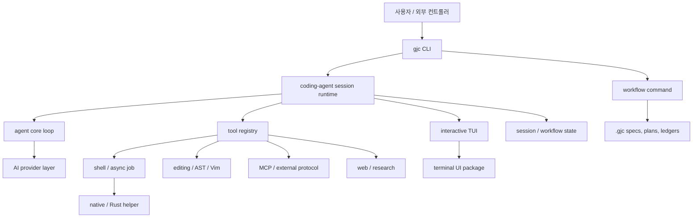
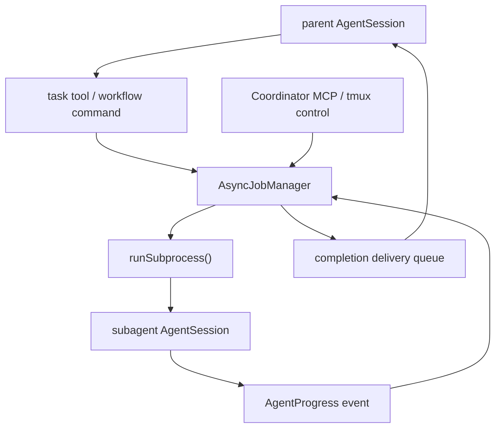

# Gajae-Code 아키텍처

이 문서는 Gajae-Code를 단순히 설치해 보는 것이 아니라, 이 프로젝트에서 아이디어를 얻고 싶은 독자를 위한 진입점입니다. 저장소가 어떤 시스템 아이디어로 구성되어 있는지, 그 아이디어가 실제 코드의 어디에 놓여 있는지, 비슷한 agent harness를 설계할 때 어떤 파일부터 읽으면 좋은지를 안내합니다.

Gajae-Code(`gjc`)는 workflow-first coding-agent runner입니다. 핵심 제품 표면은 `packages/coding-agent/`입니다. 나머지 저장소 영역은 이 핵심 표면을 보조하기 위해 model provider, agent loop, terminal UI, native helper, 통계, benchmark, Python/RPC 자동화 계층을 제공합니다.

로컬에 GitNexus wiki가 있다면, 먼저 그 문서를 읽고 전체 지도를 잡는 것이 좋습니다.

- `.gitnexus/wiki/overview.md`
- `.gitnexus/wiki/module_tree.json`
- `.gitnexus/wiki/coding-agent-cli-and-commands.md`
- `.gitnexus/wiki/coding-agent-session-runtime.md`
- `.gitnexus/wiki/execution-and-tools.md`
- `.gitnexus/wiki/subagents-and-async-jobs.md`
- `.gitnexus/wiki/coding-agent-tasks-subagents-async-jobs-and-coordination.md`
- `.gitnexus/wiki/support-boundary-ai-provider-layer.md`
- `.gitnexus/wiki/support-boundary-*.md`

GitNexus wiki는 방향을 잡기 위한 보조 자료로 취급해야 합니다. 중요한 결론은 반드시 직접 소스 파일과 대조해 확인하세요.

실제 파일을 어떤 순서로 따라 읽을지 알고 싶다면 [SOURCE_WALKTHROUGH.md](SOURCE_WALKTHROUGH.md)를 함께 읽으세요.

## 핵심 아이디어

많은 coding-agent 도구는 채팅 화면과 도구 묶음을 제공하는 데서 멈춥니다. Gajae-Code는 그 주변의 운영 체계를 명시적인 제품 구조로 끌어올립니다.

- 모호한 작업을 다루기 위한 작은 workflow 표면
- model, tool, state, UI를 묶는 지속 가능한 session runtime
- shell, edit, search, MCP, web, job 실행을 위한 typed tool boundary
- `.gjc/` 아래에 저장되는 지속 workflow state
- 병렬 worker가 유용할 때 사용하는 tmux 기반 coordination
- provider, UI, native, automation 관심사를 CLI core 밖으로 분리하는 support package들

이 프로젝트의 제품 가설은 명확합니다. planning, state, evidence, execution boundary가 harness의 일급 개념이 될수록 agent 품질도 좋아진다는 것입니다.



## Multi-Agent System

Gajae-Code는 단일 chat loop만 가진 도구가 아닙니다. 역할 분리, background 실행, 외부 coordination이 유용한 상황을 위해 multi-agent 실행 모델을 갖고 있습니다.

이 구조는 세 계층으로 나누어 보면 가장 잘 보입니다.

| 계층 | 주요 파일 | 책임 |
| --- | --- | --- |
| 역할 agent | `packages/coding-agent/src/task/agents.ts`, `packages/coding-agent/src/prompts/agents/` | `executor`, `architect`, `planner`, `critic` 같은 bundled agent를 정의합니다. |
| subagent 실행 | `packages/coding-agent/src/task/executor.ts`, `packages/coding-agent/src/async/` | subagent를 progress, output, pause/resume, cancellation, result validation을 가진 managed task로 실행합니다. |
| 외부 coordination | `packages/coding-agent/src/coordinator-mcp/`, `packages/coding-agent/src/harness-control-plane/` | tmux session, report, question, lease, 외부 자동화를 위한 coordination/control-plane 표면을 제공합니다. |

핵심 설계 선택은 subagent를 자유롭게 떠다니는 model call로 두지 않는다는 점입니다. subagent는 lifecycle metadata를 가진 소유된 작업입니다. 하나의 subagent 실행에는 owner, model selection, session file, output stream, progress event, completion delivery path가 붙습니다.



이 구조는 몇 가지 재사용 가능한 패턴을 제공합니다.

- 역할 경계는 prompt로 정의하지만, 실행은 runtime이 관리합니다.
- subagent는 단순 text 출력이 아니라 구조화된 completion path로 보고해야 합니다.
- 긴 작업은 output과 delivery retry를 유지하는 background job이 될 수 있습니다.
- owner ID는 한 agent의 job, output cursor, cleanup을 다른 agent와 분리합니다.
- Coordinator MCP는 terminal scrollback을 긁는 방식 대신 file/state 기반 control surface를 외부 controller에 제공합니다.

먼저 읽을 파일:

- `packages/coding-agent/src/task/agents.ts`
- `packages/coding-agent/src/task/executor.ts`
- `packages/coding-agent/src/task/subprocess-tool-registry.ts`
- `packages/coding-agent/src/async/index.ts`
- `packages/coding-agent/src/coordinator-mcp/server.ts`
- `packages/coding-agent/src/harness-control-plane/`
- `.gitnexus/wiki/subagents-and-async-jobs.md`

## Model Provider와 Host Agent 경계

Gajae-Code는 자주 섞여 쓰이는 두 개념을 분리합니다.

1. **Model provider**: model response를 생성하는 API와 credential system입니다.
2. **Host agent tool**: 사용자가 GJC 옆에서 함께 실행할 수 있는 Claude Code, Codex CLI, OpenCode, Claw Code 같은 제품입니다.

GJC는 외부 runner입니다. Claude Code나 Codex CLI 안에 숨어 들어가는 plugin이 아닙니다. 대신 그 도구들과 나란히 실행될 수 있고, 자체 model layer는 `packages/ai`를 통해 provider와 통신합니다.

model-provider 경계는 주로 `packages/ai`에 있습니다.

| 관심사 | 주요 파일 | 설명 |
| --- | --- | --- |
| provider-neutral API | `packages/ai/src/index.ts`, `packages/ai/src/types.ts` | `Context`, `Tool`, `stream()`, `complete()`, normalized assistant message를 노출합니다. |
| model catalog | `packages/ai/src/models.ts`, `packages/ai/src/models.json`, `packages/ai/scripts/generate-models.ts` | provider/model metadata를 session runtime 밖에 둡니다. |
| Anthropic / Claude 계열 접근 | `packages/ai/src/providers/anthropic.ts`, `packages/ai/src/providers/anthropic-messages-server.ts`, `packages/ai/src/utils/oauth/anthropic.ts` | Anthropic Messages 스타일 model과 OAuth/auth 동작을 처리합니다. |
| OpenAI / Codex Responses 접근 | `packages/ai/src/providers/openai-responses.ts`, `packages/ai/src/providers/openai-codex-responses.ts`, `packages/ai/src/utils/oauth/openai-codex.ts`, `packages/ai/src/utils/discovery/codex.ts` | OpenAI Responses와 Codex 전용 discovery/auth path를 처리합니다. |
| 기타 host/provider integration | `packages/ai/src/providers/cursor.ts`, `packages/ai/src/providers/google-gemini-cli.ts`, `packages/ai/src/utils/oauth/opencode.ts` | Cursor, Gemini CLI, OpenCode 같은 integration logic을 provider-specific adapter 뒤에 둡니다. |
| runtime selection | `packages/coding-agent/src/config/model-registry.ts`, `packages/coding-agent/src/session/agent-session.ts` | 사용 가능한 model, credential, fallback behavior, provider session state를 선택합니다. |

provider layer는 나머지 시스템을 위해 다음을 정규화합니다.

- streaming text와 tool-call event
- model ID와 provider ID
- OAuth/API key credential lookup
- usage/cost 계산
- tool schema compatibility
- provider-specific replay/cache session state
- 요청한 model의 credential이 없을 때 fallback

아키텍처 관점의 교훈은 model 선택을 CLI의 hard dependency로 만들지 않고 runtime policy로 둔다는 것입니다. `AgentSession`은 model을 전환할 수 있고, subagent는 model pattern을 상속하거나 override할 수 있으며, provider-specific 동작은 `ModelRegistry`와 `packages/ai` 뒤에 머뭅니다.

## 다섯 가지 재사용 가능한 아이디어

### 1. workflow 표면을 작게 유지한다

Gajae-Code는 기본 workflow skill을 의도적으로 네 개만 노출합니다.

| Workflow | 목적 |
| --- | --- |
| `deep-interview` | 계획이나 수정 전에 모호한 요구사항을 명확히 합니다. |
| `ralplan` | 변경 전에 구현 계획을 만들고 비판적으로 검토합니다. |
| `ultragoal` | 긴 작업을 goal, revision, evidence 단위로 추적합니다. |
| `team` | 병렬 실행이 실제로 가치 있을 때 tmux 기반 worker를 coordination합니다. |

중요한 설계 선택은 이름이 아닙니다. 기본 표면을 작게 유지함으로써 각 workflow가 실제 contract, state model, verification gate를 가질 수 있게 만든다는 점입니다.

먼저 읽을 파일:

- `packages/coding-agent/src/defaults/gjc-defaults.ts`
- `packages/coding-agent/src/defaults/gjc/skills/`
- `packages/coding-agent/src/gjc-runtime/`
- `packages/coding-agent/src/skill-state/`

### 2. coding-agent 실행을 session product로 취급한다

session runtime은 이 시스템의 중심입니다. settings, model selection, authentication, tools, prompts, extensions, UI callback, persistence, compression, async job, shutdown cleanup을 조립합니다.

저수준 agent loop는 `@gajae-code/agent-core`에 위임하지만, `packages/coding-agent`는 그 주변의 제품 동작을 소유합니다.

먼저 읽을 파일:

- `packages/coding-agent/src/cli.ts`
- `packages/coding-agent/src/main.ts`
- `packages/coding-agent/src/sdk.ts`
- `packages/coding-agent/src/session/agent-session.ts`
- `packages/agent/src/index.ts`

전형적인 흐름:

```text
gjc command
  -> runCli()
  -> launch / command handler
  -> runRootCommand()
  -> createAgentSession()
  -> AgentSession
  -> Agent from @gajae-code/agent-core
```

### 3. tool을 runtime boundary 뒤에 둔다

tool은 prompt 조각으로 흩어져 있지 않습니다. schema, execution logic, result metadata, UI renderer를 가진 등록된 capability입니다. session은 built-in tool, custom tool, extension tool, MCP tool, skill-specific tool을 하나의 실행 표면으로 감싸는 tool registry를 구성합니다.

먼저 읽을 파일:

- `packages/coding-agent/src/tools/index.ts`
- `packages/coding-agent/src/tools/bash.ts`
- `packages/coding-agent/src/exec/bash-executor.ts`
- `packages/coding-agent/src/edit/`
- `packages/coding-agent/src/runtime-mcp/`
- `packages/coding-agent/src/web/`

핵심 설계 교훈은 tool execution에 lifecycle handling이 필요하다는 것입니다. cwd, environment, timeout, cancellation, artifact capture, background job, UI preview, permission boundary가 모두 실행 경계의 일부입니다.

### 4. workflow state를 대화 밖에 저장한다

Gajae-Code는 workflow 활성 상태를 chat history에만 의존하지 않습니다. workflow state, plan, goal, ledger는 `.gjc/` 아래에 저장되고 runtime helper를 통해 갱신됩니다.

이 덕분에 상태를 사람, hook, UI HUD, 이후 session이 모두 확인할 수 있습니다.

먼저 읽을 파일:

- `packages/coding-agent/src/gjc-runtime/state-runtime.ts`
- `packages/coding-agent/src/gjc-runtime/state-writer.ts`
- `packages/coding-agent/src/gjc-runtime/state-schema.ts`
- `packages/coding-agent/src/plan-mode/state.ts`
- `packages/coding-agent/src/goals/state.ts`
- `packages/coding-agent/src/autoresearch/state.ts`

재사용 가능한 아이디어는 단순합니다. workflow가 중요하다면, model transcript 밖에 state contract를 두어야 합니다.

### 5. support domain을 CLI core 밖에 둔다

이 저장소가 monorepo인 이유는 CLI가 여러 전문 runtime을 필요로 하기 때문입니다. 하지만 그 runtime들은 서로 다른 ownership boundary를 갖습니다.

| 경계 | package 또는 영역 | 기여하는 것 |
| --- | --- | --- |
| Agent loop | `packages/agent` | model/tool loop, event streaming, context handling |
| AI provider | `packages/ai` | model catalog, auth, streaming adapter, tool schema |
| Terminal UI | `packages/tui` | rendering, input, markdown, editor component |
| Native helper | `packages/natives`, `crates/pi-natives` | search, grep, image/SIXEL, native binding |
| Shell / isolation | `crates/pi-shell`, `crates/pi-iso`, vendored Brush crates | shell execution support와 isolation primitive |
| Stats | `packages/stats` | local usage와 observability surface |
| Shared utility | `packages/utils`, `packages/bridge-client` | 공통 helper와 bridge protocol client |
| Python automation | `python/gjc-rpc`, `python/robogjc` | RPC host와 GitHub 중심 자동화 |

명시적으로 해당 영역을 다루는 작업이 아니라면, 이 package들은 `packages/coding-agent/`를 보조하는 의존/지원 경계로 읽는 것이 좋습니다.

## 주요 실행 흐름

### CLI 진입점

`packages/coding-agent/src/cli.ts`는 실행 파일의 진입점입니다. Bun runtime을 확인하고, `--help`, `--version`, `--smoke-test` 같은 fast path를 처리하며, subcommand를 등록하고, 일반 prompt를 `launch` command로 라우팅합니다.

첫 번째 인자가 알려진 subcommand가 아니면 Gajae-Code는 해당 호출을 launch 요청으로 취급합니다.

```text
gjc "summarize this repo"
  -> launch
```

`gjc config`, `gjc team`, `gjc ralplan`, `gjc auth-broker` 같은 명시적 command는 `packages/coding-agent/src/commands/`와 `packages/coding-agent/src/cli/` 아래의 command handler로 라우팅됩니다.

### Session 구성

`packages/coding-agent/src/main.ts`는 launch mode를 준비하고 `packages/coding-agent/src/sdk.ts`의 `createAgentSession()`을 호출합니다.

이 session 구성 단계는 다음을 수행합니다.

- settings, auth storage, model registry 초기화
- session manager 복원 또는 생성
- workspace context, AGENTS.md, rules, skills, prompts, extensions 로드
- built-in/custom tool 생성
- system prompt 구성
- `Agent` 생성
- `AgentSession`으로 wrapping

결과로 만들어지는 `AgentSession`은 interactive mode, print mode, RPC mode, ACP mode, bridge mode, tooling이 함께 사용하는 공통 객체입니다.

### Tool 실행

가장 중요한 tool path는 shell 실행입니다.

```text
AgentSession
  -> tool registry
  -> BashTool
  -> executeBash()
  -> shell session / output sink / async job manager
```

editing, AST search, MCP call, web search, DAP debugging, custom tool도 큰 틀에서는 같은 패턴을 따릅니다. tool은 자신의 schema와 execution rule을 소유하고, session은 cwd, state, UI context, artifact path, model context, shutdown hook을 제공합니다.

### Workflow 실행

workflow 실행은 명시적인 skill activation 또는 workflow command에서 시작합니다. runtime은 activation을 기록하고 state envelope을 쓴 뒤, workflow prompt와 UI state가 다음 단계를 안내하게 합니다.

예시:

```text
user invokes deep-interview
  -> keyword / skill detection
  -> workflow activation record
  -> .gjc state envelope
  -> question rendering and approval gate
```

이 구조 덕분에 workflow는 hook, HUD, 이후 session에서 계속 보이는 상태가 됩니다.

## 저장소 지도

어디부터 볼지 결정할 때는 이 표를 기준으로 삼으면 됩니다.

| Path | 읽어야 할 때 |
| --- | --- |
| `packages/coding-agent/src/cli.ts` | executable entry와 command routing을 볼 때 |
| `packages/coding-agent/src/main.ts` | launch mode와 top-level session startup을 볼 때 |
| `packages/coding-agent/src/sdk.ts` | session assembly와 exported API를 볼 때 |
| `packages/coding-agent/src/session/agent-session.ts` | session lifecycle, event, prompt, tool call을 볼 때 |
| `packages/coding-agent/src/tools/` | built-in tool definition을 볼 때 |
| `packages/coding-agent/src/exec/` | shell execution과 output handling을 볼 때 |
| `packages/coding-agent/src/edit/` | file editing engine과 patch application을 볼 때 |
| `packages/coding-agent/src/gjc-runtime/` | workflow state runtime을 볼 때 |
| `packages/coding-agent/src/defaults/gjc/skills/` | bundled workflow skill prompt를 볼 때 |
| `packages/coding-agent/src/modes/` | interactive, RPC, ACP, bridge mode를 볼 때 |
| `packages/coding-agent/src/extensibility/` | plugin, hook, custom command, custom tool을 볼 때 |
| `packages/coding-agent/src/task/` | role agent, subagent execution, task output contract를 볼 때 |
| `packages/coding-agent/src/async/` | background job, output cursor, pause/resume, delivery queue를 볼 때 |
| `packages/coding-agent/src/coordinator-mcp/` | multi-agent와 tmux control을 위한 MCP coordination surface를 볼 때 |
| `packages/coding-agent/src/config/model-registry.ts` | model selection과 credential-aware registry를 볼 때 |
| `packages/agent/` | lower-level agent loop를 볼 때 |
| `packages/ai/` | provider adapter, auth, model catalog, streaming을 볼 때 |
| `packages/tui/` | terminal UI primitive를 볼 때 |
| `packages/natives/`, `crates/` | native helper와 Rust support를 볼 때 |
| `python/gjc-rpc/`, `python/robogjc/` | Python RPC와 automation surface를 볼 때 |

## 목표별 읽기 경로

### workflow-first agent product 아이디어를 얻고 싶을 때

읽을 순서:

1. `README.md`
2. `packages/coding-agent/src/defaults/gjc-defaults.ts`
3. `packages/coding-agent/src/defaults/gjc/skills/`
4. `packages/coding-agent/src/gjc-runtime/`
5. `.gitnexus/wiki/coding-agent-workflow-skills-and-state-runtime.md`

볼 것: 작은 workflow surface, explicit approval gate, durable state, handoff contract.

### 튼튼한 agent runtime 아이디어를 얻고 싶을 때

읽을 순서:

1. `packages/coding-agent/src/sdk.ts`
2. `packages/coding-agent/src/session/agent-session.ts`
3. `packages/agent/src/index.ts`
4. `packages/ai/src/index.ts`
5. `.gitnexus/wiki/coding-agent-session-runtime.md`

볼 것: product session policy와 low-level model/tool loop의 분리.

### tool execution 아이디어를 얻고 싶을 때

읽을 순서:

1. `packages/coding-agent/src/tools/index.ts`
2. `packages/coding-agent/src/tools/bash.ts`
3. `packages/coding-agent/src/exec/bash-executor.ts`
4. `packages/coding-agent/src/async/index.ts`
5. `.gitnexus/wiki/execution-and-tools.md`

볼 것: schema, cancellation, artifact, background job, UI rendering, error mapping.

### extensibility 아이디어를 얻고 싶을 때

읽을 순서:

1. `packages/coding-agent/src/capability/`
2. `packages/coding-agent/src/discovery/`
3. `packages/coding-agent/src/extensibility/`
4. `packages/coding-agent/src/runtime-mcp/`
5. `.gitnexus/wiki/capabilities-and-extensibility.md`

볼 것: project file, user configuration, plugin, MCP server, runtime extension에서 오는 capability 병합 방식.

### multi-agent system 아이디어를 얻고 싶을 때

읽을 순서:

1. `packages/coding-agent/src/task/agents.ts`
2. `packages/coding-agent/src/task/executor.ts`
3. `packages/coding-agent/src/task/subprocess-tool-registry.ts`
4. `packages/coding-agent/src/async/index.ts`
5. `packages/coding-agent/src/coordinator-mcp/`
6. `.gitnexus/wiki/subagents-and-async-jobs.md`

볼 것: role prompt, owner-scoped job, structured subagent completion, progress rendering, pause/resume, external coordination.

### model/provider abstraction 아이디어를 얻고 싶을 때

읽을 순서:

1. `packages/ai/src/index.ts`
2. `packages/ai/src/provider-models/`
3. `packages/ai/src/providers/anthropic.ts`
4. `packages/ai/src/providers/openai-codex-responses.ts`
5. `packages/ai/src/utils/oauth/`
6. `packages/coding-agent/src/config/model-registry.ts`
7. `.gitnexus/wiki/support-boundary-ai-provider-layer.md`

볼 것: provider-neutral streaming, credential lookup, model catalog generation, OAuth/API-key separation, runtime model fallback.

### terminal agent UX 아이디어를 얻고 싶을 때

읽을 순서:

1. `packages/coding-agent/src/modes/`
2. `packages/coding-agent/src/modes/components/`
3. `packages/tui/src/`
4. `.gitnexus/wiki/interactive-ui.md`
5. `.gitnexus/wiki/support-boundary-terminal-ui.md`

볼 것: session logic과 rendering을 분리하면서도 tool result를 풍부하게 보여주는 방식.

### external control 아이디어를 얻고 싶을 때

읽을 순서:

1. `packages/coding-agent/src/modes/rpc/`
2. `packages/coding-agent/src/modes/acp/`
3. `packages/coding-agent/src/modes/bridge/`
4. `packages/coding-agent/src/coordinator-mcp/`
5. `python/gjc-rpc/`
6. `python/robogjc/`

볼 것: coding agent를 terminal transcript scraping 없이 다른 process가 제어할 수 있게 만드는 방식.

## 그대로 베끼면 안 되는 부분

아래 요소들은 이 저장소의 목표에 맞게 선택된 것이므로 그대로 복사하기 전에 다시 판단해야 합니다.

- 기본 workflow 이름은 제품 선택이지 보편적인 이름이 아닙니다.
- tmux 중심 team model은 local orchestration에는 유용하지만 유일한 worker model은 아닙니다.
- `.gjc/` state layout은 workflow surface가 작기 때문에 강력합니다. workflow catalog가 커지면 더 엄격한 lifecycle discipline이 필요합니다.
- native helper는 JavaScript나 shell만으로 성능과 fidelity가 부족한 곳에서만 가치가 있습니다.
- provider support는 유지보수 비용을 늘립니다. model/provider abstraction은 좁게 유지해야 합니다.
- host tool과 model provider를 한 개념으로 합치면 안 됩니다. Claude Code, Codex CLI, OpenCode, Claw Code는 GJC 옆에서 실행될 수 있는 제품이고, Anthropic, OpenAI/Codex Responses, Google, Cursor, 기타 adapter는 `packages/ai` 내부의 provider/runtime boundary입니다.

## 이 아키텍처가 흥미로운 이유

Gajae-Code에서 유용한 아이디어는 tool이 많다는 사실이 아닙니다. agent 작업을 auditable runtime으로 취급한다는 점입니다.

- 변경 전에 intent를 명확히 합니다.
- 실행 전에 plan을 검토할 수 있습니다.
- 긴 작업은 추적 가능한 goal로 나뉩니다.
- multi-agent 작업은 owner, progress, completion, cleanup을 가집니다.
- model provider는 runtime registry 뒤에 추상화됩니다.
- tool은 execution contract를 가집니다.
- state는 transcript 밖에서 살아남습니다.
- support package는 명시적인 경계를 가집니다.

그래서 이 프로젝트는 agent harness, local automation runner, workflow-oriented CLI, multi-agent execution environment를 설계하려는 사람에게 좋은 참고 자료가 됩니다.
