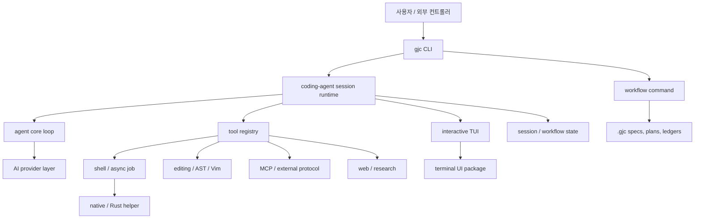

# Gajae-Code 분석 보고서: 아키텍처, 코드 검증, 그리고 소프트웨어 공학적 시사점

> **함께 보기:** 시각 자료는 [`GAJAE-CODE-DIAGRAMS.md`](./GAJAE-CODE-DIAGRAMS.md)에 14개의 Mermaid 다이어그램으로 정리되어 있다. 각 섹션 하단의 "연관 문서" 링크로 이동하면 해당 도식을 볼 수 있다.

> 본 문서는 `part7_opensource/gajae-code/`에 위치한 Gajae-Code(`gjc`) 프로젝트를 세 가지 관점에서 분석한 기록이다.
> 1. **아키텍처 개요** — 프로젝트가 스스로 밝히는 설계 의도 (ARCHITECTURE.md 기반)
> 2. **코드 검증** — ARCHITECTURE.md의 주장을 실제 소스 코드와 대조한 결과
> 3. **소프트웨어 공학적 시사점** — 다른 AI agent harness 설계 시 참고할 만한 설계 특성
>
> 모든 주장은 코드 검증을 거쳤으며, 검증되지 않은 내용은 명시적으로 표기한다.

---

## 목차

- [Part 1. 프로젝트 개요](#part-1-프로젝트-개요)
- [Part 2. 아키텍처 철학](#part-2-아키텍처-철학)
- [Part 3. 모노레포 구조](#part-3-모노레포-구조)
- [Part 4. 코드 검증: 문서 주장 vs 실제 구현](#part-4-코드-검증-문서-주장-vs-실제-구현)
  - [4.1 CLI 진입점](#41-cli-진입점)
  - [4.2 Session Assembly](#42-session-assembly)
  - [4.3 Workflow State Runtime](#43-workflow-state-runtime)
  - [4.4 Tool Registry와 Bash Executor](#44-tool-registry와-bash-executor)
  - [4.5 Multi-Agent / Async Job System](#45-multi-agent--async-job-system)
  - [4.6 Model Provider 분리](#46-model-provider-분리)
- [Part 5. 검증 총평](#part-5-검증-총평)
- [Part 6. 소프트웨어 공학적 시사점: 참고할 만한 8가지 설계 특성](#part-6-소프트웨어-공학적-시사점-참고할-만한-8가지-설계-특성)
- [Part 7. 벤치마킹 시 주의사항](#part-7-벤치마킹-시-주의사항)

---

## Part 1. 프로젝트 개요

**Gajae-Code**(`gjc`)는 "workflow-first coding-agent runner"를 표방하는 오픈소스 프로젝트다. 단순히 LLM과 도구를 묶은 채팅 에이전트가 아니라, **planning · state · evidence · execution boundary를 harness의 일급 개념**으로 끌어올린 것이 핵심 차별점이다. 저장소의 중심 제품 표면은 `packages/coding-agent/`이고, 나머지는 이를 보조하는 support package들이다.

> 태그라인: *"Encode intention. Decode software."* — 인터뷰 → 검토된 계획 → tmux 기반 실행 → durable 검증

### 핵심 워크플로 (4종)

```
deep-interview -> ralplan -> ultragoal
                         └─ optional team execution when parallel tmux workers help
```

| Workflow | 역할 |
| --- | --- |
| `deep-interview` | 변경/계획 전에 모호한 요구사항을 명확히 정제 |
| `ralplan` | 구현 계획을 세우고 **비판적으로 검토**(critic) |
| `ultragoal` | 긴 작업을 goal · revision · evidence 단위로 추적 |
| `team` | 병렬 실행이 가치 있을 때 tmux 기반 worker coordination |

### 핵심 역할 Agent (4종)

| Agent | What it does |
| --- | --- |
| `executor` | Bounded implementation, fixes, refactors. (유일한 write-capable agent) |
| `architect` | Read-only architecture and code-review assessment. |
| `planner` | Read-only sequencing and acceptance criteria. |
| `critic` | Read-only plan critique and actionability review. |

---

## Part 2. 아키텍처 철학

대부분의 coding-agent 도구는 "채팅 화면 + 도구 묶음"에서 멈춘다. Gajae-Code는 그 주변의 **운영 체계(operational surface)**를 명시적인 제품 구조로 만든다.

**제품 가설:**
> *"planning, state, evidence, execution boundary가 harness의 일급 개념일수록 agent 품질이 좋아진다."*



### 다섯 가지 재사용 가능한 아이디어 (ARCHITECTURE.md)

1. **workflow 표면을 작게 유지한다** — 기본 4개만. 각 workflow가 진짜 contract와 verification gate를 갖게 하려면.
2. **coding-agent 실행을 session product로 취급한다** — settings · model · auth · tools · prompts · extensions · UI · persistence · async job · shutdown cleanup을 조립하는 `AgentSession`이 중심.
3. **tool을 runtime boundary 뒤에 둔다** — tool은 prompt 조각이 아니라 schema · execution · result metadata · UI renderer를 가진 등록된 capability.
4. **workflow state를 대화 밖에 저장한다** — plan/goal/ledger를 `.gjc/` 아래에 두어 사람, hook, UI HUD, 이후 session이 모두 볼 수 있게.
5. **support domain을 CLI core 밖에 둔다** — 명시적 경계로 읽는 것이 좋다.

---

## Part 3. 모노레포 구조

CLI가 여러 전문 runtime을 필요로 하기 때문에 monorepo다. 하지만 각 runtime은 **서로 다른 ownership boundary**를 갖는다. 설계 원칙: **support domain은 CLI core 밖에 둔다.**

```
packages/                         # TS/Bun 워크스페이스 (packageManager: bun@1.3.14)
├── coding-agent/  핵심 제품 표면 (CLI, session, workflow, tools, TUI mode)
├── agent/         저수준 agent loop (model/tool loop, event streaming)
├── ai/            model provider layer (catalog, auth, streaming adapter)
├── tui/           terminal UI primitive (rendering, markdown, input)
├── natives/       JS로 부족한 부분의 native binding 진입점
├── stats/         local usage / observability surface
├── utils/, bridge-client/   공통 helper, bridge protocol client
├── gajae-code/    umbrella package
└── orchestration-token-benchmark/, typescript-edit-benchmark/  벤치마크

crates/                           # Rust 지원 계층
├── pi-natives/    search, grep, image/SIXEL native binding
├── pi-shell/, pi-iso/   shell 실행 + isolation primitive
├── pi-ast/        AST 작업
└── brush-core-vendored/, brush-builtins-vendored/  vendored Brush 셸

python/
├── gjc-rpc/       RPC 호스트 (gjc --mode rpc 구동)
└── robogjc/       GitHub 중심 자동화
```

### 두 가지 핵심 아키텍처 개념

#### Model Provider vs Host Agent 경계 분리

자주 섞여 쓰이는 두 개념을 명확히 분리한다:

1. **Model provider** (`packages/ai`) — model response를 생성하는 API + credential. Anthropic, OpenAI/Codex Responses, Google Gemini, Cursor, OpenCode 등의 adapter.
2. **Host agent tool** — Claude Code, Codex CLI, OpenCode, Claw Code 같은 **옆에서 함께 실행되는 제품**.

> GJC는 **외부 runner**다. 다른 도구 안에 숨어드는 plugin이 아니다. 대신 그 도구들과 나란히 실행되며, 자체 model layer는 `packages/ai`를 통해 provider와 통신한다.

#### Multi-Agent System

세 계층으로 보면 가장 명확하다:

| 계층 | 파일 | 책임 |
| --- | --- | --- |
| 역할 agent | `task/agents.ts`, `prompts/agents/` | executor/architect/planner/critic 정의 |
| subagent 실행 | `task/executor.ts`, `async/` | progress · output · pause/resume · cancellation · validation을 가진 managed task |
| 외부 coordination | `coordinator-mcp/`, `harness-control-plane/` | tmux · report · question · lease 기반 control plane |

**핵심 설계 선택**: subagent를 자유로운 model call로 두지 않고, **lifecycle metadata를 가진 소유된 작업**으로 취급한다.

---

## Part 4. 코드 검증: 문서 주장 vs 실제 구현

> 이 파트에서는 ARCHITECTURE.md의 주장을 실제 코드와 대조한 결과를 기록한다.
> 검증은 6개 영역에 걸쳐 수행됐으며, 각 주장을 CONFIRMED / PARTIAL / REFUTED로 분류했다.

### 4.1 CLI 진입점

**검증 파일:** `packages/coding-agent/src/cli.ts`

**문서 주장:** "첫 인자가 알려진 subcommand가 아니면 Gajae-Code는 해당 호출을 launch 요청으로 취급한다."

**결과: CONFIRMED**

```ts
// cli.ts:188-218
const runArgv =
  first === "--help" || first === "-h" || first === "--version" || first === "-v" || first === "help"
    ? argv
    : isSubcommand(first)
      ? argv
      : ["launch", ...argv];
return run({ bin: APP_NAME, version: VERSION, argv: runArgv, commands, help: showHelp });
```

- 17개 subcommand가 lazy import로 등록 (`cli.ts:25-47`)
- `--smoke-test`는 `Worker` 로드 + native addon 추출을 검증 (`cli.ts:167-185`)
- 이는 README의 "compiled binary는 natives를 동적 로드할 수 없다"는 경고와 일치

---

### 4.2 Session Assembly

**검증 파일:** `packages/coding-agent/src/sdk.ts`, `main.ts`, `session/agent-session.ts`, `packages/agent/src/`

**문서 주장:** `createAgentSession()` (`sdk.ts:827`)이 7단계를 수행한다.

**결과: 7/7 CONFIRMED (1개 PARTIAL)**

| 단계 | 상태 | 증거 |
|---|---|---|
| 1. settings/auth/modelRegistry | CONFIRMED | `sdk.ts:839-864` — **단, CLI 경로에서는 `main.ts:732-780`이 먼저 생성해서 주입**, SDK 내 초기화는 fallback 경로 |
| 2. session manager 복원 | CONFIRMED | `sdk.ts:915-919`, 복원 시 `agent.replaceMessages()` (`sdk.ts:1977-1999`) |
| 3. AGENTS.md/skills/rules/extensions | PARTIAL | `sdk.ts:868-883, 1039-1091` — **filesystem extension discovery는 명시적으로 비활성화(quarantined)** (`main.ts:702-703`). AGENTS.md는 별도 단계가 아니라 `buildWorkspaceTree`에 흡수됨 |
| 4. built-in/custom tool | CONFIRMED | `sdk.ts:1306` `createTools` + `sdk.ts:1320-1369` custom tools |
| 5. system prompt | CONFIRMED | `sdk.ts:1603-1674` `rebuildSystemPrompt` |
| 6. Agent 생성 | CONFIRMED | `sdk.ts:1882-1972` `new Agent({...})` |
| 7. AgentSession wrapping | CONFIRMED | `sdk.ts:2001-2058` `new AgentSession({...})` |

**주요 발견 — "ACP 모드 공유" 오해:** 문서는 `AgentSession`이 "interactive/print/RPC/ACP/bridge 모두 공유"한다고 썼지만, **ACP는 예외**다. ACP는 `createAcpSessionFactory`(`main.ts:262-293`)로 **클라이언트 세션마다 새 AgentSession을 생성**한다. 나머지 4개 모드는 단일 세션을 공유하는 것이 맞다.

**Agent vs AgentSession 분리:**
- `packages/agent/src/agent.ts:259` `Agent` — 순수 stateful core (model/tools/messages/streaming/retry). 파일 헤더: *"No transport abstraction - calls streamSimple via the loop"*
- `AgentSession` (`agent-session.ts:863`) — `readonly agent: Agent`를 보유하면서 그 위에 persistence, compaction, retry-fallback, MCP discovery, goal/plan mode, IRC registry 등 ~80개 private 필드 추가

---

### 4.3 Workflow State Runtime

**검증 파일:** `packages/coding-agent/src/gjc-runtime/`, `defaults/gjc/skills/`

**문서 주장:** (1) 4개 workflow, (2) `.gjc/` state, (3) atomic write, (4) activation record

**결과: 전부 CONFIRMED, 그리고 더 정교함**

#### 4개 workflow — CONFIRMED + schema 강제

```ts
// state-schema.ts:17 — single source of truth
const CANONICAL_GJC_WORKFLOW_SKILLS = ["deep-interview", "ralplan", "ultragoal", "team"] as const;
```

각 skill은 진짜 verification gate를 가진다:
- **deep-interview**: "ambiguity ≤ threshold + 사용자 명시 승인 전까지 실행 금지" (SKILL.md:52)
- **ralplan**: Critic가 `APPROVE` 반환 필수 (또는 5회 반복 cap, SKILL.md:75)
- **ultragoal**: `--quality-gate-json` + G001/G002 ledger (`ultragoal/ledger.jsonl`)
- **team**: "gjc team 사용 불가 시 hard error" (SKILL.md:35)

#### `.gjc/` state location — CONFIRMED

- `state-writer.ts:175` `const gjcRoot = path.join(projectRoot, ".gjc");`
- `resolveGjcTarget` (`state-writer.ts:172-182`)은 `.gjc/**` 밖 경로를 거부: "target path must be within project .gjc/**"
- Mode state: `.gjc/state/[sessions/<id>/]<mode>-state.json`
- Ultragoal: `brief.md`, `goals.json`, `ledger.jsonl`
- Ralplan: `.gjc/plans/ralplan/<run-id>/`

#### Atomic write — CONFIRMED

```ts
// state-writer.ts:375-386
async function atomicWrite(filePath, content) {
    await fs.mkdir(path.dirname(filePath), { recursive: true });
    const tmpPath = tempPathFor(filePath);  // per-process/ms/uuid
    try {
        await fs.writeFile(tmpPath, content, "utf-8");
        await fs.rename(tmpPath, filePath);  // POSIX atomic
    } catch (error) {
        await fs.rm(tmpPath, { force: true }).catch(() => undefined);
        throw error;
    }
    return filePath;
}
```

주의: **뉘앙스**: 모듈 주석이 "No lockfiles are used"라고 하지만, 실제로는 `withFileLock`(advisory directory lock)을 read-modify-write 경로에 사용한다. crash-atomicity(rename)과 concurrency-atomicity(lock)을 구분한 설명이지만, 표면적 읽기에는 모순적으로 보일 수 있다.

#### Activation record — CONFIRMED (이름은 "active entry")

`SkillActiveEntrySchema` (`state-schema.ts:117-150`)에 `skill`, `phase`, `active`, `activated_at`, `session_id`, `handoff_from/to/at`, `receipt` 필드. Write path: `writeActiveEntry()` (`state-writer.ts:745-756`).

#### Dual Schema Contract (문서에 없지만 주목할 만한 설계)

`state-schema.ts`는 **lenient read / strict write**를 구현한다:
- 읽기: `.passthrough()` lenient schema → 알 수 없는 필드가 있어도 실패 안 함 (forward-compatible)
- 쓰기: `RequiredOnWriteEnvelopeSchema` → `content_sha256` 등 필수 필드 누락 시 실패 (fail-closed)

---

### 4.4 Tool Registry와 Bash Executor

**검증 파일:** `packages/coding-agent/src/tools/`, `exec/bash-executor.ts`

**문서 주장:** (1) tool은 capability, (2) 통합 registry, (3) 8개 lifecycle 차원, (4) shell 실행 흐름

**결과: CONFIRMED (8/8 lifecycle 차원)**

#### 통합 Tool 인터페이스

```ts
// packages/agent/src/types.ts:411-454
export type AgentTool<TParameters, TDetails, TTheme> = Tool<TParameters> & {
    execute: AgentToolExecFn;        // (toolCallId, params, signal?, onUpdate?, context?) => Promise<AgentToolResult>
    renderCall?: (...) => ...;        // UI renderer (선택적)
    renderResult?: (...) => ...;
}
```

#### 단일 registry로 수렴

built-in/MCP/extension/skill/RPC tool이 모두 같은 `Map<string, AgentTool>`(`agent-session.ts:984`)로 들어간다:
- built-in: `createTools()` (`sdk.ts:1306`)
- MCP: `refreshMCPTools()` (`agent-session.ts:3949-3993`)
- RPC host: `refreshRpcHostTools()` (`agent-session.ts:3998-4044`)
- skill-specific: `refreshGjcSubskillTools()` (`agent-session.ts:4077+`)

#### Bash lifecycle — 8/8 차원 확인

| 차원 | 상태 | 증거 (`exec/bash-executor.ts`) |
|---|---|---|
| cwd | 확인 | `:95-105` realpath resolution |
| env | 확인 | `:127` `NON_INTERACTIVE_ENV` merge |
| timeout | 확인 | `:210` 기본 300s + abort race |
| cancellation | 확인 | AbortSignal + `abortCurrentExecution()` (`:177-184`) |
| artifact | 확인 | OutputSink + `artifact://<id>` footer (`:133-144, 329-343`) |
| background job | 확인 | `AsyncJobManager.instance()` via `tools/bash.ts:746-766` |
| UI preview | 확인 | `onChunk` 50ms throttle + `onRawChunk` (`:21-27`) |
| permission | 확인 | `#wrapToolForAcpPermission` (`agent-session.ts:3684-3716`) |

주의: **뉘앙스**: 문서는 renderer가 tool 인스턴스에 있다고 암시하지만, `BashTool`은 `renderCall`/`renderResult`를 구현하지 않는다. 대신 별도 `toolRenderers` map(`tools/renderers.ts:49-53`)에 `bash: bashToolRenderer`로 등록된다. capability로서는 맞지만 "tool 객체 위에"라는 표현은 built-in에만 부분적으로 맞다.

#### Shell 실행 흐름

```
AgentSession -> #toolRegistry (Map<string, AgentTool>)
  -> BashTool.execute (tools/bash.ts:714-728)
  -> executeBash() (tools/bash.ts:997-1007)
  -> Shell.run() / executeShell() (bash-executor.ts:223-254) [@gajae-code/natives]
  -> async path: #startManagedBashJob -> AsyncJobManager (tools/bash.ts:746-803)
```

---

### 4.5 Multi-Agent / Async Job System

**검증 파일:** `packages/coding-agent/src/task/`, `async/`, `coordinator-mcp/`, `harness-control-plane/`

**문서 주장 (가장 강하고 차별적인 주장들):**
1. 4개 역할 agent (executor/architect/planner/critic)
2. Subagent = owned task (owner, model, session file, output, progress, delivery)
3. AsyncJobManager: progress, output cursor, pause/resume, cancellation, validation, delivery queue, owner scoping
4. Coordinator MCP: file/state-based (NOT scrollback)

**결과: 전부 CONFIRMED — 가장 강한 주장도 코드로 확인**

#### 4개 역할 agent — CONFIRMED

`task/agents.ts:48-68`에 `EMBEDDED_AGENT_DEFS`가 build-time에 `.md` prompt를 embed. **executor만 write-capable** (나머지 3개는 read-only + 명시적 tool whitelist):
- `executor.md`: `tools` 필드 없음 (기본 전체 toolset 상속), `forkContext: allowed`
- `architect.md`: `tools: read, search, find, lsp, ast_grep, web_search, bash, report_finding`, `thinking-level: high`, `blocking: true`
- `planner.md`: read-only + sanctified bash prefixes
- `critic.md`: `tools: read, search, find, lsp, ast_grep, web_search, bash`, `thinking-level: high`, read-only

#### Subagent = owned task — 모든 lifecycle 필드 CONFIRMED

| 주장 필드 | 상태 | 증거 |
|---|---|---|
| owner | 확인 | `task/index.ts:764,786,800` `ownerId: this.session.getAgentId()` → `manager.register(...)` |
| model selection | 확인 | `executor.ts:1163-1171` `requestedModel/effectiveModel/modelFellBack` |
| session file | 확인 | `executor.ts:568-570` `${id}.jsonl` + `SessionManager.open()` |
| output stream | 확인 | `executor.ts:524-542` `AgentProgress` (status/tools/output/tokens/cost) |
| progress event | 확인 | `job-manager.ts:636` `recordSubagentProgress()` |
| completion delivery | 확인 | `AsyncJobDelivery` (`job-manager.ts:141`) + retry/backoff/dead-letter |

> **가장 강력한 증거**: subagent를 launch하는 모든 경로는 model call 전에 `manager.register(...)`를 거친다. "bare model call로 subagent를 launch하는 코드 경로는 존재하지 않는다."

#### AsyncJobManager 기능 — 7개 전부 CONFIRMED

| 기능 | 상태 | 증거 |
|---|---|---|
| progress | 확인 | `recordSubagentProgress()` (`:636`), `getSubagentProgress()` (`:641`) |
| output cursor | 확인 | `getRecentJobs/getAllJobs/getRunningJobs` (`:839-850`), `DEFAULT_RETENTION_MS` |
| pause/resume | 확인 | `pauseSubagent()` (`:712-723`) → cooperative safe-boundary; `resumeSubagent()` (`:726-759`) + FIFO `#resumeQueue` |
| cancellation | 확인 | `cancel(id, filter)` (`:482`), `cancelSubagent()` (`:792-819`), `cancelAll(filter)` (`:1084`) |
| result validation | 확인 | `buildOutputValidator()` (`executor.ts:189-207`) — JSON-Schema, `schema_violation` 시 exitCode 1 |
| delivery queue | 확인 | `AsyncJobDelivery` (`:141`), `MAX_ATTEMPTS=3`, dead-letter store |
| owner scoping | 확인 | `ownerId` on `AsyncJob`/`SubagentRecord`/`AsyncJobDelivery`; `registerOwnerCleanup()` (`:968`), `#purgeOwnerSubagentState()` (`:821`) |

#### Cooperative safe-boundary pause (중요)

```ts
// job-manager.ts:83-88
/** Request a cooperative safe-boundary pause (never aborts the in-flight tool). */
requestPause(): void;
```

강제 kill이 아니라, 현재 tool은 완료시키고 safe boundary에서 pause. Go의 `context.Cancel()`이나 Rust의 `CancellationToken`과 같은 철학.

#### Coordinator MCP — file/state-based, NOT scrollback

```ts
// coordinator-mcp/server.ts:381
"gjc_coordinator_read_tail": "Read a bounded structured session tail, not tmux scrollback."
// :302
"Read authoritative durable turn state plus bounded advisory tmux status."
```

tmux는 `send-keys` delivery 채널일 뿐, **진실의 원천은 durable JSON file state**다 (`event-journal.jsonl`, `questions/<id>.json`, `turns/`). Mutating tool은 `allow_mutation: true` explicit flag 필요.

#### Lease 위치 뉘앙스

문서가 `coordinator-mcp/`와 `harness-control-plane/`을 묶어 "tmux/report/question/lease"를 제공한다고 한 것은 아키텍처적으로 맞지만, 코드상 **lease는 `harness-control-plane/session-lease.ts`**에 있다 (`coordinator-mcp/`에는 lease 코드 없음). `SessionLease`는 `ownerId`, `leaseTokenHash`, `leaseEpoch`, `expiresAt`를 가지며 atomic write. 만료된 lease는 "NEVER permission for destructive recovery".

---

### 4.6 Model Provider 분리

**검증 파일:** `packages/ai/src/`, `packages/coding-agent/src/config/model-registry.ts`

**문서 주장:** provider-neutral API, 외부 catalog, adapter 분리, runtime registry, runtime 전환, "runtime policy not hard dependency"

**결과: 전부 CONFIRMED**

#### Provider-neutral API

```ts
// packages/ai/src/types.ts:692
export interface Context {
    systemPrompt?: string[];
    messages: Message[];
    tools?: Tool[];
}

// stream.ts:197
export function stream<TApi extends Api>(model: Model<TApi>, context: Context, options?: OptionsForApi<TApi>): AssistantMessageEventStream
```

`stream()`은 `model.api`로 dispatch하는 switch (`stream.ts:233-273`) — `getCustomApi(model.api)`로 확장 API 주입 가능.

#### Provider adapter — 문서보다 훨씬 많음

문서는 ~6개를 예시로 들지만, 실제 `KnownProvider` enum은 **~47개 provider** (anthropic, openai, codex, google 6파일, cursor, bedrock, gitlab-duo, ollama, kimi 등).

#### ModelRegistry — credential/fuzzy-match/fallback

- **Credential lookup**: `getApiKey(model, sessionId?)` (`model-registry.ts:2467`) → `authStorage.getApiKey(provider, sessionId, ...)`
- **Fuzzy match**: `model-resolver.ts:328` `tryMatchModel()` — exact → case-insensitive → `provider/modelId` slash split + `fuzzyMatch()` → partial `includes()`. 주의: 문서는 `model-registry.ts`에 있다고 암시하지만 실제로는 **형제 파일 `model-resolver.ts`**에 있음
- **Fallback**: 두 가지 — (1) AgentSession의 retry-fallback chains (`RetryFallbackChains`, `agent-session.ts:510`), (2) registry의 `sourceRank.fallback`

#### Runtime model switching — 5개 이상 메서드

`agent-session.ts`에: `setModel()` (`:5750`), `setModelTemporary()` (`:5789`), `cycleModel()` (`:5813`), `cycleRoleModels()` (`:5826`), `setActiveModelProfile()`.

#### "Runtime policy not hard dependency" — 가장 강력히 지지됨

1. `ModelRegistry`는 mutable runtime 객체 (`registerProvider`, `refresh`, runtime overlays)
2. 5개 이상 runtime 전환 메서드
3. Retry-fallback chains가 settings(정책)로 구성, cooldown 기반 revert
4. `disabledFeatures` 필드로 provider의 조용한 fallback까지 추적 (`types.ts:584-590`)

---

## Part 5. 검증 총평

### 주장별 검증 결과 요약

| 영역 | 결과 | 비고 |
|---|---|---|
| CLI routing | CONFIRMED | launch fallback 정확 |
| Session assembly 7단계 | 7/7 (1개 PARTIAL) | extension discovery는 실제로 비활성화 |
| Workflow 4종 + `.gjc/` state | CONFIRMED | atomic write, activation record 모두 확인 |
| Tool registry + bash executor | CONFIRMED | 8개 lifecycle 차원 모두 존재 |
| Multi-agent / async job | CONFIRMED | **가장 강한 주장도 코드로 확인** |
| Model provider 분리 | CONFIRMED | "runtime policy" 주장 완전히 뒷받침 |

### 문서와 코드의 미세한 차이 (뉘앙스 수준, 반박 아님)

1. **ACP 모드**: "모든 모드가 AgentSession 공유"는 ACP 제외 (ACP는 세션당 factory)
2. **Extension discovery**: 파일시스템 extension 탐색이 명시적으로 비활성화(quarantined)됨
3. **Bash renderer**: tool 인스턴스가 아니라 별도 `toolRenderers` map에 등록
4. **"No lockfiles"**: 실제로는 advisory directory lock 사용 (crash vs concurrency 구분)
5. **Fuzzy match 위치**: `model-registry.ts`가 아니라 `model-resolver.ts`
6. **Provider 수**: 문서가 ~6개만 예시로 들지만 실제로는 ~47개
7. **Lease 위치**: `coordinator-mcp/`가 아니라 `harness-control-plane/session-lease.ts`

### 문서가 코드보다 보수적인 부분 (코드가 더 풍부함)

- Subagent lifecycle에 auth-fallback model tracking, resume queue, dead-letter, OpenTelemetry span nesting까지 추가
- `disabledFeatures`로 provider의 조용한 fallback까지 추적
- canonical variant resolution이 vision capability, provider rank, source rank까지 고려
- Dual schema contract (lenient read / strict write) — 문서에 언급 없으나 우수한 설계

### 결론

이 프로젝트의 **문서-코드 정합성은 상당히 높다**. 특히 "subagent는 owned task다", "model selection은 runtime policy다", "Coordinator는 scrollback이 아니라 file state다" 같은 핵심 주장이 코드 라인 수준에서 뒷받침된다. 발견된 차이는 파일 위치 뉘앙스나 "ACP는 예외다" 같은 세부 사항이지, 아키텍처 철학을 반박하는 수준은 아니다.

---

## Part 6. 소프트웨어 공학적 시사점: 참고할 만한 8가지 설계 특성

> 이 파트는 "다른 agent harness를 설계할 때 벤치마킹할 만한 설계 원칙"을 정리한다.
> 각 특성은 코드 검증을 기반으로 하며, 일반화 시 주의점도 함께 기록한다.

### 특성 1. Policy vs Mechanism의 엄격한 분리

> **"LLM의 행동 규칙(prompt)과 시스템의 강제 메커니즘(runtime guard)을 분리하라"**

가장 중요한 설계 원칙. 많은 harness가 "코드를 수정하기 전에 계획을 보여줘"라는 규칙을 **system prompt에 장려**하는 데 그친다. LLM이 무시하면 끝이다. Gajae-Code는 이것을 **runtime-level 강제**로 내린다.

**코드 증거:**
```ts
// agent-session.ts:228
import { assertDeepInterviewMutationAllowed } from "../skill-state/deep-interview-mutation-guard";

// agent-session.ts:3680
// Wrap a tool with the deep-interview mutation guard. This guard is intentionally...

// agent-session.ts:4707
// performs authoritative workflow blocking from persisted state.
```

deep-interview workflow가 활성화된 동안, mutation tool은 prompt가 아니라 **tool wrapper 단에서 실행 자체가 차단**된다.

**왜 의미 있는가:** Prompt는 장려(advisory)이고 runtime은 강제(authoritative)다. 안전이 중요한 harness에서 "금지"는 프롬프트가 아니라 코드여야 한다.

**일반화 주의:** 모든 정책을 runtime guard로 만들면 harness가 경직된다. Gajae-Code의 해법은 **기본 workflow 4개만 runtime gate를 갖고, 나머지는 prompt**로 둔다는 점이다. 작은 표면에만 강제를 적용하는 것이 핵심이다.

**전통적 대응:** Capability-based security.

---

### 특성 2. Workflow State를 Transcript 밖에 두기 (Durable State Separation)

> **"중요한 상태는 대화 기록에 의존하지 말고, 별도의 state contract로 두어라"**

일반적인 harness는 "지금까지 무엇을 했는지"를 LLM의 context window에 의존한다. Context가 압축되거나 세션이 바뀌면 계획이 사라진다.

Gajae-Code는 workflow 상태를 `.gjc/` 디렉토리의 **독립된 파일**로 유지한다:
- `.gjc/state/active/<skill>.json` — 활성 workflow
- `.gjc/plans/ralplan/<run-id>/` — 계획 산출물
- `.gjc/ultragoal/ledger.jsonl` — goal 진행 원장

**왜 의미 있는가 — 세 가지 이점:**
1. **사람이 읽을 수 있다** — JSON이므로 에디터로 열어보면 된다
2. **Hook이 읽을 수 있다** — pre/post hook이 파일을 검사해 gate 역할
3. **나중 세션이 복원할 수 있다** — context 압축과 무관하게 상태 생존

**소프트웨어 공학적 교훈:** 이것은 결국 **event sourcing**과 같은 패턴이다. "현재 상태"를 단일 객체로 들고 있는 게 아니라, **append-only ledger + derived snapshot**으로 구성한다. `state-runtime.ts`의 `inspectActiveScope` doctor pass가 snapshot과 entries 간 정합성을 검사하는 것도, 오래된 분산 시스템의 reconciliation 패턴과 같다.

**전통적 대응:** Event sourcing + snapshot.

---

### 특성 3. Atomic Write와 Dual Schema Contract (Lenient Read / Strict Write)

> **"읽을 때는 관대하게, 쓸 때는 엄격하게"**

상태 파일이 손상되면 전체 workflow가 멈춘다. Gajae-Code의 `state-writer.ts`는 두 가지 방어를 겹친다.

**Crash safety** (`state-writer.ts:375-386`):
```ts
async function atomicWrite(filePath, content) {
    const tmpPath = tempPathFor(filePath);  // per-process/ms/uuid
    await fs.writeFile(tmpPath, content, "utf-8");
    await fs.rename(tmpPath, filePath);  // atomic on POSIX
}
```

**Schema dual contract** (`state-schema.ts`):
- 읽기: `.passthrough()` lenient schema → 알 수 없는 필드가 있어도 실패 안 함 (forward-compatible)
- 쓰기: `RequiredOnWriteEnvelopeSchema` → `content_sha256` 등 필수 필드 누락 시 실패 (fail-closed)

**왜 의미 있는가:** 이것은 **Postel's Law**(robustness principle)를 schema 수준에서 구현한 것이다. harness가 버전업되어 state format이 바뀌어도, **예전 세션의 state를 여전히 읽을 수 있지만**, 새로 쓰는 state는 항상 완전하다. AI agent가 부분적으로 손상된 JSON을 쓰는 일도 막아준다.

**전통적 대응:** Postel's Law, forward/backward compatibility.

---

### 특성 4. Tool을 Capability로 취급 (Execution Boundary)

> **"Tool은 prompt fragment가 아니라, lifecycle을 가진 등록된 capability다"**

대부분의 harness에서 tool은 "LLM이 부를 수 있는 함수"다. Gajae-Code는 tool을 **실행 경계(execution boundary)**로 취급한다. 8개의 lifecycle 차원이 모두 tool 실행의 일부다: cwd, env, timeout, cancellation, artifact capture, background job, UI preview, permission.

더 중요한 것은 **단일 registry로 수렴**한다는 점. built-in, MCP, extension, skill-specific tool이 모두 같은 `Map<string, AgentTool>`로 들어가고, 같은 권한/생명주기/렌더링 계약을 따른다.

**왜 의미 있는가:** 이것은 운영체제의 **syscall interface**와 같은 설계다. 커널이 시스템 콜마다 다른 권한 모델을 쓰지 않듯, harness도 tool 출처에 상관없이 동일한 실행 계약을 적용해야 한다. 그래야 permission, audit, cancellation이 일관되게 작동한다.

**주의:** permission은 tool 내부가 아니라 **session-level wrapper**(`#wrapToolForAcpPermission`)에 있다. tool 자체가 권한을 결정하게 하면 우회가 가능해진다. 권한은 바깥 층에서, 실행은 tool 안에서 — 이 분리가 중요하다.

**전통적 대응:** Syscall interface, unified execution contract.

---

### 특성 5. Subagent를 Owned Task로 (Lifecycle Ownership)

> **"LLM 호출을 그냥 떠다니게 두지 말고, owner · progress · completion · cleanup을 가진 소유된 작업으로 만들어라"**

이것이 Gajae-Code의 **가장 차별적인 설계 특성**이다. 일반적인 multi-agent 시스템에서 subagent는 "parent가 LLM을 한 번 더 부르는 것"에 불과하다. parent가 죽으면 자식도 증발한다.

Gajae-Code는 subagent를 **lifecycle metadata를 가진 task entity**로 만든다:
- **owner ID** — 한 agent의 job/cleanup이 다른 agent와 격리됨
- **session file** — 자식의 실행 기록이 별도 파일로 저장
- **progress events** — 부모가 자식 상태를 폴링이 아니라 이벤트로 받음
- **completion delivery queue** — 부모가 바쁘어도 결과가 retry/dead-letter로 보존
- **resume descriptor** — pause 후 safe boundary에서 재개

**왜 의미 있는가:** 이것은 OS 프로세스 관리와 **lineage 추적**의 결합이다. "이 작업이 누구의 자식인지, 지금 어디에 있는지, 끝나면 누가 받는지"를 명시적으로 모델링한다.

**소프트웨어 공학적 교훈:** 분산 시스템에서 "fire and forget"은 안티패턴이다. 모든 비동기 작업에는 idempotency key, retry policy, dead-letter queue, ownership이 필요하다. AI agent의 subagent도 같은 원칙이 적용돼야 한다.

**전통적 대응:** Process lineage, structured concurrency, distributed task queue.

---

### 특성 6. Cooperative Cancellation과 Safe Boundary

> **"강제 kill이 아니라, 안전한 지점에서 협력적 중단"**

대부분의 harness에서 "정지" 버튼은 `SIGTERM`이나 `AbortController.abort()`다. 실행 중인 tool(예: 파일 절반 쓰기, git rebase 중간)이 강제로 잘린다.

Gajae-Code의 pause는 다르다 (`job-manager.ts:83-88`):
```ts
/** Request a cooperative safe-boundary pause (never aborts the in-flight tool). */
requestPause(): void;
```

**왜 의미 있는가:** 이것은 **structured concurrency**와 **cooperative scheduling**의 결합이다. Go의 `context.Cancel()`이나 Rust의 `tokio::CancellationToken`과 같은 철학이다. 강제 중단이 일어나면 부분 완료(partial completion)가 발생하고, agent 시스템에서 부분 완료는 **상태 손상**을 의미한다.

**일반화:** "정지"는 두 가지로 나뉘어야 한다:
- **Pause** — safe boundary에서 협력적 중단 (tool 완료 후), 재개 가능
- **Cancel** — 최후 수단, 그러나 여전히 in-flight tool은 완료시킴

Gajae-Code는 이 둘을 명시적으로 구분하며, subagent resume은 FIFO 큐 + 동시성 제한으로 직렬화된다.

**전통적 대응:** CancellationToken, structured concurrency.

---

### 특성 7. Coordinator는 Scrollback이 아니라 File/State 기반

> **"에이전트를 제어할 때, 화면 출력을 긁는 대신 명시적 control surface를 제공하라"**

이것은 AI agent harness 커뮤니티에서 **가장 흔한 안티패턴**에 대한 대응이다. 많은 "agent controller"가 tmux/terminal scrollback을 regex로 파싱해서 에이전트 상태를 파악한다. 깨지기 쉽고, context limit에 끊기고, race condition이 빈번하다.

Gajae-Code의 Coordinator MCP는 **진실의 원천을 파일에** 둔다:

```ts
// coordinator-mcp/server.ts:381
"gjc_coordinator_read_tail": "Read a bounded structured session tail, not tmux scrollback."
// :302
"Read authoritative durable turn state plus bounded advisory tmux status."
```

tmux는 `send-keys` delivery 채널일 뿐이다. 진짜 상태는 `event-journal.jsonl`, `questions/<id>.json`, `turns/` 파일에 있다.

**왜 의미 있는가:** 이것은 **headless system 설계 원칙**이다. UI 출력을 파싱하지 말고, structured API를 제공하라. 웹 스크래핑이 아니라 REST API를 쓰는 것과 같다.

**설계적 시사점:**
- **Authoritative vs advisory source 분리** — durable file state가 진실, tmux는 보조
- **Lease 기반 단일 writer** — `harness-control-plane/session-lease.ts`가 한 번에 하나의 controller만 쓰게 보장 (`leaseEpoch` 증가, 만료된 lease는 "NEVER permission for destructive recovery")
- **Permission은 mutation tool에 explicit flag** — `allow_mutation: true` 없이는 변경 불가

**전통적 대응:** Headless API vs screen scraping, single-writer lease.

---

### 특성 8. Provider를 Runtime Registry로 (Dependency Inversion)

> **"모델 선택을 컴파일 타임 의존성이 아니라, 런타임 교체 가능한 정책으로"**

대부분의 harness는 특정 provider에 hard-coded된다 (예: `import { Anthropic } from '@anthropic-ai/sdk'`를 코드 곳곳에). Gajae-Code는 **dependency inversion**을 provider에까지 적용한다.

**구조:**
- `packages/ai`가 provider-neutral API(`stream()`, `complete()`, `Context`, `Tool`) 정의
- 47개 provider가 같은 인터페이스 뒤에 adapter로 존재
- `ModelRegistry`가 mutable runtime 객체 — `registerProvider()`, `refresh()`, runtime overlays
- `AgentSession`이 **5개 이상의 runtime 전환 메서드** 보유 (`setModel`, `setModelTemporary`, `cycleModel`, ...)

**왜 의미 있는가:** 이것은 **전략 패턴(Strategy Pattern) + 의존성 역전(DIP)**의 textbook 적용이다. harness 코어가 provider를 알지 못하게 하고, provider가 harness 코어를 알지 못하게 한다. 그 결과:
- 새 provider 추가가 코어 변경 없이 가능
- subagent가 parent의 model을 상속하거나 override 가능
- retry-fallback chain이 settings(정책)으로 구성 가능
- `disabledFeatures`로 provider가 조용히 기능을 떨어뜨린 것까지 추적

**주의:** Gajae-Code 스스로 "provider support는 유지보수 비용이 크므로 좁게 유지하라"고 경고한다. 47개 provider를 다 지원하는 것은 이 프로젝트의 선택이지 보편적 정답이 아니다. **추상화는 좁게, 교체는 쉽게**가 원칙이다.

**전통적 대응:** Strategy pattern + DIP.

---

### 8가지 특성의 공통 철학

이 8가지 특성은 서로 독립적이지 않다. 하나의 철학으로 수렴한다:

> **"AI agent를 채팅이 아니라 auditable runtime으로 취급하라"**

```
┌─────────────────────────────────────────────────────────┐
│  LLM은 장려(advisory)  │  Runtime은 강제(authoritative)  │
├─────────────────────────────────────────────────────────┤
│  Prompt로 행동 유도    │  Guard로 행동 보장              │
│  Context에 상태        │  File에 상태 (durable)          │
│  Fire-and-forget call  │  Owned task (lifecycle)         │
│  Hard SIGTERM          │  Cooperative safe-boundary      │
│  Scrollback 파싱       │  Explicit control surface       │
│  Hard-coded provider   │  Runtime registry               │
└─────────────────────────────────────────────────────────┘
```

**공통 패턴:** 각 특성은 **"LLM의 비결정성을 시스템의 결정성으로 보완한다"**는 같은 방향을 본다. LLM은 뭘 할지 모르니, 시스템이 최소한의 안전망(safety net)과 감사 가능성(auditability)을 보장한다.

**전통적 소프트웨어 공학과의 대응:**

| Gajae-Code 특성 | 전통적 대응 개념 |
|---|---|
| Runtime mutation guard | Capability-based security |
| `.gjc/` durable state | Event sourcing + snapshot |
| Lenient read / strict write | Postel's Law, forward compatibility |
| Tool as capability | Syscall interface, unified execution contract |
| Subagent as owned task | Process lineage, structured concurrency |
| Cooperative cancellation | CancellationToken, structured concurrency |
| File-based coordinator | Headless API vs screen scraping |
| Provider as registry | Strategy pattern + DIP |

즉, Gajae-Code가 발명한 것은 별로 없다. **오래 검증된 소프트웨어 공학 원칙들을 AI agent라는 새 영역에 충실하게 적용한 것**이 핵심 가치다. 그래서 "참고하기 좋다" — 익숙한 패턴이 낯선 문제에 어떻게 매핑되는지를 보여준다.

---

## Part 7. 벤치마킹 시 주의사항

Gajae-Code의 "그대로 베끼면 안 되는 부분" 섹션과 코드 검증에서 발견된 한계. 문서의 솔직한 경고를 그대로 옮긴다:

1. **Workflow 4개 이름은 제품 선택** — `deep-interview/ralplan/ultragoal/team`은 보편적 이름이 아니다. 본인의 도메인에 맞는 gate를 설계해야 한다.
2. **`.gjc/` layout은 표면이 작기 때문에 작동** — workflow catalog가 커지면 더 엄격한 lifecycle discipline이 필요하다. 작게 시작하는 것이 전제다.
3. **tmux model은 local에만** — 분산/원격 worker에는 다른 coordination 모델이 필요하다.
4. **Provider 추상화는 좁게** — 47개를 다 지원하려고 하면 유지보수 지옥이 된다.
5. **Native helper는 성능이 필요할 때만** — JavaScript나 shell만으로 부족한 곳(검색, AST, image/SIXEL)에서만 가치가 있다.
6. **Host tool과 model provider를 합치지 말 것** — Claude Code, Codex CLI, OpenCode, Claw Code는 "옆에서 실행되는 제품"이고, Anthropic/OpenAI/Google/Cursor 등은 "`packages/ai` 내부의 provider/runtime boundary"다. 이 둘을 한 개념으로 합치면 안 된다.

---

## 부록: 검증에 사용된 주요 파일 경로

### 핵심 런타임
- `packages/coding-agent/src/cli.ts` — CLI 진입점
- `packages/coding-agent/src/main.ts` — launch mode + createAgentSession 호출
- `packages/coding-agent/src/sdk.ts` — createAgentSession 구현 (7단계)
- `packages/coding-agent/src/session/agent-session.ts` — AgentSession lifecycle

### Workflow / State
- `packages/coding-agent/src/gjc-runtime/state-schema.ts` — CANONICAL_GJC_WORKFLOW_SKILLS, dual schema
- `packages/coding-agent/src/gjc-runtime/state-writer.ts` — atomicWrite, writeActiveEntry
- `packages/coding-agent/src/gjc-runtime/state-runtime.ts` — inspectActiveScope doctor pass
- `packages/coding-agent/src/defaults/gjc/skills/{deep-interview,ralplan,ultragoal,team}/SKILL.md`

### Tool / Execution
- `packages/agent/src/types.ts:411-454` — AgentTool 인터페이스
- `packages/coding-agent/src/tools/index.ts` — BUILTIN_TOOLS, createTools
- `packages/coding-agent/src/tools/bash.ts` — BashTool, async job dispatch
- `packages/coding-agent/src/exec/bash-executor.ts` — executeBash (8 lifecycle 차원)
- `packages/coding-agent/src/tools/renderers.ts` — toolRenderers map

### Multi-Agent / Async
- `packages/coding-agent/src/task/agents.ts` — EMBEDDED_AGENT_DEFS (4 역할)
- `packages/coding-agent/src/task/executor.ts` — runSubprocess, lifecycle metadata
- `packages/coding-agent/src/task/index.ts` — TaskTool, manager.register
- `packages/coding-agent/src/async/job-manager.ts` — AsyncJobManager (7 기능)
- `packages/coding-agent/src/coordinator-mcp/server.ts` — Coordinator MCP
- `packages/coding-agent/src/harness-control-plane/session-lease.ts` — SessionLease
- `packages/coding-agent/src/prompts/agents/{executor,architect,planner,critic}.md`

### Model Provider
- `packages/ai/src/index.ts` — provider-neutral API re-export
- `packages/ai/src/types.ts` — Context, Tool, AssistantMessage
- `packages/ai/src/stream.ts` — stream() dispatch
- `packages/ai/src/models.ts`, `models.json` — bundled catalog
- `packages/ai/src/providers/` — ~47개 provider adapter
- `packages/coding-agent/src/config/model-registry.ts` — ModelRegistry
- `packages/coding-agent/src/config/model-resolver.ts` — fuzzy match (tryMatchModel)

---

*본 문서는 2026-06-18 기준으로 작성됐으며, Gajae-Code 소스 코드와 ARCHITECTURE.md를 직접 대조하여 작성했다.*
