# Gajae-Code 아키텍처 도식

> 본 문서는 [`GAJAE-CODE-ANALYSIS.md`](./GAJAE-CODE-ANALYSIS.md)와 함께 보기 위한 시각 자료 모음이다.

## 목차

1. [전체 시스템 구조](#1-전체-시스템-구조)
2. [CLI 명령 라우팅](#2-cli-명령-라우팅)
3. [Session Assembly 7단계](#3-session-assembly-7단계)
4. [Agent vs AgentSession 책임 분리](#4-agent-vs-agentsession-책임-분리)
5. [Workflow 4종과 Verification Gate](#5-workflow-4종과-verification-gate)
6. [Workflow State 라이프사이클 (`.gjc/`)](#6-workflow-state-라이프사이클-gjc)
7. [Atomic Write + Dual Schema Contract](#7-atomic-write--dual-schema-contract)
8. [Tool Registry 통합 모델](#8-tool-registry-통합-모델)
9. [Bash Tool 실행 흐름과 8개 Lifecycle 차원](#9-bash-tool-실행-흐름과-8개-lifecycle-차원)
10. [Subagent = Owned Task (Lifecycle Metadata)](#10-subagent--owned-task-lifecycle-metadata)
11. [AsyncJobManager 상태머신](#11-asyncjobmanager-상태머신)
12. [Coordinator MCP: File-based Control Surface](#12-coordinator-mcp-file-based-control-surface)
13. [Model Provider Runtime Registry](#13-model-provider-runtime-registry)
14. [핵심 철학: Advisory vs Authoritative](#14-핵심-철학-advisory-vs-authoritative)

---

## 1. 전체 시스템 구조

> **연관 문서:** [Part 2. 아키텍처 철학](./GAJAE-CODE-ANALYSIS.md#part-2-아키텍처-철학), [Part 3. 모노레포 구조](./GAJAE-CODE-ANALYSIS.md#part-3-모노레포-구조)

Gajae-Code의 전체 모노레포 경계를 보여준다. `packages/coding-agent/`가 핵심 제품 표면이고, 나머지 package/crate/python은 명시적 ownership boundary를 가진 support 계층이다.

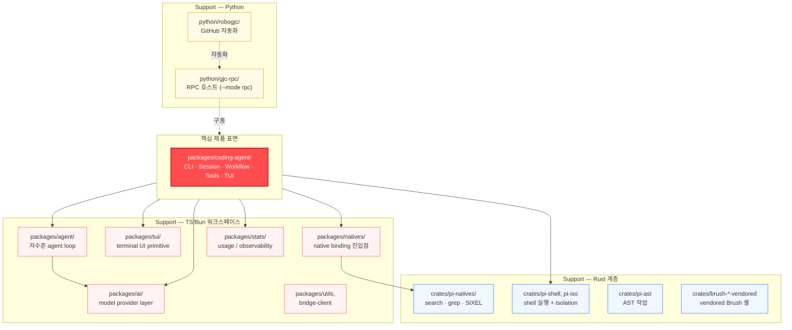

**설계 원칙:** support domain은 CLI core 밖에 둔다. 각 package는 서로 다른 ownership boundary를 갖는다.

---

## 2. CLI 명령 라우팅

> **연관 문서:** [4.1 CLI 진입점](./GAJAE-CODE-ANALYSIS.md#41-cli-진입점)
> **코드:** `packages/coding-agent/src/cli.ts:188-218`

첫 인자가 subcommand인지 판별하고, 아니면 전체를 `launch` 인자로 취급하는 fast path 로직.

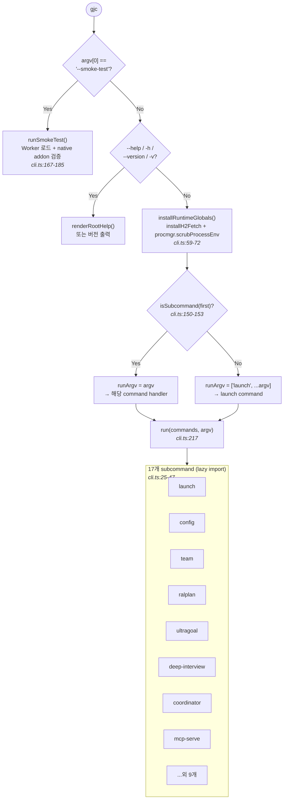

---

## 3. Session Assembly 7단계

> **연관 문서:** [4.2 Session Assembly](./GAJAE-CODE-ANALYSIS.md#42-session-assembly)
> **코드:** `packages/coding-agent/src/sdk.ts:827-2058`, `main.ts:715-1036`

`createAgentSession()`이 수행하는 7단계 조립 흐름. `main.ts`가 먼저 auth/modelRegistry/settings를 생성해서 주입하는 점(단계 1의 fallback 성격)을 함께 표현.

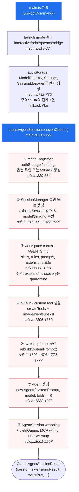

> 주의: **ACP 예외:** interactive/print/rpc/bridge는 단일 `AgentSession`을 공유하지만, **ACP는 클라이언트 세션마다 `createAcpSessionFactory`로 새 AgentSession을 생성**한다 (`main.ts:262-293`).

---

## 4. Agent vs AgentSession 책임 분리

> **연관 문서:** [4.2 Agent vs AgentSession 분리](./GAJAE-CODE-ANALYSIS.md#42-session-assembly)
> **코드:** `packages/agent/src/agent.ts:259`, `packages/coding-agent/src/session/agent-session.ts:863`

저수준 model/tool loop(`Agent`)과 그 위의 제품 동작(`AgentSession`)의 책임 분리.

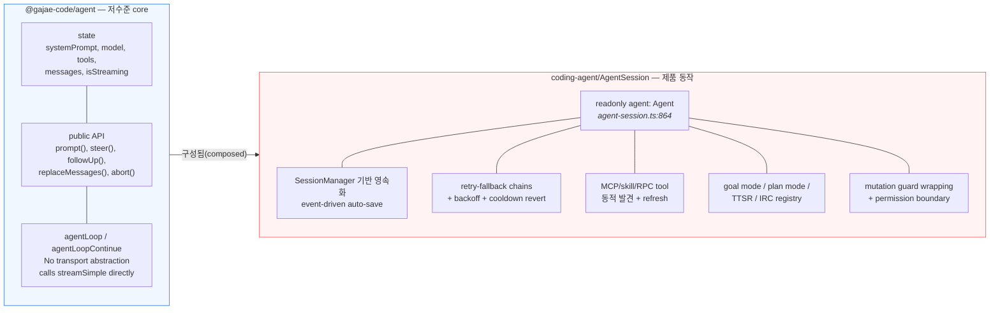

**핵심:** `Agent`는 순수 stateful core. `AgentSession`은 그 위에 persistence, compaction, retry, MCP discovery 등 ~80개 private 필드를 추가.

---

## 5. Workflow 4종과 Verification Gate

> **연관 문서:** [4.3 Workflow State Runtime](./GAJAE-CODE-ANALYSIS.md#43-workflow-state-runtime)
> **코드:** `state-schema.ts:17` (`CANONICAL_GJC_WORKFLOW_SKILLS`), `defaults/gjc/skills/*/SKILL.md`

4개 workflow가 각자 진짜 verification gate를 가지는 구조. schema에 hard-coded된 single source of truth.

```mermaid
flowchart TD
    USER([사용자 요청]) --> DI{{"deep-interview<br/>명확화"}}
    DI -->|"ambiguity ≤ threshold<br/>+ 사용자 명시 승인<br/><i>SKILL.md:52</i>"| GATE_DI{"ambiguity gate<br/>통과?"}
    GATE_DI -->|No| DI
    GATE_DI -->|Yes| RP{{"ralplan<br/>계획 + 비판"}}
    RP --> LOOP["Planner → Architect → Critic 루프<br/>최대 5회 반복 cap<br/><i>SKILL.md:75</i>"]
    LOOP --> GATE_RP{"Critic APPROVE?"}
    GATE_RP -->|No| LOOP
    GATE_RP -->|Yes| UG{{"ultragoal<br/>실행 추적"}}
    UG --> LEDGER["goal · revision · evidence<br/>.gjc/ultragoal/ledger.jsonl<br/>G001/G002 quality gate"]
    LEDGER --> GATE_UG{"--quality-gate-json<br/>통과?"}
    GATE_UG -->|No| REV["revision"]
    REV --> UG
    GATE_UG -->|Yes| DONE([완료])

    UG -.병렬 가치 판단.-> TEAM{{"team (optional)<br/>tmux coordination"}}
    TEAM --> HARDERR{"gjc team<br/>사용 가능?"}
    HARDERR -->|No| STOP([hard error<br/><i>SKILL.md:35</i>"])
    HARDERR -->|Yes| WORKERS["tmux-backed workers<br/>owner-scoped goals"]

    classDef gate fill:#fffbe6,stroke:#d4a017,stroke-width:2px
    classDef wf fill:#fff3f3,stroke:#ff4d4f,stroke-width:2px
    class GATE_DI,GATE_RP,GATE_UG,HARDERR gate
    class DI,RP,UG,TEAM wf
```

> **설계 의도:** workflow는 prompt가 아니라 runtime gate를 갖는다. LLM이 "그냥 수정할게"라고 해도 `assertDeepInterviewMutationAllowed`가 tool wrapper 단에서 차단한다 (`agent-session.ts:228, 3680`).

---

## 6. Workflow State 라이프사이클 (`.gjc/`)

> **연관 문서:** [4.3 Workflow State Runtime](./GAJAE-CODE-ANALYSIS.md#43-workflow-state-runtime), [특성 2. Durable State](./GAJAE-CODE-ANALYSIS.md#특성-2-workflow-state를-transcript-밖에-두기-durable-state-separation)
> **코드:** `gjc-runtime/state-writer.ts`, `state-runtime.ts`

`.gjc/` 디렉토리 layout과 각 파일의 역할. activation record → workflow envelope → ledger로 이어지는 상태 기록 흐름.

```mermaid
flowchart TD
    ACTIVATE["skill activation<br/>(keyword / command)"] --> WRITE_AE["writeActiveEntry()<br/><i>state-writer.ts:745</i>"]
    WRITE_AE --> AE_FILE[(".gjc/state/active/&lt;skill&gt;.json<br/>SkillActiveEntry<br/>{skill, phase, active,<br/>activated_at, session_id,<br/>handoff_from/to, receipt}<br/><i>state-schema.ts:117-150</i>"])]

    WRITE_AE --> WRITE_SNAP["writeActiveEntries + snapshot<br/><i>state-writer.ts:814</i>"]
    WRITE_SNAP --> SNAP_FILE[(".gjc/state/skill-active-state.json<br/>← derived cache<br/>(entries에서 재건됨)")]

    AE_FILE --> ENVELOPE["writeWorkflowEnvelopeAtomic()<br/><i>state-writer.ts:450</i>"]
    ENVELOPE --> ENV_FILE[(".gjc/state/&lt;mode&gt;-state.json<br/>RequiredOnWriteEnvelopeSchema<br/>{content_sha256 필수}")]

    ENVELOPE --> SKILL_SPECIFIC{"어느 workflow?"}
    SKILL_SPECIFIC -->|deep-interview| DI_SPEC[(".gjc/specs/deep-interview-{slug}.md")]
    SKILL_SPECIFIC -->|ralplan| RP_SPEC[(".gjc/plans/ralplan/&lt;run-id&gt;/")]
    SKILL_SPECIFIC -->|ultragoal| UG_SPEC[(".gjc/ultragoal/<br/>brief.md · goals.json<br/>ledger.jsonl")]

    subgraph READERS["누가 읽는가? (3가지 이점)"]
        R1["사람 — JSON/MD 에디터"]
        R2["Hook — gate 검사"]
        R3["UI HUD — buildRalplanHudSummary"]
        R4["이후 세션 — context 압축과 무관"]
    end

    AE_FILE --> READERS
    ENV_FILE --> READERS
    UG_SPEC --> READERS

    AUDIT[(".gjc/state/audit.jsonl<br/>append-only audit log<br/><i>state-writer.ts:951</i>")]
    TXN[(".gjc/state/transactions/&lt;mutation-id&gt;<br/>recovery evidence only")]
    AE_FILE -.감사.-> AUDIT
    ENVELOPE -.저널.-> TXN
```

> **Reconciliation:** `inspectActiveScope` doctor pass가 snapshot과 entries 간 정합성을 검사한다 (`state-runtime.ts:528-577`).

---

## 7. Atomic Write + Dual Schema Contract

> **연관 문서:** [4.3 Atomic write](./GAJAE-CODE-ANALYSIS.md#43-workflow-state-runtime), [특성 3. Dual Schema](./GAJAE-CODE-ANALYSIS.md#특성-3-atomic-write와-dual-schema-contract-lenient-read--strict-write)
> **코드:** `state-writer.ts:375-386`, `state-schema.ts`

crash safety와 forward compatibility를 동시에 달성하는 이중 방어.

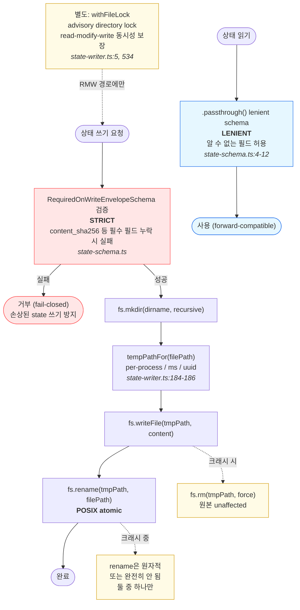

> 주의: 모듈 주석은 "No lockfiles are used"라고 하지만, 실제로는 crash-atomicity(rename)와 concurrency-atomicity(lock)을 구분한 것이다.

---

## 8. Tool Registry 통합 모델

> **연관 문서:** [4.4 Tool Registry](./GAJAE-CODE-ANALYSIS.md#44-tool-registry와-bash-executor), [특성 4. Tool as Capability](./GAJAE-CODE-ANALYSIS.md#특성-4-tool을-capability로-취급-execution-boundary)
> **코드:** `packages/agent/src/types.ts:411-454`, `agent-session.ts:984, 3949-4077`

서로 다른 출처의 tool이 단일 `Map<string, AgentTool>`로 수렴하는 구조. permission은 tool 내부가 아니라 session-level wrapper에.

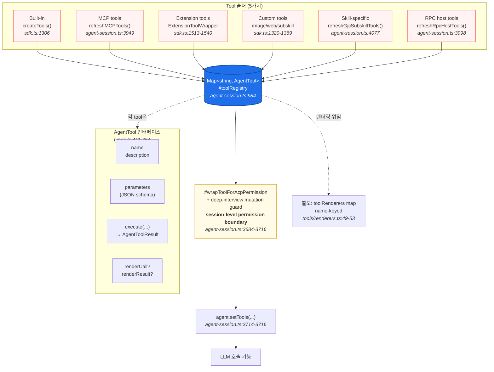

> **핵심 설계:** permission은 tool 내부가 아니라 **바깥 wrapper**에 있다. tool 자체가 권한을 결정하면 우회 가능하므로, 권한은 바깥 층, 실행은 tool 안에서.

---

## 9. Bash Tool 실행 흐름과 8개 Lifecycle 차원

> **연관 문서:** [4.4 Bash lifecycle](./GAJAE-CODE-ANALYSIS.md#44-tool-registry와-bash-executor)
> **코드:** `tools/bash.ts`, `exec/bash-executor.ts:16-380`

대표적 tool인 bash의 실행 경로. 동기/비동기 분기와 8개 lifecycle 차원을 함께 표현.

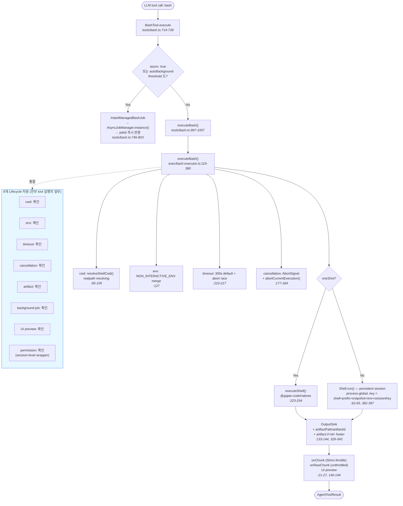

---

## 10. Subagent = Owned Task (Lifecycle Metadata)

> **연관 문서:** [4.5 Subagent = owned task](./GAJAE-CODE-ANALYSIS.md#45-multi-agent--async-job-system), [특성 5. Owned Task](./GAJAE-CODE-ANALYSIS.md#특성-5-subagent를-owned-task로-lifecycle-ownership)
> **코드:** `task/index.ts:650-807`, `task/executor.ts`, `async/job-manager.ts`

이것이 Gajae-Code의 **가장 차별적인 설계**. subagent가 떠다니는 model call이 아니라, lifecycle metadata를 가진 소유된 작업이라는 점을 시각화.

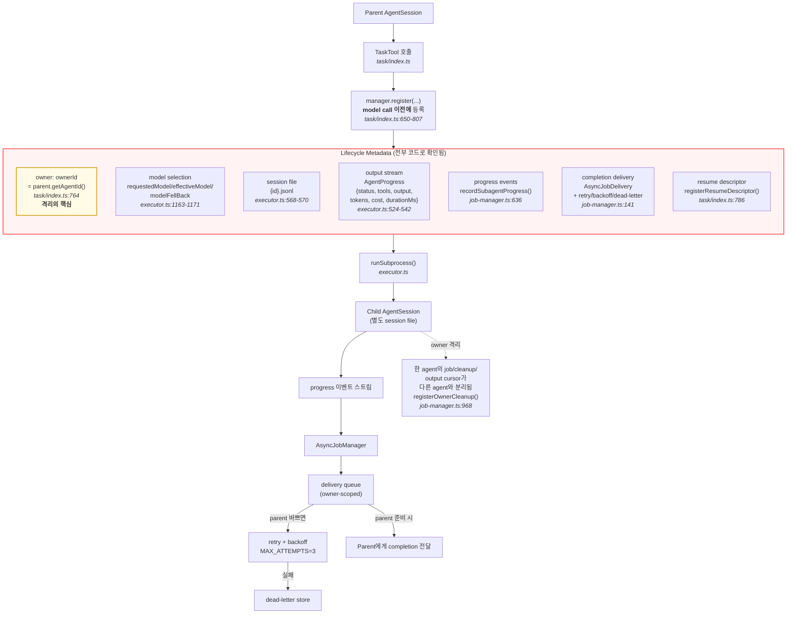

> **가장 강력한 증거:** subagent를 launch하는 모든 경로는 model call 전에 `manager.register(...)`를 거친다. "bare model call로 subagent를 launch하는 코드 경로는 존재하지 않는다."

---

## 11. AsyncJobManager 상태머신

> **연관 문서:** [4.5 AsyncJobManager 기능](./GAJAE-CODE-ANALYSIS.md#45-multi-agent--async-job-system), [특성 6. Cooperative Cancellation](./GAJAE-CODE-ANALYSIS.md#특성-6-cooperative-cancellation과-safe-boundary)
> **코드:** `async/job-manager.ts:76` (`SubagentLifecycle`), `:396-496`

`SubagentLifecycle = running | paused | queued | completed | failed | cancelled` 상태와 transition. cooperative safe-boundary pause가 핵심.

```mermaid
stateDiagram-v2
    [*] --> queued: register()
    queued --> running: resumeSubagent()<br/>(FIFO #resumeQueue에서 drain)

    running --> completed: outcome.kind=completed<br/><i>:443-449</i>
    running --> failed: error 발생<br/><i>:462-467</i>
    running --> paused: requestPause()<br/><b>cooperative safe-boundary</b><br/>(in-flight tool은 완료)<br/><i>:431-435</i>
    running --> cancelled: cancel() during run<br/><i>:496</i>

    paused --> running: resumeSubagent()<br/>sessionFile에서 재개<br/><i>:726-759</i>
    paused --> cancelled: cancel() while paused<br/><i>:486-491</i>

    queued --> cancelled: cancel() while queued<br/><i>:792-819</i>

    completed --> [*]
    failed --> [*]
    cancelled --> [*]

    note right of running
        result validation:
        buildOutputValidator()로
        JSON-Schema 검증
        schema_violation 시 exitCode 1
        <i>executor.ts:189-207</i>
    end note

    note right of paused
        Pause ≠ Cancel:
        Pause = safe boundary,
        tool은 완료 후 정지,
        재개 가능
        <i>job-manager.ts:83-88</i>
    end note
```

> **설계 철학:** "정지"는 두 가지로 나뉜다 — **Pause**(safe boundary, 협력적, 재개 가능) vs **Cancel**(최후 수단). Go의 `context.Cancel()`이나 Rust의 `CancellationToken`과 같은 structured concurrency 철학.

---

## 12. Coordinator MCP: File-based Control Surface

> **연관 문서:** [4.5 Coordinator MCP](./GAJAE-CODE-ANALYSIS.md#45-multi-agent--async-job-system), [특성 7. File-based Coordinator](./GAJAE-CODE-ANALYSIS.md#특성-7-coordinator는-scrollback이-아니라-filestate-기반)
> **코드:** `coordinator-mcp/server.ts`, `harness-control-plane/session-lease.ts`

tmux scrollback 파싱(가장 흔한 안티패턴) 대신, file/state를 진실의 원천로 두는 구조.

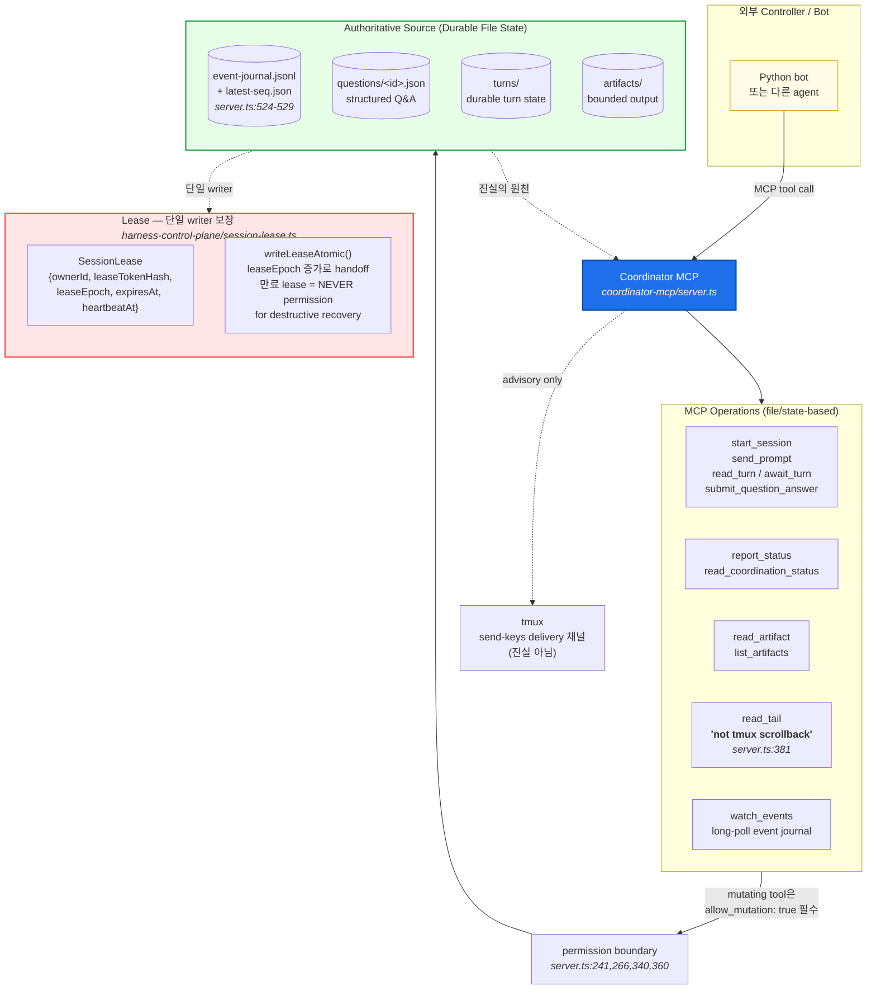

> **핵심 설계:** tmux는 `send-keys` delivery 채널일 뿐, **진실의 원천은 durable file state**다. "Read authoritative durable turn state plus bounded advisory tmux status" (`server.ts:302`).

---

## 13. Model Provider Runtime Registry

> **연관 문서:** [4.6 Model Provider 분리](./GAJAE-CODE-ANALYSIS.md#46-model-provider-분리), [특성 8. Runtime Registry](./GAJAE-CODE-ANALYSIS.md#특성-8-provider를-runtime-registry로-dependency-inversion)
> **코드:** `packages/ai/src/`, `config/model-registry.ts:964`, `session/agent-session.ts:5750-5826`

provider-neutral API 뒤에 ~47개 adapter가 있고, `ModelRegistry`가 mutable runtime 객체로 model 선택을 policy로 다루는 구조.

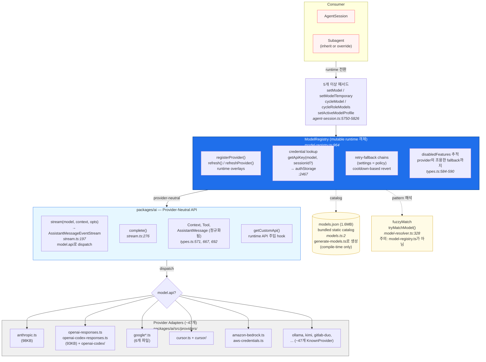

> **핵심 주장:** "model selection은 hard dependency가 아니라 runtime policy다." — `ModelRegistry`는 mutable, 5개 이상의 runtime 전환 메서드, retry-fallback이 settings(정책)로 구성.

---

## 14. 핵심 철학: Advisory vs Authoritative

> **연관 문서:** [Part 6. 8가지 특성의 공통 철학](./GAJAE-CODE-ANALYSIS.md#8가지-특성의-공통-철학)

8가지 설계 특성이 수렴하는 하나의 철학: **"AI agent를 채팅이 아니라 auditable runtime으로 취급하라"**.

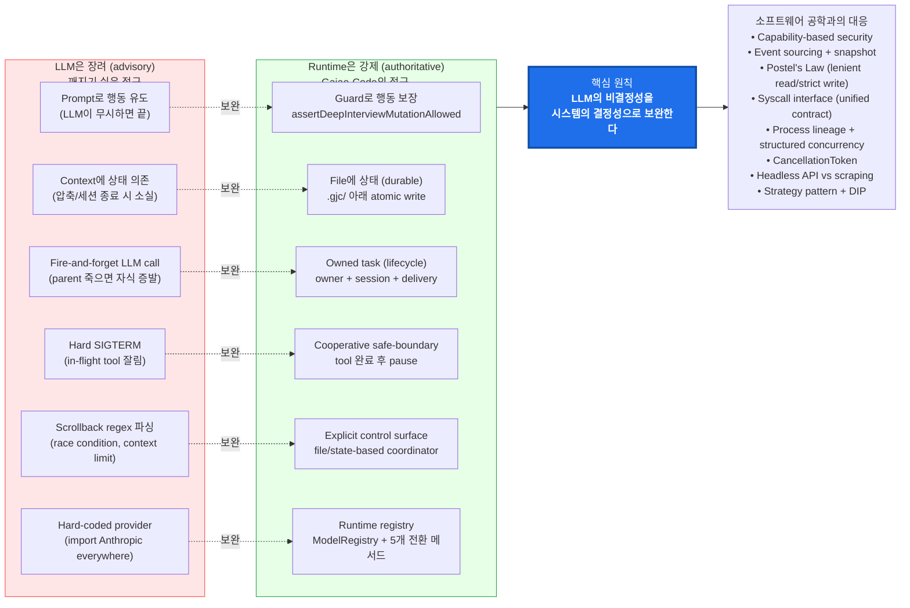

> **결론:** Gajae-Code가 발명한 것은 별로 없다. **오래 검증된 소프트웨어 공학 원칙들을 AI agent라는 새 영역에 충실하게 적용한 것**이 핵심 가치다.

---

## 렌더링 참고

- **GitHub:** mermaid 블록이 자동 렌더링됨
- **VS Code:** [Markdown Preview Mermaid Support](https://marketplace.visualstudio.com/items?itemName=bierner.markdown-mermaid) 확장 필요
- **CLI:** `npx @mermaid-js/mermaid-cli`로 PNG/SVG export 가능

각 다이어그램의 `> 연관 문서:` 인용은 [`GAJAE-CODE-ANALYSIS.md`](./GAJAE-CODE-ANALYSIS.md)의 해당 섹션 앵커로 연결된다.

---

*본 도식집은 2026-06-18 기준 Gajae-Code 소스 코드를 직접 대조하여 작성됐다.*
