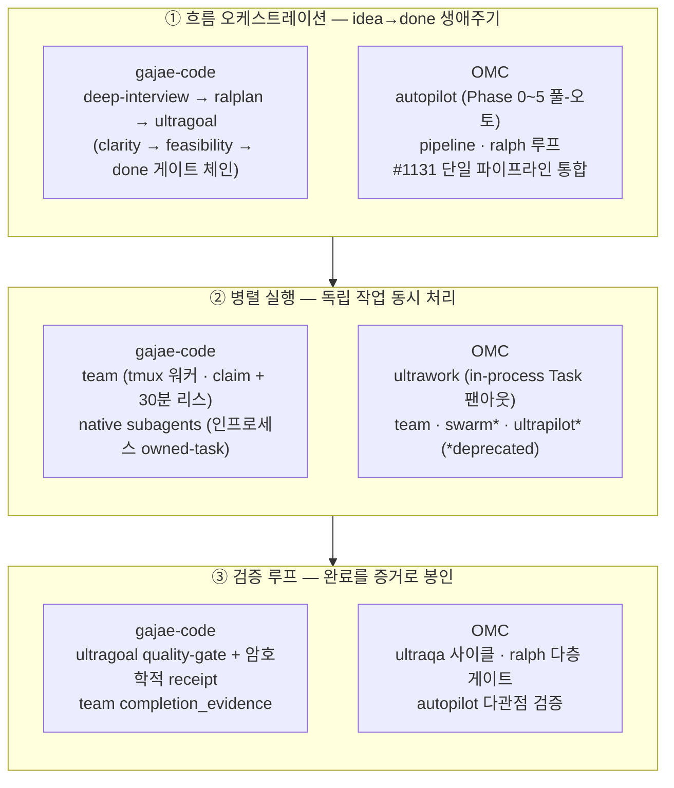
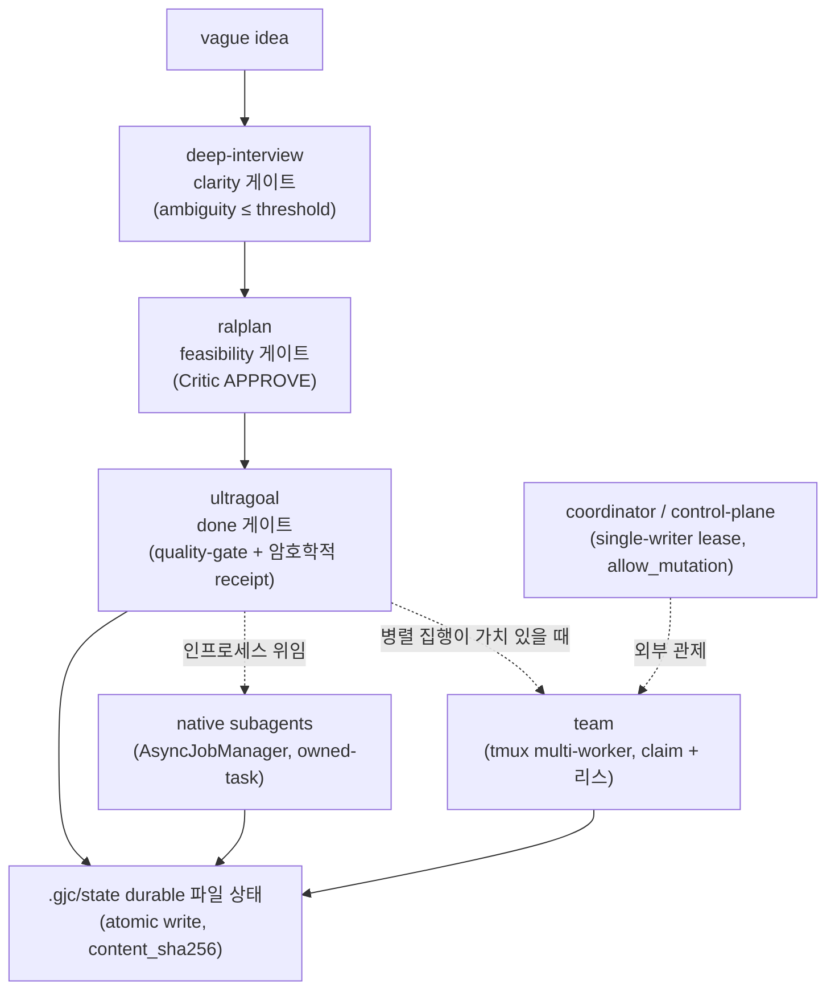
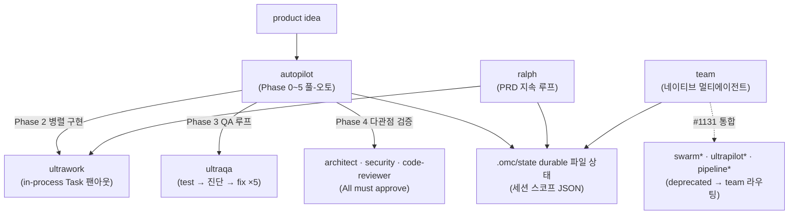

# 오케스트레이션 모드 설계 의도 비교 — Gajae-Code vs OMC

> **함께 보기:** Gajae-Code 단독 분석은 [`GAJAE-CODE-ANALYSIS.md`](./GAJAE-CODE-ANALYSIS.md), harness 관점 해부는 [`AI_AGENT_HARNESS_VIEW.md`](./AI_AGENT_HARNESS_VIEW.md)에 정리돼 있다.

> 이 문서는 두 AI agent harness의 **실행 오케스트레이션(execution orchestration)** 표면을 같은 축 위에 세워 설계 의도를 대조한다.
> - **Gajae-Code**(`gjc`) — `part7_opensource/gajae-code/`의 workflow-first coding-agent runner.
> - **OMC**(`oh-my-claudecode`) — Claude Code 위에서 도는 멀티에이전트 오케스트레이션 플러그인.
>
> 각 모드/메커니즘은 11개 공유 축(자율성·병렬성·조율 매개·상태 모델·검증 게이트·생명주기 소유·중단 의미론 등)으로 1차 소스에서 추출했고, 하중이 큰 주장은 `file:line`으로 직접 검증했다. 검증되지 않았거나 출처가 모순되는 항목은 [Part 7](#part-7-비교의-한계와-주의사항)에 명시한다. 표기는 `gjc` / `OMC`로 통일한다.

---

## 목차

- [Part 1. 비교 대상과 이름의 함정](#part-1-비교-대상과-이름의-함정)
- [Part 2. 3계층 매핑 — 두 시스템을 같은 자리에 세우기](#part-2-3계층-매핑--두-시스템을-같은-자리에-세우기)
- [Part 3. 모드·메커니즘 카탈로그](#part-3-모드메커니즘-카탈로그)
  - [3.1 Gajae-Code 오케스트레이션 토폴로지](#31-gajae-code-오케스트레이션-토폴로지)
  - [3.2 OMC 오케스트레이션 토폴로지](#32-omc-오케스트레이션-토폴로지)
- [Part 4. 축별 대조](#part-4-축별-대조)
- [Part 5. 설계 철학의 분기점](#part-5-설계-철학의-분기점)
- [Part 6. 공유 설계 DNA](#part-6-공유-설계-dna)
- [Part 7. 비교의 한계와 주의사항](#part-7-비교의-한계와-주의사항)
- [부록. 근거 파일 경로](#부록-근거-파일-경로)

---

## Part 1. 비교 대상과 이름의 함정

두 시스템을 나란히 놓기 전에, **이름이 겹치거나 어긋나는 지점**을 먼저 정리한다. 이것을 모르면 같은 단어를 다른 것으로 착각하기 쉽다.

| 이름 | gjc | OMC | 비고 |
|---|---|---|---|
| `team` | ✅ 워크플로(tmux 멀티워커) | ✅ 모드(네이티브 멀티에이전트) | **양쪽에 있으나 claim 안전성 메커니즘이 다름**(Part 7 참조) |
| `autopilot` | ✗ | ✅ 풀-오토 모드 | OMC 전용 |
| `ultrawork` | ✗ (커맨드 export가 `null`로 비활성) | ✅ 병렬 엔진 | gjc `package.json`에 `"./commands/ultrawork": null` |
| `ralph` / `ralplan` | `ralplan`만(계획 게이트) | `ralph`(지속 루프) + `ralplan`(합의 게이트) | 이름은 비슷하나 역할이 다름 |
| `deep-interview` | ✅ 워크플로 | ✅ 스킬 | 양쪽 모두 "모호함 해소" 게이트 |
| `swarm`/`ultrapilot`/`pipeline` | ✗ | ⚠️ deprecated(→ `team`으로 라우팅) | `#1131 pipeline unification` |

**핵심 비대칭 하나:** gjc의 "오케스트레이션"은 사용자가 고르는 *모드 메뉴*가 아니라, 의도적으로 작게 유지된 **메커니즘 계층**이다. 사용자가 노출받는 워크플로는 `deep-interview / ralplan / ultragoal / team` 4개로 제한돼 있고(REBRANDING_PLAN 원칙 #6 "Visible workflow minimization"), 그 아래에 native subagent와 control-plane이 깔린다. 반면 OMC는 `autopilot / ultrawork / team / ralph / ultraqa`(+ deprecated 3종)라는 **여러 개의 이름 붙은 모드**를 제공하고, 최근에는 이들을 단일 파이프라인으로 통합하는 방향으로 진화 중이다.

그래서 비교의 단위는 "모드 대 모드"가 아니라 **기능 계층 대 기능 계층**이어야 한다. 그것이 Part 2의 3계층 매핑이다.

---

## Part 2. 3계층 매핑 — 두 시스템을 같은 자리에 세우기

실행 오케스트레이션은 결국 세 가지 질문에 답하는 일이다: **(1) idea→done 전체 흐름을 누가 통제하는가, (2) 독립 작업을 어떻게 병렬화하는가, (3) "끝났다"를 어떻게 증명하는가.** 두 시스템의 구성요소를 이 세 계층에 매핑하면 다음과 같다.



| 계층 | gajae-code | OMC | 대조 코멘트 |
|---|---|---|---|
| **① 흐름** | `deep-interview→ralplan→ultragoal` 게이트 체인. 입구(요구사항 명확성)와 출구(완료 증거)에 강한 게이트, 중간 실행만 자율 | `autopilot` 6단계 풀-오토. 기본 무인으로 흐르되 모호·실패 시에만 사람에게 회귀 | **게이트 체인(분해형)** vs **풀-오토 우선(통합형)** |
| **② 병렬** | `team`(실재 tmux CLI 워커) + `native subagents`(추적 가능 인프로세스 owned-task) | `ultrawork`(in-process Task 팬아웃)가 주력, 프로세스 병렬은 `team`이 선택 제공 | **프로세스 가시성 + 추적 인프로세스** vs **in-process 팬아웃 기본** |
| **③ 검증** | `ultragoal` strict quality-gate + 암호학적 receipt, `team` completion_evidence | `ultraqa` 폐루프, `ralph` 다층 게이트, `autopilot` 다관점 검증 | 둘 다 "산문으로 완료를 신뢰하지 않음"(공유 DNA). 강제 메커니즘의 *결*이 다름 |

두 시스템 모두 **"단계 순차 + 단계 내 병렬"** 하이브리드를 채택한다는 점은 같다. 갈리는 것은 *진입 철학*(언제 자율, 언제 사람)과 *강제 매개*(코드 게이트인가 프롬프트 규율인가)다.

---

## Part 3. 모드·메커니즘 카탈로그

각 구성요소의 한 줄 정의와 설계 의도를 정리한다. (deprecated는 ⚠️)

### Gajae-Code — 4개 메커니즘 계층

| 메커니즘 | 한 줄 정의 | 핵심 설계 의도 |
|---|---|---|
| **workflow-gate-chain** | vague idea를 `clarity → feasibility → done` 세 직교 게이트로 봉쇄적으로 통과시키는 흐름 오케스트레이션 | "어려운 건 무엇을 만들지 아는 것" — idea→done을 한 번에 자율 실행하지 않고, 각 게이트가 다음 진입을 막는다 |
| **team (tmux multi-worker)** | tmux 리더 창을 분할해 실재 GJC 워커 CLI 세션을 띄우고 `.gjc/state/team/` 파일로 조율 | "스크롤백이 아니라 파일 상태로 조율" + "증거 없이는 complete 없음" |
| **native subagents** | 서브에이전트를 owner·세션파일·전달큐를 가진 추적 가능한 *owned task*로 만듦 | "서브에이전트는 bare model call이 아니라 추적 가능한 owned task다" |
| **coordinator / control-plane** | 외부 컨트롤러가 살아있는 tmux 세션을 화면 긁기 없이 관제하는 제어 평면 | "scrollback은 거짓말한다, 파일 상태는 정직하다" + single-writer lease |

### OMC — 8개 모드

| 모드 | 한 줄 정의 | 핵심 설계 의도 |
|---|---|---|
| **autopilot** | 2~3줄 아이디어 → 요구분석·설계·계획·병렬구현·QA·다관점검증 6단계를 무인 실행 | 비자명 작업의 조율된 단계들을 자동 오케스트레이션해 "말하면 동작 코드를 받게" |
| **ultrawork** | 독립 작업을 전면 동시 팬아웃하는 순수 병렬 엔진 | "독립 작업의 순차 실행은 시간 낭비" — 영속성·검증은 일부러 배제한 합성 가능 컴포넌트 |
| **team** | lead 1명이 공유 태스크 리스트 위에서 N 전문 teammate를 단계 파이프라인으로 조율 | 레거시 swarm을 대체해 Claude Code 네이티브 인프라 위에서 외부 의존 없이 조율 |
| **ralph** | `prd.json`의 모든 스토리가 `passes:true` + 리뷰어 검증될 때까지 멈추지 않는 지속 루프 | "silent failure 방지" — 부분 구현이 'done'으로 선언되는 것을 다층 게이트로 차단 |
| **ultraqa** | 목표 충족까지 `QA 실행 → architect 진단 → executor 수정`을 최대 5사이클 반복 | "테스트→검증→수정→반복" 폐루프를 모드로 박제, 단계별 적합 모델 라우팅 |
| **swarm** ⚠️ | SQLite 공유 풀에서 워커가 태스크를 원자적 claim하는 자기조직화 병렬 | "중앙 조정자 없는 자기조직화 병렬성"(개미군집). #1131로 team에 흡수 |
| **ultrapilot** ⚠️ | autopilot 파이프라인을 파일 소유권 기반으로 병렬화 | "autopilot의 자율성 + 병렬성". 현재 `execution:"team"` 별칭 |
| **pipeline** ⚠️ | 전문 에이전트를 순서대로 사슬로 엮어 출력→입력 릴레이 | "병렬 카오스가 아니라 순차 조율"(Unix 파이프식). autopilot 파이프라인으로 통합 |

#### 3.1 Gajae-Code 오케스트레이션 토폴로지



#### 3.2 OMC 오케스트레이션 토폴로지



---

## Part 4. 축별 대조

11개 추출 축을 7개 비교축으로 묶어 대조한다.

### 4.1 자율성 — 휴먼인루프가 어디에 있는가

| | gajae-code | OMC |
|---|---|---|
| 기본값 | **비대칭** — 입구·출구는 강하게, 중간 실행은 자율 | **기본 무인**, 예외적 인루프 |
| 입구 | deep-interview 라운드별 ask 1문항 + Phase5 4지선다 승인(`approval-required`) | autopilot은 강제 승인 게이트 없음, 모호 시 deep-interview 리다이렉트 *제안* |
| 실행 중 | ultragoal은 `ask` 도구 전면 차단(hands-off), 미결정은 durable 기록 | ultrawork는 막혔을 때만 질문, 완료 책임은 사용자 |
| 출구 | 완료는 Stop hook이 **코드로 검증**(미증명 시 `decision:block`) | 검증 게이트(verifier/리뷰어)가 승인 게이트 자리를 대체 |

> **대조:** 둘 다 "검증 게이트가 승인 게이트를 대체한다"는 점은 같다(ralph·ultragoal). 차이는 gjc가 자율성을 **국면별로 명시 분할**(입구 강·중간 자율·출구 강)하고 그 분할을 frontmatter 정책과 `ask`-도구-차단으로 박는 반면, OMC는 "기본 무인, 예외 인루프"를 원칙으로 하고 예외를 opt-in 설정(`pauseAfterPlanning` 기본 false)이나 모드 선택으로 처리한다. gjc coordinator의 `allow_mutation` 이중 명시 승인은 OMC에 직접 대응물이 없다.

### 4.2 병렬성 모델 — 가장 뚜렷한 분기축

| | gajae-code | OMC |
|---|---|---|
| 주력 substrate | **실재 프로세스**(tmux CLI 워커) + **추적 인프로세스**(AsyncJob) 둘 다 1급 | **in-process Task 팬아웃**(ultrawork)이 기본 |
| 명시적 입장 | "`in-process spawn fanout`으로 대체하지 말라"(team SKILL) | "Fire all independent agent calls simultaneously"(ultrawork) |
| claim 안전성 | `writeJsonFileNoClobber` 원자적 파일 생성 | swarm은 SQLite IMMEDIATE 트랜잭션(단 deprecated) |
| 워커 수 | 기본 3, 최대 20 | team N=1~20, swarm 2~10 |

> **대조:** gjc는 "프로세스 가시성"(눈에 보이는 독립 tmux CLI 세션)과 "추적 가능한 인프로세스 owned-task"를 **명확히 분리해 둘 다 핵심 메커니즘**으로 제공한다. OMC는 in-process 팬아웃을 기본으로 두고 프로세스 병렬은 team으로 선택 제공한다. 두 시스템의 `team`이 같은 이름이지만, claim 안전성 메커니즘이 근본적으로 다르다는 점에 주의해야 한다(Part 7).

### 4.3 조율 매개 — 공유 DNA가 가장 강한 축

| | gajae-code | OMC |
|---|---|---|
| 진실의 원천 | `.gjc/` durable JSON/JSONL **전 모드 일관** | 모드별 혼합(.omc/state JSON · ~/.claude/tasks · SQLite · 인메모리) |
| tmux 위상 | 전달 채널·가시성 표면일 뿐, 권위 없음 | (team) 동일 — ~/.claude/tasks JSON이 권위 |
| 무결성 | append-only 저널 + `content_sha256` tamper-evidence + atomic temp+rename | MCP `state_read/write/clear`, 모드별 상이 |

> **대조:** "scrollback은 권위가 아니다, 파일 상태가 진실"이라는 핵심 철학을 **둘 다 공유**한다(gjc "scrollback은 거짓말한다", OMC team의 JSON 태스크). 분기점은 gjc가 이를 *모든* 모드에 일관 적용하고 무결성 메커니즘을 표준화한 반면, OMC는 모드마다 substrate가 다르고 swarm의 SQLite는 #1131에서 네이티브 JSON으로 흡수되며 deprecated됐다는 점이다. gjc의 single-writer lease(epoch/heartbeat/pid)는 OMC에 대응물이 약하다.

### 4.4 상태 모델과 resume

| | gajae-code | OMC |
|---|---|---|
| 거주지 | 전부 durable 파일, atomic write, lenient-read/fail-closed-write | durable 파일(세션 스코프 `.omc/state/sessions/{id}/`) |
| 완료 증명 | `status` 단독 증명 **불가** — 암호학적 receipt(`qualityGateHash`+`planGeneration`), 집합 변경 시 staleness 무효화 | "fresh test/build output"으로 증거 확인, 리뷰어 sign-off |
| resume | **거의 보편적** — native subagents·team·coordinator·게이트 체인 모두 재개 | **모드별 분기** — autopilot=Yes, team=Yes(handoff), 그 외(ralph/ultrawork/ultraqa/swarm/…)=No |

> **대조:** "transcript 밖 durable 파일에 상태가 산다 + 세션 스코프 격리"는 공유 DNA다. 분기점은 gjc가 resume를 거의 보편 보장하고 완료를 암호학적 receipt로 봉인하는 데 반해, OMC는 resume 가능성이 모드별로 갈리고(`cancel`의 *What Gets Preserved* 표) ralph조차 취소 시 상태 미보존이라 "취소=hard stop"에 가깝다는 점이다.

### 4.5 검증 게이트 — 강제의 *결*이 갈리는 축

| | gajae-code | OMC |
|---|---|---|
| 강제 형태 | **코드 불변식**(throw / `decision:block` / 정규식 BLOCK) | **다층 게이트 + 루프 상한 + 프롬프트 규율** |
| 대표 예 | `validateCompletionQualityGate` strict 키 화이트리스트(추가 키 throw), `completion_evidence_no_verified_item` throw | `maxQaCycles:5`, `maxValidationRounds:3`, Final_Checklist "fresh output", polite-stop anti-pattern 금지 |
| 우회 | 검증 우회 프롬프트(`mark...complete`)를 UserPromptSubmit hook이 BLOCK | `skipQa`/`skipValidation`로 우회 가능(기본 false) |

```ts
// gajae-code — ultragoal-runtime.ts:1927 (정확한 키만 허용, 위반 시 throw)
const allowedKeys = new Set(["architectReview", "executorQa", "iteration"]);
// :1936 throw new Error("qualityGate requires architectReview, executorQa, and iteration objects");
// :376 qualityGateHash: hashStructuredValue(input.qualityGateJson)  ← 암호학적 완료 receipt
```

```ts
// gajae-code — team-runtime.ts:1537 (검증된 항목 없으면 완료 거부)
throw new Error(`completion_evidence_no_verified_item:${taskId}`);
```

> **대조:** "증거 기반 완료, 동일 실패 반복 시 조기 중단"은 공유 DNA다(OMC "같은 에러 3회", gjc 반복 블로커 에스컬레이션). 차이는 강제의 *결*이다 — gjc는 핵심 보장을 "비협조 모델도 못 뚫는 코드 게이트"로 박고, OMC는 상당 부분을 설정값+프롬프트 규율로 둔다. **단, 이 이분법은 과장 위험이 있다**(Part 7 참조): gjc의 "ralplan 최대 5회"조차 `parseStageN`이 1..999만 검사하는 프롬프트 규율이다. 두 시스템 모두 코드 게이트와 프롬프트 규율을 *혼용*하며, 차이는 정도이지 종류가 아닐 수 있다.

### 4.6 생명주기 소유

| | gajae-code | OMC |
|---|---|---|
| 원칙 | **예외 없는 owned-task**(전 모드) | 모드별 공존(owned-task + fire-and-forget) |
| 소유 귀속 | 모든 launch가 `manager.register(ownerId)` 통과, cross-agent 취소 차단 | autopilot/ralph/team은 owned-task + dependency-aware cascade |
| 의도적 예외 | 없음 | ultrawork는 best-effort(완료 책임 사용자), swarm 워커는 fire-and-forget |

> **대조:** 핵심 모드가 owned-task lifecycle + owner 기반 cleanup/cascade를 채택하는 것은 공유 DNA다. 분기점은 gjc가 owned-task를 *보편 원칙*으로 삼고 `ownerId` 필터·epoch 검증 같은 정밀 경계를 두는 반면, OMC는 "병렬성만 담당하는 무상태 컴포넌트(ultrawork)"를 의도적으로 owned-task 밖에 둔다는 점이다 — 합성 가능한 단일 책임 컴포넌트 철학.

### 4.7 중단 의미론

| | gajae-code | OMC |
|---|---|---|
| 1차 | cooperative pause(in-flight 도구 절대 abort 안 함) | 대체로 cooperative + resume 또는 폐기 |
| 역방향 강제 | 검증 안 된 완료/우회를 `decision:block`으로 **못 멈추게** 함(loop-until-done) | polite-stop anti-pattern 금지(프롬프트 규율) |
| hard kill | abortController(세션파일은 보존) | team은 명시적 SIGTERM→SIGKILL 폴백 |

```ts
// gajae-code — async/job-manager.ts:84 (강제 kill이 아닌 협력적 경계)
/** Request a cooperative safe-boundary pause (never aborts the in-flight tool). */
requestPause(): void;
```

> **대조:** "in-flight 도구를 강제 abort하지 않는 협력적 중단을 1차로"는 공유 지향이다(Go `context.Cancel` 계열). gjc는 이를 보편 원칙으로 박고, 반대로 *검증 안 된 완료*에 대해서는 Stop hook으로 "못 멈추게" 한다. OMC는 cooperative가 1차이되 team은 명시적 hard-kill 폴백을 두고 다수 모드가 "취소=상태 폐기"다.

---

## Part 5. 설계 철학의 분기점

축별 대조를 관통하는 **6개 핵심 분기점**으로 종합한다.

1. **강제의 결 — 코드 불변식(gjc) vs 프롬프트 규율+설정값(OMC).** gjc는 완료 검증·비단조성·게이트 키·우회 차단을 네이티브 TS throw/`decision:block`/정규식 BLOCK으로 박고, "0.05·최대5회·11단계 같은 숫자를 코드 불변식으로 오해하지 말라"는 메타인지적 경계까지 명시한다. OMC는 `maxQaCycles`·`maxValidationRounds`·polite-stop 금지 등 상당수를 설정값+프롬프트 규율로 둔다. *(단, 이 분기는 종류가 아니라 정도일 수 있다 — Part 7.)*

2. **완료 증명 — 암호학적 receipt(gjc) vs 신선한 출력+리뷰어 승인(OMC).** gjc ultragoal은 "완료는 `status` 단독으로 증명 불가"를 명시하고 `qualityGateHash`+`planGeneration` fingerprint를 요구하며 집합 변경 시 receipt를 무효화한다. OMC는 동등한 "fresh test/build output"과 티어드 리뷰어 sign-off·다관점 All-approve를 요구하나, 해시 기반 봉인 메커니즘은 나타나지 않는다.

3. **병렬 substrate 우선순위 — 실재 프로세스/추적 owned-task(gjc) vs in-process Task 팬아웃(OMC).** gjc는 team의 실재 tmux 워커와 native subagents의 추적 가능 인프로세스를 *둘 다* 핵심으로 둔다. OMC의 주력 병렬은 ultrawork의 in-process Task 팬아웃이다.

4. **모드 진화 방향 — 통합형 단일 파이프라인(OMC) vs 직교 게이트 분해(gjc).** OMC는 `#1130/#1131`로 autopilot/ultrawork/ultrapilot/swarm/pipeline을 단일 구성형 파이프라인(`ralplan→execution→ralph→qa`)으로 흡수했다. gjc는 반대로 idea→done을 세 직교 게이트로 분해하고 강제를 "작은 표면(기본 4 workflow)에만" 둔다. **OMC는 모드 수를 줄여 substrate로 통합, gjc는 게이트로 분해.**

5. **외부 관제 평면의 존재 — coordinator/control-plane(gjc 고유) vs 모드 내장 상태(OMC).** gjc는 외부 컨트롤러가 살아있는 tmux 세션을 화면 긁기 없이 관제하는 독립 제어 평면(single-writer lease, `allow_mutation` 이중 승인, 멀티 컨트롤러 직렬화, long-poll)을 둔다. OMC의 `cancel`/`state_*` 도구는 모드 상태를 조작하지만 동시 외부 컨트롤러를 lease로 직렬화하는 별도 제어 평면은 없다.

6. **resume 보편성 — 거의 전 모드 resume(gjc) vs 모드별 분기(OMC).** gjc는 native subagents·team·coordinator·게이트 체인에서 resume를 거의 보편 보장한다. OMC는 autopilot/team만 resume이고 ralph조차 취소 시 상태 미보존이다.

---

## Part 6. 공유 설계 DNA

분기점만큼 중요한 것은 **두 시스템이 같은 곳을 보고 있다**는 사실이다. 이것이 "AI agent harness 설계의 수렴 원칙"으로 읽힌다.

1. **파일 상태 기반 조율** — 둘 다 transcript/scrollback을 권위에서 박탈하고 durable JSON/JSONL을 진실의 원천으로 삼는다. tmux는 양쪽 모두 전달·가시성 채널일 뿐이다.
2. **증거 기반 완료(silent-success 차단)** — 둘 다 "모델 산문으로 완료 선언"을 거부하고 검증된 증거(테스트·빌드·리뷰어·live-surface 출력)로 완료를 봉인한다.
3. **단계 순차 + 단계 내 병렬 하이브리드** — 정확성(단계 의존)과 처리량(독립작업 병렬)을 동시에 잡는다.
4. **owned-task lifecycle + owner 기반 cleanup/cascade** — 핵심 모드를 fire-and-forget이 아닌 소유형으로 만들고 의존 모드를 cascade 정리한다.
5. **cooperative pause 1차 + 세션 스코프 상태 격리** — in-flight 작업을 강제 abort하지 않고, 상태를 세션 스코프 경로로 격리해 동시 세션 간섭을 막는다.
6. **검증 단계의 역할 분리 + 모델 티어 라우팅** — 검증을 전문 역할(architect 진단 / critic·reviewer 판정 / executor 수정)로 나누고, 깊은 추론은 상위 모델(opus), 수정은 비용효율 모델(sonnet)로 라우팅한다.

> 즉 두 harness가 발명한 것은 별로 없다. **오래 검증된 분산 시스템·운영체제 원칙**(event sourcing, capability security, structured concurrency, single-writer, Postel's Law)을 AI agent 영역에 충실히 적용했다는 점에서 수렴한다. 그래서 둘을 나란히 읽는 가치가 크다 — 같은 원칙이 서로 다른 강제 강도와 진화 방향으로 어떻게 구현되는지가 드러나기 때문이다.

---

## Part 7. 비교의 한계와 주의사항

이 비교는 추출된 프로파일과 `file:line` 검증에 근거한다. 다음 항목은 출처가 모순되거나 단정이 위험해 **그대로 인용할 때 주의**해야 한다.

1. **"코드-우선 vs 프롬프트-우선" 이분법은 정도(degree)이지 종류(kind)가 아닐 수 있다.** gjc의 "ralplan 최대 5회"조차 `parseStageN`이 정수 1..999만 검사하는 *프롬프트 규율*이다(코드 가드 없음). gjc가 코드로 실제 강제하는 것은 상태 무결성·비단조 fail-closed·완료 receipt·strict 게이트 키뿐이다. 두 시스템 모두 코드 게이트와 프롬프트 규율을 혼용한다 — gjc를 일률적으로 "코드-우선"으로, OMC를 "프롬프트-우선"으로 이분하면 부정확하다.

2. **같은 `team`이라도 claim 안전성이 다르다.** OMC team은 "no atomic claiming, owner 사전할당으로 레이스 회피"인 반면, gjc team은 `writeJsonFileNoClobber` 원자적 파일 생성으로 claim 충돌을 보장한다. 명칭 대응만으로 동일 계층 비교 시 오해 소지가 있다.

3. **native subagents ↔ ultrawork 단일 매핑은 불완전하다.** 둘 다 "병렬 실행 컴포넌트"지만, gjc native subagents는 pause/resume/steer 가능한 owned-task(상태 보존)인 반면 OMC ultrawork는 의도적 무상태·resume 불가 best-effort다. lifecycle·resume 차원에서는 오히려 gjc native subagents가 OMC ralph(지속·소유)에 가깝다.

4. **deprecated 모드(swarm/ultrapilot/pipeline)의 현재 유효성은 불확실하다.** 셋 다 `#1131`로 team에 라우팅되는 별칭/파사드로 명시되나, 문서에는 여전히 원래 substrate(SQLite claim, 파일 소유권 등)가 상세 기술돼 있다. "신규 선택 금지"는 명확하나 라우팅 후 원래 동작이 얼마나 살아있는지는 단정하기 어렵다.

5. **OMC 상태 파일 경로 표기가 모드 내부에서 혼재한다.** ultraqa는 `.omc/ultraqa-state.json`(본문) / `.omc/state/ultraqa-state.json`(cleanup) / `.omc/state/sessions/{id}/ultraqa-state.json`(cancel, 권위)으로 표기가 갈린다. autopilot도 유사하게 세션 스코프·레거시·트러블슈팅 경로가 공존한다. 단일 정본 경로는 cancel 문서의 세션 스코프 경로로 보는 것이 안전하다.

6. **OMC ralph의 "지속 루프 vs 취소 시 상태 미보존"은 긴장 관계다.** "the boulder never stops"의 owned-task lifecycle이라면서 cancel 표에서는 State Preserved=No다. 취소 후 재개가 어떻게(혹은 불가능하게) 처리되는지는 프로파일이 완전히 해소하지 못했다.

---

## 부록. 근거 파일 경로

### Gajae-Code
- 흐름 게이트: `packages/coding-agent/src/gjc-runtime/{deep-interview-runtime,ralplan-runtime,ultragoal-runtime}.ts`, `defaults/gjc/skills/{deep-interview,ralplan,ultragoal,team}/SKILL.md`
- 완료 게이트: `ultragoal-runtime.ts:1927`(strict 키), `:1936`(throw), `:60·62·376`(receipt)
- team: `gjc-runtime/team-runtime.ts:1537`(completion_evidence), `:3356`(30분 리스), `:857`(원자적 claim), `:1996-2024`(tmux 분할)
- native subagents: `async/job-manager.ts:84`(cooperative pause), `task/{agents,executor,index}.ts`(register/ownerId)
- control-plane: `coordinator-mcp/server.ts`, `harness-control-plane/session-lease.ts`

### OMC (oh-my-claudecode)
- 모드 스킬: `skills/{autopilot,ultrawork,team,ralph,ultraqa}/SKILL.md`
- 취소·상태·What Gets Preserved 표: `skills/cancel/SKILL.md:347-`
- deprecated/통합: `src/lib/mode-names.ts:23-30`, `src/hooks/autopilot/pipeline-types.ts:183-197`, `docs/shared/mode-selection-guide.md`

---

*이 문서는 2026-06-21 기준으로 작성됐다. Gajae-Code 소스와 OMC 스킬 정의를 1차 소스에서 추출(12개 모드/메커니즘 병렬 프로파일링)하고, 하중이 큰 주장은 `file:line`으로 직접 검증했다.*
