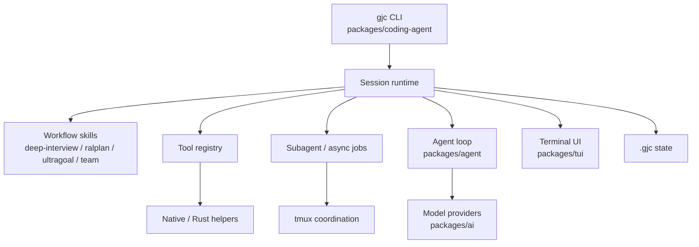

# Gajae-Code 프로젝트 소개

이 문서는 Gajae-Code를 처음 소개할 때 사용할 수 있는 요약 문서입니다. 설치 방법이나 세부 구현보다, 이 프로젝트가 어떤 목표를 지향하고 어떤 구성으로 만들어졌는지를 설명합니다.

## 한 문장 소개

Gajae-Code는 Claude Code나 Codex CLI 같은 도구 옆에서 실행되는, 계획, 실행, 검증, 상태 기록을 명시적으로 관리하는 workflow-first coding agent harness입니다.

## 조금 더 풀어쓴 소개

Gajae-Code(`gjc`)는 단순히 LLM에게 코드를 수정하게 하는 CLI가 아닙니다. 개발 작업을 “요구사항 구체화 -> 계획 수립 -> 실행 -> 검증 -> 기록”이라는 구조화된 workflow로 다루려는 프로젝트입니다.

핵심 목표는 agent의 작업을 일회성 대화에 가두지 않는 것입니다. Gajae-Code는 `.gjc/` 상태 파일, tool 실행 기록, subagent 작업, model provider 선택, tmux 기반 병렬 실행까지 포함하는 auditable runtime을 지향합니다.

즉, 이 프로젝트는 “더 많은 도구를 붙인 챗봇”보다 “AI coding agent를 운영 가능한 개발 runtime으로 만드는 것”에 가깝습니다.

## 프로젝트가 지향하는 목표

Gajae-Code의 목표는 크게 다섯 가지로 정리할 수 있습니다.

| 목표 | 설명 |
| --- | --- |
| 모호성 줄이기 | 구현 전에 `deep-interview`로 요구사항을 구체화합니다. |
| 계획 검토하기 | `ralplan`으로 변경 전 계획과 검토 게이트를 둡니다. |
| 실행을 추적하기 | `ultragoal`로 긴 작업을 goal, revision, evidence 단위로 기록합니다. |
| 병렬 실행 관리하기 | `team`으로 tmux 기반 worker를 coordination합니다. |
| 결과를 검증 가능하게 만들기 | tool, state, subagent, provider 선택을 runtime 계약으로 관리합니다. |

이 목표들은 모두 같은 방향을 가집니다. agent가 “그럴듯한 답변”을 내는 것보다, 사람이 검토하고 재개하고 감사할 수 있는 작업 단위를 남기게 만드는 것입니다.

## 전체 구성

Gajae-Code의 중심은 `packages/coding-agent/`입니다. 여기서 `gjc` CLI, session runtime, workflow skill, tool registry, multi-agent/task 실행, `.gjc` state runtime이 조립됩니다.

나머지 package들은 이 중심을 보조하는 경계로 나뉩니다.

| 영역 | 역할 |
| --- | --- |
| `packages/coding-agent` | GJC의 핵심 제품 표면입니다. CLI, session, workflow, tool, subagent 실행을 조립합니다. |
| `packages/agent` | 저수준 agent loop입니다. model response, tool call, event stream을 처리합니다. |
| `packages/ai` | Anthropic, OpenAI/Codex Responses, Gemini, Cursor 등 model provider를 추상화합니다. |
| `packages/tui` | terminal UI 렌더링과 입력 처리를 담당합니다. |
| `packages/natives`, `crates/` | 검색, grep, 이미지, shell/isolation 등 native/Rust 지원을 제공합니다. |
| `packages/stats` | 사용량과 관측 가능성을 위한 보조 표면입니다. |
| `packages/utils`, `packages/bridge-client` | 여러 package가 공유하는 utility와 bridge protocol을 제공합니다. |
| `python/gjc-rpc`, `python/robogjc` | RPC와 외부 자동화 경계를 제공합니다. |



## 핵심 workflow

Gajae-Code는 기본 workflow surface를 작게 유지합니다.

```text
deep-interview -> ralplan -> ultragoal
                         └─ optional team execution
```

각 workflow의 역할은 다음과 같습니다.

| Workflow | 역할 |
| --- | --- |
| `deep-interview` | 애매한 요구사항을 바로 구현하지 않고, 질문을 통해 구체화합니다. |
| `ralplan` | 구현 전에 계획을 만들고, 위험과 검증 방식을 검토합니다. |
| `ultragoal` | 긴 실행을 목표 단위로 나누고, 변경과 검증 증거를 기록합니다. |
| `team` | 병렬 worker가 실제로 도움이 될 때 tmux 기반 실행을 조율합니다. |

이 workflow는 agent에게 “바로 코드를 바꾸기”보다 “작업의 상태와 근거를 남기며 진행하기”를 요구합니다.

## Multi-Agent System 관점

Gajae-Code의 multi-agent system은 단순히 여러 model call을 동시에 보내는 구조가 아닙니다. subagent는 owner, session file, progress, output stream, completion delivery를 가진 managed task로 실행됩니다.

핵심 구성은 다음과 같습니다.

| 계층 | 역할 |
| --- | --- |
| role agent | `executor`, `architect`, `planner`, `critic` 같은 역할 정의를 제공합니다. |
| task execution | subagent를 별도 `AgentSession`으로 실행하고 진행 상황을 추적합니다. |
| async job manager | background bash와 task job을 같은 lifecycle registry로 관리합니다. |
| coordinator surface | tmux, MCP, control-plane을 통해 외부 coordination을 가능하게 합니다. |

이 구조 덕분에 subagent 작업은 단순 텍스트 출력이 아니라, pause/resume/cancel, progress rendering, completion validation을 가진 실행 단위가 됩니다.

## Model Provider 관점

Gajae-Code는 host agent tool과 model provider를 구분합니다.

| 구분 | 예 | 의미 |
| --- | --- | --- |
| host agent tool | Claude Code, Codex CLI, OpenCode, Claw Code | GJC 옆에서 함께 실행될 수 있는 별도 제품입니다. |
| model provider | Anthropic, OpenAI/Codex Responses, Google, Cursor | GJC 내부 runtime이 model response를 받기 위해 통신하는 provider 계층입니다. |

GJC는 Claude Code나 Codex CLI 안에 숨어 들어가는 plugin이 아닙니다. 별도의 runner로 실행되며, 자체 model layer는 `packages/ai`와 `ModelRegistry`를 통해 provider별 차이를 정규화합니다.

provider 계층은 다음을 처리합니다.

- streaming text와 tool-call event
- model/provider ID
- OAuth/API key credential lookup
- usage/cost 계산
- tool schema compatibility
- provider-specific session/cache state
- fallback과 model discovery

## 왜 흥미로운 프로젝트인가

Gajae-Code가 흥미로운 이유는 tool이 많아서가 아닙니다. agent 작업을 auditable runtime으로 다루기 때문입니다.

이 프로젝트에서는 다음 요소들이 일급 개념입니다.

- 구현 전 요구사항 구체화
- 계획 승인과 검토 게이트
- tool 실행 계약
- `.gjc/` 기반 지속 상태
- subagent lifecycle
- model provider abstraction
- tmux 기반 병렬 coordination
- 검증 증거와 실행 기록

그래서 Gajae-Code는 AI coding agent, local automation runner, workflow-oriented CLI, multi-agent execution environment를 설계하려는 사람에게 좋은 참고 프로젝트입니다.

## 소개용 요약 문단

Gajae-Code는 AI coding agent를 단순 대화형 도구가 아니라, 요구사항 구체화, 계획 승인, 도구 실행, subagent 병렬화, 검증 기록까지 포함하는 로컬 개발 runtime으로 재구성한 프로젝트입니다. 핵심 구현은 `packages/coding-agent/`에 있으며, 나머지 package는 model provider, agent loop, TUI, native helper, RPC 자동화를 담당하는 지원 경계로 분리되어 있습니다. Claude Code나 Codex CLI 같은 도구 옆에서 실행되며, agent 작업을 사람이 검토하고 재개하고 감사할 수 있는 구조로 남기는 것을 목표로 합니다.

## 더 깊게 읽기

- [ARCHITECTURE.md](ARCHITECTURE.md): 시스템 아이디어와 아키텍처 지도
- [AI_AGENT_HARNESS_VIEW.md](AI_AGENT_HARNESS_VIEW.md): AI Agent Harness 관점의 설명 프레임
- [SOURCE_WALKTHROUGH.md](SOURCE_WALKTHROUGH.md): 실제 소스 파일을 따라 읽는 순서
- [SOURCE_GRAPH_DIAGRAMS.md](SOURCE_GRAPH_DIAGRAMS.md): GitNexus 소스 그래프를 바탕으로 다시 그린 Mermaid 다이어그램
- `.gitnexus/wiki/overview.md`: GitNexus가 생성한 전체 지도
- `.gitnexus/wiki/coding-agent-session-runtime.md`: session runtime 중심 분석
- `.gitnexus/wiki/subagents-and-async-jobs.md`: multi-agent와 async job 분석
- `.gitnexus/wiki/support-boundary-ai-provider-layer.md`: model provider 경계 분석
