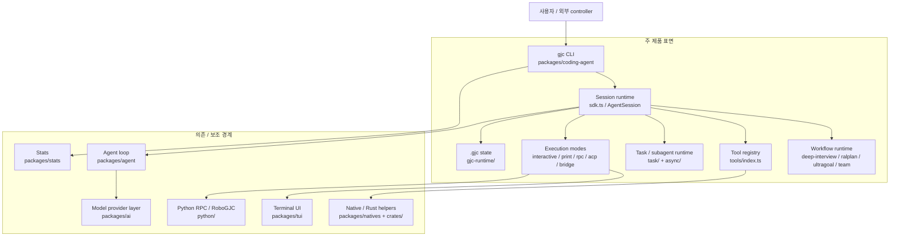
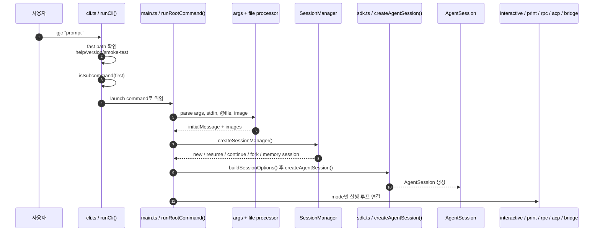
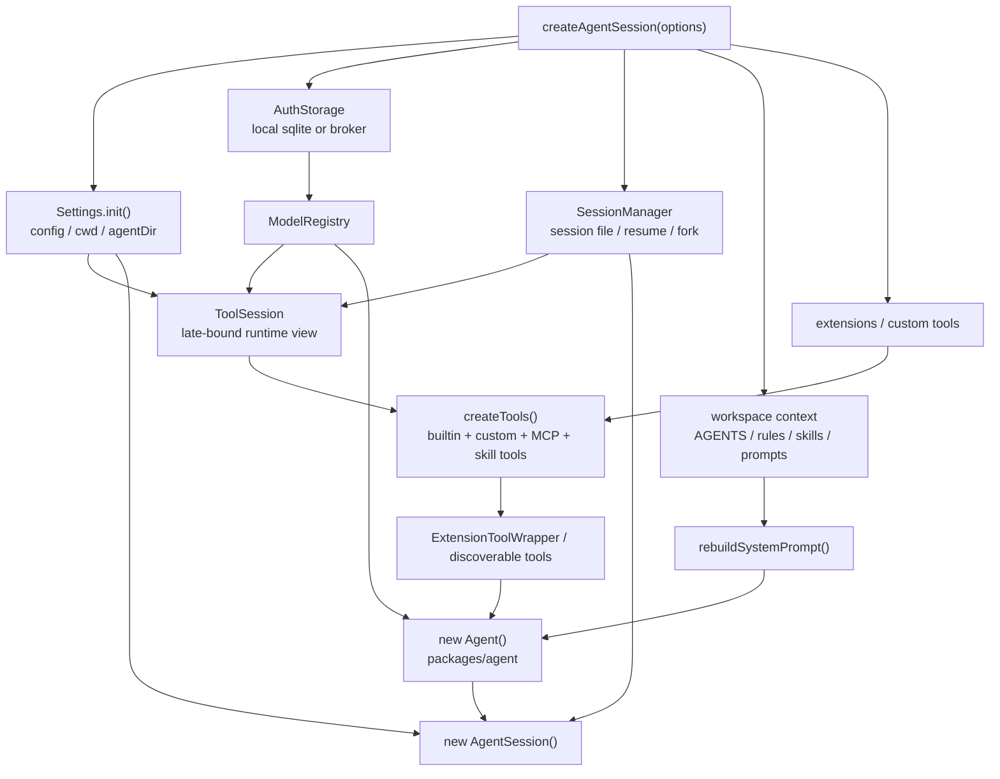
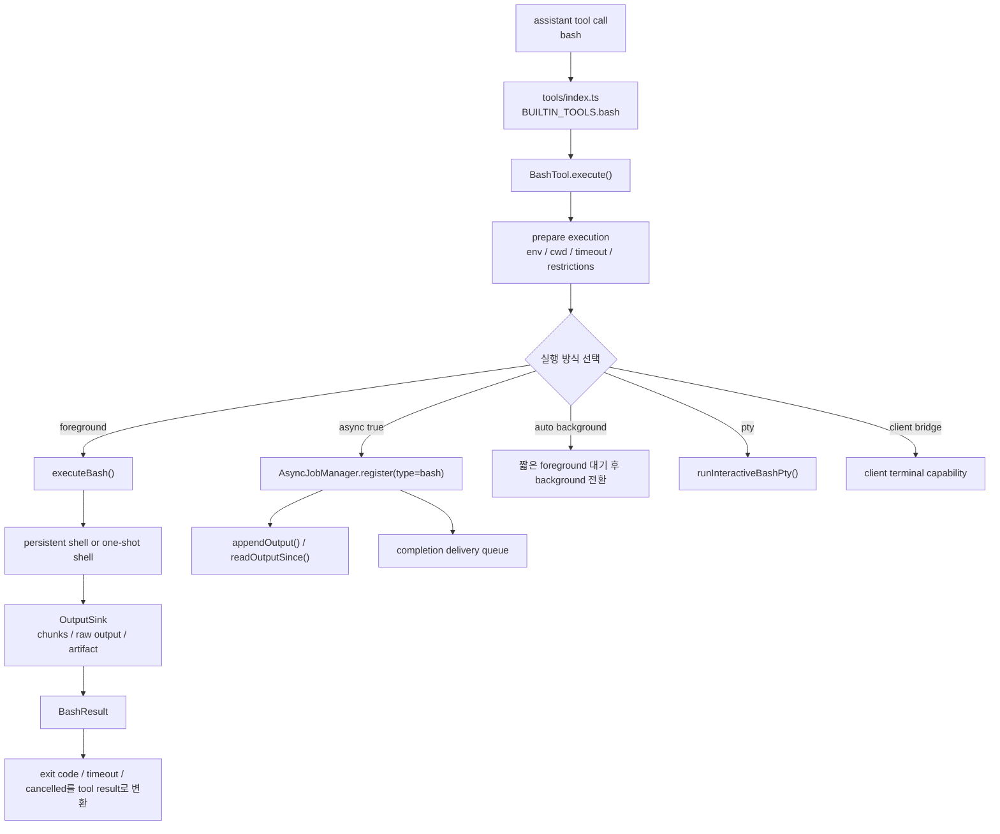
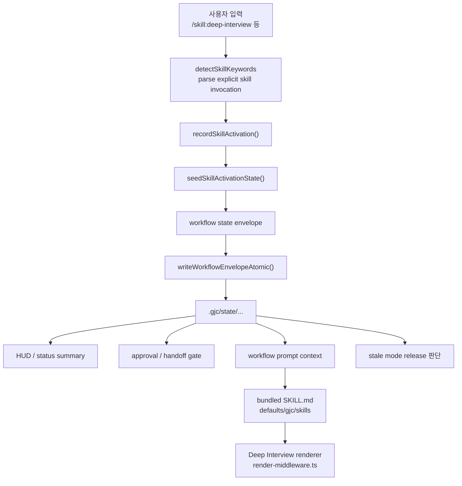
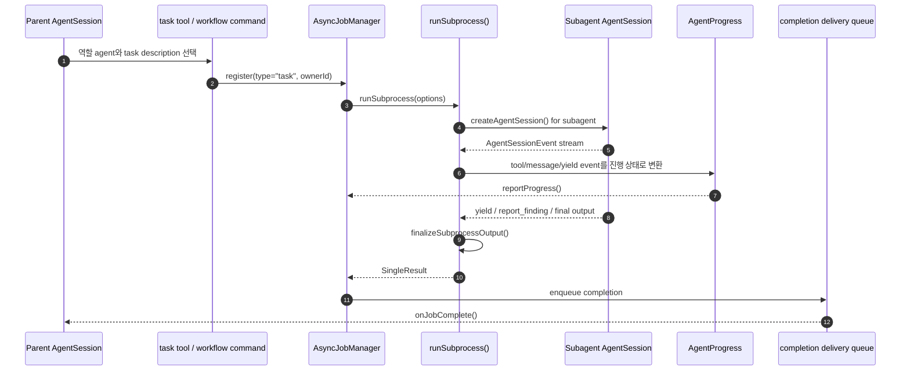
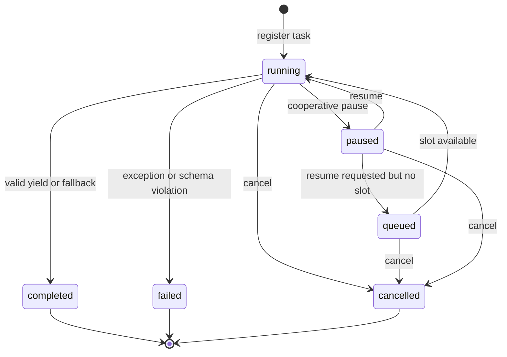
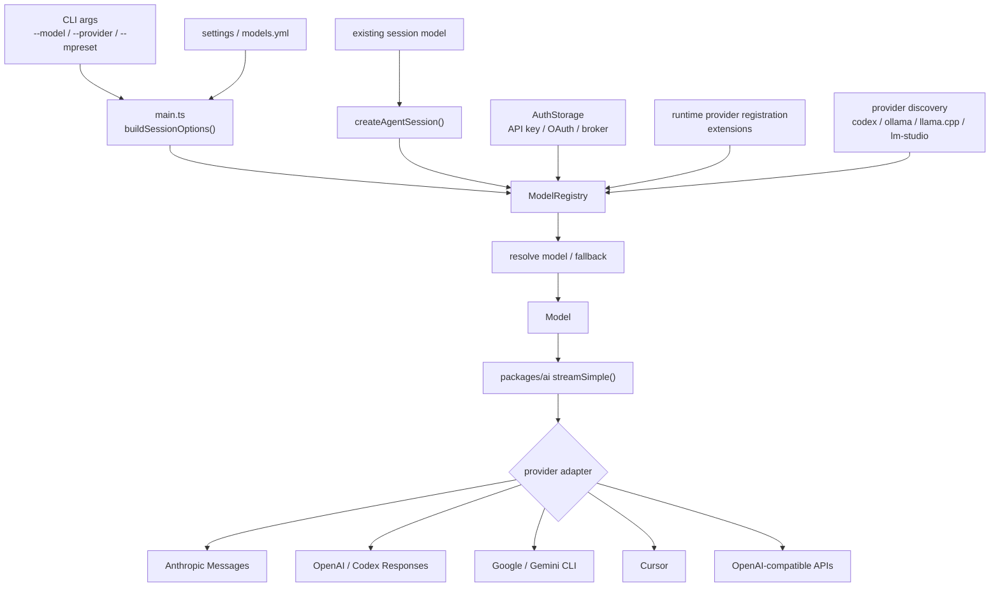
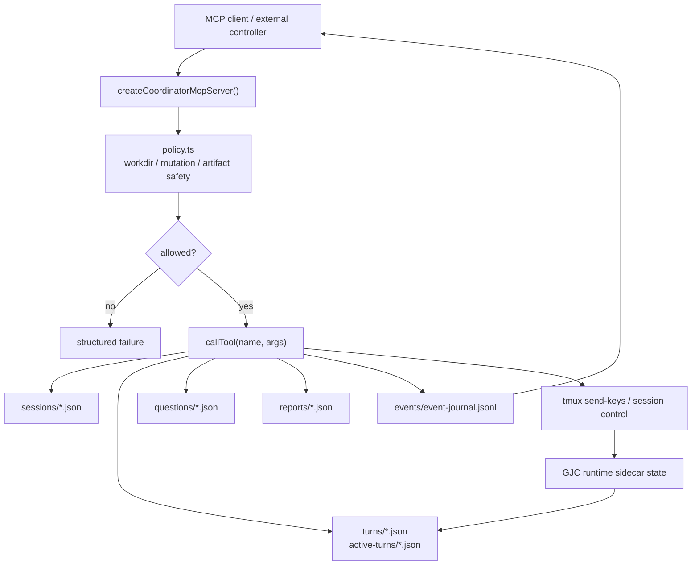
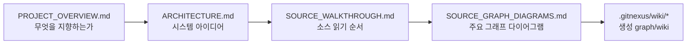

# Gajae-Code 소스 그래프 Mermaid 다이어그램

이 문서는 GitNexus가 생성한 소스코드 그래프와 wiki를 바탕으로, Gajae-Code의 주요 로직을 Mermaid 다이어그램으로 다시 표현한 것입니다. 자동 생성 그래프를 그대로 복사한 문서가 아니라, GitNexus의 module/call-flow 관찰 결과를 직접 소스 anchor와 대조한 뒤 사람이 읽기 쉬운 수준으로 압축한 그림입니다.

## 사용한 GitNexus 기준

먼저 본 GitNexus 산출물은 다음입니다.

| GitNexus 산출물 | 사용한 이유 |
| --- | --- |
| `.gitnexus/wiki/overview.md` | 전체 제품 흐름과 주요 module 관계 파악 |
| `.gitnexus/wiki/module_tree.json` | 어떤 source file이 어떤 module에 속하는지 확인 |
| `.gitnexus/wiki/coding-agent-cli-and-commands.md` | CLI entry와 command routing 흐름 확인 |
| `.gitnexus/wiki/coding-agent-session-runtime.md` | `createAgentSession()` 중심의 session assembly 확인 |
| `.gitnexus/wiki/execution-and-tools.md` | shell/tool execution 경계 확인 |
| `.gitnexus/wiki/coding-agent-workflow-skills-and-state-runtime.md` | workflow skill과 `.gjc` state runtime 확인 |
| `.gitnexus/wiki/subagents-and-async-jobs.md` | `AsyncJobManager`와 `runSubprocess()` 흐름 확인 |
| `.gitnexus/wiki/support-boundary-ai-provider-layer.md` | model provider abstraction 확인 |
| `.gitnexus/wiki/dependency-and-support-boundary.md` | `packages/coding-agent/`와 support package 경계 확인 |

직접 대조한 주요 source anchor는 다음입니다.

- `packages/coding-agent/src/cli.ts`
- `packages/coding-agent/src/main.ts`
- `packages/coding-agent/src/sdk.ts`
- `packages/coding-agent/src/session/agent-session.ts`
- `packages/coding-agent/src/tools/index.ts`
- `packages/coding-agent/src/tools/bash.ts`
- `packages/coding-agent/src/exec/bash-executor.ts`
- `packages/coding-agent/src/defaults/gjc-defaults.ts`
- `packages/coding-agent/src/gjc-runtime/`
- `packages/coding-agent/src/task/agents.ts`
- `packages/coding-agent/src/task/executor.ts`
- `packages/coding-agent/src/async/job-manager.ts`
- `packages/coding-agent/src/config/model-registry.ts`
- `packages/agent/src/agent.ts`
- `packages/agent/src/agent-loop.ts`
- `packages/ai/src/types.ts`
- `packages/ai/src/providers/`

## 1. 전체 패키지 경계

이 그림은 GitNexus의 dependency/support boundary를 사람이 읽기 쉬운 단위로 압축한 것입니다. `packages/coding-agent/`가 제품 표면이고, 나머지는 support boundary입니다.



읽는 방법:

- 제품 정책은 `packages/coding-agent/`에서 시작합니다.
- model 호출 자체는 `packages/ai`로 내려갑니다.
- tool loop는 `packages/agent`가 돌리지만, 실제 tool 구현과 session policy는 `packages/coding-agent`가 가집니다.
- TUI, native, stats, Python automation은 핵심 runtime을 보조합니다.

## 2. CLI에서 AgentSession까지

`gjc "prompt"`가 들어왔을 때 가장 먼저 따라야 하는 흐름입니다.



직접 확인 anchor:

- `cli.ts`: `runCli()`, `isSubcommand()`
- `main.ts`: `runRootCommand()`, `createSessionManager()`, `buildSessionOptions()`
- `sdk.ts`: `createAgentSession()`
- `session/agent-session.ts`: `AgentSession`

## 3. Session assembly 내부

`createAgentSession()`은 단순 factory가 아니라 GJC runtime의 조립 지점입니다.



읽는 포인트:

- `ToolSession`은 도구가 session 생성 전에도 만들어지고, 실행 시점에는 최신 session 상태를 보도록 하는 late-bound 경계입니다.
- `withEmbeddedDefaultGjcSkills()`는 기본 GJC workflow skill을 session에 항상 포함시키는 제품 계약입니다.
- provider-specific 동작은 `ModelRegistry`와 `packages/ai` 뒤에 숨깁니다.

## 4. Agent loop와 tool call

`AgentSession`이 프롬프트를 넘긴 뒤 실제 model/tool loop가 도는 방식입니다.

```mermaid
sequenceDiagram
  autonumber
  participant AS as AgentSession
  participant Agent as packages/agent Agent
  participant Loop as agent-loop.ts
  participant AI as packages/ai streamSimple()
  participant Registry as Tool registry
  participant Tool as AgentTool.execute()
  participant Store as SessionManager / messages

  AS->>Agent: prompt messages 전달
  Agent->>Loop: agentLoop()
  Loop->>AI: streamAssistantResponse()
  AI-->>Loop: text_delta / toolcall_end / done
  Loop->>Registry: tool name으로 AgentTool 조회
  Registry-->>Loop: tool instance
  Loop->>Tool: execute(toolCallId, args, signal)
  Tool-->>Loop: AgentToolResult
  Loop-->>Agent: toolResult message + turn_end
  Agent-->>AS: AgentSessionEvent
  AS->>Store: message / event persistence
```

중요한 점:

- `packages/agent`는 loop와 event stream을 담당합니다.
- 실제 tool 구현은 `packages/coding-agent/src/tools/`에 있습니다.
- provider streaming은 `packages/ai`가 공통 event로 정규화합니다.

## 5. Bash tool 실행

GJC에서 가장 중요한 tool backend 중 하나인 shell 실행 흐름입니다.



읽는 포인트:

- `BashTool`은 policy와 UX 경계입니다.
- `executeBash()`는 실제 shell 실행과 output sink에 집중합니다.
- background job은 `AsyncJobManager`로 등록되어 output cursor와 completion delivery를 가집니다.
- 실패 exit code는 정상 텍스트가 아니라 tool error로 표면화됩니다.

## 6. Workflow skill과 `.gjc` state

workflow는 대화 안의 문자열 플래그가 아니라 `.gjc/` 상태와 연결됩니다.



제품 표면:

| Workflow | 상태 의미 |
| --- | --- |
| `deep-interview` | 모호한 요구사항을 질문과 spec으로 구체화 |
| `ralplan` | 변경 전 계획과 승인 상태 관리 |
| `ultragoal` | 긴 작업을 goal/evidence ledger로 추적 |
| `team` | tmux worker coordination 상태 관리 |

## 7. Subagent와 AsyncJobManager

subagent는 독립 model call이 아니라 lifecycle을 가진 managed task입니다.



state 관점:



읽는 포인트:

- `AsyncJobManager`는 bash job과 task job을 함께 관리합니다.
- owner ID가 output, cancel, cleanup 범위를 제한합니다.
- subagent 성공 기준은 단순 assistant text가 아니라 `yield` 또는 schema-valid fallback입니다.
- pause/resume은 강제 kill이 아니라 협력적 lifecycle로 설계되어 있습니다.

## 8. Model provider resolution

model 선택은 CLI hard dependency가 아니라 runtime policy입니다.



개념 구분:

| 구분 | 예 | 이 그래프에서의 위치 |
| --- | --- | --- |
| host agent tool | Claude Code, Codex CLI, OpenCode, Claw Code | GJC 옆에서 실행되는 외부 제품 |
| model provider | Anthropic, OpenAI/Codex Responses, Google, Cursor | `packages/ai` provider adapter |
| runtime selector | `ModelRegistry` | credential과 설정을 보고 실제 model을 선택 |

## 9. Coordinator MCP와 외부 제어

GJC는 terminal scrollback을 직접 긁는 대신, coordinator MCP와 상태 파일을 통해 외부 제어 표면을 제공합니다.



읽는 포인트:

- mutation은 환경 설정과 요청 인자의 `allow_mutation`이 모두 맞아야 합니다.
- session, turn, question, report, event journal이 file-state namespace로 나뉩니다.
- 외부 controller는 tmux 화면을 직접 파싱하지 않고 coordinator 상태를 읽을 수 있습니다.

## 10. 문서 간 관계

이 문서는 그림 중심입니다. 함께 읽을 문서는 다음입니다.



## 요약

GitNexus graph에서 반복적으로 중심에 놓이는 축은 다음입니다.

1. `gjc` CLI에서 `AgentSession`을 조립하는 흐름
2. `AgentSession`이 `packages/agent` loop와 `packages/ai` provider layer를 연결하는 흐름
3. tool registry가 실제 shell/edit/MCP/web backend로 내려가는 흐름
4. workflow skill activation이 `.gjc` state로 지속되는 흐름
5. subagent가 `AsyncJobManager`와 `runSubprocess()`로 managed task가 되는 흐름
6. model provider가 `ModelRegistry`와 `packages/ai` 뒤에서 정규화되는 흐름
7. coordinator MCP가 tmux와 file-state를 통해 외부 제어를 제공하는 흐름

이 일곱 축을 이해하면 Gajae-Code를 “도구가 많은 CLI”가 아니라 “workflow-first agent runtime”으로 읽을 수 있습니다.
