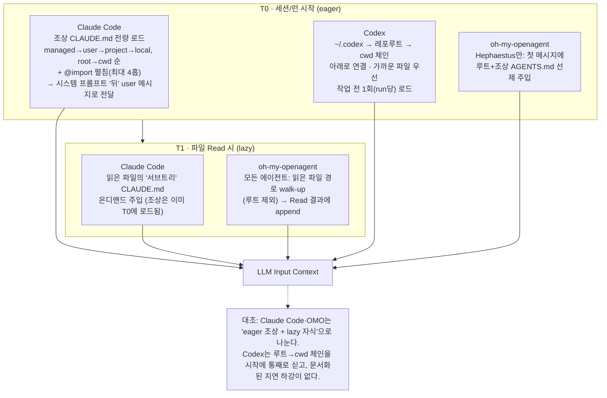
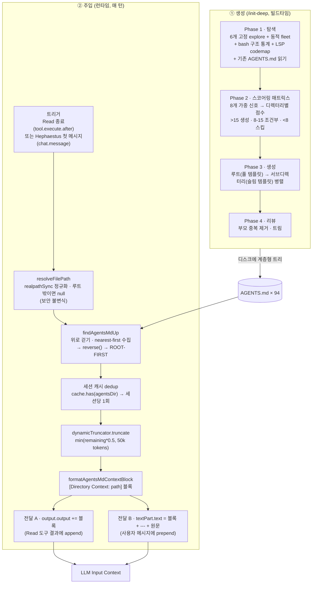
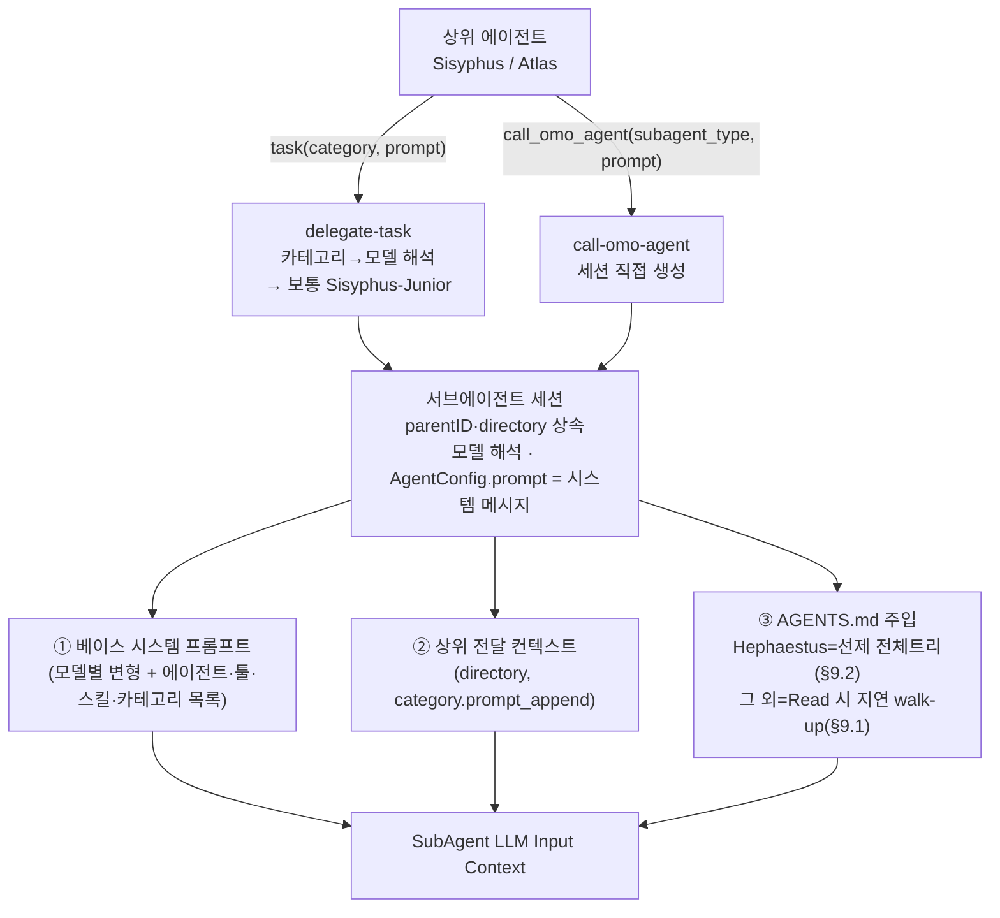

# `/init-deep`과 계층형 AGENTS.md를 통한 LLM Input Context 제어

## 1. 이 문서가 답하는 질문

AI 코딩 에이전트에게 "이 디렉터리에서는 이렇게 일해라"를 어떻게 전달하는가? 그리고 그 전달이 컨텍스트 윈도를 폭주시키지 않도록 어떻게 제어하는가?

이 질문은 세 겹으로 나뉜다.

1. **무엇을 전달하는가** — `/init-deep`이 만드는 `AGENTS.md`는 어떤 내용을 담는 문서인가. (§2)
2. **언제 LLM 입력 컨텍스트가 되는가** — 그 문서가 모델 입력으로 들어가는 시점은 하네스마다 다르다. 같은 `AGENTS.md` 트리를 **세 개의 주입 레짐**이 각자 다른 시점에 먹는다: Claude Code의 공식 계층형 메모리(`CLAUDE.md`), Codex의 공식 `AGENTS.md` 병합, 그리고 oh-my-openagent가 OpenCode 위에 직접 구현한 커스텀 주입. (§3, 상세는 §8–9)
3. **각 SubAgent는 어떤 컨텍스트를 받는가** — oh-my-openagent의 11개 에이전트는 같은 트리를 서로 다른 "식단"으로 받는다. (§10)

`AGENTS.md`가 표준인 이유가 여기에 있다. 한 포맷이 여러 하네스의 **계층형 메모리(hierarchical memory)** 입력으로 동시에 쓰인다. 실제로 이 레포의 루트에서 `CLAUDE.md`는 `AGENTS.md`를 가리키는 심볼릭링크다 — 한 파일이 Claude Code와 OpenCode를 동시에 먹인다. 루트 `AGENTS.md`가 직접 못박는다: *"Claude Code reads CLAUDE.md (a symlink to this AGENTS.md) and OpenCode reads this file."*

생성과 주입은 시점이 다르다. 아래 표는 그중 **oh-my-openagent(OpenCode) 레짐**의 생성/주입 분리다. Claude Code·Codex의 *공식* 주입은 §3에서 다룬다.

| 시점 | 담당 | 제어 대상 |
|------|------|-----------|
| 생성 (빌드타임) | `/init-deep` 스킬 | 어떤 디렉터리가 `AGENTS.md`를 가질지 — 트리의 *모양* |
| 주입 (런타임) | `agents-md-core` + `rules-engine` + 2개 OpenCode 훅 | 매 턴 *무엇을·얼마나·어디로* 넣을지 |

---

## 2. AGENTS.md란 무엇이고 무엇을 담는가 — 계층형 메모리 표준

### 2.1 AGENTS.md는 하네스 중립 표준이다

`AGENTS.md`는 특정 도구의 설정 파일이 아니라, 코딩 에이전트에게 줄 지침을 담는 **공개 포맷**이다(`agents.md`). OpenAI Codex, Cursor, Aider, GitHub Copilot, Google Jules, VS Code, Devin 등 30종 이상의 도구가 같은 파일을 읽는다. 사람이 읽는 `README.md`를 보완해 *"에이전트가 필요로 하는, 때로 상세한 추가 컨텍스트"*를 담는 자리다(규모 감각: 작성 시점 기준 OpenAI 본 레포에 `AGENTS.md`가 88개 있다).

Claude Code에서 같은 역할을 하는 파일은 `CLAUDE.md`다. 두 포맷의 내용은 사실상 동일하므로, **한 파일로 두 하네스를 먹이는** 패턴이 자리 잡았다 — 이 레포가 바로 그 예다. 루트 `CLAUDE.md`는 `AGENTS.md`를 가리키는 symlink이고, 루트 문서가 직접 명시한다: *"Claude Code reads CLAUDE.md (a symlink to this AGENTS.md) and OpenCode reads this file."* 즉 `/init-deep`이 만든 트리는 한 번 만들면 Claude Code·Codex·OpenCode가 공유한다.

> Claude Code는 `AGENTS.md`를 직접 읽지 않고 `CLAUDE.md`만 읽는다(공식). 브리지는 둘 중 하나다 — `CLAUDE.md` 안에서 `@AGENTS.md`를 import하거나(세션 시작 시 펼쳐 로드된 뒤 Claude 전용 내용이 덧붙는다), 위처럼 symlink를 거는 것. `agents.md` 표준도 다른 에이전트 파일과의 backward-compat용 symlink(`ln -s AGENTS.md AGENT.md`)를 공식 권장한다. (단, `ln -s AGENTS.md CLAUDE.md`라는 *CLAUDE.md 전용* symlink은 공식 문서 문구가 아니라 그 권고에서 파생된 커뮤니티 관행이다.)

### 2.2 무엇을 담는가 — 루트 풀 템플릿 vs 슬림 서브 템플릿

`/init-deep`은 두 종류의 문서를 만든다. 루트는 "풀 템플릿", 서브디렉터리는 "슬림 템플릿"이다.

루트 풀 템플릿(50–150줄, `SKILL.md` 199–244):

```markdown
# PROJECT KNOWLEDGE BASE
**Generated:** {TIMESTAMP}  **Commit:** {SHORT_SHA}  **Branch:** {BRANCH}

## OVERVIEW            {1-2 sentences: what + core stack}
## STRUCTURE           {디렉터리 트리 — 비자명한 목적만 주석}
## WHERE TO LOOK       | Task | Location | Notes |          (작업 → 위치 라우팅)
## CODE MAP            | Symbol | Type | Location | Refs | Role |   (LSP 있을 때)
## CONVENTIONS         {ONLY deviations from standard}
## ANTI-PATTERNS       {Explicitly forbidden here}
## UNIQUE STYLES       {Project-specific}
## COMMANDS            {dev/test/build}
## NOTES               {Gotchas}
```

서브디렉터리 슬림 템플릿(30–80줄, `SKILL.md` 246–258): OVERVIEW(1줄), STRUCTURE(서브디렉터리 5개 초과 시), WHERE TO LOOK, CONVENTIONS(부모와 다를 때만), ANTI-PATTERNS. 규칙은 하나 — **부모 내용을 절대 반복하지 않는다(NEVER repeat parent content)**.

핵심: 두 템플릿 모두 "표준에서 벗어난 것·비자명한 것만, 전보문(telegraphic) 스타일로" 적는다. 일반론·자명한 정보는 품질 게이트에서 제거된다(§7.4). 이유는 §3에서 분명해진다 — 이 문서는 **그대로 LLM 입력이 되므로**, 짧고 비중복일수록 컨텍스트 비용이 작다.

### 2.3 실제 예시 — depth-2 리프 한 장

`packages/agents-md-core/AGENTS.md`(슬림 템플릿의 전형, 일부 발췌):

```markdown
# agents-md-core — AGENTS.md Discovery + Injection (Core)

## OVERVIEW
Harness-neutral logic for walking a file path UP its directory tree, discovering
nearby AGENTS.md files, truncating their content, and formatting them as a
[Directory Context: ...] block for injection. Discovery itself is delegated to
rules-engine (findAgentsMdUp, AgentsMdCache); this package owns path resolution,
formatting, and the per-session injected-paths cache.

## PUBLIC API (src/index.ts)
| Export | Source | Role |
| resolveFilePath(rootDir, path)       | finder.ts    | realpathSync 검증, 루트 밖이면 null |
| formatAgentsMdContextBlock({...})    | formatter.ts | directory-context 블록 래핑 |
| processFilePathForAgentsInjection    | injector.ts  | resolve → findAgentsMdUp → read → truncate → format → cache |
| ... (이하 생략)

## DEPENDENCIES & CONSUMERS
- Depends on: rules-engine only.
- Consumed by: directory-agents-injector, hephaestus-agents-md-injector.

## NOTES
- Path-traversal guard is a security invariant (realpathSync).
- Truncator + storage are injected — this package never implements them.
- Parent: packages/AGENTS.md          ← 백링크
```

여기서 두 가지가 보인다. (1) 옆 패키지는 인라인하지 않고 **경로로 가리킨다**("Discovery delegated to rules-engine"). (2) 맨 끝 `Parent:` 백링크가 트리를 위로 엮는다. 이 두 규칙이 각 문서를 짧게 유지하고, 뒤에서 볼 **walk-up 합집합**을 작게 만든다(§11).

---

## 3. 언제 LLM Input Context가 되는가 — 3개 주입 레짐

같은 `AGENTS.md`/`CLAUDE.md` 트리라도, 그것이 모델 입력으로 들어가는 *시점*은 하네스마다 다르다. 셋을 나란히 두면 "계층형 메모리"가 무엇인지가 분명해진다.

### 3.1 Claude Code 공식 — 계층형 메모리(`CLAUDE.md`)

메모리 레벨(넓은 → 좁은 순으로 로드, 뒤에 온 것이 사실상 우선):

| 레벨 | 경로 | 범위 |
|------|------|------|
| Managed policy(조직) | macOS `/Library/Application Support/ClaudeCode/CLAUDE.md`, Linux/WSL `/etc/claude-code/CLAUDE.md`, Windows `C:\Program Files\ClaudeCode\CLAUDE.md` | 머신 전체·전 세션, 개별 설정으로 제외 불가 |
| User | `~/.claude/CLAUDE.md` | 내 모든 프로젝트 |
| Project | `./CLAUDE.md` 또는 `./.claude/CLAUDE.md` | 팀 공유(버전관리) |
| Local | `./CLAUDE.local.md` | 개인·비커밋(여전히 지원되는 레벨) |

주입 시점이 **방향에 따라 다르다** — 이것이 계층형 메모리의 핵심이다.

- **조상(현재 작업 디렉터리에서 루트까지) `CLAUDE.md`는 세션 시작 시 전량 로드된다.** 공식 문구: *"CLAUDE.md and CLAUDE.local.md files in the directory hierarchy above the working directory are loaded in full at launch."* 디렉터리 트리를 위로 걸으며 각 단계의 파일을 수집하고, **루트 → 작업 디렉터리 순**으로 이어 붙인다(override 아님, concatenation).
- **자식(작업 디렉터리 아래 서브트리) `CLAUDE.md`는 지연 로드된다.** 시작 시가 아니라 *"Claude가 그 하위 디렉터리의 파일을 읽을 때"* 포함된다. 즉 조상=eager, 자식=lazy.
- 전달 형태가 특이하다: `CLAUDE.md`는 **시스템 프롬프트의 일부가 아니라, 시스템 프롬프트 뒤의 user 메시지로** 들어간다.
- `@path` import는 시작 시 펼쳐서 함께 로드된다(컨텍스트를 아끼지 못함). 재귀 import는 **최대 4홉**.
- `/compact` 후: 루트 `CLAUDE.md`는 디스크에서 재로드되어 다시 주입되지만, **서브트리 파일은 자동 재주입되지 않는다**(다음에 그 디렉터리 파일을 읽을 때 다시 로드).

출처: `code.claude.com/docs/en/memory`(구 `docs.claude.com/...`는 이 주소로 301 리다이렉트).

### 3.2 Codex 공식 — `AGENTS.md` 병합

Codex는 `AGENTS.md`를 **작업을 시작하기 전에, 런(run)당 1회** 읽어 "instruction chain"을 만든다(TUI에서는 대개 세션 시작 1회). 공식 문구: *"Codex reads AGENTS.md files before doing any work."*

체인 구성(아래로 갈수록 가까운 파일 = 우선):

| 순서 | 위치 | 비고 |
|------|------|------|
| 1 (베이스) | `~/.codex/AGENTS.md` (있으면 `~/.codex/AGENTS.override.md` 우선) | 전역·개인 |
| 2 | `<git-root>/AGENTS.md` | 레포 전역 |
| 3 | git 루트 → cwd 경로상의 중간 디렉터리 `AGENTS.md` | 패키지·디렉터리별 |
| 4 (최우선 파일) | cwd / 편집 대상에 가장 가까운 `AGENTS.md` | *"The closest AGENTS.md to the edited file wins"* |
| 최상위 | 사용자의 명시적 채팅 프롬프트 | 모든 `AGENTS.md`를 덮어씀 |

방향이 Claude Code와 대조적이다: Codex는 **git 루트에서 cwd로 *아래로* 걸으며** 각 디렉터리를 검사하고(`AGENTS.override.md` → `AGENTS.md` → fallback 순), 가까운 파일이 먼 파일을 덮는다(나중에 이어 붙으므로). git 루트 위로는 올라가지 않으며, 전역 `~/.codex/AGENTS.md`가 그 위의 베이스로 얹힌다. 파일당 읽는 양은 `project_doc_max_bytes`로 상한이 걸린다.

출처: `agents.md`, `developers.openai.com/codex`(특히 `/guides/agents-md`).

### 3.3 oh-my-openagent 커스텀 — OpenCode 위의 재현

OpenCode는 (특정 버전 전까지) `AGENTS.md`를 네이티브로 주입하지 않았다. 그래서 oh-my-openagent는 같은 계층형 메모리를 **두 개의 훅으로 직접 구현**한다(상세 §8–9). 같은 `AGENTS.md` 트리를 먹되, walk-up + 토큰 예산 + 세션 dedup으로 제어한다.

- `directory-agents-injector`(지연·모든 에이전트): 파일 `Read`가 끝날 때마다 그 경로를 위로 걸어(루트 제외) 발견한 `AGENTS.md`를 Read 결과에 덧붙인다.
- `hephaestus-agents-md-injector`(선제·Hephaestus 한정): 세션 첫 메시지에 루트+조상 `AGENTS.md`(루트 포함)를 사용자 메시지 앞에 미리 장전한다.

OpenCode가 네이티브 주입을 시작하는 버전 이상에서는 directory 인젝터가 **스스로 비활성화**되어 중복을 피한다(§9.4).

### 3.4 세 레짐 비교

| 레짐 | 시작 시점(eager) | 지연 시점(lazy) | 무엇을 | 전달 형태 | 출처 |
|------|------------------|------------------|--------|-----------|------|
| Claude Code (`CLAUDE.md`) | 조상(root→cwd) 전량, **매 세션** | 자식 서브트리: 그 디렉터리 파일 Read 시 | managed→user→project→local + `@import`(4홉) | 시스템 프롬프트 **뒤 user 메시지** | `code.claude.com/docs/en/memory` |
| Codex (`AGENTS.md`) | `~/.codex`→레포루트→cwd 체인 **1회/run**(작업 전) | (문서화된 지연 하강 없음) | 가까운 파일이 우선, 명시적 프롬프트가 최상위 | 결합된 project instructions | `developers.openai.com/codex`, `agents.md` |
| oh-my-openagent (OpenCode) | **Hephaestus만**: 루트+조상 선제(첫 메시지) | **모든 에이전트**: Read 경로 walk-up(루트 제외) | 같은 트리 + 토큰예산 + 세션 dedup | Read 결과 append / user 메시지 prepend | 본 레포 소스(§8–9) |

### 3.5 주입 타임라인 (Mermaid)



핵심은 같다 — **트리의 '모양'을 잘 만들면(§2, §7) 세 레짐이 모두 이득을 본다.** 어느 레짐이든 "내가 일하는 경로"에 가까운 문서가 우선·집중적으로 들어오기 때문이다. 이하 §4–§9는 그중 oh-my-openagent 레짐을 소스 단위로 추적한다.

---

## 4. 핵심 멘탈 모델 — "관련성 필터링"이 아니라 "모양 + 걷기"

이 시스템의 본질은 다음 한 문장으로 요약된다.

> 런타임에 "무엇이 관련 있는지"를 추론해 고르지 않는다. `/init-deep`이 미리 만든 **디렉터리-트리 모양의 문서**를, 에이전트가 건드린 파일의 **루트→리프 경로**만 위로 걸어 올라가며 주입한다.

이 설계의 직접적 귀결이 **컨텍스트 지역성(locality of context)** 이다.

- 깊이 N에 있는 파일을 건드리면 주입되는 `AGENTS.md`는 **최대 N+1개**다 (루트 → 각 조상 → 리프).
- 이 레포에는 `AGENTS.md`가 94개 있지만, `packages/skills-loader-core/src/features/builtin-skills/`를 편집해도 그 경로 위의 약 4개만 들어온다. 나머지 ~90개는 컨텍스트에 절대 들어오지 않는다.
- 즉 주입량은 **레포 전체 크기와 무관**하며, "내가 일하는 깊이"에만 비례한다.

따라서 "`/init-deep`으로 좋은 모양을 만드는 것"과 "런타임에 적게 주입하는 것"은 한 몸이다. 모양이 비중복적이고 절제돼 있어야 walk-up 합집합이 작아진다.

---

## 5. 아키텍처 전체도



---

## 6. 구성 요소 맵

| 단계 | 패키지 / 파일 | 핵심 심볼 |
|------|---------------|-----------|
| 생성 스킬 등록 | `skills-loader-core/.../skills/init-deep.ts` | `initDeepSkill` |
| 생성 스킬 본문 | `shared-skills/skills/init-deep/SKILL.md` | (프롬프트 루브릭) |
| 탐색 (discovery) | `rules-engine/src/agents-md.ts` | `findAgentsMdUp` |
| 탐색 캐시 | `rules-engine/src/cache.ts` | `createAgentsMdCache` |
| 오케스트레이션 | `agents-md-core/src/injector.ts` | `processFilePathForAgentsInjection` |
| 보안 가드 | `agents-md-core/src/finder.ts` | `resolveFilePath` |
| 포맷팅 | `agents-md-core/src/formatter.ts` | `formatAgentsMdContextBlock` |
| Dedup 캐시 | `agents-md-core/src/injection-cache.ts` | `getSessionCache` |
| DI 인터페이스 | `agents-md-core/src/types.ts` | `AgentsMdTruncator`, `AgentsMdInjectedPathsStorage` |
| 예산 (concrete) | `omo-opencode/src/shared/dynamic-truncator.ts` | `createDynamicTruncator` |
| 절단 전략 | `omo-opencode/src/shared/token-limit-truncator.ts` | `truncateToTokenLimit` |
| 라이브 윈도 계산 | `omo-opencode/src/shared/context-window-usage.ts` | `getContextWindowUsage` |
| 전달 훅 A | `omo-opencode/src/hooks/directory-agents-injector/hook.ts` | `createDirectoryAgentsInjectorHook` |
| 전달 훅 B | `omo-opencode/src/hooks/hephaestus-agents-md-injector/hook.ts` | `createHephaestusAgentsMdInjectorHook` |
| 훅 등록 A | `omo-opencode/src/plugin/hooks/create-tool-guard-hooks.ts` | (ToolGuard tier) |
| 훅 등록 B | `omo-opencode/src/plugin/hooks/create-session-hooks.ts` | (Session tier) |

> 핵심 분리: `agents-md-core`는 **인터페이스와 오케스트레이션만** 가지며 예산·영속화 구현은 0줄이다. 실제 truncator와 storage는 OpenCode 호스트(`omo-opencode`)가 의존성 주입(DI)한다.

---

## 7. 생성 측 — `/init-deep`이 트리의 "모양"을 결정한다

### 7.1 스킬은 코드가 아니라 데이터다

`/init-deep`에는 생성 알고리즘 코드가 없다. 스킬 전체가 데이터이며, 실행 로직은 `SKILL.md` 프롬프트에 자연어로 인코딩돼 있다.

`oh-my-openagent/packages/skills-loader-core/src/features/builtin-skills/skills/init-deep.ts` (4–9):

```ts
export const initDeepSkill: BuiltinSkill = {
	name: "init-deep",
	description: "(builtin) Initialize hierarchical AGENTS.md knowledge base",
	template: loadSharedSkillTemplate("init-deep"),   // SKILL.md 본문을 통째로 로드
	argumentHint: "[--create-new] [--max-depth=N]",
}
```

`loadSharedSkillTemplate`는 `SKILL.md`를 읽어 frontmatter를 떼고 본문을 캐시한다.

`oh-my-openagent/packages/skills-loader-core/src/features/builtin-skills/skill-file-loader.ts` (16–20):

```ts
const { body } = parseFrontmatter(readFile(join(skillsRootPath, skillName, "SKILL.md"), "utf8"))
cache.set(skillName, body)
return body
```

함의: 임계값·스코어링·에이전트 스폰 규칙이 전부 프롬프트 루브릭이다. 유연하지만, 코드가 임계값을 강제하지 않으므로 실제 동작은 실행하는 LLM의 준수도에 의존한다.

### 7.2 4단계 워크플로

| Phase | 한 일 | 산출 |
|-------|-------|------|
| 1 · 탐색 | 6개 고정 explore 에이전트 + 규모 비례 동적 fleet, 동시에 bash 구조 통계 / LSP codemap / 기존 `AGENTS.md` 읽기 | 병합된 발견 |
| 2 · 스코어링 | 가중 매트릭스로 디렉터리별 점수 산출, 결정 규칙으로 위치 선정 | `AGENTS_LOCATIONS` 목록 |
| 3 · 생성 | 루트 먼저(풀 템플릿) → 서브디렉터리 병렬 작성(슬림 템플릿) | 작성된 파일들 |
| 4 · 리뷰 | 부모 중복 제거 · 트림 · telegraphic 스타일 검증 | 정리된 트리 |

Phase 1의 동적 에이전트 스폰은 분석 폭을 프로젝트 규모에 맞춘다.

`oh-my-openagent/packages/shared-skills/skills/init-deep/SKILL.md` (60–78):

```
| Factor             | Threshold | Additional Agents      |
| Total files        | >100      | +1 per 100 files       |
| Total lines        | >10k      | +1 per 10k lines       |
| Directory depth    | ≥4        | +2 for deep exploration|
| Large files (>500) | >10 files | +1 for complexity      |
| Monorepo           | detected  | +1 per package         |
| Multiple languages | >1        | +1 per language        |
```

### 7.3 스코어링 매트릭스 — "모양"을 결정하는 핵심

이곳이 어떤 디렉터리가 자기 `AGENTS.md`를 가질 자격이 있는지를 정한다.

`oh-my-openagent/packages/shared-skills/skills/init-deep/SKILL.md` (153–174):

```
### Scoring Matrix
| Factor               | Weight | High Threshold | Source  |
| File count           | 3x     | >20            | bash    |
| Subdir count         | 2x     | >5             | bash    |
| Code ratio           | 2x     | >70%           | bash    |
| Unique patterns      | 1x     | Has own config | explore |
| Module boundary      | 2x     | Has index.ts   | bash    |
| Symbol density       | 2x     | >30 symbols    | LSP     |
| Export count         | 2x     | >10 exports    | LSP     |
| Reference centrality | 3x     | >20 refs       | LSP     |

### Decision Rules
| Score    | Action                    |
| Root (.) | ALWAYS create             |
| >15      | Create AGENTS.md          |
| 8-15     | Create if distinct domain |
| <8       | Skip (parent covers)      |
```

설계 포인트

- 점수 `<8`인 디렉터리는 자기 파일을 만들지 않고 "부모가 커버"한다. 즉 *생성 단계의 절제*가 곧 *런타임 walk-up 파일 수 감소*다.
- 신호 출처가 3종(bash 구조 통계 / LSP 심볼·참조 그래프 / explore)으로 다중 모달이다.
- `Reference centrality 3x` — 많이 참조되는 허브 디렉터리를 우선 문서화한다. 컨텍스트 예산을 중요도 높은 곳에 배분하는 의도다.

### 7.4 템플릿, 생성 순서, 비중복 규칙

루트는 풀 템플릿(provenance 헤더 + OVERVIEW / STRUCTURE / WHERE TO LOOK / CODE MAP / CONVENTIONS / ANTI-PATTERNS / UNIQUE STYLES / COMMANDS / NOTES, 50–150줄), 서브디렉터리는 슬림 템플릿이다.

`oh-my-openagent/packages/shared-skills/skills/init-deep/SKILL.md` (246–261):

```
for loc in AGENTS_LOCATIONS (except root):
  task(category="writing", ..., prompt=`
    Generate AGENTS.md for: ${loc.path}
    - 30-80 lines max
    - NEVER repeat parent content
    - Sections: OVERVIEW (1 line), STRUCTURE (if >5 subdirs),
                WHERE TO LOOK, CONVENTIONS (if different), ANTI-PATTERNS
  `)
```

업데이트 모드와 `--create-new` 모드의 파일 쓰기 규칙도 명시돼 있다.

`oh-my-openagent/packages/shared-skills/skills/init-deep/SKILL.md` (192–195):

```
File Writing Rule: 대상 경로에 AGENTS.md가 이미 있으면 Edit, 없으면 Write.
NEVER use Write to overwrite an existing file. 항상 존재 여부를 먼저 확인.
```

Phase 4는 부모 중복 제거·트림 전용 패스다(`SKILL.md` 265–275). 이 "부모 내용 반복 금지" + Phase 4 dedup이 walk-up 합집합을 작게 유지하는 생성 측 장치다.

---

## 8. 주입 측 — 런타임 파이프라인

### 8.1 Discovery: 디렉터리 위로 걷기 (root-first)

`oh-my-openagent/packages/rules-engine/src/agents-md.ts` (13–39):

```ts
export async function findAgentsMdUp(input: FindAgentsMdUpInput): Promise<string[]> {
  const startDir = canonicalizePath(input.startDir);
  const rootDir = canonicalizePath(input.rootDir);
  const skipRoot = input.skipRoot ?? true;
  if (!isSameOrChildPath(startDir, rootDir)) return [];          // 루트 밖 → 빈 배열
  const cacheKey = [startDir, rootDir, skipRoot ? "1" : "0"].join("\0");
  const cached = input.cache?.get(cacheKey);
  if (cached) return [...cached];                                 // 디스크 syscall 0회
  const found: string[] = [];
  let current = startDir;
  while (true) {
    const isRootDir = current === rootDir;
    if (!(skipRoot && isRootDir)) {
      const agentsPath = resolveAgentsFilePath(join(current, AGENTS_FILENAME), rootDir);
      if (agentsPath) found.push(agentsPath);                    // nearest-first 수집
    }
    if (isRootDir) break;                                        // 루트 경계에서 정지
    const parent = dirname(current);
    if (parent === current || !isSameOrChildPath(parent, rootDir)) break;
    current = parent;
  }
  const result = found.reverse();                                // ROOT-FIRST로 뒤집기
  input.cache?.set(cacheKey, result);
  return result;
}
```

설계 포인트

- `found.reverse()` (36): 걷는 동안 nearest-first로 모으지만 마지막에 뒤집어 **root-first**(가장 넓은 맥락 먼저, 가장 구체적인 디렉터리 맨 뒤)로 반환한다. 모델이 위→아래로 읽을 때 구체적 규칙이 작업에 가장 가깝게 배치되어 recency 효과를 활용한다.
- 정지 조건 3중: `current === rootDir`(설정된 루트), `dirname(current) === current`(파일시스템 루트 고정점), 부모가 루트를 벗어남.
- `skipRoot` 기본값 `true`: directory 인젝터는 루트 `AGENTS.md`를 건너뛴다(루트는 OpenCode가 프로젝트 지시문으로 이미 로드하므로 중복 방지). Hephaestus 인젝터만 `skipRoot:false`로 루트까지 포함한다.
- 캐시 키는 `startDir\0rootDir\0skipRoot`, 값은 root-first 결과 배열. TTL/mtime 무효화가 없고 명시적 `clear()`로만 비워진다. 반환 시 `[...cached]` 방어 복사.

### 8.2 보안 불변식: path-traversal 가드

주입을 시작하기 전에 경로를 검문한다.

`oh-my-openagent/packages/agents-md-core/src/finder.ts` (4–26):

```ts
export function resolveFilePath(rootDirectory: string, path: string): string | null {
  if (!path) return null;
  const resolved = isAbsolute(path) ? path : resolve(rootDirectory, path);
  const canonicalRoot = canonicalizePath(rootDirectory);       // realpathSync (심볼릭링크 해소)
  const canonicalResolved = canonicalizePath(resolved);
  return isSameOrChildPath(canonicalResolved, canonicalRoot) ? canonicalResolved : null;
}

function isSameOrChildPath(childPath: string, parentPath: string): boolean {
  const relativePath = relative(parentPath, childPath);
  return relativePath === "" || (!relativePath.startsWith("..") && !isAbsolute(relativePath));
}
```

`realpathSync`로 심볼릭링크를 실제 위치까지 따라간 뒤, 상대경로가 `..`로 시작하거나 절대경로면 거부한다.

왜 보안 불변식인가: `AGENTS.md` 내용은 그대로 LLM 입력이 된다. 레포 밖을 가리키는 심볼릭링크 `AGENTS.md`를 주입하면 공격자 통제 텍스트를 모델 컨텍스트에 밀어넣는 프롬프트 인젝션 경로가 된다. 이 가드는 `agents-md-core/finder.ts`와 `rules-engine/agents-md.ts`(`resolveAgentsFilePath`/`canonicalizePath`) 양쪽에 중복 구현돼 있다.

### 8.3 예산: 토큰을 강하게 제한하는 곳

`agents-md-core`는 인터페이스만 정의한다.

`oh-my-openagent/packages/agents-md-core/src/types.ts` (1–8):

```ts
export interface TruncationResult {
  readonly result: string;
  readonly truncated: boolean;
}
export interface AgentsMdTruncator {
  truncate(sessionID: string, content: string): Promise<TruncationResult>;
}
```

실제 예산 로직은 호스트가 주입한다.

`oh-my-openagent/packages/omo-opencode/src/shared/dynamic-truncator.ts` (15, 42–61):

```ts
const DEFAULT_TARGET_MAX_TOKENS = 50_000;
// ...
const usage = await getContextWindowUsage(ctx, sessionID, modelCacheState);
if (!usage) {
  return truncateToTokenLimit(output, targetMaxTokens, preserveHeaderLines);  // 평탄 50k 폴백
}
const maxOutputTokens = Math.min(
  usage.remainingTokens * 0.5,    // 남은 컨텍스트의 절반까지만
  targetMaxTokens,                // 절대 50k 초과 금지
);
if (maxOutputTokens <= 0) {
  return { result: "[Output suppressed - context window exhausted]", truncated: true };
}
return truncateToTokenLimit(output, maxOutputTokens, preserveHeaderLines);
```

설계 포인트

- 자기-제한 예산: `AGENTS.md`는 "지금 남은 윈도의 절반"과 "50k 토큰" 중 작은 값까지만 차지한다. 컨텍스트 주입 문서가 스스로 오버플로를 일으키지 못하게 막는다. 윈도 고갈 시(`<= 0`) 통째로 플레이스홀더로 대체.
- `remainingTokens`는 추정이 아니라 직전 어시스턴트 메시지의 실제 토큰을 모델 한계에서 뺀 라이브 값이다.

`oh-my-openagent/packages/omo-opencode/src/shared/context-window-usage.ts` (176–186):

```ts
const usedTokens =
  (lastTokens?.input ?? 0) +
  (lastTokens?.cache?.read ?? 0) +
  (lastTokens?.output ?? 0);
const remainingTokens = actualLimit - usedTokens;
return { usedTokens, remainingTokens, usagePercentage: usedTokens / actualLimit };
```

5초 안에 사용량을 못 가져오면 안전하게 평탄 50k로 폴백한다.

### 8.4 절단 전략: head-preserving, 복구 가능

진짜 토크나이저가 아니라 4 chars/token 추정에, 헤더(첫 3줄) 보존 + 그리디 라인 채우기다.

`oh-my-openagent/packages/omo-opencode/src/shared/token-limit-truncator.ts` (3, 36–74):

```ts
const CHARS_PER_TOKEN_ESTIMATE = 4;
// ...
const headerLines = lines.slice(0, preserveHeaderLines);   // 첫 3줄 무조건 보존
const availableTokens = maxTokens - headerTokens - 50;      // 50토큰은 알림용 예약
for (const line of contentLines) {
  const lineTokens = estimateTokens(line + "\n");
  if (currentTokenCount + lineTokens > availableTokens) break;   // 예산 넘으면 꼬리 버림
  resultLines.push(line);
  currentTokenCount += lineTokens;
}
// 결과 끝에 "[N more lines truncated due to context window limit]" 부착
```

절단 메시지는 입력 형태에 따라 3가지로 갈린다.

| 조건 | 메시지 |
|------|--------|
| 줄 수 ≤ `preserveHeaderLines` | `[Output truncated due to context window limit]` |
| `availableTokens <= 0` | `[Content truncated due to context window limit]` |
| 일반 그리디 경로 | `[N more lines truncated due to context window limit]` |

꼬리를 버리되(섹션 인식 없음, head+tail 아님), 손실을 복구 가능하게 만든다. 잘렸다는 표시를 두 겹으로 남기고(내용 안의 절단 메시지 + 블록 레벨 알림), 모델에게 "원본 파일을 직접 읽어라"고 안내한다(8.5 참조).

### 8.5 포맷팅: 출처가 박힌 블록

`oh-my-openagent/packages/agents-md-core/src/formatter.ts` (6–15):

```ts
export function formatAgentsMdContextBlock(input: {
  readonly agentsPath: string;
  readonly content: string;
  readonly truncated: boolean;
}): string {
  const truncationNotice = input.truncated
    ? `${TRUNCATION_NOTICE_PREFIX}${input.agentsPath}${TRUNCATION_NOTICE_SUFFIX}`
    : "";
  return `\n\n[Directory Context: ${input.agentsPath}]\n${input.content}${truncationNotice}`;
}
```

`oh-my-openagent/packages/agents-md-core/src/constants.ts` (3–6):

```ts
export const TRUNCATION_NOTICE_PREFIX =
  "\n\n[Note: Content was truncated to save context window space. For full context, please read the file directly: ";
export const TRUNCATION_NOTICE_SUFFIX = "]";
```

`[Directory Context: <절대경로>]`라는 기계 파싱 가능한 구분자 + 출처(provenance)를 붙인다. 모델이 "이 지시가 어느 디렉터리에서 왔는가"를 명시적으로 알 수 있다. 절단된 경우에만 파일 경로를 끼운 안내가 추가된다.

### 8.6 Dedup: 세션당 1회 (두 번째 예산 통제)

오케스트레이터 핵심 루프.

`oh-my-openagent/packages/agents-md-core/src/injector.ts` (18–72):

```ts
const agentsPaths = await findAgentsMdUp(agentsMdDiscoveryInput);
let dirty = false;
for (const agentsPath of agentsPaths) {
  const agentsDir = dirname(agentsPath);
  if (cache.has(agentsDir)) continue;                  // 이미 주입한 디렉터리는 건너뜀
  const content = await fsPromises.readFile(agentsPath, "utf-8").catch(() => null);
  if (content === null) continue;
  cache.add(agentsDir);                                // 절단 전에 마킹 (재시도 방지)
  const { result, truncated } = await input.truncator.truncate(input.sessionID, content);
  input.output.output += formatAgentsMdContextBlock({ agentsPath, content: result, truncated });
  dirty = true;
}
if (dirty) input.storage.saveInjectedPaths(input.sessionID, cache);  // 바뀐 경우만 디스크 저장
```

세션 캐시는 디스크 스토리지에서 lazy hydration된다.

`oh-my-openagent/packages/agents-md-core/src/injection-cache.ts` (3–14):

```ts
export function getSessionCache(input: {
  readonly sessionCaches: Map<string, Set<string>>;
  readonly sessionID: string;
  readonly storage: Pick<AgentsMdInjectedPathsStorage, "loadInjectedPaths">;
}): Set<string> {
  const existing = input.sessionCaches.get(input.sessionID);
  if (existing) return existing;
  const loaded = input.storage.loadInjectedPaths(input.sessionID);
  input.sessionCaches.set(input.sessionID, loaded);
  return loaded;
}
```

함의: 플러그인 재시작 후에도 "이미 주입했음"이 영속 스토리지에서 복원된다. 같은 디렉터리 밑 파일을 여러 번 읽어도 그 `AGENTS.md`는 세션당 한 번만 컨텍스트 비용을 낸다. 캐시는 `session.deleted`/`session.compacted`에서 비워진다.

---

## 9. 전달 채널 — 정반대인 두 훅

같은 기계(discovery + truncate + format + dedup)를 공유하지만, **생애주기 트리거와 주입 대상이 정반대인** 두 훅이 실제 LLM 입력 제어의 핵심 사례다.

### 9.1 훅 A — `directory-agents-injector`: 지연(lazy) · 지역성 기반

`oh-my-openagent/packages/omo-opencode/src/hooks/directory-agents-injector/hook.ts` (46–62):

```ts
const toolExecuteAfter = async (input, output) => {
  const toolName = input.tool.toLowerCase();
  if (toolName === "read") {                          // Read 도구가 끝났을 때만
    await processFilePathForAgentsInjection({
      rootDirectory: ctx.directory, truncator, sessionCaches,
      storage: { loadInjectedPaths, saveInjectedPaths }, agentsMdCache,
      filePath: output.title,                         // 방금 읽은 파일 경로가 앵커
      sessionID: input.sessionID,
      output,                                         // 이 output.output에 직접 append
    });
  }
};
```

- 트리거: OpenCode `tool.execute.after`, 도구가 `read`일 때.
- 전달: `output.output += 블록` — Read 도구의 결과 문자열에 덧붙인다. 모델은 `AGENTS.md`를 "방금 읽은 파일에 딸려온 디렉터리 맥락"으로 본다.
- 의미: 실제로 건드린 코드 근처의 맥락만, 그때그때 끌어온다 (루트 제외). 발동 조건이 *에이전트 종류가 아니라 `read` 도구*이므로, 모든 에이전트에 동일하게 적용된다.

### 9.2 훅 B — `hephaestus-agents-md-injector`: 선(eager) · 에이전트 한정

`oh-my-openagent/packages/omo-opencode/src/hooks/hephaestus-agents-md-injector/hook.ts` (62–93):

```ts
async function chatMessage(input, output) {
  if (injectedSessions.has(input.sessionID)) return;                  // 세션당 1회
  if (getAgentConfigKey(getEffectiveAgent(input, output)) !== "hephaestus") return;  // 특정 에이전트만
  const textPart = output.parts.find(isRealUserTextPart);
  if (!textPart) return;
  const agentsPaths = await findAgentsMdUp({
    startDir: ctx.directory, rootDir: ctx.directory,
    skipRoot: false,                                                  // 루트까지 포함
    cache: agentsMdCache,
  });
  if (agentsPaths.length === 0) return;
  const contextBlocks: string[] = [];
  for (const agentsPath of agentsPaths) {
    const content = await fsPromises.readFile(agentsPath, "utf-8");
    const { result, truncated } = await truncator.truncate(input.sessionID, content);
    contextBlocks.push(formatAgentsMdContextBlock({ agentsPath, content: result, truncated }));
  }
  textPart.text = `${contextBlocks.join("")}\n\n---\n\n${textPart.text ?? ""}`;  // 사용자 메시지 앞에 prepend
  injectedSessions.add(input.sessionID);
}
```

- 트리거: OpenCode `chat.message`, 에이전트가 Hephaestus일 때, 세션 첫 메시지.
- 전달: `textPart.text = 블록 + "---" + 원문` — 도구 결과가 아니라 사용자 메시지 자체를 변형한다.
- 의미: 파일을 읽기도 전에, 특정 에이전트에게 프로젝트 전반 맥락을 선제적으로 1회 장전한다.

### 9.3 두 훅 비교

| 축 | directory-agents-injector | hephaestus-agents-md-injector |
|----|---------------------------|-------------------------------|
| 생애주기 훅 | `tool.execute.after` | `chat.message` |
| 발동 조건 | 도구가 `read` | 에이전트가 Hephaestus, 세션 첫 메시지 |
| 앵커 | 방금 읽은 파일 경로 | 프로젝트 루트 |
| `skipRoot` | `true` (루트 제외) | `false` (루트 포함) |
| 주입 대상 | Read 도구 **결과**에 append | 사용자 **메시지**에 prepend |
| 주입 빈도 | 디렉터리당 세션 1회 | 세션 1회 |
| dedup 저장소 | 영속 storage + in-memory Set | in-memory `injectedSessions` Set |
| 성격 | 지연 · 지역성 | 선제 · 에이전트 한정 |

이 대비가 컨텍스트 엔지니어링의 3축을 실증한다: **언제(생애주기 훅) × 어디로(도구결과 vs 사용자메시지) × 범위(지역성 vs 에이전트 정체성)**.

### 9.4 등록, 게이팅, 버전 가드

`oh-my-openagent/packages/omo-opencode/src/plugin/hooks/create-tool-guard-hooks.ts` (77–91):

```ts
let directoryAgentsInjector = null
if (isHookEnabled("directory-agents-injector")) {
  const currentVersion = getOpenCodeVersion()
  const hasNativeSupport =
    currentVersion !== null && isOpenCodeVersionAtLeast(OPENCODE_NATIVE_AGENTS_INJECTION_VERSION)
  if (hasNativeSupport) {
    log("directory-agents-injector auto-disabled due to native OpenCode support", { ... })
  } else {
    directoryAgentsInjector = safeHook("directory-agents-injector", () =>
      createDirectoryAgentsInjectorHook(ctx, modelCacheState))
  }
}
```

`OPENCODE_NATIVE_AGENTS_INJECTION_VERSION = "1.1.37"`. OpenCode가 `AGENTS.md`를 네이티브로 주입하기 시작하는 버전 이상이면 directory 인젝터는 **스스로 비활성화**되어 중복 주입을 피한다. 호스트와 플러그인이 같은 컨텍스트 슬롯을 두고 협상하는 사례다.

Hephaestus 인젝터는 `create-session-hooks.ts` (208–211)에서 `isHookEnabled`만으로 게이트되며, 버전 가드는 없다.

---

## 10. SubAgent별 주입 컨텍스트 — 11개 에이전트의 "컨텍스트 식단"

oh-my-openagent는 11개 에이전트를 가진다. 각 에이전트가 받는 LLM 입력은 세 겹으로 조립된다.

1. **베이스 시스템 프롬프트** — 모델별로 다르게 빌드된다(Claude / GPT / Gemini / Kimi 변형). 여기에 가용 에이전트·툴·스킬·카테고리 목록이 동적으로 끼워진다.
2. **상위가 전달한 컨텍스트** — 작업 디렉터리(`directory`), 부모 세션 ID(`parentID`), 카테고리별 추가 지침(`categories[X].prompt_append`).
3. **`AGENTS.md` 주입** — §9의 두 훅이 결정한다. 이 세 번째 겹의 *식단 차이*가 에이전트마다 가장 크다.

### 10.1 어떻게 스폰되고 시스템 프롬프트가 조립되는가

서브에이전트는 두 경로로 생성된다.

- **delegate-task(카테고리 라우팅)**: 상위(Sisyphus)가 `task(category=X, prompt=Y)`를 호출 → `subagent-resolver.ts`가 에이전트 이름(대개 Sisyphus-Junior)·모델·카테고리 파라미터를 해석 → 부모 세션을 `parentID`로 하는 백그라운드 세션 생성.
- **call_omo_agent(직접 호출)**: `call_omo_agent(subagent_type=X, prompt=Y)` → `subagent-session-creator.ts`가 `parentID`·`directory`를 상속한 세션을 직접 생성.

생성된 세션의 시스템 프롬프트는 OpenCode가 에이전트 설정(`AgentConfig`)의 `prompt` 필드를 시스템 메시지로 써서 채운다. 즉 "어떤 에이전트인가"가 곧 "어떤 시스템 프롬프트인가"다.



### 10.2 11개 에이전트와 받는 컨텍스트

| 에이전트 | mode | 역할 | 시스템 프롬프트 출처 | 모델 티어 | `AGENTS.md` 식단 |
|----------|------|------|----------------------|-----------|-------------------|
| **Sisyphus** | primary | 메인 코디네이터·진입점. 카테고리로 서브에이전트에 위임 | `agents/sisyphus-agent-factory.ts` | Opus 4.8/4.7, GPT-5.5/5.4, Kimi K2.7/K2.6 (폴백 Sonnet 4.6) | 베이스 세션엔 선제 주입 없음. 디스패처 |
| **Hephaestus** | primary | GPT Codex 전용 자율 심층 워커. 탐색 후 end-to-end 실행 | `agents/hephaestus/agent.ts` | GPT-5.3 Codex / 5.4 / 5.5 **전용**(타 모델 거부) | **유일하게 선제 전체트리 주입**(첫 메시지, 루트+조상) |
| **Oracle** | subagent | 읽기전용 전략 자문(아키텍처·난해 디버깅) | `agents/oracle.ts` | Claude(thinking)/GPT-5.5/5.4 | 베이스 프롬프트만 + Read 시 지연 walk-up |
| **Librarian** | subagent | 오픈소스 문서·구현 레퍼런스(GitHub permalink 인용) | `agents/librarian.ts` | Claude 기본 | 동일(지연 walk-up) |
| **Explore** | subagent | 코드베이스 grep 스페셜리스트("X가 어디 있나") | `agents/explore.ts` | Claude 기본 | 동일(지연 walk-up) |
| **Atlas** | primary | 마스터 오케스트레이터. todo 리스트를 `task()`로 끝까지 완수 | `agents/atlas/agent.ts` (+ `prompts-core` 변형) | Claude/GPT-5.5/5.4/Gemini/Kimi | 세션 레벨 선제 주입 없음 |
| **Prometheus** | primary | AI-네이티브 플래너. **`.md`만** 읽기/쓰기 가능 | `agents/prometheus/system-prompt.ts` | Claude 기본 | 선제 주입 없음 |
| **Metis** | subagent | 플래닝 전 사전 컨설턴트(의도 분류·모호성·AI 실패모드) | `agents/metis.ts` | Claude(thinking)/Kimi K2.7 | 베이스 프롬프트만 |
| **Momus** | subagent | 워크플랜 리뷰어(실행 가능성·레퍼런스 검증) | `agents/momus.ts` | Claude(thinking)/GPT | 베이스 프롬프트만(플랜은 디스크에서 재독) |
| **Multimodal-Looker** | subagent | 미디어 해석(PDF·이미지·다이어그램) | `agents/multimodal-looker.ts` | 비전 가능 Claude | 미디어는 메시지에 첨부, 주입 없음 |
| **Sisyphus-Junior** | subagent | 카테고리 위임으로 스폰되는 리프 실행자(추가 위임 불가) | `agents/sisyphus-junior/agent.ts` | Sonnet 4.6 기본/GPT-5.5·5.4/Gemini/Kimi | 부모 컨텍스트 + `category.prompt_append` + Read 시 지연 walk-up |

> 모델명(Opus 4.8, GPT-5.5, Kimi K2.7 등)은 본 레포(2026-06 기준) 소스의 변형 라우터에 적힌 값이며 시간이 지나면 바뀔 수 있다. 정확한 매핑은 각 에이전트의 프롬프트 빌더·`model-requirements`를 참조.

### 10.3 왜 Hephaestus만 전체 트리를 선제로 받는가

§9에서 본 두 훅을 에이전트 관점으로 다시 읽으면 의도가 드러난다.

- **Hephaestus = 자율 심층 워커.** 사람의 추가 질문 없이 프로젝트 전체를 스스로 탐색·구현해야 하므로, **첫 메시지에 루트+조상 `AGENTS.md`(아키텍처·에이전트 역할·오케스트레이션 규칙)를 통째로** 받아 든다. 게이트가 명시적이다: `getAgentConfigKey(...) !== "hephaestus"`면 즉시 반환(§9.2). 이 선제 주입은 세션당 1회로 제한되어(`injectedSessions`) 중복을 막는다.
- **나머지 에이전트 = 무상태 컨설턴트/실행자.** 전체 지도를 미리 알 필요가 없다. 대신 어떤 파일을 *읽을 때* 그 디렉터리의 지역 `AGENTS.md`가 `directory-agents-injector`로 따라온다(§9.1, 루트 제외·모든 에이전트 공통). Oracle이 `packages/foo/src/`를 읽으면 거기 있는 `AGENTS.md`만 본다 — 가볍게 유지된다.
- **토큰 효율의 균형.** "Hephaestus엔 선제 전체트리 1회 + 모두에겐 Read 시 지역 walk-up"이 *컨텍스트 완전성*과 *토큰 예산*을 절충하는 지점이다. 읽기전용 컨설턴트(Oracle/Librarian/Explore/Metis/Momus/Multimodal-Looker)는 사실상 *베이스 시스템 프롬프트 + 부모 질의*만으로 돌고, `AGENTS.md`는 필요할 때만(Read) 지역적으로 합류한다.

요약하면, §2의 "트리 모양"과 §3의 "주입 시점"이 여기서 **에이전트별 식단**으로 구체화된다. 같은 트리라도 누가·언제·얼마나 받느냐가 에이전트의 임무(자율 실행 vs 무상태 자문)에 맞춰 설계돼 있다.

---

## 11. 계층이 효과적인 이유 — 고도별 분할

이 레포의 `AGENTS.md` 94개(실 91 + 테스트 픽스처 3)는 고도(altitude)별로 정보가 분할돼 있다.

| 고도 | 파일 | 담는 것 |
|------|------|---------|
| 루트 (depth 0) | `oh-my-openagent/AGENTS.md` | 전역 프로토콜: AI 진입 규칙, 필수 QA 게이트, PR 워크플로, 전체 STRUCTURE, 초기화 흐름, 훅 핸들러. 어디서 일하든 참인 것 |
| 패키지 인덱스 (depth 1) | `oh-my-openagent/packages/AGENTS.md` | 37개 패키지 ROLE MAP + 각 패키지로의 down-link. fan-out 허브 |
| 패키지 리프 (depth 2) | `oh-my-openagent/packages/agents-md-core/AGENTS.md` | OVERVIEW / PUBLIC API / DEPENDENCIES & CONSUMERS / `Parent:` 백링크 |
| 서브시스템 리프 (depth 4–5) | `oh-my-openagent/packages/omo-opencode/src/hooks/AGENTS.md` | "ADDING A NEW HOOK" 같은 모듈 한정 레시피 |

반복되는 `OVERVIEW / PUBLIC API / DEPENDENCIES & CONSUMERS / NOTES` 템플릿과 `Parent:` 백링크, 그리고 옆 패키지는 인라인하지 않고 경로로 가리키는 규칙(예: rules-engine의 "discovery here, injection in agents-md-core")이 각 파일을 짧고 비중복으로 유지한다.

결과적으로 walk-up 합집합이 작다. 이는 `/init-deep`의 "부모 중복 금지" 생성 규칙(7.4)이 런타임에서 회수되는 지점이다.

---

## 12. 엔드투엔드 트레이스

다음은 `/init-deep`이 트리를 만든 뒤, 한참 후 어느 세션에서 파일 하나가 주입을 트리거하는 전 경로다.

```
[STAGE 0 · 생성]
  /init-deep (SKILL.md 프롬프트 실행)
    → Phase 1 탐색 → Phase 2 스코어링 → Phase 3 생성 → Phase 4 dedup
    → 디스크에 계층형 AGENTS.md 트리

[STAGE 1 · 트리거]
  A) directory 인젝터: OpenCode tool.execute.after, tool === "read"
       → processFilePathForAgentsInjection(filePath = output.title, ...)
  B) hephaestus 인젝터: OpenCode chat.message, agent === hephaestus, 세션 첫 메시지

[STAGE 2 · 보안 가드]
  resolveFilePath: realpathSync 정규화, 루트 밖이면 null → 주입 중단

[STAGE 3 · Discovery]
  findAgentsMdUp: dirname(resolved)부터 루트까지 위로 걷기
    → nearest-first 수집 → reverse() → ROOT-FIRST
    → directory는 skipRoot=true(루트 제외), hephaestus는 skipRoot=false(루트 포함)

[STAGE 4 · Dedup]
  getSessionCache로 세션 Set 획득(스토리지에서 hydrate)
    → cache.has(agentsDir)면 skip, 아니면 cache.add → 세션당 1회

[STAGE 5 · 예산/절단]
  truncator.truncate = createDynamicTruncator
    → maxOutputTokens = min(remainingTokens * 0.5, 50_000)
    → usage 없으면 평탄 50k, <=0이면 "[Output suppressed - context window exhausted]"
    → truncateToTokenLimit: 4 chars/token, 헤더 3줄 보존, 그리디 라인 채우기, 꼬리 버림

[STAGE 6 · 포맷]
  formatAgentsMdContextBlock
    → "\n\n[Directory Context: <path>]\n<content>" (+ 절단 시 안내)

[STAGE 7 · 전달]
  A) output.output += 블록            (Read 도구 결과에 append)
  B) textPart.text = 블록 + "---" + 원문 (사용자 메시지에 prepend)
    → LLM Input Context 진입

[게이팅]
  directory 인젝터는 OpenCode >= 1.1.37에서 자동 비활성화(네이티브 중복 회피)
```

---

## 13. 설계 원칙 정리

1. 컨텍스트 제어 = **SHAPE + WALK + BUDGET + DEDUP + DELIVERY**. 관련성 추론이 아니라, 미리 만든 트리를 경로 따라 걷고·예산 안에서 자르고·세션당 1회만·정해진 자리에 넣는 결정론적 파이프라인이다.
2. **컨텍스트 지역성**: 깊이 N → 최대 N+1개 파일. 94개 중 약 4개만. 레포 크기에 휘둘리지 않는다. root-first 순서가 recency까지 챙긴다.
3. **자기-제한 토큰 예산** `min(remaining*0.5, 50k)`: 주입 문서가 스스로 오버플로를 일으키지 못한다. 윈도 고갈 시 자기-억제.
4. **복구 가능한 손실 절단**: 잘렸음을 두 겹으로 알리고 원본 파일로 안내한다. 침묵 절단이 아니다.
5. **두 개의 대조적 전달 채널**(도구결과 append vs 사용자메시지 prepend)이 컨텍스트 엔지니어링의 3축(언제 × 어디로 × 범위)을 실증한다.
6. **보안 불변식**: `realpathSync` + `..`/절대경로 거부가 두 패키지에 중복 구현되어 심볼릭링크 프롬프트 인젝션을 차단한다.
7. **깨끗한 DI 이음새**: 코어는 인터페이스 + 오케스트레이션만, 호스트가 truncator/storage 구현을 주입한다. 버전 가드로 네이티브 지원 시 자동 양보.
8. **프롬프트-인코딩 제어의 양면성**: `/init-deep`은 코드 0줄, 전부 `SKILL.md` 루브릭이다. 유연하지만 임계값을 코드가 강제하지 않아 LLM 준수도에 의존한다.
9. **계층형 메모리는 하네스 중립 표준이다.** 같은 `AGENTS.md` 트리가 세 주입 레짐에 동시에 쓰인다 — Claude Code 공식(조상 eager / 자식 lazy), Codex 공식(루트→cwd 1회), OMO 커스텀(Hephaestus eager / 나머지 lazy). 모양(SHAPE)을 잘 만들면 세 하네스가 모두 이득을 본다(§3).
10. **에이전트별 컨텍스트 식단**: 11개 SubAgent 중 자율 심층 워커(Hephaestus)만 전체 트리를 선제로 받고, 읽기전용 컨설턴트들은 Read 시 지역 walk-up만 받는다(§10).

---

## 14. 부록 — 혼동하기 쉬운 지점

- **rules-engine의 문자 예산은 AGENTS.md 것이 아니다.** rules-engine NOTES에 나오는 `12K/40K, 4K/10K, 3.5K/4K` 같은 *문자(char)* 예산은 별개의 "RULES 인젝터" 서브시스템 것이다. `AGENTS.md` 주입은 여기에 걸리지 않고, `dynamic-truncator`의 *토큰* 경로(`min(remaining*0.5, 50k)`)만 사용한다.
- **directory 인젝터의 활성 훅은 `tool.execute.after`뿐이다.** 인터페이스에 `tool.execute.before`가 선택적으로 선언돼 있으나 구현·반환되지 않는다. 발동 시점은 `after`다.
- **discovery 순서는 root-first로 확정**(`agents-md.ts:36`의 `reverse()`). 따라서 hephaestus 인젝터가 합치는 블록 순서도 root-first(넓은 맥락 먼저)다.
- **`--max-depth`는 argumentHint에는 있으나 SKILL.md 스코어링 본문에서 직접 참조되지 않는다.** 깊이 가지치기는 모델 재량에 맡겨진 부분이다.
- **`CLAUDE.local.md`는 deprecated가 아니다.** Claude Code 공식 문서는 이를 지원되는 "Local instructions" 레벨로 둔다(개인·비커밋). 다만 git worktree 간 공유에는 `~/.claude/...` 홈디렉터리 import를 권장한다.
- **Claude Code의 import 홉 한도는 4다(과거 5 아님).** Codex 쪽 `config.toml` 우선순위 체인과 `project_doc_max_bytes` 기본값은 공식 문서가 명시하지 않으므로 단정하지 않는다.

---

## 15. 실행 가능한 재현 데모

본문의 메커니즘을 직접 돌려 보고 싶다면 외부 의존성 없는 단일 스크립트를 제공한다.

```
init-deep-demo/
├─ walk-up-injection-demo.mjs   # 한 파일짜리 재현 데모
└─ README.md                    # 실행법 + 시나리오↔소스 매핑
```

실행:

```bash
node init-deep-demo/walk-up-injection-demo.mjs
# 또는
bun  init-deep-demo/walk-up-injection-demo.mjs
```

스크립트는 임시 디렉터리에 작은 계층형 `AGENTS.md` 트리를 만들고, 실제 소스의 5개 단계(보안 가드 / walk-up discovery / 토큰 예산 절단 / 포맷 / 세션 dedup)를 라인 단위로 충실히 구현해 **"모델 입력에 최종적으로 들어가는 문자열"**을 출력한다. 세 시나리오로 본문 §8–9를 실증한다.

| 시나리오 | 보여 주는 것 | 본문 |
|----------|--------------|------|
| A · directory-agents-injector | Read 종료 → walk-up(root-first, 루트 제외) → Read 결과에 **append**, 같은 디렉터리 재-Read 시 dedup(신규 0개) | §8.1, §8.6, §9.1 |
| B · hephaestus-agents-md-injector | `skipRoot=false`로 루트 포함 → 사용자 메시지에 **prepend** | §8.1, §9.2 |
| C · 토큰 예산 절단 | `min(remaining*0.5, 50k)`로 좁힌 예산 → 헤더 3줄 보존 + 꼬리 절단 + 이중 안내, 윈도 고갈 시 suppress | §8.3, §8.4 |

각 함수 주석에 대응하는 실제 소스 파일·라인이 적혀 있어, 데모 코드와 원본을 1:1로 대조하며 읽을 수 있다.

---

## 출처

모든 코드 인용은 `oh-my-openagent` 레포의 실제 소스다. 핵심 파일:

- 생성: `packages/shared-skills/skills/init-deep/SKILL.md`, `packages/skills-loader-core/src/features/builtin-skills/skills/init-deep.ts`, `.../skill-file-loader.ts`
- 탐색: `packages/rules-engine/src/agents-md.ts`, `.../cache.ts`, `.../constants.ts`
- 오케스트레이션/포맷/dedup: `packages/agents-md-core/src/{injector,finder,formatter,injection-cache,types,constants}.ts`
- 예산/절단: `packages/omo-opencode/src/shared/{dynamic-truncator,token-limit-truncator,context-window-usage}.ts`
- 전달 훅: `packages/omo-opencode/src/hooks/{directory-agents-injector,hephaestus-agents-md-injector}/hook.ts`
- 등록: `packages/omo-opencode/src/plugin/hooks/{create-tool-guard-hooks,create-session-hooks}.ts`
- 에이전트: `packages/omo-opencode/src/agents/{sisyphus-agent-factory,oracle,librarian,explore,metis,momus,multimodal-looker}.ts`, `.../agents/{hephaestus,atlas,prometheus,sisyphus-junior}/`, `.../tools/{delegate-task,call-omo-agent}/`

공식 하네스 문서(§3의 주입 시점 근거):

- Claude Code 계층형 메모리: `code.claude.com/docs/en/memory` (조상 eager / 서브트리 lazy, `@import` 4홉, `/compact` 거동, `CLAUDE.md`↔`AGENTS.md` 브리지)
- Codex `AGENTS.md`: `developers.openai.com/codex` (특히 `/guides/agents-md`) — 작업 전 1회 로드, git루트→cwd 병합, 가까운 파일 우선
- AGENTS.md 표준: `agents.md` — 크로스툴 포맷, README 보완, backward-compat symlink 권고
