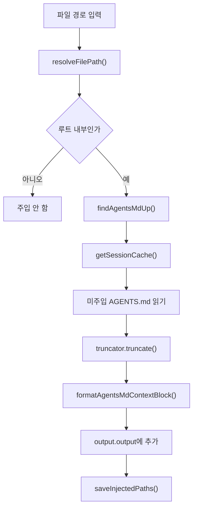

# agents md core

## agents-md-core 모듈

`agents-md-core`는 파일 경로를 기준으로 상위 디렉터리의 `AGENTS.md` 지시문을 찾아, 아직 주입되지 않은 디렉터리 컨텍스트만 출력 본문에 덧붙이는 경량 코어 모듈입니다. OpenCode/Codex 어댑터가 실제 세션 출력에 계층형 지시문을 주입할 때 공통으로 사용할 수 있도록, 경로 정규화, 세션별 중복 방지, 내용 축약, 포맷팅을 분리해 제공합니다.

핵심 공개 API는 `processFilePathForAgentsInjection()`입니다. 이 함수는 단일 파일 경로를 입력받아 다음을 수행합니다.

1. `rootDirectory` 내부의 안전한 파일 경로인지 확인합니다.
2. 해당 파일의 디렉터리부터 루트까지 `findAgentsMdUp()`으로 `AGENTS.md`를 찾습니다.
3. 세션 캐시에 이미 주입한 디렉터리는 건너뜁니다.
4. 파일 내용을 읽고 `AgentsMdTruncator`로 축약합니다.
5. `formatAgentsMdContextBlock()`으로 출력 블록을 만들어 `output.output`에 추가합니다.
6. 새로 주입된 경로가 있으면 `AgentsMdInjectedPathsStorage`에 저장합니다.



## 공개 API

### `processFilePathForAgentsInjection(input): Promise<void>`

모듈의 진입점입니다. 파일 경로 하나를 처리해 필요한 `AGENTS.md` 컨텍스트를 출력 문자열에 추가합니다.

중요한 입력 필드는 다음과 같습니다.

- `rootDirectory`: 컨텍스트 탐색을 허용할 프로젝트 루트입니다.
- `filePath`: 사용자가 읽었거나 도구가 반환한 파일 경로입니다.
- `sessionID`: 세션별 중복 주입을 구분하는 키입니다.
- `output`: 실제로 수정되는 출력 객체입니다. `output.output`이 문자열일 때만 처리합니다.
- `truncator`: `AGENTS.md` 내용을 세션별 정책에 맞게 축약하는 구현체입니다.
- `sessionCaches`: 프로세스 메모리의 세션별 캐시입니다.
- `storage`: 세션 캐시를 영속 저장소와 동기화하는 구현체입니다.
- `agentsMdCache`: `@oh-my-opencode/rules-engine`의 `findAgentsMdUp()`에 전달되는 선택 캐시입니다.

이 함수는 실패를 공격적으로 전파하지 않습니다. 파일 경로가 비어 있거나 루트 밖이면 즉시 반환하고, `AGENTS.md` 읽기에 실패하면 해당 파일만 건너뜁니다. 따라서 호출자는 도구 출력 생성 흐름 안에서 안전하게 이 함수를 호출할 수 있습니다.

### `resolveFilePath(rootDirectory, path): string | null`

입력 경로를 루트 기준의 안전한 절대 경로로 변환합니다. 상대 경로는 `resolve(rootDirectory, path)`로 해석하고, 절대 경로는 그대로 검사합니다.

내부적으로 `canonicalizePath()`가 `realpathSync()`를 사용해 심볼릭 링크를 해소합니다. 경로가 아직 존재하지 않아 `realpathSync()`가 실패하면 `resolve(path)`를 fallback으로 사용합니다. 이후 `isSameOrChildPath()`가 `relative(parentPath, childPath)` 결과를 확인해 루트와 같은 경로이거나 루트 하위 경로일 때만 통과시킵니다.

이 설계는 `../` 경로, 루트 밖 절대 경로, 루트 밖을 가리키는 심볼릭 링크를 통한 컨텍스트 주입을 차단합니다.

### `formatAgentsMdContextBlock(input): string`

읽어 온 `AGENTS.md` 내용을 출력에 붙일 수 있는 블록 문자열로 변환합니다.

형식은 다음 패턴을 따릅니다.

```text
[Directory Context: /path/to/AGENTS.md]
<축약된 내용>
[Note: Content was truncated to save context window space. For full context, please read the file directly: /path/to/AGENTS.md]
```

`input.truncated`가 `false`이면 축약 안내 문구를 붙이지 않습니다. 축약 안내의 접두사와 접미사는 `TRUNCATION_NOTICE_PREFIX`, `TRUNCATION_NOTICE_SUFFIX` 상수로 관리됩니다.

### `getSessionCache(input): Set<string>`

세션별 주입 이력을 메모리 캐시에서 가져오거나, 없으면 `storage.loadInjectedPaths(sessionID)`로 로드한 뒤 `sessionCaches`에 저장합니다.

캐시에 저장되는 값은 `AGENTS.md` 파일 경로가 아니라 `dirname(agentsPath)`입니다. 같은 디렉터리의 `AGENTS.md`는 한 세션에서 한 번만 주입됩니다.

## 타입 계약

### `AgentsMdTruncator`

```ts
export interface AgentsMdTruncator {
  truncate(sessionID: string, content: string): Promise<TruncationResult>;
}
```

축약 정책은 이 모듈 밖에서 주입합니다. `agents-md-core`는 토큰 예산, 문자 수 제한, 모델별 컨텍스트 정책을 알지 않습니다. 대신 `truncate()` 결과의 `result`와 `truncated`만 사용합니다.

### `AgentsMdContextOutput`

```ts
export interface AgentsMdContextOutput {
  readonly title: string;
  output: string;
  readonly metadata: unknown;
}
```

`processFilePathForAgentsInjection()`은 `output.output`만 변경합니다. `title`과 `metadata`는 읽기 전용으로 취급되며 이 모듈에서 해석하지 않습니다.

### `AgentsMdInjectedPathsStorage`

```ts
export interface AgentsMdInjectedPathsStorage {
  loadInjectedPaths(sessionID: string): Set<string>;
  saveInjectedPaths(sessionID: string, paths: Set<string>): void;
}
```

세션 간 또는 훅 호출 간 중복 주입을 막기 위한 저장소 추상화입니다. 구현체는 파일, 메모리, 런타임 상태 저장소 등 어떤 방식이든 사용할 수 있습니다.

## 처리 흐름

`processFilePathForAgentsInjection()`의 흐름은 방어적인 조기 반환으로 시작합니다.

먼저 `input.output.output`이 문자열인지 확인합니다. 도구 결과가 문자열이 아닌 구조화 출력이면 이 모듈은 아무것도 하지 않습니다. 그 다음 `resolveFilePath()`로 `filePath`를 검증합니다. 루트 밖 경로이거나 빈 경로이면 `null`이 반환되고 컨텍스트 주입은 중단됩니다.

검증된 파일 경로의 디렉터리를 기준으로 `findAgentsMdUp()`을 호출합니다. 이 함수는 `@oh-my-opencode/rules-engine`에서 제공되며, `startDir`부터 `rootDir`까지 올라가며 적용 가능한 `AGENTS.md` 경로 목록을 찾습니다. 파일명 상수 `AGENTS_FILENAME`도 같은 패키지에서 재내보내므로, 이 모듈은 규칙 엔진과 동일한 파일명 계약을 공유합니다.

찾은 각 `AGENTS.md`에 대해 `dirname(agentsPath)`가 세션 캐시에 있는지 검사합니다. 이미 있다면 같은 세션에서 주입한 컨텍스트이므로 건너뜁니다. 없다면 파일을 읽고, 읽기에 성공한 경우에만 캐시에 디렉터리를 추가합니다.

파일 내용은 곧바로 출력에 붙이지 않고 `input.truncator.truncate(sessionID, content)`를 거칩니다. 축약 결과는 `formatAgentsMdContextBlock()`으로 감싼 뒤 `input.output.output += ...` 형태로 누적됩니다. 하나 이상의 새 컨텍스트가 주입되면 마지막에 `storage.saveInjectedPaths(sessionID, cache)`를 호출해 저장소를 갱신합니다.

## 코드베이스 연결 지점

이 모듈은 직접 외부 실행 흐름을 만들지 않는 순수한 주입 보조 계층입니다. 실제 `AGENTS.md` 탐색 규칙은 `@oh-my-opencode/rules-engine`의 `findAgentsMdUp()`과 `AGENTS_FILENAME`에 의존합니다. 따라서 파일명, 상위 디렉터리 탐색 순서, 탐색 캐시의 의미는 rules-engine 쪽 계약과 함께 유지되어야 합니다.

반대로 출력 대상, 세션 저장소, 축약 정책은 호출자가 주입합니다. 이 구조 덕분에 OpenCode 어댑터, Codex 어댑터, 테스트 환경은 같은 `processFilePathForAgentsInjection()`을 쓰면서도 서로 다른 저장소와 컨텍스트 예산 정책을 적용할 수 있습니다.

현재 확인되는 직접 호출자는 `injector.test.ts`입니다. 운영 경로에서는 어댑터나 훅 계층이 파일 도구 출력 후처리 단계에서 이 모듈을 호출하는 형태가 자연스럽습니다.

## 변경 시 주의점

경로 검증 로직을 수정할 때는 `resolveFilePath()`의 보안 역할을 먼저 확인해야 합니다. 이 함수는 단순한 경로 정규화가 아니라 루트 밖 파일의 `AGENTS.md` 주입을 막는 경계입니다. 특히 `realpathSync()` fallback, 절대 경로 처리, `relative()` 기반 하위 경로 판정은 함께 검토해야 합니다.

세션 캐시 키를 바꿀 때는 중복 주입 의미가 달라집니다. 현재는 `AGENTS.md` 파일 자체가 아니라 그 파일이 있는 디렉터리를 캐시합니다. 같은 디렉터리 컨텍스트를 한 번만 주입하려는 의도입니다.

`formatAgentsMdContextBlock()`의 문자열 형식을 바꾸면 downstream 파서나 스냅샷 테스트에 영향을 줄 수 있습니다. 특히 `[Directory Context: ...]` 헤더와 truncation notice 문구는 사용자에게 노출되는 출력 계약입니다.

`processFilePathForAgentsInjection()`은 `output.output`을 직접 변경하는 함수입니다. 새 호출부를 만들 때는 동일한 `output` 객체가 다른 후처리 단계에서도 변경될 수 있음을 고려해 호출 순서를 명확히 해야 합니다.