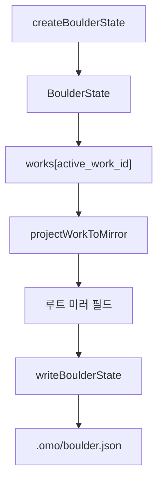
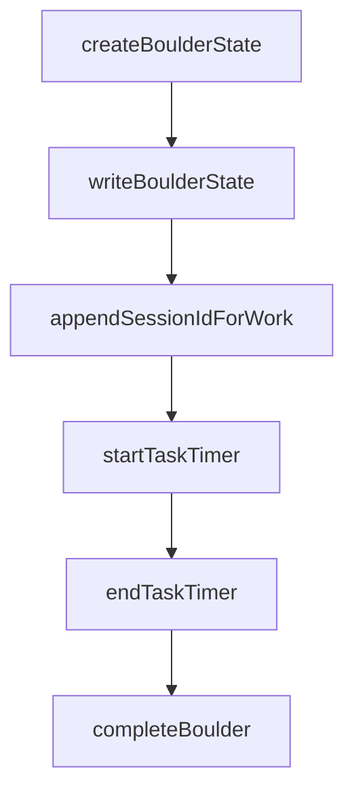

# boulder state

## Boulder State 모듈

`packages/boulder-state`는 Boulder 작업 상태를 `.omo/boulder.json`에 저장하고, Prometheus 계획 파일의 진행률과 현재 실행 중인 최상위 작업을 읽는 순수 파일 기반 상태 모듈입니다. 외부 서비스 호출은 없고, `node:fs`와 `node:path`만 사용합니다.

이 모듈의 핵심 역할은 다음 세 가지입니다.

- 현재 작업과 여러 작업(`works`)의 실행 상태를 읽고 씁니다.
- 세션 ID, 작업별 세션 상태, 타이머 정보를 추적합니다.
- `.omo/plans` 또는 legacy `.sisyphus/plans` 아래의 계획 Markdown을 읽어 진행률과 다음 작업을 계산합니다.

## 저장 위치와 공개 진입점

상태 파일 경로는 `constants.ts`에 고정되어 있습니다.

```ts
export const BOULDER_DIR = ".omo"
export const BOULDER_FILE = "boulder.json"
export const BOULDER_STATE_PATH = `${BOULDER_DIR}/${BOULDER_FILE}`
export const PROMETHEUS_PLANS_DIR = ".omo/plans"
```

대부분의 소비자는 `src/index.ts`에서 재수출되는 API를 사용합니다. 내부 하위 모듈을 직접 import하기보다 `@oh-my-opencode/boulder-state`의 공개 export를 통해 접근하는 구조입니다.

주요 공개 함수는 다음 계층으로 나뉩니다.

- 상태 읽기: `readBoulderState`, `getBoulderWorks`, `getActiveWorks`, `getWorkById`, `getWorkForSession`, `getWorkResumeOptions`
- 상태 쓰기: `createBoulderState`, `writeBoulderState`, `addBoulderWork`, `selectActiveWork`, `completeBoulder`, `clearBoulderState`
- 세션 추적: `appendSessionId`, `appendSessionIdForWork`, `normalizeSessionId`
- 작업 세션 추적: `upsertTaskSessionState`, `upsertTaskSessionStateForWork`, `startTaskTimer`, `endTaskTimer`
- 계획 파싱: `findPrometheusPlans`, `getPlanName`, `getPlanProgress`, `getPlanChecklist`, `parsePlanChecklist`, `readCurrentTopLevelTask`
- 경로 해석: `getBoulderFilePath`, `resolveBoulderPlanPath`, `resolveBoulderPlanPathForWork`

## 상태 모델

`BoulderState`는 파일 전체의 루트 상태이고, `BoulderWorkState`는 개별 작업 단위입니다. 현재 구현은 `schema_version: 2`의 다중 작업 구조를 중심으로 동작하지만, 이전 단일 작업 필드도 계속 지원합니다.

```ts
interface BoulderState {
  schema_version?: 2
  active_work_id?: string
  works?: Record<string, BoulderWorkState>
  active_plan: string
  started_at: string
  status?: BoulderWorkStatus
  session_ids: string[]
  plan_name: string
  task_sessions?: Record<string, TaskSessionState>
}
```

중요한 호환성 패턴은 “미러 필드”입니다. `BoulderState` 루트에는 `active_plan`, `status`, `session_ids`, `task_sessions` 같은 단일 작업 필드가 남아 있고, `works[active_work_id]`에도 같은 정보가 있습니다. `projectWorkToMirror()`는 선택된 `BoulderWorkState`를 루트 필드에 투영하고, `writeBoulderState()`는 쓰기 직전에 루트 값을 active work에도 다시 반영합니다.



이 구조 덕분에 새 코드는 `works` 기반으로 여러 작업을 다룰 수 있고, 기존 코드는 루트의 `active_plan`, `session_ids`, `task_sessions`를 계속 읽을 수 있습니다.

## 읽기 경로와 정규화

`readBoulderState(directory)`는 `${directory}/.omo/boulder.json`을 읽고 JSON 객체인지 확인한 뒤, `normalizeState()`를 통해 오래된 상태와 부분적으로 손상된 필드를 보정합니다.

정규화에서 처리하는 내용은 다음과 같습니다.

- `session_ids`가 문자열 배열이 아니면 빈 배열로 보정합니다.
- 세션 ID는 `normalizeSessionId()`로 `opencode:` 접두사를 붙입니다.
- `session_origins`가 객체가 아니면 `{}`로 보정합니다.
- 단일 세션만 있고 origin이 없으면 `"direct"`로 채웁니다.
- `task_sessions`가 객체가 아니면 `{}`로 보정합니다.
- `works` 내부의 각 work에도 같은 세션 정규화를 적용합니다.
- `works`가 있으면 `selectMirrorWork()`로 현재 미러 대상 work를 선택하고 루트 필드를 갱신합니다.

`normalizeSessionId(sessionId, platform = "opencode")`는 이미 `codex:` 또는 `opencode:` 접두사가 있는 값은 그대로 두고, 접두사가 없으면 기본적으로 `opencode:`를 붙입니다.

## 쓰기 경로와 작업 생명주기

`createBoulderState(planPath, sessionId, agent?, worktreePath?)`는 새 상태 객체를 메모리에서 생성합니다. 파일에 쓰지는 않으므로 호출자가 `writeBoulderState()`를 호출해야 합니다.

`writeBoulderState(directory, state)`는 `.omo` 디렉터리가 없으면 생성하고, 함께 `.omo/.gitignore`를 씁니다. 이 `.gitignore`는 기본적으로 `.omo` 내부 산출물을 무시하되 `rules/`만 추적 가능하게 둡니다.

작업 생명주기에서 많이 쓰이는 흐름은 다음과 같습니다.



`addBoulderWork(directory, input)`는 기존 상태에 새 `BoulderWorkState`를 추가하고 그 work를 active work로 선택합니다. 내부적으로 기존 상태를 `readBoulderState()`로 읽고, `getBoulderWorks()`로 legacy mirror work까지 포함한 목록을 만든 뒤, 새 work를 `works` 맵에 병합합니다.

`selectActiveWork(directory, workId)`는 지정한 work를 active로 바꾸고 `projectWorkToMirror()`를 호출해 루트 미러 필드를 갱신합니다.

`completeBoulder(directory, workId?, endedAt?)`는 대상 work를 `"completed"`로 표시하고 `ended_at`, `elapsed_ms`, `updated_at`을 채웁니다. 이미 완료되어 있고 `ended_at`, `elapsed_ms`가 있으면 상태를 다시 쓰지 않고 그대로 반환합니다.

## 세션과 작업 세션

세션은 작업을 이어받거나 여러 실행 표면에서 같은 Boulder 작업에 붙을 때 사용됩니다.

`appendSessionId(directory, sessionId, origin = "direct")`는 현재 상태에 `active_work_id`가 있으면 `appendSessionIdForWork()`로 위임합니다. active work가 없는 legacy 상태에서는 루트 `session_ids`와 `session_origins`를 직접 갱신합니다.

`appendSessionIdForWork(directory, workId, sessionId, origin = "direct")`는 특정 work의 `session_ids`에 정규화된 세션 ID를 추가하고, `session_origins`에 `"direct"` 또는 `"appended"`를 기록합니다. 대상 work가 active work이면 루트 미러도 함께 갱신합니다.

작업 단위 세션 상태는 `TaskSessionState`로 저장됩니다.

```ts
interface TaskSessionState {
  task_key: string
  task_label: string
  task_title: string
  session_id: string
  agent?: string
  category?: string
  started_at?: string
  ended_at?: string
  elapsed_ms?: number
  status?: "running" | "completed" | "cancelled"
  updated_at: string
}
```

`upsertTaskSessionStateForWork()`는 특정 work의 `task_sessions[taskKey]`를 생성하거나 갱신합니다. 기존 task session에 `started_at`, `ended_at`, `elapsed_ms`, `status`가 있으면 보존합니다. `taskKey`가 `"__proto__"`, `"prototype"`, `"constructor"` 중 하나이면 prototype pollution을 막기 위해 `null`을 반환합니다.

`startTaskTimer()`는 task session을 upsert한 뒤 `started_at`과 `status: "running"`을 설정합니다. `endTaskTimer()`는 `ended_at`, `elapsed_ms`, `status: "completed"`를 설정합니다. 경과 시간은 `getElapsedMs(startedAt, endedAt)`가 ISO 문자열을 `Date.parse()`로 변환해 계산합니다.

## 계획 파일 진행률

계획 관련 함수는 Prometheus 계획 Markdown을 직접 읽습니다.

`findPrometheusPlans(directory)`는 다음 두 위치에서 `.md` 파일을 찾고, 수정 시간이 최신인 순서로 정렬합니다.

- `.omo/plans`
- `.sisyphus/plans`

`getPlanProgress(planPath)`는 계획 파일의 체크박스를 세어 `PlanProgress`를 반환합니다.

```ts
interface PlanProgress {
  total: number
  completed: number
  isComplete: boolean
}
```

파일에 `## TODOs` 또는 `## Final Verification Wave` 섹션이 있으면 구조화된 계획으로 처리합니다. 이 경우 최상위 체크박스만 세며, 들여쓰기된 하위 체크박스는 제외됩니다. 또한 `TODOs` 섹션은 `1. ...` 형식, `Final Verification Wave` 섹션은 `F1. ...` 형식의 작업만 카운트합니다.

구조화된 섹션이 없으면 전체 문서에서 최상위 `- [ ]`, `- [x]`, `* [ ]`, `* [x]` 체크박스를 단순 집계합니다.

`getPlanChecklist(planPath)`와 `parsePlanChecklist(markdown)`는 유사하지만, 반환값에 `remaining`과 `nextTaskLabel`이 포함됩니다.

```ts
interface PlanChecklist {
  total: number
  completed: number
  remaining: number
  nextTaskLabel: string | null
}
```

`parsePlanChecklist()`는 `## TODOs`와 `## Final Verification Wave`가 하나라도 있으면 그 두 섹션만 카운트하고, 없으면 문서 전체의 `- [ ]`, `- [x]` 체크박스를 카운트합니다. 이 함수는 `* [ ]` 형식은 세지 않고 `- [ ]` 형식만 인식합니다.

## 현재 최상위 작업 읽기

`readCurrentTopLevelTask(planPath)`는 계획 파일에서 아직 완료되지 않은 첫 번째 최상위 작업을 찾습니다.

반환 타입은 `TopLevelTaskRef`입니다.

```ts
interface TopLevelTaskRef {
  key: string
  section: "todo" | "final-wave"
  label: string
  title: string
}
```

인식 대상은 다음 두 섹션입니다.

- `## TODOs` 아래의 `- [ ] 1. 작업 제목`
- `## Final Verification Wave` 아래의 `- [ ] F1. 검증 제목`

들여쓰기된 체크박스는 하위 항목으로 간주되어 무시됩니다. 예를 들어 `- [ ] 2. 구현`은 `key: "todo:2"`가 되고, `- [ ] F1. 최종 검증`은 `key: "final-wave:f1"`이 됩니다.

## 경로 해석과 worktree 지원

`getBoulderFilePath(directory)`는 항상 `${directory}/.omo/boulder.json`을 반환합니다.

`resolveBoulderPlanPath(directory, state)`는 `state.active_plan`을 절대 경로로 해석합니다. `state.worktree_path`가 있으면, 기준 디렉터리 안에 있는 상대 계획 경로를 worktree 쪽으로 다시 매핑합니다. 단, 계산된 worktree 계획 파일이 실제로 존재할 때만 worktree 경로를 반환하고, 없으면 원래 계획 경로를 반환합니다.

이 로직은 원본 프로젝트와 worktree가 같은 상대 위치의 계획 파일을 공유하는 경우에만 worktree 계획을 우선합니다. `active_plan`이 기준 디렉터리 밖에 있거나 절대 경로 관계가 깨지면 원래 경로를 유지합니다.

## 실패 처리 규칙

이 모듈은 상태 파일이 없거나 읽기, 파싱, 쓰기에 실패할 때 예외를 전파하기보다 보수적인 값을 반환하는 쪽으로 설계되어 있습니다.

- `readBoulderState()`는 실패 시 `null`
- `writeBoulderState()`, `clearBoulderState()`는 실패 시 `false`
- `getActiveWorks()`, `findPrometheusPlans()`는 실패 시 `[]`
- `getPlanProgress()`는 실패 시 `{ total: 0, completed: 0, isComplete: false }`
- `getPlanChecklist()`는 실패 시 빈 체크리스트
- `readCurrentTopLevelTask()`는 실패 시 `null`

기여할 때는 이 실패 모델을 유지하는 것이 중요합니다. Boulder 상태는 런타임 보조 상태이므로, 손상된 파일 하나가 전체 하네스 실행을 중단하지 않도록 설계되어 있습니다.