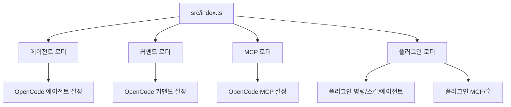
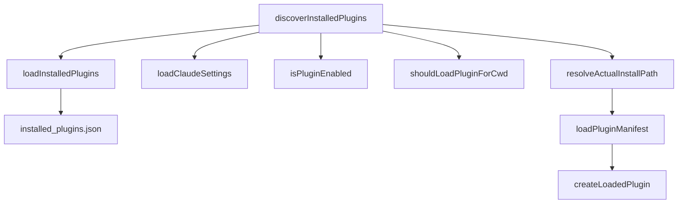

# claude code compat core

## Claude Code 호환 코어

`claude-code-compat-core`는 Claude Code의 확장 표면을 OpenCode/oh-my-openagent 런타임에서 사용할 수 있는 형태로 읽고 변환하는 호환 계층입니다. 이 모듈은 Claude Code의 에이전트, 커맨드, MCP 설정, 플러그인 설치 정보를 직접 실행하지 않고, OpenCode 쪽 설정 객체로 정규화해 상위 어댑터가 합칠 수 있게 만듭니다.

주요 진입점은 `src/index.ts`이며 다음 기능을 다시 내보냅니다.

- `claude-code-agent-loader`: Claude Code/Opencode 에이전트 정의 로딩
- `claude-code-command-loader`: Claude Code/Opencode 커맨드 파일 로딩
- `claude-code-mcp-loader`: `.mcp.json` 로딩 및 OpenCode MCP 설정 변환
- `claude-code-plugin-loader`: Claude Code 플러그인 발견 및 구성 요소 로딩



## 에이전트 로딩

에이전트 로더는 Claude Code 스타일의 Markdown 에이전트와 JSON/JSONC 에이전트 정의를 `ClaudeCodeAgentConfig`로 변환합니다.

핵심 타입은 `features/claude-code-agent-loader/types.ts`에 있습니다.

- `AgentScope`: `"user"`, `"project"`, `"opencode"`, `"opencode-project"`, `"definition-file"`, `"opencode-config"`
- `ClaudeCodeAgentConfig`: OpenCode가 소비하는 에이전트 설정
- `AgentFrontmatter`: Markdown frontmatter 스키마
- `AgentJsonDefinition`: JSON/JSONC 에이전트 정의 스키마
- `LoadedAgent`: 파일 경로, 스코프, 변환된 설정을 함께 담는 내부 로딩 결과

### Markdown 에이전트

`parseMarkdownAgentFile(filePath, scope, anthropicProvider?)`는 `.md` 파일을 읽고 frontmatter와 본문을 분리합니다.

변환 규칙은 다음과 같습니다.

- 파일이 없으면 `null`을 반환합니다.
- 에이전트 이름은 `data.name`이 있으면 그것을 쓰고, 없으면 파일명에서 `.md`를 제거해 사용합니다.
- 설명은 `(${scope}) ${description}` 형태로 스코프를 앞에 붙입니다.
- `mode`가 없으면 `"subagent"`를 기본값으로 사용합니다.
- 본문은 `prompt: body.trim()`으로 저장합니다.
- `model`은 `mapClaudeModelToOpenCode()`로 OpenCode 모델 문자열로 변환합니다.
- `tools`는 `parseToolsConfig()`로 `Record<string, boolean>` 형태로 변환합니다.

예를 들어 다음 frontmatter는:

```md
---
name: reviewer
description: 코드 리뷰 담당
model: sonnet
tools: read, grep
---

리뷰 기준을 적용합니다.
```

대략 다음 형태의 설정으로 변환됩니다.

```ts
{
  description: "(project) 코드 리뷰 담당",
  mode: "subagent",
  prompt: "리뷰 기준을 적용합니다.",
  model: "anthropic/claude-sonnet-4-6",
  tools: {
    read: true,
    grep: true,
  },
}
```

### JSON/JSONC 에이전트

`parseJsonAgentFile(filePath, scope)`는 JSONC 파서를 통해 에이전트 정의를 읽습니다.

이 함수는 다음 조건을 만족하지 않으면 `null`을 반환합니다.

- 파일이 존재해야 합니다.
- `parseJsoncSafe()` 결과에 `data`가 있어야 합니다.
- `data.name`과 `data.prompt`가 있어야 합니다.

Markdown 로더와 동일하게 설명에는 스코프가 붙고, `mode` 기본값은 `"subagent"`입니다. `prompt`는 `data.prompt.trim()`으로 정리됩니다.

### 디렉터리 기반 로딩

`loader.ts`는 실제 위치별 에이전트 로딩 함수를 제공합니다.

- `loadUserAgents(anthropicProvider?)`: `getClaudeConfigDir()/agents`에서 사용자 에이전트를 읽습니다.
- `loadProjectAgents(directory?, anthropicProvider?)`: `<directory>/.claude/agents`에서 프로젝트 에이전트를 읽습니다.
- `loadOpencodeGlobalAgents()`: OpenCode 전역 설정 디렉터리들의 `agents`를 읽습니다.
- `loadOpencodeProjectAgents(directory?)`: `<directory>/.opencode/agents`에서 프로젝트 OpenCode 에이전트를 읽습니다.

내부의 `loadAgentsFromDir()`는 Markdown 파일만 처리합니다. JSON/JSONC 에이전트 파일은 명시적 경로 목록을 받는 `loadAgentDefinitions()` 경로에서 처리됩니다.

### OpenCode 설정 안의 에이전트

`readOpencodeConfigAgents(directory)`는 다음 설정 파일을 순서대로 읽습니다.

- `<directory>/.opencode/opencode.json`
- `<directory>/.opencode/opencode.jsonc`
- `<globalConfigDir>/opencode.json`
- `<globalConfigDir>/opencode.jsonc`

설정 안에서는 두 가지 형식을 지원합니다.

- `agents` 또는 `agent`: inline 에이전트 정의
- `agent_definitions`: 외부 에이전트 정의 파일 경로 문자열 또는 배열

`convertInlineAgent()`는 inline 객체를 `ClaudeCodeAgentConfig`로 변환합니다. `mode`는 `"subagent"`, `"primary"`, `"all"` 중 하나일 때만 유지되고, 그 외 값은 `"subagent"`로 떨어집니다.

`agent_definitions`는 `resolveAgentDefinitionPaths()`로 해석됩니다. 상대 경로는 설정 파일 디렉터리 기준이며, 프로젝트 경계 밖 경로는 거부됩니다. 그 뒤 `loadAgentDefinitions()`가 `.md`, `.json`, `.jsonc` 파일을 읽어 에이전트 설정으로 변환합니다.

## 모델 이름 매핑

`claude-model-mapper.ts`는 Claude Code 스타일 모델 표기를 OpenCode 모델 형식으로 정규화합니다.

외부 API는 `mapClaudeModelToOpenCode(model, anthropicProvider?)`입니다. 반환값은 `{ providerID, modelID }`이며, 매핑할 수 없으면 `undefined`입니다.

지원하는 별칭은 다음과 같습니다.

- `"sonnet"` → `anthropic/claude-sonnet-4-6`
- `"opus"` → `anthropic/claude-opus-4-7`
- `"haiku"` → `anthropic/claude-haiku-4-5`

동작 규칙은 다음과 같습니다.

- `undefined`, 빈 문자열, `"inherit"`는 모델 override 없음으로 처리합니다.
- `anthropicProvider`가 주어지면 기본 provider prefix를 대체합니다.
- `provider/model` 형식이면 provider는 유지하고, model이 `claude-`로 시작할 때만 `normalizeModelID()`를 적용합니다.
- provider가 없는 값은 `normalizeModelID()` 후 `claude-`로 시작할 때만 Anthropic provider를 붙입니다.
- 최종 문자열은 `normalizeModelFormat()`을 거쳐 `{ providerID, modelID }`로 반환됩니다.

## 커맨드 로딩

커맨드 로더는 Claude Code의 Markdown 커맨드 파일을 OpenCode가 실행할 수 있는 `CommandDefinition`으로 변환합니다.

핵심 타입은 `features/claude-code-command-loader/types.ts`에 있습니다.

- `CommandScope`: `"user"`, `"project"`, `"opencode"`, `"opencode-project"`
- `CommandDefinition`: OpenCode 호환 커맨드 정의
- `CommandFrontmatter`: Markdown frontmatter 스키마
- `HandoffDefinition`: 커맨드 완료 후 다음 작업으로 넘길 수 있는 handoff 정의
- `LoadedCommand`: 로딩 중 사용하는 이름, 경로, 스코프, 정의 묶음

### 커맨드 파일 변환

`loadCommandsFromDir(commandsDir, scope, visited?, prefix?)`는 디렉터리를 재귀적으로 탐색합니다.

주요 규칙은 다음과 같습니다.

- `EXCLUDED_DIRS`에 포함된 디렉터리는 건너뜁니다.
- `.`으로 시작하는 디렉터리는 건너뜁니다.
- 심볼릭 링크나 순환 경로는 `realpath`와 `visited`로 중복 탐색을 막습니다.
- Markdown 파일만 커맨드로 처리합니다.
- 하위 디렉터리의 커맨드는 `prefix/name` 형태의 이름을 가집니다.

Markdown 본문은 항상 다음 템플릿으로 감쌉니다.

```xml
<command-instruction>
커맨드 파일 본문
</command-instruction>

<user-request>
$ARGUMENTS
</user-request>
```

frontmatter의 `description`, `agent`, `model`, `subtask`, `argument-hint`, `handoffs`를 읽습니다. `model`은 `sanitizeModelField()`를 거치며, OpenCode 소스에서 온 커맨드인지 Claude Code 소스에서 온 커맨드인지에 따라 sanitizer 모드가 달라집니다.

### 로딩 위치와 병합 순서

공개 함수는 다음과 같습니다.

- `loadUserCommands()`: `getClaudeConfigDir()/commands`
- `loadProjectCommands(directory?)`: `<directory>/.claude/commands`
- `loadOpencodeGlobalCommands()`: OpenCode 전역 `commands` 및 `command` 디렉터리
- `loadOpencodeProjectCommands(directory?)`: 현재 프로젝트 상위 경로의 `.opencode/commands` 및 `.opencode/command`
- `loadAllCommands(directory?)`: 위 네 종류를 모두 로딩해 병합

`loadAllCommands()`의 병합 순서는 다음과 같습니다.

```ts
{ ...projectOpencode, ...global, ...project, ...user }
```

즉 같은 이름이면 뒤에 오는 스코프가 앞의 값을 덮어씁니다. 최종 우선순위는 사용자 Claude Code 커맨드가 가장 높고, 프로젝트 OpenCode 커맨드가 가장 낮습니다.

`commandsToRecord()`는 중복 이름을 먼저 제거한 뒤, OpenCode 호환 출력을 위해 내부 필드인 `name`과 `argumentHint`를 제거합니다.

### 커맨드 캐시

`loader-cache.ts`는 `loadAllCommands()` 결과 Promise를 디렉터리별로 캐시합니다.

- `getCommandLoaderCacheKey(directory?)`: 실제 경로를 기준으로 캐시 키를 만듭니다.
- `getCachedCommands(cacheKey)`: 캐시된 Promise를 반환합니다.
- `setCachedCommands(cacheKey, commands)`: 로딩 Promise를 저장합니다.
- `deleteCachedCommands(cacheKey)`: 실패한 캐시를 제거합니다.
- `clearCommandLoaderCache()`: 전체 캐시를 비웁니다.

`loadAllCommands()`는 로딩 중 오류가 나면 `deleteCachedCommands()`를 호출해 실패한 Promise가 계속 재사용되지 않도록 합니다.

## MCP 설정 로딩

MCP 로더는 Claude Code의 `.mcp.json` 형식을 OpenCode MCP 설정으로 변환합니다.

핵심 타입은 `features/claude-code-mcp-loader/types.ts`에 있습니다.

- `ClaudeCodeMcpServer`: Claude Code 입력 형식
- `McpLocalConfig`: OpenCode local MCP 설정
- `McpRemoteConfig`: OpenCode remote MCP 설정
- `McpServerConfig`: local 또는 remote 설정
- `LoadedMcpServer`: 이름, 스코프, 변환된 설정
- `McpLoadResult`: 최종 서버 맵과 로딩 메타데이터

### 설정 파일 검색 순서

`getMcpConfigPaths()`는 다음 위치를 검사합니다.

- `~/.claude.json`
- `<CLAUDE_CONFIG_DIR 또는 ~/.claude>/.mcp.json`
- `<cwd>/.mcp.json`
- `<cwd>/.claude/.mcp.json`

각 경로에는 `"user"`, `"project"`, `"local"` 스코프가 붙습니다.

### 서버 변환

`transformMcpServer(name, server)`는 Claude Code 서버 설정을 OpenCode 설정으로 변환합니다.

원격 서버는 `type: "http"` 또는 `"sse"`입니다.

```ts
{
  type: "remote",
  url: expanded.url,
  enabled: true,
  headers?: expanded.headers,
  oauth?: expanded.oauth,
}
```

`url`이 없으면 오류를 던집니다.

로컬 서버는 기본값인 `stdio`입니다.

```ts
{
  type: "local",
  command: [expanded.command, ...(expanded.args ?? [])],
  enabled: true,
  environment?: expanded.env,
}
```

`command`가 없으면 오류를 던집니다.

환경 변수와 문자열 값은 변환 전에 `expandEnvVarsInObject()`로 확장됩니다.

### 환경 변수 allowlist

`configure-allowed-env-vars.ts`는 MCP 환경 변수 확장 정책을 관리합니다.

기본 허용 변수에는 `PATH`, `HOME`, `USER`, `SHELL`, `TMPDIR`, `XDG_CONFIG_HOME`, `APPDATA` 같은 일반 런타임 변수가 포함됩니다. `KEY`, `TOKEN`, `SECRET`, `PASSWORD`, `AUTH`, `CREDENTIAL` 패턴에 걸리는 이름은 민감 변수로 판단됩니다.

공개 함수는 다음과 같습니다.

- `getAllowedMcpEnvVars()`
- `isSensitiveMcpEnvVar(varName)`
- `isAllowedMcpEnvVar(varName)`
- `setAdditionalAllowedMcpEnvVars(varNames)`
- `resetAdditionalAllowedMcpEnvVars()`

`expandEnvVars()`와 `expandEnvVarsInObject()`는 `@oh-my-opencode/utils`의 `expandEnvReferences` 계열 함수를 사용합니다. 허용되지 않은 변수나 민감 변수는 확장하지 않고 로그를 남깁니다.

### 스코프 필터링과 비활성화

`shouldLoadMcpServer(server, cwd)`는 `server.scope !== "local"`이면 항상 로딩을 허용합니다. `scope: "local"`이면 `projectPath`가 있어야 하며, 현재 `cwd`가 그 경로 안에 있을 때만 로딩합니다.

`loadMcpConfigs(disabledMcps?)`는 설정 파일을 순서대로 읽으며 다음 규칙을 적용합니다.

- `disabledMcps`에 포함된 이름은 건너뜁니다.
- local scope가 현재 cwd와 맞지 않으면 건너뜁니다.
- 서버 설정에 `disabled: true`가 있으면 이미 로딩된 같은 이름의 서버도 제거합니다.
- 같은 이름이 다시 나오면 뒤쪽 설정이 앞쪽 설정을 대체합니다.
- 변환 실패는 전체 로딩 실패로 전파하지 않고 해당 서버만 건너뜁니다.

`getSystemMcpServerNames()`는 동일한 파일들을 동기적으로 읽어, 현재 활성화될 수 있는 MCP 서버 이름만 집합으로 반환합니다.

## Claude Code 플러그인 로딩

플러그인 로더는 Claude Code의 설치 데이터베이스를 읽고, 설치된 플러그인에서 커맨드, 스킬, 에이전트, MCP 서버, 훅 설정을 수집합니다.

가장 높은 수준의 API는 `loadAllPluginComponents(options?)`입니다. 테스트나 의존성 주입이 필요한 경우 `loadAllPluginComponentsWithDeps(options, deps)`를 사용합니다.

반환 타입은 `PluginComponentsResult`입니다.

```ts
{
  commands,
  skills,
  agents,
  mcpServers,
  hooksConfigs,
  plugins,
  errors,
}
```

### 플러그인 발견

`discoverInstalledPlugins(options?)`는 다음 흐름으로 설치된 플러그인을 찾습니다.



기본 플러그인 홈은 `~/.claude/plugins`입니다. `CLAUDE_PLUGINS_HOME` 또는 `pluginsHomeOverride`가 있으면 그 값을 사용합니다.

설치 데이터베이스는 세 형식을 지원합니다.

- v1: `{ version: 1, plugins: Record<string, PluginInstallation> }`
- v2: `{ version: 2, plugins: Record<string, PluginInstallation[]> }`
- v3: `InstalledPluginEntryV3[]`

`extractPluginEntries()`가 세 형식을 공통 `[pluginKey, installation]` 배열로 변환합니다. v3에서는 `name@marketplace` 형식의 plugin key를 만듭니다.

### 활성화 상태와 프로젝트 스코프

`isPluginEnabled(pluginKey, settingsEnabledPlugins, overrideEnabledPlugins)`는 플러그인이 활성화되어 있는지 판단합니다.

우선순위는 다음과 같습니다.

1. `PluginLoaderOptions.enabledPluginsOverride`
2. `~/.claude/settings.json`의 `enabledPlugins`
3. 기본값 `true`

`shouldLoadPluginForCwd(installation, cwd)`는 `scope`가 `"project"` 또는 `"local"`인 플러그인만 필터링합니다. 이 경우 `projectPath`가 필요하며, `~` prefix는 사용자 홈으로 확장됩니다. 현재 cwd가 `projectPath` 안에 있어야 플러그인을 로딩합니다.

### 설치 경로 복구

`resolveActualInstallPath(configuredInstallPath, pluginKey?)`는 설치 데이터베이스에 기록된 경로가 없어졌을 때 같은 부모 디렉터리 아래의 대체 설치 경로를 찾습니다.

후보는 다음 조건을 만족해야 합니다.

- 후보 디렉터리에 `.claude-plugin/plugin.json` 또는 `plugin.json`이 있어야 합니다.
- `pluginKey`가 있으면 manifest의 `name`이 `derivePluginNameFromKey(pluginKey)`와 같아야 합니다.

후보 정렬은 semver prefix를 우선합니다. `"unknown"`은 낮은 우선순위를 가지며, 안정 버전은 prerelease/build suffix가 붙은 버전보다 우선됩니다.

### 플러그인 구성 요소 수집

`loadAllPluginComponentsInternal()`은 발견된 `LoadedPlugin[]`을 바탕으로 구성 요소 로더를 병렬 실행합니다.

- `loadPluginCommands(plugins)`
- `loadPluginSkillsAsCommands(plugins)`
- `loadPluginAgents(plugins, anthropicProvider?)`
- `loadPluginMcpServers(plugins)`
- `loadPluginHooksConfigs(plugins)`

환경 변수 `OPENCODE_DISABLE_CLAUDE_CODE=true|1` 또는 `OPENCODE_DISABLE_CLAUDE_CODE_PLUGINS=true|1`가 설정되어 있으면 플러그인 로딩은 완전히 비활성화되고 빈 결과를 반환합니다.

결과는 `enabledPluginsOverride`와 `anthropicProvider`를 기준으로 캐시됩니다. 캐시된 결과는 `structuredClone()`으로 복제되어 반환되므로 호출자가 반환 객체를 수정해도 캐시 원본을 오염시키지 않습니다.

`clearPluginComponentsCache()`는 이 캐시를 초기화합니다.

## 플러그인 커맨드, 스킬, 에이전트

### 플러그인 커맨드

`loadPluginCommands(plugins)`는 각 플러그인의 `commandsDir`에서 Markdown 파일을 읽습니다.

- 이름은 `${plugin.name}:${commandName}`으로 namespace가 붙습니다.
- 본문은 일반 커맨드 로더와 같은 `<command-instruction>` / `<user-request>` 템플릿으로 감쌉니다.
- `${CLAUDE_PLUGIN_ROOT}` 문자열은 `resolvePluginPath()`로 설치 경로로 치환됩니다.
- `model`은 `sanitizeModelField(data.model, "claude-code")`를 거칩니다.
- OpenCode 호환 출력을 위해 내부 `name`, `argumentHint`는 제거됩니다.

### 플러그인 스킬

`loadPluginSkillsAsCommands(plugins)`는 각 플러그인의 `skillsDir` 아래 하위 디렉터리 또는 심볼릭 링크를 검사하고, 그 안의 `SKILL.md`를 커맨드처럼 변환합니다.

스킬 템플릿은 다음 정보를 포함합니다.

```xml
<skill-instruction>
Base directory for this skill: /resolved/skill/path/
File references (@path) in this skill are relative to this directory.

스킬 본문
</skill-instruction>

<user-request>
$ARGUMENTS
</user-request>
```

본문 처리 순서는 다음과 같습니다.

1. `resolveSkillPathReferences(body.trim(), resolvedPath)`로 `@dir/file.ext` 스타일 경로를 스킬 디렉터리 기준 절대 경로로 바꿉니다.
2. `resolvePluginPath()`로 `${CLAUDE_PLUGIN_ROOT}`를 설치 경로로 바꿉니다.
3. `sanitizeModelField(data.model)`로 모델 필드를 정리합니다.

스킬 이름은 frontmatter의 `name`이 있으면 그것을 사용하고, 없으면 디렉터리명을 사용합니다. 최종 이름은 `${plugin.name}:${skillName}`입니다.

### 플러그인 에이전트

`loadPluginAgents(plugins, anthropicProvider?)`는 각 플러그인의 `agentsDir`에서 Markdown 에이전트를 읽습니다.

- 이름은 `${plugin.name}:${agentName}`입니다.
- 설명은 `(plugin: ${plugin.name}) ...` 형태입니다.
- `mode`는 항상 `"subagent"`로 설정됩니다.
- 본문에는 `resolvePluginPath()`가 적용됩니다.
- `model`은 `mapClaudeModelToOpenCode()`로 변환됩니다.
- `tools`는 `parseToolsConfig()`로 변환됩니다.

## 플러그인 MCP와 훅

### 플러그인 MCP

`loadPluginMcpServers(plugins)`는 각 플러그인의 `.mcp.json`을 읽습니다.

처리 순서는 다음과 같습니다.

1. JSON 파싱
2. `resolvePluginPaths(config, plugin.installPath)`로 `${CLAUDE_PLUGIN_ROOT}` 치환
3. `expandEnvVarsInObject(config)`로 환경 변수 확장
4. `shouldLoadMcpServer(serverConfig, cwd)`로 local scope 필터링
5. `disabled: true` 서버 건너뛰기
6. `transformMcpServer(name, serverConfig)`로 OpenCode MCP 설정 변환
7. `${plugin.name}:${name}` 이름으로 결과에 저장

플러그인 MCP도 일반 MCP와 같은 변환 함수를 사용하므로 remote/local 출력 형식이 동일합니다.

### 플러그인 훅

`loadPluginHooksConfigs(plugins)`는 각 플러그인의 `hooks/hooks.json`을 읽습니다.

`resolvePluginPaths()`로 경로 치환을 먼저 수행한 뒤, `stampPluginRoot(config, plugin.installPath)`가 command/http hook action에 `pluginRoot`를 추가합니다. 이 값은 downstream dispatcher가 hook 프로세스를 실행할 때 `CLAUDE_PLUGIN_ROOT`를 설정할 수 있도록 연결 정보를 보존합니다.

`stampPluginRoot()`가 처리하는 action은 다음 두 종류입니다.

- `{ type: "command", ... }`
- `{ type: "http", ... }`

`prompt`나 `agent` 타입 훅에는 `pluginRoot`를 붙이지 않습니다.

## 공유 유틸리티

`src/shared`는 기능 로더들이 공통으로 사용하는 얇은 어댑터 계층입니다. 많은 함수는 다른 core 패키지에서 가져와 다시 내보냅니다.

중요한 유틸리티는 다음과 같습니다.

- `getClaudeConfigDir()`: `CLAUDE_CONFIG_DIR` 또는 사용자 홈의 `.claude`
- `getOpenCodeConfigDir()` / `getOpenCodeConfigDirs()`: CLI/Desktop OpenCode 설정 디렉터리 탐색
- `getOpenCodeCommandDirs()`: OpenCode `commands` / `command` 디렉터리 후보 생성
- `findProjectOpencodeCommandDirs()`: 현재 프로젝트 상위 경로에서 `.opencode/commands` 탐색
- `parseToolsConfig()`: `"read, grep"` 또는 `["read", "grep"]`을 `{ read: true, grep: true }`로 변환
- `resolveAgentDefinitionPaths()`: `agent_definitions` 경로를 안전하게 해석
- `resolveSkillPathReferences()`: 스킬 본문 안의 `@dir/file.ext` 참조를 스킬 기준 경로로 변환
- `log`: 공통 로그 파일 `oh-my-opencode.log`에 기록

## 경로와 설정 디렉터리 처리

OpenCode 설정 경로 처리는 플랫폼 차이를 고려합니다.

`getOpenCodeConfigDir({ binary })`는 다음을 구분합니다.

- `binary: "opencode"`: CLI 설정 디렉터리
- `binary: "opencode-desktop"`: Tauri 앱 설정 디렉터리

CLI 설정은 `OPENCODE_CONFIG_DIR`이 있으면 그것을 우선하고, 없으면 XDG 기본값 또는 플랫폼 홈 디렉터리 기반 경로를 사용합니다.

WSL 환경에서는 Windows 사용자 경로가 `XDG_CONFIG_HOME`으로 들어오는 경우를 피하기 위해 `isWslEnvironment()`, `isWindowsUserConfigRoot()`, `getWslLinuxHomeDir()`가 사용됩니다.

Desktop 설정은 Tauri app identifier를 기준으로 합니다.

- 안정 빌드: `ai.opencode.desktop`
- dev 빌드: `ai.opencode.desktop.dev`

`detectExistingConfigDir(binary, version?)`는 실제 `opencode.json` 또는 `opencode.jsonc`가 존재하는 첫 설정 디렉터리를 찾습니다.

## 병합과 우선순위 원칙

이 모듈의 로더들은 대체로 “여러 소스에서 읽고 마지막 또는 명시적으로 우선하는 값을 남기는” 방식으로 동작합니다.

에이전트 로더는 각 함수가 하나의 스코프를 반환하고, 상위 어댑터가 병합 순서를 결정할 수 있게 합니다. `readOpencodeConfigAgents()` 내부에서는 먼저 발견한 이름을 유지합니다.

커맨드 로더의 `loadAllCommands()`는 명시적인 병합 순서를 가집니다.

```ts
{ ...projectOpencode, ...global, ...project, ...user }
```

MCP 로더는 설정 파일 순서대로 같은 이름을 덮어쓰되, `disabled: true`가 나오면 이전에 로딩된 서버를 제거합니다.

플러그인 구성 요소는 플러그인 이름을 namespace로 사용합니다. 예를 들어 플러그인 `shell-tools`의 커맨드 `lint.md`는 `shell-tools:lint`로 노출됩니다. 이 방식은 플러그인 간 이름 충돌을 줄이고, 로딩 출처를 호출자가 추적할 수 있게 합니다.

## 오류 처리 방식

이 모듈은 호환 계층이므로, 개별 파일이나 플러그인 하나의 실패가 전체 런타임을 중단하지 않도록 설계되어 있습니다.

일반적인 패턴은 다음과 같습니다.

- 파일이 없으면 빈 결과 또는 `null` 반환
- 파싱 실패는 로그를 남기고 해당 항목만 건너뜀
- 잘못된 MCP 서버 하나는 건너뛰되 나머지 서버는 계속 로딩
- 플러그인 설치 경로가 없으면 `PluginLoadError`에 기록
- 캐시된 Promise가 실패하면 캐시에서 제거

단, `transformMcpServer()`처럼 단일 서버 변환 함수는 필수 필드가 없을 때 오류를 던집니다. 호출자는 이 오류를 잡아 해당 서버만 제외합니다.

## 나머지 코드베이스와의 연결

이 패키지는 직접 OpenCode plugin module을 만들지 않습니다. 대신 상위 패키지에서 필요한 구성 요소를 읽을 수 있는 순수 로더 API를 제공합니다.

대표적인 소비 패턴은 다음과 같습니다.

- OpenCode 어댑터가 `loadAllCommands()`로 Claude Code 커맨드를 가져와 OpenCode command registry에 합칩니다.
- 에이전트 구성 단계가 `loadUserAgents()`, `loadProjectAgents()`, `loadOpencodeGlobalAgents()`, `readOpencodeConfigAgents()` 결과를 합쳐 agent 설정을 구성합니다.
- MCP 구성 단계가 `loadMcpConfigs()`와 `loadPluginMcpServers()` 결과를 합쳐 OpenCode MCP 설정으로 전달합니다.
- 플러그인 호환 단계가 `loadAllPluginComponents()`로 Claude Code 플러그인의 commands, skills, agents, MCP, hooks를 한 번에 수집합니다.
- hook dispatcher는 `loadPluginHooksConfigs()`가 붙인 `pluginRoot`를 통해 hook 실행 시 플러그인 루트 경로를 복원합니다.

이 모듈의 책임은 “Claude Code 형식을 이해하고 안전하게 OpenCode 형식으로 바꾸는 것”까지입니다. 실제 실행, UI 노출, OpenCode hook 등록, MCP 프로세스 시작은 상위 어댑터와 런타임 계층의 책임입니다.