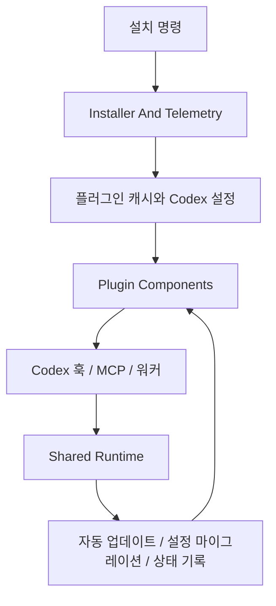

# Codex Adapter

## 개요

Codex Adapter는 `omo-codex`를 Codex CLI 안에서 설치, 실행, 유지보수하도록 묶는 어댑터 계층입니다. [Codex Installer And Telemetry](codex-installer-and-telemetry.md)가 플러그인을 Codex 환경에 배치하고, [Codex Plugin Components](codex-plugin-components.md)가 실제 훅·MCP·워커 실행 단위를 제공하며, [Codex Plugin Shared Runtime](codex-plugin-shared-runtime.md)이 세션 시작 이후의 자동 업데이트, 설정 마이그레이션, 번들 동기화 같은 공통 런타임 작업을 담당합니다.

세 하위 모듈은 “설치 시점의 정합성”과 “세션 실행 중의 안정성”을 나누어 책임집니다. `runCodexInstaller()`는 플러그인 캐시, 마켓플레이스 스냅샷, `config.toml`, 실행 파일 링크, 설치 텔레메트리를 맞춥니다. 설치된 뒤에는 컴포넌트 CLI들이 Codex 훅 이벤트를 받아 `comment-checker`, `rules`, `lsp`, `ulw-loop`, `lazycodex-executor-verify` 같은 기능을 짧은 훅 처리 또는 detached worker로 실행합니다. Shared Runtime은 `auto-update.mjs`, `runConfigMigration`, `resolveLazyCodexUpdatePlan` 같은 스크립트로 설치 상태를 계속 보정합니다.

## 함께 동작하는 흐름

가장 바깥 흐름은 설치입니다. `runCodexInstaller()`가 `readMarketplace()`와 `resolvePluginSource()`로 설치 원천을 결정한 뒤 `installCachedPlugin()`으로 캐시를 구성하고, `updateCodexConfig()`와 실행 파일 링크 단계로 Codex가 플러그인을 발견할 수 있게 만듭니다. 이 과정에서 `trustedHookStatesForPlugin()`과 `trackCodexInstallTelemetry()`가 각각 훅 신뢰 상태와 설치 관측성을 보강합니다.

실행 시점에는 Codex 훅 이벤트가 컴포넌트 CLI로 들어옵니다. 짧게 끝나는 작업은 `hookSpecificOutput`으로 바로 응답하고, 오래 걸리는 작업은 detached worker가 `state.json`, `bootstrap.log`, degraded ledger 같은 상태 파일에 결과를 남깁니다. 예를 들어 `rules`는 세션 시작과 압축 복구 상태를 관리하고, `lsp`는 파일 진단을 수집하며, `comment-checker`는 도구 결과에서 댓글 점검 요청을 추출합니다.

유지보수 흐름은 Shared Runtime이 맡습니다. 세션 시작 시 `runAutoUpdateCheck`가 설정 마이그레이션을 먼저 수행한 다음 설치 방식과 버전을 판정하고, 필요한 경우 LazyCodex 업데이트 계획을 실행합니다. 이 계층은 컴포넌트가 직접 설치 구조를 추측하지 않도록 `PLUGIN_ROOT`, `PLUGIN_DATA`, `CODEX_HOME` 기준의 공통 규칙을 제공합니다.

## 설계 포인트

Codex Adapter의 핵심은 훅을 빠르고 안전하게 유지하면서 무거운 작업을 별도 실행 단위로 밀어내는 것입니다. 설치 계층은 Codex가 플러그인을 올바르게 로드하도록 환경을 만들고, 컴포넌트 계층은 실제 사용자 세션의 기능을 제공하며, 공유 런타임은 시간이 지나며 어긋날 수 있는 설정·버전·번들 상태를 다시 맞춥니다.

세부 설치 절차는 [Codex Installer And Telemetry](codex-installer-and-telemetry.md), 개별 훅과 컴포넌트 실행 방식은 [Codex Plugin Components](codex-plugin-components.md), 자동 업데이트와 공유 스크립트 구조는 [Codex Plugin Shared Runtime](codex-plugin-shared-runtime.md)를 참조하면 됩니다.