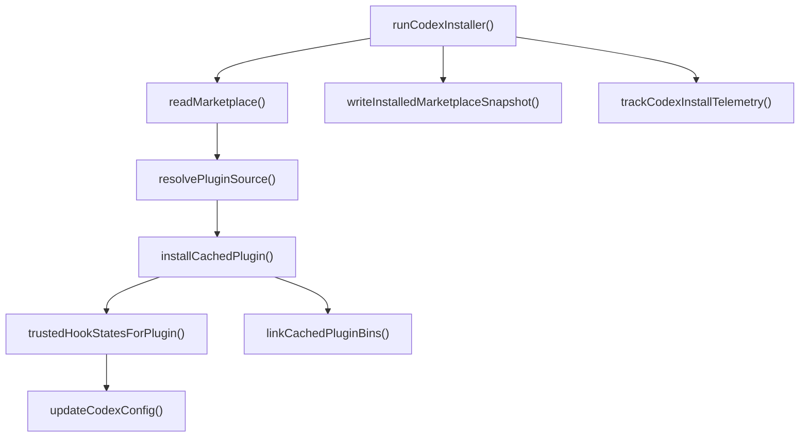

# Codex Installer And Telemetry

## 개요

Codex Installer And Telemetry 모듈은 `omo-codex`를 Codex CLI 환경에 설치하고, 설치된 플러그인 캐시·마켓플레이스 스냅샷·`config.toml`·명령어 링크·관리 에이전트·텔레메트리까지 한 번에 맞추는 설치 계층입니다.

공개 진입점은 `packages/omo-codex/src/index.ts`에서 `./install`과 `./telemetry`를 다시 내보내는 형태입니다. 설치 쪽의 중심 흐름은 `runCodexInstaller()`가 담당하며, 캐시 설치는 `installCachedPlugin()`, Codex 설정 갱신은 `updateCodexConfig()`, 명령어 연결은 `linkCachedPluginBins()`와 `linkRootRuntimeBin()`, 훅 신뢰 상태 계산은 `trustedHookStatesForPlugin()`, 설치 완료 텔레메트리는 `trackCodexInstallTelemetry()`로 분리되어 있습니다.

## 설치 흐름

설치 흐름은 “소스 준비 → 플러그인 캐시 구성 → 마켓플레이스/설정 반영 → 실행 파일 링크 → 보조 정리/텔레메트리” 순서로 이해하면 됩니다.



`installCachedPlugin()`은 설치 대상 플러그인을 `<codexHome>/plugins/cache/<marketplace>/<plugin>/<version>` 아래에 배치합니다. 기존 캐시를 직접 덮어쓰지 않고 임시 디렉터리에 먼저 복사한 뒤 `promoteDirectory()`로 교체합니다. 교체 실패 시 백업된 기존 디렉터리를 복원하므로, 설치 중간 실패가 기존 활성 캐시를 깨뜨리지 않도록 설계되어 있습니다.

캐시 배치 중에는 다음 후처리가 같이 수행됩니다.

- `rewriteCachedPackageLocalFileDependencies()`가 캐시 안의 `file:` 의존성을 소스 루트 기준 절대 경로로 보정합니다.
- `copyBundledMcpRuntimeDists()`가 `.mcp.json`에서 참조하는 번들 MCP 런타임 배포물을 캐시 안으로 복사합니다.
- `rewriteCachedMcpManifest()`가 상대 MCP 실행 인자를 캐시에서 실행 가능한 경로로 바꿉니다.
- `rewriteCachedManifestRoot()`가 임시 캐시 경로를 최종 캐시 경로로 치환합니다.
- `maybeRunNpmInstall()`과 `maybeRunNpmBuild()`가 `package.json`이 있는 경우에만 필요한 빌드 단계를 실행합니다.

## 플러그인 캐시와 MCP 런타임

캐시 관련 코드는 `codex-cache-*` 파일군에 모여 있습니다. 이 계층은 설치된 플러그인의 파일 배치와 런타임 실행 가능성을 책임집니다.

`copyBundledMcpRuntimeDists()`는 현재 두 MCP 런타임을 알고 있습니다.

- Git Bash MCP: `../../git-bash-mcp/dist/cli.js` → `components/git-bash-mcp/dist/cli.js`
- LSP daemon: `../../lsp-daemon/dist/cli.js` → `components/lsp-daemon/dist/cli.js`

`.mcp.json`의 `mcpServers.*.args`에 위 소스 인자가 있을 때만 해당 dist를 복사합니다. 따라서 사용하지 않는 MCP 런타임을 무조건 캐시에 포함하지 않습니다.

`resolveBundledMcpRuntimeArg()`는 소스 기준 인자를 캐시 기준 실행 인자로 바꾸는 작은 매핑 함수입니다. `rewriteCachedMcpManifest()`는 이 함수를 먼저 적용하고, 그 외 `./` 또는 `../`로 시작하는 인자는 `resolveCachedRuntimePath()`로 해석합니다. 이때 경로가 플러그인 캐시 내부에 머물 수 있으면 캐시 내부 경로를 쓰고, 캐시 밖을 가리켜야 하면 원본 소스 루트 기준 경로를 유지합니다.

## 명령어 링크

명령어 링크는 `codex-cache-bins.ts`가 담당합니다.

`linkCachedPluginBins()`는 플러그인 루트 아래의 `package.json`들을 재귀적으로 훑어 `bin` 항목을 찾고, Codex 로컬 bin 디렉터리에 실행 링크를 만듭니다. POSIX 계열에서는 심볼릭 링크를 만들고, Windows에서는 `COMMAND_SHIM_MARKER`가 포함된 `.cmd` shim을 씁니다.

중요한 안전 장치는 다음과 같습니다.

- `assertSafeCommandName()`은 빈 이름, `.`/`..`, 경로 구분자, NUL 문자가 들어간 명령 이름을 거부합니다.
- `resolvePackageBinTarget()`은 `bin` 대상이 해당 package root 안에 머무는지 확인합니다.
- `isReservedNestedBinName()`은 중첩 패키지가 `omo`, `lazycodex`, `lazycodex-ai`, `oh-my-opencode`, `oh-my-openagent` 같은 루트 런타임 명령을 덮어쓰지 못하게 합니다.
- `replaceSymlink()`, `replaceCommandShim()`, `replaceRuntimeWrapper()`는 기존 파일이 설치기가 만든 형식인지 확인한 뒤에만 교체합니다.

`linkRootRuntimeBin()`은 루트 CLI인 `omo`를 별도로 연결합니다. `dist/cli/index.js`가 존재하지 않으면 `null`을 반환하고 아무 작업도 하지 않습니다. 존재하면 POSIX에서는 실행 가능한 shell wrapper를, Windows에서는 `.cmd` wrapper를 생성합니다.

런타임 wrapper는 `posixRuntimeWrapper()`와 `windowsRuntimeWrapper()`가 생성합니다. wrapper는 `CODEX_HOME` 기본값을 설정하고, `OMO_SPARKSHELL_APP_SERVER_SOCKET` 기본 소켓 경로를 잡으며, `omo ulw-loop` 호출은 `omo-ulw-loop` 실행 파일로 위임합니다. 또한 `OMO_RUNTIME=node`가 설정되어 있고 node fallback CLI가 있으면 Bun 대신 Node 실행 경로를 사용합니다.

## Codex 설정 갱신

`updateCodexConfig()`는 설치기가 `config.toml`을 갱신하는 중심 함수입니다. 직접 문자열을 이어 붙이는 대신 `toml-section-editor` 계열 helper와 섹션 단위 파서를 사용해 기존 설정을 가능한 한 보존하면서 관리 대상 블록만 정리합니다.

주요 작업은 다음 순서로 진행됩니다.

1. 기존 `config.toml`을 읽거나 빈 설정에서 시작합니다.
2. `legacyMarketplaceNames()`가 반환하는 과거 marketplace 이름의 블록을 제거합니다.
3. 현재 marketplace 안에서 더 이상 유지하지 않을 plugin/hook state 블록을 제거합니다.
4. `removeStaleManagedAgentBlocks()`로 관리 대상 에이전트 중 더 이상 설치하지 않는 블록을 제거합니다.
5. `ensureFeatureEnabled()`로 `plugins`, `plugin_hooks`, `multi_agent`, `child_agents_md`를 켭니다.
6. `ensureCodexReasoningConfig()`로 관리 가능한 reasoning profile이면 현재 profile로 갱신합니다.
7. `ensureCodexMultiAgentV2Config()`로 `features.multi_agent_v2.max_concurrent_threads_per_session`을 설정합니다.
8. 필요할 때 `ensureAutonomousPermissions()`를 적용합니다.
9. `ensureMarketplaceBlock()`과 `ensurePluginEnabled()`로 marketplace와 plugin 활성화를 기록합니다.
10. `ensureOmoBuiltinMcpPolicies()`로 `context7`, `codegraph`, `git_bash` MCP 정책을 설정합니다.
11. `ensureHookTrusted()`로 동기 command hook의 trusted hash를 기록합니다.
12. `ensureAgentConfig()`로 관리 에이전트의 `config_file`을 연결합니다.
13. `writeFileAtomic()`으로 원자적 파일 쓰기를 수행합니다.

`preserveMarketplaceSource`가 `true`이고 기존 marketplace 블록이 이미 있으면 `ensureMarketplaceBlock()`을 건너뜁니다. 이는 marketplace-flow bootstrap worker처럼 기존 source 블록을 byte-identical하게 유지해야 하는 경로를 위한 옵션입니다.

## Reasoning profile과 multi_agent_v2

`ensureCodexReasoningConfig()`는 루트 설정의 `model`, `model_context_window`, `model_reasoning_effort`, `plan_mode_reasoning_effort`만 관리합니다. 기존 사용자가 알 수 없는 profile로 직접 바꿔 둔 경우에는 덮어쓰지 않습니다. 현재 설정이 비어 있거나 `managedProfiles` 중 하나와 일치할 때만 `readCodexModelCatalog()`에서 읽은 `current` profile을 적용합니다.

`readCodexModelCatalog()`는 `plugin/model-catalog.json`을 읽고, 파싱에 실패하면 fallback profile을 사용합니다. 이 fallback은 `gpt-5.5`, context window `400000`, reasoning effort `high`, plan mode reasoning effort `xhigh`를 기본값으로 둡니다.

`ensureCodexMultiAgentV2Config()`는 `multi_agent_v2` 기능 자체를 강제로 켜지 않습니다. 대신 legacy 위치의 `features.multi_agent_v2 = true`와 `agents.max_threads`를 제거하고, `features.multi_agent_v2.max_concurrent_threads_per_session = 10000`만 설정합니다. 실제 V2 활성화 여부는 런타임의 모델 카탈로그가 결정한다는 전제를 코드 주석과 구현이 같이 지키고 있습니다.

## 훅 신뢰 상태

`trustedHookStatesForPlugin()`은 플러그인의 `.codex-plugin/plugin.json`을 읽고, 그 안의 `hooks` 경로가 가리키는 hook manifest를 분석합니다. 대상은 동기 command hook입니다.

제외되는 hook은 다음과 같습니다.

- `async: true`인 hook
- `type`이 `"command"`가 아닌 hook
- `command`가 없거나 빈 문자열인 hook
- `EVENT_LABELS`에 매핑되지 않은 이벤트

각 hook의 key는 다음 구조입니다.

```text
<pluginName>@<marketplaceName>:<hooksPath>:<eventLabel>:<groupIndex>:<handlerIndex>
```

hash는 `commandHookHash()`가 계산합니다. 이 함수는 event name, matcher, command, timeout, statusMessage를 정규화한 뒤 `canonicalJson()`으로 키 순서를 안정화하고 SHA-256을 계산합니다. 결과는 `sha256:<hex>` 형식입니다.

이 값들은 `updateCodexConfig()`의 `trustedHookStates`로 전달되어 `[hooks.state."<key>"] trusted_hash = "<hash>"` 형태로 기록됩니다.

## 에이전트 연결과 보존

선언 파일 기준으로 에이전트 연결 API는 세 가지입니다.

- `capturePreservedAgentReasoning({ codexHome })`
- `capturePreservedAgentServiceTier({ codexHome })`
- `linkCachedPluginAgents({ codexHome, pluginRoot, preservedReasoning, preservedServiceTier })`

설치기는 관리 에이전트를 새로 링크하면서도 기존 agent TOML에 있던 reasoning effort와 service tier를 보존할 수 있습니다. call graph상 `linkCachedPluginAgents()`는 `restorePreservedServiceTier()`를 호출하고, `restorePreservedReasoning()`은 `extractReasoningEffort()`를 사용합니다. 즉 에이전트 파일을 단순 교체하는 것이 아니라, 사용자가 이전 설치에서 유지하던 중요한 실행 설정을 새 파일에 복원하는 방식입니다.

`updateCodexConfig()`는 `agentConfigs`를 받아 `[agents.<name>] config_file = "./agents/<name>.toml"` 형태의 설정 블록을 만듭니다. `removeStaleManagedAgentBlocks()`는 현재 설치 대상이 아닌 관리 에이전트 블록을 제거하되, 해당 블록이 설치기가 관리하는 `config_file` 패턴을 포함할 때만 제거합니다.

## Git Bash와 Windows 지원

Windows에서 Git Bash MCP를 쓰려면 실제 Git Bash 위치를 찾아야 합니다. 이 책임은 `codex-git-bash-*` 계층에 있습니다.

`resolveGitBash()`는 platform, env, 파일 존재 검사 함수, `where()` 결과를 받아 Git Bash를 찾습니다. `resolveGitBashForCurrentProcess()`는 현재 process 환경을 기본값으로 사용합니다. `prepareGitBashForInstall()`은 설치 준비 단계에서 Git Bash 해석을 수행하며, 필요하면 주입된 `runCommand()`로 설치 보조 명령을 실행할 수 있습니다.

`stampGitBashMcpEnv()`는 Windows에서만 동작합니다. `OMO_CODEX_GIT_BASH_PATH` 환경 변수가 비어 있지 않고, 플러그인 루트의 `.mcp.json`에 `mcpServers.git_bash`가 있으면 해당 서버의 `env`에 `OMO_CODEX_GIT_BASH_PATH`를 기록합니다. 이미 같은 값이 들어 있으면 파일을 다시 쓰지 않고 `false`를 반환합니다.

`ensureOmoBuiltinMcpPolicies()`도 Windows 여부와 `gitBashEnabled`를 반영합니다. `context7`과 `codegraph`는 활성화하고, `git_bash`는 Windows에서 Git Bash가 준비된 경우에만 활성화합니다.

## Codex 설치 감지

`detectCodexInstallation()`은 LazyCodex 플러그인 설치와 Codex 본체 설치를 분리해서 다룹니다. Codex CLI나 Desktop 앱이 없어도 플러그인 설치는 계속 가능하지만, 사용자에게 경고할 수 있도록 감지 결과를 제공합니다.

감지 순서는 플랫폼별로 다릅니다.

- 공통: `which("codex")`로 PATH의 CLI를 먼저 찾습니다.
- macOS: `/Applications/Codex.app`, `~/Applications/Codex.app`을 확인하고, Downloads의 `codex.dmg` 또는 `Codex.dmg`도 확인합니다.
- Windows: `CODEX_INSTALL_DIR`, `LOCALAPPDATA` 기반 표준 CLI 경로를 확인한 뒤, PowerShell `Get-StartApps -Name 'Codex'`로 Store 앱 등록 여부를 찾습니다.
- 기타 플랫폼: PATH에 `codex`가 없으면 설치 안내 hint를 반환합니다.

`formatCodexInstallationWarning()`은 실패 결과를 사람이 읽을 수 있는 경고 문구로 변환합니다.

## 정리와 제거

`cleanupCodexLight()`는 설치기가 관리한 Codex Light 흔적을 제거하는 uninstall/cleanup 성격의 함수입니다.

처리 범위는 다음과 같습니다.

- `cleanupCodexConfig()`로 `config.toml`에서 관리 marketplace, plugin, hook state, agent 블록 제거
- `.installed-agents.json`과 config를 바탕으로 관리 agent link 수집
- `removeManifestListedAgentLinks()`로 안전한 agent TOML 링크 제거
- `managedGlobalStatePaths()`가 정의한 관리 상태 디렉터리 제거
- bootstrap data 디렉터리 glob 보조 탐색
- `pruneEmptyRuntimeDirBestEffort()`로 비어 있는 `runtime` 디렉터리만 제거
- `repairProjectLocalCodexArtifactsBestEffort()`로 프로젝트 로컬 `.codex/config.toml`의 충돌 설정 정리

삭제 안전성은 강하게 제한되어 있습니다. 예를 들어 runtime 전체를 지우지 않고 `runtime/ast-grep`와 `runtime/node`만 관리 대상으로 둡니다. agent 파일도 `isSafeManagedAgentPath()`가 `codexHome/agents` 내부의 관리 대상 이름인지 확인한 뒤에만 삭제합니다. 일반 디렉터리인 agent path는 삭제하지 않고 `skipped`로 보고합니다.

`removeManagedPathBestEffort()`는 한 번 제거한 뒤 재확인 제거를 한 번 더 시도합니다. bootstrap worker가 중간에 상태를 다시 만들 수 있기 때문입니다. 두 번째 시도 후에도 남아 있으면 예외를 던지지 않고 다음 cleanup 실행에서 처리되도록 둡니다.

## 프로젝트 로컬 Codex 설정 복구

`repairNearestProjectLocalCodexArtifacts()`는 현재 작업 디렉터리에서 상위로 올라가며 `.codex/config.toml`을 찾습니다. `.git`을 만나면 그 프로젝트를 기준으로 정리 범위를 확정합니다.

이 함수가 직접 고치는 것은 legacy 충돌 설정입니다. `repairProjectLocalCodexConfigText()`는 `multi_agent_v2`가 활성화된 config에서 `[agents] max_threads`를 제거합니다. 제거가 발생하면 원본 config를 timestamp가 붙은 `.backup-*` 파일로 복사한 뒤 새 config를 씁니다.

또한 `.codex/hooks.json`, `.codex/agents`, `.codex/prompts`, `.codex/skills` 같은 프로젝트 로컬 artifact를 수집해 결과에 포함합니다. 이 artifact들은 보고용이며, 이 함수가 무조건 삭제하지는 않습니다.

## 마켓플레이스 스냅샷

`readMarketplace()`는 기본적으로 `packages/omo-codex/marketplace.json`을 읽고 marketplace 이름과 plugin 목록을 검증합니다. `validatePathSegment()`는 marketplace/plugin 이름이 path traversal이나 경로 구분자를 포함하지 않도록 제한합니다.

`resolvePluginSource()`는 local source path만 허용합니다. `validateLocalSourcePath()`는 반드시 `./`로 시작하고, 내부 segment가 빈 문자열, `.`, `..`가 아니어야 한다는 조건을 검사합니다.

`writeInstalledMarketplaceSnapshot()`은 `<codexHome>/.tmp/marketplaces/<marketplace>` 아래에 marketplace snapshot을 씁니다. 내부적으로 `writeMarketplaceManifest()`가 `.agents/plugins/marketplace.json`을 원자적으로 갱신하고, `writeSnapshotPlugin()`이 각 plugin source를 복사합니다. snapshot plugin에도 `copyBundledMcpRuntimeDists()`와 `rewriteCachedMcpManifest()`가 적용되므로, 캐시 설치 경로와 snapshot 경로 모두 MCP 실행 인자가 설치 후 경로에 맞게 보정됩니다.

`writeCachedMarketplaceManifest()`는 캐시된 plugin 목록을 기준으로 local marketplace manifest를 생성합니다. 각 plugin source는 `./<plugin.name>/<plugin.version>` 형태로 기록됩니다.

## 실행 명령 처리

`defaultRunCommand()`는 설치 중 필요한 외부 명령 실행을 감싼 함수입니다. 내부에서 `resolveRunCommandInvocation()`을 거쳐 Windows의 `npm`, `npx` 호출을 `cmd.exe /d /s /c <command>.cmd ...` 형태로 바꿉니다. POSIX 또는 다른 명령은 그대로 실행합니다.

실제 spawn은 `bun-spawn-shim`의 `spawn()`을 사용하고, stdout/stderr는 상속합니다. 종료 코드가 0이 아니면 `<command> <args> failed in <cwd> with exit code <code>` 오류를 던집니다. 이 함수는 `installCachedPlugin()`의 `maybeRunNpmInstall()`과 `maybeRunNpmBuild()` 같은 단계에서 주입 가능한 `RunCommand`로 사용됩니다.

## 텔레메트리

설치 완료 텔레메트리는 `trackCodexInstallTelemetry()`가 담당합니다. 이 함수는 동적으로 `../telemetry`를 import한 뒤 `createInstallPostHog()`와 `getPostHogDistinctId()`를 사용합니다.

동작은 단순합니다.

```ts
const posthog = createInstallPostHog()
posthog.trackActive(getPostHogDistinctId(), "install_completed")
await posthog.shutdown()
```

텔레메트리 실패는 설치 실패로 전파되지 않습니다. `trackCodexInstallTelemetry()`는 import, track, shutdown 중 발생한 `Error`를 모두 삼키고 반환합니다. 설치의 핵심 동작과 분석 이벤트 전송을 의도적으로 분리한 구조입니다.

call graph상 telemetry 쪽에는 `writeTelemetryDiagnostic()`이 `getActivityStateDir()`를 호출하는 경로도 있습니다. 진단 파일은 활동 상태 디렉터리 아래에 쓰는 구조이며, 설치 텔레메트리와 별개로 문제 분석용 상태를 남기는 데 쓰입니다.

## 다른 코드와의 연결점

이 모듈은 직접 사용자 인터페이스를 구현하기보다는 여러 표면에서 호출되는 설치 기반 API를 제공합니다.

대표적인 incoming call은 다음과 같습니다.

- bootstrap `setup.ts`
  - `linkComponentBinsStep()` → `linkCachedPluginBins()`
  - `linkRuntimeWrapperStep()` → `linkRootRuntimeBin()`
  - `updateConfigStep()` → `trustedHookStatesForPlugin()`, `updateCodexConfig()`
  - `stampGitBashEnvStep()` → `stampGitBashMcpEnv()`
- CLI cleanup
  - `cleanup()` → `cleanupCodexLight()`
- 테스트
  - `codex-cache.test.ts` → `installCachedPlugin()`, `linkCachedPluginBins()`, `rewriteCachedMcpManifest()`
  - `codex-config-toml.test.ts`와 관련 config 테스트들 → `updateCodexConfig()`
  - `codex-cleanup.test.ts` → `cleanupCodexLight()`, `removeManagedPathBestEffort()`
  - `codex-cache-security.test.ts` → path, prune, link 안전성 검증 함수들

따라서 이 모듈을 변경할 때는 단일 함수만 보지 말고 “bootstrap 설치 단계”, “Codex config 결과”, “실제 bin wrapper 실행”, “cleanup 안전성”이 함께 깨지지 않는지 확인해야 합니다.

## 변경 시 주의할 점

캐시 설치 경로를 바꿀 때는 `installCachedPlugin()`, `rewriteCachedMcpManifest()`, `rewriteCachedManifestRoot()`, `resolveCodexPluginCacheRoot()`가 같은 경로 모델을 공유하는지 확인해야 합니다. 이 중 하나만 바꾸면 `.mcp.json`의 실행 인자가 실제 캐시 위치와 어긋날 수 있습니다.

명령어 링크를 바꿀 때는 생성물 marker를 유지해야 합니다. POSIX symlink와 Windows command shim은 기존 사용자 파일을 덮어쓰지 않도록 `existingNonSymlink()`, `existingNonShim()`, `existingNonRuntimeWrapper()`가 방어하고 있습니다. 새 wrapper 형식을 추가한다면 기존 marker와 교체 판별 로직도 같이 갱신해야 합니다.

`updateCodexConfig()`를 수정할 때는 사용자 설정 보존 규칙을 지켜야 합니다. 특히 `ensureCodexReasoningConfig()`는 사용자가 직접 설정한 알 수 없는 reasoning profile을 덮어쓰지 않는 것이 핵심 동작입니다. `ensureCodexMultiAgentV2Config()`도 feature flag를 강제로 켜지 않는 것이 의도된 설계입니다.

cleanup 코드를 바꿀 때는 삭제 범위를 넓히지 않는 것이 중요합니다. `cleanupCodexLight()`는 관리된 marketplace, plugin cache, runtime 하위 일부, agent link만 대상으로 삼습니다. `runtime/` 전체나 `agents/` 전체를 삭제하는 식의 구현은 현재 안전 모델과 맞지 않습니다.

텔레메트리 코드를 바꿀 때는 설치 성공 여부와 분리된 best-effort 동작을 유지해야 합니다. `trackCodexInstallTelemetry()`는 실패를 삼키는 것이 의도된 동작이며, 텔레메트리 장애가 설치를 실패시키면 안 됩니다.