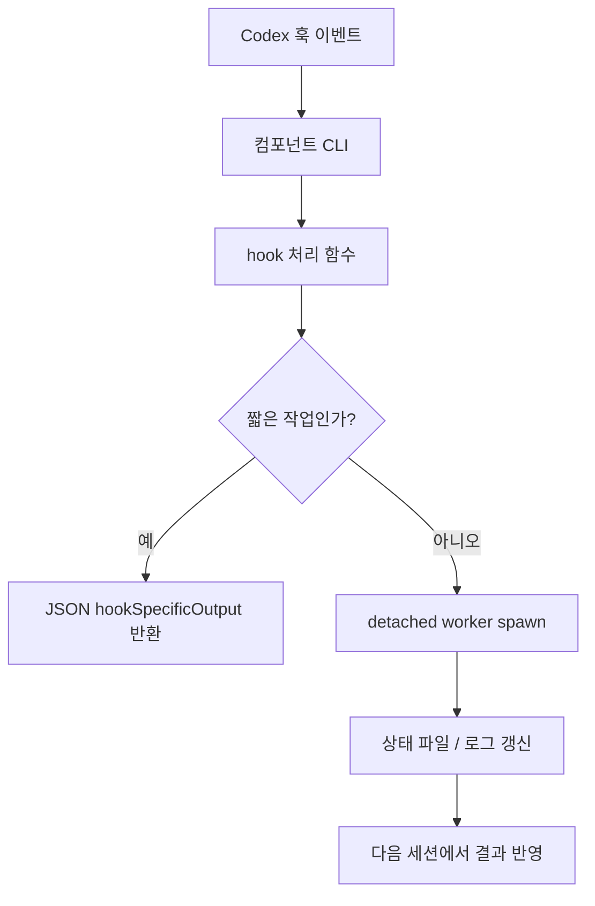

# Codex Plugin Components

## 개요

`packages/omo-codex/plugin/components`는 LazyCodex/Codex 플러그인의 실행 단위를 나눈 컴포넌트 계층입니다. 각 컴포넌트는 Codex 훅, MCP 서버, 백그라운드 워커, 진단/검증 도구처럼 독립적으로 실행되는 표면을 제공합니다.

이 계층의 핵심 원칙은 다음과 같습니다.

- Codex 훅은 세션을 깨뜨리지 않도록 가능한 한 `0`으로 종료합니다.
- 긴 작업은 훅 안에서 직접 처리하지 않고 detached worker로 넘깁니다.
- 설치/업그레이드 작업은 `PLUGIN_ROOT`, `PLUGIN_DATA`, `CODEX_HOME`을 기준으로 재현 가능하게 처리합니다.
- 실패는 즉시 치명 오류로 올리지 않고 `state.json`, `bootstrap.log`, degraded ledger 같은 관찰 가능한 상태로 남깁니다.
- 실제 외부 바이너리는 checksum, version probe, config gate를 통해 검증한 뒤 사용합니다.



## 컴포넌트 실행 표면

각 컴포넌트는 보통 `src/cli.ts`를 진입점으로 가지며, Codex가 호출하는 훅 명령을 서브커맨드로 노출합니다.

대표적인 패턴은 다음과 같습니다.

```text
omo-bootstrap hook session-start
omo-bootstrap worker
omo-bootstrap download <manifest> <platform> <destination-dir>

omo-comment-checker hook post-tool-use

omo-git-bash-hook hook pre-tool-use
omo-git-bash-hook hook post-compact

lazycodex-executor-verify hook subagent-stop
```

CLI는 훅 입력을 stdin에서 읽고, 필요한 경우 Codex 훅 응답 형식의 JSON을 stdout으로 씁니다. 오류 처리는 컴포넌트마다 다르지만, 세션 시작이나 사후 검증 훅처럼 사용자 세션에 직접 영향을 줄 수 있는 경로는 실패를 세션 실패로 전파하지 않도록 설계되어 있습니다.

## `bootstrap`: 설치 후 런타임 보정

`bootstrap` 컴포넌트는 Codex marketplace 캐시에 설치된 플러그인이 실제 Codex 환경에서 사용할 수 있도록 보정하는 역할을 합니다. 핵심 진입점은 `packages/omo-codex/plugin/components/bootstrap/src/cli.ts`입니다.

### 주요 명령

`main()`은 다음 명령을 분기합니다.

- `hook session-start`: `runSessionStartHook()` 실행
- `worker`: `runBootstrapWorker()` 실행
- `download`: `downloadFromManifest()` 실행
- `help`, `--help`, `-h`: 사용법 출력

`isProcessEntry()`는 현재 파일이 직접 실행된 경우에만 `main()`을 호출합니다. esbuild 번들 안에서도 `realpathSync(fileURLToPath(import.meta.url))` 비교로 재진입 여부를 확인합니다.

### SessionStart 훅

`executeSessionStartHook()`은 Codex `SessionStart`에서 호출됩니다.

처리 흐름은 다음과 같습니다.

1. stdin을 `drainStdin()`으로 비웁니다.
2. `PLUGIN_ROOT`, `PLUGIN_DATA`가 없으면 `skip-missing-env`로 종료합니다.
3. `readPluginVersion()`으로 `.codex-plugin/plugin.json`의 version을 읽습니다.
4. `readBootstrapState(resolveBootstrapStatePath(pluginData))`로 이전 완료 버전을 확인합니다.
5. 현재 버전이 이미 완료되어 있으면 `skip-completed`로 종료합니다.
6. `resolveBootstrapLockPath(pluginData)`에 fresh lock이 있으면 `skip-locked`로 종료합니다.
7. `spawnDetachedWorker()`로 `omo-bootstrap worker`를 백그라운드 실행합니다.
8. `BOOTSTRAP_RESTART_NOTICE`를 `hookSpecificOutput.additionalContext`로 출력합니다.

이 설계 때문에 세션 시작 훅은 오래 걸리는 설치/보정 작업을 직접 수행하지 않습니다. 사용자에게는 “백그라운드에서 bootstrap이 실행 중이며 완료 후 세션을 재시작하라”는 컨텍스트만 추가됩니다.

### Worker 실행

`runBootstrapWorker()`는 실제 보정 작업을 수행합니다.

중요한 입력은 다음과 같습니다.

- `PLUGIN_ROOT`: 플러그인 설치 루트
- `PLUGIN_DATA`: 플러그인 데이터 루트
- `CODEX_HOME`: Codex 홈 명시값
- `--codex-home`: worker 명령에서 직접 넘긴 Codex 홈
- `--once`: 현재 버전 완료 여부와 관계없이 한 번 실행
- `--only <step>`: 특정 step만 실행

`parseWorkerFlags()`는 worker 전용 플래그를 해석하고, 알 수 없는 플래그는 오류로 처리합니다. CLI의 `runWorkerCommand()`는 flag 오류만 비정상 종료로 보고하고, 런타임 worker 실패는 degraded ledger를 오류 채널로 삼기 때문에 exit code `0`으로 정리합니다.

기본 step은 `defaultWorkerSteps()`에 정의되어 있습니다.

- `setup`: `runWorkerSetup(context)`
- `sg`: `runSgProvision(context, seams.sg)`

`runBootstrapWorker()`는 `bootstrapLocks()`로 bootstrap lock과 auto-update lock을 함께 잡습니다. lock 획득에 실패하면 `{ ran: false, reason: "locked" }`를 반환합니다. lock을 잡은 뒤에도 `completedForVersion`을 다시 확인해 TOCTOU 상황을 막습니다.

완료 후에는 `writeState()`로 다음 형태의 bootstrap 상태를 저장합니다.

```ts
interface BootstrapState {
	readonly completedForVersion?: string;
	readonly lastAttemptAt?: number;
	readonly lastStatus?: "success" | "degraded";
	readonly degraded?: readonly BootstrapDegradedEntry[];
}
```

### Codex 홈과 설치 흐름 감지

`environment.ts`는 bootstrap이 어디에 쓰고 무엇을 보정해야 하는지 판단합니다.

`resolveCodexHome()`은 우선순위대로 Codex 홈을 결정합니다.

1. `CODEX_HOME`
2. `pluginRoot`에서 위로 최대 6단계 올라가며 `config.toml` 탐색
3. 기본값 `~/.codex`

`detectInstallFlowDetailed()`은 설치 흐름을 `"npx-local"`, `"marketplace"`, `"unknown"`으로 분류합니다. 판단 신호는 두 가지입니다.

- `lazycodex-install.json` 존재 여부
- `config.toml`의 `[marketplaces.sisyphuslabs] source` 값

`scanMarketplaceSource()`는 TOML 전체 파서를 쓰지 않고, 해당 marketplace section과 `source = ...` 할당만 좁게 읽습니다. `parseTomlStringValue()`는 double-quoted JSON 문자열과 single-quoted TOML 문자열을 처리합니다. `classifyMarketplaceSource()`는 git URL, `.git`, 절대 경로, `~`, Windows drive path 등을 기반으로 source 성격을 판정합니다.

### Worker setup

`runWorkerSetup()`은 bootstrap 보정의 중심입니다.

순서는 다음과 같습니다.

1. `resolveGitBashStep()`
2. `linkBundledAgentsStep()`
3. `updateConfigStep()`
4. `stampGitBashEnvStep()`
5. `linkComponentBinsStep()`

각 단계는 실패해도 전체 worker를 중단하지 않고 `BootstrapDegradedEntry`를 추가합니다.

`linkBundledAgentsStep()`은 플러그인 루트에 직접 쓰지 않습니다. `stageBundledAgents()`가 `PLUGIN_DATA/bootstrap/agents-stage` 아래로 각 컴포넌트의 `agents/*.toml`을 복사한 뒤, `linkCachedPluginAgents()`가 Codex 홈의 `agents`에 링크합니다. 이때 `capturePreservedAgentReasoning()`과 `capturePreservedAgentServiceTier()`로 사용자가 기존 agent TOML에 보존한 설정을 유지합니다.

`updateConfigStep()`은 `updateCodexConfig()`를 호출해 다음을 반영합니다.

- marketplace 이름 `sisyphuslabs`
- plugin 이름 `omo`
- bundled agent config 목록
- Git Bash 활성 여부
- `trustedHookStatesForPlugin()`에서 계산한 hook trust 상태

중요한 불변 조건은 `autonomousPermissions: false`입니다. bootstrap worker는 approval, sandbox, network policy 같은 권한 키를 쓰지 않습니다. 이 값들은 installer flag 전용 영역으로 남깁니다.

`linkRuntimeWrapperStep()`은 marketplace payload에 `dist/cli`가 없는 경우를 정상적인 degraded mode로 기록합니다. 이 경우 `omo-cli` degraded entry와 `omo-cli-degraded` 로그를 남기고, 사용자는 `npx lazycodex-ai`를 사용해야 합니다.

### ast-grep provision

`provision.ts`는 `sg` 바이너리를 준비합니다.

`runSgProvision()`은 먼저 `findSgBinarySync()`를 통해 기존 바이너리를 찾습니다. `OMO_BOOTSTRAP_FORCE_PROVISION=1`이 아니면 기존 바이너리를 우선 사용하고, `appendBootstrapLog()`에 `preexisting:<path>`를 기록합니다.

기존 바이너리가 없으면 `provisionFromSharedManifest()`가 `provisionSgBinary()`를 호출합니다. 성공 후에는 `verifyProvisionedVersion()`이 `sg --version` 출력에 `SG_PINNED_VERSION`이 포함되는지 확인합니다. 경로나 버전이 기대와 다르면 provision된 파일을 삭제하고 degraded entry를 반환합니다.

### 다운로드 manifest

`download.ts`는 checksum 고정 다운로드를 제공합니다.

- `parseAssetManifest()`는 `name`, `version`, `platforms` 구조를 검증합니다.
- `loadAssetManifest()`는 `<manifestName>.json`을 읽습니다.
- `downloadFromManifest()`는 platform별 asset을 선택합니다.
- `downloadChecksummedAsset()`는 임시 `.partial` 파일에 스트리밍 저장하면서 SHA-256을 계산합니다.
- checksum이 다르면 `ChecksumMismatchError`를 던지고 partial 파일을 삭제합니다.
- platform이 없으면 `UnsupportedPlatformError`를 던집니다.

`generate-manifests.mjs`는 bootstrap 컴포넌트에서 유일하게 네트워크를 사용하는 스크립트입니다. 런타임은 이 스크립트를 호출하지 않고, 커밋된 manifest 값만 소비합니다.

## `codegraph`: CodeGraph MCP와 세션 시작 동기화

`codegraph` 컴포넌트는 CodeGraph를 Codex 세션과 MCP 표면에 연결합니다. CLI 진입점은 `codegraph/src/cli.ts`입니다.

### CLI 분기

`runCodegraphCli()`는 다음을 처리합니다.

- `hook session-start`: `runCodegraphSessionStartHook()`
- `hook session-start-worker`: `runCodegraphSessionStartWorker()`
- 그 외: `runCodegraphServeCli()`

즉, 같은 CLI가 훅 부트스트랩과 MCP serve 양쪽 표면을 담당합니다.

### SessionStart 훅

`executeCodegraphSessionStartHook()`은 stdin에서 Codex hook input을 읽고, `cwd`를 프로젝트 루트로 사용합니다. JSON 파싱에 실패하거나 입력이 비어 있으면 현재 `process.cwd()`를 fallback으로 씁니다.

이후 `getCodexOmoConfig({ cwd: projectRoot, env, homeDir })`로 설정을 읽습니다. `config.codegraph?.enabled === false`이면 `skipped-disabled`를 출력합니다. 활성 상태이면 detached worker를 실행하고 `CODEGRAPH_SESSION_START_NOTICE`를 SessionStart 컨텍스트로 반환합니다.

### SessionStart worker

`runCodegraphSessionStartWorker()`는 실제 CodeGraph 초기화/동기화를 수행합니다.

핵심 흐름은 `runBootstrap()`에 있습니다.

1. `resolveOrProvisionCommand()`로 CodeGraph 실행 파일을 찾거나 provision합니다.
2. Node 지원 여부를 `evaluateCodegraphNodeSupport()`로 확인합니다.
3. `prepareCodegraphWorkspace()`로 workspace를 준비합니다.
4. `ensureCodegraphGitignored()`로 생성 파일이 git에 잘못 포함되지 않게 합니다.
5. `codegraph status --json`을 실행합니다.
6. `decideStartupAction()`이 `init`, `sync`, `skip` 중 하나를 결정합니다.
7. `codegraph init` 또는 `codegraph sync`를 실행합니다.
8. 결과를 `~/.omo/codegraph/session-start.jsonl`에 append합니다.

`decideStartupAction()`은 stdout/stderr 텍스트와 JSON 필드를 모두 봅니다. `"not initialized"`, `"uninitialized"`, `{ initialized: false }` 등은 `init`으로 처리하고, `{ initialized: true }`, `{ ready: true }`, `"ready"`는 `sync`로 처리합니다. status 명령이 timeout되거나 알 수 없는 비정상 종료를 하면 skip합니다.

### MCP serve

`runCodegraphServe()`는 CodeGraph MCP 서버를 실행합니다.

처리 순서는 다음과 같습니다.

1. `getCodexOmoConfig()`로 config 읽기
2. `codegraph.enabled === false`이면 `CODEGRAPH_DISABLED_HINT` 출력 후 종료
3. `resolveCodegraphCommand()`로 실행 파일 결정
4. env path가 지정되었지만 파일이 없으면 skip
5. Node 버전이 지원되지 않으면 `buildCodegraphNodeSkipHint()` 출력 후 종료
6. `buildCodegraphEnv()`와 설정의 `install_dir`을 병합
7. `<codegraph> serve --mcp` 실행

Windows에서는 `resolveServeProcessInvocation()`이 확장자에 따라 실행 방식을 바꿉니다.

- `.js`, `.mjs`, `.cjs`: `process.execPath`로 Node 실행
- `.bat`, `.cmd`: `cmd.exe /d /s /c`
- 그 외: 직접 실행

## `comment-checker`: PostToolUse 기반 주석 품질 차단

`comment-checker` 컴포넌트는 Codex의 파일 변경 도구 실행 후, 변경 내용에 대해 외부 `@code-yeongyu/comment-checker` 바이너리를 호출합니다.

### 훅 진입점

`comment-checker/src/cli.ts`는 `omo-comment-checker hook post-tool-use`만 처리합니다. 실제 로직은 `runCodexHookCli()`에 있습니다.

`runCodexHookCli()`는 stdin을 읽고 `parseCodexPostToolUseInput()`으로 Codex `PostToolUse` payload를 검증합니다. 유효하지 않거나 빈 입력이면 아무 것도 출력하지 않습니다.

### 요청 추출

`extractCodexCommentCheckRequests()`는 Codex payload를 `ToolResultLike`로 바꾼 뒤 `extractCommentCheckRequests()`에 넘깁니다.

`extractCommentCheckRequests()`는 다음 도구만 검사 대상으로 변환합니다.

- `Write`
- `Edit`
- `MultiEdit` / `multi_edit`
- `apply_patch`

도구 실행이 실패한 경우는 검사하지 않습니다.

- `event.isError`가 true
- 출력 텍스트가 `error`, `error:`, `failed to`, `could not` 패턴으로 시작/포함

`apply_patch`는 두 경로를 지원합니다.

- `tool_response` metadata의 patch file 목록: `getApplyPatchMetadataFiles()`
- tool input의 patch 텍스트: `extractApplyPatchEdits()`

새 파일처럼 `before`가 비어 있는 patch는 `Write` 요청으로 바꾸고, 기존 내용을 바꾸는 patch는 `Edit` 요청으로 바꿉니다.

### checker 실행

`runCommentCheckerPostToolUse()`는 추출된 요청마다 `runCommentChecker()`를 호출합니다.

`runCommentChecker()`는 다음 순서로 checker 바이너리를 찾습니다.

1. `options.binaryPath`
2. `options.resolveBinary()`
3. `resolveCommentCheckerBinary()`
4. package API의 `getBinaryPath()`
5. package 내부 `bin/comment-checker` 또는 `bin/comment-checker.exe`

실행 명령은 기본적으로 다음 형태입니다.

```text
comment-checker check
```

`customPrompt`가 있으면 `--prompt <customPrompt>`를 추가합니다. stdin에는 `CommentCheckerHookInput` JSON을 넣습니다.

exit code 해석은 다음과 같습니다.

- `0`: `pass`
- `2`: `warning`
- 그 외: `error`
- 바이너리 없음: `missing`

Codex 훅에서 실제로 차단하는 것은 `warning`뿐입니다. `missing`, `pass`, `error`는 훅 출력 없이 지나갑니다. 이는 checker 자체 문제 때문에 Codex 세션이 막히지 않게 하기 위한 설계입니다.

### 출력 제한

여러 warning이 있으면 다음 형식으로 합쳐집니다.

```text
comment-checker found issues in <filePath>:
<message>
```

그 뒤 JSON으로 차단 응답을 출력합니다.

```json
{
	"decision": "block",
	"reason": "..."
}
```

`hookFeedbackLimit()`은 transcript에 context pressure marker가 있으면 출력 제한을 1200자로 낮춥니다. 일반 상황에서는 8000자까지 허용합니다. marker 예시는 `context_length_exceeded`, `context_too_large`, `codex ran out of room in the model's context window`입니다.

## `git-bash`: Windows shell 사용 안내 훅

`git-bash` 컴포넌트는 Windows에서 Codex 기본 `Bash` 도구를 쓰기 전에 OMO `git_bash` MCP 사용을 안내합니다.

### PreToolUse reminder

`applyGitBashPreToolUseReminder()`는 다음 조건을 모두 만족할 때만 안내를 출력합니다.

- payload가 `PreToolUse`
- `tool_name === "Bash"`
- Windows host로 판단됨
- 현재 session에 reminder marker가 아직 없음

Windows 판단은 `process.platform === "win32"`뿐 아니라 `OS=Windows_NT`, `ComSpec`, `SystemRoot` 환경 변수도 고려합니다.

한 세션에서 반복 안내하지 않기 위해 `reminderMarkerPath(sessionId, pluginDataRoot)`에 marker 파일을 씁니다. 기본 root는 `PLUGIN_DATA` 또는 `~/.codex/omo-git-bash`입니다.

### PostCompact reset

`applyGitBashPostCompactReset()`은 `PostCompact` 이벤트에서 같은 session marker를 삭제합니다. compaction 이후에는 필요한 경우 reminder가 다시 한 번 표시될 수 있습니다.

## `lazycodex-executor-verify`: subagent evidence 강제

`lazycodex-executor-verify` 컴포넌트는 `lazycodex-executor` subagent가 evidence 없이 종료하는 것을 막는 `SubagentStop` 훅입니다.

### 훅 조건

`runSubagentStopHook()`은 다음 조건에서만 동작합니다.

- 입력이 `SubagentStopInput` 구조와 일치
- `agent_type === "lazycodex-executor"`
- transcript에 context pressure marker가 없음

context pressure가 있는 경우에는 추가 차단으로 세션 회복을 방해하지 않도록 아무 출력도 하지 않습니다.

### evidence receipt 검증

`hasValidEvidenceReceipt()`는 마지막 assistant message에서 다음 marker를 찾습니다.

```text
EVIDENCE_RECORDED: <path>
```

검증 조건은 엄격합니다.

- 경로가 `.omo/evidence` 아래에 있어야 함
- 상대 경로는 `cwd` 기준으로 해석
- realpath 기준으로도 `.omo/evidence` 내부여야 함
- evidence root 자체가 cwd 내부여야 함
- symlink는 허용하지 않음
- 파일이 존재하고 비어 있지 않아야 함

유효한 receipt가 있으면 `clearAttemptState()`로 retry 상태를 지우고 통과합니다.

### retry 차단

receipt가 없으면 `readAttemptState()`로 현재 시도 횟수를 읽고, `MAX_ATTEMPTS` 미만이면 `writeAttemptState()`로 증가시킨 뒤 차단 응답을 반환합니다.

차단 reason은 `renderDirective(attempts, input.last_assistant_message)`로 생성합니다. 이 지시문은 `directive.ts`가 `directive.md`를 읽어 만든 `LAZYCODEX_EXECUTOR_VERIFY_DIRECTIVE`를 기반으로 합니다.

`MAX_ATTEMPTS`에 도달하면 상태를 지우고 더 이상 차단하지 않습니다. 이 설계는 evidence 강제를 시도하되, 무한 차단 루프를 만들지 않습니다.

## `lsp`: 변경 파일 진단 훅과 MCP CLI

제공된 호출 그래프 기준으로 `lsp` 컴포넌트는 두 표면을 가집니다.

- `main()`이 `runPackageLspMcpCli()`를 호출하는 MCP CLI
- `runLspPostToolUseHook()`이 변경 파일의 LSP diagnostics를 검사하는 PostToolUse 훅

진단 훅은 `isCleanDiagnostics()`로 진단 결과가 깨끗한지 판단합니다. `extractMutatedFilePaths()`는 tool response에서 변경된 파일 경로를 추출하며, 실패한 도구 응답은 `isFailedToolResponse()`로 건너뜁니다. patch 기반 변경은 `addPatchFiles()`가 `apply_patch` 입력을 분석해 추가합니다.

`shouldSkipUnavailableLspDiagnostics()`와 `sessionStatePath()`는 LSP가 사용할 수 없는 세션 상태를 저장/조회하는 데 사용됩니다. 이 계층은 “파일 변경 후 바로 LSP로 검증하되, LSP가 사용할 수 없는 상태는 세션 단위로 추적한다”는 역할을 맡습니다.

## `rules`: Codex 규칙 주입과 경로 추출

`rules` 컴포넌트는 Codex `UserPromptSubmit` 및 tool 입력에서 규칙 적용 대상을 찾는 역할을 합니다.

호출 그래프에서 확인되는 핵심 함수는 다음과 같습니다.

- `isCodexUserPromptSubmitInput()`: Codex user prompt hook payload 구조 검증
- `extractCodexToolPaths()`: tool 입력에서 파일 경로 추출
- `latestCompactedReplacementSearchText()`: transcript에서 compaction 이후 대체 검색 텍스트 수집
- `createRulesEngine()`: `rules-engine`의 `createEngine()`으로 실제 규칙 엔진 생성

`rules/scripts/bench-codex-rules.mjs`는 hook fast path와 후보 생성 성능을 측정합니다. `runBenchmark()`, `measureHookFastPathRun()`, `compareResults()`가 benchmark 흐름을 구성하며, 설치 스크립트 쪽 `join()` 호출과 연결되어 dist layout에 의존합니다.

## `start-work-continuation`, `telemetry`, `ulw-loop`

이 모듈 안에는 Codex 작업 지속성과 목표 루프를 위한 컴포넌트도 포함됩니다.

`start-work-continuation`은 `runHookCli()`가 `parseHookInput()`을 호출하는 훅 CLI 구조를 가집니다. 이름 그대로 세션 시작 또는 continuation 관련 hook payload를 읽고 후속 작업 컨텍스트를 구성하는 표면입니다.

`telemetry`의 `shutdown()`은 동일 이름의 shutdown 경로로 연결됩니다. 이는 PostHog 같은 telemetry client 종료 처리를 캡슐화하는 구조로 보입니다.

`ulw-loop`는 목표/계획 상태를 다루는 독립적인 실행 루프입니다. 호출 그래프에서 확인되는 주요 함수는 다음과 같습니다.

- `createGoals()` → `positionalText()`
- `reviewBlockers()` → `printJson()`
- `parseSteeringProposal()` → `requiredGoal()`, `child()`, `children()`, `stringArray()`, `objectText()`
- `buildCodexGoalInstruction()` → `buildCreateGoalPayload()`, `buildText()`
- `canReconcileActiveFinalTaskScopedAggregateSnapshot()` → `textHasCompletionValidationEvidence()`

즉, `ulw-loop`는 Codex에 전달할 목표 지시문 생성, steering proposal 파싱, blocker 검토, 완료 검증 증거 판단을 담당합니다.

## 상태 파일과 로그

컴포넌트들은 실패를 숨기지 않고, Codex 세션을 깨뜨리지 않는 별도 상태 채널로 남깁니다.

대표 경로는 다음과 같습니다.

- bootstrap state: `resolveBootstrapStatePath(pluginData)` → `<PLUGIN_DATA>/bootstrap/state.json`
- bootstrap lock: `resolveBootstrapLockPath(pluginData)` → `<PLUGIN_DATA>/bootstrap/state.json.lock`
- bootstrap log: `<PLUGIN_DATA>/bootstrap/bootstrap.log`
- CodeGraph session log: `~/.omo/codegraph/session-start.jsonl`
- Git Bash reminder marker: `<PLUGIN_DATA>/git-bash-reminder/<session>.seen`
- executor verify attempt state: `state.ts`의 `readAttemptState()`, `writeAttemptState()`, `clearAttemptState()`가 관리하는 per-session/per-agent 상태
- evidence receipt: `<cwd>/.omo/evidence/...`

이 상태 채널들은 훅 stdout과 역할이 다릅니다. stdout은 Codex에게 즉시 전달할 hook decision/context를 담고, 상태 파일은 다음 세션이나 디버깅에서 읽을 수 있는 지속 기록을 담습니다.

## 외부 계층과의 연결

`plugin/components`는 자체 로직만으로 동작하지 않고, monorepo의 installer, utils, core 패키지와 연결됩니다.

주요 외부 호출은 다음과 같습니다.

- `runWorkerSetup()` → `linkCachedPluginAgents()`, `linkCachedPluginBins()`, `linkRootRuntimeBin()`
- `updateConfigStep()` → `updateCodexConfig()`, `trustedHookStatesForPlugin()`
- `resolveGitBashStep()` → `prepareGitBashForInstall()`
- `runSgProvision()` → `findSgBinarySync()`, `provisionSgBinary()`, `runtimeSlug()`, `sgBinaryName()`
- `runCodegraphServe()` → `resolveCodegraphCommand()`, `buildCodegraphEnv()`, `evaluateCodegraphNodeSupport()`
- `runCodegraphSessionStartWorker()` → `ensureCodegraphProvisioned()`, `prepareCodegraphWorkspace()`, `ensureCodegraphGitignored()`
- `comment-checker` → `@oh-my-opencode/comment-checker-core`

이 연결 방식 때문에 컴포넌트 계층은 adapter 역할을 합니다. Codex hook payload, CLI 명령, 플러그인 cache layout 같은 Codex-specific 표면을 받아서, shared installer/util/core 로직에 맞는 입력으로 변환합니다.

## 기여 시 주의할 점

컴포넌트를 수정할 때는 훅의 종료 의미를 먼저 확인해야 합니다. 특히 SessionStart, PostToolUse, SubagentStop처럼 Codex 세션 흐름에 직접 개입하는 훅은 “오류를 던질 것인가, degraded 상태로 기록할 것인가, block decision을 출력할 것인가”가 사용자 경험을 결정합니다.

새로운 bootstrap step을 추가할 때는 `BootstrapWorkerStep` 형태를 따르는 것이 맞습니다. step 내부 실패는 가능하면 `BootstrapDegradedEntry`로 반환하고, `runBootstrapWorker()`의 전체 lock/state/write 흐름은 유지해야 합니다.

외부 바이너리 provision을 추가할 때는 `downloadChecksummedAsset()`나 기존 shared manifest 패턴처럼 URL과 checksum을 고정해야 합니다. 런타임에서 최신 버전을 즉석 조회하는 방식은 이 계층의 결정적 빌드 원칙과 맞지 않습니다.

Codex config를 수정하는 경로에서는 `updateConfigStep()`의 불변 조건을 보존해야 합니다. bootstrap worker는 permission policy를 쓰지 않으며, hook trust와 marketplace/plugin/agent/bin wiring만 보정합니다.

훅 stdout은 Codex가 읽는 계약이므로 사람이 읽기 좋은 로그를 섞으면 안 됩니다. 사람이 읽을 로그는 `appendBootstrapLog()`, `appendOutcome()`, degraded state 같은 별도 채널에 남기는 패턴을 따라야 합니다.