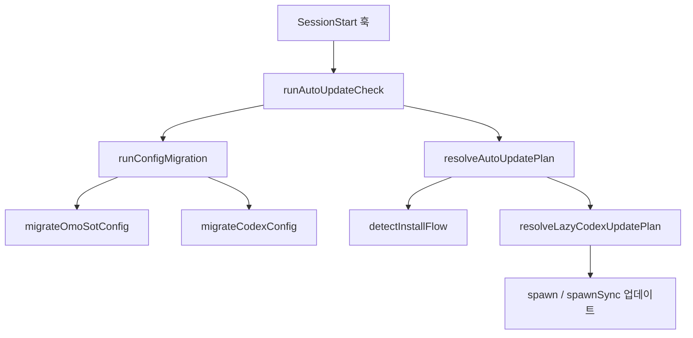

# Codex Plugin Shared Runtime

ULTRAWORK MODE ENABLED!

# Codex Plugin Shared Runtime

Codex Plugin Shared Runtime은 LazyCodex/Codex 플러그인의 설치 상태, 자동 업데이트, 설정 마이그레이션, 번들 구성, 훅 표시 메시지, 공유 설정 로딩을 담당하는 런타임 스크립트 계층입니다. 대부분 `packages/omo-codex/plugin/scripts/*.mjs`의 Node ESM 스크립트로 구성되며, Codex 훅이나 릴리스/빌드 스크립트에서 직접 실행됩니다.

## 런타임 흐름



`auto-update.mjs`가 세션 시작 시점의 중심 진입점입니다. 실행되면 먼저 설정 마이그레이션을 수행하고, 이전 자동 업데이트 상태를 읽고, 설치 방식과 버전을 비교해 업데이트를 시작할지 결정합니다.

## 자동 업데이트

자동 업데이트는 `runAutoUpdateCheck()`가 조율합니다.

주요 단계는 다음과 같습니다.

1. `runConfigMigration()`으로 Codex 및 OMO 설정을 먼저 정리합니다.
2. `resolveStatePath()`와 `readState()`로 이전 업데이트 상태를 읽습니다.
3. `settlePendingNotice()`가 이전 세션에서 시작된 업데이트 완료 여부를 확인합니다.
4. `detectAutoUpdateInstallFlow()`가 설치 방식이 `npx-local`인지 `marketplace`인지 판단합니다.
5. `resolveAutoUpdatePlan()`이 실행 여부와 명령을 계산합니다.
6. `acquireLock()`으로 중복 실행을 막습니다.
7. `spawn()` 또는 `spawnSync()`로 업데이트 명령을 실행합니다.

기본 업데이트 명령은 다음 조합입니다.

```text
npx --yes lazycodex-ai@latest install --no-tui --codex-autonomous
```

`LAZYCODEX_AUTO_UPDATE_WAIT=1`이면 `spawnSync()`로 동기 실행하고, 기본값은 `spawn()`으로 백그라운드 실행 후 `child.unref()`로 현재 Codex 세션을 막지 않습니다.

`resolveAutoUpdatePlan()`은 다음 조건에서 실행하지 않습니다.

- `LAZYCODEX_AUTO_UPDATE_DISABLED=1` 또는 `OMO_CODEX_AUTO_UPDATE_DISABLED=1`
- 마지막 성공 확인 이후 `LAZYCODEX_AUTO_UPDATE_INTERVAL_MS`가 지나지 않음
- 마지막 실패 이후 `LAZYCODEX_AUTO_UPDATE_RETRY_INTERVAL_MS`가 지나지 않음
- `detectInstallFlow()` 결과가 `marketplace`
- 현재 버전 또는 최신 버전을 읽을 수 없음
- `compareVersions()` 기준 최신 버전이 현재 버전보다 높지 않음

마켓플레이스 설치인 경우 `npx` 셀프 업데이트를 실행하지 않습니다. 대신 상태를 성공으로 기록하고 사용자에게 `codex plugin marketplace upgrade sisyphuslabs`를 안내하는 notice를 반환합니다.

## 상태 파일과 잠금

`auto-update-state.mjs`는 자동 업데이트의 파일 상태를 관리합니다.

- `resolveStatePath(env)`: 자동 업데이트 상태 JSON 경로를 계산합니다.
- `resolveLogPath(env)`: JSONL 로그 경로를 계산합니다.
- `resolveLockPath(env, statePath)`: 잠금 파일 경로를 계산합니다.
- `acquireLock(lockPath, now, staleMs)`: `open(lockPath, "wx")`로 원자적 잠금을 획득합니다.
- `readState(statePath)`: 상태 파일을 읽고 객체가 아니거나 오류가 있으면 `{}`를 반환합니다.
- `writeState(statePath, state)`: 상태 JSON을 pretty-print로 저장합니다.
- `appendUpdateLog(env, now, event, details)`: 업데이트 이벤트를 JSONL로 추가합니다.

기본 위치는 `PLUGIN_DATA`가 있으면 그 아래이고, 없으면 `~/.local/share/lazycodex`입니다.

```text
auto-update.json
auto-update.log
auto-update.json.lock
```

`DEFAULT_LOCK_STALE_MS`는 10분입니다. `acquireLock()`은 기존 잠금이 있으면 `removeStaleLock()`으로 `mtimeMs`를 확인하고, 오래된 잠금만 제거한 뒤 한 번 더 획득을 시도합니다.

## 설치 방식 판별

`install-flow.mjs`는 플러그인이 어떤 방식으로 설치되었는지 판별합니다.

- `resolveInstallSnapshotPath(env, pluginRoot)`는 `lazycodex-install.json` 경로를 계산합니다.
- `detectInstallFlow({ pluginRoot, env })`는 다음 순서로 판별합니다.
  - 설치 스냅샷 파일이 있으면 `{ flow: "npx-local", reason: "install-snapshot-present" }`
  - 스냅샷 경로가 비정상 상태면 `{ flow: "unknown", reason: ... }`
  - 상위 워크스페이스 `package.json`에 version이 있으면 `{ flow: "npx-local", reason: "workspace-tree" }`
  - 그 외에는 `{ flow: "marketplace", reason: "install-snapshot-absent" }`

이 결과는 자동 업데이트에서 중요합니다. `marketplace` 설치는 Codex 플러그인 마켓플레이스가 소유하므로 `lazycodex-ai@latest install`을 직접 실행하지 않습니다.

## Codex 설정 마이그레이션

`migrate-codex-config.mjs`는 Codex 설정 파일을 현재 LazyCodex 모델 정책에 맞게 정리합니다.

진입점은 `migrateCodexConfig({ env, cwd })`입니다.

1. `readModelCatalog(env)`로 모델 카탈로그를 읽습니다.
2. `resolveStatePath(env)`와 `readState()`로 이전 관리 상태를 읽습니다.
3. `configPaths({ env, cwd })`로 대상 `config.toml` 목록을 수집합니다.
4. 각 파일에 `migrateConfigFile()`을 적용합니다.
5. 처리 결과를 모델 카탈로그 상태 파일에 저장합니다.

`configPaths()`는 항상 `${CODEX_HOME}/config.toml`을 포함하고, 현재 작업 디렉터리에서 홈 디렉터리까지 올라가며 존재하는 `.codex/config.toml`도 포함합니다.

`migrateConfigFile()`은 두 가지 수정을 수행합니다.

- `ensureCodexReasoningConfig()`로 root-level 설정을 현재 프로필로 맞춥니다.
- `forceDisableMultiAgentV2()`로 `[features.multi_agent_v2] enabled = false`를 보장합니다.

관리 대상 root 설정은 `root-settings.mjs`의 `MANAGED_KEYS`에 정의되어 있습니다.

```ts
model
model_context_window
model_reasoning_effort
plan_mode_reasoning_effort
```

사용자가 직접 수정한 설정은 덮어쓰지 않도록 `shouldApplyCatalog()`가 이전 상태와 관리 프로필을 비교합니다. 빈 설정, 현재 프로필, 이전에 LazyCodex가 쓴 값, legacy managed profile만 자동 적용 대상입니다.

## multi_agent_v2 가드

`multi-agent-v2-guard.mjs`의 `forceDisableMultiAgentV2(config)`는 Codex 설정에서 `multi_agent_v2`를 강제로 비활성화합니다.

처리 패턴은 세 가지입니다.

- `[features]` 아래 `multi_agent_v2 = true` shorthand 제거
- `[features.multi_agent_v2]`가 없으면 새 섹션 추가
- 섹션은 있지만 `enabled`가 없거나 `true`면 `enabled = false`로 변경

이 함수는 관리 주석에 `openai/codex#26753` 마커를 넣습니다. 이미 `enabled = false`가 명시되어 있거나 `[features] multi_agent_v2 = false` shorthand가 있으면 불필요한 중복 섹션을 만들지 않습니다.

## OMO SOT 설정 마이그레이션

`migrate-omo-sot.mjs`는 공유 OMO 설정 파일 `~/.omo/config.jsonc`에 Codex 전용 codegraph 설정을 추가합니다.

진입점은 `migrateOmoSotConfig({ env, seed, configPath })`입니다.

- 파일이 없고 `seed`가 false이면 아무것도 하지 않습니다.
- 파일이 없고 `seed`가 true이면 `SCAFFOLD`를 기반으로 새 JSONC 파일을 생성합니다.
- 파일이 있으면 `parseJsonc()`로 주석과 trailing comma를 허용해 파싱합니다.
- `collectCodexAdditions()`가 기존 `codegraph` 값과 환경 변수를 `[codex].codegraph`에 복사할 후보로 모읍니다.
- `addCodexCodegraphValues()`가 JSONC 문자열을 보존하면서 필요한 속성만 삽입합니다.

지원되는 codegraph 키는 다음 네 가지입니다.

```text
auto_provision
enabled
install_dir
telemetry
```

환경 변수는 `OMO_CODEGRAPH_*`와 `CODEX_CODEGRAPH_*` 양쪽을 읽습니다. boolean 값은 `1`, `true`, `yes`, `on`, `0`, `false`, `no`, `off`만 인식합니다.

`migrate-omo-sot/editor.mjs`는 AST 라이브러리를 쓰지 않고 문자열 범위 기반 편집을 수행합니다. `findObjectPropertyRange()`, `matchingBrace()`, `skipTrivia()`가 JSON 문자열과 주석을 고려해 삽입 위치를 찾고, `insertPropertiesIntoObject()`가 기존 들여쓰기와 쉼표를 맞춥니다.

## 빌드 및 릴리스 보조 스크립트

`build-components.mjs`는 플러그인 component workspace를 빌드합니다.

- root `package.json`의 `workspaces`에서 `components/` 항목을 찾습니다.
- 각 component의 `package.json`에 `scripts.build`가 있으면 `npm run --workspace <component> build`를 실행합니다.
- workspace에 포함되지 않은 standalone component도 `components/` 아래에서 찾아 빌드합니다.
- `src/cli.ts`를 `bun build --target node --format esm`으로 `dist/cli.js`에 번들합니다.
- `normalizeBuiltinImports()`가 Node builtin import를 `node:` 접두사 형태로 정규화합니다.

`build-bundled-mcp-runtimes.mjs`는 Codex 플러그인에 포함되는 MCP 런타임 산출물을 확인하거나 빌드합니다.

관리 대상은 다음 세 가지입니다.

- `lsp-tools-mcp`
- `lsp-daemon`
- `git-bash-mcp`

`hasBundledDist()`가 필요한 `dist` 파일이 모두 있는지 확인합니다. 소스 패키지가 있고 산출물이 없으면 `npm run build`를 실행하고, `lsp-daemon`은 필요 시 `npm ci`도 먼저 수행합니다. 소스 패키지가 없으면 `assertBundledDist()`가 번들 산출물 누락을 오류로 보고합니다.

`sync-version.mjs`는 authoritative version을 플러그인 manifest에 동기화합니다.

- `resolveAuthoritativeVersion()`은 `LAZYCODEX_RELEASE_VERSION` 또는 repo root `package.json`의 version을 사용합니다.
- `syncVersion()`은 `packages/omo-codex/package.json`, `plugin/package.json`, `.codex-plugin/plugin.json`, 각 component `package.json`의 `version`을 갱신합니다.
- `manifestTargets()`는 실제 갱신 대상 목록을 구성합니다.

## 훅 상태 메시지

`hook-status-message.mjs`는 Codex 훅의 status message를 LazyCodex 표기법으로 통일합니다.

- `formatLazyCodexHookStatusMessage(version, label)`은 `LazyCodex(<version>): <Label>` 형식을 만듭니다.
- `normalizeLazyCodexHookStatusLabel(label)`은 기존 메시지에서 `OMO`를 제거하고 단어별 title case를 적용합니다.
- `parseLazyCodexHookStatusMessage(message)`는 이미 포맷된 메시지에서 `{ version, label }`을 추출합니다.

`WORD_OVERRIDES`는 약어와 제품명을 보존합니다.

```text
lazycodex -> LazyCodex
lsp -> LSP
mcp -> MCP
ulw-loop -> Ulw-Loop
```

`sync-hook-status-messages.mjs`는 aggregate `hooks/hooks.json`과 각 component의 `hooks/hooks.json`을 읽어 command hook의 `statusMessage`를 갱신합니다. 릴리스 버전은 `LAZYCODEX_RELEASE_VERSION`이 있으면 그 값을 사용하고, 없으면 plugin/component manifest의 version을 사용합니다.

## 스킬 동기화와 Codex 호환성 오버레이

`sync-skills.mjs`는 OpenCode/공유 스킬을 Codex 플러그인용 `plugin/skills` 디렉터리로 복사하고 필요한 호환성 문구를 삽입합니다.

주요 흐름은 `syncSkills()`입니다.

1. 기존 `skillsRoot`를 삭제하고 다시 만듭니다.
2. component-local skill source를 복사합니다.
3. `@oh-my-opencode/shared-skills`의 공유 스킬을 복사합니다.
4. 각 스킬에 `adaptSkillForCodex()`를 적용합니다.

`insertCodexCompatibilityGuidance(content)`는 스킬 본문에 OpenCode 전용 orchestration 도구 호출 예시가 있으면 Codex용 변환 지침을 삽입합니다. 감지 대상 패턴은 `call_omo_agent(...)`, `task(...)`, `background_output(...)`, `team_*...`입니다.

이미 생성된 호환성 섹션은 `removeCodexCompatibilityGuidance()`로 제거한 뒤 새 내용으로 다시 삽입합니다. frontmatter가 있으면 frontmatter 바로 뒤에 섹션을 둡니다.

`applyCodexSkillOverlays(skillName, content)`는 특정 스킬에 추가 정책을 덮어씁니다.

- `start-work`: 완료 조건에 Global Review and Debugging Gate를 추가합니다.
- `review-work`: final gate로 쓰일 때 timeout, ack-only, inconclusive lane을 실패로 취급하는 지침을 추가합니다.

## 명령 실행 호환성

`spawn-command.mjs`의 `resolveSpawnInvocation(command, args, platform)`은 Windows에서 `npm`과 `npx` 실행을 `cmd.exe /d /s /c <command>.cmd ...` 형태로 변환합니다.

Unix 계열에서는 입력 그대로 반환합니다.

이 함수는 다음 경로에서 사용됩니다.

- `runAutoUpdateCheck()`의 자동 업데이트 실행
- `resolveLatestVersion()`의 `npm view lazycodex-ai version --silent`
- `defaultRunCommandForManualUpdate()`의 수동 업데이트 실행

## 공유 설정 로더

`plugin/shared/src/config-loader.ts`는 Codex 런타임에서 OMO 설정을 읽는 얇은 adapter입니다.

`getCodexOmoConfig(options)`는 `loadOmoConfig()`를 다음 인자로 호출합니다.

```ts
loadOmoConfig({
  cwd,
  env,
  homeDir,
  harness: "codex",
})
```

반환값은 `OmoConfig`에 `sources`와 `warnings`를 합친 `CodexOmoConfig`입니다.

이 함수는 Codex codegraph 쪽에서 사용됩니다.

- `runCodegraphServe()`
- `runCodegraphSessionStartWorker()`
- `executeCodegraphSessionStartHook()`

즉, shared runtime의 설정 로더는 플러그인 스크립트뿐 아니라 component runtime이 동일한 OMO 설정 해석 규칙을 쓰도록 연결하는 진입점입니다.

## 오류 처리 정책

이 모듈은 Codex 세션 시작 훅에서 실행되므로, 사용자 세션을 깨지 않는 방향으로 오류를 처리합니다.

대표 패턴은 다음과 같습니다.

- `readState()`는 파일이 없거나 JSON이 깨져도 `{}`를 반환합니다.
- `readVersionManifest()`는 manifest를 읽지 못하면 `undefined`를 반환합니다.
- `readModelCatalog()`는 카탈로그를 읽거나 파싱하지 못하면 `FALLBACK_CATALOG`를 사용합니다.
- `migrateCodexConfig()` CLI 실행부는 오류가 나도 `process.exit(0)`으로 끝냅니다.
- `auto-update.mjs` CLI 실행부도 오류 메시지만 stderr에 쓰고 `process.exit(0)`으로 종료합니다.

반대로 빌드/릴리스 보조 스크립트는 실패를 명확히 중단합니다. `buildRuntime()`, `run()`, `assertBundledDist()`는 빌드 실패나 산출물 누락 시 non-zero 종료를 사용합니다.

## 기여 시 주의할 점

자동 업데이트 경로를 수정할 때는 `resolveAutoUpdatePlan()`과 `runAutoUpdateCheck()`의 역할을 분리해서 유지해야 합니다. 전자는 순수한 결정 함수에 가깝고, 후자는 상태 파일, 잠금, 로그, 프로세스 실행을 포함하는 side-effect 계층입니다.

설정 마이그레이션을 수정할 때는 사용자 설정을 덮어쓰지 않는 조건을 보존해야 합니다. `shouldApplyCatalog()`는 빈 설정, 현재 관리 프로필, 이전 LazyCodex 관리 상태, legacy managed profile만 자동 적용 대상으로 봅니다.

JSONC 편집은 `migrate-omo-sot/editor.mjs`의 문자열 편집기가 담당합니다. 새 키를 추가할 때는 `collectCodexAdditions()`와 `isValidCodegraphValue()` 쪽에서 허용 범위를 먼저 정의하고, 삽입 로직을 중복 구현하지 않는 것이 맞습니다.

훅 메시지나 스킬 동기화를 바꿀 때는 generated content를 반복 실행해도 안정적으로 같은 결과가 나와야 합니다. `removeCodexCompatibilityGuidance()`와 `normalizeLazyCodexHookStatusLabel()`은 이 idempotency를 유지하기 위한 핵심 함수입니다.