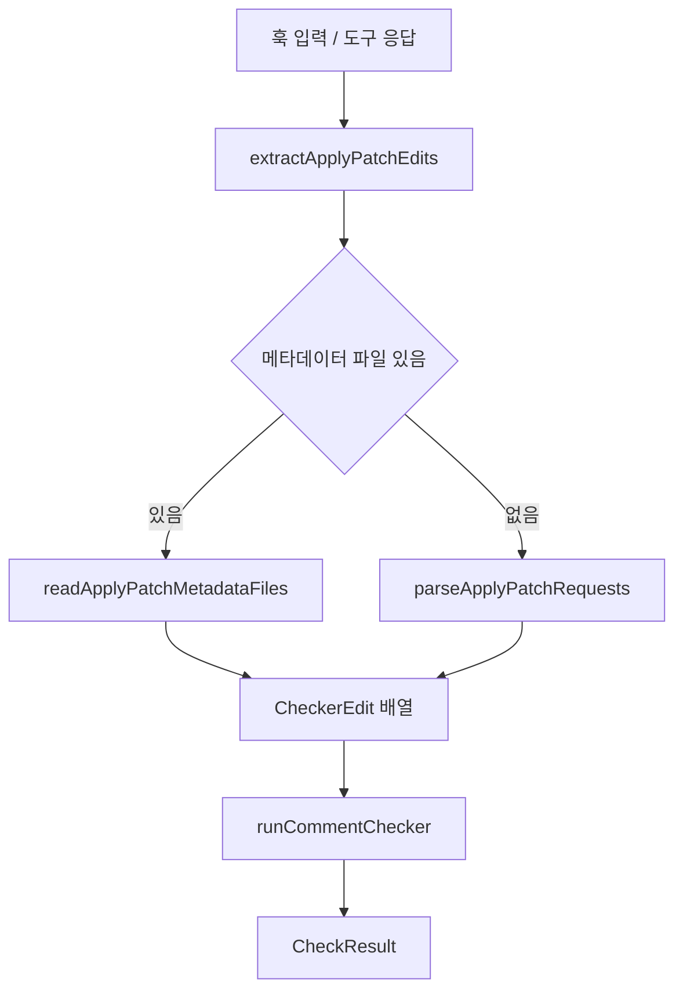

# comment checker core

## comment checker core 모듈

`packages/comment-checker-core`는 하네스 훅에서 발생한 파일 변경 정보를 comment checker 실행 형식으로 정규화하고, 외부 `@code-yeongyu/comment-checker` 바이너리를 안전하게 호출하는 공통 코어입니다. OpenCode/Codex 어댑터가 직접 구현 세부사항을 중복하지 않도록, 변경 추출과 바이너리 실행을 작은 순수 함수 중심으로 분리합니다.

이 모듈은 크게 두 축으로 나뉩니다.

- `apply-patch-edits.ts`: `apply_patch` 결과나 패치 문자열에서 `CheckerEdit[]`를 추출합니다.
- `runner.ts`: comment checker 바이너리를 찾아 실행하고 `CheckResult`로 결과를 변환합니다.



## 공개 진입점

`src/index.ts`는 모듈의 공개 표면입니다. 내부 파일을 직접 import하지 않고 이 엔트리에서 필요한 함수와 타입을 가져오는 것이 기본 사용 패턴입니다.

주요 export는 다음과 같습니다.

- 변경 추출:
  - `extractApplyPatchEdits`
  - `getApplyPatchMetadataFiles`
  - `readApplyPatchMetadataFiles`
  - `parseApplyPatchRequests`
  - `makeAccumulator`
  - `getString`
  - `joinPatchLines`
- 바이너리 실행:
  - `resolveCommentCheckerBinary`
  - `runCommentChecker`
- 타입:
  - `CheckerEdit`
  - `ApplyPatchFileMetadata`
  - `ApplyPatchAccumulator`
  - `HookInput`
  - `CheckResult`
  - `RunCommentCheckerInput`
  - `RunCommentCheckerOptions`
  - `ResolveCommentCheckerBinaryInput`

## 변경 추출 흐름

`extractApplyPatchEdits(details, args?)`는 `apply_patch` 계열 도구 결과에서 comment checker가 검사할 변경 조각을 뽑는 최상위 함수입니다.

처리 순서는 의도적으로 메타데이터 우선입니다.

1. `getApplyPatchMetadataFiles(details)`로 구조화된 파일 변경 메타데이터를 찾습니다.
2. `type`이 `"delete"`인 항목은 제외합니다.
3. 메타데이터가 하나라도 있으면 이를 `CheckerEdit[]`로 즉시 반환합니다.
4. 메타데이터가 없을 때만 `args`에서 패치 문자열을 찾습니다.
5. 패치 문자열이 있으면 `parseApplyPatchRequests(patch)`로 파싱합니다.
6. 아무 정보도 없으면 빈 배열을 반환합니다.

이 우선순위 때문에 도구 응답이 구조화된 `files` 정보를 제공하는 환경에서는 문자열 패치 파싱에 의존하지 않습니다. 문자열 파싱은 후속 호환 경로입니다.

```ts
const edits = extractApplyPatchEdits(toolResponse, toolArgs)
```

반환되는 `CheckerEdit`는 항상 다음 형태입니다.

```ts
type CheckerEdit = {
  readonly filePath: string
  readonly before: string
  readonly after: string
}
```

`filePath`는 이동이 있는 업데이트에서는 `movePath`가 우선됩니다. 즉, 파일 이동 후의 경로 기준으로 검사할 수 있습니다.

## apply_patch 메타데이터 읽기

`getApplyPatchMetadataFiles(details)`는 `details` 객체 안에서 `files` 배열을 찾습니다. 지원하는 위치는 세 곳입니다.

1. `details.files`
2. `details.result.files`
3. `details.metadata.files`

각 위치는 순서대로 검사되며, 유효한 배열을 찾으면 바로 반환합니다.

실제 배열 파싱은 `readApplyPatchMetadataFiles(value)`가 담당합니다. 이 함수는 배열 항목이 레코드인지 `isRecord`로 확인한 뒤, 여러 필드 이름을 허용합니다.

지원하는 필드 별칭은 다음과 같습니다.

- 파일 경로: `filePath`, `file_path`, `path`
- 이동 후 경로: `movePath`, `move_path`
- 이전 텍스트: `before`, `old`, `oldString`, `old_string`
- 이후 텍스트: `after`, `new`, `newString`, `new_string`
- 작업 종류: `type`, `operation`

`filePath`, `before`, `after` 중 하나라도 문자열로 존재하지 않으면 해당 항목은 무시됩니다. 이 설계는 다양한 도구 응답 포맷을 받아들이되, comment checker 실행에 필요한 최소 정보가 없는 항목은 조용히 버리도록 합니다.

## 패치 문자열 파싱

`parseApplyPatchRequests(patch)`는 `apply_patch` 텍스트를 직접 읽어 `CheckerEdit[]`를 만듭니다. 지원하는 패치 헤더는 다음과 같습니다.

- `*** Add File: <path>`
- `*** Update File: <path>`
- `*** Delete File: <path>`
- `*** Move to: <path>`

`*** Begin Patch`, `*** End Patch`, `@@` hunk 헤더는 검사 대상에서 제외됩니다.

작업별 동작은 다음과 같습니다.

- `add`: `+` 줄만 모아 `after`로 사용하고 `before`는 빈 문자열입니다.
- `update`: `-` 줄은 `before`, `+` 줄은 `after`로 모읍니다.
- `delete`: accumulator는 만들지만 최종 `CheckerEdit`는 생성하지 않습니다.
- `move`: 현재 작업이 `update`일 때만 `movePath`에 저장됩니다.

패치 파싱은 전체 파일 재구성이 아니라 변경된 줄 조각 추출에 집중합니다. 컨텍스트 줄은 `before`나 `after`에 포함되지 않습니다.

예를 들어 다음 패치는:

```diff
*** Begin Patch
*** Update File: src/example.ts
@@
-const value = 1
+const value = 2
*** End Patch
```

다음과 같은 변경으로 변환됩니다.

```ts
{
  filePath: "src/example.ts",
  before: "const value = 1\n",
  after: "const value = 2\n"
}
```

`joinPatchLines(lines)`는 줄 배열을 `\n`으로 합치고, 비어 있지 않으면 마지막에 개행을 하나 붙입니다. 빈 배열은 빈 문자열을 반환합니다. 이 때문에 패치에서 추출된 `before`와 `after`는 일반적으로 trailing newline을 포함합니다.

## accumulator 구조

`parseApplyPatchRequests`는 현재 처리 중인 파일 블록을 `ApplyPatchAccumulator`로 보관합니다.

```ts
type ApplyPatchAccumulator = {
  operation: "add" | "update" | "delete"
  filePath: string
  movePath?: string
  oldLines: string[]
  newLines: string[]
}
```

`makeAccumulator(operation, filePath)`는 이 구조를 초기화합니다. 새 파일 블록을 만나거나 패치 끝에 도달하면 내부 `flush()`가 accumulator를 `CheckerEdit`로 변환합니다.

이 방식의 장점은 한 패치 문자열 안에 여러 파일 변경이 들어 있어도 파일 단위로 순차 처리할 수 있다는 점입니다. 단, `delete` 작업은 comment checker 검사 대상이 아니므로 결과 배열에 추가되지 않습니다.

## comment checker 바이너리 찾기

`resolveCommentCheckerBinary(input)`는 실행할 comment checker 바이너리 경로를 결정합니다.

처리 순서는 다음과 같습니다.

1. `cachedBinaryPath`가 `null`이 아니고 실제 존재하면 그 경로를 반환합니다.
2. `importMetaUrl`이 없으면 `null`을 반환합니다.
3. `createRequire(importMetaUrl)`로 require 함수를 만들고, 패키지의 `package.json`을 resolve합니다.
4. 해당 패키지 디렉터리 아래 `bin/<binaryName>` 경로를 구성합니다.
5. 그 파일이 존재하면 경로를 반환하고, 아니면 `null`을 반환합니다.

기본 패키지 이름은 `@code-yeongyu/comment-checker`입니다. 필요하면 `packageName`으로 대체할 수 있습니다.

```ts
const binaryPath = resolveCommentCheckerBinary({
  binaryName: "comment-checker",
  cachedBinaryPath,
  existsSync,
  importMetaUrl: import.meta.url,
})
```

패키지 resolve 실패나 파일 없음은 정상적인 “사용 불가” 상태로 취급되어 `null`을 반환합니다. `Error`가 아닌 값이 throw된 경우에는 다시 throw합니다.

## comment checker 실행

`runCommentChecker(input, options)`는 바이너리를 실행하고 결과를 `CheckResult`로 정규화합니다.

```ts
interface CheckResult {
  readonly hasComments: boolean
  readonly message: string
}
```

바이너리 경로가 `null`이거나 파일이 존재하지 않으면 즉시 다음 빈 결과를 반환합니다.

```ts
{ hasComments: false, message: "" }
```

실행 인자는 기본적으로 다음 형태입니다.

```txt
<binaryPath> check
```

`input.customPrompt`가 있으면 다음 인자가 추가됩니다.

```txt
--prompt <customPrompt>
```

`runCommentChecker`는 `input.hookInput`을 JSON으로 직렬화해 프로세스 표준 입력에 씁니다. 즉, 외부 바이너리는 stdin으로 `HookInput` 전체를 받는 계약입니다.

```ts
process.stdin.write(JSON.stringify(input.hookInput))
process.stdin.end()
```

프로세스 종료 코드는 다음처럼 해석됩니다.

- `0`: 주석 없음, 빈 결과 반환
- `2`: 주석 있음, `stderr`를 메시지로 사용
- 그 외: 빈 결과 반환

`stderr` 메시지는 `normalizeMessage`를 거쳐 Windows 스타일 `\r\n`이 `\n`으로 정규화됩니다. `stdout`은 현재 결과 판단에 사용하지 않지만, 프로세스 완료를 기다리기 위해 함께 읽습니다.

## 타임아웃과 프로세스 종료

`runCommentChecker`는 기본 30초 타임아웃을 둡니다.

- `timeoutMs` 기본값: `30_000`
- `killGraceMs` 기본값: `1_000`

타임아웃이 발생하면 먼저 `SIGTERM`을 보냅니다. 이후 grace 기간이 지나도 종료되지 않으면 `SIGKILL`을 보냅니다.

프로세스 종료는 `killProcessSafely(process, signal)`를 통해 수행됩니다. `process.kill()`이 일반 `Error`를 던지면 삼키고, `Error`가 아닌 예외는 다시 throw합니다. 이미 종료된 프로세스에 kill을 보내는 상황을 안전하게 처리하기 위한 방어 코드입니다.

타이머 함수는 `RunCommentCheckerOptions`에서 주입할 수 있습니다.

```ts
interface RunCommentCheckerOptions {
  readonly spawn: SpawnFn
  readonly existsSync: (path: string) => boolean
  readonly timeoutMs?: number
  readonly killGraceMs?: number
  readonly setTimeoutFn?: typeof setTimeout
  readonly clearTimeoutFn?: typeof clearTimeout
}
```

이 구조 덕분에 테스트에서는 실제 타이머와 실제 프로세스를 쓰지 않고도 timeout, kill, exit code 동작을 검증할 수 있습니다.

## HookInput 계약

`HookInput`은 comment checker 바이너리에 전달되는 훅 입력의 공통 형태입니다.

```ts
interface HookInput {
  readonly session_id: string
  readonly tool_name: string
  readonly transcript_path: string
  readonly cwd: string
  readonly hook_event_name: string
  readonly tool_input: {
    readonly file_path?: string
    readonly content?: string
    readonly old_string?: string
    readonly new_string?: string
    readonly edits?: readonly { old_string: string; new_string: string }[]
  }
  readonly tool_response?: unknown
}
```

`tool_input`은 write/edit/multiedit 계열 도구의 입력을 표현할 수 있도록 선택 필드로 구성되어 있습니다. `tool_response`는 구체적인 도구별 응답 형식이 다를 수 있으므로 `unknown`으로 유지됩니다. `apply-patch-edits.ts`의 함수들은 이 `unknown` 응답을 `isRecord`와 필드 별칭 기반 파싱으로 안전하게 다룹니다.

## 코드베이스 안에서의 역할

이 패키지는 comment checker 기능의 도메인 로직을 어댑터 바깥으로 빼낸 코어입니다. 어댑터나 훅 레이어는 다음 책임만 가지면 됩니다.

1. 현재 훅 이벤트에서 `HookInput`을 구성합니다.
2. 도구 응답이 `apply_patch`라면 `extractApplyPatchEdits`로 검사 대상 변경을 추출합니다.
3. `resolveCommentCheckerBinary`로 실행 가능한 바이너리를 찾습니다.
4. `runCommentChecker`를 호출해 `CheckResult`를 받습니다.
5. `hasComments`가 `true`이면 `message`를 사용자나 훅 결과에 반영합니다.

반대로 이 코어는 특정 하네스 런타임, 특정 훅 시스템, 특정 UI에 직접 의존하지 않습니다. 외부 의존은 `isRecord` 유틸리티와 Node의 `createRequire`, `path` 처리 정도로 제한됩니다.

## 기여할 때 주의할 점

`extractApplyPatchEdits`는 메타데이터를 문자열 패치보다 우선합니다. 새 도구 응답 포맷을 지원할 때도 가능하면 `readApplyPatchMetadataFiles`의 필드 별칭을 확장하는 편이 패치 파서 확장보다 안전합니다.

`parseApplyPatchRequests`는 완전한 diff 파서가 아닙니다. 현재 구현은 `apply_patch` 포맷에서 추가/수정된 실제 줄만 추출합니다. 컨텍스트 줄, 삭제 파일 본문, 복잡한 diff 메타데이터를 보존해야 한다면 이 함수의 목적 자체를 재검토해야 합니다.

`runCommentChecker`는 실패를 대부분 “주석 없음”과 같은 빈 결과로 처리합니다. 이는 훅이 comment checker 장애 때문에 주요 작업을 막지 않게 하려는 설계입니다. 오류를 사용자에게 노출해야 하는 요구가 생기면 `CheckResult` 타입이나 별도 오류 채널을 확장해야 하며, 기존의 조용한 실패 계약을 깨지 않는지 확인해야 합니다.

타임아웃, spawn, 파일 존재 확인은 모두 주입식입니다. 테스트 가능성을 유지하려면 새 로직도 전역 상태나 실제 프로세스에 직접 묶지 말고 `RunCommentCheckerOptions`와 같은 주입 패턴을 따르는 것이 좋습니다.