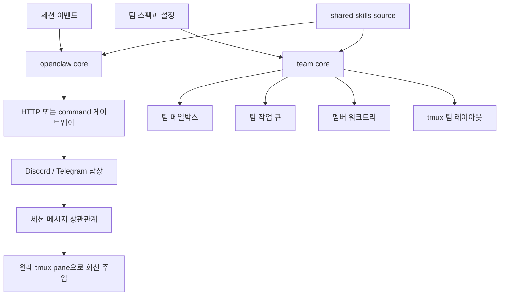

# Coordination Runtime

ULTRAWORK MODE ENABLED!

## 개요

Coordination Runtime은 에이전트 하네스가 외부 채널, 팀 실행 상태, 공유 스킬 자산을 함께 다루기 위한 런타임 기반 계층입니다. [openclaw core](openclaw-core.md)는 세션 이벤트를 외부 게이트웨이로 전달하고 원격 답장을 다시 주입하며, [team core](team-core.md)는 Team Mode의 상태, 메일박스, 작업 큐, 워크트리, tmux 레이아웃을 파일 시스템 위에서 조정합니다. [shared skills source](shared-skills-source.md)는 여러 하네스가 같은 스킬 번들을 참조할 수 있도록 `sharedSkillsRootPath()` 기준점을 제공합니다.

이 그룹의 핵심 역할은 “에이전트가 혼자 실행되는 순간”을 넘어서는 조정입니다. OpenClaw는 외부 사용자나 채널과 세션을 연결하고, Team Core는 여러 멤버가 같은 팀 런타임 안에서 메시지와 작업을 주고받게 하며, Shared Skills Source는 이 런타임들이 공통 워크플로 스킬을 같은 구조로 소비하게 만듭니다.

## 하위 모듈의 결합 방식

[openclaw core](openclaw-core.md)는 런타임 바깥의 사람이나 시스템을 현재 세션으로 연결합니다. `dispatchOpenClawEvent()`가 세션 이벤트를 받아 `wakeOpenClaw()`로 전달하고, 게이트웨이 호출 결과를 바탕으로 `registerMessage` 계열의 상관관계를 남깁니다. 이후 `startReplyListener()`와 Discord·Telegram 폴링 흐름이 메시지 ID를 다시 세션 정보로 해석해 원래 tmux pane에 답장을 주입합니다.

[team core](team-core.md)는 여러 에이전트 멤버가 같은 팀 런타임을 공유하도록 저장소와 동기화 규칙을 제공합니다. `loadTeamSpec()`와 `validateSpec`가 팀 정의를 읽고, `createRuntimeState()`와 `transitionRuntimeState()`가 상태 전이를 관리합니다. 그 위에서 `sendMessage()`, `pollAndBuildInjection()`, `createTask()`, `claimTask()`, `updateTaskStatus()`가 팀 메일박스와 작업 큐를 구성합니다.

[shared skills source](shared-skills-source.md)는 실행 엔진이 아니라 공통 스킬 트리의 위치 계약입니다. `sharedSkillsRootPath()`를 통해 동기화 스크립트, 테스트, 플러그인 번들러가 같은 `packages/shared-skills/skills/` 디렉터리를 기준으로 스킬을 읽습니다. 덕분에 OpenClaw, Team Mode, Codex/OpenCode 어댑터가 스킬 문서를 각자 복제하지 않고 같은 소스를 소비할 수 있습니다.

## 주요 런타임 흐름

외부 알림 흐름은 세션 이벤트에서 시작해 OpenClaw 게이트웨이를 거쳐 외부 채널로 나갑니다. 답장 리스너는 `readReplyListenerDaemonState()`, `writeReplyListenerDaemonState()`, `pollDiscordReplies()`, `pollTelegramReplies()` 같은 상태·폴링 흐름을 통해 수신 메시지를 추적하고, `lookupByMessageId()`로 원래 세션과 메시지를 찾아 회신을 주입합니다.

팀 실행 흐름은 팀 스펙 로드와 런타임 상태 생성에서 시작합니다. 이후 멤버 간 메시지는 `resolveRecipients()`와 `assertTeamAcceptsMessages()`를 통과해 메일박스에 기록되고, 작업은 `createTask()`와 `claimTask()`를 통해 분배됩니다. 종료 요청처럼 상태 파일을 다루는 흐름은 `getRuntimeStateDir()`와 `resolveContainedPath()`를 거쳐 경로 탈출을 방지합니다.

공유 스킬 흐름은 더 단순합니다. 소비자는 `sharedSkillsRootPath()`로 스킬 루트를 찾고, 각 하네스의 동기화·검증·번들링 단계가 그 트리를 읽어 런타임에 필요한 스킬 문서와 스크립트를 가져갑니다. 이 구조는 조정 런타임의 행동 로직과 스킬 배포 위치를 분리해, 팀 실행이나 외부 회신 기능이 스킬 저장 구조에 직접 결합되지 않게 합니다.