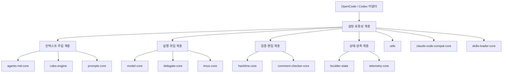

# Core Libraries

## 개요

Core Libraries는 OpenCode 어댑터와 Codex Light가 공유하는 순수 TypeScript 기반 계층입니다. 각 패키지는 런타임 표면을 직접 소유하기보다, 지시문 주입, 규칙 매칭, 프롬프트 선택, 모델 결정, 위임, 상태 저장, 편집 안전성, 텔레메트리 같은 반복 로직을 재사용 가능한 코어로 분리합니다.

이 그룹의 중심에는 [utils](utils.md)가 있습니다. 파일 시스템 안전성, 설정 파싱, 명령 실행, 로그, 런타임 준비 같은 공통 기반을 제공하고, 나머지 코어 패키지는 그 위에서 더 좁은 도메인 결정을 담당합니다.

## 함께 동작하는 방식

런타임은 먼저 [claude code compat core](claude-code-compat-core.md)와 [skills loader core](skills-loader-core.md)를 통해 Claude Code, OpenCode, `.agents` 형식의 에이전트·커맨드·스킬·MCP 구성을 하나의 실행 가능한 형태로 정규화합니다. 이 과정에서 [utils](utils.md)는 경로 처리, 설정 병합, JSONC/YAML 파싱, 외부 명령 실행 같은 공통 기능을 제공합니다.

세션 컨텍스트는 [agents md core](agents-md-core.md)와 [rules engine](rules-engine.md)이 나눠 담당합니다. `agents-md-core`는 대상 파일 경로 기준의 계층형 `AGENTS.md`를 주입하고, `rules-engine`은 프로젝트·사용자·번들 규칙을 찾아 정적/동적 지시문 블록으로 변환합니다. 여기에 [prompts core](prompts-core.md)가 에이전트와 실행 모드에 맞는 프롬프트 variant를 선택해, 상위 어댑터가 동일한 규칙으로 시스템 지시문을 구성할 수 있게 합니다.

실행 경로에서는 [model core](model-core.md)가 provider/model 문자열, fallback chain, 모델 capability를 해석하고, [delegate core](delegate-core.md)가 위임 작업에 사용할 모델 선택과 재시도 안내를 담당합니다. tmux 기반 보조 세션이나 패널이 필요할 때는 [tmux core](tmux-core.md)가 pane/window/session 생성과 활성화를 표준화합니다.

편집과 검증 쪽에서는 [hashline core](hashline-core.md)가 줄 번호와 해시 앵커를 이용한 안전한 텍스트 편집 프리미티브를 제공하고, [comment checker core](comment-checker-core.md)가 `apply_patch` 결과를 검사기 입력으로 정규화해 comment checker 실행 결과로 변환합니다.

작업 상태와 관측은 [boulder state](boulder-state.md)와 [telemetry core](telemetry-core.md)가 맡습니다. `boulder-state`는 `.omo/boulder.json`과 계획 Markdown을 기반으로 작업 진행률, 세션, 타이머를 관리하고, `telemetry-core`는 환경 변수로 제어되는 익명 daily active 이벤트를 하루 한 번만 기록합니다.

## 주요 횡단 워크플로

### 컨텍스트 구성

1. [claude code compat core](claude-code-compat-core.md)가 외부 형식의 에이전트·커맨드·MCP 구성을 읽습니다.
2. [skills loader core](skills-loader-core.md)가 여러 위치의 `SKILL.md`를 `CommandDefinition`으로 정규화합니다.
3. [agents md core](agents-md-core.md)가 파일 경로별 `AGENTS.md` 지시문을 추가합니다.
4. [rules engine](rules-engine.md)이 적용 가능한 규칙 블록을 찾고 중복 주입을 막습니다.
5. [prompts core](prompts-core.md)가 실행 모드와 모델에 맞는 프롬프트를 선택합니다.

### 위임 실행

1. 상위 어댑터가 작업 카테고리와 사용자 설정을 전달합니다.
2. [delegate core](delegate-core.md)가 위임 대상 모델을 결정합니다.
3. [model core](model-core.md)가 provider 연결 상태, fallback, capability를 기준으로 실제 모델 설정을 확정합니다.
4. 필요하면 [tmux core](tmux-core.md)가 보조 에이전트용 tmux 표면을 준비합니다.
5. 진행 상태는 [boulder state](boulder-state.md)에 기록됩니다.

### 안전한 변경 검증

1. [hashline core](hashline-core.md)가 해시 앵커 기반 편집을 적용합니다.
2. [comment checker core](comment-checker-core.md)가 패치 결과를 `CheckerEdit[]`로 추출합니다.
3. 검사 결과는 상위 훅에서 사용자에게 노출되거나 후속 수정 흐름으로 연결됩니다.
4. 공통 파일·명령·로그 처리는 [utils](utils.md)를 통해 일관되게 수행됩니다.

## 설계 관점

Core Libraries의 핵심 가치는 어댑터 독립성입니다. OpenCode와 Codex Light는 서로 다른 런타임 표면을 갖지만, 지시문 탐색, 스킬 발견, 모델 선택, 안전 편집, 상태 기록 같은 판단 규칙은 같은 코어를 공유합니다. 따라서 새 어댑터를 추가할 때도 런타임 접점만 얇게 작성하고, 제품의 주요 정책과 동작 규칙은 이 모듈 그룹에서 재사용할 수 있습니다.