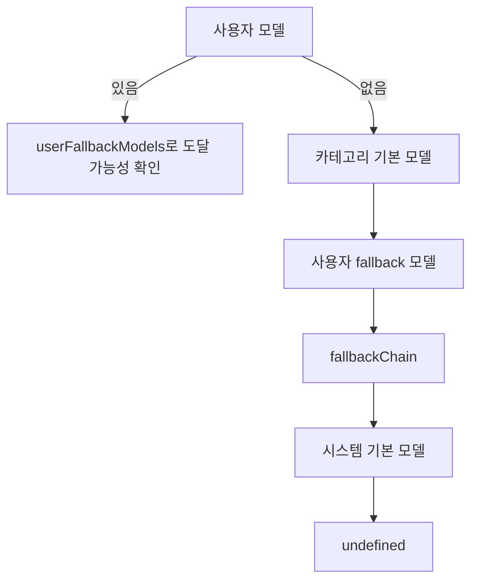

# delegate core

## delegate core 모듈

`packages/delegate-core`는 위임 작업에서 반복적으로 필요한 두 가지 공통 로직을 제공합니다.

- 위임 대상 작업에 사용할 모델을 결정하는 `resolveModelForDelegateTask`
- `task` 호출 실패 출력에서 재시도 가능한 오류를 감지하고 안내 문구를 만드는 `detectDelegateTaskError`, `buildRetryGuidance`

모듈 진입점인 `src/index.ts`는 다음 파일의 공개 API를 다시 내보냅니다.

```ts
export * from "./model-selection"
export * from "./retry-guidance"
export * from "./retry-patterns"
```

## 모델 선택

핵심 함수는 `resolveModelForDelegateTask(input, deps)`입니다. 이 함수는 사용자 지정 모델, 카테고리 기본 모델, fallback 모델 목록, provider 연결 상태, 시스템 기본 모델을 하나의 우선순위 규칙으로 합쳐 `DelegateModelResolutionResult`를 반환합니다.

반환값은 세 형태 중 하나입니다.

```ts
type DelegateModelResolutionResult =
  | { model: string; variant?: string; fallbackEntry?: DelegateFallbackEntry; matchedFallback?: boolean }
  | { skipped: true }
  | undefined
```

- `{ model }`: 사용할 모델을 확정한 상태입니다.
- `{ skipped: true }`: provider/model 캐시가 아직 없어 검증을 건너뛰어야 하는 상태입니다.
- `undefined`: 어떤 모델도 확정하지 못한 상태입니다.

### 입력 구조

`DelegateModelResolutionInput`은 모델 선택에 필요한 후보와 런타임 상태를 담습니다.

```ts
type DelegateModelResolutionInput = {
  readonly userModel?: string
  readonly userFallbackModels?: readonly string[]
  readonly categoryDefaultModel?: string
  readonly isUserConfiguredCategoryModel?: boolean
  readonly fallbackChain?: readonly DelegateFallbackEntry[]
  readonly availableModels: ReadonlySet<string>
  readonly systemDefaultModel?: string
}
```

`DelegateModelResolutionDeps`는 캐시와 provider 연결 상태, 선택적으로 로그 함수를 제공합니다.

```ts
type DelegateModelResolutionDeps = {
  readonly connectedProviders: readonly string[] | null
  readonly hasProviderModelsCache: boolean
  readonly hasConnectedProvidersCache: boolean
  readonly log?: (message: string, metadata?: Record<string, unknown>) => void
}
```

이 모듈은 실제 provider 조회를 직접 수행하지 않습니다. 호출자가 이미 알고 있는 `availableModels`, `connectedProviders`, 캐시 존재 여부를 넘겨주면, delegate core는 그 데이터만으로 결정합니다.

### 선택 우선순위

`resolveModelForDelegateTask`는 다음 순서로 모델을 결정합니다.



실제 분기는 다음 규칙을 따릅니다.

1. `userModel`이 있으면 가장 먼저 사용합니다.
   - `normalizeModel`로 정규화합니다.
   - `parseUserFallbackModel`을 통해 `provider/model:variant` 형태를 해석할 수 있으면 `model`과 `variant`를 분리합니다.
   - `availableModels`가 있고 `userFallbackModels`도 있으면, 사용자 기본 모델이 실제 사용 가능한지 `fuzzyMatchModel`로 확인합니다.
   - 기본 모델이 매칭되지 않고 fallback 모델이 매칭되면 fallback을 승격하고 `matchedFallback: true`를 반환합니다.

2. 캐시가 완전히 비어 있으면 검증을 건너뜁니다.
   - `availableModels.size === 0`
   - `connectedProviders === null`
   - `hasProviderModelsCache === false`
   - `hasConnectedProvidersCache === false`

   이 경우 `{ skipped: true }`를 반환합니다. 아직 provider/model 정보를 판단할 근거가 없다는 뜻입니다.

3. `categoryDefaultModel`을 평가합니다.
   - `isUserConfiguredCategoryModel`이 `true`이면 검증을 우회하고 그대로 사용합니다.
   - 사용자가 직접 설정한 카테고리 모델은 연결 provider나 모델 캐시에 의해 거부하지 않습니다.
   - 사용자 설정이 아닌 경우에는 `availableModels` 또는 `connectedProviders`로 검증합니다.
   - `provider/model-high`처럼 명시적 high 모델이면, fuzzy match가 base 모델로 내려가더라도 원래 high 모델 문자열을 보존하는 경로가 있습니다.

4. `userFallbackModels`를 평가합니다.
   - 모델 캐시가 있으면 `fuzzyMatchModel`로 실제 사용 가능한 항목을 찾습니다.
   - 모델 캐시가 없고 `connectedProviders`만 있으면 provider 힌트가 연결 provider와 맞는 항목을 선택합니다.

5. `fallbackChain`을 평가합니다.
   - 각 `DelegateFallbackEntry`는 provider 후보 목록, 모델명, 선택적 variant를 가집니다.

   ```ts
   type DelegateFallbackEntry = {
     readonly providers: string[]
     readonly model: string
     readonly variant?: string
   }
   ```

   - 연결 provider만 있는 cold-cache 상태에서는 연결된 provider와 처음 맞는 entry를 선택합니다.
   - provider별 모델명 변환에는 `transformModelForProvider(provider, entry.model)`을 사용합니다.
   - 모델 캐시가 있으면 먼저 `provider/model` 전체 문자열로 fuzzy match를 시도하고, 실패하면 provider 제한 없이 `entry.model`만으로 cross-provider match를 시도합니다.

6. `systemDefaultModel`이 있으면 마지막 fallback으로 사용합니다.

7. 어떤 규칙에도 걸리지 않으면 `undefined`를 반환합니다.

### provider와 variant 처리

모델 문자열 해석은 내부 함수 `parseUserFallbackModel`이 담당합니다.

이 함수는 먼저 `normalizeModel`로 입력을 정규화한 뒤, 두 가지 형태를 처리합니다.

- provider가 포함된 모델 문자열: `parseModelString`
- 모델 ID에 variant가 붙은 형태: `parseVariantFromModelID`

provider가 포함된 경우 반환값에는 `providerHint`가 포함됩니다.

```ts
{
  baseModel: `${parsedFullModel.providerID}/${parsedFullModel.modelID}`,
  providerHint: [parsedFullModel.providerID],
  variant: parsedFullModel.variant,
}
```

provider 힌트는 이후 `fuzzyMatchModel` 호출에서 같은 provider 안에서 우선 매칭하도록 사용됩니다.

### 명시적 high 모델 보존

`isExplicitHighModel`과 `getExplicitHighBaseModel`은 `*-high` 모델을 별도로 다룹니다.

```ts
function isExplicitHighModel(model: string): boolean {
  return /(?:^|\/)[^/]+-high$/.test(model)
}

function getExplicitHighBaseModel(model: string): string | null {
  return isExplicitHighModel(model) ? model.replace(/-high$/, "") : null
}
```

이 로직은 `categoryDefaultModel` 또는 `fallbackChain`에서 `variant === "high"`인 항목이 base 모델로 fuzzy match될 때, 원래 명시적 high 모델 문자열을 유지하기 위해 사용됩니다. 예를 들어 카테고리 기본값이 `provider/model-high`이고 실제 match가 `provider/model`로 잡히더라도, 특정 조건에서는 `provider/model-high`를 반환합니다.

## 재시도 오류 감지

`retry-patterns.ts`는 `task` 호출 실패에서 재시도 가능한 오류를 감지하기 위한 패턴 목록과 감지 함수를 제공합니다.

```ts
export const DELEGATE_TASK_ERROR_PATTERNS: readonly DelegateTaskErrorPattern[]
```

각 패턴은 다음 구조입니다.

```ts
type DelegateTaskErrorPattern = {
  readonly pattern: string
  readonly errorType: string
  readonly fixHint: string
}
```

현재 감지하는 대표 오류는 다음과 같습니다.

- `missing_run_in_background`
- `missing_load_skills`
- `mutual_exclusion`
- `missing_category_or_agent`
- `unknown_category`
- `empty_agent`
- `unknown_agent`
- `primary_agent`
- `unknown_skills`

`detectDelegateTaskError(output)`는 먼저 출력에 `[ERROR]` 또는 `Invalid arguments`가 있는지 확인합니다. 둘 다 없으면 `null`을 반환합니다. 그다음 `DELEGATE_TASK_ERROR_PATTERNS`를 순서대로 돌며 `output.includes(errorPattern.pattern)`으로 첫 번째 매칭 항목을 찾습니다.

```ts
export function detectDelegateTaskError(output: string): DetectedError | null {
  if (!output.includes("[ERROR]") && !output.includes("Invalid arguments")) return null

  for (const errorPattern of DELEGATE_TASK_ERROR_PATTERNS) {
    if (output.includes(errorPattern.pattern)) {
      return {
        errorType: errorPattern.errorType,
        originalOutput: output,
      }
    }
  }

  return null
}
```

이 함수는 정규식 기반 파서가 아니라 보수적인 문자열 포함 검사입니다. 따라서 새 오류 메시지를 지원하려면 실제 출력에 안정적으로 포함되는 문구를 `pattern`에 추가해야 합니다.

## 재시도 안내 생성

`buildRetryGuidance(errorInfo)`는 `DetectedError`를 받아 모델이나 agent가 다시 `task`를 올바르게 호출하도록 안내하는 문자열을 만듭니다.

처리 흐름은 단순합니다.

1. `DELEGATE_TASK_ERROR_PATTERNS`에서 `errorInfo.errorType`과 같은 패턴을 찾습니다.
2. 찾지 못하면 일반 안내를 반환합니다.
3. 찾으면 `fixHint`를 포함한 재시도 안내를 만듭니다.
4. 원본 출력에 `Available...:` 목록이 있으면 `Available Options`로 함께 포함합니다.
5. 올바른 `task(...)` 호출 예시를 붙입니다.

`Available` 목록 추출은 내부 함수 `extractAvailableList`가 담당합니다.

```ts
function extractAvailableList(output: string): string | null {
  const availableMatch = output.match(/Available[^:]*:\s*(.+)$/m)
  return availableMatch ? availableMatch[1].trim() : null
}
```

이 정규식은 한 줄짜리 `Available categories: ...`, `Available agents: ...` 같은 메시지를 추출하는 데 맞춰져 있습니다.

## 코드베이스와의 연결

이 패키지는 자체적으로 외부 실행 흐름을 만들지 않습니다. 제공된 call graph 기준으로 이 모듈에서 다른 프로젝트 코드로 나가는 직접 호출은 없고, 내부 함수 호출만 존재합니다.

다만 `model-selection.ts`는 `@oh-my-opencode/model-core`의 모델 유틸리티에 의존합니다.

- `normalizeModel`
- `parseModelString`
- `parseVariantFromModelID`
- `fuzzyMatchModel`
- `transformModelForProvider`

즉 delegate core는 provider/model 데이터를 직접 수집하지 않고, 이미 수집된 후보를 해석하고 우선순위를 적용하는 계층입니다. 모델 문자열의 정규화, provider별 모델명 변환, fuzzy matching 규칙은 `model-core`에 맡깁니다.

현재 이 모듈을 직접 검증하는 호출자는 테스트입니다.

- `model-selection.test.ts` → `resolveModelForDelegateTask`
- `retry-patterns.test.ts` → `detectDelegateTaskError`
- `retry-patterns.test.ts` → `buildRetryGuidance`

## 변경할 때 주의할 점

모델 선택 규칙을 수정할 때는 우선순위가 가장 중요합니다. `userModel`은 명시적 사용자 입력이므로 최우선이고, `systemDefaultModel`은 마지막 fallback입니다. 중간에 `categoryDefaultModel`, `userFallbackModels`, `fallbackChain`의 순서를 바꾸면 실제 위임 작업의 모델 선택 결과가 달라질 수 있습니다.

`availableModels.size === 0`인 상태는 두 가지로 나뉩니다.

- 캐시 자체가 없어서 판단할 수 없는 상태: `{ skipped: true }`
- 모델 목록은 없지만 연결 provider 정보는 있는 상태: provider 기반 fallback 가능

이 차이를 무시하면 cold start에서 잘못된 모델을 선택하거나, 반대로 선택 가능한 fallback을 놓칠 수 있습니다.

오류 패턴을 추가할 때는 `DELEGATE_TASK_ERROR_PATTERNS`의 순서도 고려해야 합니다. `detectDelegateTaskError`는 첫 번째로 포함되는 패턴을 반환하므로, 더 구체적인 패턴이 더 일반적인 패턴보다 앞에 있어야 합니다.