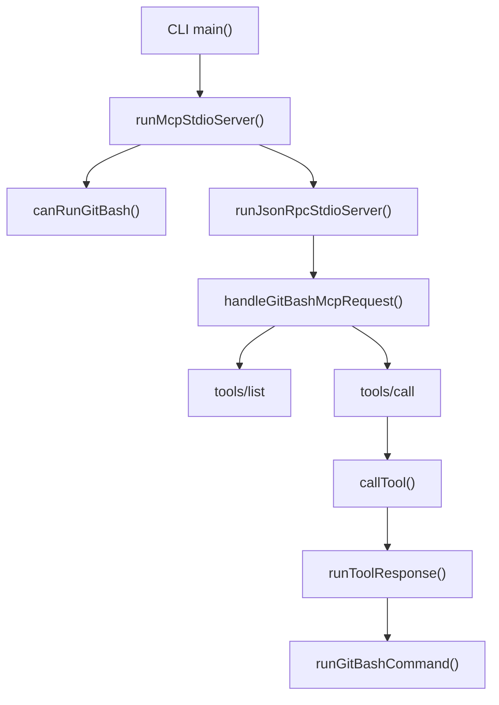

# git bash mcp

## 개요

`packages/git-bash-mcp`는 Windows 환경에서 Git Bash의 `bash.exe`를 통해 셸 명령을 실행하기 위한 MCP stdio 서버입니다. Codex/OpenCode 쪽 실행 환경이 Windows 네이티브일 때 Bash 명령을 안정적으로 처리하도록 `git_bash` 도구를 노출합니다.

이 모듈은 크게 세 가지 책임을 가집니다.

- `cli.ts`: `omo-git-bash mcp` 명령으로 MCP stdio 서버를 시작합니다.
- `mcp.ts`: JSON-RPC/MCP 요청을 처리하고 `which_bash`, `diagnose`, `run` 도구를 제공합니다.
- `runner.ts`: 실제 Git Bash 프로세스를 실행하고 stdout/stderr/timeout 결과를 수집합니다.

## 실행 진입점

CLI 진입점은 `cli.ts`의 `main()`입니다.

```ts
const [command = "mcp"] = argv.slice(2);
if (command === "mcp") {
  await runMcpStdioServer(process.stdin, process.stdout);
  return;
}
```

인자를 생략하거나 `mcp`를 전달하면 `runMcpStdioServer()`가 현재 프로세스의 stdin/stdout에 연결됩니다. 다른 명령이 들어오면 사용법을 stderr에 출력하고 종료 코드 `2`를 설정합니다.

런타임 오류는 `main().catch(...)`에서 잡아 stack/message를 stderr에 기록하고 종료 코드 `1`을 설정합니다.

## MCP 요청 처리 흐름

핵심 요청 처리 함수는 `handleGitBashMcpRequest(input, options)`입니다. 이 함수는 JSON-RPC 요청을 검증한 뒤 MCP 메서드별 응답을 생성합니다.



지원하는 MCP 메서드는 다음과 같습니다.

- `initialize`: MCP 서버 정보를 반환합니다. 서버 이름은 `git_bash`, 버전은 `0.1.0`입니다.
- `tools/list`: 현재 플랫폼과 Git Bash 탐지 결과에 따라 도구 목록을 반환합니다.
- `tools/call`: `which_bash`, `diagnose`, `run` 중 하나를 실행합니다.
- `notifications/initialized`: 응답 없이 무시합니다.
- 그 외 메서드: `Method not found` 오류를 반환합니다.

요청이 plain object가 아니면 `Invalid Request` 오류를 반환합니다. JSON-RPC id는 `jsonRpcId()`로 정규화합니다.

## 노출되는 도구

### `which_bash`

`which_bash`는 이 MCP가 사용할 Git Bash 해석 결과를 JSON 문자열로 반환합니다.

내부적으로는 `callTool()`이 `resolve(options)`를 호출하고, 그 결과를 `whichBashPayload()`로 직렬화합니다.

```ts
if (name === "which_bash") return toolResponse(id, whichBashPayload(resolve(options)));
```

반환 내용은 `GitBashResolution` 형태이며, 실제 타입과 해석 로직은 `@oh-my-opencode/utils/runtime`에서 재사용합니다.

### `diagnose`

`diagnose`는 현재 호스트에서 Git Bash 실행 기능이 사용 가능한지 알려줍니다.

`diagnosePayload()`는 다음 값을 포함하는 JSON 문자열을 만듭니다.

- `platform`: 현재 플랫폼
- `enabled`: Windows이고 Git Bash 경로가 발견되었는지 여부
- `status`: `ready`, `missing-git-bash`, 또는 비 Windows 비활성화 메시지
- `resolution`: Git Bash 해석 결과

비 Windows에서는 `which_bash`와 `diagnose`는 목록에 남아 있지만, 실행 도구인 `run`은 노출되지 않습니다.

### `run`

`run`은 Windows 네이티브 환경에서 Git Bash를 통해 셸 명령을 실행합니다.

입력 스키마의 주요 필드는 다음과 같습니다.

- `command`: 실행할 명령 문자열입니다. 필수이며 공백만 있으면 오류입니다.
- `timeout`: 밀리초 단위 제한 시간입니다. 생략 시 기본값 계산 로직을 사용합니다.
- `workdir`: 작업 디렉터리입니다. `cd` 명령 대신 이 필드를 사용하도록 설계되어 있습니다.
- `description`: 명령 설명입니다. 스키마에는 있지만 실행 로직에서 사용하지 않습니다.

`runToolResponse()`는 실행 전에 다음을 검증합니다.

1. `platformFromOptions(options)`가 `win32`인지 확인합니다.
2. `command`가 비어 있지 않은 문자열인지 확인합니다.
3. `parseWorkdir()`로 `workdir` 또는 `cwd`가 유효한지 확인합니다.
4. `parseTimeoutMs()`로 제한 시간이 `1` 이상 `MAX_TIMEOUT_MS` 이하의 정수인지 확인합니다.
5. `resolve(options)`로 Git Bash 경로가 발견되었는지 확인합니다.

모든 조건을 통과하면 `options.runGitBash ?? runGitBashCommand`를 호출합니다.

## 플랫폼 게이트

`runMcpStdioServer()`는 서버를 시작하기 전에 `canRunGitBash(options)`를 확인합니다.

```ts
if (!canRunGitBash(options)) return;
```

따라서 stdio 서버 자체는 Git Bash 실행이 가능한 Windows 환경에서만 활성화됩니다. 단, `handleGitBashMcpRequest()`는 테스트나 직접 호출을 위해 독립적으로 사용할 수 있으며, 이 경우 `tools/list`는 플랫폼에 따라 공유 도구만 반환할 수 있습니다.

`canRunGitBash()`의 조건은 두 가지입니다.

- `platformFromOptions(options) === "win32"`
- `resolve(options)` 결과가 `found === true`이고 `path !== null`

## Git Bash 경로 해석

`git-bash-resolver.ts`는 자체 구현을 두지 않고 `@oh-my-opencode/utils/runtime`의 런타임 유틸리티를 재수출합니다.

```ts
export {
  GIT_BASH_ENV_KEY,
  resolveGitBash,
  resolveGitBashForCurrentProcess,
} from "@oh-my-opencode/utils/runtime";
```

`mcp.ts`의 `resolve(options)`는 테스트 주입 여부에 따라 두 경로로 나뉩니다.

- `options.exists`와 `options.where`가 없으면 `resolveGitBashForCurrentProcess()`를 사용합니다.
- 둘 중 하나라도 있으면 `resolveGitBash()`를 사용하고, 주입된 `exists`, `where`, `env`, `platform` 값을 전달합니다.

이 구조 덕분에 실제 프로세스 환경에서는 자동 탐지를 사용하고, 테스트에서는 파일 존재 여부와 `where bash` 결과를 결정적으로 주입할 수 있습니다.

## 제한 시간 계산

기본 제한 시간은 `DEFAULT_TIMEOUT_MS = 120_000`입니다. 최대 제한 시간은 `MAX_TIMEOUT_MS = 30 * 60_000`입니다.

`defaultTimeoutMs(options)`는 다음 순서로 값을 선택합니다.

1. `options.defaultTimeoutMs`
2. `OMO_CODEX_GIT_BASH_TIMEOUT_MS`
3. `OMO_CODEX_EXEC_COMMAND_TIMEOUT_MS`
4. `CODEX_EXEC_COMMAND_TIMEOUT_MS`
5. `EXEC_COMMAND_TIMEOUT_MS`
6. `DEFAULT_TIMEOUT_MS`

각 값은 `normalizeTimeoutMs()`를 통과해야 합니다. 이 함수는 문자열 숫자도 허용하지만, 최종 값은 정수여야 하며 `1` 이상 `MAX_TIMEOUT_MS` 이하여야 합니다. 유효하지 않으면 `null`을 반환하고 다음 후보로 넘어갑니다.

명시적으로 전달된 `run.timeout` 또는 `run.timeout_ms`가 유효하지 않으면 도구 응답은 `isError: true`가 됩니다.

## 명령 실행 방식

실제 실행은 `runner.ts`의 `runGitBashCommand(input)`가 담당합니다.

```ts
const child = spawn(input.bashPath, ["-lc", input.command], {
  cwd: input.cwd,
  env: input.env,
  windowsHide: true,
  stdio: ["ignore", stdoutFd, stderrFd],
});
```

Git Bash는 `bash.exe -lc <command>` 형태로 실행됩니다. stdin은 무시하고, stdout/stderr는 임시 디렉터리의 파일 descriptor로 직접 연결합니다.

이 모듈이 스트림 버퍼를 직접 누적하지 않고 임시 파일을 사용하는 이유는 출력 수집을 단순하고 결정적으로 만들기 위해서입니다. 실행이 끝나면 `readAndRemoveOutput()`이 파일을 닫고 내용을 읽은 뒤 임시 디렉터리를 삭제합니다.

반환 타입은 `GitBashRunResult`입니다.

```ts
export interface GitBashRunResult {
  readonly exitCode: number | null;
  readonly stdout: string;
  readonly stderr: string;
  readonly timedOut: boolean;
}
```

timeout이 발생하면 `timedOut`을 `true`로 설정하고 `child.kill()`을 호출합니다. 프로세스가 닫히면 stdout/stderr를 읽어 결과로 반환합니다.

프로세스 생성 자체가 실패하면 `error` 이벤트에서 timeout을 해제하고 임시 디렉터리를 삭제한 뒤 Promise를 reject합니다. `runToolResponse()`는 이 예외를 잡아 MCP 도구 오류 응답으로 변환합니다.

## 응답 형식

도구 호출 응답은 모두 `toolResponse()`를 통해 MCP content 배열로 감쌉니다.

```ts
function toolResponse(id: string | number | null, text: string, isError = false): JsonRpcResponse {
  return successResponse(id, { content: [{ type: "text", text }], isError });
}
```

중요한 점은 도구 실패도 JSON-RPC 오류가 아니라 MCP 도구 결과의 `isError: true`로 표현된다는 것입니다. 예를 들어 알 수 없는 도구 이름, 비 Windows에서의 `run`, 잘못된 timeout, Git Bash 미탐지는 모두 성공 응답 형태 안에 오류 상태로 들어갑니다.

반면 잘못된 JSON-RPC 요청이나 알 수 없는 MCP 메서드는 `errorResponse()`를 사용합니다.

## 패키지 공개 표면

`index.ts`는 이 모듈의 공개 API를 한 곳에서 재수출합니다.

```ts
export { handleGitBashMcpRequest, runMcpStdioServer } from "./mcp";
export { resolveGitBash, resolveGitBashForCurrentProcess } from "./git-bash-resolver";
export { runGitBashCommand } from "./runner";
```

주요 사용자는 다음 함수들을 직접 가져올 수 있습니다.

- `runMcpStdioServer`: stdio MCP 서버 실행
- `handleGitBashMcpRequest`: 단일 JSON-RPC 요청 처리
- `runGitBashCommand`: Git Bash 명령 실행
- `resolveGitBash`, `resolveGitBashForCurrentProcess`: Git Bash 경로 해석

타입도 함께 공개됩니다.

- `GitBashMcpOptions`
- `JsonRpcResponse`
- `GitBashResolution`
- `GitBashResolverInput`
- `GitBashSource`
- `GitBashRunInput`
- `GitBashRunResult`
- `RunGitBashCommand`

## 코드베이스 내 연결점

이 모듈은 MCP stdio 계층과 런타임 유틸리티 계층에 의존합니다.

- `@oh-my-opencode/mcp-stdio-core`: JSON-RPC stdio 서버 실행, 요청 검증, 성공/오류 응답 생성
- `@oh-my-opencode/utils/runtime`: Git Bash 경로 탐지와 관련 타입
- Node.js 표준 모듈: `child_process`, `fs`, `os`, `path`, `stream`, `process`

테스트에서는 다음 함수들이 직접 호출됩니다.

- `handleGitBashMcpRequest`: MCP 프로토콜, 스키마, timeout 동작 검증
- `runMcpStdioServer`: 서버 시작 조건과 프로토콜 핀 검증
- `runGitBashCommand`: 실제 runner 동작 검증

이 모듈은 외부로 나가는 호출 그래프가 없고, Git Bash 실행이라는 좁은 책임만 수행합니다. 상위 어댑터나 설치 로직은 이 패키지를 MCP 서버 바이너리 또는 라이브러리 API로 연결해 Windows에서 Bash 명령 실행을 제공할 수 있습니다.

## 기여 시 주의할 점

`run` 도구는 의도적으로 Windows 네이티브에서만 열립니다. 비 Windows 환경에서 테스트 편의를 위해 `handleGitBashMcpRequest()`를 직접 호출할 수는 있지만, 실제 stdio 서버 시작 경로는 `canRunGitBash()`로 막혀 있습니다.

제한 시간 로직을 바꿀 때는 `EXEC_COMMAND_TIMEOUT_ENV_KEYS`의 우선순위를 보존해야 합니다. 이 MCP는 Codex 실행 명령 timeout 설정을 상속할 수 있도록 여러 환경 변수 이름을 순서대로 확인합니다.

`runner.ts`를 수정할 때는 임시 파일 정리 경로를 특히 조심해야 합니다. 정상 종료, spawn 오류, timeout 이후 close 이벤트 모두에서 descriptor와 임시 디렉터리가 정리되어야 합니다.

도구 응답의 오류 표현 방식도 유지해야 합니다. 도구 수준 실패는 `successResponse(..., { isError: true })`로 반환하고, JSON-RPC 프로토콜 수준 오류만 `errorResponse()`를 사용합니다.