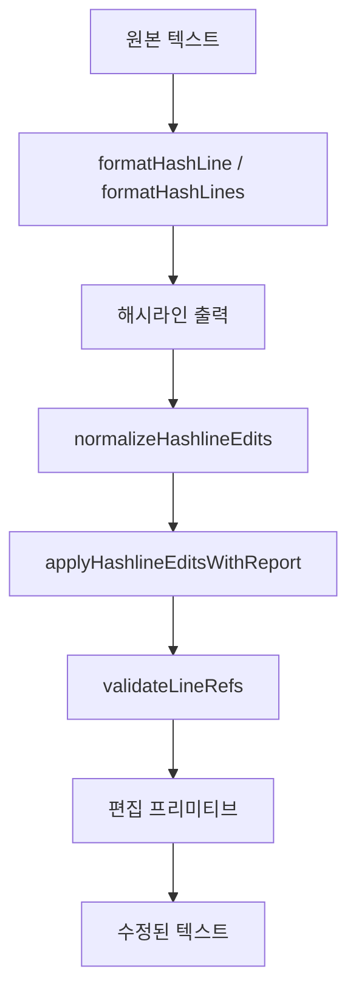

# hashline core

## 해시라인 코어

`packages/hashline-core`는 파일의 각 줄에 안정적인 줄 참조를 붙이고, 그 참조를 기준으로 안전하게 편집을 적용하는 순수 TypeScript 코어 모듈입니다. 핵심 형식은 다음 두 가지입니다.

```text
{line_number}#{hash_id}|{line_content}
{line_number}#{hash_id}
```

예를 들어 `12#ZP|const value = 1`은 12번째 줄의 현재 내용에 대해 계산된 2글자 해시를 함께 노출한 출력이고, `12#ZP`는 이후 편집에서 사용할 앵커입니다.

이 모듈은 런타임이나 파일 시스템에 직접 의존하지 않습니다. `index.ts`가 공개 API를 모아 내보내며, 실제 파일 읽기/쓰기, 도구 UI, CLI, 플러그인 통합은 상위 패키지가 담당합니다.



## 설계 목표

해시라인 코어의 목적은 단순한 줄 번호 기반 편집보다 안전한 편집 앵커를 제공하는 것입니다. 줄 번호만 사용하면 파일이 바뀐 뒤에도 같은 번호가 다른 내용을 가리킬 수 있습니다. 이 모듈은 줄 번호와 줄 내용에서 계산한 짧은 해시를 함께 검증해, 오래된 참조로 편집하려는 상황을 `HashlineMismatchError`로 막습니다.

주요 특징은 다음과 같습니다.

- `computeLineHash()`로 각 줄의 짧은 해시를 계산합니다.
- `formatHashLine()`과 `formatHashLines()`로 사람이 읽고 도구가 재사용할 수 있는 해시라인 출력을 만듭니다.
- `parseLineRef()`, `validateLineRef()`, `validateLineRefs()`로 편집 앵커가 현재 파일 내용과 맞는지 확인합니다.
- `applyHashlineEdits()`와 `applyHashlineEditsWithReport()`로 `replace`, `append`, `prepend` 편집을 적용합니다.
- `canonicalizeFileText()`와 `restoreFileText()`로 BOM과 줄바꿈 형식을 보존합니다.
- `streamHashLinesFromUtf8()`와 `streamHashLinesFromLines()`로 큰 입력을 청크 단위로 해시라인화합니다.

## 해시라인 형식과 해시 계산

해시 문자는 `constants.ts`의 `NIBBLE_STR`와 `HASHLINE_DICT`에서 정의됩니다.

```ts
export const NIBBLE_STR = "ZPMQVRWSNKTXJBYH"
export const HASHLINE_DICT = Array.from({ length: 256 }, ...)
```

`HASHLINE_DICT`는 0부터 255까지의 값을 2글자 코드로 매핑합니다. `HASHLINE_REF_PATTERN`은 앵커 형식인 `{number}#{hash}`를 검증하고, `HASHLINE_OUTPUT_PATTERN`은 `{number}#{hash}|{content}` 출력 형식을 검증합니다.

`computeLineHash(lineNumber, content)`는 다음 순서로 해시를 계산합니다.

1. `\r`을 제거합니다.
2. 오른쪽 공백만 제거합니다.
3. 정규화된 문자열에 문자나 숫자가 있으면 seed `0`을 사용합니다.
4. 의미 있는 문자/숫자가 없는 줄이면 줄 번호를 seed로 사용합니다.
5. `hashXxh32()` 결과를 256으로 나누어 `HASHLINE_DICT`의 2글자 코드로 바꿉니다.

`computeLegacyLineHash()`는 호환성을 위해 남아 있습니다. 이 함수는 모든 공백을 제거한 뒤 해시를 계산합니다. `validateLineRef()`와 `validateLineRefs()`는 현재 방식과 레거시 방식 중 하나라도 맞으면 유효한 참조로 인정합니다.

`xxhash32.ts`의 `hashXxh32()`는 Bun 런타임의 `Bun.hash.xxHash32()`가 있으면 그것을 사용하고, 없으면 내장 순수 JavaScript 구현인 `xxHash32Js()`를 사용합니다. 이 덕분에 패키지 수준에서 특정 런타임에 묶이지 않습니다.

## 해시라인 출력

`hash-computation.ts`는 해시라인 출력의 중심입니다.

- `formatHashLine(lineNumber, content)`는 단일 줄을 `{line}#{hash}|{content}`로 변환합니다.
- `formatHashLines(content)`는 전체 문자열을 줄 단위로 나누어 해시라인 문자열로 변환합니다.
- `streamHashLinesFromUtf8(source, options)`는 `ReadableStream<Uint8Array>` 또는 `AsyncIterable<Uint8Array>`를 UTF-8로 디코딩하면서 해시라인 청크를 생성합니다.
- `streamHashLinesFromLines(lines, options)`는 문자열 줄 iterable을 받아 해시라인 청크를 생성합니다.

스트리밍 함수는 `HashlineStreamOptions`를 받습니다.

```ts
export interface HashlineStreamOptions {
  startLine?: number
  maxChunkLines?: number
  maxChunkBytes?: number
}
```

기본값은 `startLine = 1`, `maxChunkLines = 200`, `maxChunkBytes = 64 * 1024`입니다. 청크 경계 관리는 `createHashlineChunkFormatter()`가 담당합니다. 이 포매터는 줄 수나 UTF-8 바이트 수가 제한을 넘기 전에 현재 청크를 flush합니다.

## 줄 참조 검증

`validation.ts`는 해시라인 편집의 안전장치입니다.

`normalizeLineRef(ref)`는 사용자가 넘긴 참조를 가능한 한 표준 형식으로 정리합니다. 예를 들어 diff prefix, `>>>`, 공백, `|` 뒤의 줄 내용을 제거하고 `{line}#{hash}`만 남깁니다.

`parseLineRef(ref)`는 정규화된 참조를 `LineRef`로 변환합니다.

```ts
export interface LineRef {
  line: number
  hash: string
}
```

형식이 잘못되면 명확한 오류를 던집니다. 특히 `abc#ZZ`처럼 `#` 앞이 줄 번호가 아닌 경우에는 실제 줄 번호를 사용하라는 메시지를 냅니다.

`validateLineRef(lines, ref)`는 단일 참조를 검증하고, `validateLineRefs(lines, refs)`는 여러 참조를 한 번에 검증합니다. 줄 번호가 파일 범위를 벗어나면 일반 `Error`를 던지고, 줄 번호는 맞지만 해시가 현재 내용과 맞지 않으면 `HashlineMismatchError`를 던집니다.

`HashlineMismatchError`는 개발자가 바로 새 앵커로 재시도할 수 있도록 주변 문맥을 포함합니다. 변경된 줄은 `>>>`로 표시되며, `remaps`에는 오래된 `{line}#{expected}`에서 현재 `{line}#{actual}`로의 매핑이 들어 있습니다.

## 편집 모델

편집 타입은 `types.ts`에 정의되어 있습니다.

```ts
export interface ReplaceEdit {
  op: "replace"
  pos: string
  end?: string
  lines: string | string[]
}

export interface AppendEdit {
  op: "append"
  pos?: string
  lines: string | string[]
}

export interface PrependEdit {
  op: "prepend"
  pos?: string
  lines: string | string[]
}
```

`HashlineEdit`는 이 세 타입의 union입니다.

- `replace`는 `pos` 줄 하나를 바꾸거나, `pos`부터 `end`까지 범위를 바꿉니다.
- `append`는 `pos`가 있으면 해당 줄 뒤에 삽입하고, 없으면 파일 끝에 추가합니다.
- `prepend`는 `pos`가 있으면 해당 줄 앞에 삽입하고, 없으면 파일 앞에 추가합니다.

외부 입력은 먼저 `normalizeHashlineEdits(rawEdits)`로 정규화할 수 있습니다. 이 함수는 `RawHashlineEdit`를 받아 `HashlineEdit[]`로 바꾸며, 지원하지 않는 `op`가 들어오면 오류를 던집니다. 레거시 편집 형식은 제거되어 있으며, 오류 메시지도 `op/pos/end/lines` 형식을 사용하라고 안내합니다.

## 편집 적용 흐름

`applyHashlineEditsWithReport(content, edits)`가 편집 적용의 고수준 진입점입니다.

처리 순서는 다음과 같습니다.

1. `dedupeEdits()`로 완전히 같은 편집을 제거합니다.
2. 편집을 아래쪽 줄부터 위쪽 줄 순서로 정렬합니다.
3. 같은 줄에서는 `replace`, `append`, `prepend` 순서로 처리합니다.
4. `collectLineRefs()`로 필요한 모든 앵커를 모읍니다.
5. `validateLineRefs()`로 현재 파일 내용과 앵커 해시를 검증합니다.
6. `detectOverlappingRanges()`로 범위 `replace`끼리 겹치는지 확인합니다.
7. 각 편집을 `applySetLine()`, `applyReplaceLines()`, `applyInsertAfter()`, `applyInsertBefore()`, `applyAppend()`, `applyPrepend()` 중 하나로 적용합니다.
8. 결과가 이전 줄 배열과 같으면 `noopEdits`를 증가시킵니다.

반환 타입은 `HashlineApplyReport`입니다.

```ts
export interface HashlineApplyReport {
  content: string
  noopEdits: number
  deduplicatedEdits: number
}
```

`applyHashlineEdits(content, edits)`는 같은 로직을 사용하되 최종 `content`만 반환하는 편의 함수입니다.

## 편집 프리미티브

`edit-operation-primitives.ts`는 실제 줄 배열 변경을 수행합니다.

`applySetLine(lines, anchor, newText, options)`는 단일 줄 교체입니다. 기본적으로 `validateLineRef()`를 호출하고, `skipValidation: true`가 있으면 상위 흐름에서 이미 검증했다고 보고 생략합니다. 교체 텍스트는 `toNewLines()`로 정규화한 뒤 `autocorrectReplacementLines()`를 거치고, 첫 줄은 `restoreLeadingIndent()`로 원래 들여쓰기를 복원할 수 있습니다.

`applyReplaceLines(lines, startAnchor, endAnchor, newText, options)`는 범위 교체입니다. `startLine > endLine`이면 오류를 던집니다. 교체 텍스트가 주변 문맥을 함께 포함했을 가능성을 고려해 `stripRangeBoundaryEcho()`로 범위 바깥의 앞뒤 줄 echo를 제거한 뒤 자동 보정합니다.

`applyInsertAfter()`와 `applyInsertBefore()`는 앵커 줄 주변 삽입입니다. 삽입 텍스트가 앵커 줄을 같이 포함한 경우 각각 `stripInsertAnchorEcho()`와 `stripInsertBeforeEcho()`로 중복을 제거합니다. 제거 후 빈 삽입이 되면 오류를 던집니다.

`applyAppend()`와 `applyPrepend()`는 파일 끝이나 파일 앞에 삽입합니다. 빈 파일은 `content.length === 0`일 때 상위에서 `[]`로 시작하지만, 프리미티브는 `[""]` 형태도 빈 파일처럼 처리합니다.

## 텍스트 정규화와 echo 제거

`edit-text-normalization.ts`는 편집 payload에서 도구 출력 흔적을 제거합니다.

`stripLinePrefixes(lines)`는 입력 줄의 절반 이상이 해시라인 prefix를 갖고 있으면 `1#ZZ|` 같은 prefix를 제거합니다. 해시 prefix가 아니라 diff의 `+` prefix가 절반 이상이면 `+`만 제거합니다. 이를 통해 모델이나 도구가 해시라인 출력 또는 diff 조각을 그대로 `lines`에 넣어도 실제 코드만 적용할 수 있습니다.

`toNewLines(input)`은 문자열 또는 문자열 배열을 줄 배열로 바꾸고 `stripLinePrefixes()`를 적용합니다.

`restoreLeadingIndent(templateLine, line)`은 새 줄이 들여쓰기 없이 들어왔고 원래 줄에는 들여쓰기가 있을 때, 원래 줄의 leading whitespace를 복원합니다. 단, 새 줄이 이미 들여쓰기되어 있거나 trim 결과가 원래 줄과 같으면 변경하지 않습니다.

echo 제거 함수들은 모델이 “삽입 위치를 보여주기 위해” 기존 줄을 같이 반환한 경우를 보정합니다.

- `stripInsertAnchorEcho(anchorLine, newLines)`는 append용으로 첫 줄이 앵커와 같으면 제거합니다.
- `stripInsertBeforeEcho(anchorLine, newLines)`는 prepend용으로 마지막 줄이 앵커와 같으면 제거합니다.
- `stripInsertBoundaryEcho(afterLine, beforeLine, newLines)`는 양쪽 경계 echo를 제거합니다.
- `stripRangeBoundaryEcho(lines, startLine, endLine, newLines)`는 범위 교체에서 교체 범위 바깥의 앞뒤 줄이 같이 들어왔을 때 제거합니다.

## 자동 보정

`autocorrect-replacement-lines.ts`는 LLM이나 사람이 만든 replacement payload에서 자주 생기는 형태 깨짐을 보정합니다.

`maybeExpandSingleLineMerge(originalLines, replacementLines)`는 원래 여러 줄이던 코드가 replacement에서 한 줄로 합쳐진 경우를 다시 여러 줄로 나누려고 시도합니다. 원래 각 줄의 trim 결과를 병합된 줄 안에서 순서대로 찾고, `&&`, `||`, `??`, `?`, `:`, `=`, `,`, 연산자, `.` 같은 continuation token이 끝에 붙은 경우도 고려합니다. 실패하면 `; ` 기준 분할을 시도합니다.

`restoreOldWrappedLines(originalLines, replacementLines)`는 원래 한 줄이던 코드가 replacement에서 여러 줄로 쪼개졌지만 공백을 제거한 canonical form이 유일하게 일치하는 경우, 원래 줄 형태로 되돌립니다. 후보 길이는 2줄부터 10줄까지입니다.

`restoreIndentForPairedReplacement(originalLines, replacementLines)`는 원본과 replacement 줄 수가 같을 때, replacement 줄에 들여쓰기가 없고 원본에는 들여쓰기가 있으면 원본 들여쓰기를 복원합니다.

`autocorrectReplacementLines(originalLines, replacementLines)`는 위 세 단계를 순서대로 적용하는 통합 함수입니다.

## 편집 중복 제거와 정렬

`edit-deduplication.ts`의 `dedupeEdits(edits)`는 편집 배열에서 같은 작업을 제거합니다. 중복 판단에는 `buildDedupeKey()`가 사용됩니다.

- `replace`는 정규화된 `pos`, 선택적 `end`, 정규화된 `lines`를 키로 사용합니다.
- `append`와 `prepend`는 정규화된 선택적 `pos`와 `lines`를 키로 사용합니다.
- 앵커는 `normalizeLineRef()`로 canonical form을 맞춥니다.
- payload는 `toNewLines()`로 prefix 제거와 줄 분리를 적용한 뒤 `\n`으로 다시 합칩니다.

`edit-ordering.ts`는 편집 적용 순서를 결정하는 보조 함수들을 제공합니다.

`getEditLineNumber(edit)`는 정렬 기준 줄 번호를 반환합니다. 범위 `replace`는 `end`가 있으면 끝 줄을 기준으로 삼습니다. 파일 전체 append/prepend처럼 앵커가 없는 편집은 `Number.NEGATIVE_INFINITY`를 반환합니다.

`collectLineRefs(edits)`는 검증할 앵커만 모읍니다. 파일 전체 append/prepend는 앵커가 없으므로 검증 대상이 없습니다.

`detectOverlappingRanges(edits)`는 `end`가 있는 `replace` 편집끼리 범위가 겹치면 오류 메시지를 반환합니다. 겹치지 않으면 `null`입니다. 단일 줄 `replace`는 이 검사 대상이 아닙니다.

## 파일 텍스트 보존

`file-text-canonicalization.ts`는 파일 내용의 외형적 속성을 보존하기 위한 얇은 envelope를 제공합니다.

`canonicalizeFileText(content)`는 다음 정보를 담은 `FileTextEnvelope`를 반환합니다.

```ts
export interface FileTextEnvelope {
  content: string
  hadBom: boolean
  lineEnding: "\n" | "\r\n"
}
```

처리 방식은 다음과 같습니다.

- UTF-8 BOM이 있으면 제거하고 `hadBom`에 기록합니다.
- 줄바꿈은 내부 처리용으로 LF로 정규화합니다.
- 원래 파일이 CRLF를 먼저 사용했는지 감지해 `lineEnding`에 저장합니다.

`restoreFileText(content, envelope)`는 편집 후 LF 기준 content를 원래 줄바꿈 방식으로 되돌리고, 필요하면 BOM을 다시 붙입니다.

상위 도구는 일반적으로 파일을 읽은 직후 `canonicalizeFileText()`를 호출하고, `applyHashlineEdits()`로 수정한 뒤 `restoreFileText()`로 복원해 쓰는 흐름을 사용합니다.

## diff 유틸리티

`diff-utils.ts`와 `hashline-edit-diff.ts`는 결과 표시와 변경량 계산을 돕습니다.

`toHashlineContent(content)`는 전체 파일을 해시라인 출력으로 변환합니다. `formatHashLines()`와 비슷하지만, 파일 끝 trailing newline을 보존하는 처리가 들어 있습니다.

`generateUnifiedDiff(oldContent, newContent, filePath)`는 `diff` 패키지의 `createTwoFilesPatch()`를 사용해 일반 unified diff를 만듭니다.

`countLineDiffs(oldContent, newContent)`는 줄 문자열별 개수를 비교해 additions/deletions를 계산합니다. 위치 기반 diff가 아니라 multiset 비교이므로, 같은 줄이 이동한 경우에는 추가/삭제로 세지 않을 수 있습니다.

`generateHashlineDiff(oldContent, newContent, filePath)`는 변경된 줄을 해시라인 형식으로 보여주는 단순 diff를 만듭니다. 추가 또는 변경된 줄은 새 내용 기준 `computeLineHash()`를 사용하고, 삭제된 줄은 해시 자리에 공백을 둡니다.

## 공개 API 표면

`index.ts`는 모듈의 공개 API를 barrel export합니다. 주요 그룹은 다음과 같습니다.

해시와 출력:

- `computeLineHash`
- `computeLegacyLineHash`
- `formatHashLine`
- `formatHashLines`
- `streamHashLinesFromUtf8`
- `streamHashLinesFromLines`
- `createHashlineChunkFormatter`

검증:

- `parseLineRef`
- `validateLineRef`
- `validateLineRefs`
- `normalizeLineRef`
- `HashlineMismatchError`
- `LineRef`

편집:

- `normalizeHashlineEdits`
- `applyHashlineEdits`
- `applyHashlineEditsWithReport`
- `applySetLine`
- `applyReplaceLines`
- `applyInsertAfter`
- `applyInsertBefore`
- `applyAppend`
- `applyPrepend`

편집 보조:

- `dedupeEdits`
- `getEditLineNumber`
- `collectLineRefs`
- `detectOverlappingRanges`
- `stripLinePrefixes`
- `toNewLines`
- `restoreLeadingIndent`
- `stripInsertAnchorEcho`
- `stripInsertBeforeEcho`
- `stripInsertBoundaryEcho`
- `stripRangeBoundaryEcho`
- `autocorrectReplacementLines`

파일 텍스트와 diff:

- `canonicalizeFileText`
- `restoreFileText`
- `toHashlineContent`
- `generateUnifiedDiff`
- `countLineDiffs`
- `generateHashlineDiff`

## 기여할 때 주의할 점

해시 계산은 앵커 호환성의 핵심 계약입니다. `computeLineHash()`의 정규화 방식이나 seed 선택을 바꾸면 기존 해시라인 참조가 깨질 수 있습니다. 변경이 필요하다면 `computeLegacyLineHash()`와 `isCompatibleLineHash()`의 호환성 경로까지 함께 검토해야 합니다.

편집 적용은 아래쪽 줄부터 진행된다는 점이 중요합니다. 위쪽부터 편집하면 먼저 적용한 변경 때문에 뒤쪽 줄 번호가 밀릴 수 있습니다. `applyHashlineEditsWithReport()`의 정렬 로직과 `getEditLineNumber()`는 이 문제를 피하기 위한 핵심 부분입니다.

검증은 고수준 함수에서 한 번에 수행하고, 프리미티브에는 `skipValidation: true`로 들어갈 수 있습니다. 새 고수준 적용 함수를 추가한다면 `validateLineRefs()`와 `detectOverlappingRanges()`를 빠뜨리지 않아야 합니다.

자동 보정 함수들은 사용자의 실수를 조용히 흡수하기 위한 편의 계층입니다. 다만 보정은 명확한 경우에만 해야 합니다. `restoreOldWrappedLines()`가 canonical match의 유일성을 확인하는 것처럼, 새 보정 로직도 모호한 경우에는 원본 replacement를 그대로 두는 쪽이 안전합니다.