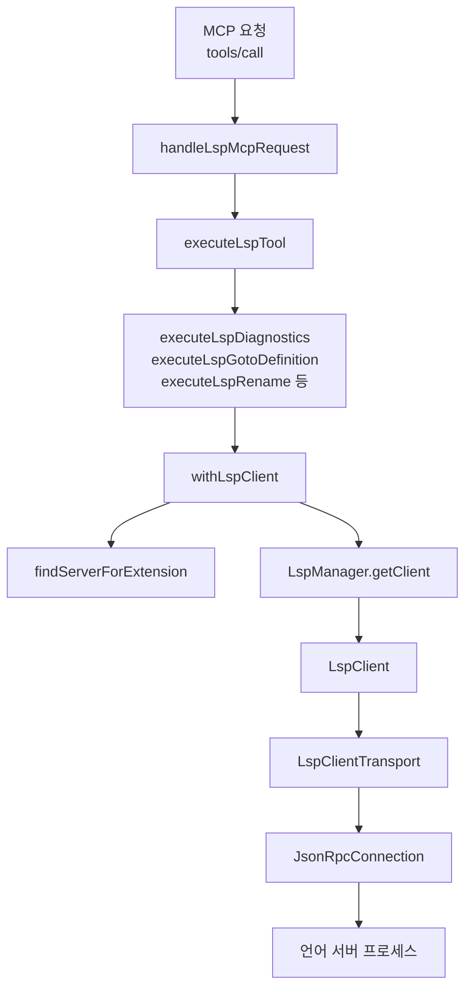

# lsp core

# lsp core

`packages/lsp-core`는 Codex/OpenCode 계열 하네스가 언어 서버 기능을 공통으로 사용할 수 있게 만든 LSP 실행 코어입니다. 모듈의 책임은 크게 네 가지입니다.

1. 파일 경로와 확장자로 적절한 LSP 서버를 찾습니다.
2. 서버 프로세스를 stdio JSON-RPC로 실행하고 초기화합니다.
3. `definition`, `references`, `diagnostics`, `symbols`, `rename` 같은 LSP 요청을 도구 실행 결과로 변환합니다.
4. MCP stdio 서버 표면(`handleLspMcpRequest`, `runMcpStdioServer`)으로 외부 하네스에 노출합니다.

`src/index.ts`는 `./lsp/*`, `./tools.js`, `./mcp.js`, `./request-context.js`를 재수출하는 공개 진입점입니다. 실제 구현은 `lsp/`의 서버·프로세스·프로토콜 계층과 `tools/`의 MCP 도구 계층으로 나뉩니다.



## 공개 표면

이 모듈이 외부에 제공하는 주요 표면은 다음입니다.

- `runMcpStdioServer(input, output)`: MCP stdio 서버를 실행합니다.
- `handleLspMcpRequest(input)`: MCP JSON-RPC 요청 하나를 처리합니다.
- `LSP_MCP_TOOLS`: MCP에 노출되는 LSP 도구 정의 목록입니다.
- `executeLspDiagnostics`, `executeLspGotoDefinition`, `executeLspFindReferences`, `executeLspSymbols`, `executeLspPrepareRename`, `executeLspRename`, `executeLspStatus`, `executeLspInstallDecision`: 개별 도구 실행 함수입니다.
- `withLspClient(filePath, fn, toolName, options)`: 파일 기준으로 서버를 찾고, 클라이언트를 빌려 실행 콜백을 수행하는 핵심 래퍼입니다.
- `LspManager`: 워크스페이스 루트와 서버 ID 단위로 `LspClient`를 캐시하고 수명 주기를 관리합니다.
- `LspClient`: LSP 요청을 파일 중심 API로 감싼 클라이언트입니다.
- `JsonRpcConnection`: LSP stdio 프로토콜의 `Content-Length` 기반 JSON-RPC 프레이밍을 처리합니다.
- `applyWorkspaceEdit`: LSP rename 결과로 받은 `WorkspaceEdit`을 실제 파일 시스템에 적용합니다.
- `runWithRequestContext`, `contextCwd`, `contextEnv`: 요청별 cwd/env를 전역 `process.cwd()`와 분리해서 전달합니다.

## 도구 계층

`tools/definitions.ts`의 `LSP_MCP_TOOLS`가 MCP 도구 목록의 기준입니다. 각 도구는 이름, 별칭, 입력 스키마, 실행 함수를 함께 가집니다.

현재 노출되는 도구는 다음 흐름을 따릅니다.

- `status` / `lsp_status`: `executeLspStatus`가 설정된 서버와 활성 클라이언트 상태를 조회합니다.
- `diagnostics` / `lsp_diagnostics`: `executeLspDiagnostics`가 파일 또는 디렉터리 진단을 수집합니다.
- `goto_definition` / `lsp_goto_definition`: `executeLspGotoDefinition`이 `textDocument/definition`을 호출합니다.
- `find_references` / `lsp_find_references`: `executeLspFindReferences`가 `textDocument/references`를 호출합니다.
- `symbols` / `lsp_symbols`: `executeLspSymbols`가 문서 심볼 또는 워크스페이스 심볼을 조회합니다.
- `prepare_rename` / `lsp_prepare_rename`: `executeLspPrepareRename`이 rename 가능 여부를 확인합니다.
- `rename` / `lsp_rename`: `executeLspRename`이 `textDocument/rename` 결과를 받아 `applyWorkspaceEdit`으로 파일에 적용합니다.
- `install_decision` / `lsp_install_decision`: `executeLspInstallDecision`이 누락된 서버 설치 결정을 기록합니다.

도구 실행 함수는 `parameters.ts`의 `requireString`, `requireNumber`, `optionalBoolean`, `severityFilter`로 입력을 검증하고, `result.ts`의 `text()`로 MCP 도구 결과 형태를 만듭니다. 누락된 LSP 서버나 알려진 시작 실패는 `missingDependencyResult()`를 통해 일반 예외 대신 사용자에게 실행 가능한 메시지로 반환됩니다.

## MCP 서버 흐름

`mcp.ts`는 LSP 코어를 MCP 서버로 노출합니다.

`handleLspMcpRequest(input)`은 다음 요청을 직접 처리합니다.

- `initialize`: 서버 정보와 도구 capability를 반환합니다.
- `notifications/initialized`: 응답 없이 무시합니다.
- `ping`: 빈 성공 응답을 반환합니다.
- `tools/list`: `LSP_MCP_TOOLS.map(describeTool)` 결과를 반환합니다.
- `tools/call`: `executeLspTool(params.name, coerceToolArguments(params.arguments))`로 위임합니다.

도구 실행 중 발생한 예외는 MCP 프로토콜 오류로 던지지 않고, `isError: true`인 성공 응답 안에 텍스트 콘텐츠로 담습니다. 따라서 클라이언트는 JSON-RPC 레벨의 실패와 LSP 도구 실행 실패를 구분할 수 있습니다.

## 요청 컨텍스트

`request-context.ts`는 `AsyncLocalStorage<RequestContext>`를 사용합니다.

```ts
runWithRequestContext({ cwd, env }, () => {
  // 이 내부에서 contextCwd()와 contextEnv()는 요청별 값을 반환합니다.
});
```

`contextCwd()`는 저장된 `cwd`가 있으면 그것을 사용하고, 없으면 `process.cwd()`를 사용합니다. `contextEnv(key)`는 요청 컨텍스트의 `env`를 우선하고, 없으면 `process.env`를 봅니다.

이 구조 덕분에 MCP 서버 하나가 여러 프로젝트 요청을 처리해도, LSP 설정 탐색과 파일 경로 해석이 호출자 기준으로 동작합니다.

## 서버 설정과 해석

LSP 서버 목록은 `config-loader.ts`, `server-definitions.ts`, `server-resolution.ts`가 함께 결정합니다.

`BUILTIN_SERVERS`에는 TypeScript, Python, Rust, Go, Ruby, Dockerfile, YAML 등 여러 언어 서버의 기본 명령과 확장자 매핑이 들어 있습니다. 예를 들어 `typescript`는 `["typescript-language-server", "--stdio"]`와 `.ts`, `.tsx`, `.js`, `.jsx` 계열 확장자를 가집니다.

사용자 설정은 `.codex/lsp-client.json` 형태를 사용합니다.

```json
{
  "lsp": {
    "typescript": {
      "extensions": [".ts", ".tsx"],
      "priority": 10,
      "initialization": {
        "preferences": {
          "includePackageJsonAutoImports": "on"
        }
      }
    }
  }
}
```

설정 로딩 순서는 다음입니다.

1. 프로젝트 설정: 기본값은 `<contextCwd>/.codex/lsp-client.json`입니다.
2. 사용자 설정: 기본값은 `~/.codex/lsp-client.json`입니다.
3. 내장 서버: `BUILTIN_SERVERS`에서 채웁니다.

`LSP_TOOLS_MCP_PROJECT_CONFIG`가 있으면 프로젝트 설정 경로를 override할 수 있고, 경로 여러 개는 OS별 `delimiter`로 나눕니다. `LSP_TOOLS_MCP_USER_CONFIG`가 있으면 사용자 설정 경로를 override합니다.

`getMergedServers()`는 프로젝트, 사용자, 내장 서버 순으로 병합합니다. 같은 ID는 먼저 본 항목이 우선합니다. `disabled: true`인 서버 ID는 이후 내장 서버에서도 제외됩니다. 정렬은 source 우선순위가 `project`, `user`, `builtin` 순이고, 같은 source 안에서는 `priority`가 높은 서버가 먼저 옵니다.

`findServerForExtension(ext)`는 병합된 서버 목록에서 확장자를 지원하고 `isServerInstalled(server.command)`가 참인 서버를 찾습니다. 찾지 못했지만 확장자를 지원하는 서버가 있으면 `not_installed`를 반환하고, 지원 서버 자체가 없으면 `not_configured`를 반환합니다.

## 설치 결정 상태

언어 서버가 설치되어 있지 않을 때 `formatServerLookupError()`는 설치 안내를 만듭니다. 이때 `server-install-state.ts`의 설치 결정 기록을 함께 봅니다.

- `declined`: 사용자가 설치를 거절했거나 명시적으로 설치를 요청하지 않았다는 뜻입니다. 이후 메시지는 “LSP 없이 진행”하도록 짧게 나갑니다.
- `allowed`: 사용자가 설치를 사전 허용했다는 뜻입니다. 이후 메시지는 설치 명령을 실행하고 도구를 재시도하라는 형태가 됩니다.

결정 파일 기본 경로는 `~/.codex/lsp-install-decisions.json`입니다. `LSP_TOOLS_MCP_INSTALL_DECISIONS` 환경 변수로 override할 수 있습니다. `recordInstallDecision()`은 임시 파일에 먼저 쓰고 `renameSync()`로 교체하므로 부분 쓰기를 피합니다.

## 클라이언트 획득 흐름

대부분의 도구는 직접 `LspClient`를 만들지 않고 `withLspClient()`를 통합니다.

`withLspClient(filePath, fn, toolName, options)`의 책임은 다음입니다.

1. `contextCwd()` 기준으로 파일 경로를 절대화합니다.
2. 디렉터리 경로가 들어오면 `LspInvalidPathError`를 던집니다. 디렉터리 진단은 별도 경로인 `executeLspDiagnostics`가 처리합니다.
3. `effectiveExtension(absPath)`로 확장자를 구합니다. `Dockerfile`, `Containerfile`은 `.dockerfile`로 취급됩니다.
4. `findServerForExtension(ext)`로 서버를 찾습니다.
5. `findWorkspaceRoot(absPath)`로 워크스페이스 루트를 찾습니다.
6. `LspManager.getClient(root, server, signal)`로 클라이언트를 빌립니다.
7. 콜백 `fn(client, root)`을 실행합니다.
8. 마지막에 `manager.releaseClient(root, server.id)`를 호출합니다.

읽기 전용 도구(`diagnostics`, `definition`, `references`, `documentSymbols`, `workspaceSymbols`, `prepareRename`)는 죽은 연결 오류(`LspConnectionClosedError`, `LspProcessExitedError`)가 나면 한 번 클라이언트를 무효화하고 재시도합니다. 요청 timeout이 발생했는데 서버가 아직 초기화 중이면 `LspServerInitializingError`로 바꿔 “잠시 후 재시도” 메시지를 만들 수 있게 합니다.

## 워크스페이스 루트 탐색

`findWorkspaceRoot(filePath)`는 파일 또는 디렉터리에서 위로 올라가며 다음 marker를 찾습니다.

- `.git`
- `package.json`
- `pyproject.toml`
- `Cargo.toml`
- `go.mod`
- `pom.xml`
- `build.gradle`

marker를 찾으면 해당 디렉터리를 루트로 봅니다. 끝까지 찾지 못하면 대상 파일의 부모 디렉터리를 사용합니다. 이 루트는 LSP 서버 프로세스의 cwd, `initialize.rootUri`, `workspaceFolders`에 사용됩니다.

## 클라이언트 수명 주기

`LspManager`는 `(workspaceRoot, serverId)` 조합을 key로 `LspClient`를 관리합니다.

`getClient()`는 이미 초기화 중인 클라이언트가 있으면 같은 `initPromise`를 기다립니다. 초기화가 끝난 클라이언트는 `refCount`를 증가시켜 반환합니다. 사용자는 반드시 `releaseClient()`를 통해 반납해야 하며, `withLspClient()`는 이를 `finally`에서 처리합니다.

관리 상태에는 다음 값이 포함됩니다.

- `refCount`: 현재 사용 중인 요청 수입니다.
- `pendingWaiters`: 초기화를 기다리는 요청 수입니다.
- `lastUsedAt`: idle reaper 판단에 쓰는 마지막 사용 시각입니다.
- `initPromise`: 서버 시작과 `initialize()`가 끝날 때까지 공유되는 Promise입니다.
- `isInitializing`, `initializingSince`: 초기화 timeout 판단에 사용됩니다.

`reapStale()`은 주기적으로 두 가지 상황을 정리합니다.

- 초기화가 `initTimeoutMs`보다 오래 걸린 클라이언트
- 참조 수와 대기자가 없고 `idleTimeoutMs`보다 오래 사용되지 않은 클라이언트

`warmupClient(root, server)`는 실제 요청 없이 서버를 미리 시작합니다. 성공하면 캐시에 남기고, 실패하면 캐시에서 제거한 뒤 best-effort로 중지합니다.

프로세스 종료 시그널 정리는 `installProcessSignalCleanup()`이 담당합니다. `SIGINT`, `SIGTERM`, Windows의 경우 `SIGBREAK`에 대해 `stopAll()`을 연결합니다.

## LSP 클라이언트와 문서 동기화

`LspClient`는 `LspClientConnection`을 상속하며, 파일 중심 LSP API를 제공합니다.

- `openFile(filePath)`
- `definition(filePath, line, character)`
- `references(filePath, line, character, includeDeclaration)`
- `documentSymbols(filePath)`
- `workspaceSymbols(query)`
- `diagnostics(filePath)`
- `prepareRename(filePath, line, character)`
- `rename(filePath, line, character, newName)`

`openFile()`은 파일 내용을 읽어 `textDocument/didOpen` 또는 `textDocument/didChange`를 보냅니다. 처음 여는 파일은 `version = 1`로 시작하고, 이후 내용이 바뀐 경우 version을 증가시킵니다. 동일한 내용이면 중복 동기화를 하지 않습니다.

`definition`, `references`, `prepareRename`, `rename`은 외부 API에서는 1-based line을 받지만 LSP 요청에는 0-based line으로 변환합니다. `character`는 이미 0-based column으로 받습니다.

`diagnostics()`는 먼저 `textDocument/diagnostic` pull 요청을 시도합니다. 서버가 이 메서드를 지원하지 않으면 `textDocument/publishDiagnostics` notification으로 누적된 저장 진단을 반환합니다. 지원하지 않는 오류는 조용히 fallback하고, 그 외 pull 오류는 `diagnosticPullErrors`에 보관합니다.

## 연결 초기화

`LspClientConnection.initialize()`는 표준 LSP `initialize` 요청을 보냅니다.

초기화 payload에는 다음 capability가 포함됩니다.

- `textDocument.definition.linkSupport`
- `textDocument.documentSymbol.hierarchicalDocumentSymbolSupport`
- `textDocument.rename.prepareSupport`
- `textDocument.codeAction` 관련 literal/resolve 지원
- `workspace.symbol`
- `workspace.workspaceFolders`
- `workspace.configuration`
- `workspace.applyEdit`
- `workspace.workspaceEdit.documentChanges`

초기화 후에는 `initialized` notification과 `workspace/didChangeConfiguration` notification을 보냅니다. JSON validation 설정은 `{ json: { validate: { enable: true } } }`로 전달됩니다. 일부 서버가 `initialized` 직후 바로 준비되지 않는 문제를 줄이기 위해 짧은 settle delay를 둡니다.

## 프로세스와 전송 계층

`LspClientTransport`는 서버 프로세스 실행, JSON-RPC 연결, timeout, 종료 처리를 담당합니다.

`start()`는 다음 순서로 동작합니다.

1. `createLspSpawnEnv()`로 환경을 만듭니다.
2. `spawnProcess(server.command, { cwd: root, env })`로 서버를 실행합니다.
3. stderr를 최근 100개 chunk까지 버퍼링합니다.
4. 서버가 즉시 종료됐는지 확인합니다.
5. stdout/stdin으로 `JsonRpcConnection`을 만듭니다.
6. 서버가 보내는 `textDocument/publishDiagnostics`를 `diagnosticsStore`에 저장합니다.
7. 서버의 `workspace/configuration`, `client/registerCapability`, `window/workDoneProgress/create` 요청에 응답합니다.
8. 연결 close를 감지하면 `processExited = true`로 표시합니다.

`sendRequest()`는 기본 `REQUEST_TIMEOUT_MS` 안에 응답이 없으면 `LspRequestTimeoutError`를 던집니다. 요청 중 프로세스가 종료되면 `LspProcessExitedError`로 바꾸고, stream close 계열 오류는 `LspConnectionClosedError`로 바꿉니다.

`stop()`은 best-effort 종료를 수행합니다.

1. 가능하면 `shutdown` 요청을 보냅니다.
2. `exit` notification을 보냅니다.
3. JSON-RPC 연결을 dispose합니다.
4. 프로세스에 종료 신호를 보냅니다.
5. 일정 시간 안에 종료되지 않으면 `SIGKILL`을 시도합니다.
6. 진단 저장소를 비웁니다.

정리 중 실패는 기본적으로 무시됩니다. 단, `CODEX_LSP_DEBUG_CLEANUP=1`이면 `reportBestEffortCleanupError()`가 stderr에 디버그 메시지를 출력합니다.

## 프로세스 실행의 플랫폼 처리

`process.ts`는 LSP 서버 프로세스를 직접 실행하는 계층입니다.

`spawnProcess(command, options)`는 먼저 `validateCwd()`로 작업 디렉터리가 존재하는 디렉터리인지 확인합니다. 실패하면 `LspInvalidPathError`를 던집니다.

Windows에서는 `createSpawnCommand()`가 `.cmd`, `.bat` 같은 shell shim을 감지해 `cmd.exe /d /s /c ...` 형태로 실행합니다. 일반 실행 파일은 `PATHEXT`와 `PATH`를 기준으로 실제 command 경로를 찾습니다. Unix 계열에서는 `detached: true`로 실행한 뒤 process group에 신호를 보낼 수 있게 합니다.

`killProcessTree()`는 Windows에서 `taskkill /f /t`를 먼저 시도하고, Unix 계열에서는 `process.kill(-pid, signal)`로 process group 종료를 시도합니다. 둘 다 실패하면 단일 프로세스 kill로 fallback합니다.

## JSON-RPC 프레이밍

`JsonRpcConnection`은 LSP stdio의 `Content-Length: ...\r\n\r\n<body>` 프레이밍을 직접 구현합니다.

주요 메서드는 다음입니다.

- `listen()`: reader/writer 이벤트를 연결합니다.
- `sendRequest(method, params)`: id를 증가시키며 요청을 쓰고 pending map에 저장합니다.
- `sendNotification(method, params)`: id 없는 notification을 씁니다.
- `onNotification(method, handler)`: 서버 notification handler를 등록합니다.
- `onRequest(method, handler)`: 서버가 클라이언트에 보내는 request handler를 등록합니다.
- `dispose()`: stream listener와 pending 요청을 정리합니다.

수신 데이터는 내부 buffer에 누적되고, `Content-Length` header와 body 길이가 충분할 때만 JSON을 파싱합니다. 파싱 실패, 잘못된 request, 없는 method는 JSON-RPC 표준 오류 코드(`-32700`, `-32600`, `-32601`, `-32603`)로 응답합니다.

## 진단 수집

파일 진단은 `executeLspDiagnostics()`가 `withLspClient()`를 통해 `client.diagnostics(filePath)`를 호출합니다. 결과는 `filterDiagnosticsBySeverity()`로 필터링하고, `DEFAULT_MAX_DIAGNOSTICS`를 넘으면 앞부분만 출력합니다.

디렉터리 진단은 별도 흐름입니다.

1. `isDirectoryPath(absPath)`로 디렉터리인지 확인합니다.
2. `inferExtensionFromDirectory(absPath)`가 지원 확장자 중 가장 많이 발견된 확장자를 고릅니다.
3. `aggregateDiagnosticsForDirectory(absDir, extension, severity)`가 파일을 순회합니다.
4. 같은 `LspClient` 하나를 빌려 여러 파일의 진단을 차례대로 수집합니다.

`collectFilesWithExtension()`과 `inferExtensionFromDirectory()`는 다음 디렉터리를 건너뜁니다.

- `node_modules`
- `.git`
- `dist`
- `build`
- `.next`
- `out`

디렉터리 진단은 기본적으로 `DEFAULT_MAX_DIRECTORY_FILES`까지만 스캔합니다. 전체 진단 출력도 `DEFAULT_MAX_DIAGNOSTICS`로 제한됩니다.

## 심볼과 위치 포맷

`formatters.ts`는 LSP 원시 응답을 사람이 읽기 쉬운 문자열로 바꿉니다.

- `formatLocation(loc)`: `filePath:line:character` 형태로 변환합니다.
- `formatDocumentSymbol(symbol, indent)`: 계층형 문서 심볼을 들여쓰기된 outline으로 출력합니다.
- `formatSymbolInfo(symbol)`: workspace symbol 정보를 위치와 함께 출력합니다.
- `formatDiagnostic(diag)`: `severity[source] (code) at line:char: message` 형태로 출력합니다.
- `formatPrepareRenameResult(result)`: rename 가능 여부와 범위를 설명합니다.
- `formatApplyResult(result)`: workspace edit 적용 결과를 요약합니다.

심볼 종류와 진단 severity 이름은 `language-mappings.ts`의 `SYMBOL_KIND_MAP`, `SEVERITY_MAP`을 사용합니다. 확장자에서 LSP `languageId`를 구할 때도 `EXT_TO_LANG`와 `getLanguageId()`가 쓰입니다.

## Rename과 WorkspaceEdit 적용

`executeLspRename()`은 `client.rename()`으로 `WorkspaceEdit`을 받은 뒤 `applyWorkspaceEdit()`으로 즉시 파일에 적용합니다.

`applyWorkspaceEdit()`은 다음 두 형태를 모두 처리합니다.

- `edit.changes`: URI별 `TextEdit[]`
- `edit.documentChanges`: `TextDocumentEdit`, `CreateFile`, `RenameFile`, `DeleteFile`

적용 전에는 `uriToWorkspacePath()`가 URI를 실제 파일 경로로 변환하고, `realpathForValidation()`과 `isPathInsideWorkspace()`로 workspace 밖 파일을 수정하지 못하게 막습니다. 존재하지 않는 파일은 부모 디렉터리의 realpath를 기준으로 검증합니다.

텍스트 편집은 뒤쪽 위치부터 정렬해 적용합니다. 같은 파일의 여러 edit가 앞쪽부터 적용되면 뒤 edit의 line/character가 밀릴 수 있기 때문입니다.

```ts
const sortedEdits = [...edits].sort((a, b) => {
  if (b.range.start.line !== a.range.start.line) {
    return b.range.start.line - a.range.start.line;
  }
  return b.range.start.character - a.range.start.character;
});
```

이 모듈의 rename은 LSP가 반환한 편집을 신뢰하되, 파일 경계는 workspaceRoot로 제한합니다. 새 rename 관련 기능을 추가할 때는 이 경계 검증을 우회하지 않아야 합니다.

## 오류 모델

오류 타입은 `errors.ts`에 모여 있습니다.

- `LspConnectionClosedError`: JSON-RPC 연결이나 stream이 닫혔습니다.
- `LspProcessExitedError`: LSP 서버 프로세스가 종료됐습니다. 최근 stderr tail을 포함할 수 있습니다.
- `LspRequestTimeoutError`: 특정 LSP method 요청이 timeout 됐습니다.
- `LspInvalidPathError`: 파일 또는 작업 디렉터리 경로가 잘못됐습니다.
- `LspServerLookupError`: 확장자에 맞는 서버를 찾지 못했습니다.
- `LspServerInitializingError`: 서버 초기화 중 timeout이 발생했습니다.
- `LspProcessSpawnError`: 프로세스 실행 자체가 실패했습니다.

`utils.ts`는 사용자에게 그대로 보여줄 수 있는 누락 의존성 메시지를 정리합니다. 특히 `formatKnownLspStartupFailure()`는 `rust-analyzer`가 `rust-src` 문제로 종료되는 경우를 감지해 `rustup component remove rust-src`와 `rustup component add rust-src` 복구 안내를 반환합니다.

`handleMissingDependencyError()`는 알려진 시작 실패, `NOT INSTALLED`, `No LSP server configured` 메시지를 도구 결과로 변환할 수 있게 해줍니다.

## 상태 조회

`getAllServers()`는 병합된 서버 목록과 설치 여부를 반환합니다. 비활성화된 서버는 별도로 `disabled: true` 상태로 포함될 수 있습니다.

`LspManager.getSnapshot()`은 현재 캐시된 클라이언트 상태를 반환합니다.

- `root`
- `serverId`
- `refCount`
- `pendingWaiters`
- `lastUsedAt`
- `isInitializing`
- `alive`
- `command`

`executeLspStatus()`는 이 두 정보를 조합해 “설정된 서버”와 “현재 떠 있는 클라이언트”를 보여주는 도구 표면입니다. 이 도구는 새 언어 서버를 시작하지 않고 현재 상태만 읽습니다.

## 확장자를 다루는 규칙

일반 파일은 `path.extname()`으로 확장자를 구합니다. 단, basename 기반 특수 처리가 있습니다.

- `Dockerfile` → `.dockerfile`
- `Containerfile` → `.dockerfile`

디렉터리에서 확장자를 추론할 때는 `inferExtensionFromDirectory()`가 최대 500개 entry를 스캔하고, `EXT_TO_LANG`에 등록된 확장자만 집계합니다. 가장 많이 등장한 확장자가 선택됩니다.

새 언어를 추가할 때는 보통 다음 위치를 함께 확인해야 합니다.

1. `language-mappings.ts`의 `EXT_TO_LANG`
2. `server-definitions.ts`의 `BUILTIN_SERVERS`
3. 필요하면 `LSP_INSTALL_HINTS`
4. 자동 설치 대상으로 삼을 경우 `AUTO_INSTALLABLE_SERVERS`

## 설정 예시

내장 서버를 프로젝트에서 비활성화하려면 다음처럼 설정합니다.

```json
{
  "lsp": {
    "typescript": {
      "disabled": true
    }
  }
}
```

사용자 설정에서 커스텀 서버를 추가하려면 `command`와 `extensions`가 모두 필요합니다.

```json
{
  "lsp": {
    "my-language-server": {
      "command": ["my-lsp", "--stdio"],
      "extensions": [".my"],
      "priority": 20,
      "env": {
        "MY_LSP_MODE": "strict"
      },
      "initialization": {
        "featureFlags": {
          "diagnostics": true
        }
      }
    }
  }
}
```

프로젝트 설정은 내장 서버 ID를 기준으로 제한적으로 override합니다. `createServerFromEntry()`는 프로젝트 source에서 내장 서버가 아닌 ID를 무시합니다. 즉, 프로젝트 설정은 안전하게 기존 서버의 확장자, priority, initialization을 조정하는 용도이고, 임의 command를 추가하는 표면은 사용자 설정 쪽입니다.

## 다른 패키지와의 연결

`lsp-core`는 특정 하네스에 직접 묶이지 않는 공통 패키지입니다. OpenCode/Codex 쪽 어댑터는 이 패키지의 MCP 서버 또는 도구 실행 함수를 사용해 LSP 기능을 노출합니다.

연결 지점은 두 층입니다.

- MCP 연결: `runMcpStdioServer()`가 stdio MCP 서버로 실행되고, 하네스는 `tools/list`, `tools/call`로 LSP 도구를 호출합니다.
- 직접 실행 연결: 테스트나 내부 패키지는 `executeLspTool`, 개별 `executeLsp*` 함수, `LspManager`, `JsonRpcConnection`을 직접 가져다 검증합니다.

테스트 호출 그래프상 `lsp-tools-mcp` 쪽 테스트도 `JsonRpcConnection`, `LspManager`, `LspProcessExitedError`, `handleMissingDependencyError` 등을 참조합니다. 따라서 이 패키지는 단순 내부 구현이 아니라 MCP 계층과 LSP 도구 패키지 양쪽에서 공유되는 안정 표면입니다.

## 기여 시 주의점

LSP 도구를 추가할 때는 `LSP_MCP_TOOLS`에 descriptor와 실행 함수를 함께 등록해야 합니다. 입력 검증은 `parameters.ts`의 helper를 우선 사용하고, 출력은 `text()` 형태를 맞추는 것이 기존 패턴입니다.

서버 탐색이나 설정 병합을 바꿀 때는 `getMergedServers()`, `findServerForExtension()`, `getAllServers()`의 관계를 함께 봐야 합니다. `status` 도구, 실제 요청 도구, 설치 결정 도구가 모두 이 경로를 공유합니다.

프로세스 종료나 cleanup 로직을 바꿀 때는 실패를 사용자 작업 실패로 올릴지, best-effort로만 기록할지 구분해야 합니다. 현재 `stop()`, signal cleanup, idle reaper의 정리 실패는 `CODEX_LSP_DEBUG_CLEANUP=1`일 때만 노출됩니다.

`applyWorkspaceEdit()`을 수정할 때는 workspace 밖 경로 차단이 핵심 안전장치입니다. URI 변환, realpath 검증, 뒤에서 앞으로 적용하는 edit 순서를 유지해야 합니다.

읽기 전용 LSP 요청은 죽은 연결에서 한 번 재시도하는 정책을 갖습니다. 새 읽기 전용 도구를 추가한다면 `client-wrapper.ts`의 `READ_ONLY_RETRY_TOOLS`에 toolName을 포함할지 검토해야 합니다. 반대로 파일을 수정하는 도구는 자동 재시도가 중복 적용 위험을 만들 수 있으므로 신중해야 합니다.