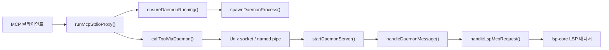

# lsp daemon

## LSP 데몬 모듈

`packages/lsp-daemon`은 LSP 기반 MCP 도구 호출을 장기 실행 데몬 프로세스로 위임하는 얇은 프록시 계층입니다. MCP stdio 서버는 언어 서버를 직접 실행하지 않고, Unix socket 또는 Windows named pipe로 데몬에 `tools/call` 요청을 전달합니다. 실제 LSP 요청 처리는 `@oh-my-opencode/lsp-core`의 `handleLspMcpRequest()`와 기본 LSP 매니저가 담당합니다.

이 구조의 핵심 목적은 다음과 같습니다.

- MCP stdio 프로세스를 가볍게 유지합니다.
- 언어 서버 수명주기를 데몬 프로세스 안에서 재사용합니다.
- Codex 플러그인 요청마다 필요한 `cwd`와 제한된 환경 변수를 데몬으로 안전하게 전달합니다.
- 데몬이 없거나 죽어 있으면 요청 시 자동으로 다시 시작합니다.

## 실행 진입점

CLI 진입점은 `src/cli.ts`입니다.

```ts
const [command = "mcp"] = argv.slice(2);

if (command === "daemon") {
	await runDaemon();
	return;
}
if (command === "mcp") {
	await runMcpStdioProxy();
	return;
}
```

지원하는 명령은 두 가지입니다.

- `omo-lsp-daemon mcp`: 기본 모드입니다. MCP stdio 프록시를 실행합니다.
- `omo-lsp-daemon daemon`: 백그라운드 LSP 데몬 서버를 실행합니다.

알 수 없는 명령은 `Usage: omo-lsp-daemon [mcp | daemon]`를 출력하고 종료 코드 `2`를 설정합니다.

## 전체 구조



프록시는 MCP 프로토콜을 받고, 데몬 클라이언트는 데몬 프로세스의 존재를 보장한 뒤 JSON-RPC 한 줄 메시지를 소켓으로 보냅니다. 데몬 서버는 메시지를 디코딩하고 `lsp-core`로 전달합니다.

## MCP stdio 프록시

`runMcpStdioProxy()`는 `src/proxy.ts`의 주 진입점입니다. 이 함수는 `@oh-my-opencode/mcp-stdio-core`의 `runJsonRpcStdioServer()`를 사용해 stdin/stdout 기반 JSON-RPC 서버를 띄웁니다.

```ts
await runJsonRpcStdioServer({
	input,
	output,
	handler: handleProxyRequest,
	handlerOptions: callOptions,
	onHandlerError: ...
});
```

요청 처리 로직은 `handleProxyRequest()`에 있습니다.

- `asToolCall()`이 `method === "tools/call"` 요청인지 확인합니다.
- 도구 호출이면 `callToolViaDaemon()`으로 데몬에 위임합니다.
- 도구 호출이 아니면 `handleLspMcpRequest()`로 직접 넘깁니다.

즉, `tools/call`은 데몬을 통해 실행되고, 도구 목록이나 MCP 메타데이터처럼 데몬이 필요 없는 요청은 `lsp-core`의 MCP 핸들러가 바로 처리합니다.

`asToolCall()`은 다음 형태만 도구 호출로 인정합니다.

```ts
{
	method: "tools/call",
	params: {
		name: string,
		arguments?: Record<string, unknown>
	}
}
```

`arguments`가 평범한 객체가 아니면 빈 객체 `{}`로 처리합니다.

## 데몬 자동 시작

`ensureDaemonRunning()`은 데몬이 떠 있는지 확인하고, 없으면 한 프로세스만 데몬을 시작하도록 락을 잡습니다.

흐름은 다음과 같습니다.

1. `probeSocket(paths.socket)`으로 기존 데몬이 응답 가능한지 확인합니다.
2. 응답하면 즉시 반환합니다.
3. 응답하지 않으면 `tryAcquireLock(paths.lock)`으로 락 파일을 잡습니다.
4. 락을 못 잡으면 다른 프로세스가 데몬을 시작 중이라고 보고 `waitUntilReachable()`로 대기합니다.
5. 락을 잡으면 stale socket을 지우고 `spawnDaemonProcess()`로 데몬을 띄웁니다.
6. `waitUntilReachable()`이 소켓 접속 가능 상태가 될 때까지 폴링합니다.

기본 타임아웃과 폴링 간격은 다음과 같습니다.

- `PROBE_TIMEOUT_MS`: 500ms
- `DEFAULT_READY_TIMEOUT_MS`: 5초
- `DEFAULT_POLL_INTERVAL_MS`: 100ms

데몬이 제한 시간 안에 준비되지 않으면 `DaemonUnreachableError`가 발생합니다.

## 락 파일 처리

`src/lock.ts`는 데몬 시작 경쟁을 막기 위한 파일 락 유틸리티입니다.

주요 함수는 다음과 같습니다.

- `tryAcquireLock(lockPath, ownerPid = process.pid)`
- `readLockPid(lockPath)`
- `isProcessAlive(pid)`
- `unlinkQuietly(path)`

`tryAcquireLock()`은 `openSync(lockPath, "wx")`를 사용합니다. `"wx"`는 파일이 이미 있으면 실패하므로, 여러 프로세스가 동시에 데몬을 시작하려 할 때 한 프로세스만 락을 얻습니다.

락 파일이 이미 있으면 `reapStaleLock()`이 기존 PID를 읽습니다. 해당 프로세스가 살아 있으면 락 획득에 실패하고, 죽은 프로세스의 락이면 파일을 삭제한 뒤 한 번 더 시도합니다.

`LockHandle.release()`는 내부적으로 `unlinkQuietly(lockPath)`를 호출합니다.

## 데몬 프로세스 실행

`spawnDaemonProcess()`는 현재 Node 실행 파일(`execPath`)로 같은 패키지의 `cli.js daemon`을 detached 프로세스로 실행합니다.

```ts
const child = spawn(execPath, [cliPath, "daemon"], {
	detached: true,
	stdio: ["ignore", logFd, logFd],
});
child.unref();
```

stdout과 stderr는 모두 `paths.log`에 append됩니다. 이 로그 파일은 데몬이 시작되지 않거나 요청 중 예외가 발생했을 때 확인해야 하는 1차 진단 지점입니다.

## 경로 계산

`src/paths.ts`는 데몬 버전과 저장 경로를 계산합니다.

`daemonPaths()`는 다음 값을 반환합니다.

```ts
interface DaemonPaths {
	version: string;
	dir: string;
	socket: string;
	lock: string;
	pid: string;
	log: string;
}
```

기본 기준 디렉터리는 `daemonBaseDir()`이 결정합니다.

우선순위는 다음과 같습니다.

1. `CODEX_LSP_DAEMON_DIR`
2. `PLUGIN_DATA/daemon`
3. `CODEX_HOME/codex-lsp/daemon`
4. `~/.codex/codex-lsp/daemon`

실제 데몬 디렉터리는 여기에 `v${version}`을 붙인 경로입니다. 버전은 `resolveDaemonVersion()`이 `./package.json`, `../package.json` 순서로 찾아 읽고, 실패하면 `"0"`을 사용합니다.

소켓 경로는 플랫폼별로 다릅니다.

- Windows: `\\.\pipe\omo-lsp-${version}-${digest}`
- 그 외: `${dir}/daemon.sock`

Unix 계열에서 자연 소켓 경로가 너무 길면 `tmpdir()` 아래의 짧은 경로로 대체합니다. `digest`는 데몬 디렉터리의 SHA-256 해시 앞 16자리입니다.

## 데몬 클라이언트

`callToolViaDaemon()`은 외부에서 가장 많이 쓰는 호출 함수입니다.

```ts
export async function callToolViaDaemon(
	name: string,
	args: Record<string, unknown>,
	options: CallToolOptions = {},
): Promise<ToolExecutionResult>
```

이 함수는 다음을 수행합니다.

1. `daemonPaths()`로 경로를 계산합니다.
2. `withContext()`로 요청 인자에 `_context`를 삽입합니다.
3. `ensureDaemonRunning()`으로 데몬 실행을 보장합니다.
4. `sendToolCall()`로 소켓에 JSON-RPC 요청을 씁니다.
5. 실패 시 한 번 재시도합니다.
6. 그래도 실패하면 예외를 던지지 않고 `isError: true`인 `ToolExecutionResult`를 반환합니다.

재시도 규칙이 중요합니다. `DaemonRequestError`가 발생했더라도 요청이 이미 소켓에 쓰인 뒤라면 재시도하지 않습니다. 이는 같은 도구 호출이 중복 실행되는 것을 피하기 위한 동작입니다.

`callDiagnosticsViaDaemon()`은 진단 요청 전용 편의 함수입니다.

```ts
callToolViaDaemon("diagnostics", { filePath, severity: "error" }, options)
```

## 요청 컨텍스트 전달

MCP 프록시 프로세스와 데몬 프로세스는 서로 다른 프로세스입니다. 그래서 현재 요청의 작업 디렉터리와 일부 환경 변수를 명시적으로 전달해야 합니다.

`currentRequestContext()`는 다음 환경 변수만 전달합니다.

- `LSP_TOOLS_MCP_PROJECT_CONFIG`
- `LSP_TOOLS_MCP_USER_CONFIG`
- `LSP_TOOLS_MCP_INSTALL_DECISIONS`

반환 형태는 다음과 같습니다.

```ts
{
	cwd: process.cwd(),
	env: {
		LSP_TOOLS_MCP_PROJECT_CONFIG: "...",
		...
	}
}
```

`withContext()`는 이 값을 도구 인자의 `_context` 필드로 붙입니다. `_context` 키 이름은 `request-routing.ts`의 `CONTEXT_KEY` 상수로 공유됩니다.

데몬 쪽에서는 `extractRequestContext()`가 `_context`를 읽고, 실제 `handleLspMcpRequest()`로 넘기기 전 인자에서 제거합니다. 그 다음 `runWithRequestContext()`로 `lsp-core` 요청 컨텍스트를 설정합니다.

이 패턴 덕분에 데몬은 장기 실행 프로세스이면서도 각 요청의 `cwd`와 설정 파일 경로를 분리해서 처리할 수 있습니다.

## 소켓 JSON-RPC 프로토콜

`src/socket-jsonrpc.ts`는 데몬 클라이언트와 서버 사이의 메시지 포맷을 담당합니다.

`encodeJsonLine()`은 JSON 객체를 한 줄 문자열로 직렬화합니다.

```ts
export function encodeJsonLine(message: unknown): string {
	return `${JSON.stringify(message)}\n`;
}
```

`createLineDecoder()`는 스트림 chunk를 누적하다가 `\n`을 만나면 한 줄씩 `JSON.parse()`합니다. 빈 줄은 무시합니다. 파싱 실패 시 `onParseError` 콜백이 제공된 경우에만 에러를 넘깁니다.

데몬 클라이언트의 `sendToolCall()`은 고정 요청 ID `1`을 사용합니다.

```ts
{
	jsonrpc: "2.0",
	id: 1,
	method: "tools/call",
	params: {
		name,
		arguments: args
	}
}
```

응답은 `toToolResult()`가 검사합니다. 응답 ID가 `1`이고 `result.content`가 배열이면 `ToolExecutionResult`로 변환합니다.

## 데몬 서버

`startDaemonServer()`는 `src/daemon-server.ts`의 핵심 함수입니다.

이 함수는 다음 자원을 생성합니다.

- 소켓 서버
- `daemon.pid`
- `daemon.endpoint`
- idle shutdown 타이머
- SIGTERM/SIGINT 핸들러

시작 시 `paths.dir`를 만들고 기존 소켓을 `unlinkQuietly()`로 제거합니다. 그 다음 `server.listen(paths.socket)`으로 소켓을 엽니다.

각 연결은 `connections` 집합에 저장됩니다. 데이터가 들어오면 `createLineDecoder()`가 JSON 메시지를 파싱하고 `respond()`가 `handleDaemonMessage()`를 호출합니다.

```ts
const decoder = createLineDecoder((message) => {
	touch();
	void respond(socket, message);
});
```

`respond()`는 응답이 있고 소켓이 writable이면 `encodeJsonLine(response)`를 다시 씁니다. 요청 처리 중 예외가 발생하면 서버를 죽이지 않고 `[lsp-daemon]` 접두사로 stderr에 기록합니다.

## 유휴 종료

데몬은 무한히 살아 있지 않습니다. 기본값은 다음과 같습니다.

- `DEFAULT_IDLE_SHUTDOWN_MS`: 30분
- `DEFAULT_IDLE_CHECK_INTERVAL_MS`: 1분

idle timer는 다음 조건을 확인합니다.

1. 열려 있는 소켓 연결이 있으면 종료하지 않습니다.
2. `getLspManager().clientCount() > 0`이면 언어 서버 클라이언트가 남아 있으므로 종료하지 않고 `touch()`합니다.
3. 마지막 활동 이후 `idleShutdownMs`가 지나지 않았으면 종료하지 않습니다.
4. `onIdleShutdown` 옵션이 있으면 콜백만 호출합니다.
5. 아니면 `close()` 후 `process.exit(0)`으로 종료합니다.

`close()`는 연결을 모두 끊고, 서버를 닫고, 소켓·PID·endpoint 파일을 삭제한 뒤 `disposeDefaultLspManager()`를 호출합니다.

## 요청 라우팅

`request-routing.ts`는 데몬이 받은 원본 JSON-RPC 요청을 `lsp-core`로 넘기기 전에 컨텍스트를 분리합니다.

주요 함수는 다음과 같습니다.

- `extractRequestContext(raw)`
- `handleDaemonMessage(raw)`

`extractRequestContext()`는 `tools/call` 요청의 `params.arguments._context`만 컨텍스트로 인정합니다. 컨텍스트로 인정되는 필드는 `cwd` 문자열과 문자열 값만 가진 `env` 객체입니다.

컨텍스트가 유효하면 `_context`를 제거한 새 요청 객체를 만들고, 컨텍스트는 별도로 반환합니다. 컨텍스트가 없거나 잘못된 형태면 원본 요청을 그대로 반환합니다.

`handleDaemonMessage()`는 컨텍스트가 있으면 다음처럼 실행합니다.

```ts
return runWithRequestContext(context, () => handleLspMcpRequest(input));
```

컨텍스트가 없으면 `handleLspMcpRequest(input)`을 바로 호출합니다.

## 에러 처리 방식

이 모듈은 프록시와 데몬 경계에서 에러를 사용자에게 직접 노출하기보다 MCP 도구 결과 형태로 반환하는 쪽을 선호합니다.

`callToolViaDaemon()`이 데몬에 닿지 못하면 `daemonUnreachableResult()`를 반환합니다. 이 결과에는 다음 정보가 포함됩니다.

- 데몬이 unreachable인 이유
- MCP 서버가 언어 서버를 in-process로 실행하지 않는다는 설명
- 소켓 경로
- 로그 파일 경로
- 다음 요청에서 자동 재시도된다는 안내

반면 프로그래밍 오류나 서버 내부 예외는 stderr 로그로 남습니다.

- 프록시 오류: `[lsp-daemon] proxy error: ...`
- 서버 오류: `[lsp-daemon] ...`
- 데몬 프로세스의 uncaught exception: `[lsp-daemon] uncaughtException: ...`
- 데몬 프로세스의 unhandled rejection: `[lsp-daemon] unhandledRejection: ...`

## 공개 API

`src/index.ts`는 패키지 외부에서 사용할 API를 다시 export합니다.

```ts
export { disposeDefaultLspManager } from "@oh-my-opencode/lsp-core/lsp/manager";
export {
	type CallToolOptions,
	callDiagnosticsViaDaemon,
	callToolViaDaemon,
	currentRequestContext,
	type DaemonToolContext,
} from "./daemon-client.js";
export { ensureDaemonRunning } from "./ensure-daemon.js";
export { type DaemonPaths, daemonPaths } from "./paths.js";
export { runMcpStdioProxy } from "./proxy.js";
```

일반적인 호출자는 `runMcpStdioProxy()`나 `callToolViaDaemon()`을 사용합니다. 테스트나 통합 계층은 `daemonPaths()`, `ensureDaemonRunning()`, `currentRequestContext()`를 직접 사용할 수 있습니다.

## 배포 산출물 버전 스탬프

`scripts/stamp-dist-version.mjs`는 빌드된 `dist` 디렉터리에 최소 `package.json`을 씁니다.

```json
{
	"name": "...",
	"version": "...",
	"type": "module",
	"private": true
}
```

기본 대상은 패키지 루트의 `dist`이며, 첫 번째 CLI 인자로 다른 dist 경로를 받을 수 있습니다. 대상 디렉터리가 없으면 `stamp-dist-version: dist dir not found: ...`를 stderr에 출력하고 종료 코드 `1`로 실패합니다.

이 파일은 `resolveDaemonVersion()`이 배포된 패키지 안에서 버전을 찾을 수 있게 하는 역할도 합니다.

## 테스트 표면

이 모듈은 작은 단위로 나뉘어 있어 테스트도 경계별로 구성됩니다.

- `lock.test.ts`: `tryAcquireLock()`, `readLockPid()`, `isProcessAlive()`, `release()`
- `paths.test.ts`: `daemonBaseDir()`, `daemonPaths()`, `resolveDaemonVersion()`
- `socket-jsonrpc.test.ts`: `encodeJsonLine()`, `createLineDecoder()`
- `ensure-daemon.test.ts`: `ensureDaemonRunning()`의 probe, lock, spawn, wait 동작
- `daemon-client.test.ts`: `currentRequestContext()`
- `daemon-client-retry.test.ts`: `callToolViaDaemon()`의 재시도와 요청 작성 여부 처리
- `request-routing.test.ts`: `extractRequestContext()`
- `proxy.test.ts`, `proxy-protocol-pin.test.ts`: `runMcpStdioProxy()`와 MCP 프로토콜 경계
- `daemon-roundtrip.test.ts`: `startDaemonServer()`와 `callToolViaDaemon()`의 실제 왕복 호출

기여 시에는 변경한 경계에 맞는 테스트를 우선 확인해야 합니다. 예를 들어 소켓 메시지 포맷을 바꾸면 `socket-jsonrpc`와 proxy protocol pin 테스트가 함께 영향을 받을 수 있고, 컨텍스트 전달 방식을 바꾸면 `request-routing`과 daemon roundtrip 테스트를 같이 봐야 합니다.

## 기여 시 주의할 점

이 모듈은 `lsp-core`를 감싸는 프로세스 경계 코드입니다. 따라서 기능 추가보다 경계 안정성이 중요합니다.

- MCP stdio 프록시에서 언어 서버를 직접 실행하지 마십시오. 현재 설계는 `tools/call`을 데몬으로 넘기는 구조입니다.
- `_context`는 데몬 내부 전달용 예약 키입니다. 새 도구 인자와 충돌하지 않게 유지해야 합니다.
- 데몬 시작 로직을 바꿀 때는 동시 실행 상황을 고려해야 합니다. `tryAcquireLock()`과 stale socket 정리 순서가 중요합니다.
- 요청을 소켓에 쓴 뒤 발생한 실패는 중복 실행 위험이 있으므로 무조건 재시도하면 안 됩니다. 현재 `DaemonRequestError.requestWritten`이 이 경계를 표현합니다.
- idle shutdown은 열린 소켓뿐 아니라 `getLspManager().clientCount()`도 봅니다. 언어 서버 클라이언트가 남아 있는 동안 데몬을 종료하면 안 됩니다.
- 경로 계산은 Codex 플러그인 격리와 직접 연결됩니다. `CODEX_LSP_DAEMON_DIR`, `PLUGIN_DATA`, `CODEX_HOME` 우선순위를 바꾸면 설치 및 QA 환경에 영향을 줄 수 있습니다.