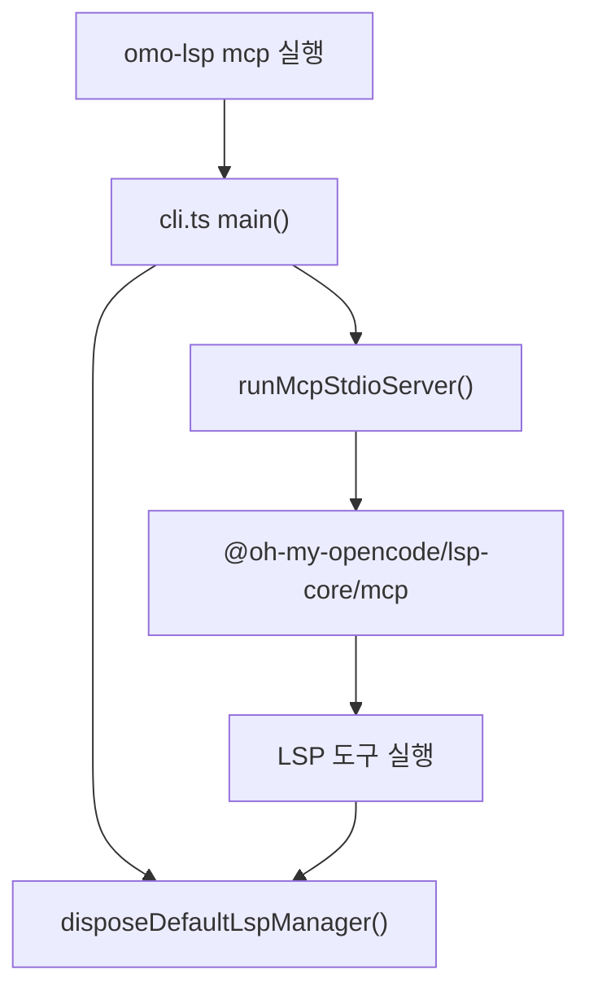

# lsp tools mcp

# LSP 도구 MCP 모듈

이 모듈은 `@oh-my-opencode/lsp-core`를 MCP stdio 서버로 노출하는 얇은 패키지입니다. 실제 LSP 클라이언트, 서버 관리, 진단 수집, 워크스페이스 편집, 서버 설치 상태 같은 핵심 구현은 `packages/lsp-core`에 있고, `packages/lsp-tools-mcp`는 그 기능을 실행 가능한 CLI와 패키지 경계에 맞게 다시 내보내는 어댑터 역할을 합니다.

주요 목적은 두 가지입니다.

1. `omo-lsp mcp` 명령으로 LSP MCP 서버를 stdio transport 위에서 실행합니다.
2. 기존 소비자가 `@oh-my-opencode/lsp-tools-mcp/...` 형태로 가져오던 LSP 관련 모듈을 계속 사용할 수 있도록 `@oh-my-opencode/lsp-core`의 모듈을 재수출합니다.

## 실행 진입점

CLI 진입점은 `packages/lsp-tools-mcp/src/cli.ts`입니다.

```ts
import { disposeDefaultLspManager } from "./lsp/manager.js";
import { runMcpStdioServer } from "./mcp.js";
```

`main()`은 `process.argv`에서 첫 번째 인자를 읽고, 인자가 없으면 기본값으로 `"mcp"`를 사용합니다.

```ts
const [command = "mcp"] = argv.slice(2);
```

지원되는 명령은 현재 `mcp` 하나뿐입니다.

```ts
if (command === "mcp") {
  await runMcpStdioServer();
  return;
}
```

알 수 없는 명령이 들어오면 표준 오류에 사용법을 출력하고 `process.exitCode = 2`를 설정합니다.

```ts
stderr.write("Usage: omo-lsp [mcp]\n");
process.exitCode = 2;
```

성공, 사용법 오류, 런타임 예외와 관계없이 `disposeDefaultLspManager()`가 호출됩니다. 이 정리는 LSP 서버 프로세스, JSON-RPC 연결, 내부 매니저 상태가 CLI 프로세스 종료 시 남지 않도록 보장하는 역할을 합니다.

```ts
try {
  // 명령 실행
} finally {
  await disposeDefaultLspManager();
}
```

최상위 `main().catch(...)`에서도 예외 스택을 출력한 뒤 다시 `disposeDefaultLspManager()`를 호출합니다. 즉, 서버 시작 중 예외가 발생해도 기본 LSP 매니저 정리가 시도됩니다.

## MCP 서버 연결 흐름

`lsp-tools-mcp` 자체에는 MCP 프로토콜 구현이 거의 없습니다. `src/mcp.ts`는 다음 한 줄로 구성됩니다.

```ts
export * from "@oh-my-opencode/lsp-core/mcp";
```

따라서 CLI에서 호출하는 `runMcpStdioServer()`도 `@oh-my-opencode/lsp-core/mcp`에서 온 함수입니다. 이 패키지는 실행 가능한 바이너리와 모듈 경로를 제공하고, 실제 MCP tool 등록과 LSP 작업 실행은 `lsp-core`가 담당합니다.



## 재수출 구조

`src/lsp/*.ts`, `src/tools.ts`, `src/request-context.ts`, `src/missing-dependency-result.ts`는 모두 `@oh-my-opencode/lsp-core`의 대응 모듈을 그대로 재수출합니다.

예를 들어 다음 파일들은 별도 로직을 추가하지 않습니다.

```ts
// src/lsp/manager.ts
export * from "@oh-my-opencode/lsp-core/lsp/manager";

// src/tools.ts
export * from "@oh-my-opencode/lsp-core/tools";

// src/request-context.ts
export * from "@oh-my-opencode/lsp-core/request-context";
```

이 패턴은 패키지 경계를 안정적으로 유지하기 위한 호환성 계층입니다. 소비자는 `lsp-tools-mcp`를 MCP 실행 패키지로 사용하면서도, 필요한 경우 같은 패키지 아래에서 LSP 타입과 유틸리티를 가져올 수 있습니다.

재수출되는 주요 영역은 다음과 같습니다.

- LSP 연결: `connection`, `json-rpc-connection`, `transport`, `client`, `client-wrapper`
- 서버 관리: `manager`, `process`, `process-signal-cleanup`, `server-resolution`, `server-definitions`
- 진단과 편집: `directory-diagnostics`, `workspace-edit`, `formatters`
- 설정과 언어 매핑: `config-loader`, `language-mappings`, `infer-extension`, `effective-extension`
- 오류와 상태: `errors`, `cleanup-errors`, `startup-failure`, `server-install-state`, `server-installation`
- MCP 도구 표면: `tools`, `mcp`, `request-context`, `missing-dependency-result`

새 기능을 추가할 때는 먼저 `lsp-core`에 구현을 두고, 이 패키지에는 필요한 재수출 파일이나 CLI 연결만 추가하는 것이 이 모듈의 기존 구조에 맞습니다.

## `ensure-core-links.mjs`

`scripts/ensure-core-links.mjs`는 로컬 개발이나 패키지 빌드 환경에서 `lsp-core`가 `@oh-my-opencode/mcp-stdio-core`를 해석할 수 있도록 심볼릭 링크를 보장하는 스크립트입니다.

대상 링크는 다음 관계를 만듭니다.

```txt
packages/lsp-core/node_modules/@oh-my-opencode/mcp-stdio-core
  -> packages/mcp-stdio-core
```

핵심 함수는 `ensureDirectoryLink({ linkPath, targetPath })`입니다.

1. `mkdirSync(dirname(linkPath), { recursive: true })`로 링크가 들어갈 상위 디렉터리를 만듭니다.
2. `pathExists(linkPath)`가 참이면 아무 작업도 하지 않습니다.
3. 링크가 없으면 `relative(dirname(linkPath), targetPath)`로 상대 경로를 계산합니다.
4. `symlinkSync(...)`로 디렉터리 링크를 만듭니다.
5. Windows에서는 `"junction"`, 그 외 플랫폼에서는 `"dir"` 링크 타입을 사용합니다.

`pathExists(path)`는 `lstatSync()`로 존재 여부를 확인하고, `ENOENT`만 “없음”으로 처리합니다. 다른 파일 시스템 오류는 그대로 던집니다.

```ts
function pathExists(path) {
  try {
    lstatSync(path);
    return true;
  } catch (error) {
    if (isNodeErrorWithCode(error, "ENOENT")) return false;
    throw error;
  }
}
```

이 스크립트는 패키지 매니저의 workspace 링크 방식이나 배포 산출물 구조가 달라도 `lsp-core`와 `mcp-stdio-core` 사이의 로컬 해석 경로를 안정화하는 보조 장치입니다.

## 코드베이스 안에서의 위치

`lsp-tools-mcp`는 독립적인 LSP 구현체가 아니라 `lsp-core`를 MCP 실행 표면으로 포장하는 패키지입니다. OpenCode/Codex 플러그인 쪽에서는 LSP 기능을 MCP 도구로 붙일 때 이 패키지의 실행 파일과 재수출 경로를 사용할 수 있습니다.

관심사를 기준으로 보면 경계가 명확합니다.

- `packages/lsp-core`: LSP 클라이언트, 서버 프로세스, 진단, rename, definition, references 같은 실제 기능 구현
- `packages/mcp-stdio-core`: stdio 기반 MCP 서버 실행에 필요한 공통 기반
- `packages/lsp-tools-mcp`: `lsp-core` 기능을 `omo-lsp mcp` 실행 표면과 패키지 export 표면으로 연결

따라서 이 모듈을 수정할 때는 변경 대상이 어느 계층에 속하는지 먼저 구분해야 합니다. LSP 동작 자체를 바꾸는 변경은 보통 `lsp-core`가 맞고, CLI 명령, 패키지 export, 로컬 링크 보정은 `lsp-tools-mcp`가 맞습니다.

## 변경 시 주의점

`cli.ts`를 수정할 때는 `disposeDefaultLspManager()` 호출 보장을 유지해야 합니다. MCP 서버 시작 실패, 잘못된 명령, 정상 종료 경로 모두에서 LSP 매니저 정리가 빠지면 백그라운드 LSP 프로세스나 연결 상태가 남을 수 있습니다.

재수출 파일을 수정할 때는 새 구현을 이 패키지에 복사하지 말고 `@oh-my-opencode/lsp-core/...` 경로를 유지하는 것이 좋습니다. 이 패키지의 현재 설계는 “실행 래퍼와 호환성 export”이며, 로직이 분산되면 LSP 동작의 실제 소유권이 흐려집니다.

`ensure-core-links.mjs`는 이미 링크가 존재하면 조용히 종료하는 멱등 스크립트입니다. 링크 대상이 바뀌는 구조 변경이 아니라면 기존 링크를 강제로 삭제하거나 덮어쓰는 동작을 추가하지 않는 편이 안전합니다.