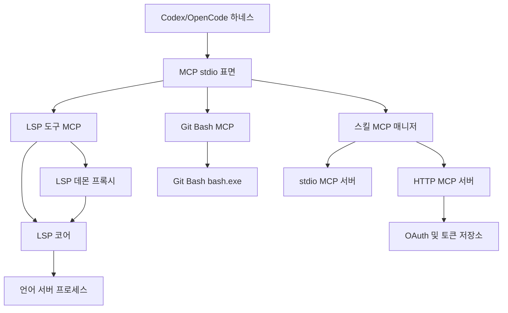

# MCP And LSP Runtime

## MCP 및 LSP 런타임

이 모듈 그룹은 하네스가 외부 도구와 언어 서버를 안정적으로 호출하기 위한 실행 계층입니다. 공통 stdio JSON-RPC 루프는 [mcp stdio core](mcp-stdio-core.md)가 제공하고, 그 위에 LSP 도구, 장기 실행 LSP 데몬, Git Bash 실행기, 스킬 기반 MCP 클라이언트가 각각 얹힙니다.

## 구성 관계

[mcp stdio core](mcp-stdio-core.md)는 가장 낮은 공통 기반입니다. 라인 기반 JSON 또는 `Content-Length` 프레이밍을 처리하고, JSON-RPC 성공/오류 응답을 작성하며, 각 MCP 서버가 자신의 도구 핸들러만 구현할 수 있게 해 줍니다.

[lsp core](lsp-core.md)는 실제 LSP 실행 로직을 담당합니다. 파일 확장자에 맞는 언어 서버를 찾고, stdio JSON-RPC 연결을 열고, `definition`, `references`, `diagnostics`, `symbols`, `rename` 요청을 도구 결과로 변환합니다.

[lsp tools mcp](lsp-tools-mcp.md)는 `lsp core`를 실행 가능한 MCP 서버로 포장합니다. `omo-lsp mcp` 표면을 제공하면서 기존 소비자가 쓰던 LSP 관련 import 경로를 계속 유지하는 호환 어댑터입니다.

[lsp daemon](lsp-daemon.md)은 LSP 서버 수명주기를 더 오래 유지해야 하는 경로를 담당합니다. MCP stdio 프로세스가 직접 언어 서버를 띄우는 대신 Unix socket 또는 Windows named pipe를 통해 데몬에 `tools/call`을 전달하고, 데몬은 `lsp core`를 재사용해 실제 처리를 수행합니다.

[git bash mcp](git-bash-mcp.md)는 Windows 네이티브 환경에서 Bash 명령 실행을 보완합니다. `which_bash`, `diagnose`, `run` 도구를 통해 Git Bash의 `bash.exe`를 찾고 실행 결과와 timeout을 MCP 응답으로 돌려줍니다.

[mcp client core](mcp-client-core.md)는 반대 방향의 MCP 연결을 맡습니다. 하네스가 서버로 노출되는 대신, 스킬에 선언된 stdio 또는 HTTP MCP 서버에 클라이언트로 연결하고, HTTP 서버의 OAuth discovery, DCR, PKCE 로그인, refresh, step-up scope, 토큰 저장을 처리합니다.

## 핵심 흐름

LSP 도구 호출은 보통 하네스의 `tools/call` 요청에서 시작해 [lsp tools mcp](lsp-tools-mcp.md) 또는 [lsp daemon](lsp-daemon.md)을 거쳐 [lsp core](lsp-core.md)로 들어갑니다. 짧은 실행에는 직접 MCP 서버가 적합하고, 반복 호출이나 언어 서버 재사용이 중요한 경우에는 데몬 프록시가 같은 코어 로직을 장기 실행 프로세스 안에서 사용합니다.

Windows Bash 실행은 LSP 흐름과 분리되어 [git bash mcp](git-bash-mcp.md)가 전담합니다. 이 서버도 stdio MCP 표면을 사용하지만, 대상은 언어 서버가 아니라 Git Bash 프로세스입니다.

스킬 기반 확장은 [mcp client core](mcp-client-core.md)를 통해 연결됩니다. `SkillMcpManager`가 스킬별 MCP 서버 연결을 만들고 재사용하며, HTTP MCP 서버에서 인증이 필요하면 OAuth 공급자와 토큰 저장소가 로그인부터 refresh까지 이어지는 흐름을 처리합니다.

전체적으로 이 그룹은 “하네스 내부 도구 호출”, “외부 MCP 서버 연결”, “언어 서버 생명주기”, “Windows Bash 실행”을 분리하면서도 MCP와 JSON-RPC라는 공통 실행 모델로 묶는 런타임 계층입니다.