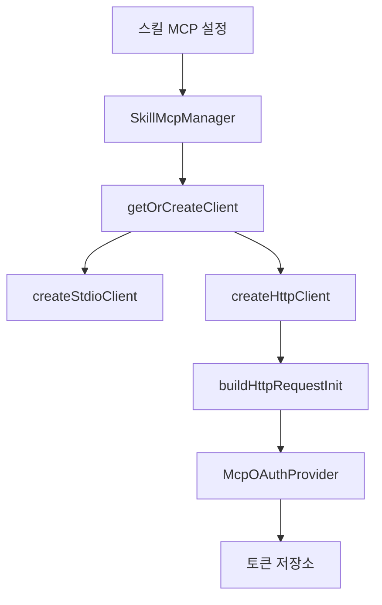

# mcp client core

## mcp-client-core

`mcp-client-core`는 스킬에 선언된 MCP 서버를 실제 `@modelcontextprotocol/sdk` 클라이언트로 연결하고, HTTP MCP 서버의 OAuth 인증과 토큰 저장을 처리하는 코어 패키지입니다. 주요 공개 표면은 `SkillMcpManager`와 `mcp-oauth` 유틸리티입니다.



## 역할

이 모듈은 두 축으로 나뉩니다.

- `skill-mcp-manager`: 스킬별 MCP 서버 연결을 생성, 재사용, 정리하고 `listTools`, `callTool`, `readResource`, `getPrompt` 같은 MCP 작업을 실행합니다.
- `mcp-oauth`: HTTP MCP 서버에 필요한 OAuth discovery, DCR, authorization code + PKCE, refresh, step-up scope, 토큰 저장을 담당합니다.

루트 `src/index.ts`는 다음 두 영역을 그대로 내보냅니다.

```ts
export * from "./mcp-oauth"
export * from "./skill-mcp-manager"
```

## SkillMcpManager

`SkillMcpManager`는 스킬 MCP 연결의 진입점입니다. 호출자는 `SkillMcpClientInfo`와 `SkillMcpServerContext`를 넘기고, 매니저는 세션, 스킬, 서버 이름 기준으로 클라이언트를 캐시합니다.

주요 메서드는 다음과 같습니다.

- `getOrCreateClient(info, config, options?)`
- `disconnectSession(sessionID)`
- `disconnectAll()`
- `listTools(info, context, options?)`
- `listResources(info, context, options?)`
- `listPrompts(info, context, options?)`
- `callTool(info, context, name, args, options?)`
- `readResource(info, context, uri, options?)`
- `getPrompt(info, context, name, args, options?)`
- `getConnectedServers()`
- `isConnected(info)`

클라이언트 키는 `buildSkillMcpClientKey()`에서 만듭니다.

```ts
const baseKey = `${info.sessionID}:${info.skillName}:${info.serverName}`
```

`cdpUrl` 옵션이 있으면 키에 `::cdp=...`가 붙고, `withInjectedCdpEndpoint()`가 stdio 서버 인자에 `--cdp-endpoint <url>`을 추가합니다. 이 때문에 같은 스킬 서버라도 CDP 엔드포인트가 다르면 별도 연결로 취급됩니다.

## 연결 생성 흐름

`SkillMcpManager.getOrCreateClient()`는 내부적으로 `connection.ts`의 `getOrCreateClient()`를 호출합니다.

1. 이미 `state.clients`에 연결이 있으면 `lastUsedAt`을 갱신하고 재사용합니다.
2. 같은 `clientKey`로 연결 생성이 진행 중이면 `state.pendingConnections`의 Promise를 기다립니다.
3. `expandEnvVarsInObject()`로 MCP 설정의 환경 변수를 확장합니다.
4. `getConnectionType()`으로 HTTP 또는 stdio를 결정합니다.
5. `createHttpClient()` 또는 `createStdioClient()`로 실제 SDK `Client`를 연결합니다.
6. 연결 도중 세션 disconnect나 전체 shutdown이 발생했는지 세대값으로 확인합니다.
7. 성공한 연결은 `state.clients`에 `ManagedClient`로 저장됩니다.

`getConnectionType()`의 우선순위는 명시적 `type`이 먼저입니다.

```ts
if (config.type === "http" || config.type === "sse") return "http"
if (config.type === "stdio") return "stdio"
if (config.url) return "http"
if (config.command) return "stdio"
return null
```

설정에 `url`도 `command`도 없으면 `createClient()`가 스킬명과 서버명을 포함한 오류 메시지를 던집니다.

## stdio MCP 연결

`createStdioClient()`는 로컬 프로세스 기반 MCP 서버를 실행합니다.

핵심 동작은 다음과 같습니다.

- `config.command`가 없으면 오류를 던집니다.
- `config.args ?? []`를 그대로 전달합니다.
- `createCleanMcpEnvironment(config.env)`로 환경 변수를 구성합니다.
- `info.directory`가 있으면 transport의 `cwd`로 사용합니다.
- `StdioClientTransport`와 SDK `Client`를 만들고 `client.connect(transport)`를 호출합니다.
- 연결 실패 시 command, args, 오류 메시지를 `redactSensitiveData()`로 마스킹한 뒤 힌트와 함께 오류를 던집니다.

`createCleanMcpEnvironment()`는 ambient `process.env`에서 npm, pnpm, yarn 설정값과 일반적인 secret 패턴을 제거합니다. 단, 스킬 설정의 `config.env`는 명시적으로 선언된 값이므로 마지막에 `Object.assign()`으로 그대로 통과시킵니다.

## HTTP MCP 연결

`createHttpClient()`는 원격 HTTP MCP 서버를 연결합니다.

핵심 동작은 다음과 같습니다.

- `config.url`이 없으면 오류를 던집니다.
- URL 파싱에 실패하면 민감한 query parameter를 마스킹해 오류를 냅니다.
- `buildHttpRequestInit()`으로 정적 headers와 OAuth Authorization header를 구성합니다.
- `StreamableHTTPClientTransport`와 SDK `Client`를 만들고 연결합니다.
- 연결 실패 시 transport를 닫고, URL과 header/token 정보를 마스킹한 오류를 던집니다.

HTTP 연결은 cleanup 오류도 기록하되, 민감 정보가 남지 않도록 `redactCleanupErrorMessage()`를 거칩니다. 이 함수는 `Authorization`, `x-api-key`, `api-key`, `access-token` 같은 header 값과 URL query의 `key`, `token`, `secret` 계열 값을 마스킹합니다.

## 작업 재시도와 인증 복구

`SkillMcpManager`의 `callTool`, `readResource`, `getPrompt`는 모두 `withOperationRetry()`를 거칩니다.

재시도 흐름은 다음 순서입니다.

1. `getOrCreateClientWithRetry()`로 클라이언트를 얻습니다.
2. MCP 작업을 실행합니다.
3. 오류가 나면 `handleStepUpIfNeeded()`가 403 + `WWW-Authenticate` scope 요구를 처리합니다.
4. step-up이 처리되면 `forceReconnect()` 후 재시도합니다.
5. 아니면 `handlePostRequestAuthError()`가 401/403 후 refresh token으로 갱신을 시도합니다.
6. `"not connected"` 오류면 최대 3회까지 reconnect합니다.
7. 그 외 오류는 즉시 다시 던집니다.

`listTools`, `listResources`, `listPrompts`는 단순 조회라서 `getOrCreateClientWithRetry()`만 사용하고, post-request OAuth 복구 루프는 타지 않습니다.

## OAuth Provider

`McpOAuthProvider`는 HTTP MCP 서버의 OAuth 토큰 생명주기를 관리합니다.

주요 메서드는 다음과 같습니다.

- `tokens()`
- `saveTokens(tokenData)`
- `clientInformation()`
- `redirectUrl()`
- `saveCodeVerifier(verifier)`
- `codeVerifier()`
- `redirectToAuthorization(metadata)`
- `login()`
- `refresh(refreshToken)`

`login()` 흐름은 다음과 같습니다.

1. `discoverOAuthServerMetadata(this.serverUrl)`로 authorization server metadata를 찾습니다.
2. `getOrRegisterClient()`로 DCR 또는 설정된 `clientId`를 통해 client credentials를 확보합니다.
3. `redirectToAuthorization()`에서 authorization URL을 만들고 브라우저를 엽니다.
4. callback으로 받은 `code`와 저장된 PKCE verifier를 사용해 token endpoint에 요청합니다.
5. `buildOAuthTokenData()`가 `accessToken`, `refreshToken`, `expiresAt`, `clientInfo`를 정규화합니다.
6. `saveTokens()`가 토큰을 파일 저장소에 기록합니다.

`refresh(refreshToken)`은 discovery metadata와 저장된 client 정보를 사용해 `grant_type=refresh_token` 요청을 보내고, 새 refresh token이 응답에 없으면 기존 refresh token을 유지합니다.

## OAuth discovery

`discoverOAuthServerMetadata(resource)`는 resource server URL을 기준으로 OAuth metadata를 찾습니다.

동작 순서는 다음과 같습니다.

1. resource URL은 반드시 `https:`여야 합니다.
2. `/.well-known/oauth-protected-resource`를 조회합니다.
3. protected resource metadata에 `authorization_servers`가 있으면 첫 번째 authorization server를 사용합니다.
4. protected resource metadata가 404이면 resource URL 자체를 authorization server로 간주합니다.
5. authorization server의 `/.well-known/oauth-authorization-server{issuerPath}`를 조회합니다.
6. issuer path가 있고 404이면 root `/.well-known/oauth-authorization-server`로 fallback합니다.
7. `authorization_endpoint`, `token_endpoint`, 선택적 `registration_endpoint`가 모두 HTTPS인지 검증합니다.

중복 discovery 요청은 `pendingDiscovery`로 합쳐지고, 성공 결과는 `discoveryCache`에 저장됩니다. 테스트나 상태 초기화에는 `resetDiscoveryCache()`를 사용합니다.

## DCR

`getOrRegisterClient()`는 OAuth Dynamic Client Registration을 처리합니다.

입력 타입은 `DynamicClientRegistrationOptions`입니다. 이 함수는 다음 순서로 client credentials를 구합니다.

1. `storage.getClientRegistration(serverIdentifier)`에 기존 값이 있으면 재사용합니다.
2. `registrationEndpoint`가 없으면 설정된 `clientId`만 fallback으로 반환합니다.
3. registration endpoint에 `ClientRegistrationRequest`를 POST합니다.
4. 응답이 실패하거나 JSON이 유효하지 않으면 `clientId` fallback을 반환합니다.
5. `parseRegistrationResponse()`가 `client_id`와 선택적 `client_secret`을 읽습니다.
6. 성공한 credentials는 `storage.setClientRegistration()`으로 저장합니다.

이 모듈의 DCR 저장소는 추상 인터페이스입니다. `McpOAuthProvider.login()`에서는 메모리 필드인 `storedClientInfo`를 저장소처럼 사용합니다.

## Authorization Code + PKCE

`oauth-authorization-flow.ts`는 브라우저 redirect 기반 authorization code flow를 구현합니다.

- `generateCodeVerifier()`는 32바이트 random base64url 문자열을 만듭니다.
- `generateCodeChallenge(verifier)`는 SHA-256 base64url challenge를 만듭니다.
- `buildAuthorizationUrl()`은 `response_type=code`, `client_id`, `redirect_uri`, `code_challenge`, `code_challenge_method=S256`, `state`, 선택적 `scope`, 선택적 `resource`를 채웁니다.
- `runAuthorizationCodeRedirect()`는 verifier/challenge/state를 만들고 callback server를 시작한 뒤 브라우저를 엽니다.

주의할 점은 `mcp-oauth/index.ts`가 `oauth-authorization-flow.ts`의 `startCallbackServer()`를 공개 export하지 않는다는 점입니다. 공개 export되는 `startCallbackServer`는 `callback-server.ts`의 구현입니다. `McpOAuthProvider` 내부의 redirect flow는 `runAuthorizationCodeRedirect()`를 통해 `oauth-authorization-flow.ts`의 로컬 callback server를 사용합니다.

## 공개 callback server

`callback-server.ts`의 `startCallbackServer()`는 별도 공개 API로, 더 방어적인 callback server 구현입니다.

특징은 다음과 같습니다.

- 기본 포트는 `19877`입니다.
- `findAvailablePort()`로 사용 가능한 포트를 찾습니다.
- `startPort`가 `0`이면 OS가 포트를 선택하게 합니다.
- 서버가 실제 HTTP 요청을 받을 수 있는지 readiness probe로 확인합니다.
- `/oauth/callback` 경로만 처리합니다.
- `error` query가 있으면 authorization 실패로 reject합니다.
- `code` 또는 `state`가 없으면 reject합니다.
- 성공 시 `{ code, state }`를 resolve하고 성공 HTML을 반환합니다.
- 5분 timeout이 지나면 reject하고 서버를 닫습니다.
- `close()`는 중복 호출해도 같은 Promise를 반환합니다.

이 구현은 `CallbackServerTimer`를 주입할 수 있어 timeout과 close 동작을 테스트하기 쉽습니다.

## 토큰 저장소

`storage.ts`는 OAuth 토큰을 OpenCode CLI 설정 디렉터리 아래에 저장합니다.

저장 위치는 다음과 같습니다.

```ts
join(getOpenCodeCliConfigDir(), "mcp-oauth")
```

`getOpenCodeCliConfigDir()`는 우선 `OPENCODE_CONFIG_DIR`을 사용하고, 없으면 `XDG_CONFIG_HOME/opencode`, 그마저 없으면 `~/.config/opencode`를 사용합니다. 존재하는 경로는 `realpathSync()`로 정규화합니다.

토큰 파일 이름은 `getMcpOauthServerHash(serverHost, resource)`로 만든 32자 SHA-256 prefix입니다.

```ts
createHash("sha256").update(buildKey(serverHost, resource)).digest("hex").slice(0, 32)
```

`buildKey()`는 host와 resource를 정규화합니다.

- `normalizeHost()`는 URL, path, port를 제거하고 host만 남깁니다.
- IPv6 bracket 형식은 유지합니다.
- `normalizeResource()`는 앞쪽 slash를 제거합니다.

주요 함수는 다음과 같습니다.

- `getMcpOauthStorageDir()`
- `getMcpOauthServerHash(serverHost, resource)`
- `getMcpOauthStoragePath(serverHost, resource)`
- `loadToken(serverHost, resource)`
- `saveToken(serverHost, resource, token)`
- `deleteToken(serverHost, resource)`
- `listTokensByHost(serverHost)`
- `listAllTokens()`

현재 저장 방식은 서버별 JSON 파일과 `index.json`을 함께 사용합니다. `storage-index.ts`의 `saveTokenIndexEntry()`가 hash와 사람이 읽을 수 있는 key를 매핑합니다. `listAllTokens()`는 `index.json`이 있으면 hash 대신 원래 key를 결과 키로 사용합니다.

이전 형식인 `mcp-oauth.json`도 계속 읽습니다. `loadToken()`은 새 파일을 먼저 읽고, 없으면 legacy store의 `buildKey(serverHost, resource)` 항목을 fallback으로 읽습니다. `deleteToken()`도 새 파일이 없으면 `deleteLegacyToken()`으로 legacy 항목을 제거합니다.

파일 쓰기는 임시 파일에 `0o600` 권한으로 기록한 뒤 `renameSync()`로 교체합니다.

## Refresh mutex

`withRefreshMutex(serverUrl, refreshFn)`는 같은 서버에 대해 refresh 요청이 동시에 여러 번 나가지 않도록 보호합니다.

- 이미 refresh 중이면 기존 Promise를 반환합니다.
- refresh가 성공하거나 실패하면 `finally()`에서 lock을 제거합니다.
- `isRefreshInProgress(serverUrl)`와 `getActiveRefreshCount()`는 테스트와 상태 점검용입니다.

`handlePostRequestAuthError()`와 `buildHttpRequestInit()`의 만료 토큰 갱신 경로가 이 mutex를 사용합니다.

## Step-up scope

`step-up.ts`는 403 응답의 `WWW-Authenticate` header에서 추가 scope 요구를 읽습니다.

- `parseWwwAuthenticate(header)`는 `Bearer` challenge를 찾고 `scope`, `error`, `error_description`을 추출합니다.
- `mergeScopes(existing, required)`는 기존 scope와 요구 scope를 중복 없이 합칩니다.
- `isStepUpRequired(statusCode, headers)`는 status가 403이고 `WWW-Authenticate`가 있을 때만 step-up 정보를 반환합니다.

`handleStepUpIfNeeded()`는 오류 메시지에서 `WWW-Authenticate:` header 문자열을 추출하고, 필요한 scope가 있으면 `config.oauth.scopes`를 갱신한 뒤 provider를 새로 만들어 `login()`을 실행합니다.

## Resource indicator

`resource-indicator.ts`는 OAuth resource parameter를 정규화하는 작은 유틸리티입니다.

- `getResourceIndicator(url)`은 query와 hash를 제거하고 trailing slash를 제거합니다.
- `addResourceToParams(params, resource)`는 `URLSearchParams`에 `resource`를 설정합니다.

## 정리와 수명주기

`cleanup.ts`는 연결 종료와 프로세스 정리를 담당합니다.

- `registerProcessCleanup(state)`는 `SIGINT`, `SIGTERM`, Windows의 `SIGBREAK`에 cleanup handler를 등록합니다.
- `startCleanupTimer(state)`는 60초마다 idle client를 정리합니다.
- idle 기준은 `state.idleTimeoutMs`이며 기본값은 5분입니다.
- `disconnectSession(state, sessionID)`은 해당 세션의 client와 pending connection을 제거합니다.
- `disconnectAll(state)`은 전체 client, pending connection, auth provider를 정리합니다.
- `forceReconnect(state, clientKey)`는 기존 연결을 닫고 캐시에서 제거합니다.

연결 생성 중 disconnect가 발생할 수 있기 때문에 `connection.ts`는 `shutdownGeneration`, `disconnectedSessions`, `inFlightConnections`를 함께 사용합니다. 연결 시작 시 세대값을 기록하고, 연결 완료 후 값이 바뀌었으면 새 client를 닫고 오류를 던집니다.

## 보안 경계

이 모듈은 MCP 서버가 외부 프로세스나 외부 HTTP 서버일 수 있다는 전제로 민감 정보 노출을 줄입니다.

중요한 방어선은 다음과 같습니다.

- `createCleanMcpEnvironment()`는 ambient 환경 변수에서 토큰, 키, 비밀번호, 클라우드 credential 계열을 제거합니다.
- `redactSensitiveData()`는 오류 메시지의 API key, bearer token, GitHub/GitLab token, secret, password 패턴을 `[REDACTED]`로 바꿉니다.
- `redactErrorSensitiveData()`는 Error message와 stack을 모두 마스킹합니다.
- HTTP 연결 오류는 URL query와 인증 header를 별도로 마스킹합니다.
- OAuth 토큰 파일은 `0o600` 권한으로 저장됩니다.
- project/local scope MCP 설정은 `expandEnvVarsInObject(config, { trusted: false })`로 처리되어 신뢰 경계가 다르게 적용됩니다.

## 로깅과 테스트 주입점

`logger.ts`는 전역 active logger를 가진 얇은 래퍼입니다.

```ts
export type McpClientLogger = (message: string, data?: unknown) => void
```

기본 logger는 아무 일도 하지 않습니다. 테스트는 `setMcpClientLoggerForTesting()`으로 logger를 주입할 수 있습니다.

HTTP와 stdio 클라이언트도 테스트 주입점을 제공합니다.

- `setHttpClientDependenciesForTesting()`
- `setStdioClientDependenciesForTesting()`

이를 통해 실제 SDK `Client`나 transport를 띄우지 않고 연결 성공, 실패, cleanup 실패, retry 동작을 검증할 수 있습니다.

## 코드베이스 연결 지점

이 패키지는 OpenCode 어댑터의 스킬 MCP 기능에서 사용됩니다.

대표적인 호출자는 다음과 같습니다.

- `tools/skill/mcp-capability-formatter.ts`: `listTools`, `listResources`, `listPrompts`로 스킬 MCP capability를 표시합니다.
- `tools/skill-mcp/tools.test.ts`: `SkillMcpManager` 동작을 검증합니다.
- `cli/mcp-oauth/login.ts`: `McpOAuthProvider`를 생성해 로그인 플로우를 실행합니다.
- `cli/mcp-oauth/status.ts`: `listAllTokens`, `listTokensByHost`로 저장된 OAuth 토큰 상태를 보여줍니다.
- `cli/mcp-oauth/logout.test.ts`: `saveToken`, 삭제 흐름을 검증합니다.

테스트들은 `features/mcp-oauth/*`, `features/skill-mcp-manager/*`, `src/mcp-oauth/*` 양쪽에 걸쳐 있습니다. 이 패키지를 수정할 때는 연결 생성, OAuth retry, storage 호환성, cleanup race 조건을 함께 확인해야 합니다.

## 변경할 때 주의할 점

`SkillMcpManagerState`의 map들은 서로 맞물려 있습니다. `clients`, `pendingConnections`, `disconnectedSessions`, `inFlightConnections`, `shutdownGeneration` 중 하나만 수정하면 연결 경합이나 disconnect 중 재연결 문제가 생길 수 있습니다.

OAuth 쪽에서는 `provider.ts`, `oauth-handler.ts`, `storage.ts`가 함께 움직입니다. 예를 들어 token shape를 바꾸면 `buildOAuthTokenData()`, `isOAuthTokenData()`, legacy store 읽기, refresh fallback까지 같이 확인해야 합니다.

HTTP 인증 오류 처리는 문자열 기반입니다. `handleStepUpIfNeeded()`와 `handlePostRequestAuthError()`는 SDK/transport 오류 메시지 안의 `403`, `401`, `WWW-Authenticate:`를 파싱합니다. transport 오류 형식이 바뀌면 step-up과 refresh retry가 조용히 작동하지 않을 수 있습니다.

`callback-server.ts`와 `oauth-authorization-flow.ts`에는 이름이 같은 `startCallbackServer()`가 있지만 역할이 다릅니다. 공개 export는 `callback-server.ts`의 구현이고, provider의 redirect login은 `runAuthorizationCodeRedirect()` 내부 구현을 사용합니다. 이 둘을 통합하거나 변경할 때는 callback path, readiness probe, timeout 동작 차이를 명확히 맞춰야 합니다.