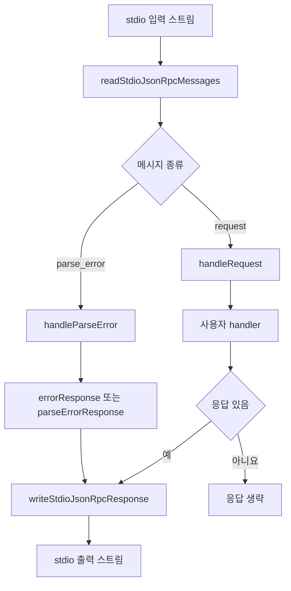

# mcp stdio core

## 개요

`mcp-stdio-core`는 MCP 스타일의 JSON-RPC 서버를 표준 입출력(`stdin`/`stdout`) 위에서 실행하기 위한 작은 코어 모듈입니다. 패키지는 프로토콜별 핸들러 구현을 직접 포함하지 않고, 공통으로 필요한 다음 기능만 제공합니다.

- JSON-RPC 메시지를 라인 기반 JSON 또는 `Content-Length` 프레이밍 방식으로 읽기
- 요청 처리 결과를 같은 응답 모드로 쓰기
- 성공/오류 JSON-RPC 응답 생성
- 요청 객체, JSON-RPC ID, 오류 메시지 같은 작은 유틸리티 제공
- 유휴 타임아웃과 생명주기 로그를 포함한 stdio 서버 루프 실행

외부로 공개되는 진입점은 `src/index.ts`이며, `record.ts`, `responses.ts`, `server.ts`, `transport.ts`, `types.ts`의 모든 export를 다시 내보냅니다.

## 공개 API 구성

### 타입

`types.ts`는 이 모듈이 다루는 JSON-RPC와 MCP 응답 형태를 정의합니다.

- `JsonRpcId`: JSON-RPC 요청 ID입니다. `string | number | null`만 허용합니다.
- `TextContent`: MCP 도구 응답에서 사용하는 텍스트 콘텐츠 항목입니다.
- `McpToolDescriptor`: 도구 목록 응답에 들어가는 도구 설명입니다.
- `JsonRpcError`: JSON-RPC 오류 객체입니다.
- `JsonRpcResult`: MCP 서버 응답의 result 형태입니다. `capabilities`, `serverInfo`, `protocolVersion`, `tools`, `content`, `isError`를 포함할 수 있고 추가 키도 허용합니다.
- `JsonRpcResponse`: `{ jsonrpc: "2.0", id, result? | error? }` 형태의 응답입니다.
- `McpLifecycleLog`: 서버 생명주기 이벤트를 기록하는 콜백입니다.

### 응답 생성 유틸리티

`responses.ts`는 핸들러나 서버 내부에서 JSON-RPC 응답을 만들 때 사용하는 함수들을 제공합니다.

- `successResponse(id, result)`: 성공 응답을 생성합니다.
- `errorResponse(id, code, message, data?)`: 오류 응답을 생성합니다. `data`가 `undefined`이면 `error.data`를 생략합니다.
- `jsonRpcId(value)`: `string`, `number`, `null`만 유효한 ID로 통과시키고, 나머지는 `null`로 정규화합니다.
- `messageFromError(error)`: `Error` 인스턴스면 `error.message`, 아니면 `String(error)`를 반환합니다.

### 레코드 판별

`record.ts`의 `isPlainRecord(value)`는 요청 payload가 객체인지 확인할 때 사용합니다. 배열과 `null`은 제외하고, 일반 객체만 `Record<string, unknown>`으로 좁힙니다.

이 함수는 서버 내부의 `handleRequest()`에서 `id`와 `method`를 안전하게 읽는 데 쓰이고, 다른 패키지의 `lsp-daemon/src/proxy.ts`에서도 도구 호출 형태를 판별하는 데 사용됩니다.

## stdio 서버 실행

핵심 진입점은 `runJsonRpcStdioServer(config)`입니다.

```ts
await runJsonRpcStdioServer({
  input: process.stdin,
  output: process.stdout,
  handler: async (input, options) => {
    if (!isPlainRecord(input)) {
      return errorResponse(null, -32600, "Invalid Request")
    }

    const id = jsonRpcId(input["id"])
    const method = input["method"]

    if (method === "ping") {
      return successResponse(id, {})
    }

    return errorResponse(id, -32601, "Method not found")
  },
  handlerOptions: {},
  log: (event, fields) => {
    // 서버 생명주기 이벤트를 원하는 로거로 전달합니다.
    console.error(event, fields)
  },
})
```

`JsonRpcStdioServerConfig<HandlerOptions>`는 다음 값을 받습니다.

- `input`: JSON-RPC 요청을 읽을 `Readable` 스트림입니다.
- `output`: JSON-RPC 응답을 쓸 `Writable` 스트림입니다.
- `handler`: 요청 payload와 `handlerOptions`를 받아 `JsonRpcResponse | undefined`를 반환하는 비동기 함수입니다.
- `handlerOptions`: 핸들러에 전달할 호출자 정의 옵션입니다.
- `idleTimeoutMs`: 유휴 타임아웃입니다. 기본값은 10분입니다.
- `onIdleTimeout`: 유휴 타임아웃 발생 시 실행할 콜백입니다.
- `log`: `stdio_started`, `request`, `response`, `parse_error`, `idle_timeout`, `stdio_stopped` 같은 생명주기 이벤트를 받는 콜백입니다.
- `parseErrorResponse`: JSON 파싱 실패 시 기본 오류 응답을 대체할 수 있는 콜백입니다.
- `onHandlerError`: 핸들러 예외를 직접 처리할 콜백입니다. 없으면 예외를 다시 던집니다.

핸들러가 `undefined`를 반환하면 응답을 쓰지 않습니다. JSON-RPC notification처럼 응답이 필요 없는 입력을 처리할 때 사용할 수 있는 패턴입니다.

## 요청 처리 흐름



`runJsonRpcStdioServer()`는 입력 스트림에서 `readStdioJsonRpcMessages()`가 생성하는 메시지를 순회합니다. 각 메시지를 받을 때마다 유휴 타이머를 다시 설정하고, 메시지 종류에 따라 `handleParseError()` 또는 `handleRequest()`로 분기합니다.

`handleRequest()`는 payload가 일반 객체인지 확인한 뒤 `jsonRpcId()`로 `id`를 정규화하고, `method`가 문자열이면 로그 필드에 포함합니다. 실제 프로토콜 처리는 호출자가 제공한 `handler`가 담당합니다.

## 전송 계층

`transport.ts`는 stdio 위에서 두 가지 JSON-RPC 메시지 형식을 지원합니다.

### 라인 기반 JSON

라인 기반 입력은 한 줄에 JSON 객체 하나가 들어오는 형식입니다.

```json
{"jsonrpc":"2.0","id":1,"method":"tools/list","params":{}}
```

`readLineMessage()`는 개행 문자(`\n`)까지 버퍼를 읽고, 빈 줄은 무시합니다. 줄 끝의 `\r`은 제거합니다. JSON 파싱에 실패하면 `kind: "parse_error"` 메시지를 생성하고 `responseMode`를 `"line"`으로 설정합니다.

라인 기반 응답은 JSON 문자열 뒤에 개행을 붙여 씁니다.

```ts
writeStdioJsonRpcResponse(output, response, "line")
```

출력 형태는 다음과 같습니다.

```json
{"jsonrpc":"2.0","id":1,"result":{}}
```

### `Content-Length` 프레이밍

프레이밍 입력은 LSP와 MCP stdio 구현에서 흔히 쓰는 헤더 기반 형식입니다.

```text
Content-Length: 64

{"jsonrpc":"2.0","id":1,"method":"tools/list","params":{}}
```

실제 구분자는 `\r\n\r\n`입니다. `readFramedMessage()`는 헤더에서 `Content-Length`를 찾고, 지정된 바이트 수만큼 body가 모일 때까지 기다립니다. 헤더가 없거나 유효하지 않으면 `kind: "parse_error"`를 반환하고 `responseMode`를 `"framed"`로 유지합니다.

프레이밍 응답은 JSON body의 UTF-8 바이트 길이를 계산해 같은 방식으로 씁니다.

```ts
writeStdioJsonRpcResponse(output, response, "framed")
```

출력 형태는 다음과 같습니다.

```text
Content-Length: 39

{"jsonrpc":"2.0","id":1,"result":{}}
```

## 버퍼 처리와 파싱 규칙

`readStdioJsonRpcMessages(input)`는 스트림 chunk를 누적 버퍼에 붙이고, 가능한 만큼 반복해서 메시지를 꺼냅니다.

- chunk가 `Buffer`이면 그대로 사용합니다.
- chunk가 `string`이면 `Buffer.from(chunk)`로 변환합니다.
- 그 외 타입은 `TypeError`를 던집니다.

메시지 판별은 `readNextMessage()`가 담당합니다. 버퍼가 `content-length:`로 시작하면 프레이밍 메시지로 처리하고, 그렇지 않으면 라인 기반 메시지로 처리합니다. 이 비교는 ASCII 소문자 변환을 사용하므로 `Content-Length:`와 `content-length:`를 모두 인식합니다.

입력 스트림이 끝났는데 버퍼에 개행 없는 trailing 텍스트가 남아 있으면, `readStdioJsonRpcMessages()`는 이를 라인 기반 JSON payload로 마지막 한 번 파싱합니다.

## 오류 처리

파싱 오류는 요청 핸들러로 전달되지 않습니다. 서버는 `handleParseError()`에서 다음 순서로 처리합니다.

1. `log("parse_error", { message })`를 호출합니다.
2. `config.parseErrorResponse`가 있으면 그 결과를 사용합니다.
3. 없으면 `errorResponse(null, -32700, "Parse error", message)`를 기본 응답으로 사용합니다.
4. 응답이 `undefined`가 아니면 원래 메시지의 `responseMode`에 맞춰 출력합니다.

핸들러 실행 중 발생한 예외는 `handleRequest()`에서 처리합니다.

- `onHandlerError`가 없으면 예외를 다시 던져 서버 루프를 실패시킵니다.
- `onHandlerError`가 있으면 해당 콜백에 예외를 전달하고, 서버 루프는 계속 진행할 수 있습니다.

이 모듈은 핸들러 예외를 자동으로 JSON-RPC 오류 응답으로 변환하지 않습니다. 프로토콜 수준 오류 응답은 핸들러가 `errorResponse()`로 명시적으로 반환하는 방식이 기본 패턴입니다.

## 유휴 타임아웃

`runJsonRpcStdioServer()`는 `createIdleTimer()`로 유휴 타이머를 생성합니다.

- 기본 타임아웃은 `10 * 60_000` 밀리초입니다.
- `idleTimeoutMs <= 0`이면 타이머를 설정하지 않습니다.
- 서버 시작 직후와 각 메시지 수신 직후 `arm()`을 호출합니다.
- 타임아웃이 발생하면 `closed` 상태가 되고 `log("idle_timeout", { idle_timeout_ms })`를 기록한 뒤 `onIdleTimeout`을 호출합니다.
- 타이머에는 `unref()`를 호출하므로 타이머만으로 Node.js 프로세스가 계속 살아 있지 않습니다.
- 서버 루프가 종료되면 `finally`에서 타이머를 정리하고 `stdio_stopped`를 기록합니다.

타임아웃이 발생해도 현재 대기 중인 스트림 read를 강제로 닫지는 않습니다. 다음 메시지가 도착해 루프가 깨어났을 때 `idleTimer.closed()`를 확인하고 반복을 중단합니다. 스트림 자체를 닫아야 하는 정책은 `onIdleTimeout`에서 호출자가 구현할 수 있습니다.

## 다른 패키지와의 연결

이 모듈은 MCP stdio 서버 구현에서 반복되는 저수준 처리를 공통화합니다. 현재 확인되는 외부 사용 지점은 다음과 같습니다.

- `lsp-daemon/src/proxy.ts`의 `asToolCall()`이 `isPlainRecord()`를 사용해 입력 객체를 안전하게 좁힙니다.
- `mcp-stdio-core/src/server.test.ts`는 `runJsonRpcStdioServer()`와 `successResponse()`를 통해 서버 루프와 응답 작성을 검증합니다.
- `mcp-stdio-core/src/transport.test.ts`는 `writeStdioJsonRpcResponse()`의 라인/프레이밍 출력을 검증합니다.

의존 방향은 단순합니다. `mcp-stdio-core`는 Node.js `stream` 타입 외에 다른 내부 패키지를 호출하지 않고, 상위 MCP 서버나 데몬 패키지가 이 코어를 가져다 쓰는 구조입니다. 따라서 실제 MCP 메서드 라우팅, 도구 목록 구성, 도구 실행, 권한 정책은 이 모듈 밖에서 구현해야 합니다.

## 기여 시 주의할 점

전송 계층을 바꿀 때는 라인 기반 JSON과 `Content-Length` 프레이밍의 응답 모드 보존을 함께 확인해야 합니다. 입력이 프레이밍으로 들어오면 파싱 오류 응답도 프레이밍으로 나가야 하고, 라인 기반 입력은 라인 기반 응답을 유지해야 합니다.

서버 계층을 바꿀 때는 `handler`의 책임 경계를 유지하는 것이 중요합니다. `runJsonRpcStdioServer()`는 스트림 처리, 파싱 오류, 생명주기, 유휴 타임아웃만 담당하고, JSON-RPC 메서드별 의미 처리는 호출자 핸들러가 담당합니다.

`JsonRpcResult`는 MCP 응답에서 필요한 공통 필드를 열어 두는 타입입니다. 새 프로토콜 필드가 필요할 때도 가능하면 이 모듈에 메서드별 로직을 넣지 말고, 상위 서버 구현에서 result 객체를 구성한 뒤 `successResponse()`로 감싸는 형태를 유지하는 것이 좋습니다.