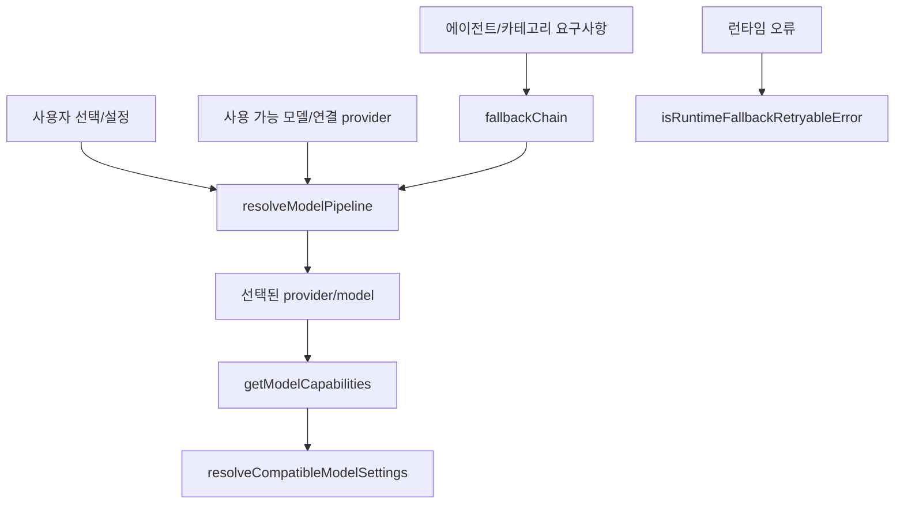

# model core

## model-core 모듈

`packages/model-core`는 에이전트와 작업 카테고리에 맞는 모델을 고르고, 모델 문자열을 정규화하며, 런타임 오류가 발생했을 때 대체 모델로 넘어갈 수 있는지 판단하는 순수 TypeScript 모듈입니다. 외부 서비스 호출은 `fetchModelCapabilitiesSnapshot()`처럼 명시적으로 주입 가능한 지점에만 있고, 대부분의 코드는 캐시·스냅샷·설정 객체를 입력으로 받아 결정 결과를 반환합니다.



## 핵심 책임

이 모듈은 네 가지 결정을 담당합니다.

1. 어떤 모델을 사용할지 결정합니다.
   - `resolveModel()`
   - `resolveModelWithFallback()`
   - `resolveModelPipeline()`

2. 모델과 provider 문자열을 표준 형태로 해석합니다.
   - `parseModelString()`
   - `normalizeModelFormat()`
   - `transformModelForProvider()`
   - `resolveModelIDAlias()`

3. 모델 기능을 추론하고 설정을 호환 가능한 값으로 낮춥니다.
   - `getModelCapabilities()`
   - `resolveCompatibleModelSettings()`
   - `resolveActualContextLimit()`

4. 런타임 오류와 fallback 가능성을 분류합니다.
   - `isRetryableModelError()`
   - `shouldRetryError()`
   - `isRuntimeFallbackRetryableError()`
   - `areRuntimeFallbackModelsEquivalent()`

## 모델 요구사항

`AGENT_MODEL_REQUIREMENTS`와 `CATEGORY_MODEL_REQUIREMENTS`는 내장 에이전트와 작업 카테고리별 fallback 정책을 정의합니다.

각 항목은 `ModelRequirement` 형태입니다.

```ts
type ModelRequirement = {
  fallbackChain: FallbackEntry[]
  variant?: string
  requiresModel?: string
  requiresAnyModel?: boolean
  requiresProvider?: string[]
}
```

`FallbackEntry`는 하나의 모델 후보를 나타냅니다.

```ts
type FallbackEntry = {
  providers: string[]
  model: string
  variant?: string
  reasoningEffort?: string
  temperature?: number
  top_p?: number
  maxTokens?: number
  thinking?: { type: "enabled" | "disabled"; budgetTokens?: number }
}
```

예를 들어 `sisyphus`는 `claude-opus-4-7(max)`를 우선 시도하고, 이후 `kimi-k2.6`, `k2p5`, `kimi-k2.5`, `gpt-5.5(medium)`, `glm-5`, `big-pickle` 순서로 내려갑니다. 반면 `quick` 카테고리는 `gpt-5.4-mini`, `claude-haiku-4-5`, `gemini-3-flash`, `minimax` 계열처럼 빠른 모델을 우선합니다.

`requiresAnyModel`은 fallback chain 중 적어도 하나가 사용 가능해야 해당 요구사항이 활성화된다는 의미입니다. `requiresProvider`는 지정 provider 중 하나가 연결되어야 한다는 제약입니다.

## 모델 선택 흐름

가장 중요한 진입점은 `resolveModelWithFallback()`입니다. 이 함수는 public API에 가까운 얇은 래퍼이며, 실제 우선순위 로직은 `resolveModelPipeline()`에 있습니다.

우선순위는 다음과 같습니다.

1. `uiSelectedModel`
2. `userModel`
3. `categoryDefaultModel`
4. `userFallbackModels`
5. `fallbackChain`
6. `systemDefaultModel`

`uiSelectedModel`과 `userModel`은 명시적 override로 간주되어 사용 가능 여부를 검사하지 않고 바로 반환됩니다.

`categoryDefaultModel`, `userFallbackModels`, `fallbackChain`은 `availableModels`가 비어 있는지에 따라 다르게 처리됩니다.

- `availableModels`가 있으면 `fuzzyMatchModel()`로 실제 사용 가능한 모델과 매칭합니다.
- `availableModels`가 비어 있으면 `readConnectedProvidersCache()`로 연결 provider를 확인합니다.
- 연결 provider 캐시도 없으면 첫 실행 상태로 보고 일부 경로는 system default로 떨어집니다.

`resolveModelPipeline()`의 반환값에는 선택 근거가 들어갑니다.

```ts
type ModelResolutionResult = {
  model: string
  provenance: "override" | "category-default" | "provider-fallback" | "system-default"
  variant?: string
  attempted?: string[]
  reason?: string
}
```

`resolveModelWithFallback()`은 이 결과를 기존 public 타입에 맞춰 `source` 필드로 변환합니다.

## fallback 모델 파싱

사용자 설정의 `fallback_models`는 문자열 하나, 문자열 배열, 또는 객체 배열로 들어올 수 있습니다. 이 모듈은 이를 `FallbackEntry[]`로 바꾸기 위해 다음 함수를 제공합니다.

- `normalizeFallbackModels()`
- `flattenToFallbackModelStrings()`
- `parseFallbackModelEntry()`
- `parseFallbackModelObjectEntry()`
- `buildFallbackChainFromModels()`

지원되는 문자열 형태는 다음과 같습니다.

```ts
"openai/gpt-5.5(high)"
"openai/gpt-5.5 high"
"gpt-5.5"
```

provider가 생략되면 `contextProviderID`가 우선 사용되고, 그것도 없으면 기본값 `"opencode"`가 사용됩니다.

객체 형태는 `FallbackModelObject`입니다.

```ts
{
  model: "openai/gpt-5.5",
  variant: "high",
  reasoningEffort: "medium",
  maxTokens: 32000,
  thinking: { type: "enabled", budgetTokens: 4096 }
}
```

`findMostSpecificFallbackEntry()`는 실제 resolved 모델과 fallback chain을 비교할 때 가장 긴 `provider/model` prefix를 우선합니다. 예를 들어 `openai/gpt-5.4-preview`는 `openai/gpt-5.4`보다 `openai/gpt-5.4-preview` 항목에 더 구체적으로 매칭됩니다.

## provider별 모델 ID 변환

`transformModelForProvider()`는 provider gateway마다 다른 모델 ID 표기 차이를 흡수합니다.

주요 규칙은 다음과 같습니다.

- `github-copilot`은 Claude 버전을 `claude-opus-4.7`처럼 점 표기로 바꿉니다.
- `google`과 `github-copilot`은 `gemini-3.1-pro`를 `gemini-3.1-pro-preview`로 바꿉니다.
- `vercel`은 `claude-*`, `gpt-*`, `gemini-*`, `grok-*`, `minimax-*`, `kimi-*`, `glm-*` 모델에 sub-provider prefix를 붙입니다.

예를 들어 `vercel`에 `gpt-5.5`를 넘기면 내부적으로 `openai/gpt-5.5` 형태가 됩니다.

표시용 변환은 `transformModelForProviderDisplay()`가 같은 규칙을 사용합니다.

## 모델 기능 판별

`getModelCapabilities()`는 한 모델이 reasoning, thinking, temperature, tool call, modality, output limit 등을 지원하는지 판별합니다.

입력은 `GetModelCapabilitiesInput`입니다.

```ts
type GetModelCapabilitiesInput = {
  providerID: string
  modelID: string
  runtimeModel?: ModelMetadata | Record<string, unknown>
  runtimeSnapshot?: ModelCapabilitiesSnapshot
  bundledSnapshot?: ModelCapabilitiesSnapshot
  providerCache?: ProviderCache
}
```

판별 순서는 필드마다 다르지만 큰 흐름은 다음과 같습니다.

1. `resolveModelIDAlias()`로 모델 ID를 canonical ID로 변환합니다.
2. runtime model metadata를 `readRuntimeModel()`로 읽습니다.
3. runtime snapshot 또는 bundled snapshot에서 canonical model entry를 찾습니다.
4. 스냅샷에 없으면 `detectHeuristicModelFamily()`로 모델 family를 추론합니다.
5. provider override와 모델 override를 반영합니다.
6. 각 필드의 출처를 `diagnostics`에 기록합니다.

`diagnostics.resolutionMode`는 결과가 어디에 기대고 있는지 보여줍니다.

- `"snapshot-backed"`
- `"alias-backed"`
- `"heuristic-backed"`
- `"unknown"`

이 진단 정보는 모델 지원 문제를 디버깅할 때 중요합니다. 기능 값만 보지 말고 `diagnostics.*.source`를 함께 확인해야 합니다.

## 모델 기능 스냅샷

`fetchModelCapabilitiesSnapshot()`은 `MODELS_DEV_SOURCE_URL`인 `https://models.dev/api.json`에서 모델 정보를 가져와 `ModelCapabilitiesSnapshot`으로 변환합니다. 테스트나 오프라인 빌드에서는 `fetchImpl`을 주입할 수 있습니다.

`buildModelCapabilitiesSnapshotFromModelsDev()`는 raw models.dev 응답을 순회하며 모델별 정보를 정규화합니다.

정규화되는 필드는 다음과 같습니다.

- `id`
- `family`
- `reasoning`
- `temperature`
- `toolCall`
- `modalities.input`
- `modalities.output`
- `limit.context`
- `limit.input`
- `limit.output`

`getBundledModelCapabilitiesSnapshot()`은 생성된 스냅샷에 `SUPPLEMENTAL_MODEL_CAPABILITIES`를 덮어씁니다. 현재 보강 항목에는 `kimi-k2.6`, `gpt-5.5`, `gpt-5.4-mini-fast`가 포함됩니다.

## alias와 guardrail

`resolveModelIDAlias()`는 legacy 또는 provider별 모델 ID를 canonical snapshot ID로 변환합니다.

정확 매칭 alias 예시는 다음과 같습니다.

- `gemini-3-pro-high` → `gemini-3-pro-preview`
- `gemini-3-pro-low` → `gemini-3-pro-preview`
- `k2pb` → `k2p5`
- `claude-opus-4.7` → `claude-opus-4-7`

패턴 기반 alias도 있습니다.

- `claude-opus-4-7-thinking` → `claude-opus-4-7`
- `gemini-3.1-pro-high` / `gemini-3.1-pro-low` → `gemini-3.1-pro`

`collectModelCapabilityGuardrailIssues()`는 alias와 스냅샷 사이의 불일치를 찾습니다. 예를 들어 alias target이 스냅샷에 없거나, alias로 취급하던 모델 ID가 이제 models.dev에 canonical 모델로 등장하면 issue를 반환합니다.

`getBuiltInRequirementModelIDs()`는 `AGENT_MODEL_REQUIREMENTS`와 `CATEGORY_MODEL_REQUIREMENTS`의 모든 fallback 모델 ID를 모아 guardrail 검증에 사용합니다.

## 설정 호환성 조정

`resolveCompatibleModelSettings()`는 요청한 모델 설정이 해당 모델의 capability와 맞지 않을 때 값을 제거하거나 낮춥니다.

조정 대상은 다음 필드입니다.

- `variant`
- `reasoningEffort`
- `temperature`
- `topP`
- `maxTokens`
- `thinking`

예를 들어 `variant: "max"`를 요청했지만 모델 family가 `"high"`까지만 지원하면 `downgradeWithinLadder()`가 가능한 가장 가까운 낮은 값으로 조정합니다.

`maxTokens`는 `capabilities.maxOutputTokens`보다 크면 상한으로 줄입니다. `temperature`, `topP`, `thinking`은 capability가 명시적으로 `false`이면 제거됩니다.

반환값의 `changes` 배열은 어떤 필드가 왜 바뀌었는지 기록합니다.

```ts
{
  field: "maxTokens",
  from: "200000",
  to: "128000",
  reason: "max-output-limit"
}
```

## context limit 처리

`resolveActualContextLimit()`은 provider와 model ID를 보고 실제 context limit을 반환합니다.

Anthropic 계열 provider는 별도 규칙을 갖습니다.

- 기본값은 `200_000`입니다.
- `anthropicContext1MEnabled`가 true이거나 `ANTHROPIC_1M_CONTEXT=true`, `VERTEX_ANTHROPIC_1M_CONTEXT=true`이면 `1_000_000`을 반환합니다.
- `claude-opus-4-6`, `claude-opus-4-7`, `claude-opus-4-8`, `claude-sonnet-4-6` 같은 GA 1M 대상 모델은 캐시 또는 기본 규칙으로 1M을 받을 수 있습니다.

Anthropic이 아닌 provider는 `modelContextLimitsCache`의 `${providerID}/${modelID}` 값을 반환하고, 없으면 `null`을 반환합니다.

## 런타임 fallback 오류 분류

오류 분류는 두 계층으로 나뉩니다.

### 일반 모델 오류 분류

`model-error-classifier.ts`의 `isRetryableModelError()`는 `ErrorInfo`를 받아 retry 가능한 모델 오류인지 판단합니다.

명시적으로 retry 가능한 이름에는 다음이 포함됩니다.

- `ProviderModelNotFoundError`
- `RateLimitError`
- `ModelUnavailableError`
- `ProviderConnectionError`
- `AuthenticationError`

반대로 `MessageAbortedError`, `PermissionDeniedError`, `ContextLengthError`, `ValidationError` 등은 retry하지 않습니다.

메시지 기반 패턴도 사용합니다. rate limit, unavailable, too many requests, bad gateway, 429, 503 같은 문자열은 retryable로 분류됩니다. 다만 quota exhausted, billing limit, out of credits 같은 STOP 패턴은 retryable 패턴보다 우선하여 false가 됩니다.

`selectFallbackProviderWithCache()`는 fallback entry의 provider 목록에서 실제 연결된 provider를 우선 선택합니다. 연결 캐시가 없거나 매칭되지 않으면 `preferredProviderID`, 첫 provider, `"opencode"` 순서로 떨어집니다.

### runtime fallback 전용 분류

`runtime-fallback-error-classifier.ts`는 더 넓은 형태의 provider 오류 객체를 처리합니다.

- `classifyRuntimeFallbackError()`
- `isRuntimeFallbackRetryableError()`
- `getRuntimeFallbackErrorMessage()`
- `getRuntimeFallbackStatusCode()`
- `getRuntimeFallbackErrorName()`
- `getRuntimeFallbackRetryableSignal()`

`classifyRuntimeFallbackError()`는 오류를 다음 타입으로 분류합니다.

- `"missing_api_key"`
- `"invalid_api_key"`
- `"model_not_found"`
- `"quota_exceeded"`
- `"abort"`

`isRuntimeFallbackRetryableError()`는 abort를 제외하고, missing API key, model not found, quota exceeded도 fallback retry 대상으로 봅니다. 이는 같은 요청을 다른 provider/model로 재시도할 수 있기 때문입니다.

## runtime fallback 모델 비교

`stringifyRuntimeFallbackModel()`은 문자열 또는 `{ providerID, modelID, variant }` 형태를 `provider/model(variant)` 문자열로 바꿉니다.

`stringifyRuntimeFallbackModelWithVariant()`는 base model에 variant가 없을 때만 fallback variant를 붙입니다.

`areRuntimeFallbackModelsEquivalent()`는 현재 모델과 후보 모델이 사실상 같은 모델인지 비교합니다. Claude 계열은 provider가 달라도 `anthropic-compatible-claude` family로 canonicalize됩니다. 또한 `claude-opus-4.7`, `claude-opus-4-7-high`, `claude-opus-4-7-thinking` 같은 표기 차이를 제거한 뒤 비교합니다.

이 함수는 fallback retry가 같은 모델을 반복 선택하는 상황을 막는 데 쓰기 좋은 형태입니다.

## 문자열과 family 유틸리티

`model-string-parser.ts`는 provider가 포함된 모델 문자열만 파싱합니다.

```ts
parseModelString("openai/gpt-5.5(high)")
// { providerID: "openai", modelID: "gpt-5.5", variant: "high" }
```

`model-format-normalizer.ts`의 `normalizeModelFormat()`은 문자열 또는 `{ providerID, modelID }` 객체를 같은 형태로 정규화합니다.

`model-family-detectors.ts`는 간단한 family 판별 함수를 제공합니다.

- `isGptModel()`
- `isClaudeOpus46Model()`
- `isClaudeOpus47Model()`
- `isClaudeOpus48Model()`
- `isClaudeFable5Model()`
- `isClaudeOpus47OrLaterModel()`
- `isKimiK2Model()`
- `isKimiK27Model()`
- `isMiniMaxModel()`
- `isGlmModel()`
- `isGeminiModel()`

`model-capability-heuristics.ts`의 `detectHeuristicModelFamily()`는 더 구조화된 family 정의를 반환합니다. 이 결과는 `getModelCapabilities()`와 `resolveCompatibleModelSettings()`에서 variant와 reasoning effort 지원 여부를 추론하는 데 사용됩니다.

## 연결 provider 캐시

`connected-providers-cache.ts`는 기본 구현을 제공하지만, 기본 함수들은 모두 비어 있습니다.

- `readConnectedProvidersCache()` → `null`
- `findProviderModelMetadata()` → `undefined`
- `readProviderModelsCache()` → `null`

실제 런타임에서는 host 쪽에서 `ConnectedProvidersAdapter` 또는 `ProviderCache`를 주입해야 합니다. 이 설계 덕분에 `model-core`는 특정 OpenCode/Codex 런타임 저장소에 직접 의존하지 않습니다.

## 모듈 export 구조

`index.ts`는 model-core의 공개 표면입니다. 주요 export는 다음 범주로 묶입니다.

- 모델 요구사항: `model-requirements`
- family/alias/heuristic: `model-family-detectors`, `model-capability-aliases`, `model-capability-heuristics`
- 모델 선택: `resolveModel`, `resolveModelWithFallback`, `resolveModelPipeline`
- 문자열 처리: `model-format-normalizer`, `model-normalization`, `model-string-parser`, `model-sanitizer`
- fallback 처리: `fallback-chain-from-models`, `runtime-fallback-*`
- capability 처리: `model-capabilities`, `model-capabilities-snapshot`, `model-capability-guardrails`
- provider 변환: `provider-model-id-transform`
- context limit: `context-limit-resolver`

새 코드는 내부 파일을 직접 import하기보다 가능하면 `packages/model-core/src/index.ts`를 통한 export를 사용하는 편이 안정적입니다.

## 기여 시 주의점

모델 ID를 추가할 때는 단순히 fallback chain에 문자열만 넣으면 안 됩니다. 다음을 함께 확인해야 합니다.

- `AGENT_MODEL_REQUIREMENTS` 또는 `CATEGORY_MODEL_REQUIREMENTS`에 들어가는 모델 ID가 canonical인지 확인합니다.
- 필요하면 `SUPPLEMENTAL_MODEL_CAPABILITIES`에 capability 정보를 추가합니다.
- alias가 필요한 경우 `EXACT_ALIAS_RULES` 또는 `PATTERN_ALIAS_RULES`에 추가하되, `collectModelCapabilityGuardrailIssues()`가 실패하지 않는지 확인합니다.
- provider별 표기 차이가 있으면 `transformModelForProvider()` 규칙이 필요한지 검토합니다.
- variant나 reasoning effort가 필요한 모델이면 `HEURISTIC_MODEL_FAMILY_REGISTRY` 또는 snapshot capability와 충돌하지 않는지 확인합니다.

fallback 정책을 바꿀 때는 `resolveModelPipeline()`의 우선순위를 보존해야 합니다. 특히 명시적 사용자 선택인 `uiSelectedModel`과 `userModel`은 availability 검사보다 우선합니다.

오류 retry 규칙을 바꿀 때는 STOP 패턴의 우선순위를 깨면 안 됩니다. billing, quota, credit exhaustion은 rate limit처럼 보이는 문구를 포함할 수 있지만, 무한 fallback이나 잘못된 재시도를 막기 위해 먼저 차단됩니다.