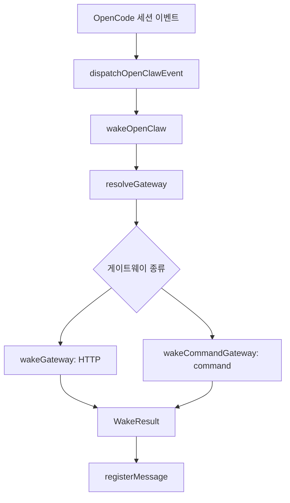
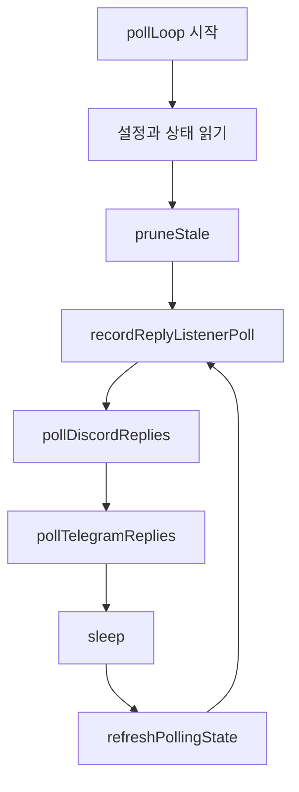

# openclaw core

## OpenClaw Core 모듈

`packages/openclaw-core`는 OpenClaw 알림과 원격 회신 주입을 담당하는 순수 코어 모듈입니다. OpenCode 쪽 세션 이벤트를 받아 설정된 게이트웨이로 알림을 보내고, Discord 또는 Telegram에서 온 답장을 원래 tmux pane으로 다시 주입할 수 있게 세션-메시지 상관관계를 관리합니다.

핵심 진입점은 `dispatchOpenClawEvent()`와 `wakeOpenClaw()`입니다. 외부 어댑터는 보통 `dispatchOpenClawEvent()`를 호출하고, 이 함수가 이벤트 별칭 처리, 게이트웨이 호출, 답장 상관관계 등록, 세션 정리까지 묶어서 수행합니다.



## 공개 표면

`src/index.ts`는 OpenClaw 실행 표면을 모읍니다.

- `wakeOpenClaw(config, event, context)`: 이벤트와 컨텍스트를 받아 게이트웨이를 깨웁니다.
- `initializeOpenClaw(config)`: reply listener 자격 증명이 있으면 데몬을 시작하고, 없으면 중지합니다.
- `startReplyListener(config)`: Discord 또는 Telegram 답장 폴링 데몬을 시작합니다.
- `stopReplyListener()`: 실행 중인 reply listener 데몬을 안전하게 중지합니다.
- `validateGatewayUrl(url)`: 게이트웨이 URL이 허용 가능한지 검사합니다.
- `OpenClawConfig`, `OpenClawGateway`, `OpenClawContext`, `OpenClawPayload`, `WakeResult` 등 타입을 재수출합니다.

어댑터 계층에서는 `runtime-dispatch.ts`의 `dispatchOpenClawEvent()`를 사용하는 쪽이 일반적입니다. call graph 기준으로 `src/plugin/event-session-lifecycle.ts`의 `dispatchOpenClawSessionEvent`가 이 함수를 호출합니다.

## 설정 모델

설정 타입은 `types.ts`에 정의되어 있습니다.

```ts
export type OpenClawConfig = {
  readonly enabled: boolean
  readonly gateways: Record<string, OpenClawGateway>
  readonly hooks: Record<string, OpenClawHook>
  readonly replyListener?: OpenClawReplyListenerConfig
}
```

`gateways`는 실제 전송 대상을 정의합니다. HTTP 게이트웨이는 `url`, `method`, `headers`, `timeout`을 사용하고, command 게이트웨이는 `command`, `timeout`을 사용합니다.

`hooks`는 이벤트 이름과 게이트웨이를 연결합니다. 각 hook은 `gateway`와 `instruction`을 가지며, `enabled`가 false이거나 대상 게이트웨이가 없으면 실행되지 않습니다.

`replyListener`는 답장 폴링과 주입을 제어합니다. `normalizeReplyListenerConfig()`는 다음 값을 안전한 범위로 정규화합니다.

- `pollIntervalMs`: 기본 3000ms, 최소 500ms, 최대 60000ms
- `rateLimitPerMinute`: 기본 10, 최소 1
- `maxMessageLength`: 기본 500, 최소 1, 최대 4000
- `includePrefix`: 명시적으로 false가 아니면 true
- `authorizedDiscordUserIds`: 비어 있지 않은 문자열만 유지

## 이벤트 디스패치 흐름

`dispatchOpenClawEvent()`는 런타임 이벤트를 OpenClaw 이벤트로 변환한 뒤 `wakeOpenClaw()`를 호출합니다.

`mapRawEventToOpenClawEvents()`는 일부 OpenCode 이벤트에 별칭을 추가합니다.

- `session.created` → `session-start`
- `session.deleted` → `session-end`
- `session.idle` → `stop`

원본 이벤트와 별칭 이벤트를 순서대로 시도하며, 처음으로 `wakeOpenClaw()`가 `null`이 아닌 결과를 반환하면 중단합니다. 이렇게 하면 설정이 원본 이벤트명 또는 OpenClaw 친화적 별칭 중 어느 쪽을 사용하더라도 동작할 수 있습니다.

`wakeOpenClaw()`는 다음 순서로 동작합니다.

1. `config.enabled`가 false이면 `null`을 반환합니다.
2. `resolveGateway()`로 이벤트에 연결된 게이트웨이를 찾습니다.
3. `OPENCLAW_REPLY_CHANNEL`, `OPENCLAW_REPLY_TARGET`, `OPENCLAW_REPLY_THREAD` 환경 변수와 `context` 값을 합쳐 회신 대상을 보강합니다.
4. `tmuxSession`을 컨텍스트 또는 `getCurrentTmuxSession()`에서 얻습니다.
5. `stop`, `session-end` 이벤트이고 현재 tmux 환경이면 `captureTmuxPane()`으로 최근 15줄을 `tmuxTail`에 담습니다.
6. `interpolateInstruction()`으로 `{{sessionId}}`, `{{projectPath}}`, `{{event}}`, `{{timestamp}}` 같은 변수를 instruction에 삽입합니다.
7. 게이트웨이 타입에 따라 `wakeGateway()` 또는 `wakeCommandGateway()`를 호출합니다.

HTTP 게이트웨이로 보낼 때는 `OpenClawPayload`를 구성합니다. 이 payload에는 이벤트, instruction, timestamp, session/project/tmux 정보, reply channel 정보, 그리고 `buildWhitelistedContext()`로 걸러낸 컨텍스트가 들어갑니다. 임의 키를 모두 외부로 내보내지 않고 명시된 필드만 전달하는 구조입니다.

## 게이트웨이 실행

### HTTP 게이트웨이

`wakeGateway()`는 HTTP 기반 게이트웨이를 호출합니다.

- `validateGatewayUrl()`로 URL을 먼저 검사합니다.
- 기본 method는 `POST`입니다.
- 기본 timeout은 10000ms입니다.
- body는 `JSON.stringify(payload)`로 전송합니다.
- 응답이 2xx가 아니면 `WakeResult`에 `success: false`, `statusCode`, `error: "HTTP <status>"`를 담습니다.
- 성공 응답 본문에서 `messageId`, `platform`, `channelId`, `threadId` 메타데이터를 추출합니다.

`validateGatewayUrl()`은 기본적으로 HTTPS만 허용합니다. 예외적으로 로컬 개발을 위해 `http://localhost`, `http://127.0.0.1`, `http://::1`, `http://[::1]`은 허용합니다.

### command 게이트웨이

`wakeCommandGateway()`는 로컬 shell command를 실행합니다.

- `gatewayConfig.command`가 없으면 실패합니다.
- `resolveCommandTimeoutMs()`로 timeout을 정합니다.
- 기본 timeout은 5000ms입니다.
- 최소 100ms, 최대 300000ms로 클램프합니다.
- `OMO_OPENCLAW_COMMAND_TIMEOUT_MS` 환경 변수로 기본 timeout을 덮어쓸 수 있습니다.
- `{{key}}` 변수는 `shellEscapeArg()`로 single-quote escape 후 삽입됩니다.
- 명령은 `sh -c <interpolated>` 형태로 실행됩니다.
- timeout 시 `terminateCommandProcess()`가 프로세스를 종료합니다.

`interpolateInstruction()`은 단순 문자열 치환이고, command 실행용 치환은 별도로 shell escape를 적용합니다. instruction 생성과 shell command 생성의 escape 정책이 다르므로 두 함수를 섞어 쓰지 않아야 합니다.

## WakeResult 메타데이터

HTTP 응답 본문 또는 command stdout은 `parseWakeMetadata()`로 해석됩니다. JSON이면 `extractWakeMetadata()`가 다음 키를 찾습니다.

- 메시지 ID: `messageId`, `message_id`, `id`
- 플랫폼: `platform`, `source`
- 채널: `channelId`, `channel_id`, `channel`
- 스레드: `threadId`, `thread_id`, `thread`

`data`, `result`, `message` 같은 중첩 객체도 후보로 검사하고, 가장 많은 정보를 담은 후보를 선택합니다. JSON 파싱에 실패하면 `"message id: ..."`와 `"sent via ..."` 형태의 텍스트에서 일부 메타데이터를 추출합니다.

이 메타데이터는 reply listener가 외부 메시지의 답장을 원래 tmux pane에 연결하는 데 사용됩니다.

## Reply Listener 데몬

reply listener는 Discord 또는 Telegram에서 사용자가 보낸 답장을 폴링하고, 해당 답장을 원래 CLI pane에 주입하는 백그라운드 데몬입니다.

`initializeOpenClaw()`는 `config.enabled`가 true이고 `replyListener.discordBotToken` 또는 `replyListener.telegramBotToken`이 있으면 `startReplyListener()`를 호출합니다. 자격 증명이 없으면 `stopReplyListener()`로 기존 데몬을 중지합니다.

`startReplyListener()`는 다음 조건을 확인합니다.

1. Discord 또는 Telegram bot token이 있어야 합니다.
2. 이미 데몬이 실행 중이면 현재 설정 signature와 새 설정 signature를 비교합니다.
3. signature가 같으면 기존 데몬을 재사용합니다.
4. signature가 다르면 `stopReplyListener()`로 중지 후 재시작합니다.
5. tmux가 없으면 실패합니다.
6. 정규화된 설정과 pending state를 state 디렉터리에 기록합니다.
7. `spawnReplyListenerDaemon()`으로 `daemon.ts` 또는 `daemon.js`를 분리 실행합니다.
8. `waitForReplyListenerReady()`로 데몬이 첫 poll을 기록할 때까지 기다립니다.

데몬 엔트리는 `daemon.ts`입니다. 이 파일은 `pollLoop()`를 실행하고, 치명적 오류가 나면 `logReplyListenerMessage()`에 기록한 뒤 process를 종료합니다.

## 폴링 루프

`pollLoop()`는 데몬의 메인 루프입니다.



루프는 `shouldContinuePolling()`이 true인 동안 계속됩니다. 상태 파일을 매 poll마다 갱신하므로 외부 프로세스가 state를 바꾸면 `refreshPollingState()`를 통해 다음 반복에 반영됩니다.

에러가 발생하면 `state.errors`와 `state.lastError`를 갱신하고, 일반 poll interval의 두 배만큼 대기한 뒤 재시도합니다. 오래된 reply correlation은 시작 시 한 번, 이후 1시간마다 `pruneStale()`로 정리합니다.

## Discord 답장 처리

`pollDiscordReplies()`는 Discord channel messages API를 polling합니다.

실행 조건은 엄격합니다.

- `replyListener.discordBotToken`이 있어야 합니다.
- `replyListener.discordChannelId`가 있어야 합니다.
- `authorizedDiscordUserIds`가 비어 있으면 아무 것도 처리하지 않습니다.
- Discord rate limit이 낮으면 `discordBackoffUntil`까지 backoff합니다.

메시지는 오래된 순서부터 처리합니다. 각 메시지에 대해:

1. `recordSeenDiscordMessage()`로 마지막 메시지 ID와 seen count를 갱신합니다.
2. reply message가 아니면 건너뜁니다.
3. 작성자가 authorized user 목록에 없으면 건너뜁니다.
4. `lookupByMessageId("discord-bot", replyToMessageId)`로 원래 세션 mapping을 찾습니다.
5. `ReplyListenerRateLimiter.canProceed()`가 false이면 drop합니다.
6. `injectReplyIntoPane()`으로 tmux pane에 주입합니다.
7. 성공하면 Discord 메시지에 체크 반응을 달려고 시도합니다.

`runtime-dispatch.ts`에서 `normalizePlatform()`은 `discord`를 `discord-bot`으로 바꿉니다. 따라서 Discord gateway가 `platform: "discord"`를 반환해도 registry에는 `"discord-bot"`으로 저장되고, `pollDiscordReplies()`의 lookup과 맞습니다.

## Telegram 답장 처리

`pollTelegramReplies()`는 Telegram `getUpdates` API를 polling합니다.

처리 조건은 다음과 같습니다.

- `replyListener.telegramBotToken`이 있어야 합니다.
- `replyListener.telegramChatId`가 있어야 합니다.
- 메시지가 reply 형태여야 합니다.
- 메시지 chat id가 설정된 `telegramChatId`와 같아야 합니다.
- `message.text`가 있어야 합니다.

원래 메시지는 `lookupByMessageId("telegram", String(reply_to_message.message_id))`로 찾습니다. 성공적으로 주입되면 Telegram `sendMessage`로 `"Injected into Codex CLI session."` 확인 메시지를 reply로 보냅니다.

## tmux 주입

`injectReplyIntoPane()`은 외부 답장을 실제 CLI pane으로 전달합니다.

주입 전 `captureTmuxPane(paneId, 15)`로 pane 내용을 읽고 `analyzePaneContent()`로 OpenCode CLI로 보이는지 검사합니다. confidence가 0.3보다 낮으면 stale mapping으로 판단해 `removeMessagesByPane()`로 registry를 정리하고 주입하지 않습니다.

`sanitizeReplyInput()`은 tmux로 보내기 전에 입력을 정리합니다.

- 터미널 제어 문자를 제거합니다.
- bidi control 문자를 제거합니다.
- 줄바꿈을 공백으로 바꿉니다.
- backslash, backtick, `$(`, `${`를 escape합니다.
- 앞뒤 공백을 제거합니다.

기본적으로 답장 앞에는 `[reply:<platform>] ` prefix가 붙습니다. `replyListener.includePrefix === false`이면 prefix를 생략합니다. 이후 `maxMessageLength`만큼 자르고 `sendToPane(paneId, truncated, true)`로 literal text와 Enter를 보냅니다.

tmux 관련 함수는 `tmux.ts`와 `tmux-path.ts`에 있습니다.

- `getTmuxPath()`는 cmux 호환 환경이면 `cmux`를 우선 찾고, 아니면 검증된 `tmux` 경로를 찾습니다.
- `captureTmuxPane()`은 `tmux capture-pane -p -t <pane> -S -<lines>`를 실행합니다.
- `sendToPane()`은 `tmux send-keys -l -- <text>` 후 필요하면 Enter를 보냅니다.
- `getCurrentTmuxSession()`은 `TMUX` 환경 변수 끝의 숫자로 `session-<id>` 형태를 만듭니다.

## 세션 registry

reply correlation은 `session-registry.ts` 계층이 관리합니다. 저장 위치는 `getOpenCodeStorageDir()` 아래의 `openclaw/reply-session-registry.jsonl`입니다.

각 줄은 `SessionMapping` JSON입니다.

```ts
export interface SessionMapping {
  sessionId: string
  tmuxSession: string
  tmuxPaneId: string
  projectPath: string
  platform: string
  messageId: string
  channelId?: string
  threadId?: string
  createdAt: string
}
```

`dispatchOpenClawEvent()`는 `WakeResult`가 성공이고 `messageId`, `platform`, `sessionId`, `projectPath`, `tmuxPaneId`가 모두 있을 때만 `registerMessage()`를 호출합니다. `session.deleted` 이벤트는 새 correlation을 등록하지 않고, 마지막에 `removeSession(sessionId)`로 기존 mapping을 제거합니다.

registry 파일은 lock 파일로 보호됩니다. `withRegistryLockOrWait()`는 최대 대기 후 lock을 얻으면 작업을 수행하고, 실패하면 fallback을 실행합니다. lock은 JSON payload에 `pid`, `acquiredAt`, `token`을 기록하며, 오래되고 소유 process가 죽은 lock은 `removeLockIfUnchanged()`로 정리합니다.

제공되는 registry 작업은 다음과 같습니다.

- `registerMessage(mapping)`: JSONL append
- `loadAllMappings()`: 모든 mapping 읽기
- `lookupByMessageId(platform, messageId)`: 특정 platform/messageId lookup
- `removeSession(sessionId)`: 세션 단위 정리
- `removeMessagesByPane(paneId)`: pane 단위 정리
- `pruneStale()`: 24시간이 지난 mapping 제거

## 상태 파일과 보안 모드

reply listener daemon 상태는 `~/.omo/openclaw/state` 아래에 저장됩니다.

- `reply-listener.pid`
- `reply-listener-state.json`
- `reply-listener-config.json`
- `reply-listener.log`

`ensureReplyListenerStateDir()`는 디렉터리를 `0o700`으로 만들고, `writeSecureReplyListenerFile()`은 파일을 `0o600`으로 씁니다. 로그 파일도 같은 secure mode를 사용하며, 1MB를 넘으면 `.old`로 회전합니다.

`ReplyListenerDaemonState`는 데몬 실행 여부, pid, startup token, 설정 signature, 마지막 poll 시각, Discord/Telegram offset, seen/injected/error count를 보관합니다. `normalizeReplyListenerState()`는 오래된 필드명인 `lastDiscordMessageId`와 새 필드명인 `discordLastMessageId`를 상호 보정합니다.

## 프로세스 식별과 중지

reply listener는 실수로 다른 process를 죽이지 않도록 identity marker를 사용합니다.

`REPLY_LISTENER_DAEMON_IDENTITY_MARKER` 값은 `--openclaw-reply-listener-daemon`입니다. `spawnReplyListenerDaemon()`은 daemon 실행 인자에 이 marker를 붙입니다.

`isReplyListenerDaemonProcessWithDeps()`는 Linux에서는 `/proc/<pid>/cmdline`을 읽고, 그 외 플랫폼에서는 `ps -p <pid> -o args=`를 실행해 marker 포함 여부를 확인합니다. `stopReplyListener()`와 `terminateReplyListenerProcess()`는 PID가 살아 있더라도 marker가 없으면 종료하지 않습니다.

이 패턴은 stale PID 또는 PID 재사용 상황에서 특히 중요합니다. `stopReplyListener()`는 marker가 맞지 않는 PID에 대해 “죽이기 거부” 결과를 반환하고 PID 파일만 제거합니다.

## 기여 시 주의할 점

OpenClaw Core는 외부 네트워크, 로컬 command, tmux 입력 주입, 장기 실행 daemon을 모두 다룹니다. 변경 시 다음 경계를 유지해야 합니다.

- HTTP gateway URL 검증은 `validateGatewayUrl()`을 우회하지 않습니다.
- command gateway 변수 삽입은 `shellEscapeArg()`를 거쳐야 합니다.
- reply injection 전에는 `analyzePaneContent()` 기반 pane 검사를 유지해야 합니다.
- registry 변경은 `withRegistryLock()` 또는 `withRegistryLockOrWait()` 안에서 수행해야 합니다.
- daemon 중지는 `isReplyListenerDaemonProcess()` 확인 후에만 수행해야 합니다.
- 상태와 설정 파일은 `writeSecureReplyListenerFile()`을 통해 secure mode로 써야 합니다.
- Discord 답장은 `authorizedDiscordUserIds`가 비어 있으면 처리하지 않는 현재 보안 모델을 유지해야 합니다.

테스트가 이미 직접 참조하는 표면도 있습니다. 예를 들어 `reply-listener-injection.test.ts`는 `sanitizeReplyInput()`을 검증하고, `gateway-url-validation.test.ts`는 `validateGatewayUrl()`을 검증합니다. 이 함수들의 동작은 보안 경계와 연결되어 있으므로 문법 정리처럼 보여도 회귀 테스트를 함께 갱신해야 합니다.