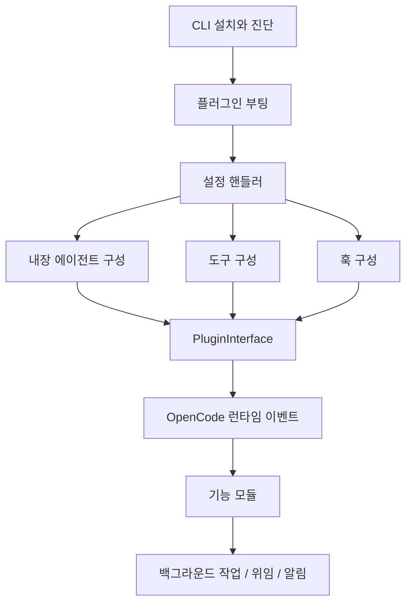

# OpenCode Adapter

ULTRAWORK MODE ENABLED!

## 개요

OpenCode Adapter는 `packages/omo-opencode`를 OpenCode 런타임에 연결하는 어댑터 계층입니다. 부팅 시 설정을 조립하고, 내장 에이전트와 도구를 구성하며, 기능 모듈과 훅을 연결한 뒤 OpenCode가 호출할 수 있는 플러그인 인터페이스로 내보냅니다.

이 그룹의 핵심은 각 하위 모듈을 독립 기능으로 두되, 부팅 순서와 런타임 이벤트 흐름 안에서 하나의 플러그인으로 결합하는 것입니다. 자세한 개별 구현은 [OpenCode Bootstrap And Interface](opencode-bootstrap-and-interface.md), [OpenCode Plugin Handlers](opencode-plugin-handlers.md), [OpenCode Hook Composition](opencode-hook-composition.md), [OpenCode Features](opencode-features.md), [OpenCode Tools](opencode-tools.md), [OpenCode CLI](opencode-cli.md), [OpenCode Config Shared MCP Agents](opencode-config-shared-mcp-agents.md)를 참고하면 됩니다.

## 하위 모듈의 역할

[OpenCode Bootstrap And Interface](opencode-bootstrap-and-interface.md)는 전체 조립의 시작점입니다. `createPluginModule()`과 `serverPlugin`이 설정 로드, 매니저 생성, 도구 등록, 훅 구성, `PluginInterface` 생성을 순서대로 실행합니다.

[OpenCode Plugin Handlers](opencode-plugin-handlers.md)는 OpenCode `config` 훅에서 실행되는 설정 조립 계층입니다. `createConfigHandler()`가 provider, plugin component, hook, agent, tool, MCP, command 설정을 OpenCode 설정 객체에 병합합니다.

[OpenCode Config Shared MCP Agents](opencode-config-shared-mcp-agents.md)는 `createBuiltinAgents()`를 통해 `sisyphus`, `hephaestus`, `atlas`, `explore`, `oracle`, `librarian`, `metis`, `momus`, `multimodal-looker` 같은 내장 에이전트를 구성합니다. 이 결과는 도구 권한, 위임 경로, 카테고리 기반 실행 흐름에 사용됩니다.

[OpenCode Tools](opencode-tools.md)는 OpenCode에 노출되는 실행 표면입니다. `background_task`, `background_output`, `background_cancel`, `call_omo_agent`, `task` 계열 도구가 기능 모듈과 에이전트 구성을 실제 사용자 작업으로 연결합니다.

[OpenCode Features](opencode-features.md)는 백그라운드 에이전트, task toast, tmux subagent, monitor 같은 런타임 기능을 제공합니다. 특히 `BackgroundManager`는 도구 호출, 세션 생성, 재시도, 부모 세션 wake, 취소와 정리를 하나의 작업 생명주기로 묶습니다.

[OpenCode Hook Composition](opencode-hook-composition.md)은 이벤트, 도구 실행 전후, 메시지 변환, continuation 같은 OpenCode 훅을 기능별 계층으로 합성하는 위치입니다. 예를 들어 `background-notification` 훅은 OpenCode 이벤트를 `BackgroundManager.handleEvent()`로 전달해 백그라운드 작업 상태를 갱신합니다.

[OpenCode CLI](opencode-cli.md)는 런타임 밖에서 어댑터를 설치하고 점검하는 진입점입니다. `runCli()`는 `install`, `setup`, `doctor`, `cleanup`, `run`, Codex Light 관련 명령을 하위 모듈에 위임합니다.

## 주요 흐름

가장 중요한 실행 흐름은 부팅과 런타임 작업 실행입니다. 부팅 단계에서는 `createPluginModule()`이 `loadPluginConfig()`, `createManagers()`, `createTools()`, `createHooks()`, `createPluginInterface()`를 순서대로 호출해 OpenCode에 제공할 최종 인터페이스를 만듭니다.

런타임에서는 설정 핸들러가 만든 agent/tool/hook 구성이 실제 OpenCode 훅과 도구 정의에 반영됩니다. 사용자가 `background_task`나 `task` 계열 도구를 호출하면 도구 계층이 `BackgroundManager` 또는 에이전트 위임 경로를 실행하고, 훅 계층은 세션 이벤트와 오류, 완료 상태를 다시 기능 모듈로 전달합니다.

## 설계 관점

OpenCode Adapter는 “OpenCode가 이해하는 플러그인 표면”과 “omo가 제공하는 에이전트 하네스 기능” 사이의 경계입니다. 설정 조립은 plugin handler가 담당하고, 실제 런타임 기능은 features가 담당하며, tools와 hooks는 그 기능을 OpenCode의 사용자 작업 및 이벤트 모델에 연결합니다.

따라서 이 모듈 그룹을 읽을 때는 개별 파일보다 연결 순서를 먼저 보는 것이 좋습니다. 설치와 진단은 CLI에서 시작되고, 부팅은 bootstrap 계층을 통과하며, 설정은 plugin handler에서 합쳐지고, agent/tool/hook 구성은 OpenCode 인터페이스로 노출됩니다. 이후 런타임 이벤트는 feature 모듈로 흘러가 백그라운드 작업, 위임, 알림, 정리 같은 실제 동작을 완성합니다.