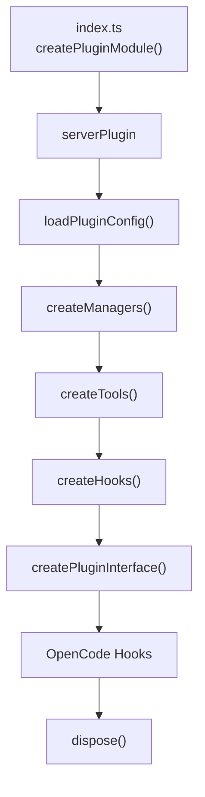

# OpenCode Bootstrap And Interface

## 개요

`OpenCode Bootstrap And Interface` 모듈은 `packages/omo-opencode` 플러그인이 OpenCode 런타임에 로드될 때 실행되는 조립 계층입니다. 이 계층은 설정을 읽고, 런타임 매니저를 만들고, 도구와 훅을 구성한 뒤, OpenCode가 호출하는 `PluginInterface` 형태로 공개합니다.

진입점은 `index.ts`입니다. 기본 export인 `pluginModule`은 `createPluginModule()`의 결과이며, 실제 부팅 로직은 `testing/create-plugin-module.ts`에 있습니다. 파일 경로에 `testing`이 포함되어 있지만 테스트 전용 구현이 아니라 의존성 주입이 가능한 실제 플러그인 팩토리입니다.



## 부팅 흐름

`createPluginModule(overrides)`는 `PluginModule`을 반환합니다.

반환 객체는 다음 형태입니다.

```ts
{
  id: "oh-my-openagent",
  server: serverPlugin,
}
```

`serverPlugin`은 OpenCode가 플러그인을 로드할 때 호출하는 함수입니다. 입력값 `input`은 `PluginContext` 역할을 하며 `directory`, `client`, `serverUrl` 같은 런타임 정보를 포함합니다.

부팅 순서는 다음 계약을 가집니다.

1. `installAgentSortShim()`으로 에이전트 정렬 shim을 설치합니다.
2. `initConfigContext("opencode", null)`로 현재 플랫폼 컨텍스트를 OpenCode로 고정합니다.
3. 레거시 경고와 워크스페이스 마이그레이션을 실행합니다.
4. `detectDuplicateOmoPlugin()`으로 중복 플러그인을 감지하고, 중복이면 빈 훅 객체 `{}`를 반환해 조기 종료합니다.
5. `detectExternalSkillPlugin()`으로 외부 skill 플러그인 충돌을 경고합니다.
6. `injectServerAuthIntoClient(input.client)`로 OpenCode 서버 인증 정보를 SDK client에 주입합니다.
7. `loadPluginConfig(input.directory, input)`로 계층형 설정을 로드합니다.
8. TUI sidebar가 켜져 있으면 `ensureTuiPluginEntry()`로 TUI 설정을 self-heal합니다.
9. live server route, runtime security skill source, i18n, agent sort order, OpenClaw, team mode, tmux check를 초기화합니다.
10. `createManagers()`, `createTools()`, `createHooks()`, `createPluginInterface()`를 순서대로 호출합니다.
11. compaction hook과 dispose hook을 추가해 최종 `Hooks` 객체를 반환합니다.

이 순서는 중요합니다. `createTools()`는 `createManagers()`에서 만든 `backgroundManager`, `tmuxSessionManager`, `skillMcpManager`를 필요로 하고, `createHooks()`는 `createTools()`에서 계산한 `mergedSkills`, `availableSkills`를 필요로 합니다. `createPluginInterface()`는 그 결과 전체를 OpenCode hook surface에 연결합니다.

## 설정과 런타임 상태

`plugin-config.ts`는 설정 로더의 재수출 계층입니다.

- `loadPluginConfig`
- `mergeConfigs`
- `loadConfigFromPath`
- `parseConfigPartially`

이 모듈 자체는 설정 파싱을 직접 구현하지 않고 `plugin-config/*` 하위 모듈로 위임합니다. 부팅 경로에서는 `createPluginModule()`이 `loadPluginConfig()`만 직접 사용합니다.

`plugin-state.ts`는 모델 관련 캐시 상태를 만듭니다.

```ts
export function createModelCacheState(): ModelCacheState {
  return {
    modelContextLimitsCache: new Map<string, number>(),
    visionCapableModelsCache: new Map<string, VisionCapableModel>(),
    anthropicContext1MEnabled: false,
  };
}
```

이 상태는 설정 핸들러, 훅, 컨텍스트 제한 복구 로직이 공유합니다. 새 모델 캐시 항목이 필요하면 전역 변수 대신 `ModelCacheState`에 추가해 `createManagers()`와 `createHooks()` 호출 경로로 전달하는 방식이 이 모듈의 패턴입니다.

## tmux 런타임 설정

`create-runtime-tmux-config.ts`는 tmux 설정을 런타임에서 안전하게 확정합니다.

- `isTmuxIntegrationEnabled(pluginConfig)`는 `pluginConfig.tmux?.enabled ?? false`만 확인합니다.
- `createRuntimeTmuxConfig(pluginConfig)`는 `TmuxConfigSchema.parse(pluginConfig.tmux ?? {})`를 호출해 설정을 스키마로 검증하고 기본값을 채웁니다.
- `isInteractiveBashEnabled`는 `interactive-bash-availability.ts`에서 재수출됩니다.

`interactive-bash-availability.ts`의 `isInteractiveBashEnabled()`는 `tmux` 바이너리가 존재하는지만 확인합니다.

```ts
export function isInteractiveBashEnabled(
  which: (binary: string) => string | null = defaultWhich,
): boolean {
  return which("tmux") !== null
}
```

기본 구현은 Bun 런타임의 `Bun.which("tmux")`를 사용합니다. 테스트에서는 `which` 함수를 주입해 tmux 설치 여부를 재현할 수 있습니다.

## 매니저 생성

`createManagers()`는 플러그인의 장기 실행 상태와 외부 시스템 연결을 만드는 중심 함수입니다.

반환 타입 `Managers`는 다음 구성요소를 포함합니다.

- `tmuxSessionManager`
- `backgroundManager`
- `skillMcpManager`
- `configHandler`
- `modelFallbackControllerAccessor`
- `tuiStateMirror?`
- `monitorManager?`

`createManagers()`는 기본 의존성을 `defaultCreateManagersDeps`에 모아두고, `args.deps`로 일부를 교체할 수 있게 되어 있습니다. 이 패턴은 테스트에서 실제 tmux, monitor, cleanup 로직을 대체하기 위한 것입니다.

특히 tmux 서버 상태 표시는 신중하게 처리합니다.

```ts
if (tmuxConfig.enabled && ctx.serverUrl) {
  deps.markServerRunningInProcessFn()
}
```

`tmuxConfig.enabled`만으로 서버가 실행 중이라고 간주하지 않습니다. `ctx.serverUrl`이 있을 때만 `markServerRunningInProcessFn()`을 호출합니다. 주석에 적힌 것처럼, vanilla `opencode` 세션에서는 서버가 실제로 열려 있지 않을 수 있고, 이를 실행 중으로 오판하면 team layout이 실패하는 attach pane을 만들 수 있습니다.

`TmuxSessionManager`는 `shouldSkipSession` 옵션을 받습니다.

```ts
shouldSkipSession: (sessionId) => lookupTeamSession(sessionId) !== undefined
```

team mode 세션은 `team-layout-tmux`가 생명주기를 소유하므로 일반 subagent tmux polling에서 제외합니다. 이 경계가 없으면 같은 session이 team layout과 subagent panel 양쪽에 중복 노출되거나 pane 종료 경쟁이 발생할 수 있습니다.

`BackgroundManager`는 subagent session 이벤트를 받아 tmux와 OpenClaw에 전달합니다.

- `onSubagentSessionCreated`는 `tmuxSessionManager.onSessionCreated()`를 호출하고, `pluginConfig.openclaw`가 있으면 `dispatchOpenClawEvent()`를 호출합니다.
- `onSubagentSessionDeleted`는 `tmuxSessionManager.onSessionDeleted()`를 호출합니다.
- `onShutdown`은 `tuiStateMirror.stop()`, team mode cleanup, tmux cleanup, monitor shutdown을 순서대로 시도합니다.

프로세스 종료 시에도 같은 cleanup이 실행되도록 `registerManagerForCleanupFn()`에 `shutdown` 콜백을 등록합니다.

## 도구 생성

`createTools()`는 OpenCode에 노출할 tool record와 skill metadata를 계산합니다.

흐름은 단순합니다.

1. `createSkillContext({ directory, pluginConfig })`로 skill 로딩 결과를 만듭니다.
2. `createAvailableCategories(pluginConfig)`로 prompt builder가 사용할 category 목록을 만듭니다.
3. `createToolRegistry({ ctx, pluginConfig, managers, skillContext, availableCategories })`로 실제 OpenCode tool map을 구성합니다.
4. `filteredTools`, `mergedSkills`, `availableSkills`, `availableCategories`, `browserProvider`, `disabledSkills`, `taskSystemEnabled`를 반환합니다.

이 함수는 tool 등록 정책을 직접 갖지 않습니다. 실제 도구 선택과 config gate는 `plugin/tool-registry.ts`가 담당합니다. 따라서 새 도구를 추가할 때 이 파일을 확장하기보다 `createToolRegistry()` 쪽의 registry와 관련 config schema를 확인해야 합니다.

## 훅 생성

`create-hooks.ts`는 세 계층의 훅을 합칩니다.

```ts
const core = createCoreHooks(...)
const continuation = createContinuationHooks(...)
const skill = createSkillHooks(...)

const hooks = {
  ...core,
  ...continuation,
  ...skill,
}
```

각 계층의 역할은 다음과 같습니다.

- `createCoreHooks()`는 기본 lifecycle, tool guard, transform 계열 훅을 만듭니다.
- `createContinuationHooks()`는 continuation, todo continuation, background continuation 계열 동작을 담당합니다.
- `createSkillHooks()`는 로드된 skill과 available skill 목록을 기반으로 skill 주입 및 skill 관련 hook 동작을 담당합니다.

`createHooks()`는 최종적으로 `disposeHooks()`를 추가합니다.

```ts
disposeHooks: (): void => {
  disposeCreatedHooks(hooks)
}
```

`disposeCreatedHooks()`는 훅 객체 중 dispose 가능한 항목만 순서대로 정리합니다.

- `claudeCodeHooks`
- `commentChecker`
- `runtimeFallback`
- `todoContinuationEnforcer`
- `autoSlashCommand`
- `anthropicContextWindowLimitRecovery`

새 disposable hook을 추가한다면 `DisposableCreatedHooks` 타입과 `disposeCreatedHooks()` 호출 목록에 함께 추가해야 합니다. 그렇지 않으면 플러그인 종료 후 interval, watcher, controller 같은 리소스가 남을 수 있습니다.

## OpenCode 인터페이스 연결

`plugin-interface.ts`의 `createPluginInterface()`는 내부 매니저, 훅, 도구를 OpenCode가 호출하는 hook 이름에 연결하는 얇은 경계입니다.

반환 객체의 주요 키는 다음과 같습니다.

- `tool`
- `chat.params`
- `chat.headers`
- `command.execute.before`
- `chat.message`
- `experimental.chat.messages.transform`
- `experimental.chat.system.transform`
- `config`
- `event`
- `tool.definition`
- `tool.execute.before`
- `tool.execute.after`

이 파일은 정책 구현 위치가 아니라 외부 이벤트 이름을 고정하는 어댑터입니다. 실제 처리는 `plugin/*` 또는 `hooks/*`에 둡니다.

예를 들어 `chat.params`는 약간의 전처리만 수행합니다.

```ts
const agentName =
  typeof chatParamsInput.agent === "string"
    ? chatParamsInput.agent
    : chatParamsInput.agent?.name

if (chatParamsInput.message) {
  applyAgentVariant(pluginConfig, agentName, chatParamsInput.message)
}

const handler = createChatParamsHandler({
  client: ctx.client,
})
await handler(input, output)
```

즉 `chat.params`에서는 message variant에 agent별 설정을 반영한 뒤, 실제 parameter 처리는 `createChatParamsHandler()`가 맡습니다.

`experimental.chat.system.transform`은 `createSystemTransformHandler(pluginConfig.default_mode, getUltraworkMessage)`로 구성됩니다. default mode와 ultrawork system message를 결합하는 지점입니다.

## 종료 처리

`plugin-dispose.ts`의 `createPluginDispose()`는 플러그인 종료를 idempotent하게 만듭니다.

```ts
let disposePromise: Promise<void> | null = null

return async (): Promise<void> => {
  if (disposePromise) {
    await disposePromise
    return
  }

  disposePromise = (async (): Promise<void> => {
    ...
  })()

  await disposePromise
}
```

첫 호출에서만 실제 종료 작업을 시작하고, 동시에 여러 번 호출되면 같은 `disposePromise`를 기다립니다. 종료 순서는 다음과 같습니다.

1. `backgroundManager.shutdown()`
2. `skillMcpManager.disconnectAll()`
3. `disposeHooks()`

각 단계는 독립적인 `try/catch`로 감싸져 있습니다. 한 단계가 실패해도 다음 cleanup을 계속 시도하며, 실패는 `log()`로 기록합니다.

`createPluginModule()`은 이 dispose 함수 위에 runtime skill source cleanup을 추가합니다.

```ts
dispose: async (): Promise<void> => {
  runtimeSkillSource?.stop()
  await dispose()
}
```

## TUI sidebar 플러그인

`tui.ts`는 OpenCode TUI용 별도 plugin module입니다. 기본 export는 `TuiPluginModule`이며 id는 `"oh-my-openagent:tui"`입니다.

TUI 초기화 흐름은 다음과 같습니다.

1. `@opentui/solid`를 동적 import합니다. import에 실패하면 조용히 종료합니다.
2. 현재 directory의 plugin config를 `loadPluginValidation()`으로 읽습니다.
3. `config.tui?.sidebar?.enabled === false`이면 sidebar 등록을 건너뜁니다.
4. `readView(directory)`로 현재 sidebar view를 계산합니다.
5. `registerSidebarContentSlot()`으로 `sidebar_content` slot을 등록합니다.
6. `POLL_INTERVAL_MS`마다 `tick()`을 실행해 mirror 상태를 다시 읽고, `viewKey()`가 달라졌을 때만 render를 요청합니다.
7. dispose 시 timer를 정리합니다.

`readView()`는 여러 source를 하나의 `SidebarView`로 합칩니다.

```ts
const validation = await loadPluginValidation(directory)
const mirror = readMirror(directory)
const roster = await loadRosterRows(directory)

return computeView({
  config: deriveConfig(validation),
  roster: deriveRoster(roster),
  agents: deriveAgents(mirror),
  jobs: deriveJobBoard(mirror),
  loop: deriveLoop(mirror),
})
```

렌더링은 두 단계입니다.

- `buildViewNodes(currentView, api.theme.current)`가 추상 `ViewNode[]`를 만듭니다.
- `materialize()`와 재귀 함수 `materializeNode()`가 `ViewNode`를 Solid runtime node로 변환합니다.

이 구조 덕분에 view 계산, view node 생성, TUI runtime materialization이 분리됩니다. sidebar 표현을 바꿀 때는 먼저 `features/tui-sidebar/*`의 view/model 계층을 확인하고, 실제 OpenTUI node 변환이 필요한 경우에만 `materializeNode()`를 수정합니다.

`handleTuiPollError()`는 polling 중 발생한 `Error`만 로그로 보고합니다. `Error`가 아닌 값이 throw되면 다시 throw합니다. 이는 예상 가능한 런타임 실패와 비정상 throw 값을 구분하기 위한 방어 코드입니다.

## 테스트용 모듈 mock 생명주기

`testing/module-mock-lifecycle.ts`는 Bun mock module 상태를 테스트 파일 단위로 보존하고 복원하기 위한 유틸리티입니다. 플러그인 부팅 자체와 직접 연결되지는 않지만, 이 bootstrap/interface 계층의 테스트 안정성을 지탱합니다.

핵심 함수는 `installModuleMockLifecycle(mockApi, options)`입니다. 이 함수는 `mockApi.module`과 `mockApi.restore`를 감싸서 다음 상태를 관리합니다.

- `snapshots`: 원본 module export를 복원하기 위한 snapshot
- `activeMocks`: specifier별 active mock stack
- `preserveOwners`: 특정 test file의 mock을 restore 이후에도 보존하기 위한 owner set

specifier 복원 키는 `resolveSpecifier(specifier, callerUrl)`로 계산합니다. caller는 기본적으로 stack trace에서 얻습니다.

`getCallerUrlFromStack(stack, fallbackUrl)`는 stack line에서 파일 경로를 찾고, `test-setup.ts`와 `module-mock-lifecycle.ts` 내부 frame은 건너뜁니다. 경로 정규화는 `normalizeStackPath()`가 처리합니다.

`normalizeStackPath()`는 세 가지 입력을 다룹니다.

- 이미 `file://`로 시작하는 URL
- Windows drive path
- 일반 파일 경로

mock 복원에는 여러 경로가 있습니다.

- `restoreAllModuleMocks()`는 모든 mock과 snapshot을 제거합니다.
- `restoreUnpreservedModuleMocks()`는 보존 대상이 아닌 mock만 제거하고 필요한 snapshot과 active mock을 replay합니다.
- `restoreModuleMocksForTestFile(callerUrl)`는 특정 test file이 소유한 mock만 제거합니다.
- `preserveModuleMocksForTestFile(callerUrl)`는 해당 caller의 mock을 보존 대상으로 표시합니다.

테스트에서 한 파일의 mock이 다른 파일의 mock을 지우지 않게 하는 것이 이 모듈의 핵심 목적입니다.

## 확장할 때의 기준

새 OpenCode hook을 추가할 때는 `createPluginInterface()`에서 외부 hook 이름을 연결하고, 실제 정책은 `plugin/*` 또는 `hooks/*`에 둡니다. hook이 종료 처리를 필요로 하면 `DisposableCreatedHooks`와 `disposeCreatedHooks()`도 함께 갱신해야 합니다.

새 장기 실행 매니저를 추가할 때는 `createManagers()`의 `Managers` 타입, `CreateManagersDeps`, `defaultCreateManagersDeps`, shutdown 경로를 함께 설계해야 합니다. 테스트 가능성이 필요하면 직접 import를 흩뿌리지 말고 기존처럼 deps 객체로 주입 가능하게 만듭니다.

새 도구를 추가할 때는 `createTools()`보다 `createToolRegistry()`가 주된 수정 지점입니다. `createTools()`는 skill context, category, registry 결과를 연결하는 orchestration 계층으로 유지하는 편이 맞습니다.

부팅 순서에 새 단계를 넣을 때는 그 단계가 다음 중 무엇에 의존하는지 먼저 확인해야 합니다.

- config 로드 전에도 가능한 전역 초기화인지
- `pluginConfig`가 필요한 설정 기반 초기화인지
- managers가 필요한 runtime 초기화인지
- toolsResult의 skill metadata가 필요한 hook 초기화인지
- OpenCode hook 객체에만 붙이면 되는 interface-level 연결인지

이 모듈의 안정성은 “한 파일에서 모든 정책을 처리하는 것”이 아니라 “부팅 순서와 경계가 명확한 것”에서 나옵니다.