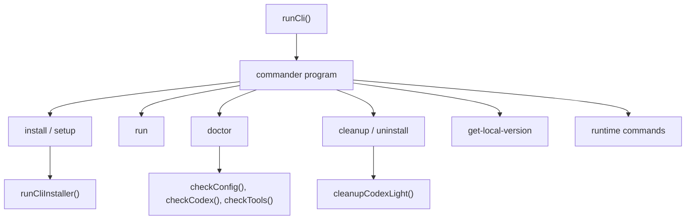

# OpenCode CLI

ULTRAWORK MODE ENABLED!

## OpenCode CLI 모듈

`packages/omo-opencode/src/cli`는 `oh-my-opencode`, `omo`, `lazycodex-ai` 같은 실행 이름을 통해 들어오는 CLI 진입점을 구성합니다. 핵심 역할은 설치, 실행, 진단, 정리, Codex Light 연동, Boulder 진행률 조회 같은 사용자 명령을 `commander` 기반 명령으로 묶고, 실제 작업은 하위 모듈에 위임하는 것입니다.



## CLI 진입점

`cli-program.ts`가 최상위 명령 구성을 담당합니다.

주요 공개 함수는 두 개입니다.

- `resolveInstallArgs(options, invocationName)`: 실행 이름과 옵션을 조합해 `InstallArgs`를 만듭니다.
- `runCli()`: `program.parse()`를 호출해 실제 CLI 파싱을 시작합니다.

`resolveInstallArgs()`는 `OMO_INVOCATION_NAME`이 `lazycodex` 또는 `lazycodex-ai`이면 기본 설치 플랫폼을 `"codex"`로 설정합니다. 이 때문에 같은 바이너리 계열이라도 `lazycodex-ai install`은 Codex Light 설치 경로를 기본값으로 사용하고, `oh-my-opencode install`은 명시 옵션이 없으면 일반 OpenCode 설치 흐름을 따릅니다.

최상위 `program`은 숨김 루트 옵션 `--platform <platform>`을 받습니다. `install`과 `cleanup`은 각 명령 옵션과 루트 옵션을 함께 해석합니다.

## 명령 구성

### `install` / `setup`

`install` 명령은 `install(args)`를 호출합니다. 실제 대화형 또는 비대화형 설치 흐름은 `install` 하위 모듈로 넘어가며, `cli-installer.ts`의 `runCliInstaller(args, version)`가 OpenCode 플러그인 설정, OMO 설정 파일 생성, Codex Light 설치를 조합합니다.

설치 흐름의 주요 단계는 다음과 같습니다.

1. `validateNonTuiArgs(args)`로 비대화형 인자를 검증합니다.
2. `argsToConfig(args)`로 설치 설정을 만듭니다.
3. OpenCode 대상이면 `isOpenCodeInstalled()`와 `getOpenCodeVersion()`으로 실행 파일과 버전을 확인합니다.
4. `addPluginToOpenCodeConfig(version)`로 OpenCode 설정의 `plugin` 배열에 플러그인 엔트리를 추가합니다.
5. `ensureTuiPluginEntry()`로 TUI 설정에도 같은 플러그인 엔트리를 보강합니다.
6. `writeOmoConfig(config)`로 `oh-my-openagent` 설정을 생성하거나 병합합니다.
7. `runCodexInstaller()`로 Codex Light 어댑터를 설치합니다. 이 단계는 `config.hasCodex`가 켜져 있을 때만 실행됩니다.
8. TTY 환경이고 `args.tui`가 참이면 `maybePromptForGitHubStars(platform)`가 GitHub 스타 요청을 표시합니다.

`runCliInstaller()`는 OpenCode 설치와 Codex 설치를 분리해 실패를 다룹니다. Codex 설치만 실패했고 OpenCode 설치가 이미 완료된 경우에는 경고만 출력하고, Codex 단독 설치였으면 오류로 종료합니다.

### `run`

`run <message>` 명령은 OpenCode 세션을 실행하고 완료 조건을 기다리는 래퍼입니다. `cli-program.ts`는 사용자가 넘긴 옵션을 `RunOptions`로 정규화한 뒤 `run(runOptions)`를 호출합니다.

지원 옵션은 다음과 같은 실행 표면을 제공합니다.

- `--agent <name>`: 실행 에이전트 지정
- `--model <provider/model>`: 모델 강제 지정
- `--directory <path>`: 작업 디렉터리 지정
- `--port <port>`: 서버 포트 지정, 이미 사용 중이면 연결
- `--attach <url>`: 기존 OpenCode 서버에 연결
- `--on-complete <command>`: 완료 후 실행할 셸 명령
- `--json`: 구조화된 JSON 출력
- `--session-id <id>`: 기존 세션 재개

`--port`와 `--attach`는 동시에 사용할 수 없으며, 같이 전달되면 즉시 오류를 내고 종료합니다.

실행 흐름은 `cli/run/runner.ts`로 이어집니다. 제공된 실행 흐름 기준으로 `run()`은 `loadPluginConfig()`를 호출하고, 설정 로딩 과정에서 `getCanonicalAncestorPathsNearestFirst()`, `findProjectOpencodePluginConfigFiles()`, `migrateConfigFile()`, `addAgentOrderWarnings()` 같은 설정 탐색 및 마이그레이션 경로를 탑니다.

### `doctor`

`doctor` 명령은 설치 상태와 런타임 의존성을 점검합니다. `cli-program.ts`는 `--status`, `--verbose`, `--json`을 해석해 `DoctorOptions`를 만들고 `doctor(doctorOptions)`를 호출합니다.

OpenCode 대상 기본 체크 목록은 `doctor/checks/index.ts`의 `getAllCheckDefinitions()`에 정의되어 있습니다.

- `checkSystem`
- `checkConfig`
- `checkTuiPluginConfig`
- `checkTools`
- `checkModels`
- `checkTeamMode`

Codex 대상 체크 목록은 `getCodexCheckDefinitions()`에 정의되어 있습니다.

- `checkCodex`
- `checkCodexComponents`
- `checkCodexRuntimeWrapper`

`resolveDoctorTarget(process.env.OMO_INVOCATION_NAME)`는 실행 이름을 기반으로 Codex 대상 진단이 필요한지 판단합니다.

### `cleanup` / `uninstall`

`cleanup-command.ts`의 `configureCleanupCommand(program)`가 `cleanup` 명령과 `uninstall` 별칭을 등록합니다. 이 명령은 현재 Codex Light 정리만 지원합니다.

`resolveCleanupPlatform(options, invocationName)`는 플랫폼을 결정합니다. 명시 옵션이 없고 실행 이름이 `lazycodex` 또는 `lazycodex-ai`이면 `"codex"`를 반환합니다.

`cleanup(options)`는 다음 조건을 강제합니다.

```ts
if (options.platform !== "codex") {
  console.error("Error: cleanup currently supports only --platform=codex")
  return 1
}
```

Codex 대상이면 `cleanupCodexLight()`를 호출해 관리되는 Codex Light 상태를 정리합니다. JSON 모드에서는 결과 객체를 그대로 출력하고, 텍스트 모드에서는 변경된 설정 파일, 백업 경로, 제거된 경로, 제거된 에이전트 링크, 보존된 프로젝트 로컬 산출물을 줄 단위로 출력합니다.

### `get-local-version`

`get-local-version` 명령은 `getLocalVersion(versionOptions)`로 위임됩니다. 현재 설치 버전, npm 최신 버전, 로컬 개발 모드, 고정 버전 여부 같은 정보를 확인하는 용도입니다.

### `mcp-oauth`와 runtime 명령

`program.addCommand(createMcpOAuthCommand())`가 MCP OAuth 관련 명령을 추가합니다. `configureRuntimeCommands(program)`는 런타임 관련 명령을 붙입니다. Codex 쪽 `ulw-loop` 실행은 `codex-ulw-loop.ts`가 담당합니다.

## 설정 관리

`config-manager.ts`는 CLI 설정 작업에서 쓰는 함수들을 한 곳에 재수출하는 배럴입니다. 실제 구현은 `config-manager/` 디렉터리에 나뉘어 있습니다.

### 설정 컨텍스트

`config-context.ts`는 OpenCode 설정 위치를 전역 컨텍스트로 관리합니다.

- `initConfigContext(binary, version)`: 탐지된 OpenCode 바이너리와 버전을 기준으로 경로를 초기화합니다.
- `getConfigContext()`: 컨텍스트가 없으면 기본 `opencode` 경로로 초기화합니다.
- `resetConfigContext()`: 테스트나 재초기화를 위해 컨텍스트를 비웁니다.
- `getConfigDir()`, `getConfigJson()`, `getConfigJsonc()`, `getOmoConfigPath()`: 현재 컨텍스트에서 필요한 경로를 반환합니다.

`getOmoConfigPath()`는 새 설정 이름과 레거시 설정 이름을 모두 검사합니다. 기존 레거시 파일이 발견되면 그 경로를 반환하고, 없으면 기본 OMO 설정 경로를 반환합니다.

### OpenCode 플러그인 등록

`add-plugin-to-opencode-config.ts`의 중심 함수는 `addPluginToOpenCodeConfig(currentVersion)`입니다.

이 함수는 다음 문제를 함께 처리합니다.

- `opencode.jsonc`와 `opencode.json` 중 실제 존재하는 형식 감지
- 프로필 디렉터리의 설정 파일까지 함께 갱신
- 기존 `oh-my-opencode`, `oh-my-openagent`, 파일 기반 개발 플러그인 엔트리 감지
- npm dist-tag 기반 플러그인 엔트리 선택
- 다운그레이드 방지
- JSONC 파일의 기존 `plugin` 배열 보존 갱신

핵심 보조 함수는 다음과 같습니다.

- `getConfigTargets()`: 기본 설정, 루트 설정, 프로필 설정을 `ConfigTarget[]`로 수집합니다.
- `isSourceOmoPluginEntry(plugin)`: `file://.../src/index.ts` 또는 `dist/index.js` 같은 개발 플러그인 엔트리인지 확인합니다.
- `isPackageOmoPluginEntry(plugin)`: 패키지 이름 기반 엔트리인지 확인합니다.
- `choosePluginEntry(...)`: 기존 소스 엔트리, 선호 소스 엔트리, fallback 패키지 엔트리 중 사용할 값을 고릅니다.
- `writePluginEntryToTarget(...)`: 대상 설정 파일 하나를 실제로 갱신합니다.

개발 중 파일 기반 플러그인 엔트리가 이미 있으면, 설치 명령은 이를 패키지 엔트리로 덮어쓰지 않고 보존합니다. 이는 로컬 개발 환경에서 `file://` 플러그인을 유지하기 위한 동작입니다.

### TUI 설정 보강

`add-tui-plugin-to-tui-config.ts`의 `ensureTuiPluginEntry(opts)`는 서버 설정의 플러그인 엔트리를 읽고, OpenCode TUI 설정인 `tui.json`에도 같은 플러그인을 넣습니다.

흐름은 다음과 같습니다.

1. `readServerConfig(configDir)`로 `opencode.jsonc` 또는 `opencode.json`을 읽습니다.
2. `pluginEntries(serverConfig).find(isServerPluginEntry)`로 서버 플러그인 엔트리를 찾습니다.
3. `desiredTuiEntry(serverEntry)`로 TUI에 넣어도 되는 엔트리인지 검증합니다.
4. `readTuiConfig(tuiJsonPath)`로 기존 TUI 설정을 읽습니다.
5. `isNamedTuiPluginEntry(entry)`에 해당하는 기존 OMO 계열 엔트리를 제거하고 원하는 엔트리를 추가합니다.
6. `writeFileAtomically()`로 원자적 쓰기를 수행합니다.

반환값은 `{ changed, reason }` 형태입니다. `reason`은 `"no-server-entry"`, `"malformed"`, `"already-present"`, `"added"` 같은 상태를 담습니다.

### OMO 설정 작성

`write-omo-config.ts`의 `writeOmoConfig(installConfig)`는 플러그인 전용 설정 파일을 생성하거나 기존 파일과 병합합니다.

동작 특징은 다음과 같습니다.

- 설정 디렉터리가 없으면 `ensureConfigDirectoryExists()`로 생성합니다.
- 레거시 파일명이 감지되면 `migrateLegacyConfigFile()`로 새 파일명으로 이동을 시도합니다.
- 기존 파일이 있으면 `backupConfigFile()`로 백업을 먼저 만듭니다.
- 빈 파일, 공백 파일, 객체가 아닌 JSON은 새 설정으로 대체합니다.
- 정상 객체인 기존 설정은 `deepMergeRecord(newConfig, existing)`로 병합합니다.

`deepMergeRecord()`는 `__proto__`, `constructor`, `prototype` 키를 건너뛰어 프로토타입 오염을 피합니다. 중첩 객체는 재귀 병합하고, 배열이나 원시값은 source 값으로 대체합니다.

주의할 점은 병합 방향입니다. `writeOmoConfig()`는 `newConfig`를 기본값으로 두고 기존 설정을 source로 병합합니다. 즉 사용자가 이미 가진 설정이 새로 생성된 기본 설정 위에 우선 적용됩니다.

### 버전과 dist-tag

`plugin-name-with-version.ts`의 `getPluginNameWithVersion(currentVersion, packageName)`은 npm dist-tag를 조회해 현재 버전에 맞는 엔트리를 고릅니다.

- `latest`, `beta`, `next`를 우선 확인합니다.
- 추가 dist-tag도 순회합니다.
- 현재 버전과 일치하는 tag가 있으면 `packageName@tag`를 반환합니다.
- prerelease 버전이면 prerelease 식별자를 tag로 사용합니다.
- 그 외에는 bare package name을 반환합니다.

`version-compatibility.ts`의 `checkVersionCompatibility(currentVersion, newVersion)`는 기존 설정의 플러그인 버전과 설치하려는 버전을 비교합니다. 다운그레이드는 `canUpgrade: false`가 되며, 메이저 버전 상승은 허용하지만 `requiresMigration: true`로 표시합니다.

## OpenCode 바이너리 탐지

`opencode-binary.ts`는 `opencode`와 `opencode-desktop`을 순서대로 검사합니다.

`findOpenCodeBinaryWithVersion()`은 각 바이너리에 `--version`을 실행하고, 짧은 타임아웃 안에 정상 종료한 경우 버전을 추출합니다. 성공하면 `initConfigContext(binary, version)`을 호출해 이후 설정 경로가 해당 바이너리 기준으로 계산되도록 만듭니다.

공개 함수는 다음 두 개입니다.

- `isOpenCodeInstalled()`: 탐지 성공 여부를 boolean으로 반환합니다.
- `getOpenCodeVersion()`: 탐지된 버전 문자열 또는 `null`을 반환합니다.

프로세스 실행은 `spawnWithWindowsHide()`를 사용합니다. 타임아웃이 발생하면 `SIGTERM` 후 짧은 유예 시간을 두고 `SIGKILL`을 보냅니다.

## Boulder CLI

`cli/boulder`는 Boulder 작업 상태를 읽어 사람이 읽기 쉬운 진행률 또는 JSON으로 출력합니다.

공개 진입점은 `boulder(options)`입니다.

```ts
export async function boulder(options: BoulderOptions): Promise<number>
```

`BoulderOptions`는 다음 필드를 가집니다.

- `directory?: string`: Boulder 상태를 찾을 기준 디렉터리입니다. 없으면 `process.cwd()`를 사용합니다.
- `workId?: string`: 특정 작업 ID만 필터링합니다.
- `json?: boolean`: JSON 출력 여부입니다.

`boulder()`의 흐름은 다음과 같습니다.

1. `getBoulderFilePath(directory)`로 상태 파일 경로를 계산합니다.
2. `readBoulderState(directory)`로 상태를 읽습니다.
3. 상태가 없으면 파일 존재 여부에 따라 `formatReadErrorMessage()` 또는 `formatNoBoulderMessage()`를 stderr에 출력합니다.
4. `getBoulderWorks(state)`로 작업 목록을 가져옵니다.
5. `workId`가 있으면 해당 `work_id`만 필터링합니다.
6. 각 작업을 `buildCliWork(directory, work)`로 CLI 출력 모델인 `BoulderCliWork`로 변환합니다.
7. `formatJsonOutput()` 또는 `formatTextOutput()`으로 출력합니다.

`buildCliWork()`는 Boulder 상태와 plan 파일을 결합합니다. `resolveBoulderPlanPathForWork(directory, work)`로 plan 경로를 찾고, `getPlanProgress(planPath)`로 전체 태스크 수와 완료 수를 계산합니다. 현재 상위 태스크는 `readCurrentTopLevelTask(planPath)`로 읽습니다.

경과 시간 계산은 `getElapsedMs(work)`와 `formatDurationHuman(durationMs)`가 담당합니다. `elapsed_ms`가 있으면 이를 우선 사용하고, 없으면 `started_at`과 `ended_at` 또는 현재 시간을 이용해 계산합니다.

텍스트 포맷은 `formatter.ts`가 담당합니다.

- `formatTextOutput(result)`: `boulder progress` 헤더와 작업 블록을 구분선으로 연결합니다.
- `formatJsonOutput(result)`: `JSON.stringify(result, null, 2)`를 반환합니다.
- `formatNoBoulderMessage(isJson)`: 상태 없음 메시지를 텍스트 또는 JSON으로 반환합니다.
- `formatReadErrorMessage(isJson)`: 읽기 실패 메시지를 텍스트 또는 JSON으로 반환합니다.

상태 색상은 `picocolors`를 사용합니다. `active`는 cyan, `completed`는 green, `paused`는 yellow, 그 외 상태는 red입니다.

## Doctor 체크 구조

Doctor는 “체크 정의 목록”과 “각 체크 함수”를 분리합니다. `doctor/checks/index.ts`가 어떤 체크를 실행할지 결정하고, 각 파일이 실제 진단을 수행합니다.

### 설정 체크

`doctor/checks/config.ts`의 `checkConfig()`는 플러그인 설정 파일을 검증합니다.

- `validatePluginConfig(process.cwd())`로 설정을 로드하고 Zod 검증을 수행합니다.
- 검증 실패 시 각 메시지를 `DoctorIssue`로 변환합니다.
- 검증 성공 시 `collectModelResolutionIssues(config)`로 모델 override 문제를 추가 점검합니다.

`collectModelResolutionIssues()`는 다음 문제를 경고로 보고합니다.

- agent override가 `provider/model` 형식이 아님
- category override가 `provider/model` 형식이 아님
- OpenCode 모델 캐시에 없는 provider를 override가 사용함

캐시가 없으면 provider 존재 여부 경고는 내지 않습니다. 커스텀 provider는 `model-resolution-cache.ts`에서 사용자 `opencode.json`의 `provider` 키를 읽어 모델 캐시 provider 목록과 병합합니다.

### Codex 설치 체크

`doctor/checks/codex.ts`의 `gatherCodexSummary(deps)`는 Codex Light 설치 상태를 요약합니다.

수집하는 정보는 다음과 같습니다.

- Codex CLI 또는 데스크톱 앱 탐지 결과
- marketplace 이름 `sisyphuslabs`
- plugin 이름 `omo`
- 설치된 plugin root
- `.codex-plugin/plugin.json`의 plugin version
- `lazycodex-install.json`의 배포 package 정보
- `config.toml`에서 marketplace와 plugin enable 여부
- 설치 bin 디렉터리에 연결된 `omo`, `omo-rules`, `omo-lsp` 등 wrapper 목록
- `CODEX_HOME/agents`에 설치된 agent TOML 목록

`checkCodex()`는 이 summary를 `buildCodexIssues(summary)`에 넘겨 문제를 생성합니다. Codex 미설치, plugin 미설치, plugin version stamp 누락, `omo` runtime command 미연결, marketplace 미설정, plugin hook feature 비활성화 등을 각각 issue로 보고합니다.

### Codex 컴포넌트 체크

`doctor/checks/codex-components.ts`의 `checkCodexComponents(deps)`는 설치된 Codex plugin bundle 내부 참조가 실제 파일을 가리키는지 검사합니다.

핵심 내부 함수는 `auditBundleTargets(pluginRoot)`입니다. 이 함수는 두 종류의 참조를 검사합니다.

- `.mcp.json`의 `mcpServers[*].args` 중 `./.../dist/cli.js` 형태의 runtime path
- `hooks.json` 안의 command 문자열에서 `${PLUGIN_ROOT}/...`로 참조되는 파일

`classifyBundleTarget()`는 참조된 파일이 bundle root 밖으로 탈출하는지, 존재하는지, 0바이트인지 검사합니다. 깨진 참조는 `BundleTargetIssue`로 모이고, `checkCodexComponents()`는 이를 `DoctorIssue`로 변환합니다.

이 체크는 `ast-grep` 런타임도 확인합니다. `findSgBinarySync()`를 사용해 환경 변수 override, Codex runtime dir, PATH 순으로 `sg`를 찾고, 없으면 ast-grep skill이 degraded 상태로 동작할 수 있다고 경고합니다.

Bootstrap 상태는 `readBootstrapStateSummary(codexHome)`로 읽습니다. 설치된 plugin version과 bootstrap state의 `completedForVersion`이 다르면 “bootstrap pending” 메시지를 details에 추가합니다.

### Codex runtime wrapper 체크

`doctor/checks/codex-runtime-wrapper.ts`의 `checkCodexRuntimeWrapper(deps)`는 설치 bin 디렉터리의 `omo` wrapper가 깨진 target을 가리키는지 검사합니다.

검사 방식은 단순합니다.

1. `resolveCodexInstallerBinDir()`로 bin 디렉터리를 찾습니다.
2. 플랫폼에 따라 `omo` 또는 `omo.cmd`를 읽습니다.
3. wrapper 안에 `OMO_GENERATED_RUNTIME_WRAPPER` marker가 있으면 `parseRuntimeTargetPath()`로 실제 target 파일을 추출합니다.
4. target이 없으면 warning issue를 냅니다.

이 체크는 `omo sparkshell`과 `ulw-loop` 실행 실패를 사전에 찾는 용도입니다.

### 의존성 체크

`doctor/checks/dependencies.ts`는 선택 의존성의 설치 여부를 검사합니다.

- `checkAstGrepCli()`: `astGrepRuntimeDir(join(homedir(), ".omo"))`와 `findSgBinarySync()`로 `sg`를 찾습니다.
- `checkCommentChecker()`: 캐시된 comment-checker binary, PATH, 패키지 vendor/bin 경로 순서로 실행 파일을 찾습니다.
- `findCommentCheckerPackageBinary()`: `@code-yeongyu/comment-checker/package.json` 기준으로 platform별 vendor binary 또는 bin binary를 찾습니다.

## Codex `ulw-loop` 라우팅

`codex-ulw-loop.ts`는 OpenCode CLI 계열에서 Codex Light의 `ulw-loop` 컴포넌트 CLI를 실행하기 위한 호환 계층입니다.

`resolveCodexUlwLoopCommand(input)`는 실행할 명령을 다음 순서로 찾습니다.

1. `resolveLocalUlwLoopBin()`으로 `omo-ulw-loop` 로컬 wrapper를 찾습니다.
2. `findNewestCachedCodexComponentCli({ componentName: "ulw-loop" })`로 Codex plugin cache 내부의 최신 component CLI를 찾습니다.
3. `resolveLegacyLocalOmoBin()`으로 legacy `omo ulw-loop` 실행 경로를 찾습니다. 이때 현재 실행 중인 바이너리 자신은 `isCurrentExecutable()`로 제외합니다.

찾은 결과는 `{ executable, argsPrefix }` 형태입니다. `codexUlwLoop(args)`는 이를 `spawn()`으로 실행하고 stdio를 상속합니다. 아무 경로도 찾지 못하면 다음 메시지를 stderr에 출력하고 1을 반환합니다.

```text
Codex ulw-loop is not installed. Run: npx lazycodex-ai@latest install --no-tui
```

## 오류 처리 패턴

CLI 모듈은 사용자에게 보여줄 오류 메시지를 함수로 중앙화하는 경향이 있습니다.

`format-error-with-suggestion.ts`의 `formatErrorWithSuggestion(err, context)`는 파일 시스템 오류와 JSON 오류를 사람이 조치 가능한 문장으로 바꿉니다.

처리하는 대표 케이스는 다음과 같습니다.

- `EACCES`, `EPERM`: 권한 문제
- `ENOENT`: 파일 없음
- `SyntaxError`: JSON 문법 오류
- `ENOSPC`: 디스크 공간 부족
- `EROFS`: 읽기 전용 파일 시스템

설정 파일 파싱에서는 `parseOpenCodeConfigFileWithError(path)`가 이 formatter를 사용합니다. 빈 파일, 공백 파일, 객체가 아닌 JSON도 별도 메시지로 실패 처리합니다.

## 출력 모델

CLI 명령은 내부 상태를 바로 출력하지 않고, 출력용 타입으로 정규화한 뒤 formatter에 넘기는 패턴을 사용합니다.

Boulder가 대표적입니다.

```ts
export interface BoulderCliWork {
  work_id: string
  plan_name: string
  active_plan: string
  worktree_path?: string
  status: BoulderWorkStatus
  started_at: string
  ended_at?: string
  elapsed_human?: string
  elapsed_ms?: number
  total_tasks: number
  completed_tasks: number
  remaining_tasks: number
  percentage: number
  session_count: number
  current_task?: {
    task_key: string
    task_title: string
    elapsed_human?: string
  }
}
```

이 구조 덕분에 텍스트 출력과 JSON 출력이 같은 데이터 모델을 공유합니다. 새로운 출력 형식을 추가할 때도 `buildCliWork()`의 계산 로직을 재사용할 수 있습니다.

## 테스트와 경계

제공된 call graph 기준으로 CLI 모듈은 여러 단위 테스트에서 직접 호출됩니다.

- `boulder.test.ts` → `boulder()`
- `formatter.test.ts` → `formatTextOutput()`, `formatJsonOutput()`
- `plugin-detection.test.ts` → `addPluginToOpenCodeConfig()`, `detectCurrentConfig()`, `resetConfigContext()`
- `write-omo-config.test.ts` → `writeOmoConfig()`, `generateOmoConfig()`
- `parse-opencode-config-file.test.ts` → `parseOpenCodeConfigFileWithError()`
- `version-compatibility.test.ts` → `checkVersionCompatibility()`, `extractVersionFromPluginEntry()`
- `codex.test.ts` → `gatherCodexSummary()`, `checkCodex()`, `checkCodexRuntimeWrapper()`
- `codex-components.test.ts` → `checkCodexComponents()`
- `codex-ulw-loop.test.ts` → `resolveCodexUlwLoopCommand()`
- `lazycodex-routing.test.ts`, `install-platform-resolution.test.ts` → `resolveInstallArgs()`

기여할 때는 명령 전체를 end-to-end로만 테스트하기보다, 인자 해석, 설정 파일 변환, 출력 formatter, doctor check를 각각 분리해 검증하는 것이 기존 구조와 맞습니다.

## 기여 시 주의점

CLI 모듈은 사용자 홈 디렉터리, OpenCode 설정 디렉터리, Codex 홈, npm registry, 실행 파일 PATH를 다룹니다. 따라서 새 기능을 추가할 때는 다음 경계를 유지해야 합니다.

- 설정 파일을 쓰기 전에는 기존 파일 형식이 JSON인지 JSONC인지 확인합니다.
- 기존 OMO 계열 플러그인 엔트리는 중복 추가하지 않습니다.
- 파일 기반 개발 플러그인 엔트리는 패키지 엔트리로 덮어쓰지 않습니다.
- Codex 관련 명령은 `CODEX_HOME`과 installer bin dir override를 받을 수 있게 유지합니다.
- doctor 체크는 실패를 바로 throw하기보다 `CheckResult`와 `DoctorIssue`로 보고합니다.
- 사용자 출력은 텍스트 모드와 JSON 모드를 분리해 스크립트 사용성을 깨지 않게 합니다.
- 실행 이름 기반 기본값은 `resolveInstallArgs()`와 `resolveCleanupPlatform()`처럼 순수 함수로 유지하면 테스트하기 쉽습니다.