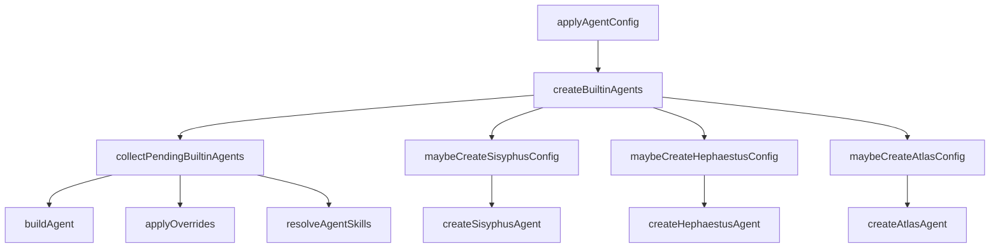

# OpenCode Config Shared MCP Agents

## 개요

`packages/omo-opencode/src/agents/` 모듈은 OpenCode 플러그인이 노출하는 내장 에이전트 구성을 생성하고, 모델 선택, 카테고리 기본값, 사용자 override, skill 주입, 동적 프롬프트 섹션을 하나의 `AgentConfig`로 조립합니다.

이 모듈의 핵심 진입점은 `createBuiltinAgents()`입니다. OpenCode config handler는 이 함수를 호출해 `sisyphus`, `hephaestus`, `atlas`, `explore`, `oracle`, `librarian`, `metis`, `momus`, `multimodal-looker` 같은 내장 에이전트 목록을 구성합니다.

## 전체 흐름



`createBuiltinAgents()`는 일반 에이전트를 먼저 수집하되 바로 반환하지 않습니다. `sisyphus`와 `hephaestus`는 다른 에이전트 목록을 프롬프트에 포함해야 하므로 먼저 `availableAgents`를 만든 뒤, 두 primary 에이전트를 구성하고, 이후 pending 에이전트를 결과에 추가합니다. `atlas`도 orchestration context가 필요하므로 마지막에 별도로 생성합니다.

## 에이전트 소스와 기본 빌드

`agent-builder.ts`는 에이전트 소스를 두 형태로 다룹니다.

```ts
export type AgentSource = AgentFactory | AgentConfig
```

`isFactory()`는 source가 함수인지 확인하고, `buildAgent()`는 source를 실제 `AgentConfig`로 변환합니다.

```ts
const base = isFactory(source) ? source(model) : { ...source }
```

에이전트에 `category`가 있으면 `mergeCategories()`로 합쳐진 카테고리 설정에서 `model`, `temperature`, `variant`를 기본값으로 적용합니다. 단, 이미 `base.model`이나 `base.temperature`가 있으면 category 값으로 덮지 않습니다. factory 기반 에이전트이고 `mode`가 아직 없으면 `source.mode`를 `base.mode`에 복사합니다.

## 내장 에이전트 등록

`builtin-agents.ts`의 `agentSources`는 내장 에이전트 이름을 factory 또는 config source에 매핑합니다.

```ts
const agentSources: Record<BuiltinAgentName, AgentSource> = {
  sisyphus: createSisyphusAgent,
  hephaestus: createHephaestusAgent,
  oracle: createOracleAgent,
  librarian: createLibrarianAgent,
  explore: createExploreAgent,
  "multimodal-looker": createMultimodalLookerAgent,
  metis: createMetisAgent,
  momus: createMomusAgent,
  atlas: createAtlasAgent as AgentFactory,
  "sisyphus-junior": createSisyphusJuniorAgentWithOverrides as AgentFactory,
}
```

`createBuiltinAgents()`는 다음 입력을 조합합니다.

- `disabledAgents`: 비활성화할 에이전트 이름
- `agentOverrides`: 사용자 config의 에이전트별 override
- `systemDefaultModel`, `uiSelectedModel`: 모델 선택 후보
- `categories`: 사용자 category 설정
- `discoveredSkills`: skill loader가 발견한 skill 목록
- `disabledSkills`, `teamModeEnabled`, `browserProvider`: skill 노출 조건
- `directory`, `disableOmoEnv`: 프롬프트에 환경 컨텍스트를 붙일지 결정

반환값은 OpenCode가 사용할 `Record<string, AgentConfig>`입니다.

## 모델 해석

`builtin-agents/model-resolution.ts`는 모델 선택을 `resolveModelPipeline()`에 위임합니다.

```ts
applyModelResolution({
  uiSelectedModel,
  userModel,
  requirement,
  availableModels,
  systemDefaultModel,
})
```

fallback이 필요한 경우 `getFirstFallbackModel()`이 `requirement.fallbackChain[0]`의 첫 provider와 model을 사용해 `"provider/model"` 형식의 모델 ID를 만듭니다. provider별 모델 ID 변환은 `transformModelForProvider()`가 담당합니다.

`collectPendingBuiltinAgents()`는 일반 에이전트에 대해 다음 순서로 모델을 정합니다.

1. primary 에이전트이고 override model이 없으면 `uiSelectedModel` 사용 가능
2. 사용자 override의 `model`
3. `AGENT_MODEL_REQUIREMENTS`의 fallback chain
4. override model이 있지만 resolution이 실패한 경우, 사용자 지정 model을 그대로 사용
5. 그래도 없으면 에이전트 등록을 건너뜀

`maybeCreateSisyphusConfig()`, `maybeCreateHephaestusConfig()`, `maybeCreateAtlasConfig()`도 같은 resolution 경로를 사용하지만, 각 에이전트의 제약을 별도로 적용합니다.

## 사용자 override와 category 적용

`builtin-agents/agent-overrides.ts`는 config override를 적용하는 중심 모듈입니다.

`applyCategoryOverride()`는 override에 `category`가 있을 때 category 설정을 강하게 적용합니다. factory 기본값보다 사용자 category 선택이 우선하므로 `model`, `variant`, `temperature`, `reasoningEffort`, `textVerbosity`, `thinking`, `top_p`, `maxTokens`를 덮어씁니다.

```ts
if (categoryConfig.model) result.model = categoryConfig.model
if (categoryConfig.temperature !== undefined) result.temperature = categoryConfig.temperature
```

`mergeAgentConfig()`는 `migrateAgentConfig()`로 legacy permission/config 형태를 정규화한 뒤 `deepMerge()`로 base config와 override를 합칩니다. `prompt` 또는 `prompt_append`가 `file://`이면 `resolvePromptAppend()`로 파일 내용을 읽어 프롬프트에 붙입니다.

`applyOverrides()`는 항상 다음 순서를 따릅니다.

1. override의 `category`가 있으면 `applyCategoryOverride()`
2. override 전체를 `mergeAgentConfig()`로 병합

이 순서 때문에 category는 factory 기본값을 덮지만, 직접 override한 필드는 category보다 나중에 적용됩니다.

## `file://` 프롬프트 해석

`builtin-agents/resolve-file-uri.ts`의 `resolvePromptAppend()`는 `prompt_append` 또는 `prompt`에서 `file://` URI를 지원합니다.

허용되는 위치는 다음으로 제한됩니다.

- 현재 project root 내부
- `~/.config/opencode`
- `~/.config/oh-my-openagent`
- `~/.omo`
- `~/.opencode`

경로가 허용 범위 밖이면 파일을 읽지 않고 warning 문자열을 반환합니다. 잘못된 percent encoding, 없는 파일, 읽기 실패도 exception 대신 warning 문자열로 변환합니다. 이 설계는 config 로딩 중 에이전트 생성이 전체 플러그인 초기화를 깨지 않도록 하기 위한 방어선입니다.

## skill 해석과 프롬프트 주입

`agent-skill-resolution.ts`의 `resolveAgentSkills()`는 `AgentConfig`에 선언된 `skills` 배열을 실제 prompt prefix로 변환합니다.

```ts
const { skills, ...configWithoutSkills } = config as AgentConfigWithSkills
```

`skills`가 없으면 `skills` 필드를 제거한 config를 그대로 반환합니다. skill이 있으면 `resolveMultipleSkills()`를 호출하고, resolve된 skill 본문을 `\n\n`으로 합쳐 기존 prompt 앞에 붙입니다.

```ts
prompt: skillContent + (configWithoutSkills.prompt ? "\n\n" + configWithoutSkills.prompt : "")
```

즉, agent factory나 override는 `skills: ["..."]`를 선언할 수 있지만 최종 OpenCode `AgentConfig`에는 `skills` 필드가 남지 않고, prompt에 skill 지침이 prepend됩니다.

## 사용 가능한 skill 목록 구성

`builtin-agents/available-skills.ts`의 `buildAvailableSkills()`는 Sisyphus, Hephaestus, Atlas 프롬프트에 보여줄 skill 목록을 만듭니다.

구성 요소는 두 종류입니다.

- `createBuiltinSkills()`가 만든 plugin 내장 skill
- `discoveredSkills`로 들어온 user/project/shared skill

주요 규칙은 다음과 같습니다.

- `disabledSkills`에 걸리는 skill은 제외
- shared skill alias와 충돌하는 user/project skill은 제외
- skill definition에 `agent` 제한이 있고 현재 `agentName`과 다르면 제외
- 같은 이름이 있으면 나중에 `Map`에 들어가는 discovered skill이 builtin skill을 덮음

`mapScopeToLocation()`은 skill scope를 prompt 표시용 location으로 바꿉니다.

```ts
user | opencode -> "user"
project | opencode-project -> "project"
그 외 -> "plugin"
```

## 동적 프롬프트 섹션

`dynamic-agent-prompt-builder.ts`는 Sisyphus, Hephaestus, Atlas 프롬프트가 공유하는 섹션 builder를 re-export합니다.

주요 섹션은 다음과 같습니다.

- `buildAgentIdentitySection()`: OpenCode 기본 identity보다 에이전트 identity가 우선하도록 `<agent-identity>` 블록 생성
- `buildKeyTriggersSection()`: `AgentPromptMetadata.keyTrigger`를 모아 delegation trigger로 표시
- `buildToolSelectionTable()`: `grep`, `glob`, `lsp_*`와 agent cost를 함께 보여줌
- `buildExploreSection()`, `buildLibrarianSection()`: explore/librarian 사용 기준 생성
- `buildDelegationTable()`: metadata trigger를 기반으로 에이전트 선택 표 생성
- `buildCategorySkillsDelegationGuide()`: category와 skill을 함께 선택하는 delegation 지침 생성
- `buildHardBlocksSection()`, `buildAntiPatternsSection()`: 금지 패턴과 hard block 생성

`categorizeTools()`는 tool 이름을 `lsp`, `search`, `session`, `command`, `other`로 단순 분류합니다. `getToolsPromptDisplay()`는 프롬프트에 표시할 때 `grep`, `glob`, `lsp_*`처럼 압축된 형태로 보여줍니다.

## Atlas 구성

`atlas/agent.ts`는 orchestration 전용 primary agent인 Atlas를 만듭니다.

`getAtlasPromptSource()`는 `resolveVariant()`와 `atlasPromptVariants`를 사용해 모델별 prompt variant를 고릅니다.

지원 variant는 다음입니다.

- `default`
- `gpt`
- `gemini`
- `kimi`
- `kimi-k2-7`
- `opus-4-7`

알 수 없는 variant가 나오면 `AtlasPromptVariantError`를 던집니다.

`createAtlasAgent()`는 `OrchestratorContext`를 받아 `availableAgents`, `availableSkills`, `userCategories`를 prompt에 주입합니다. 내부적으로 `buildDynamicOrchestratorPrompt()`가 category section, agent section, decision matrix, skills section, category+skills guide를 만들고 prompt placeholder에 주입합니다.

`maybeCreateAtlasConfig()`는 Atlas 전용 생성 래퍼입니다. 모델 resolution 후 `createAtlasAgent()`를 호출하고, resolved variant와 user override를 적용합니다.

## Hephaestus 구성

`hephaestus/agent.ts`는 GPT 계열 deep worker인 Hephaestus를 구성합니다.

`isHephaestusSupportedModel()`은 provider prefix를 제거한 모델 이름이 다음 패턴 중 하나인지 확인합니다.

- `gpt-5.3-codex`
- `gpt-5.4`
- `gpt-5.5`

`getHephaestusPromptSource()`는 모델에 따라 `gpt-5-5`, `gpt-5-4`, `gpt` 중 하나를 반환합니다. 지원하지 않는 모델이면 `UnsupportedHephaestusModelError`를 던집니다.

`createHephaestusAgent()`는 동적 프롬프트를 만들고 다음 permission을 설정합니다.

```ts
permission: {
  question: "allow",
  call_omo_agent: "deny",
  ...getFrontierToolSchemaPermission(model),
}
```

`maybeCreateHephaestusConfig()`는 provider 연결 여부, 모델 resolution, category override, user override, frontier tool schema permission을 모두 적용합니다. override나 category 적용 후에도 `isHephaestusSupportedModel()`을 다시 확인해 지원하지 않는 모델이면 등록을 건너뜁니다.

## Sisyphus 구성

`builtin-agents/sisyphus-agent.ts`의 `maybeCreateSisyphusConfig()`는 Sisyphus primary agent를 생성합니다.

Sisyphus는 `AGENT_MODEL_REQUIREMENTS["sisyphus"]`의 fallback chain 중 하나라도 사용 가능해야 합니다. 단, 사용자 override가 있거나 첫 실행이라 모델 cache가 비어 있으면 완화됩니다.

생성 흐름은 다음과 같습니다.

1. disabled 여부와 모델 요구조건 확인
2. `applyModelResolution()`으로 모델 결정
3. 첫 실행 cache 없음 상태면 `getFirstFallbackModel()` 사용 가능
4. `createSisyphusAgent()` 호출
5. resolved variant 적용
6. `applyOverrides()` 적용
7. `applyFrontierToolSchemaPermission()` 적용
8. `applyEnvironmentContext()`로 `<omo-env>` 추가

## 일반 에이전트 수집

`builtin-agents/general-agents.ts`의 `collectPendingBuiltinAgents()`는 Sisyphus, Hephaestus, Atlas, Sisyphus Junior를 제외한 일반 에이전트를 처리합니다.

이 함수는 두 결과를 반환합니다.

```ts
{
  pendingAgentConfigs: Map<string, AgentConfig>
  availableAgents: AvailableAgent[]
}
```

`pendingAgentConfigs`는 최종 등록될 config이고, `availableAgents`는 Sisyphus/Hephaestus/Atlas 프롬프트에 포함될 delegation 후보 목록입니다.

각 에이전트 처리 순서는 다음과 같습니다.

1. disabled agent 제외
2. agent override 조회
3. `AGENT_MODEL_REQUIREMENTS` 확인
4. `applyModelResolution()` 또는 fallback 적용
5. `buildAgent()`로 기본 config 생성
6. resolved variant 적용
7. librarian이면 `applyEnvironmentContext()` 적용
8. `applyOverrides()` 적용
9. `resolveAgentSkills()` 적용
10. metadata가 있으면 `availableAgents`에 추가

## 환경 컨텍스트

`env-context.ts`의 `createEnvContext()`는 OpenCode 기본 system prompt에 없는 OmO 전용 환경 정보만 생성합니다.

```xml
<omo-env>
  Timezone: ...
  Locale: ...
</omo-env>
```

`applyEnvironmentContext()`는 `disableOmoEnv`가 아니고 `directory`와 `config.prompt`가 있을 때만 이 블록을 prompt 뒤에 붙입니다. 현재 코드에서는 Sisyphus, Hephaestus, Librarian 경로에서 사용됩니다.

## frontier 모델의 tool schema guard

`frontier-tool-schema-guard.ts`는 특정 frontier 모델에서 `grep`, `glob` tool schema를 제한합니다.

`getFrontierToolSchemaPermission()`은 `isClaudeOpus47OrLaterModel()` 또는 `isGpt5_5Model()`이 true이면 다음 permission을 반환합니다.

```ts
{ grep: "deny", glob: "deny" }
```

`applyFrontierToolSchemaPermission()`은 모델이 frontier 조건에 맞으면 `grep`, `glob` deny를 강제로 병합합니다. frontier 조건이 아니면 기존 permission에서 불필요한 deny를 제거하되, 사용자가 명시적으로 deny했거나 `tools`에서 false로 지정한 경우는 보존합니다.

## Explore 에이전트

`explore.ts`의 `createExploreAgent()`는 read-only codebase search 전용 subagent를 만듭니다.

권한은 `createAgentToolRestrictions()`로 제한됩니다. write/edit/apply_patch/task/call_omo_agent는 막고, LSP 조회 도구는 허용합니다.

Explore prompt는 다음 출력 구조를 강제합니다.

- `<analysis>`: literal request, actual need, success criteria
- `<results>`:
  - `<files>`: 절대 경로와 관련성
  - `<answer>`: 직접 답변
  - `<next_steps>`: 호출자가 이어서 할 수 있는 일

이 에이전트는 `EXPLORE_PROMPT_METADATA`를 통해 Sisyphus/Hephaestus의 delegation table에 노출됩니다.

## 플러그인 초기화와의 연결

이 모듈은 OpenCode plugin 초기화 중 config phase에 연결됩니다. call graph 기준으로 `src/plugin-handlers/agent-config-handler.ts`의 `applyAgentConfig()`가 `createBuiltinAgents()`를 호출합니다.

중요한 제약은 `createBuiltinAgents()` 내부 주석에 명시되어 있습니다.

```ts
// IMPORTANT: Do NOT call OpenCode client APIs during plugin initialization.
```

config handler에서 OpenCode client API를 호출하면 deadlock이 발생할 수 있으므로, 사용 가능한 모델은 `fetchAvailableModels()`와 provider cache (`readConnectedProvidersCache()`, `readProviderModelsCache()`)를 통해 계산합니다.

## 테스트 관점

이 모듈은 여러 단위 테스트에서 직접 호출됩니다.

- `agent-builder.test.ts`: `buildAgent()`
- `utils.test.ts`: `resolveAgentSkills()`
- `available-skills.test.ts`: `buildAvailableSkills()`
- `agent-identity.test.ts`: `buildAgentIdentitySection()`, `mergeAgentConfig()`
- `env-context.test.ts`: `createEnvContext()`
- `hephaestus/agent.test.ts`: `getHephaestusPromptSource()`, `getHephaestusPrompt()`, `maybeCreateHephaestusConfig()`
- `atlas/prompt-routing.test.ts`: `getAtlasPromptSource()`
- `atlas/prompt-runtime-injection.test.ts`: `createAtlasAgent()`
- `custom-agent-orchestrator-visibility.test.ts`: `createBuiltinAgents()`
- `tool-restrictions.test.ts`: `createExploreAgent()`, `createAtlasAgent()`

변경 시에는 단순히 config 객체 snapshot만 볼 것이 아니라, 최종 prompt에 category, skill, agent metadata, environment context가 의도한 순서로 합쳐지는지 확인해야 합니다.

## 기여 시 주의할 점

새 에이전트를 추가할 때는 factory만 만드는 것으로 끝나지 않습니다. 최소한 다음 연결 지점을 확인해야 합니다.

1. `agentSources`에 factory 등록
2. 필요하면 `agentMetadata`에 `AgentPromptMetadata` 등록
3. `AGENT_MODEL_REQUIREMENTS`에 모델 요구조건 추가 여부 확인
4. primary agent라면 `collectPendingBuiltinAgents()`에서 특별 처리 대상인지 검토
5. skill 노출이 필요하면 `buildAvailableSkills()`의 `agentName` 제한과 충돌하지 않는지 확인
6. override/category 적용 순서가 의도와 맞는지 확인
7. frontier 모델이면 `applyFrontierToolSchemaPermission()` 영향 확인

프롬프트 builder를 수정할 때는 “문구 변경”처럼 보여도 실제로는 Sisyphus, Hephaestus, Atlas의 delegation 행동을 바꾸는 런타임 변경입니다. 특히 `buildCategorySkillsDelegationGuide()`, `buildToolSelectionTable()`, `buildDelegationTable()`은 에이전트가 어떤 도구와 하위 에이전트를 선택하는지에 직접 영향을 줍니다.