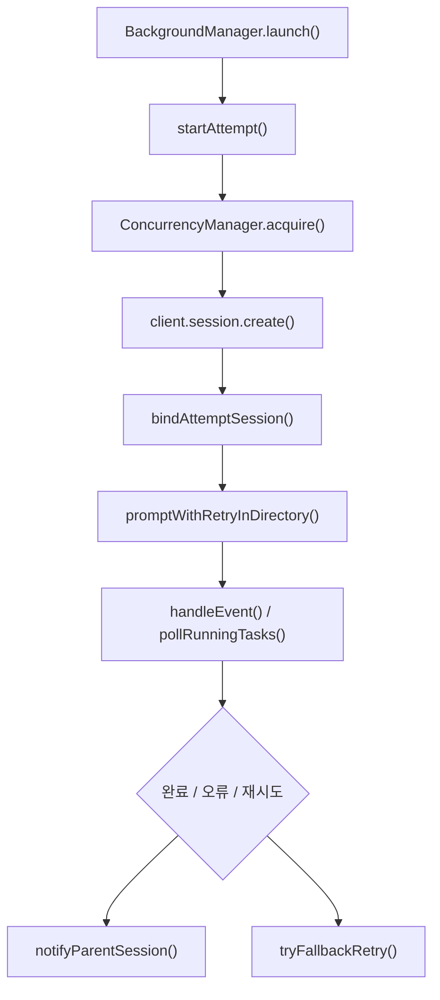

# OpenCode Features

## 개요

`packages/omo-opencode/src/features/background-agent/`는 OpenCode 세션에서 하위 에이전트 작업을 백그라운드로 실행하고, 부모 세션에 결과를 다시 깨우는 기능을 담당합니다. 핵심 진입점은 `BackgroundManager`이며, 작업 생성, 세션 생성, 비동기 프롬프트 발송, 이벤트 추적, 재시도, 취소, 정리까지 한 작업의 전체 생명주기를 관리합니다.

이 모듈은 단순한 큐가 아니라 OpenCode 세션 모델 위에 얹힌 하위 작업 런타임입니다. 작업은 `BackgroundTask`로 추적되고, 각 실행 시도는 `BackgroundTaskAttempt`로 분리됩니다. 모델 fallback, compaction 이후 컨텍스트 복원, 부모 세션 wake, tmux 연동, task toast, circuit breaker가 모두 이 생명주기에 연결됩니다.

## 실행 흐름

일반적인 시작 경로는 다음과 같습니다.

1. `BackgroundManager.launch(input)`이 `LaunchInput`을 받아 `BackgroundTask`를 생성합니다.
2. `startAttempt(task, input.model)`이 첫 번째 `BackgroundTaskAttempt`를 만들고 `task.currentAttemptID`를 설정합니다.
3. 작업은 모델 또는 에이전트 기준의 큐(`queuesByKey`)에 들어갑니다.
4. `processKey(key)`가 `ConcurrencyManager.acquire()`로 실행 슬롯을 확보합니다.
5. `startTask(item)`이 `client.session.create()`로 하위 OpenCode 세션을 만듭니다.
6. `bindAttemptSession()`이 현재 attempt와 생성된 `sessionID`를 연결합니다.
7. `registerDelegatedChildSessionBootstrap()`과 `setSessionTools()`로 하위 세션 부트스트랩 정보와 도구 제한을 기록합니다.
8. `promptWithRetryInDirectory()`가 내부 에이전트 프롬프트를 fire-and-forget 방식으로 발송합니다.
9. 이후 상태 변화는 `handleEvent()`와 polling 경로에서 추적됩니다.

## 핵심 클래스: `BackgroundManager`

`BackgroundManager`는 모듈의 중심 상태 관리자입니다. 생성자는 `BackgroundManagerConfig`를 받아 OpenCode `client`, 작업 설정, tmux 설정, fallback controller, shutdown hook 등을 연결합니다.

주요 내부 상태는 다음과 같습니다.

- `tasks`: 현재 추적 중인 `BackgroundTask` 맵
- `tasksByParentSession`: 부모 세션별 작업 인덱스
- `queuesByKey`: concurrency key별 대기 큐
- `processingKeys`: 같은 key에 대한 중복 처리 방지 집합
- `completionTimers`, `idleDeferralTimers`: 완료 및 idle 판정 지연 타이머
- `completedTaskArchive`: 완료된 작업의 제한 크기 아카이브
- `pendingByParent`, `notifications`, `pendingNotifications`: 부모 세션 알림 배치 상태
- `parentWakeNotifier`: 부모 세션 wake 디스패치와 재큐잉 담당
- `rootDescendantCounts`, `preStartDescendantReservations`: 하위 에이전트 깊이와 예약 추적

### 작업 시작

`launch()`는 에이전트 이름을 정리한 뒤 `reserveSubagentSpawn()`으로 하위 세션 생성 가능 여부를 검사합니다. 이 검사는 `assertCanSpawn()`을 통해 `resolveSubagentSpawnContext()`와 `getMaxSubagentDepth()`를 사용하며, 깊이 제한을 넘으면 `createSubagentDepthLimitError()`를 던집니다.

작업이 생성되면 즉시 `pending` 상태로 등록됩니다. 실제 세션 생성은 큐 처리자인 `processKey()`와 `startTask()`에서 수행됩니다. 이 분리는 작업 생성 API가 빠르게 반환되면서도 concurrency 제한과 모델별 큐잉을 보장하기 위한 구조입니다.

### 세션 생성과 프롬프트 발송

`startTask()`는 부모 세션의 디렉터리를 확인한 뒤 `client.session.create()`로 하위 세션을 생성합니다. 생성된 세션에는 다음 설정이 연결됩니다.

- `setSessionAgent(sessionID, input.agent)`
- `setSessionTools(sessionID, launchTools)`
- `applySessionPromptParams(sessionID, input.model)`
- `registerDelegatedChildSessionBootstrap({ sessionID, promptText, fallbackChain, category, system, tools, modelFallbackControllerAccessor })`

하위 세션에서 허용되는 도구는 `getAgentToolRestrictions()` 결과와 사용자 permission deny 목록을 합쳐 구성합니다. 기본적으로 `task`와 `question`은 꺼지고, `call_omo_agent`는 켜집니다.

프롬프트 본문은 `createInternalAgentTextPart(input.prompt)`로 내부 initiator marker가 들어간 text part를 만들고, `promptWithRetryInDirectory()`로 비동기 발송됩니다. 이 호출은 응답 본문을 기다리지 않으며, 실패는 `.catch()`에서 별도 처리됩니다.

### 이벤트 처리

`handleEvent(event)`는 OpenCode 이벤트를 받아 작업 상태를 갱신합니다. 주요 이벤트는 다음과 같습니다.

- `message.updated`: 부모 wake 출력 감지, assistant error 기반 fallback retry
- `message.part.updated`, `message.part.delta`: 출력 활동, 도구 호출 수, 반복 도구 사용 감지
- `todo.updated`: 세션의 미완료 todo 존재 여부 캐시
- `session.idle`: idle 상태에서 완료 가능성 검사
- `session.error`: retry 가능한 오류 또는 terminal error 처리
- `session.deleted`: 직접 작업과 descendant 작업 취소 및 세션 상태 정리
- `session.status`: `idle`은 `session.idle`로 위임하고, `retry`는 fallback 경로로 연결

`SESSION_NEXT_EVENT_PREFIX`로 시작하는 이벤트는 `message.part.updated` 형태로 정규화해서 동일한 처리 경로를 사용합니다.

## attempt 생명주기

`attempt-lifecycle.ts`는 `BackgroundTask`와 `BackgroundTaskAttempt` 사이의 상태 동기화를 담당합니다.

주요 함수는 다음과 같습니다.

- `startAttempt(task, model)`: 새 attempt를 만들고 task를 `pending`으로 초기화합니다.
- `ensureCurrentAttempt(task, model)`: 현재 attempt가 없을 때 기존 task 상태에서 attempt를 보강합니다.
- `bindAttemptSession(task, attemptID, sessionID, model)`: 실행 중인 attempt에 OpenCode 세션 ID를 연결하고 `running`으로 전환합니다.
- `finalizeAttempt(task, attemptID, status, error)`: attempt를 terminal 상태로 마감합니다.
- `scheduleRetryAttempt(task, failedAttemptID, nextModel, error)`: 실패한 attempt를 `error`로 마감하고 다음 모델로 새 attempt를 시작합니다.
- `projectTaskFromCurrentAttempt(task)`: 현재 attempt 상태를 task 최상위 필드에 반영합니다.
- `findAttemptBySession(task, sessionID)`: session ID로 attempt를 찾습니다.

terminal attempt 상태는 `completed`, `error`, `cancelled`, `interrupt`입니다. `BackgroundManager`는 stale attempt에서 온 오류를 무시하기 위해 `resolveTaskAttemptBySession()`에서 `isCurrent`를 함께 계산합니다.

## concurrency 제어

`ConcurrencyManager`는 모델 또는 provider 단위 동시 실행 제한을 관리합니다. 설정 우선순위는 다음과 같습니다.

1. `config.modelConcurrency[model]`
2. `config.providerConcurrency[provider]`
3. `config.defaultConcurrency`
4. 기본값 `5`

`0`은 제한 없음으로 해석되어 `Infinity`를 반환합니다.

`acquire(model, taskId)`는 슬롯이 있으면 즉시 반환하고, 없으면 `QueueEntry`를 큐에 넣습니다. `release(model)`는 대기자가 있으면 슬롯을 handoff하고, 없으면 count를 감소시킵니다. `cancelWaiter(model, taskId)`와 `cancelWaiters(model)`는 취소 또는 shutdown 중 큐에 남은 promise를 reject합니다.

중요한 구현 패턴은 `QueueEntry.settled` 플래그입니다. 이 플래그는 `release()`와 `cancelWaiters()`가 같은 waiter를 중복 resolve/reject하지 않도록 막습니다.

## fallback retry

`fallback-retry-handler.ts`의 `tryFallbackRetry()`는 retry 가능한 오류를 다음 fallback 모델로 재큐잉합니다. retry 여부는 `shouldRetryError(errorInfo)`, `task.fallbackChain`, `hasMoreFallbacks()`로 결정됩니다.

fallback 선택 과정은 다음 순서를 따릅니다.

1. provider/model 캐시에서 연결된 provider 목록을 읽습니다.
2. 연결되지 않은 fallback entry는 건너뜁니다.
3. `selectFallbackProvider()`로 provider를 고릅니다.
4. `transformModelForProvider()`로 provider별 model ID를 변환합니다.
5. 현재 모델과 같은 no-op fallback은 건너뜁니다.
6. 기존 concurrency slot과 idle deferral timer를 해제합니다.
7. `scheduleRetryAttempt()`로 새 attempt를 만들고 retry notification 정보를 기록합니다.
8. 이전 세션이 있으면 `abortWithTimeout()`으로 중단을 시도합니다.
9. 새 `QueueItem`을 큐에 넣고 `processKey()`를 다시 호출합니다.

Team mode 작업에서는 `teamRunId`가 있는데 `onSessionCreated`가 없으면 `TeamModeFallbackError`를 던집니다. fallback 세션이 원래 팀 멤버 슬롯에 등록되지 않으면 이후 team tool 호출이 “not in team” 상태가 되기 때문입니다.

## 부모 세션 wake와 알림

백그라운드 작업은 완료 시 부모 세션에 system reminder 형태의 wake prompt를 보냅니다. 알림 본문은 `buildBackgroundTaskNotificationText()`가 생성합니다.

단일 작업 완료 시에는 다음 정보를 포함합니다.

- 작업 ID
- 설명
- duration
- 오류 정보
- 남은 작업 수
- `background_output(task_id="<id>")` 안내

모든 작업이 완료되면 성공 작업과 실패 작업을 나누어 요약합니다. 여러 attempt가 있는 작업은 `formatAttemptTimeline()`을 통해 attempt number, status, model, session ID, error를 함께 보여줍니다.

부모 wake는 즉시 발송되지 않을 수 있습니다. `ParentWakeNotifier`는 다음 상황을 고려합니다.

- 부모 세션에 이미 사용자 메시지가 진행 중인 경우
- 부모 세션 활동이 최근에 있었던 경우
- wake prompt가 발송됐지만 빈 assistant turn으로 끝난 경우
- 같은 출처의 wake가 중복될 가능성이 있는 경우
- text delta가 내부 wake prompt 자체를 반영하는 중인 경우

`BackgroundManager.hasPendingParentWake(sessionID)`는 queued, scheduled, in-flight, dispatched wake뿐 아니라 notification preparation 상태까지 확인합니다. 이는 “하위 작업은 terminal이 되었지만 부모 wake는 아직 큐에 들어가기 전”의 짧은 구간을 놓치지 않기 위한 방어입니다.

## compaction-aware 컨텍스트 복원

`compaction-aware-message-resolver.ts`는 부모 wake나 retry prompt를 보낼 때 사용할 agent/model/tools 컨텍스트를 세션 메시지에서 복원합니다.

핵심 함수는 두 가지입니다.

- `resolvePromptContextFromSessionMessages(messages, sessionID)`
- `findNearestMessageExcludingCompaction(messageDir, sessionID)`

두 함수 모두 compaction 메시지와 compaction agent를 제외합니다. `mergeStoredMessages()`는 최신 메시지부터 agent, model, tools를 채우고, 부족하면 `getCompactionAgentConfigCheckpoint(sessionID)`를 fallback으로 사용합니다.

이 구조 덕분에 compaction 이후에도 부모 세션 wake가 원래 agent/model/tools 문맥을 잃지 않습니다.

## circuit breaker와 반복 도구 감지

`loop-detector.ts`는 하위 에이전트가 같은 도구를 반복 호출하거나 도구 호출 수가 과도하게 늘어나는 상황을 차단합니다.

`resolveCircuitBreakerSettings(config)`는 다음 값을 계산합니다.

- `enabled`
- `maxToolCalls`
- `consecutiveThreshold`

`recordToolCall(window, toolName, settings, toolInput)`은 도구 이름과 입력을 정규화해 signature를 만듭니다. 입력 객체는 `sortObject()`로 key 순서를 정렬한 뒤 JSON 문자열로 비교하므로, 같은 의미의 객체 입력이 안정적으로 같은 signature를 갖습니다.

`detectRepetitiveToolUse(window)`가 threshold 이상 반복을 감지하면 `BackgroundManager.handleEvent()`는 `cancelTask()`를 호출해 작업을 자동 취소합니다. 전체 도구 호출 수가 `maxToolCalls` 이상이어도 같은 방식으로 취소됩니다.

## 오류 처리

`error-classifier.ts`는 다양한 OpenCode/SDK 오류 형태에서 안정적으로 정보를 추출합니다.

- `getErrorText(error)`: 문자열, `Error`, `{ message }`, `{ name }`에서 표시용 텍스트를 만듭니다.
- `isAbortedSessionError(error)`: 오류 텍스트에 `aborted`가 포함되는지 확인합니다.
- `extractErrorName(error)`: `name` 값을 추출합니다.
- `extractErrorMessage(error)`: `data`, `data.error`, `error`, `cause`, 자기 자신 순서로 message를 찾습니다.
- `extractErrorStatusCode(error)`: `statusCode`, `status`, `code`, `response.status`에서 HTTP 상태 코드를 찾습니다.
- `getSessionErrorMessage(properties)`: `session.error` 이벤트의 중첩된 error payload에서 message 또는 type을 추출합니다.

`BackgroundManager`는 이 결과를 fallback retry 판단, terminal error 메시지, session still alive 검사에 사용합니다.

## 취소와 정리

`abort-with-timeout.ts`의 `abortWithTimeout(client, sessionID, timeoutMs)`는 `client.session.abort()`를 timeout과 경쟁시킵니다. abort 응답에 `error`가 있거나 호출이 reject되면 false를 반환하고 로그를 남깁니다. timeout이 발생해도 cleanup 흐름은 계속 진행됩니다.

`BackgroundManager` 내부에서는 `abortSessionWithLogging()`이 이 함수를 감싸고, 다음 상황에서 호출됩니다.

- 작업 취소
- startTask 실패 후 orphan session 정리
- launch prompt 실패
- resume prompt 실패
- stale attempt binding
- pre-start 또는 launch setup 중 취소

정리 과정에서는 보통 다음 작업도 함께 수행됩니다.

- `clearDelegatedChildSessionBootstrap(sessionID)`
- `clearSessionAgent(sessionID)`
- `subagentSessions.delete(sessionID)`
- `SessionCategoryRegistry.remove(sessionID)`
- concurrency slot release
- idle/completion timer clear
- task toast 제거
- 부모 notification 예약

## task toast, tmux, team mode 연결

이 모듈은 다른 feature와 강하게 연결됩니다.

`task-toast-manager`는 작업 시작, 실행, 제거 상태를 사용자에게 보여줍니다. `launch()`는 `getTaskToastManager().addTask()`를 호출하고, `startTask()`는 running 상태로 갱신합니다. 취소나 오류 경로에서는 `removeTaskToastTracking()` 또는 toast manager 제거가 호출됩니다.

`tmux-subagent` 연결은 `onSubagentSessionCreated` 콜백으로 이루어집니다. `startTask()`는 `tmuxConfig.enabled`, `isInsideTmux()`, `suppressTmuxSpawn` 조건을 확인한 뒤 하위 세션용 tmux pane 생성을 fire-and-forget으로 요청합니다.

team mode에서는 `teamRunId`와 `onSessionCreated`가 중요합니다. fallback retry가 새 세션을 만들 때도 팀 세션 registry에 같은 멤버로 등록되어야 하므로, `tryFallbackRetry()`는 team 작업에서 callback이 없으면 명시적으로 실패시킵니다.

## 완료 판정

작업 완료는 단순히 `session.idle` 이벤트 하나로 결정하지 않습니다. `BackgroundManager`는 다음 신호들을 함께 봅니다.

- 세션 출력이 관측되었는지
- 미완료 todo가 남아 있는지
- idle 상태가 충분히 안정적인지
- 세션이 여전히 존재하는지
- session status가 terminal인지
- stale timeout 또는 session gone timeout에 걸렸는지
- fallback retry 가능한 오류인지

`isEmptyNoProgressAssistantTurnInfo()`는 assistant turn이 `finish === "unknown"`이고 input/output/reasoning/cache token count가 모두 0인 경우를 “진행 없음”으로 판정합니다. 부모 wake 직후 이런 빈 assistant turn이 나오면 `ParentWakeNotifier.requeueDispatchedParentWakeAfterEmptyAssistantTurn()` 경로로 wake를 다시 큐잉합니다.

## 기여 시 주의점

이 모듈을 수정할 때는 task 최상위 상태와 current attempt 상태를 함께 생각해야 합니다. 새 terminal 경로를 추가한다면 `finalizeAttempt()`를 사용해 attempt를 닫고, current attempt일 때 `projectTaskFromCurrentAttempt()`가 반영되도록 유지해야 합니다.

concurrency slot은 모든 실패, 취소, retry, skipped resume 경로에서 반드시 release되어야 합니다. 특히 `task.concurrencyKey`가 설정된 뒤 오류가 나면 해당 key를 기준으로 release하고 `task.concurrencyKey = undefined`로 되돌리는 패턴을 따라야 합니다.

부모 wake는 terminal 상태 전환과 비동기 notification 발송 사이에 race가 생기기 쉽습니다. 상태를 먼저 terminal로 바꾸고 await 작업을 수행하는 경로에서는 `reserveNotificationPreparation()` 같은 보호 장치가 필요한지 확인해야 합니다.

fallback retry를 변경할 때는 stale session 이벤트를 반드시 고려해야 합니다. 이전 attempt의 session에서 늦게 도착한 `message.updated`, `session.error`, `message.part.updated`가 현재 attempt를 오염시키지 않도록 `resolveTaskAttemptBySession()`의 `isCurrent` 검사를 유지해야 합니다.

compaction 관련 코드를 수정할 때는 compaction agent와 compaction message가 부모 wake 문맥으로 들어가지 않도록 `isCompactionAgent()`, `isCompactionMessage()`, `hasCompactionPartInStorage()` 필터를 유지해야 합니다.