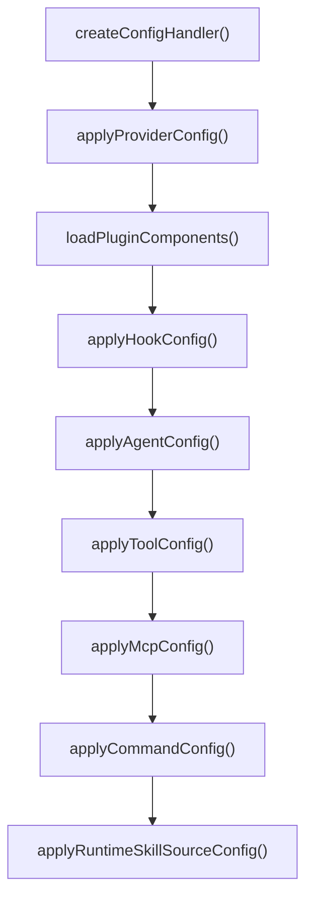

# OpenCode Plugin Handlers

ULTRAWORK MODE ENABLED!

## 모듈 개요

`packages/omo-opencode/src/plugin-handlers`는 OpenCode의 `config` 훅에서 실행되는 설정 조립 계층입니다. 이 모듈은 사용자의 OpenCode 설정 객체를 직접 수정하여 provider, agent, tool, MCP, command, hook, plugin component 설정을 하나의 런타임 설정으로 합칩니다.

중심 진입점은 `createConfigHandler()`입니다. 이 함수가 반환하는 async handler는 OpenCode가 넘긴 `config: Record<string, unknown>`을 받아 순서대로 설정을 보강합니다. 각 하위 handler는 독립된 관심사를 맡지만, 순서 의존성이 있습니다. 예를 들어 `applyAgentConfig()`가 만든 agent 결과를 `applyToolConfig()`가 권한 조정에 사용하고, `loadPluginComponents()` 결과는 hook, agent, MCP, command 설정에 모두 재사용됩니다.



## 설정 처리 흐름

`createConfigHandler()`는 다음 순서로 OpenCode 설정을 구성합니다.

1. `setAdditionalAllowedMcpEnvVars()`로 `pluginConfig.mcp_env_allowlist`를 Claude Code MCP loader에 전달합니다.
2. `applyProviderConfig()`로 provider 모델 캐시, context limit 캐시, vision-capable 모델 캐시를 갱신합니다.
3. `clearFormatterCache()`를 호출하고, 기존 `config.formatter`를 보존합니다.
4. `loadPluginComponents()`로 Claude Code plugin에서 제공하는 commands, skills, agents, MCP servers, hook configs를 가져옵니다.
5. `applyHookConfig()`로 plugin hook config를 hook runtime 상태에 등록합니다.
6. `applyAgentConfig()`로 built-in agent, custom agent, OpenCode/Claude Code agent source를 병합합니다.
7. `applyToolConfig()`로 tool visibility와 agent permission을 조정합니다.
8. `applyMcpConfig()`로 built-in MCP, `.mcp.json`, user MCP, plugin MCP를 병합합니다.
9. `applyCommandConfig()`로 built-in command, skill command, user/project command, plugin command를 병합합니다.
10. `runtimeSkillSourceUrl`이 있으면 `applyRuntimeSkillSourceConfig()`를 적용합니다.
11. 보존했던 `config.formatter`를 되돌립니다.

`config.formatter`를 마지막에 복원하는 이유는 plugin 설정 처리 중 formatter 관련 변형이 발생하더라도 OpenCode 원본 formatter 설정을 유지하기 위해서입니다.

## Plugin Component 로딩

`loadPluginComponents()`는 Claude Code plugin loader인 `loadAllPluginComponents()`를 감싸는 안전 계층입니다. 반환 타입은 `PluginComponents`입니다.

```ts
export type PluginComponents = {
  commands: Record<string, unknown>;
  skills: Record<string, unknown>;
  agents: Record<string, unknown>;
  mcpServers: Record<string, unknown>;
  hooksConfigs: PluginHooksConfig[];
  plugins: Array<{ name: string; version: string }>;
  errors: Array<{ pluginKey: string; installPath: string; error: string }>;
};
```

`pluginConfig.claude_code?.plugins === false`이면 `EMPTY_PLUGIN_COMPONENTS`를 반환합니다. 로딩은 `pluginConfig.experimental?.plugin_load_timeout_ms ?? 10000` 제한을 갖고, timeout 또는 loader 오류가 발생하면 `addConfigLoadError({ path: "plugin-loading", error })`를 기록한 뒤 빈 component set으로 계속 진행합니다.

이 설계 때문에 plugin component 로딩 실패는 전체 OpenCode 설정 처리를 중단하지 않습니다. 대신 built-in 구성만으로 런타임을 계속 만들고, 오류는 config load error로 노출됩니다.

## Provider 설정

`applyProviderConfig()`는 `config.provider`를 읽어 모델 관련 런타임 캐시를 갱신합니다.

주요 동작은 다음과 같습니다.

- `modelCacheState.modelContextLimitsCache`를 비우고 provider별 `models[modelID].limit.context` 값을 다시 적재합니다.
- Anthropic provider header의 `anthropic-beta` 값에 `context-1m`이 포함되어 있으면 `modelCacheState.anthropicContext1MEnabled`를 `true`로 설정합니다.
- `supportsImageInput()`으로 모델의 image input 지원 여부를 판별합니다.
  - `modalities.input`에 `"image"`가 있으면 지원으로 봅니다.
  - 또는 `capabilities.input.image === true`이면 지원으로 봅니다.
- `setVisionCapableModelsCache()`로 shared vision-capable cache를 교체합니다.
- `trustedVisionCapableModels`에 들어온 `provider/model` 문자열은 `parseTrustedModel()`로 파싱해 캐시에 추가합니다.

`createConfigHandler()`는 `collectTrustedVisionCapableModels()`를 통해 `pluginConfig.agents?.["multimodal-looker"]?.model`이 `provider/model` 형식이면 trusted vision-capable model로 넘깁니다. 즉 provider metadata가 image input을 명시하지 않아도 multimodal-looker에 명시된 모델은 vision-capable cache에 들어갈 수 있습니다.

## Agent 설정 조립

Agent 설정의 공개 진입점은 `applyAgentConfig()`입니다. 이 함수는 다음 단계를 거칩니다.

1. `pluginConfig.disabled_agents`를 `AGENT_NAME_MAP`으로 migration합니다.
2. `discoverAgentSkills()`로 agent prompt 생성에 필요한 skill 목록을 수집합니다.
3. `loadAgentSources()`로 사용자, 프로젝트, OpenCode, plugin, config 기반 agent source를 읽습니다.
4. `createBuiltinAgents()`로 Sisyphus, Hephaestus, Atlas 등 built-in agent config를 만듭니다.
5. `assembleAgentConfig()`로 built-in agent와 custom source를 병합합니다.
6. `finalizeAgentConfig()`로 display name remap, priority order, session-state 등록을 수행합니다.

### Agent source

`loadAgentSources()`가 읽는 source는 `AgentSources`로 정리됩니다.

- `userAgents`: Claude Code user agents
- `projectAgents`: Claude Code project agents
- `opencodeGlobalAgents`: OpenCode global agents
- `opencodeProjectAgents`: OpenCode project agents
- `pluginAgents`: Claude Code plugin이 제공한 agents
- `agentDefinitionAgents`: `pluginConfig.agent_definitions`로 명시된 agent definition files
- `opencodeConfigAgents`: OpenCode config에서 읽은 agents
- `configAgent`: 이미 OpenCode `config.agent`에 있던 값
- `customAgentSummaries`: built-in agent prompt에 넘기기 위한 `{ name, description }[]`

`migratePluginAgents()`와 `defaultSubagentMode()`는 agent config를 `migrateAgentConfig()`로 변환하고, 명시된 `mode`가 없으면 `"subagent"`를 기본값으로 둡니다. 따라서 외부 source에서 들어온 agent는 기본적으로 primary agent가 아니라 subagent로 취급됩니다.

### Sisyphus 활성화 경로

`assembleAgentConfig()`는 `pluginConfig.sisyphus_agent?.disabled !== true`이고 `builtinAgents.sisyphus`가 존재할 때 `assembleSisyphusEnabledConfig()`를 사용합니다.

이 경로에서는 다음 core agent가 먼저 구성됩니다.

- `sisyphus`: main built-in agent
- `hephaestus`: 존재할 때만 추가
- `prometheus`: `sisyphus_agent.planner_enabled ?? true`일 때 `buildPrometheusAgentConfig()`로 생성
- `atlas`: 존재할 때만 추가
- `sisyphus-junior`: `createSisyphusJuniorAgentWithOverrides()`로 생성

`applyDefaultAgent()`는 `config.default_agent`를 display name으로 정규화합니다. 사용자가 default agent를 지정하지 않으면 `"sisyphus"`의 display name을 기본값으로 넣습니다.

`config.agent.build`는 항상 `{ ...migratedBuild, mode: "subagent", hidden: true }`로 들어갑니다. `sisyphus_agent.default_builder_enabled`가 켜져 있으면 별도의 `"OpenCode-Builder"` agent도 만들며, 원래 build agent 설명 뒤에 `(OpenCode default)`를 붙입니다.

`plan` agent는 `planner_enabled && replace_plan`일 때 demote됩니다. 이때 `buildPlanDemoteConfig()`는 `prometheus` 또는 `pluginConfig.agents?.plan`의 모델 관련 설정만 상속해 `{ mode: "subagent", hidden: true, ...modelSettings }` 형태를 만듭니다. 상속 대상 key는 `model`, `variant`, `temperature`, `top_p`, `maxTokens`, `thinking`, `reasoningEffort`, `textVerbosity`, `providerOptions`입니다.

### Sisyphus 비활성화 경로

`pluginConfig.sisyphus_agent?.disabled === true`이거나 built-in Sisyphus가 없으면 `assembleSisyphusDisabledConfig()`가 사용됩니다. 이 경로는 Sisyphus 중심의 default agent, Prometheus replacement, build/plan demotion을 적용하지 않고 다음 순서로 agent를 병합합니다.

1. `builtinAgents`
2. `orderedCustomAgentSources()`
3. `configAgent`에서 가져온 agent source

### Protected agent override 방지

`agent-override-protection.ts`는 built-in agent 이름이 custom agent source로 덮이는 것을 막습니다.

`normalizeProtectedAgentName()`은 다음 정규화를 적용합니다.

- zero-width 문자 제거
- trim
- lowercase
- 괄호 suffix 제거
- `" - "` 이후 dash suffix 제거
- `-`, `_` 제거

예를 들어 `"Sisyphus (custom)"`, `"sisyphus-junior"`, `"sisyphus_junior"` 같은 입력은 보호 집합과 비교 가능한 형태로 바뀝니다. `filterProtectedAgentOverrides()`는 정규화된 이름이 보호 집합에 있으면 해당 agent entry를 제거합니다.

이 보호는 `filterCustomAgentSources()`와 `filteredConfigAgents` 처리에서 사용됩니다. built-in agent를 외부 source가 우연히 또는 의도적으로 shadowing하지 못하게 하는 안전장치입니다.

### Agent finalization

`finalizeAgentConfig()`는 조립된 agent config에 마지막 변환을 적용합니다.

- `remapAgentKeysToDisplayNames()`로 config key를 UI display name으로 바꿉니다.
- `reorderAgentsByPriority()`로 core agent 순서를 적용합니다.
- default agent가 명시되어 있으면 `setDefaultAgentForSort()`에 전달합니다.
- `clearRegisteredAgentNames()` 후 모든 agent name을 `registerAgentName()`으로 등록합니다.
- 최종 agent key 목록을 로그로 남깁니다.

`remapAgentKeysToDisplayNames()`는 key를 display name으로 바꿀 때 원래 key를 중복 등록하지 않습니다. 코드 주석에 따르면 이 중복 alias는 UI에 agent row가 두 번 표시되는 회귀를 만든 적이 있어, regression guard로 원래 key assignment를 의도적으로 하지 않습니다.

`reorderAgentsByPriority()`는 `resolveAgentOrderDisplayNames(agentOrder)` 결과를 먼저 배치하고, 매칭된 agent에는 `order` 필드를 주입합니다. 나머지 non-core key는 locale sort로 정렬해 뒤에 둡니다.

## Prometheus agent 구성

`buildPrometheusAgentConfig()`는 `prometheus` agent의 모델, prompt, permission, category 기반 설정을 결정합니다.

입력은 다음 source를 병합합니다.

- `configAgentPlan`: 기존 OpenCode `plan` agent 설정
- `pluginPrometheusOverride`: `pluginConfig.agents?.prometheus`
- `userCategories`: 사용자 category 설정
- `currentModel`: 현재 UI 선택 모델
- `disabledTools`: 비활성화된 tool 목록

모델 결정은 `resolveModelPipeline()`로 처리합니다. 우선순위는 명시적 Prometheus override, category default model, 조건부 current model, fallback chain입니다. `isModelInFallbackChain()`은 현재 모델이 `AGENT_MODEL_REQUIREMENTS["prometheus"].fallbackChain` 안에 있을 때만 current model을 후보로 허용합니다.

기본 config는 다음 형태입니다.

```ts
{
  model: resolvedModel,
  variant: resolvedVariant,
  mode: "primary",
  prompt: getPrometheusPrompt(resolvedModel, disabledTools),
  permission: PROMETHEUS_PERMISSION,
  description: "<기존 plan 설명> (Prometheus - OhMyOpenCode)",
  color: "<기존 plan color 또는 #FF5722>",
  // category 또는 override 기반 모델 파라미터
}
```

`prompt` 또는 `prompt_append` override가 있으면 기본 prompt 뒤에 `resolvePromptAppend()` 결과를 줄바꿈으로 이어 붙입니다. override의 나머지 필드는 base config 위에 spread되어 최종 값을 덮습니다.

## Tool 설정과 Agent permission

`applyToolConfig()`는 OpenCode tool visibility와 agent permission을 함께 조정합니다. 이 함수는 `applyAgentConfig()`가 반환한 `agentResult`를 받아 display name, config key, raw key 어느 형태로든 agent를 찾을 수 있도록 `agentByKey()`를 사용합니다.

전역 `config.tools`에는 다음 비활성화가 기본으로 적용됩니다.

- `"grep_app_*": false`
- `LspHover: false`
- `LspCodeActions: false`
- `LspCodeActionResolve: false`
- `"task_*": false`
- `teammate: false`
- task system이 켜져 있으면 `todowrite: false`, `todoread: false`
- host permission에서 `skill === "deny"`이면 `skill: false`, `skill_mcp: false`

`config.permission`에는 기본적으로 `webfetch: "allow"`, `external_directory: "allow"`가 들어가고, 마지막에 `task: "deny"`가 강제됩니다. 즉 전역 task는 막고, 필요한 agent에만 agent permission으로 task를 허용하는 구조입니다.

`TASK_DENIED_SUBAGENT_KEYS`에 속한 agent는 `denyTaskForAgent()`로 `task: "deny"`가 들어갑니다.

- `librarian`
- `explore`
- `oracle`
- `multimodal-looker`
- `metis`
- `momus`

특정 agent는 추가 permission을 받습니다.

- `librarian`: `"grep_app_*": "allow"`
- `multimodal-looker`: `task: "deny"`, `look_at: "deny"`
- `atlas`: `task`, `"task_*"`, `teammate` 허용, `call_omo_agent` 거부
- `sisyphus`: `task`, `"task_*"`, `teammate`, `question` 허용 또는 거부, `call_omo_agent` 거부
- `hephaestus`: `task`, `teammate`, `question` 허용 또는 거부, `call_omo_agent` 거부
- `prometheus`: `task`, `"task_*"`, `teammate`, `question` 허용 또는 거부, `call_omo_agent` 거부
- `sisyphus-junior`: `"task_*"`, `teammate` 허용

`question` permission은 다음 조건 중 하나면 `"deny"`입니다.

- `pluginConfig.disabled_tools`에 `"question"`이 포함됨
- `OPENCODE_CONFIG_CONTENT`의 JSON permission에서 `question === "deny"`
- `OPENCODE_CLI_RUN_MODE === "true"`

그 외에는 `"allow"`입니다.

## MCP 설정

`applyMcpConfig()`는 MCP server 설정을 병합합니다.

병합 순서는 다음과 같습니다.

1. `createBuiltinMcps(disabledMcps, pluginConfig, { cwd: ctx.directory })`
2. Claude Code `.mcp.json`에서 읽은 `loadMcpConfigs(disabledMcps).servers`
3. 기존 `config.mcp`
4. `pluginComponents.mcpServers`

사용자가 `config.mcp[name].enabled === false`로 비활성화한 MCP는 `captureUserDisabledMcps()`로 따로 기록한 뒤, 병합 후에도 `{ enabled: false }`를 유지합니다. 반면 `pluginConfig.disabled_mcps`에 들어간 이름은 병합 결과에서 완전히 삭제됩니다.

사용자 config의 MCP 이름이 Claude Code `.mcp.json`에서 읽은 이름과 충돌하면 경고 로그를 남깁니다. 실제 값은 병합 순서상 user config가 Claude Code MCP를 덮습니다.

## Command 설정

`applyCommandConfig()`는 OpenCode `config.command`를 구성합니다. command source는 built-in command, built-in skill command, config source skill, host config skill, Claude Code command, OpenCode command, plugin command를 포함합니다.

주요 source는 다음과 같습니다.

- `loadBuiltinCommands()`
- `resolveActiveBuiltinSkills()` + `builtinSkillsToCommandDefinitionRecord()`
- `discoverConfigSourceSkills()` for plugin config skills
- `discoverConfigSourceSkills()` for host `config.skills`
- `loadUserCommands()`
- `loadProjectCommands(ctx.directory)`
- `loadOpencodeGlobalCommands()`
- `loadOpencodeProjectCommands(ctx.directory)`
- `loadUserSkills()`
- `loadGlobalAgentsSkills()`
- `loadProjectSkills(ctx.directory)`
- `loadProjectAgentsSkills(ctx.directory)`
- `loadOpencodeGlobalSkills()`
- `loadOpencodeProjectSkills(ctx.directory)`
- `pluginComponents.commands`
- `pluginComponents.skills`

`collectDisabledSkillAliases()` 결과는 skill command filtering에 사용됩니다. `filterDisabledLoadedSkills()`는 `LoadedSkill[]`에 대해 `isDisabledSkillAlias()`를 적용하고, `filterDisabledSkillCommandRecord()`는 command record key에 대해 `isDisabledSkillName()`을 적용합니다.

마지막에 `remapCommandAgentFields()`가 모든 command definition의 `agent` 필드를 display name으로 정규화합니다.

```ts
if (cmd?.agent && typeof cmd.agent === "string") {
  cmd.agent = getAgentListDisplayName(getAgentConfigKey(cmd.agent));
}
```

이 처리 덕분에 command가 `"sisyphus"`, `"Sisyphus"`, display name alias 중 어떤 형태를 사용하더라도 최종 OpenCode UI와 session-state 등록 이름에 맞춰 실행됩니다.

## Hook 설정

`applyHookConfig()`는 plugin component가 제공한 `hooksConfigs`를 `setPluginHooksConfigs()`에 등록합니다.

중요한 점은 key로 `ctx.directory`가 아니라 `process.cwd()`를 사용한다는 것입니다. 코드 주석에 따르면 `loadClaudeHooksConfig`가 `pluginHooksState`를 `process.cwd()` 기준으로 읽기 때문에, worktree나 launcher chdir처럼 `ctx.directory`와 현재 process cwd가 달라지는 환경에서는 `ctx.directory`로 저장하면 plugin hook이 조용히 누락됩니다. 이 함수는 그 회귀를 막기 위해 현재 process cwd를 기준으로 hook config를 저장합니다.

## Category 설정

`resolveCategoryConfig()`는 category 이름을 받아 사용자 category와 기본 category를 같은 인터페이스로 조회합니다.

```ts
export function resolveCategoryConfig(
  categoryName: string,
  userCategories?: Record<string, CategoryConfig>,
): CategoryConfig | undefined {
  return userCategories?.[categoryName] ?? DEFAULT_CATEGORIES[categoryName];
}
```

이 함수는 `buildPrometheusAgentConfig()`에서 Prometheus override의 `category`가 지정되었을 때 모델, reasoning effort, temperature, tools 같은 category default 값을 가져오는 데 사용됩니다.

`createAvailableCategories()`는 plugin runtime 쪽 helper로, `mergeCategories(pluginConfig.categories)` 결과를 `AvailableCategory[]`로 변환합니다. agent prompt builder나 delegate-task 계층은 이 배열을 사용해 현재 사용할 수 있는 category 이름, 설명, 모델을 agent에게 알려줄 수 있습니다.

## OpenCode plugin handler와의 연결

`plugin-handlers`는 설정 조립 계층이고, 실제 OpenCode hook handler는 `packages/omo-opencode/src/plugin` 아래에 있습니다. `createPluginInterface()`는 이 handler들을 OpenCode hook 이름에 연결합니다.

주요 handler는 다음과 같습니다.

- `createChatMessageHandler()`: `chat.message`
- `createChatParamsHandler()`: `chat.params`
- `createChatHeadersHandler()`: `chat.headers`
- `createCommandExecuteBeforeHandler()`: `command.execute.before`
- event handler 계층: `event`

### Chat message 처리

`createChatMessageHandler()`는 사용자 message가 들어올 때 session agent 상태, 모델 상태, continuation hook, keyword hook, loop hook을 처리합니다.

핵심 순서는 다음과 같습니다.

1. `isSyntheticOrInternalOnlyTextParts(output.parts)`이면 내부 synthetic message로 보고 건너뜁니다.
2. `input.agent`가 있으면 `updateSessionAgent(input.sessionID, input.agent)`를 호출합니다.
3. 첫 message이면 `firstMessageVariantGate.markApplied()`를 호출합니다.
4. main session model을 복원할 수 있으면 `output.message.model`에 넣습니다.
5. `runChatMessageHooks()`로 hook chain을 실행합니다.
6. `runStartWorkHookIfApplicable()`로 start-work fallback template을 처리합니다.
7. `notifyWhenModelCacheIsMissing()`로 provider cache 누락 toast를 표시합니다.
8. `handleRalphLoopMessage()`로 `/ralph-loop`, `/ulw-loop`, `/cancel-ralph` 또는 default mode를 처리합니다.
9. `applyUltraworkModelOverrideOnMessage()`로 ultrawork 모델 override를 적용합니다.

`runChatMessageHooks()`는 runtime fallback 활성 여부에 따라 `modelFallback` hook 실행을 조정합니다. runtime fallback이 켜져 있으면 model fallback hook의 `chat.message` 단계는 실행하지 않고, 이후 stop continuation, background notification, runtime fallback, keyword detector, think mode, Claude Code hooks, auto slash command, model guard, AGENTS.md injector를 순서대로 호출합니다.

### Ralph loop와 start-work command

`handleRalphLoopMessage()`는 prompt text에서 다음 패턴을 찾습니다.

- Ralph loop template: `"You are starting a Ralph Loop"`와 `<user-task>`
- ULTRAWORK loop template: `"You are starting an ULTRAWORK Loop"`와 `<user-task>`
- cancel template: `"Cancel the currently active Ralph Loop"`
- raw slash command: `/ralph-loop`, `/ulw-loop`, `/cancel-ralph`

loop 시작 시 `parseRalphLoopArguments()`로 prompt, max iteration, completion promise, strategy를 파싱합니다. 입력이 resume argument이면 `hooks.ralphLoop.resumeLoop()`를 먼저 시도하고, 실패하면 `hooks.ralphLoop.startLoop()`를 호출합니다.

`createCommandExecuteBeforeHandler()`도 native slash command 단계에서 같은 loop 시작/취소를 처리합니다. 이 경우 `output.message[NATIVE_LOOP_TRIGGERED_FLAG] = true`를 설정합니다. 이후 `handleRalphLoopMessage()`는 이 flag를 보고 중복 실행을 피합니다.

`runStartWorkHookIfApplicable()`는 output이 `StartWorkHookOutput` 형태이고 prompt text가 start-work fallback template이면 stop-continuation 상태를 지운 뒤 `hooks.startWork["chat.message"]`를 호출합니다. native `/start-work` command는 `createCommandExecuteBeforeHandler()`에서 `hooks.startWork["command.execute.before"]`로 처리됩니다.

### Chat params 처리

`createChatParamsHandler()`는 OpenCode가 모델 호출 parameter를 만들 때 실행됩니다. `buildChatParamsInput()`으로 input shape을 좁힌 뒤 다음을 적용합니다.

- `getSessionPromptParams(sessionID)`에 저장된 temperature, topP, maxOutputTokens, options를 output에 반영합니다.
- `getModelCapabilities()`로 모델 capability를 읽습니다.
- `resolveCompatibleModelSettings()`로 variant, reasoningEffort, temperature, topP, maxTokens, thinking을 모델 capability에 맞게 보정합니다.
- 보정 결과에 따라 `output.options.reasoningEffort`, `output.temperature`, `output.topP`, `output.maxOutputTokens`, `output.options.thinking`을 설정하거나 제거합니다.
- `maxOutputTokens`가 0 이하로 계산되면 `SAFE_MAX_OUTPUT_TOKENS_FALLBACK`인 `4096`을 사용하고 로그를 남깁니다.

이 handler는 agent별 모델 설정과 provider별 capability 사이의 불일치를 OpenCode 호출 직전에 정리하는 역할을 합니다.

### Chat headers 처리

`createChatHeadersHandler()`는 GitHub Copilot provider에만 관여합니다. provider id가 `"github-copilot"` 또는 `"github-copilot-enterprise"`가 아니면 아무것도 하지 않습니다.

Copilot provider이고 user message가 `OMO_INTERNAL_INITIATOR_MARKER`를 포함한 내부 omo message라면 `output.headers["x-initiator"] = "agent"`를 설정합니다. 내부 message 여부는 `client.session.message({ path: { id: sessionID, messageID } })`로 message parts를 다시 조회해 판별하며, 결과는 `internalMarkerCache`에 `sessionID:messageID` key로 저장됩니다.

단, model api가 `@ai-sdk/github-copilot`이면 header를 건드리지 않습니다. 이 adapter는 request body를 기준으로 `x-initiator`를 자체 설정하므로, 여기서 덮어쓰면 Copilot API가 `"invalid initiator"`로 거부할 수 있기 때문입니다.

## Event 처리와 fallback

Event 계층은 OpenCode session, message, tool event를 받아 session state와 continuation/fallback 기능을 유지합니다.

### Event hook dispatch

`createEventHookDispatcher()`는 `CreatedHooks`의 event handler들을 순서대로 실행합니다. 각 hook은 `createEventHookRunner()`가 만든 runner로 감싸져 있어, 특정 hook 실패가 전체 event 처리를 중단하지 않습니다. 실패 로그에는 hook 이름, event type, sessionID, error가 포함됩니다.

`getEventSessionID()`는 event type에 따라 session id를 찾습니다.

- `session.*`: `resolveSessionEventID(properties)`
- `message.*`, `tool.*`: `resolveMessageEventSessionID(properties)`
- 그 외: `properties.sessionID`

### Session lifecycle

`handleSessionCreatedEvent()`는 main session과 subagent session을 구분합니다. parentID가 있거나 `subagentSessions`에 이미 있으면 subagent session으로 보고, 그렇지 않으면 `setMainSession(sessionID)`를 호출합니다. tmux integration이 켜져 있고 subagent session이 아니면 `tmuxSessionManager.onSessionCreated()`도 호출합니다. OpenClaw 설정이 있으면 `dispatchOpenClawSessionEvent()`로 session event를 외부 integration에 전달합니다.

`handleSessionDeletedEvent()`는 session 삭제 시 다음 state를 정리합니다.

- main session id
- monitor manager
- session agent
- model fallback session state
- message cursor
- background output consumption
- first message variant gate
- session model
- session prompt params
- sync subagent session tracking
- session tools store
- skill MCP session connection
- tmux session tracking

`handleMessageUpdatedSessionState()`는 user role message에서 agent와 model 정보를 추출해 `updateSessionAgent()`와 `setSessionModel()`을 호출합니다. agent가 `"compaction"`이면 compaction message로 보고 session agent/model 업데이트에서 제외합니다.

### Model fallback

`createModelFallbackEventHandler()`는 retry 가능한 model error를 감지해 fallback model로 이어서 실행하도록 준비합니다.

처리 entrypoint는 세 가지입니다.

- `handleAssistantMessageUpdated()`: assistant message error에서 fallback 처리
- `handleSessionStatus()`: session status가 `retry`일 때 fallback 처리
- `handleSessionError()`: session error event에서 fallback 처리

공통 로직은 `applyFallback()`입니다. 이 함수는 다음을 수행합니다.

1. `applyUserConfiguredFallbackChain()`으로 agent별 fallback chain을 session에 설정합니다.
2. `setPendingModelFallback()`으로 현재 provider/model에서 다음 fallback을 예약합니다.
3. auto retry가 가능한 session이면 `autoContinueAfterFallback()`으로 내부 `"continue"` prompt를 보냅니다.

`createModelFallbackContinuationController()`는 fallback continuation의 중복 실행을 막습니다. dedupe key는 agent key, provider id, model id를 기반으로 만들며, provider가 없는 key와 provider가 있는 key를 모두 추적합니다. 이미 같은 fallback continuation이 dispatch되었거나 같은 session에 continuation이 in-flight이면 auto continue를 건너뜁니다.

`autoContinueAfterFallback()`는 먼저 `client.session.abort()`로 현재 session 실행을 중단하고, `releasePromptAsyncReservation()`으로 fallback 관련 prompt reservation을 해제한 뒤, `dispatchInternalPrompt()`로 내부 continuation text part `"continue"`를 보냅니다. 가능한 경우 `promptAsync`를 쓰고, 없으면 sync `prompt`를 사용합니다.

## Team mode event handler

`createEventTeamHandlers()`는 `pluginConfig.team_mode?.enabled`가 켜져 있을 때만 team 관련 handler를 생성합니다.

생성되는 handler는 다음과 같습니다.

- `createTeamLeadOrphanHandler()`
- `createTeamMemberErrorHandler()`
- `createTeamMemberStatusHandler()`
- `createTeamIdleWakeHint()`

`buildTeamIdleWakeHintClient()`는 OpenCode client 전체를 넘기지 않고 `session.promptAsync`, `session.status`, `session.messages`만 bind해서 좁은 client 객체를 만듭니다. 이 패턴은 team idle wake hint가 필요한 session API만 사용하도록 의존성을 줄입니다.

## 확장 시 주의점

새 설정 handler를 추가할 때는 `createConfigHandler()`의 순서 의존성을 먼저 확인해야 합니다. agent 결과가 필요한 로직은 `applyAgentConfig()` 뒤에 와야 하고, plugin component가 필요한 로직은 `loadPluginComponents()` 뒤에 와야 합니다.

Agent 이름을 다룰 때는 raw key를 직접 비교하지 말고 `getAgentConfigKey()`, `getAgentListDisplayName()`, `getAgentDisplayName()` 계열을 사용해야 합니다. display name remap 이후에는 config key alias가 의도적으로 남지 않기 때문에, 직접 key lookup을 하면 UI 이름과 runtime 이름이 어긋날 수 있습니다.

외부 source에서 들어오는 agent를 병합할 때는 `createProtectedAgentNameSet()`과 `filterProtectedAgentOverrides()`를 통과시켜 built-in agent shadowing을 막아야 합니다. 특히 zero-width 문자, 괄호 suffix, dash suffix, hyphen/underscore 차이를 이용한 우회가 정규화 단계에서 제거된다는 점을 유지해야 합니다.

Command나 MCP 병합 순서를 바꿀 때는 override 의미가 바뀝니다. 현재 command는 built-in과 user/global/project/plugin source를 순서대로 spread하며, 뒤 source가 앞 source를 덮습니다. MCP는 built-in, Claude Code `.mcp.json`, user config, plugin MCP 순서로 병합하지만 user-disabled MCP의 `enabled: false`는 병합 후에도 보존합니다.

Event hook을 추가할 때는 `createEventHookRunner()`를 통해 실행되도록 연결하는 것이 안전합니다. 이 runner는 hook 오류를 삼키고 로그로 남겨 event pipeline 전체가 중단되지 않게 합니다.