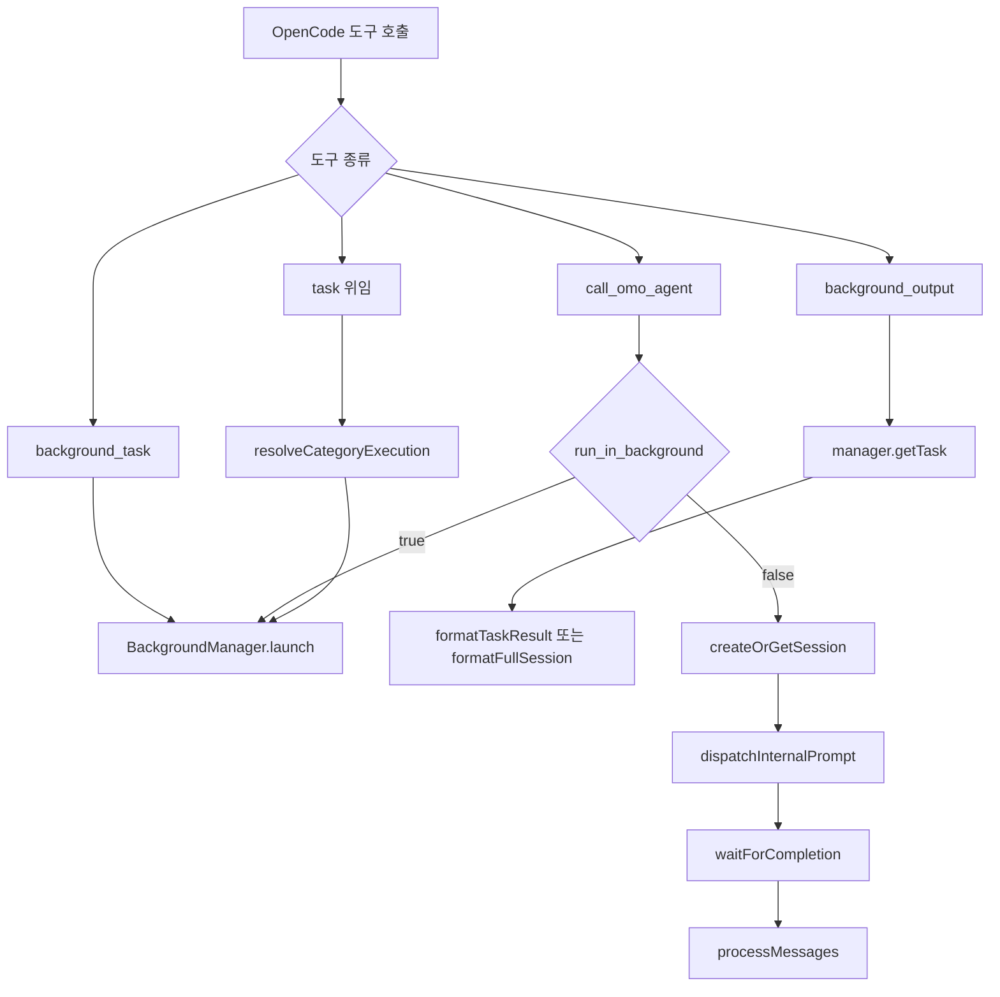

# OpenCode Tools

## 개요

`packages/omo-opencode/src/tools/`는 OpenCode 플러그인이 노출하는 도구 계층입니다. 이 계층은 `@opencode-ai/plugin`의 `tool()` API로 `ToolDefinition`을 만들고, 플러그인 초기화 단계의 도구 레지스트리에 연결됩니다.

핵심 역할은 세 가지입니다.

- 백그라운드 작업 실행과 결과 조회: `background_task`, `background_output`, `background_cancel`
- 제한된 보조 에이전트 호출: `call_omo_agent`
- 일반 위임 작업 실행: `task` 계열, category 기반 `sisyphus-junior` 실행
- 검색, 세션, 스킬, 모니터, 인터랙티브 셸, 이미지 입력 같은 보조 도구 제공

## 백그라운드 작업 도구

`background-task/`는 장시간 실행되는 에이전트 작업을 부모 세션과 분리해 실행하고, 나중에 결과를 회수하는 도구 묶음입니다.

주요 진입점은 `tools.ts`와 `index.ts`에서 재수출됩니다.

```ts
createBackgroundTask(manager, client)
createBackgroundOutput(manager, client)
createBackgroundCancel(manager, client)
```

### `createBackgroundTask`

`createBackgroundTask()`는 `BackgroundManager.launch()`를 호출해 새 백그라운드 작업을 시작합니다.

실행 흐름은 다음과 같습니다.

1. `agent` 인자가 비어 있으면 오류를 반환합니다.
2. `getMessageDir(ctx.sessionID)`로 현재 세션의 메시지 저장 위치를 찾습니다.
3. `resolveMessageContext()`로 이전 메시지와 첫 메시지의 에이전트를 읽습니다.
4. `getSessionAgent()`와 `toolContext.agent`를 함께 사용해 `parentAgent`를 결정합니다.
5. 이전 메시지의 모델 정보가 있으면 `parentModel`로 넘깁니다.
6. `manager.launch()`에 `description`, `prompt`, `agent`, 부모 세션/메시지/모델/에이전트 정보를 전달합니다.
7. 최대 30초 동안 `manager.getTask(task.id)`를 폴링해 `sessionId`가 생기는지 기다립니다.
8. `publishToolMetadata()`로 OpenCode TUI가 탐색 가능한 `sessionId` 메타데이터를 받도록 합니다.

반환 메시지는 `Task ID`, `Session ID`, `Description`, `Agent`, `Status`를 포함하며, 즉시 `background_output`을 호출하지 말고 완료 알림을 기다리라고 안내합니다.

### `createBackgroundOutput`

`createBackgroundOutput()`는 백그라운드 작업의 현재 상태, 최종 결과, 또는 전체 세션 로그를 반환합니다.

중요한 동작은 다음과 같습니다.

- `task_id`는 `bg_...` 형식의 백그라운드 작업 ID여야 합니다.
- 사용자가 `ses_...` 세션 ID를 넘기면 `formatTaskNotFoundMessage()`가 `session_read`, `session_info`, `session_search` 사용을 안내합니다.
- `getTaskWithMissingRetry()`는 `bg_...` 작업을 처음 찾지 못했을 때 100ms 후 한 번 더 조회합니다. 작업 생성 직후의 짧은 레이스를 흡수하기 위한 처리입니다.
- `block=true`이면 작업이 `pending` 또는 `running`인 동안 최대 `timeout`까지 100ms 간격으로 폴링합니다.
- `timeout`은 밀리초 단위이며 최대 600000ms로 제한됩니다.
- 작업이 아직 활성 상태인데 시간이 끝나면 `appendTimeoutNote()`가 “Timed out waiting” 안내를 붙입니다.

상태별 출력 경로는 명확히 나뉩니다.

- `full_session=true`: `formatFullSession()` 호출
- `completed`: `recordBackgroundOutputConsumption()` 후 `formatTaskResult()` 호출
- `error`, `cancelled`, `interrupt`: `formatTaskStatus()` 호출
- `pending`, `running`: `formatTaskStatus()` 호출

### `formatTaskResult`

`formatTaskResult()`는 완료된 작업의 새 출력만 보여주는 기본 결과 포맷터입니다.

동작 방식:

1. `task.sessionId`가 없으면 오류를 반환합니다.
2. `client.session.messages({ path: { id: task.sessionId } })`를 호출합니다.
3. 호출은 `withSdkCallTimeout()`으로 감싸며 기본 제한은 `DEFAULT_BACKGROUND_OUTPUT_FETCH_TIMEOUT_MS = 5000`입니다.
4. `extractMessages()`로 SDK 응답에서 메시지 배열을 정규화합니다.
5. `assistant` 또는 `tool` 역할 메시지만 남깁니다.
6. 시간순으로 정렬합니다.
7. assistant 메시지의 `info.error`가 있으면 `extractErrorMessage()`로 세션 오류를 표시합니다.
8. `consumeNewMessages(task.sessionId, sortedMessages)`로 이전 조회 이후 새 메시지만 추출합니다.
9. `text`, `reasoning`, `tool_result`의 텍스트 내용을 모아 `Task Result` 형식으로 반환합니다.

이 커서 기반 소비 방식 때문에 같은 작업을 여러 번 조회하면 이미 읽은 내용은 다시 나오지 않고 `(No new output since last check)`가 반환될 수 있습니다.

### `formatFullSession`

`formatFullSession()`은 작업 세션의 메시지를 더 원본에 가깝게 출력합니다.

지원 옵션:

- `includeThinking`: `thinking`, `reasoning` 파트 포함
- `includeToolResults`: `tool_result`, `tool_use`, `tool` 파트 포함
- `messageLimit`: 최대 100개까지 제한
- `sinceMessageId`: 특정 메시지 이후만 반환
- `thinkingMaxChars`: 사고/도구 입력 텍스트 절단 길이
- `fromEnd`: 앞이 아니라 끝에서부터 최근 메시지 반환

`formatFullSession()`은 메시지를 시간순으로 정렬하고, 필요한 파트만 남긴 뒤 다음 메타데이터를 함께 출력합니다.

- `Task ID`
- `Description`
- `Status`
- `Session ID`
- `Total messages`
- `Returned`
- `Has more`

### `createBackgroundCancel`

`createBackgroundCancel()`은 실행 중이거나 대기 중인 백그라운드 작업을 취소합니다.

두 모드를 지원합니다.

- `all=true`: 현재 세션의 모든 descendant 작업 중 `running`, `pending` 상태를 취소
- `taskId=<id>`: 특정 작업 하나만 취소

취소 시 `manager.cancelTask()`에 다음 옵션을 전달합니다.

```ts
{
  source: "background_cancel",
  abortSession: task.status === "running",
  skipNotification: true,
}
```

`running` 작업은 세션 abort를 함께 요청하고, `pending` 작업은 큐에서 제거하는 식으로 처리됩니다. 전체 취소 결과에는 작업 ID, 설명, 기존 상태, 세션 ID가 표로 출력되며, 세션 ID가 있는 작업은 `task(task_id="<task_id>", prompt="Continue: ...")` 방식으로 이어갈 수 있음을 안내합니다.

## `call_omo_agent`

`call-omo-agent/`는 `explore`와 `librarian`만 호출할 수 있는 좁은 보조 에이전트 도구입니다. 일반적인 위임은 `task` 도구가 담당하고, `call_omo_agent`는 부모 에이전트가 로컬 작업을 계속하면서 코드 탐색 또는 외부 문서 조회를 병렬로 맡길 때 쓰도록 제한되어 있습니다.

허용 에이전트는 `ALLOWED_AGENTS`에 고정되어 있습니다.

```ts
export const ALLOWED_AGENTS = [
  "explore",
  "librarian",
] as const
```

`resolveCallableAgents()`는 현재 정적 목록을 그대로 반환합니다. `clearCallableAgentsCache()`는 기존 테스트와 외부 호출자를 위한 호환성 함수로 남아 있습니다.

### `createCallOmoAgent`

`createCallOmoAgent()`는 실제 OpenCode 도구 정의를 만듭니다.

인자:

- `description`: 짧은 작업 설명
- `prompt`: 에이전트에게 전달할 작업 내용
- `subagent_type`: `explore` 또는 `librarian`
- `run_in_background`: 비동기 실행 여부
- `session_id`: 기존 동기 세션을 이어갈 때 사용

실행 시 검증 순서:

1. `subagent_type`이 비어 있으면 오류를 반환합니다.
2. `resolveCallableAgents()`로 허용 목록을 가져옵니다.
3. `stripInvisibleAgentCharacters()`로 보이지 않는 문자를 제거합니다.
4. 대소문자 무시 방식으로 허용 목록과 비교합니다.
5. `disabledAgents`에 포함되어 있으면 설정 오류를 반환합니다.
6. `resolveModelAndFallbackChain()`으로 에이전트별 모델 override와 fallback chain을 계산합니다.
7. `run_in_background=true`이면 `executeBackground()`로 보냅니다.
8. `run_in_background=false`이면 `executeSync()`로 보냅니다.

### 비동기 실행: `executeBackground`

`executeBackground()`는 `BackgroundManager.launch()`를 사용해 보조 에이전트를 백그라운드 작업으로 실행합니다.

주요 연결점:

- `resolveMessageContext()`와 `getSessionAgent()`로 부모 에이전트를 결정합니다.
- `getSessionTools(parentSessionId)`로 부모 세션의 도구 제한을 상속합니다.
- `sanitizeSubagentType()`, `stripAgentListSortPrefix()`, `getAgentDisplayName()`으로 에이전트 이름을 정규화합니다.
- `model`과 `fallbackChain`을 `manager.launch()`에 전달합니다.
- 최대 30초 동안 `sessionId` 생성을 기다린 뒤 `toolContext.metadata()`에 저장합니다.

`session_id`는 백그라운드 모드에서 지원하지 않습니다. 기존 세션을 이어가려면 `run_in_background=false`를 사용해야 합니다.

### 동기 실행: `executeSync`

`executeSync()`는 별도 OpenCode 세션을 만들거나 기존 세션을 사용해 프롬프트를 보내고, 완료될 때까지 기다린 뒤 새 출력만 반환합니다.

핵심 단계:

1. `createOrGetSession()`으로 세션을 가져오거나 생성합니다.
2. 새 세션이면 `BackgroundManager.reserveSubagentSpawn()` 예약을 확정합니다.
3. fallback chain이 있으면 `setSessionFallbackChain()`으로 세션에 연결합니다.
4. `applySessionPromptParams()`로 모델 파라미터를 저장합니다.
5. `metadata()`에 `sessionId`를 게시합니다.
6. `normalizeAgentForPrompt()`로 OpenCode prompt용 agent 이름을 정규화합니다.
7. `buildSyncPromptTools()`로 도구 제한을 만듭니다.
8. `setSessionAgent()`, `setSessionTools()`, `registerDelegatedChildSessionBootstrap()`으로 세션 상태를 등록합니다.
9. `dispatchInternalPrompt()`로 실제 프롬프트를 전송합니다.
10. `waitForCompletion()`으로 완료를 감지합니다.
11. `processMessages()`로 새 assistant/tool 출력만 추출합니다.
12. 결과 끝에 `<task_metadata>` 블록으로 `session_id`를 붙입니다.

`finally` 블록에서는 생성된 동기 세션의 상태를 정리합니다.

- fallback chain 제거
- delegated bootstrap 제거
- `subagentSessions`, `syncSubagentSessions`에서 제거
- 세션 도구와 에이전트 상태 제거
- `handedBackSyncSessions`에 추가
- 가능하면 `ctx.client.session.abort()` 호출

이 abort는 이미 완료된 동기 subagent 세션이 todo continuation hook에 의해 다시 깨어나는 것을 막기 위한 방어 장치입니다.

### 완료 감지와 메시지 처리

`waitForCompletion()`은 OpenCode 세션 상태와 메시지 수를 함께 봅니다.

- 500ms 간격으로 폴링합니다.
- 최대 5분까지 기다립니다.
- 30초 동안 프롬프트가 수락된 흔적이 없으면 오류를 냅니다.
- 세션 상태가 idle이고 메시지 수가 3번 연속 안정되면 완료로 봅니다.

`processMessages()`는 `assistant`와 `tool` 역할 메시지만 대상으로 삼고, `consumeNewMessages()`로 새 메시지만 처리합니다. `text`, `reasoning`, `tool_result.content`에서 실제 텍스트를 추출합니다.

## `task` 위임 도구와 category 실행

`delegate-task/`는 더 일반적인 위임 도구 계층입니다. `call_omo_agent`가 `explore`, `librarian` 전용인 반면, `task` 계열은 category, skill, 모델 설정, fallback, 동기/비동기 실행을 다룹니다.

### category 설정

category 기본값은 `builtin-categories.ts`에서 조합됩니다.

```ts
const BUILTIN_CATEGORIES = [
  ...GOOGLE_CATEGORIES,
  ...OPENAI_CATEGORIES,
  ...ANTHROPIC_CATEGORIES,
  ...KIMI_CATEGORIES,
]
```

여기에서 다음 맵이 만들어집니다.

- `DEFAULT_CATEGORIES`
- `CATEGORY_PROMPT_APPENDS`
- `CATEGORY_DESCRIPTIONS`
- `CATEGORY_PROMPT_APPEND_RESOLVERS`

`resolveCategoryConfig()`는 기본 category 설정과 사용자 설정을 병합합니다. 모델 우선순위는 다음과 같습니다.

1. 사용자 category 모델
2. 내장 category 기본 모델
3. 시스템 기본 모델

사용자 설정에 `disable`이 있으면 해당 category는 해석되지 않습니다. 특정 category가 `CATEGORY_MODEL_REQUIREMENTS`에서 필수 모델을 요구하고, 사용자가 별도 설정하지 않았으며, 현재 연결된 provider에 모델이 없으면 사용할 수 없습니다.

### `resolveCategoryExecution`

`resolveCategoryExecution()`은 category 기반 작업을 실제 실행 가능한 에이전트와 모델 설정으로 바꿉니다.

반환값에는 다음이 포함됩니다.

- `agentToUse`: 보통 `SISYPHUS_JUNIOR_AGENT`
- `categoryModel`: `DelegatedModelConfig`
- `categoryPromptAppend`
- `maxPromptTokens`
- `modelInfo`
- `actualModel`
- `isUnstableAgent`
- `fallbackChain`
- `error`

이 함수는 다음 정보를 함께 사용합니다.

- `mergeCategories(userCategories)`
- `getAvailableModelsForDelegateTask(client)`
- `resolveCategoryConfig()`
- `resolveModelForDelegateTask()`
- `parseModelString()`
- `buildFallbackChainFromModels()`
- `findMostSpecificFallbackEntry()`
- `applyCategoryParams()`

Gemini 또는 Minimax 계열 모델은 기본적으로 unstable agent로 취급될 수 있으며, 사용자 설정의 `is_unstable_agent`가 있으면 그 값이 우선합니다.

### 비동기 위임: `executeBackgroundTask`

`executeBackgroundTask()`는 category 또는 agent로 결정된 작업을 백그라운드에서 시작합니다.

중요한 처리:

- `buildTaskPrompt()`로 사용자 프롬프트를 실행 프롬프트로 변환합니다.
- `getPersistedBackgroundTaskDescription()`으로 저장될 설명을 결정합니다.
- `manager.launch()`에 부모 세션, 부모 메시지, 부모 모델, 부모 에이전트, 부모 도구, 모델, fallback chain, skill, category, permission 정보를 전달합니다.
- `waitForBackgroundSessionStart()`로 세션 ID가 생길 때까지 기다립니다.
- 세션 ID가 생기면 `registerBackgroundSessionContext()`가 fallback chain과 category를 세션에 등록합니다.
- `publishToolMetadata()`로 TUI에 `taskId`, `sessionId`, `backgroundTaskId`, 모델 정보를 노출합니다.
- `buildTaskMetadataBlock()`으로 후속 도구가 사용할 수 있는 메타데이터 블록을 반환 메시지에 포함합니다.

작업 시작 직후 `sessionId`가 없는 경우를 대비해, 대기 루프 이후 한 번 더 `manager.getTask(task.id)`를 확인합니다. 이는 OpenCode TUI에서 subagent 항목이 영구 spinner로 남는 문제를 줄이기 위한 레이스 대응입니다.

### 백그라운드 continuation

`executeBackgroundContinuation()`은 기존 백그라운드 작업 세션에 새 프롬프트를 이어 붙입니다.

- `getTaskID(args)`로 이어갈 세션을 찾습니다.
- `systemContent`가 있으면 사용자 프롬프트 앞에 합칩니다.
- `manager.resume()`으로 기존 세션을 이어갑니다.
- `publishToolMetadata()`와 `buildTaskMetadataBlock()`으로 새 background task ID와 기존 session ID를 노출합니다.

## 도구 흐름 요약



## SDK 응답 정규화와 타임아웃

백그라운드 출력 계층은 OpenCode SDK 응답 형태가 배열 또는 `{ data, error }` 형태일 수 있음을 고려합니다.

`session-messages.ts`의 함수가 이 차이를 흡수합니다.

- `getErrorMessage(value)`: SDK 응답의 `error`를 문자열로 추출
- `extractMessages(value)`: 배열 또는 `data`에서 유효한 메시지 객체만 추출

`with-sdk-call-timeout.ts`는 `client.session.messages()`가 무기한 멈추는 것을 막습니다. 기본 제한은 5초입니다.

```ts
export const DEFAULT_BACKGROUND_OUTPUT_FETCH_TIMEOUT_MS = 5_000
```

테스트에서는 `_setBackgroundOutputFetchTimeoutMsForTesting()`로 이 값을 바꿀 수 있습니다.

## 메타데이터 계약

여러 도구는 `toolContext.metadata()` 또는 `publishToolMetadata()`를 호출해 OpenCode TUI와 후속 훅이 사용할 정보를 제공합니다.

대표 메타데이터:

- `sessionId`
- `taskId`
- `backgroundTaskId`
- `agent`
- `category`
- `description`
- `prompt`
- `model`
- `run_in_background`
- `load_skills`
- `command`

특히 `sessionId`는 TUI에서 subagent 항목을 클릭 가능한 대상으로 만들고, 도구 호출 수를 계산하는 기준이 됩니다. 그래서 `createBackgroundTask()`, `executeBackground()`, `executeBackgroundTask()` 모두 작업 시작 직후 짧게 세션 생성을 기다린 뒤 메타데이터를 게시합니다.

## 검색, 스킬, 세션, 기타 도구와의 연결

제공된 실행 흐름에서 확인되는 다른 도구 계층은 다음 역할을 갖습니다.

- `grep/cli.ts`: `runRg()`, `runRgCountInternal()`이 검색 실행을 담당하고 `tools/shared/semaphore.ts`의 `acquire()`로 동시성을 제한합니다.
- `glob/cli.ts`: `runRgFilesInternal()`이 파일 목록 검색을 수행하며 `getFileMtime()`로 수정 시간을 함께 다룹니다.
- `skill/tools.ts`: `createSkillTool()`이 skill 도구를 만들고, `formatCombinedDescription()`, `formatMcpCapabilities()`, `getSkills()`로 설명과 MCP 기능 정보를 구성합니다.
- `task/task-create.ts`, `task-get.ts`, `task-list.ts`, `task-update.ts`: `features/claude-tasks/storage.ts`의 `getTaskDir()`, `readJsonSafe()`, `writeJsonAtomic()`, `generateTaskId()`와 연결됩니다.
- `session-manager/`: SDK 세션과 파일 기반 세션 저장소를 함께 다루며 `getMainSessions()`, `readSessionTodos()`, `sessionExists()` 같은 함수가 SDK 또는 파일 저장소로 위임합니다.
- `look-at/`: `prepareLookAtInput()`, `runLookAtSession()`, `buildLookAtPrompt()`가 이미지 입력 변환과 전용 세션 실행을 담당합니다.
- `interactive-bash/tools.ts`: `executeInteractiveBash()`가 셸 명령 실행을 처리하며, `findSubcommandIndex()`와 종료 오류 무시 로직을 사용합니다.
- `monitor/`: `monitor-start.ts`, `monitor-output.ts`가 monitor manager와 permission/filter 계층에 연결됩니다.

## 기여 시 주의점

도구 계층은 OpenCode 세션 상태, 백그라운드 작업 상태, TUI 메타데이터, 훅 기반 continuation이 서로 맞물려 있습니다. 작은 변경도 다음 영역에 영향을 줄 수 있습니다.

- 작업 ID와 세션 ID 구분: `bg_...`와 `ses_...`를 혼동하면 `background_output` UX가 깨집니다.
- `sessionId` 메타데이터 게시 타이밍: 너무 빨리 반환하면 TUI가 탐색 대상을 얻지 못할 수 있습니다.
- `consumeNewMessages()` 사용: 결과 조회가 누적 출력인지 새 출력인지 도구별 계약을 확인해야 합니다.
- 동기 subagent 정리: `executeSync()`의 cleanup은 todo continuation 재실행을 막는 핵심 방어선입니다.
- SDK 호출 타임아웃: `formatTaskResult()`와 `formatFullSession()`은 `withSdkCallTimeout()`을 유지해야 부모 명령 전체가 멈추지 않습니다.
- category 모델 해석: `resolveCategoryExecution()`은 사용자 override, provider 가용성, fallback chain, category별 prompt append를 함께 처리합니다.

관련 테스트는 각 도구의 계약을 잘 보여줍니다.

- `tools/background-task/create-background-task.test.ts`
- `tools/background-task/create-background-output.blocking.test.ts`
- `tools/background-task/full-session-format.test.ts`
- `tools/background-task/task-result-format.test.ts`
- `tools/background-task/sdk-call-timeout.test.ts`
- `tools/call-omo-agent/agent-restriction.test.ts`
- `tools/call-omo-agent/completion-poller.test.ts`
- `tools/call-omo-agent/sync-executor-reawaken-guard.test.ts`
- `tools/delegate-task/category-resolver.test.ts`
- `tools/delegate-task/metadata-await.test.ts`